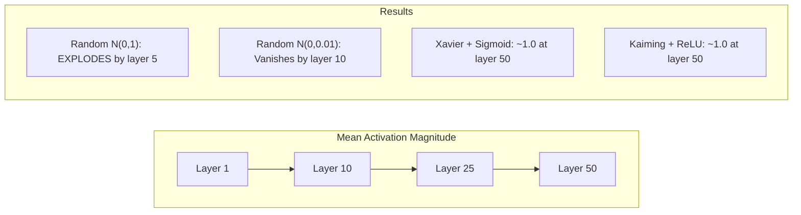
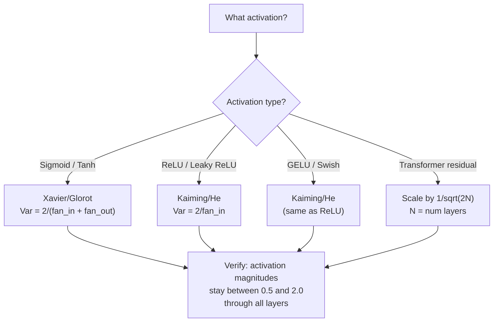

# Khởi tạo trọng số và Độ ổn định trong huấn luyện

> Khởi tạo sai, quá trình huấn luyện không bao giờ bắt đầu. Khởi tạo đúng, 50 lớp mạng sẽ huấn luyện mượt mà như 3 lớp.

**Type:** Build
**Languages:** Python
**Prerequisites:** Bài 03.04 (Hàm kích hoạt), Bài 03.07 (Điều chuẩn)
**Time:** ~90 phút

## Mục tiêu học tập

- Triển khai các chiến lược khởi tạo: zero, random, Xavier/Glorot và Kaiming/He; đo lường ảnh hưởng của chúng đến độ lớn của các activation qua 50 lớp.
- Suy luận lý do tại sao Xavier init sử dụng Var(w) = 2/(fan_in + fan_out) và Kaiming sử dụng Var(w) = 2/fan_in.
- Chứng minh vấn đề đối xứng (symmetry problem) với khởi tạo bằng 0 và giải thích tại sao chỉ dùng thang đo ngẫu nhiên là không đủ.
- Kết hợp chiến lược khởi tạo phù hợp với hàm kích hoạt: Xavier cho sigmoid/tanh, Kaiming cho ReLU/GELU.

## Vấn đề

Khởi tạo tất cả trọng số bằng 0. Không có gì được học cả. Mỗi neuron tính toán cùng một hàm, nhận cùng một gradient và cập nhật giống hệt nhau. Sau 10.000 epoch, lớp ẩn 512-neuron của bạn vẫn chỉ là 512 bản sao của cùng một neuron. Bạn trả phí cho 512 tham số nhưng chỉ nhận lại 1.

Khởi tạo chúng quá lớn. Các activation bùng nổ qua mạng. Đến lớp thứ 10, giá trị đạt 1e15. Đến lớp thứ 20, chúng tràn số (overflow) đến vô cùng. Gradient cũng đi theo quỹ đạo tương tự theo chiều ngược lại.

Khởi tạo chúng ngẫu nhiên từ phân phối chuẩn tiêu chuẩn. Hoạt động tốt với 3 lớp. Ở 50 lớp, tín hiệu sụp đổ về 0 hoặc bùng nổ đến vô cùng tùy thuộc vào việc thang đo ngẫu nhiên hơi nhỏ hay hơi lớn. Ranh giới giữa "hoạt động" và "hỏng" là cực kỳ mong manh.

Khởi tạo trọng số là quyết định bị đánh giá thấp nhất trong deep learning. Kiến trúc nhận được các bài báo khoa học. Optimizer nhận được các bài blog. Khởi tạo chỉ nhận được một dòng chú thích. Nhưng nếu làm sai, mọi thứ khác đều vô nghĩa -- mạng của bạn đã "chết" trước khi quá trình huấn luyện bắt đầu.

## Khái niệm

### Vấn đề đối xứng (The Symmetry Problem)

Mỗi neuron trong một lớp có cùng cấu trúc: nhân đầu vào với trọng số, cộng bias, áp dụng hàm kích hoạt. Nếu tất cả trọng số bắt đầu bằng cùng một giá trị (0 là trường hợp cực đoan), mọi neuron đều tính toán ra cùng một đầu ra. Trong quá trình lan truyền ngược (backpropagation), mọi neuron nhận cùng một gradient. Trong bước cập nhật, mọi neuron thay đổi cùng một lượng.

Bạn bị mắc kẹt. Mạng có hàng trăm tham số, nhưng tất cả đều di chuyển đồng bộ. Đây gọi là tính đối xứng, và khởi tạo ngẫu nhiên là cách "thô bạo" để phá vỡ nó. Mỗi neuron bắt đầu tại một điểm khác nhau trong không gian trọng số, vì vậy mỗi neuron học một đặc trưng khác nhau.

Nhưng "ngẫu nhiên" là chưa đủ. *Thang đo* (scale) của sự ngẫu nhiên quyết định liệu mạng có huấn luyện được hay không.

### Lan truyền phương sai qua các lớp

Xét một lớp đơn lẻ với fan_in đầu vào:

```
z = w1*x1 + w2*x2 + ... + w_n*x_n
```

Nếu mỗi trọng số wi được lấy từ một phân phối có phương sai Var(w) và mỗi đầu vào xi có phương sai Var(x), phương sai đầu ra là:

```
Var(z) = fan_in * Var(w) * Var(x)
```

Nếu Var(w) = 1 và fan_in = 512, phương sai đầu ra gấp 512 lần phương sai đầu vào. Sau 10 lớp: 512^10 = 1.2e27. Tín hiệu của bạn đã bùng nổ.

Nếu Var(w) = 0.001, phương sai đầu ra co lại theo hệ số 0.001 * 512 = 0.512 mỗi lớp. Sau 10 lớp: 0.512^10 = 0.00013. Tín hiệu của bạn đã biến mất.

Mục tiêu: chọn Var(w) sao cho Var(z) = Var(x). Độ lớn tín hiệu giữ nguyên qua các lớp.

### Khởi tạo Xavier/Glorot

Glorot và Bengio (2010) đã đưa ra giải pháp cho các hàm kích hoạt sigmoid và tanh. Để giữ phương sai không đổi trong cả quá trình lan truyền xuôi và ngược:

```
Var(w) = 2 / (fan_in + fan_out)
```

Trong thực tế, trọng số được lấy từ:

```
w ~ Uniform(-limit, limit)  where limit = sqrt(6 / (fan_in + fan_out))
```

hoặc:

```
w ~ Normal(0, sqrt(2 / (fan_in + fan_out)))
```

Cách này hiệu quả vì sigmoid và tanh xấp xỉ tuyến tính gần điểm 0, nơi các activation được khởi tạo đúng cách thường nằm ở đó. Phương sai duy trì ổn định qua hàng chục lớp.

### Khởi tạo Kaiming/He

ReLU triệt tiêu một nửa đầu ra (mọi giá trị âm đều trở thành 0). fan_in hiệu dụng bị giảm một nửa vì trung bình một nửa đầu vào bị triệt tiêu. Xavier init không tính đến điều này -- nó đánh giá thấp phương sai cần thiết.

He và cộng sự (2015) đã điều chỉnh công thức:

```
Var(w) = 2 / fan_in
```

Trọng số được lấy từ:

```
w ~ Normal(0, sqrt(2 / fan_in))
```

Hệ số 2 bù đắp cho việc ReLU triệt tiêu một nửa các activation. Nếu không có nó, tín hiệu sẽ co lại ~0.5x mỗi lớp. Với 50 lớp: 0.5^50 = 8.8e-16. Kaiming init ngăn chặn điều này.

### Khởi tạo Transformer

GPT-2 giới thiệu một mô hình khác. Các kết nối tắt (residual connections) cộng đầu ra của mỗi lớp con vào đầu vào của nó:

```
x = x + sublayer(x)
```

Mỗi phép cộng làm tăng phương sai. Với N lớp residual, phương sai tăng tỷ lệ thuận với N. GPT-2 điều chỉnh trọng số của các lớp residual theo hệ số 1/sqrt(2N), trong đó N là số lớp. Điều này giữ cho độ lớn tín hiệu tích lũy ổn định.

Llama 3 (405B tham số, 126 lớp) sử dụng một mô hình tương tự. Nếu không có sự điều chỉnh này, dòng residual sẽ tăng không kiểm soát qua 126 lớp attention và feedforward.

```mermaid
flowchart TD
    subgraph "Zero Init"
        Z1["Layer 1<br/>All weights = 0"] --> Z2["Layer 2<br/>All neurons identical"]
        Z2 --> Z3["Layer 3<br/>Still identical"]
        Z3 --> ZR["Result: 1 effective neuron<br/>regardless of width"]
    end

    subgraph "Xavier Init"
        X1["Layer 1<br/>Var = 2/(fan_in+fan_out)"] --> X2["Layer 2<br/>Signal stable"]
        X2 --> X3["Layer 50<br/>Signal stable"]
        X3 --> XR["Result: Trains with<br/>sigmoid/tanh"]
    end

    subgraph "Kaiming Init"
        K1["Layer 1<br/>Var = 2/fan_in"] --> K2["Layer 2<br/>Signal stable"]
        K2 --> K3["Layer 50<br/>Signal stable"]
        K3 --> KR["Result: Trains with<br/>ReLU/GELU"]
    end
```



### Độ lớn Activation qua 50 lớp



### Chọn cách khởi tạo phù hợp



```figure
weight-init-variance
```

## Xây dựng

### Bước 1: Các chiến lược khởi tạo

Bốn cách để khởi tạo một ma trận trọng số. Mỗi cách trả về một danh sách các danh sách (ma trận 2D) với fan_in cột và fan_out hàng.

```python
import math
import random


def zero_init(fan_in, fan_out):
    return [[0.0 for _ in range(fan_in)] for _ in range(fan_out)]


def random_init(fan_in, fan_out, scale=1.0):
    return [[random.gauss(0, scale) for _ in range(fan_in)] for _ in range(fan_out)]


def xavier_init(fan_in, fan_out):
    std = math.sqrt(2.0 / (fan_in + fan_out))
    return [[random.gauss(0, std) for _ in range(fan_in)] for _ in range(fan_out)]


def kaiming_init(fan_in, fan_out):
    std = math.sqrt(2.0 / fan_in)
    return [[random.gauss(0, std) for _ in range(fan_in)] for _ in range(fan_out)]
```

### Bước 2: Hàm kích hoạt

Chúng ta cần sigmoid, tanh và ReLU để kiểm tra từng chiến lược khởi tạo với hàm kích hoạt tương ứng.

```python
def sigmoid(x):
    x = max(-500, min(500, x))
    return 1.0 / (1.0 + math.exp(-x))


def tanh_act(x):
    return math.tanh(x)


def relu(x):
    return max(0.0, x)
```

### Bước 3: Lan truyền xuôi qua 50 lớp

Truyền dữ liệu ngẫu nhiên qua một mạng sâu và đo độ lớn trung bình của activation tại mỗi lớp.

```python
def forward_deep(init_fn, activation_fn, n_layers=50, width=64, n_samples=100):
    random.seed(42)
    layer_magnitudes = []

    inputs = [[random.gauss(0, 1) for _ in range(width)] for _ in range(n_samples)]

    for layer_idx in range(n_layers):
        weights = init_fn(width, width)
        biases = [0.0] * width

        new_inputs = []
        for sample in inputs:
            output = []
            for neuron_idx in range(width):
                z = sum(weights[neuron_idx][j] * sample[j] for j in range(width)) + biases[neuron_idx]
                output.append(activation_fn(z))
            new_inputs.append(output)
        inputs = new_inputs

        magnitudes = []
        for sample in inputs:
            magnitudes.append(sum(abs(v) for v in sample) / width)
        mean_mag = sum(magnitudes) / len(magnitudes)
        layer_magnitudes.append(mean_mag)

    return layer_magnitudes
```

### Bước 4: Thí nghiệm

Chạy tất cả các kết hợp: zero init, random N(0,1), random N(0,0.01), Xavier với sigmoid, Xavier với tanh, Kaiming với ReLU. In ra độ lớn tại các lớp quan trọng.

```python
def run_experiment():
    configs = [
        ("Zero init + Sigmoid", lambda fi, fo: zero_init(fi, fo), sigmoid),
        ("Random N(0,1) + ReLU", lambda fi, fo: random_init(fi, fo, 1.0), relu),
        ("Random N(0,0.01) + ReLU", lambda fi, fo: random_init(fi, fo, 0.01), relu),
        ("Xavier + Sigmoid", xavier_init, sigmoid),
        ("Xavier + Tanh", xavier_init, tanh_act),
        ("Kaiming + ReLU", kaiming_init, relu),
    ]

    print(f"{'Strategy':<30} {'L1':>10} {'L5':>10} {'L10':>10} {'L25':>10} {'L50':>10}")
    print("-" * 80)

    for name, init_fn, act_fn in configs:
        mags = forward_deep(init_fn, act_fn)
        row = f"{name:<30}"
        for idx in [0, 4, 9, 24, 49]:
            val = mags[idx]
            if val > 1e6:
                row += f" {'EXPLODED':>10}"
            elif val < 1e-6:
                row += f" {'VANISHED':>10}"
            else:
                row += f" {val:>10.4f}"
        print(row)
```

### Bước 5: Chứng minh tính đối xứng

Cho thấy zero init tạo ra các neuron giống hệt nhau.

```python
def symmetry_demo():
    random.seed(42)
    weights = zero_init(2, 4)
    biases = [0.0] * 4

    inputs = [0.5, -0.3]
    outputs = []
    for neuron_idx in range(4):
        z = sum(weights[neuron_idx][j] * inputs[j] for j in range(2)) + biases[neuron_idx]
        outputs.append(sigmoid(z))

    print("\nSymmetry Demo (4 neurons, zero init):")
    for i, out in enumerate(outputs):
        print(f"  Neuron {i}: output = {out:.6f}")
    all_same = all(abs(outputs[i] - outputs[0]) < 1e-10 for i in range(len(outputs)))
    print(f"  All identical: {all_same}")
    print(f"  Effective parameters: 1 (not {len(weights) * len(weights[0])})")
```

### Bước 6: Báo cáo độ lớn theo từng lớp

In ra biểu đồ cột về độ lớn activation qua 50 lớp.

```python
def magnitude_report(name, magnitudes):
    print(f"\n{name}:")
    for i, mag in enumerate(magnitudes):
        if i % 5 == 0 or i == len(magnitudes) - 1:
            if mag > 1e6:
                bar = "X" * 50 + " EXPLODED"
            elif mag < 1e-6:
                bar = "." + " VANISHED"
            else:
                bar_len = min(50, max(1, int(mag * 10)))
                bar = "#" * bar_len
            print(f"  Layer {i+1:3d}: {bar} ({mag:.6f})")
```

## Sử dụng

PyTorch cung cấp các hàm này dưới dạng tích hợp sẵn:

```python
import torch
import torch.nn as nn

layer = nn.Linear(512, 256)

nn.init.xavier_uniform_(layer.weight)
nn.init.xavier_normal_(layer.weight)

nn.init.kaiming_uniform_(layer.weight, nonlinearity='relu')
nn.init.kaiming_normal_(layer.weight, nonlinearity='relu')

nn.init.zeros_(layer.bias)
```

Khi bạn gọi `nn.Linear(512, 256)`, PyTorch mặc định sử dụng khởi tạo Kaiming uniform. Đó là lý do tại sao hầu hết các mạng đơn giản "chỉ cần chạy là được" -- PyTorch đã đưa ra lựa chọn đúng đắn. Nhưng khi bạn xây dựng các kiến trúc tùy chỉnh hoặc đi sâu hơn 20 lớp, bạn cần hiểu điều gì đang xảy ra và có khả năng ghi đè giá trị mặc định.

Đối với các transformer, các mô hình HuggingFace thường xử lý khởi tạo trong phương thức `_init_weights` của chúng. Triển khai của GPT-2 điều chỉnh các phép chiếu residual theo 1/sqrt(N). Nếu bạn đang xây dựng một transformer từ đầu, bạn cần tự thêm phần này.

## Triển khai

Bài học này tạo ra:
- `outputs/prompt-init-strategy.md` -- một prompt giúp chẩn đoán các vấn đề về khởi tạo trọng số và đề xuất chiến lược phù hợp.

## Bài tập

1. Thêm khởi tạo LeCun (Var = 1/fan_in, được thiết kế cho hàm kích hoạt SELU). Chạy thí nghiệm 50 lớp với LeCun init + tanh và so sánh với Xavier + tanh.

2. Triển khai điều chỉnh residual của GPT-2: nhân đầu ra của mỗi lớp với 1/sqrt(2*N) trước khi cộng vào dòng residual. Chạy 50 lớp với và không có điều chỉnh, đo lường tốc độ tăng trưởng của độ lớn residual.

3. Tạo một hàm "kiểm tra sức khỏe khởi tạo" nhận vào kích thước lớp và loại hàm kích hoạt của mạng, sau đó đề xuất cách khởi tạo đúng và cảnh báo nếu cách khởi tạo hiện tại gây ra vấn đề.

4. Chạy thí nghiệm với fan_in = 16 so với fan_in = 1024. Xavier và Kaiming thích nghi với fan_in, nhưng random init thì không. Hãy cho thấy khoảng cách giữa "hoạt động" và "hỏng" nới rộng như thế nào với các lớp lớn hơn.

5. Triển khai khởi tạo trực giao (tạo ma trận ngẫu nhiên, tính SVD của nó, sử dụng ma trận trực giao U). So sánh với Kaiming cho các mạng ReLU ở 50 lớp.

## Thuật ngữ chính

| Thuật ngữ | Cách gọi thông thường | Ý nghĩa thực tế |
|------|----------------|----------------------|
| Weight initialization | "Đặt trọng số bắt đầu ngẫu nhiên" | Chiến lược chọn giá trị trọng số ban đầu quyết định liệu mạng có thể huấn luyện được hay không |
| Symmetry breaking | "Làm cho các neuron khác nhau" | Sử dụng khởi tạo ngẫu nhiên để đảm bảo các neuron học các đặc trưng riêng biệt thay vì tính toán cùng một hàm |
| Fan-in | "Số lượng đầu vào của một neuron" | Số lượng kết nối đến, quyết định cách phương sai đầu vào tích lũy trong tổng có trọng số |
| Fan-out | "Số lượng đầu ra của một neuron" | Số lượng kết nối đi, liên quan đến việc duy trì phương sai gradient trong lan truyền ngược |
| Xavier/Glorot init | "Khởi tạo sigmoid" | Var(w) = 2/(fan_in + fan_out), được thiết kế để bảo toàn phương sai qua các hàm sigmoid và tanh |
| Kaiming/He init | "Khởi tạo ReLU" | Var(w) = 2/fan_in, tính đến việc ReLU triệt tiêu một nửa các activation |
| Variance propagation | "Cách tín hiệu tăng hoặc giảm qua các lớp" | Phân tích toán học về cách phương sai activation thay đổi theo từng lớp dựa trên thang đo trọng số |
| Residual scaling | "Mẹo khởi tạo của GPT-2" | Điều chỉnh trọng số kết nối residual theo 1/sqrt(2N) để ngăn chặn sự tăng trưởng phương sai qua N lớp transformer |
| Dead network | "Không có gì huấn luyện được" | Một mạng mà việc khởi tạo kém khiến tất cả gradient bằng 0 hoặc tất cả activation bị bão hòa |
| Exploding activations | "Giá trị tiến tới vô cùng" | Khi phương sai trọng số quá cao, khiến độ lớn activation tăng theo hàm mũ qua các lớp |

## Đọc thêm

- Glorot & Bengio, "Understanding the difficulty of training deep feedforward neural networks" (2010) -- bài báo gốc về Xavier initialization với phân tích phương sai.
- He và cộng sự, "Delving Deep into Rectifiers" (2015) -- giới thiệu Kaiming initialization cho các mạng ReLU.
- Radford và cộng sự, "Language Models are Unsupervised Multitask Learners" (2019) -- bài báo về GPT-2 với khởi tạo điều chỉnh residual.
- Mishkin & Matas, "All You Need is a Good Init" (2016) -- khởi tạo phương sai đơn vị theo lớp (layer-sequential unit-variance), một giải pháp thay thế thực nghiệm cho các công thức giải tích.