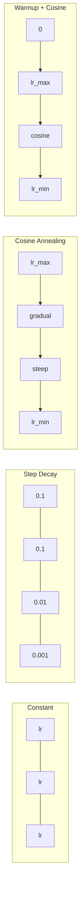
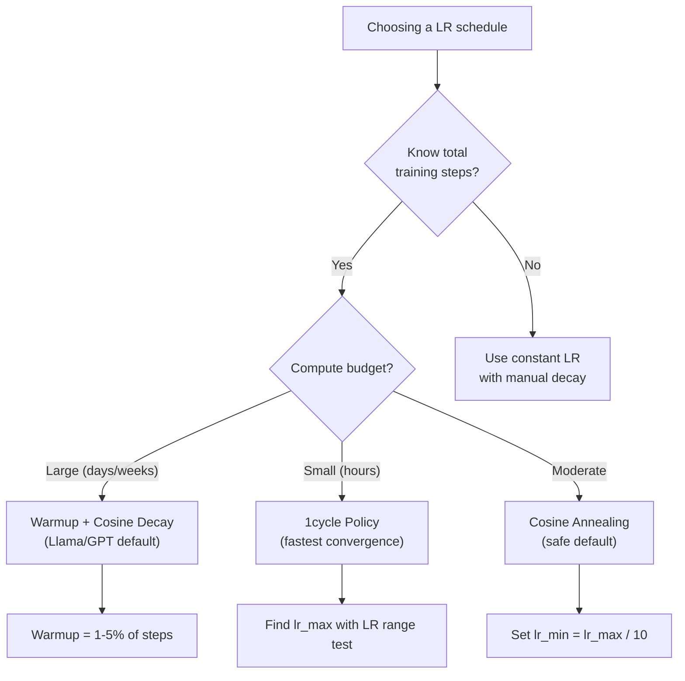
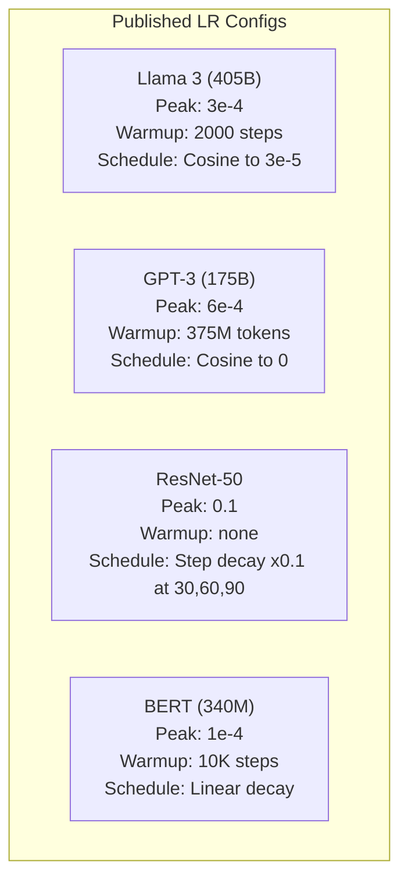

# Learning Rate Schedules and Warmup

> Learning rate là siêu tham số quan trọng nhất. Không phải kiến trúc. Không phải kích thước tập dữ liệu. Không phải hàm kích hoạt. Chính là learning rate. Nếu bạn không tinh chỉnh gì khác, hãy tinh chỉnh cái này.

**Type:** Build
**Languages:** Python
**Prerequisites:** Lesson 03.06 (Optimizers), Lesson 03.08 (Weight Initialization)
**Time:** ~90 phút

## Mục tiêu học tập

- Triển khai từ đầu các lịch trình learning rate: hằng số (constant), giảm dần theo bước (step decay), cosine annealing, warmup + cosine, và 1cycle.
- Chứng minh ba chế độ thất bại khi chọn learning rate: phân kỳ (quá cao), đình trệ (quá thấp), và dao động (không giảm dần).
- Giải thích tại sao warmup là cần thiết cho các bộ tối ưu hóa dựa trên Adam và cách nó ổn định quá trình huấn luyện ban đầu.
- So sánh tốc độ hội tụ giữa cả năm lịch trình trên cùng một tác vụ và chọn lịch trình phù hợp cho ngân sách huấn luyện nhất định.

## Vấn đề

Đặt learning rate là 0.1. Quá trình huấn luyện bị phân kỳ -- loss nhảy vọt lên vô cùng chỉ trong 3 bước. Đặt nó là 0.0001. Quá trình huấn luyện diễn ra cực chậm -- sau 100 epoch, mô hình hầu như không thay đổi so với trạng thái ngẫu nhiên. Đặt nó là 0.01. Quá trình huấn luyện hoạt động tốt trong 50 epoch, sau đó loss dao động quanh một giá trị tối thiểu mà nó không bao giờ đạt tới được vì các bước nhảy quá lớn.

Learning rate tối ưu không phải là một hằng số. Nó thay đổi trong suốt quá trình huấn luyện. Ở giai đoạn đầu, bạn muốn các bước nhảy lớn để bao quát không gian nhanh chóng. Ở giai đoạn cuối, bạn muốn các bước nhảy nhỏ để ổn định tại một điểm tối thiểu sắc nét. Sự khác biệt giữa một mô hình có độ chính xác 90% và 95% thường chỉ nằm ở lịch trình.

Mọi mô hình lớn được công bố trong ba năm qua đều sử dụng lịch trình learning rate. Llama 3 sử dụng peak lr=3e-4 với 2000 bước warmup và cosine decay xuống 3e-5. GPT-3 sử dụng lr=6e-4 với warmup trên 375 triệu token. Đây không phải là những lựa chọn tùy ý. Chúng là kết quả của các đợt quét siêu tham số tốn kém hàng triệu đô la.

Bạn cần hiểu về các lịch trình vì các giá trị mặc định sẽ không hiệu quả với vấn đề của bạn. Khi bạn fine-tune một mô hình đã được huấn luyện trước, lịch trình phù hợp sẽ khác với việc huấn luyện từ đầu. Khi bạn tăng kích thước batch, giai đoạn warmup cần phải thay đổi. Khi quá trình huấn luyện bị hỏng ở bước 10.000, bạn cần biết đó là vấn đề về lịch trình hay thứ gì khác.

## Khái niệm

### Constant Learning Rate

Cách tiếp cận đơn giản nhất. Chọn một con số và sử dụng nó cho mọi bước.

```
lr(t) = lr_0
```

Hiếm khi là tối ưu. Nó hoặc là quá cao cho giai đoạn cuối của quá trình huấn luyện (gây dao động quanh điểm tối thiểu) hoặc quá thấp cho giai đoạn đầu (lãng phí tài nguyên tính toán cho các bước nhỏ). Hoạt động ổn với các mô hình nhỏ và gỡ lỗi. Một lựa chọn tồi cho bất kỳ thứ gì huấn luyện lâu hơn một giờ.

### Step Decay

Cách tiếp cận kiểu cũ từ thời ResNet. Giảm learning rate theo một hệ số (thường là 10x) tại các epoch cố định.

```
lr(t) = lr_0 * gamma^(floor(epoch / step_size))
```

Trong đó gamma = 0.1 và step_size = 30 có nghĩa là: lr giảm 10 lần sau mỗi 30 epoch. ResNet-50 đã sử dụng cách này -- lr=0.1, giảm 10 lần tại các epoch 30, 60, và 90.

Vấn đề: các điểm giảm tối ưu phụ thuộc vào tập dữ liệu và kiến trúc. Chuyển sang một vấn đề khác và bạn cần tinh chỉnh lại thời điểm giảm. Các bước chuyển đổi rất đột ngột -- loss có thể tăng vọt khi tốc độ thay đổi bất ngờ.

### Cosine Annealing

Giảm dần mượt mà từ learning rate tối đa xuống tối thiểu, tuân theo đường cong cosine:

```
lr(t) = lr_min + 0.5 * (lr_max - lr_min) * (1 + cos(pi * t / T))
```

Trong đó t là bước hiện tại và T là tổng số bước.

Tại t=0, số hạng cosine là 1, vì vậy lr = lr_max. Tại t=T, số hạng cosine là -1, vì vậy lr = lr_min. Sự suy giảm diễn ra nhẹ nhàng lúc đầu, tăng tốc ở giữa, và trở nên nhẹ nhàng trở lại gần cuối.

Đây là mặc định cho hầu hết các đợt huấn luyện hiện đại. Không có siêu tham số nào cần tinh chỉnh ngoài lr_max và lr_min. Hình dạng cosine khớp với quan sát thực nghiệm rằng hầu hết việc học diễn ra ở giữa quá trình huấn luyện -- bạn muốn các bước nhảy hợp lý trong giai đoạn quan trọng đó.

### Warmup: Tại sao bạn bắt đầu nhỏ

Adam và các bộ tối ưu hóa thích nghi khác duy trì các ước tính chạy về trung bình và phương sai của gradient. Tại bước 0, các ước tính này được khởi tạo bằng 0. Những cập nhật gradient đầu tiên dựa trên các thống kê rác. Nếu learning rate của bạn lớn trong giai đoạn này, mô hình sẽ thực hiện các bước nhảy khổng lồ và sai hướng.

Warmup khắc phục điều này. Bắt đầu với một learning rate cực nhỏ (thường là lr_max / warmup_steps hoặc thậm chí bằng 0) và tăng dần tuyến tính lên lr_max trong N bước đầu tiên. Khi bạn đạt đến learning rate đầy đủ, các thống kê của Adam đã ổn định.

```
lr(t) = lr_max * (t / warmup_steps)     for t < warmup_steps
```

Warmup điển hình: 1-5% tổng số bước huấn luyện. Llama 3 huấn luyện khoảng 1.8 nghìn tỷ token và warmup trong 2000 bước. GPT-3 warmup trên 375 triệu token.

### Linear Warmup + Cosine Decay

Mặc định hiện đại. Tăng dần tuyến tính, sau đó giảm dần với cosine:

```
if t < warmup_steps:
    lr(t) = lr_max * (t / warmup_steps)
else:
    progress = (t - warmup_steps) / (total_steps - warmup_steps)
    lr(t) = lr_min + 0.5 * (lr_max - lr_min) * (1 + cos(pi * progress))
```

Đây là những gì Llama, GPT, PaLM, và hầu hết các transformer hiện đại sử dụng. Warmup ngăn chặn sự mất ổn định ban đầu. Cosine decay giúp mô hình ổn định tại một điểm tối thiểu tốt.

### 1cycle Policy

Khám phá của Leslie Smith (2018): tăng learning rate từ giá trị thấp lên giá trị cao trong nửa đầu của quá trình huấn luyện, sau đó giảm dần trong nửa sau. Ngược đời -- tại sao bạn lại *tăng* learning rate ở giữa chừng?

Lý thuyết: learning rate cao đóng vai trò như một bộ điều chuẩn (regularization) bằng cách thêm nhiễu vào quỹ đạo tối ưu hóa. Mô hình khám phá nhiều hơn không gian loss trong giai đoạn tăng tốc, tìm thấy các lưu vực (basins) tốt hơn. Giai đoạn giảm tốc sau đó tinh chỉnh trong lưu vực tốt nhất đã tìm thấy.

```
Phase 1 (0 to T/2):    lr ramps from lr_max/25 to lr_max
Phase 2 (T/2 to T):    lr ramps from lr_max to lr_max/10000
```

1cycle thường huấn luyện nhanh hơn cosine annealing cho một ngân sách tính toán cố định. Đánh đổi: bạn phải biết trước tổng số bước.

### Hình dạng lịch trình



### Lưu đồ quyết định



### Các con số thực tế từ các mô hình đã công bố



```figure
lr-schedule
```

## Xây dựng

### Bước 1: Các hàm lịch trình

Mỗi hàm nhận vào bước hiện tại và trả về learning rate tại bước đó.

```python
import math


def constant_schedule(step, lr=0.01, **kwargs):
    return lr


def step_decay_schedule(step, lr=0.1, step_size=100, gamma=0.1, **kwargs):
    return lr * (gamma ** (step // step_size))


def cosine_schedule(step, lr=0.01, total_steps=1000, lr_min=1e-5, **kwargs):
    if step >= total_steps:
        return lr_min
    return lr_min + 0.5 * (lr - lr_min) * (1 + math.cos(math.pi * step / total_steps))


def warmup_cosine_schedule(step, lr=0.01, total_steps=1000, warmup_steps=100, lr_min=1e-5, **kwargs):
    if total_steps <= warmup_steps:
        return lr * (step / max(warmup_steps, 1))
    if step < warmup_steps:
        return lr * step / warmup_steps
    progress = (step - warmup_steps) / (total_steps - warmup_steps)
    return lr_min + 0.5 * (lr - lr_min) * (1 + math.cos(math.pi * progress))


def one_cycle_schedule(step, lr=0.01, total_steps=1000, **kwargs):
    mid = max(total_steps // 2, 1)
    if step < mid:
        return (lr / 25) + (lr - lr / 25) * step / mid
    else:
        progress = (step - mid) / max(total_steps - mid, 1)
        return lr * (1 - progress) + (lr / 10000) * progress
```

### Bước 2: Trực quan hóa tất cả các lịch trình

In một biểu đồ dạng văn bản cho thấy cách mỗi lịch trình phát triển trong quá trình huấn luyện.

```python
def visualize_schedule(name, schedule_fn, total_steps=500, **kwargs):
    steps = list(range(0, total_steps, total_steps // 20))
    if total_steps - 1 not in steps:
        steps.append(total_steps - 1)

    lrs = [schedule_fn(s, total_steps=total_steps, **kwargs) for s in steps]
    max_lr = max(lrs) if max(lrs) > 0 else 1.0

    print(f"\n{name}:")
    for s, lr_val in zip(steps, lrs):
        bar_len = int(lr_val / max_lr * 40)
        bar = "#" * bar_len
        print(f"  Step {s:4d}: lr={lr_val:.6f} {bar}")
```

### Bước 3: Mạng huấn luyện

Một mạng hai lớp đơn giản trên tập dữ liệu hình tròn, giống như các bài học trước, nhưng bây giờ chúng ta thay đổi lịch trình.

```python
import random


def sigmoid(x):
    x = max(-500, min(500, x))
    return 1.0 / (1.0 + math.exp(-x))


def relu(x):
    return max(0.0, x)


def relu_deriv(x):
    return 1.0 if x > 0 else 0.0


def make_circle_data(n=200, seed=42):
    random.seed(seed)
    data = []
    for _ in range(n):
        x = random.uniform(-2, 2)
        y = random.uniform(-2, 2)
        label = 1.0 if x * x + y * y < 1.5 else 0.0
        data.append(([x, y], label))
    return data


def train_with_schedule(schedule_fn, schedule_name, data, epochs=300, base_lr=0.05, **kwargs):
    random.seed(0)
    hidden_size = 8
    total_steps = epochs * len(data)

    std = math.sqrt(2.0 / 2)
    w1 = [[random.gauss(0, std) for _ in range(2)] for _ in range(hidden_size)]
    b1 = [0.0] * hidden_size
    w2 = [random.gauss(0, std) for _ in range(hidden_size)]
    b2 = 0.0

    step = 0
    epoch_losses = []

    for epoch in range(epochs):
        total_loss = 0
        correct = 0

        for x, target in data:
            lr = schedule_fn(step, lr=base_lr, total_steps=total_steps, **kwargs)

            z1 = []
            h = []
            for i in range(hidden_size):
                z = w1[i][0] * x[0] + w1[i][1] * x[1] + b1[i]
                z1.append(z)
                h.append(relu(z))

            z2 = sum(w2[i] * h[i] for i in range(hidden_size)) + b2
            out = sigmoid(z2)

            error = out - target
            d_out = error * out * (1 - out)

            for i in range(hidden_size):
                d_h = d_out * w2[i] * relu_deriv(z1[i])
                w2[i] -= lr * d_out * h[i]
                for j in range(2):
                    w1[i][j] -= lr * d_h * x[j]
                b1[i] -= lr * d_h
            b2 -= lr * d_out

            total_loss += (out - target) ** 2
            if (out >= 0.5) == (target >= 0.5):
                correct += 1
            step += 1

        avg_loss = total_loss / len(data)
        accuracy = correct / len(data) * 100
        epoch_losses.append(avg_loss)

    return epoch_losses
```

### Bước 4: So sánh tất cả các lịch trình

Huấn luyện cùng một mạng với mỗi lịch trình và so sánh loss cuối cùng cũng như hành vi hội tụ.

```python
def compare_schedules(data):
    configs = [
        ("Constant", constant_schedule, {}),
        ("Step Decay", step_decay_schedule, {"step_size": 15000, "gamma": 0.1}),
        ("Cosine", cosine_schedule, {"lr_min": 1e-5}),
        ("Warmup+Cosine", warmup_cosine_schedule, {"warmup_steps": 3000, "lr_min": 1e-5}),
        ("1cycle", one_cycle_schedule, {}),
    ]

    print(f"\n{'Schedule':<20} {'Start Loss':>12} {'Mid Loss':>12} {'End Loss':>12} {'Best Loss':>12}")
    print("-" * 70)

    for name, schedule_fn, extra_kwargs in configs:
        losses = train_with_schedule(schedule_fn, name, data, epochs=300, base_lr=0.05, **extra_kwargs)
        mid_idx = len(losses) // 2
        best = min(losses)
        print(f"{name:<20} {losses[0]:>12.6f} {losses[mid_idx]:>12.6f} {losses[-1]:>12.6f} {best:>12.6f}")
```

### Bước 5: LR quá cao vs quá thấp

Chứng minh ba chế độ thất bại: quá cao (phân kỳ), quá thấp (diễn ra chậm), và vừa đủ.

```python
def lr_sensitivity(data):
    learning_rates = [1.0, 0.1, 0.01, 0.001, 0.0001]

    print("\nLR Sensitivity (constant schedule, 100 epochs):")
    print(f"  {'LR':>10} {'Start Loss':>12} {'End Loss':>12} {'Status':>15}")
    print("  " + "-" * 52)

    for lr in learning_rates:
        losses = train_with_schedule(constant_schedule, f"lr={lr}", data, epochs=100, base_lr=lr)
        start = losses[0]
        end = losses[-1]

        if end > start or math.isnan(end) or end > 1.0:
            status = "DIVERGED"
        elif end > start * 0.9:
            status = "BARELY MOVED"
        elif end < 0.15:
            status = "CONVERGED"
        else:
            status = "LEARNING"

        end_str = f"{end:.6f}" if not math.isnan(end) else "NaN"
        print(f"  {lr:>10.4f} {start:>12.6f} {end_str:>12} {status:>15}")
```

## Sử dụng

PyTorch cung cấp các bộ lập lịch trong `torch.optim.lr_scheduler`:

```python
import torch
import torch.optim as optim
from torch.optim.lr_scheduler import CosineAnnealingLR, OneCycleLR, StepLR

model = nn.Sequential(nn.Linear(10, 64), nn.ReLU(), nn.Linear(64, 1))
optimizer = optim.Adam(model.parameters(), lr=3e-4)

scheduler = CosineAnnealingLR(optimizer, T_max=1000, eta_min=1e-5)

for step in range(1000):
    loss = train_step(model, optimizer)
    scheduler.step()
```

Đối với warmup + cosine, hãy sử dụng lambda scheduler hoặc `get_cosine_schedule_with_warmup` từ HuggingFace:

```python
from transformers import get_cosine_schedule_with_warmup

scheduler = get_cosine_schedule_with_warmup(
    optimizer,
    num_warmup_steps=2000,
    num_training_steps=100000,
)
```

Hàm của HuggingFace là thứ mà hầu hết các script fine-tune Llama và GPT sử dụng. Khi nghi ngờ, hãy sử dụng warmup + cosine với warmup = 3-5% tổng số bước. Nó hoạt động cho hầu hết mọi thứ.

## Triển khai

Bài học này tạo ra:
- `outputs/prompt-lr-schedule-advisor.md` -- một prompt gợi ý lịch trình learning rate và siêu tham số phù hợp cho thiết lập huấn luyện của bạn.

## Bài tập

1. Triển khai giảm dần theo hàm mũ: lr(t) = lr_0 * gamma^t với gamma = 0.999. So sánh với cosine annealing trên tập dữ liệu hình tròn.

2. Triển khai kiểm tra phạm vi learning rate (Leslie Smith): huấn luyện trong vài trăm bước trong khi tăng dần LR theo hàm mũ từ 1e-7 lên 1. Vẽ biểu đồ loss vs LR. LR tối đa tối ưu nằm ngay trước khi loss bắt đầu tăng.

3. Huấn luyện với warmup + cosine nhưng thay đổi độ dài warmup: 0%, 1%, 5%, 10%, 20% tổng số bước. Tìm điểm ngọt (sweet spot) nơi quá trình huấn luyện ổn định nhất.

4. Triển khai cosine annealing với khởi động lại ấm (SGDR): đặt lại learning rate về lr_max sau mỗi T bước và giảm dần lại. So sánh với cosine tiêu chuẩn trên một đợt huấn luyện dài hơn.

5. Xây dựng một "bác sĩ phẫu thuật lịch trình" (schedule surgeon) theo dõi loss huấn luyện và tự động chuyển từ warmup sang cosine khi loss ổn định, và giảm lr nếu loss đi ngang quá lâu.

## Thuật ngữ chính

| Thuật ngữ | Mọi người nói | Ý nghĩa thực sự |
|------|----------------|----------------------|
| Learning rate | "Mô hình học nhanh thế nào" | Vô hướng nhân với gradient để xác định kích thước cập nhật tham số |
| Schedule | "Thay đổi LR theo thời gian" | Hàm ánh xạ bước huấn luyện sang learning rate, được thiết kế để tối ưu hóa sự hội tụ |
| Warmup | "Bắt đầu với LR nhỏ" | Tăng dần LR từ gần bằng 0 đến giá trị mục tiêu trong N bước đầu tiên để ổn định thống kê bộ tối ưu hóa |
| Cosine annealing | "Giảm LR mượt mà" | Giảm LR theo đường cong cosine từ lr_max xuống lr_min trong quá trình huấn luyện |
| Step decay | "Giảm LR tại các cột mốc" | Nhân LR với một hệ số (thường là 0.1) tại các khoảng epoch cố định |
| 1cycle policy | "Lên rồi xuống" | Phương pháp của Leslie Smith để tăng LR lên rồi giảm xuống trong một chu kỳ duy nhất để hội tụ nhanh hơn |
| LR range test | "Tìm learning rate tốt nhất" | Huấn luyện ngắn hạn trong khi tăng LR để tìm giá trị mà tại đó loss bắt đầu phân kỳ |
| Cosine with warm restarts | "Đặt lại và lặp lại" | Định kỳ đặt lại LR về lr_max và giảm dần lại (SGDR) |
| Eta min | "Sàn cho LR" | Learning rate tối thiểu mà lịch trình giảm xuống |
| Peak learning rate | "LR tối đa" | LR cao nhất đạt được trong quá trình huấn luyện, thường là sau warmup |

## Đọc thêm

- Loshchilov & Hutter, "SGDR: Stochastic Gradient Descent with Warm Restarts" (2017) -- giới thiệu cosine annealing và warm restarts
- Smith, "Super-Convergence: Very Fast Training of Neural Networks Using Large Learning Rates" (2018) -- bài báo về 1cycle policy
- Touvron et al., "Llama 2: Open Foundation and Fine-Tuned Chat Models" (2023) -- tài liệu về lịch trình warmup + cosine được sử dụng ở quy mô lớn
- Goyal et al., "Accurate, Large Minibatch SGD: Training ImageNet in 1 Hour" (2017) -- quy tắc mở rộng tuyến tính và warmup cho huấn luyện batch lớn