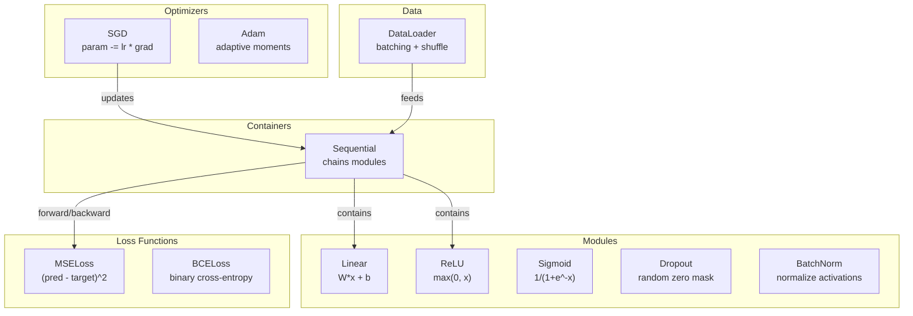
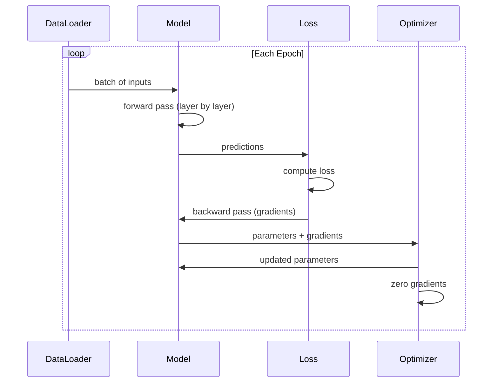
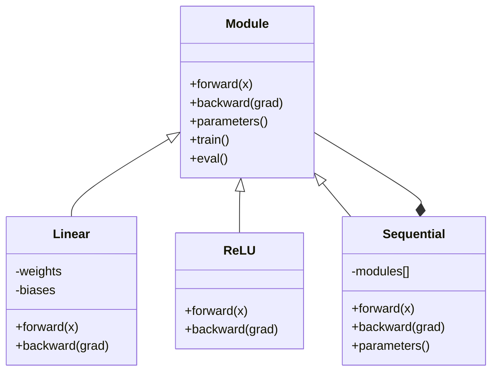

# Xây dựng Framework Mini của riêng bạn

> Bạn đã xây dựng các neuron, lớp, mạng, backprop, hàm kích hoạt, hàm mất mát, bộ tối ưu hóa, regularization, khởi tạo trọng số và lịch trình LR. Tất cả đều là những mảnh ghép riêng biệt. Bây giờ, hãy kết nối chúng lại thành một framework. Không phải PyTorch. Không phải TensorFlow. Mà là của chính bạn.

**Type:** Build
**Languages:** Python
**Prerequisites:** Toàn bộ Phase 03 (Bài 01-09)
**Time:** ~120 phút

## Mục tiêu học tập

- Xây dựng một framework deep learning hoàn chỉnh (~500 dòng) với Module, Linear, ReLU, Sigmoid, Dropout, BatchNorm, Sequential, các hàm mất mát, bộ tối ưu hóa và DataLoader
- Giải thích sự trừu tượng hóa Module (forward, backward, parameters) và lý do tại sao việc chuyển đổi chế độ train/eval là cần thiết
- Kết nối tất cả các thành phần thành một vòng lặp huấn luyện hoạt động để huấn luyện mạng 4 lớp trên bài toán phân loại hình tròn
- Ánh xạ từng thành phần trong framework của bạn với các thành phần tương đương trong PyTorch (nn.Module, nn.Sequential, optim.Adam, DataLoader)

## Vấn đề

Bạn có mười bài học về các khối xây dựng nằm rải rác trong các tệp riêng biệt. Một lớp `Value` ở đây, một vòng lặp huấn luyện ở kia, khởi tạo trọng số trong một tệp khác, lịch trình tốc độ học tập trong một tệp khác nữa. Để huấn luyện một mạng, bạn phải copy-paste từ năm bài học khác nhau và kết nối chúng lại bằng tay.

Đó là điều mà các framework giải quyết. PyTorch cung cấp cho bạn `nn.Module`, `nn.Sequential`, `optim.Adam`, `DataLoader` và một mô hình vòng lặp huấn luyện kết nối chúng lại với nhau. TensorFlow cung cấp cho bạn `keras.Layer`, `keras.Sequential`, `keras.optimizers.Adam`. Đây không phải là phép thuật. Chúng là các mô hình tổ chức giúp việc định nghĩa, huấn luyện và đánh giá mạng trở nên khả thi mà không cần phải xây dựng lại hệ thống ống dẫn mỗi lần.

Bạn sẽ xây dựng chính những thứ đó trong khoảng 500 dòng Python. Không numpy. Không phụ thuộc bên ngoài. Một framework có thể định nghĩa bất kỳ mạng feedforward nào, huấn luyện nó với SGD hoặc Adam, chia batch dữ liệu, áp dụng dropout và batch normalization, sử dụng bất kỳ hàm kích hoạt nào và lập lịch tốc độ học tập.

Khi hoàn thành, bạn sẽ hiểu chính xác điều gì xảy ra khi bạn viết `model = nn.Sequential(...)` trong PyTorch. Bạn sẽ hiểu tại sao `model.train()` và `model.eval()` tồn tại. Bạn sẽ hiểu tại sao `optimizer.zero_grad()` là một lệnh gọi riêng biệt. Bạn sẽ hiểu tất cả, bởi vì chính bạn đã xây dựng tất cả.

## Khái niệm

### Sự trừu tượng hóa Module

Mỗi lớp trong PyTorch kế thừa từ `nn.Module`. Một Module có ba trách nhiệm:

1. **forward()** -- tính toán đầu ra dựa trên đầu vào
2. **parameters()** -- trả về tất cả các trọng số có thể huấn luyện
3. **backward()** -- tính toán gradient (được xử lý bởi autograd trong PyTorch, chúng ta thực hiện tường minh)

Một lớp Linear là một Module. Một hàm kích hoạt ReLU là một Module. Một lớp dropout là một Module. Một lớp batch normalization là một Module. Tất cả chúng đều có cùng một giao diện.

### Sequential Container

`nn.Sequential` liên kết các Module. Forward pass: truyền dữ liệu qua Module 1, sau đó đến Module 2, rồi đến Module 3. Backward pass: thực hiện ngược lại chuỗi đó. Bản thân container cũng là một Module -- nó có forward(), parameters() và backward(). Đây là mô hình composite: một chuỗi các Module cũng chính là một Module.

### Chế độ Huấn luyện vs Đánh giá

Dropout ngẫu nhiên làm bằng không các neuron trong quá trình huấn luyện nhưng cho phép mọi thứ đi qua trong quá trình đánh giá. Batch normalization sử dụng thống kê batch trong quá trình huấn luyện nhưng sử dụng trung bình trượt trong quá trình đánh giá. Các phương thức `train()` và `eval()` chuyển đổi hành vi này. Mỗi Module có một cờ `training`.

### Optimizer

Bộ tối ưu hóa cập nhật các tham số bằng cách sử dụng gradient của chúng. SGD: `param -= lr * grad`. Adam: duy trì các ước tính về momentum và phương sai, sau đó cập nhật. Bộ tối ưu hóa không biết về kiến trúc mạng -- nó chỉ nhìn thấy một danh sách phẳng các tham số và gradient của chúng.

### DataLoader

Việc chia batch rất quan trọng vì hai lý do. Thứ nhất, bạn không thể nạp toàn bộ tập dữ liệu vào bộ nhớ đối với các bài toán lớn. Thứ hai, mini-batch gradient descent cung cấp nhiễu giúp thoát khỏi các cực tiểu địa phương. DataLoader chia dữ liệu thành các batch và tùy chọn xáo trộn giữa các epoch.

### Kiến trúc Framework



### Vòng lặp huấn luyện



### Phân cấp Module



```figure
gradient-clipping
```

## Xây dựng

### Bước 1: Lớp cơ sở Module

Giao diện trừu tượng mà mọi lớp đều triển khai.

```python
class Module:
    def __init__(self):
        self.training = True

    def forward(self, x):
        raise NotImplementedError

    def backward(self, grad):
        raise NotImplementedError

    def parameters(self):
        return []

    def train(self):
        self.training = True

    def eval(self):
        self.training = False
```

### Bước 2: Lớp Linear

Khối xây dựng cơ bản. Lưu trữ trọng số và bias, tính toán Wx + b ở forward, và gradient của trọng số/đầu vào ở backward.

```python
import math
import random


class Linear(Module):
    def __init__(self, fan_in, fan_out):
        super().__init__()
        std = math.sqrt(2.0 / fan_in)
        self.weights = [[random.gauss(0, std) for _ in range(fan_in)] for _ in range(fan_out)]
        self.biases = [0.0] * fan_out
        self.weight_grads = [[0.0] * fan_in for _ in range(fan_out)]
        self.bias_grads = [0.0] * fan_out
        self.fan_in = fan_in
        self.fan_out = fan_out
        self.input = None

    def forward(self, x):
        self.input = x
        output = []
        for i in range(self.fan_out):
            val = self.biases[i]
            for j in range(self.fan_in):
                val += self.weights[i][j] * x[j]
            output.append(val)
        return output

    def backward(self, grad):
        input_grad = [0.0] * self.fan_in
        for i in range(self.fan_out):
            self.bias_grads[i] += grad[i]
            for j in range(self.fan_in):
                self.weight_grads[i][j] += grad[i] * self.input[j]
                input_grad[j] += grad[i] * self.weights[i][j]
        return input_grad

    def parameters(self):
        params = []
        for i in range(self.fan_out):
            for j in range(self.fan_in):
                params.append((self.weights, i, j, self.weight_grads))
            params.append((self.biases, i, None, self.bias_grads))
        return params
```

### Bước 3: Các Module hàm kích hoạt

ReLU, Sigmoid và Tanh dưới dạng các Module. Mỗi cái lưu trữ những gì cần thiết cho backward pass.

```python
class ReLU(Module):
    def __init__(self):
        super().__init__()
        self.mask = None

    def forward(self, x):
        self.mask = [1.0 if v > 0 else 0.0 for v in x]
        return [max(0.0, v) for v in x]

    def backward(self, grad):
        return [g * m for g, m in zip(grad, self.mask)]


class Sigmoid(Module):
    def __init__(self):
        super().__init__()
        self.output = None

    def forward(self, x):
        self.output = []
        for v in x:
            v = max(-500, min(500, v))
            self.output.append(1.0 / (1.0 + math.exp(-v)))
        return self.output

    def backward(self, grad):
        return [g * o * (1 - o) for g, o in zip(grad, self.output)]


class Tanh(Module):
    def __init__(self):
        super().__init__()
        self.output = None

    def forward(self, x):
        self.output = [math.tanh(v) for v in x]
        return self.output

    def backward(self, grad):
        return [g * (1 - o * o) for g, o in zip(grad, self.output)]
```

### Bước 4: Module Dropout

Ngẫu nhiên làm bằng không các phần tử trong quá trình huấn luyện. Chia các phần tử còn lại cho 1/(1-p) để giá trị kỳ vọng không đổi. Không làm gì trong quá trình eval.

```python
class Dropout(Module):
    def __init__(self, p=0.5):
        super().__init__()
        self.p = p
        self.mask = None

    def forward(self, x):
        if not self.training:
            return x
        self.mask = [0.0 if random.random() < self.p else 1.0 / (1 - self.p) for _ in x]
        return [v * m for v, m in zip(x, self.mask)]

    def backward(self, grad):
        if self.mask is None:
            return grad
        return [g * m for g, m in zip(grad, self.mask)]
```

### Bước 5: Module BatchNorm

Chuẩn hóa các kích hoạt về trung bình bằng 0 và phương sai đơn vị trên mỗi đặc trưng trong batch. Duy trì thống kê chạy cho chế độ eval.

```python
class BatchNorm(Module):
    def __init__(self, size, momentum=0.1, eps=1e-5):
        super().__init__()
        self.size = size
        self.gamma = [1.0] * size
        self.beta = [0.0] * size
        self.gamma_grads = [0.0] * size
        self.beta_grads = [0.0] * size
        self.running_mean = [0.0] * size
        self.running_var = [1.0] * size
        self.momentum = momentum
        self.eps = eps
        self.x_norm = None
        self.std_inv = None
        self.batch_input = None

    def forward_batch(self, batch):
        batch_size = len(batch)
        output_batch = []

        if self.training:
            mean = [0.0] * self.size
            for sample in batch:
                for j in range(self.size):
                    mean[j] += sample[j]
            mean = [m / batch_size for m in mean]

            var = [0.0] * self.size
            for sample in batch:
                for j in range(self.size):
                    var[j] += (sample[j] - mean[j]) ** 2
            var = [v / batch_size for v in var]

            self.std_inv = [1.0 / math.sqrt(v + self.eps) for v in var]

            self.x_norm = []
            self.batch_input = batch
            for sample in batch:
                normed = [(sample[j] - mean[j]) * self.std_inv[j] for j in range(self.size)]
                self.x_norm.append(normed)
                output = [self.gamma[j] * normed[j] + self.beta[j] for j in range(self.size)]
                output_batch.append(output)

            for j in range(self.size):
                self.running_mean[j] = (1 - self.momentum) * self.running_mean[j] + self.momentum * mean[j]
                self.running_var[j] = (1 - self.momentum) * self.running_var[j] + self.momentum * var[j]
        else:
            std_inv = [1.0 / math.sqrt(v + self.eps) for v in self.running_var]
            for sample in batch:
                normed = [(sample[j] - self.running_mean[j]) * std_inv[j] for j in range(self.size)]
                output = [self.gamma[j] * normed[j] + self.beta[j] for j in range(self.size)]
                output_batch.append(output)

        return output_batch

    def forward(self, x):
        result = self.forward_batch([x])
        return result[0]

    def backward(self, grad):
        if self.x_norm is None:
            return grad
        for j in range(self.size):
            self.gamma_grads[j] += self.x_norm[0][j] * grad[j]
            self.beta_grads[j] += grad[j]
        return [grad[j] * self.gamma[j] * self.std_inv[j] for j in range(self.size)]

    def parameters(self):
        params = []
        for j in range(self.size):
            params.append((self.gamma, j, None, self.gamma_grads))
            params.append((self.beta, j, None, self.beta_grads))
        return params
```

### Bước 6: Sequential Container

Liên kết các module. Forward đi từ trái sang phải, backward đi từ phải sang trái.

```python
class Sequential(Module):
    def __init__(self, *modules):
        super().__init__()
        self.modules = list(modules)

    def forward(self, x):
        for module in self.modules:
            x = module.forward(x)
        return x

    def backward(self, grad):
        for module in reversed(self.modules):
            grad = module.backward(grad)
        return grad

    def parameters(self):
        params = []
        for module in self.modules:
            params.extend(module.parameters())
        return params

    def train(self):
        self.training = True
        for module in self.modules:
            module.train()

    def eval(self):
        self.training = False
        for module in self.modules:
            module.eval()
```

### Bước 7: Các hàm mất mát

MSE và Binary Cross-Entropy. Mỗi cái trả về giá trị mất mát và cung cấp một backward() trả về gradient.

```python
class MSELoss:
    def __call__(self, predicted, target):
        self.predicted = predicted
        self.target = target
        n = len(predicted)
        self.loss = sum((p - t) ** 2 for p, t in zip(predicted, target)) / n
        return self.loss

    def backward(self):
        n = len(self.predicted)
        return [2 * (p - t) / n for p, t in zip(self.predicted, self.target)]


class BCELoss:
    def __call__(self, predicted, target):
        self.predicted = predicted
        self.target = target
        eps = 1e-7
        n = len(predicted)
        self.loss = 0
        for p, t in zip(predicted, target):
            p = max(eps, min(1 - eps, p))
            self.loss += -(t * math.log(p) + (1 - t) * math.log(1 - p))
        self.loss /= n
        return self.loss

    def backward(self):
        eps = 1e-7
        n = len(self.predicted)
        grads = []
        for p, t in zip(self.predicted, self.target):
            p = max(eps, min(1 - eps, p))
            grads.append((-t / p + (1 - t) / (1 - p)) / n)
        return grads
```

### Bước 8: Các bộ tối ưu hóa SGD và Adam

Cả hai đều nhận danh sách tham số và cập nhật trọng số bằng cách sử dụng gradient.

```python
class SGD:
    def __init__(self, parameters, lr=0.01):
        self.params = parameters
        self.lr = lr

    def step(self):
        for container, i, j, grad_container in self.params:
            if j is not None:
                container[i][j] -= self.lr * grad_container[i][j]
            else:
                container[i] -= self.lr * grad_container[i]

    def zero_grad(self):
        for container, i, j, grad_container in self.params:
            if j is not None:
                grad_container[i][j] = 0.0
            else:
                grad_container[i] = 0.0


class Adam:
    def __init__(self, parameters, lr=0.001, beta1=0.9, beta2=0.999, eps=1e-8):
        self.params = parameters
        self.lr = lr
        self.beta1 = beta1
        self.beta2 = beta2
        self.eps = eps
        self.t = 0
        self.m = [0.0] * len(parameters)
        self.v = [0.0] * len(parameters)

    def step(self):
        self.t += 1
        for idx, (container, i, j, grad_container) in enumerate(self.params):
            if j is not None:
                g = grad_container[i][j]
            else:
                g = grad_container[i]

            self.m[idx] = self.beta1 * self.m[idx] + (1 - self.beta1) * g
            self.v[idx] = self.beta2 * self.v[idx] + (1 - self.beta2) * g * g

            m_hat = self.m[idx] / (1 - self.beta1 ** self.t)
            v_hat = self.v[idx] / (1 - self.beta2 ** self.t)

            update = self.lr * m_hat / (math.sqrt(v_hat) + self.eps)

            if j is not None:
                container[i][j] -= update
            else:
                container[i] -= update

    def zero_grad(self):
        for container, i, j, grad_container in self.params:
            if j is not None:
                grad_container[i][j] = 0.0
            else:
                grad_container[i] = 0.0
```

### Bước 9: DataLoader

Chia dữ liệu thành các batch, tùy chọn xáo trộn mỗi epoch.

```python
class DataLoader:
    def __init__(self, data, batch_size=32, shuffle=True):
        self.data = data
        self.batch_size = batch_size
        self.shuffle = shuffle

    def __iter__(self):
        indices = list(range(len(self.data)))
        if self.shuffle:
            random.shuffle(indices)
        for start in range(0, len(indices), self.batch_size):
            batch_indices = indices[start:start + self.batch_size]
            batch = [self.data[i] for i in batch_indices]
            inputs = [item[0] for item in batch]
            targets = [item[1] for item in batch]
            yield inputs, targets

    def __len__(self):
        return (len(self.data) + self.batch_size - 1) // self.batch_size
```

### Bước 10: Huấn luyện mạng 4 lớp trên bài toán phân loại hình tròn

Kết nối mọi thứ lại với nhau. Định nghĩa mô hình, chọn hàm mất mát, chọn bộ tối ưu hóa, chạy vòng lặp huấn luyện.

```python
def make_circle_data(n=500, seed=42):
    random.seed(seed)
    data = []
    for _ in range(n):
        x = random.uniform(-2, 2)
        y = random.uniform(-2, 2)
        label = 1.0 if x * x + y * y < 1.5 else 0.0
        data.append(([x, y], [label]))
    return data


def train():
    random.seed(42)

    model = Sequential(
        Linear(2, 16),
        ReLU(),
        Linear(16, 16),
        ReLU(),
        Linear(16, 8),
        ReLU(),
        Linear(8, 1),
        Sigmoid(),
    )

    criterion = BCELoss()
    optimizer = Adam(model.parameters(), lr=0.01)

    data = make_circle_data(500)
    split = int(len(data) * 0.8)
    train_data = data[:split]
    test_data = data[split:]

    loader = DataLoader(train_data, batch_size=16, shuffle=True)

    model.train()

    for epoch in range(100):
        total_loss = 0
        total_correct = 0
        total_samples = 0

        for batch_inputs, batch_targets in loader:
            batch_loss = 0
            for x, t in zip(batch_inputs, batch_targets):
                pred = model.forward(x)
                loss = criterion(pred, t)
                batch_loss += loss

                optimizer.zero_grad()
                grad = criterion.backward()
                model.backward(grad)
                optimizer.step()

                predicted_class = 1.0 if pred[0] >= 0.5 else 0.0
                if predicted_class == t[0]:
                    total_correct += 1
                total_samples += 1

            total_loss += batch_loss

        avg_loss = total_loss / total_samples
        accuracy = total_correct / total_samples * 100

        if epoch % 10 == 0 or epoch == 99:
            print(f"Epoch {epoch:3d} | Loss: {avg_loss:.6f} | Train Accuracy: {accuracy:.1f}%")

    model.eval()
    correct = 0
    for x, t in test_data:
        pred = model.forward(x)
        predicted_class = 1.0 if pred[0] >= 0.5 else 0.0
        if predicted_class == t[0]:
            correct += 1
    test_accuracy = correct / len(test_data) * 100
    print(f"\nTest Accuracy: {test_accuracy:.1f}% ({correct}/{len(test_data)})")

    return model, test_accuracy
```

## Sử dụng

Đây là phiên bản tương đương trong PyTorch của những gì bạn vừa xây dựng:

```python
import torch
import torch.nn as nn
from torch.utils.data import DataLoader, TensorDataset

model = nn.Sequential(
    nn.Linear(2, 16),
    nn.ReLU(),
    nn.Linear(16, 16),
    nn.ReLU(),
    nn.Linear(16, 8),
    nn.ReLU(),
    nn.Linear(8, 1),
    nn.Sigmoid(),
)

criterion = nn.BCELoss()
optimizer = torch.optim.Adam(model.parameters(), lr=0.01)

for epoch in range(100):
    model.train()
    for inputs, targets in dataloader:
        optimizer.zero_grad()
        predictions = model(inputs)
        loss = criterion(predictions, targets)
        loss.backward()
        optimizer.step()

    model.eval()
    with torch.no_grad():
        test_predictions = model(test_inputs)
```

Cấu trúc là giống hệt nhau. `Sequential`, `Linear`, `ReLU`, `Sigmoid`, `BCELoss`, `Adam`, `zero_grad`, `backward`, `step`, `train`, `eval`. Mọi khái niệm đều ánh xạ một-một. Sự khác biệt là PyTorch xử lý autograd tự động (không cần triển khai backward() trong mỗi module), chạy trên GPU và đã được tối ưu hóa trong nhiều năm. Nhưng khung xương thì giống hệt nhau.

Bây giờ khi bạn nhìn thấy mã PyTorch, bạn biết chính xác điều gì đang xảy ra ở mỗi dòng. Sự hiểu biết đó chính là mục đích của bài học này.

## Ship It

Bài học này tạo ra:
- `outputs/prompt-framework-architect.md` -- một prompt để thiết kế các kiến trúc mạng thần kinh sử dụng các sự trừu tượng hóa của framework

## Bài tập

1. Thêm lớp `SoftmaxCrossEntropyLoss` cho bài toán phân loại đa lớp. Áp dụng Softmax cho các dự đoán, tính toán cross-entropy loss và xử lý backward pass kết hợp. Kiểm tra nó trên tập dữ liệu xoắn ốc 3 lớp.

2. Triển khai lập lịch tốc độ học tập trong bộ tối ưu hóa: thêm phương thức `set_lr()` và kết nối lịch trình cosine từ Bài 09. Huấn luyện bộ phân loại hình tròn với warmup + cosine và so sánh với LR hằng số.

3. Thêm phương thức `save()` và `load()` vào Sequential để tuần tự hóa tất cả trọng số vào tệp JSON và tải chúng lại. Xác minh rằng mô hình đã tải tạo ra các dự đoán giống như mô hình gốc.

4. Triển khai weight decay (L2 regularization) trong bộ tối ưu hóa Adam. Thêm tham số `weight_decay` để thu nhỏ trọng số về 0 sau mỗi bước. So sánh việc huấn luyện với decay=0 và decay=0.01.

5. Thay thế vòng lặp huấn luyện theo từng mẫu bằng tích lũy gradient mini-batch đúng cách: tích lũy gradient qua tất cả các mẫu trong một batch, sau đó chia cho kích thước batch và thực hiện một bước tối ưu hóa. Đo lường xem điều này có làm thay đổi tốc độ hội tụ hay không.

## Thuật ngữ chính

| Thuật ngữ | Cách gọi thông thường | Ý nghĩa thực tế |
|------|----------------|----------------------|
| Module | "Một lớp" | Sự trừu tượng hóa cơ bản trong framework -- bất cứ thứ gì có forward(), backward() và parameters() |
| Sequential | "Xếp chồng các lớp theo thứ tự" | Một container liên kết các module, áp dụng chúng theo trình tự cho forward và ngược lại cho backward |
| Forward pass | "Chạy mạng" | Tính toán đầu ra bằng cách truyền đầu vào qua từng module theo thứ tự |
| Backward pass | "Tính toán gradient" | Lan truyền gradient mất mát qua từng module theo chiều ngược lại để tính gradient tham số |
| Parameters | "Các trọng số có thể huấn luyện" | Tất cả các giá trị trong mạng mà bộ tối ưu hóa có thể cập nhật -- trọng số và bias |
| Optimizer | "Thứ cập nhật trọng số" | Một thuật toán sử dụng gradient để cập nhật tham số, triển khai SGD, Adam hoặc các quy tắc khác |
| DataLoader | "Thứ cung cấp dữ liệu" | Một iterator chia tập dữ liệu thành các batch, tùy chọn xáo trộn giữa các epoch |
| Training mode | "model.train()" | Một cờ kích hoạt hành vi ngẫu nhiên như dropout và batch normalization với thống kê batch |
| Evaluation mode | "model.eval()" | Một cờ vô hiệu hóa dropout và sử dụng thống kê chạy cho batch normalization |
| Zero grad | "Xóa gradient" | Đặt lại tất cả gradient tham số về 0 trước khi tính toán gradient của batch tiếp theo |

## Đọc thêm

- Paszke et al., "PyTorch: An Imperative Style, High-Performance Deep Learning Library" (2019) -- bài báo mô tả các quyết định thiết kế của PyTorch
- Chollet, "Deep Learning with Python, Second Edition" (2021) -- Chương 3 bao gồm các thành phần nội bộ của Keras với cùng sự trừu tượng hóa module/lớp
- Johnson, "Tiny-DNN" (https://github.com/tiny-dnn/tiny-dnn) -- một framework deep learning C++ chỉ gồm header để hiểu các thành phần nội bộ của framework