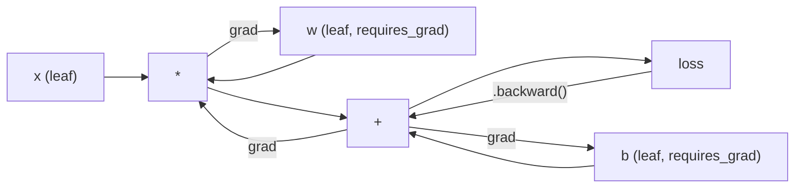
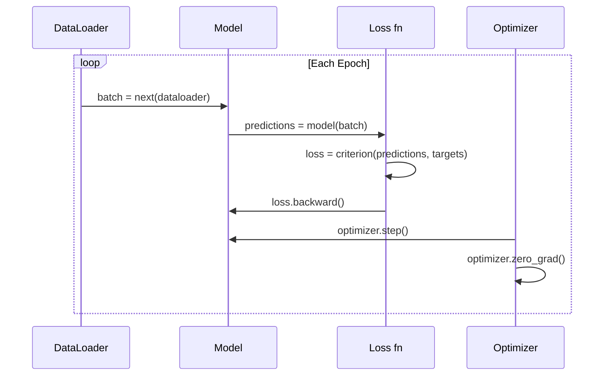

# Giới thiệu về PyTorch

> Bạn đã xây dựng động cơ từ piston và trục khuỷu. Bây giờ hãy học cách vận hành chiếc xe mà mọi người thực sự đang lái.

**Type:** Build
**Languages:** Python
**Prerequisites:** Bài 03.10 (Xây dựng Framework Mini của riêng bạn)
**Time:** ~75 phút

## Mục tiêu học tập

- Xây dựng và huấn luyện các mạng thần kinh (neural networks) sử dụng nn.Module, nn.Sequential và autograd của PyTorch
- Sử dụng các tensor, tăng tốc GPU và vòng lặp huấn luyện tiêu chuẩn (zero_grad, forward, loss, backward, step) trong PyTorch
- Chuyển đổi các thành phần trong framework mini tự xây dựng sang các thành phần tương đương của PyTorch
- Profile và so sánh tốc độ huấn luyện giữa framework Python thuần của bạn và PyTorch trên cùng một tác vụ

## Vấn đề

Bạn đã có một framework mini hoạt động. Các lớp Linear, ReLU, dropout, batch norm, Adam, DataLoader, vòng lặp huấn luyện. Nó huấn luyện một mạng 4 lớp trên bài toán phân loại hình tròn bằng Python thuần.

Nhưng nó chậm hơn PyTorch 500 lần trên cùng một bài toán.

Framework mini của bạn xử lý từng mẫu một với các vòng lặp Python lồng nhau. PyTorch gửi các thao tác tương tự đến các nhân C++/CUDA được tối ưu hóa chạy trên GPU. Trên một card NVIDIA A100 duy nhất, PyTorch huấn luyện ResNet-50 (25.6 triệu tham số) trên ImageNet (1.28 triệu ảnh) trong khoảng 6 giờ. Framework của bạn sẽ mất khoảng 3,000 giờ cho cùng tác vụ đó -- nếu nó không bị hết bộ nhớ trước.

Tốc độ không phải là khoảng cách duy nhất. Framework của bạn không hỗ trợ GPU. Không có vi phân tự động (automatic differentiation) -- bạn phải tự viết tay backward() cho từng module. Không có serialization. Không có huấn luyện phân tán. Không có mixed precision. Không có cách nào để debug dòng chảy gradient mà không cần dùng lệnh print.

PyTorch lấp đầy mọi khoảng trống này. Và nó thực hiện điều đó trong khi vẫn giữ nguyên mô hình tư duy mà bạn đã xây dựng: Module, forward(), parameters(), backward(), optimizer.step(). Các khái niệm chuyển đổi một-một. Cú pháp gần như giống hệt. Sự khác biệt là PyTorch bao bọc một thập kỷ kỹ thuật hệ thống đằng sau cùng giao diện mà bạn đã thiết kế từ đầu.

## Khái niệm

### Tại sao PyTorch chiến thắng

Năm 2015, TensorFlow yêu cầu bạn định nghĩa một đồ thị tính toán tĩnh (static computation graph) trước khi chạy bất cứ thứ gì. Bạn xây dựng đồ thị, biên dịch nó, sau đó đưa dữ liệu qua đó. Debugging nghĩa là nhìn chằm chằm vào các hình ảnh trực quan của đồ thị. Thay đổi kiến trúc nghĩa là xây dựng lại đồ thị từ đầu.

PyTorch ra mắt năm 2017 với một triết lý khác: eager execution. Bạn viết Python. Nó chạy ngay lập tức. `y = model(x)` thực sự tính toán y ngay bây giờ, không phải "thêm một nút vào đồ thị để tính y sau này". Điều này có nghĩa là các công cụ debug Python tiêu chuẩn đều hoạt động. print() hoạt động. pdb hoạt động. if/else trong forward pass hoạt động.

Đến năm 2020, thị trường đã lên tiếng. Thị phần của PyTorch trong các bài báo nghiên cứu ML đã tăng từ 7% (2017) lên hơn 75% (2022). Meta, Google DeepMind, OpenAI, Anthropic và Hugging Face đều sử dụng PyTorch làm framework chính. TensorFlow 2.x đã áp dụng eager execution để đáp trả -- một sự thừa nhận ngầm rằng thiết kế của PyTorch là đúng đắn.

Bài học: trải nghiệm nhà phát triển (developer experience) tích lũy theo thời gian. Một framework chậm hơn 10% nhưng debug nhanh hơn 50% sẽ luôn chiến thắng.

### Tensors

Tensor là một mảng đa chiều với ba thuộc tính quan trọng: shape, dtype và device.

```python
import torch

x = torch.zeros(3, 4)           # shape: (3, 4), dtype: float32, device: cpu
x = torch.randn(2, 3, 224, 224) # batch of 2 RGB images, 224x224
x = torch.tensor([1, 2, 3])     # from a Python list
```

**Shape** là số chiều. Một scalar có shape (), vector là (n,), ma trận là (m, n), một batch ảnh là (batch, channels, height, width).

**Dtype** kiểm soát độ chính xác và bộ nhớ.

| dtype | Bits | Phạm vi | Trường hợp sử dụng |
|-------|------|-------|----------|
| float32 | 32 | ~7 chữ số thập phân | Huấn luyện mặc định |
| float16 | 16 | ~3.3 chữ số thập phân | Mixed precision |
| bfloat16 | 16 | Phạm vi như float32, ít chính xác hơn | Huấn luyện LLM |
| int8 | 8 | -128 đến 127 | Quantized inference |

**Device** xác định nơi tính toán diễn ra.

```python
device = torch.device("cuda" if torch.cuda.is_available() else "cpu")
x = torch.randn(3, 4, device=device)
x = x.to("cuda")
x = x.cpu()
```

Mọi thao tác yêu cầu tất cả các tensor phải nằm trên cùng một device. Đây là lỗi số 1 mà người mới bắt đầu gặp phải trong PyTorch: `RuntimeError: Expected all tensors to be on the same device`. Hãy sửa nó bằng cách chuyển mọi thứ về cùng một device trước khi tính toán.

**Reshaping** là thao tác có độ phức tạp thời gian hằng số (constant-time) -- nó thay đổi metadata, không phải dữ liệu.

```python
x = torch.randn(2, 3, 4)
x.view(2, 12)      # reshape to (2, 12) -- must be contiguous
x.reshape(6, 4)    # reshape to (6, 4) -- works always
x.permute(2, 0, 1) # reorder dimensions
x.unsqueeze(0)     # add dimension: (1, 2, 3, 4)
x.squeeze()        # remove size-1 dimensions
```

### Autograd

Framework mini của bạn yêu cầu bạn triển khai backward() cho mỗi module. PyTorch thì không. Nó ghi lại mọi thao tác trên tensor vào một đồ thị có hướng không chu trình (đồ thị tính toán) và sau đó duyệt đồ thị đó theo chiều ngược lại để tính toán gradient một cách tự động.



Sự khác biệt chính so với framework của bạn: PyTorch sử dụng autodiff dựa trên băng ghi (tape-based). Mọi thao tác sẽ thêm vào một "băng ghi" trong quá trình forward pass. Gọi `.backward()` sẽ phát lại băng ghi theo chiều ngược lại.

```python
x = torch.randn(3, requires_grad=True)
y = x ** 2 + 3 * x
z = y.sum()
z.backward()
print(x.grad)  # dz/dx = 2x + 3
```

Ba quy tắc của autograd:

1. Chỉ các leaf tensor với `requires_grad=True` mới tích lũy gradient
2. Gradient tích lũy theo mặc định -- hãy gọi `optimizer.zero_grad()` trước mỗi lần backward pass
3. `torch.no_grad()` vô hiệu hóa việc theo dõi gradient (sử dụng trong quá trình đánh giá)

### nn.Module

`nn.Module` là lớp cơ sở cho mọi thành phần mạng thần kinh trong PyTorch. Bạn đã xây dựng sự trừu tượng này trong Bài 10. Phiên bản của PyTorch bổ sung thêm việc đăng ký tham số tự động, khám phá module đệ quy, quản lý device và serialization state dict.

```python
import torch.nn as nn

class MLP(nn.Module):
    def __init__(self, input_dim, hidden_dim, output_dim):
        super().__init__()
        self.layer1 = nn.Linear(input_dim, hidden_dim)
        self.relu = nn.ReLU()
        self.layer2 = nn.Linear(hidden_dim, output_dim)

    def forward(self, x):
        x = self.layer1(x)
        x = self.relu(x)
        x = self.layer2(x)
        return x
```

Khi bạn gán một `nn.Module` hoặc `nn.Parameter` làm thuộc tính trong `__init__`, PyTorch sẽ tự động đăng ký nó. `model.parameters()` thu thập đệ quy mọi tham số đã đăng ký. Đây là lý do tại sao bạn không bao giờ phải tự tay thu thập trọng số như đã làm trong framework mini.

Các khối xây dựng chính:

| Module | Chức năng | Tham số |
|--------|-------------|------------|
| nn.Linear(in, out) | Wx + b | in*out + out |
| nn.Conv2d(in_ch, out_ch, k) | Tích chập 2D | in_ch*out_ch*k*k + out_ch |
| nn.BatchNorm1d(features) | Chuẩn hóa activations | 2 * features |
| nn.Dropout(p) | Zeroing ngẫu nhiên | 0 |
| nn.ReLU() | max(0, x) | 0 |
| nn.GELU() | Gaussian error linear | 0 |
| nn.Embedding(vocab, dim) | Bảng tra cứu | vocab * dim |
| nn.LayerNorm(dim) | Chuẩn hóa theo mẫu | 2 * dim |

### Hàm mất mát (Loss Functions) và Bộ tối ưu hóa (Optimizers)

PyTorch cung cấp các phiên bản sẵn sàng cho sản xuất của mọi thứ bạn đã xây dựng.

**Hàm mất mát** (từ `torch.nn`):

| Loss | Tác vụ | Đầu vào |
|------|------|-------|
| nn.MSELoss() | Hồi quy | Bất kỳ shape nào |
| nn.CrossEntropyLoss() | Phân loại đa lớp | Logits (không phải softmax) |
| nn.BCEWithLogitsLoss() | Phân loại nhị phân | Logits (không phải sigmoid) |
| nn.L1Loss() | Hồi quy (bền vững) | Bất kỳ shape nào |
| nn.CTCLoss() | Căn chỉnh chuỗi | Log probabilities |

Lưu ý: `CrossEntropyLoss` kết hợp `LogSoftmax` + `NLLLoss` bên trong. Hãy truyền logits thô, không phải đầu ra softmax. Đây là lỗi phổ biến tạo ra gradient sai mà không có cảnh báo.

**Bộ tối ưu hóa** (từ `torch.optim`):

| Optimizer | Khi nào sử dụng | LR điển hình |
|-----------|-------------|-----------|
| SGD(params, lr, momentum) | CNNs, các pipeline đã tinh chỉnh | 0.01--0.1 |
| Adam(params, lr) | Điểm bắt đầu mặc định | 1e-3 |
| AdamW(params, lr, weight_decay) | Transformers, fine-tuning | 1e-4--1e-3 |
| LBFGS(params) | Quy mô nhỏ, bậc hai | 1.0 |

### Vòng lặp huấn luyện

Mọi vòng lặp huấn luyện PyTorch đều tuân theo mô hình 5 bước. Bạn đã biết điều này từ Bài 10.



Mô hình chuẩn:

```python
for epoch in range(num_epochs):
    model.train()
    for inputs, targets in train_loader:
        inputs, targets = inputs.to(device), targets.to(device)
        optimizer.zero_grad()
        outputs = model(inputs)
        loss = criterion(outputs, targets)
        loss.backward()
        optimizer.step()
```

Năm dòng bên trong vòng lặp batch. Năm dòng đã huấn luyện GPT-4, Stable Diffusion và LLaMA. Kiến trúc thay đổi. Dữ liệu thay đổi. Năm dòng này thì không.

### Dataset và DataLoader

`Dataset` của PyTorch là một lớp trừu tượng với hai phương thức: `__len__` và `__getitem__`. `DataLoader` bao bọc nó với việc tạo batch, xáo trộn và tải dữ liệu đa tiến trình.

```python
from torch.utils.data import Dataset, DataLoader

class MNISTDataset(Dataset):
    def __init__(self, images, labels):
        self.images = images
        self.labels = labels

    def __len__(self):
        return len(self.labels)

    def __getitem__(self, idx):
        return self.images[idx], self.labels[idx]

loader = DataLoader(dataset, batch_size=64, shuffle=True, num_workers=4)
```

`num_workers=4` tạo ra 4 tiến trình để tải dữ liệu song song trong khi GPU huấn luyện trên batch hiện tại. Đối với các khối lượng công việc bị giới hạn bởi đĩa (ảnh lớn, âm thanh), chỉ riêng điều này có thể tăng gấp đôi tốc độ huấn luyện.

### Huấn luyện trên GPU

Chuyển model sang GPU:

```python
device = torch.device("cuda" if torch.cuda.is_available() else "cpu")
model = model.to(device)
```

Điều này chuyển đệ quy mọi tham số và bộ đệm sang GPU. Sau đó chuyển từng batch trong quá trình huấn luyện:

```python
inputs, targets = inputs.to(device), targets.to(device)
```

**Mixed precision** giảm một nửa mức sử dụng bộ nhớ và tăng gấp đôi thông lượng trên các GPU hiện đại (A100, H100, RTX 4090) bằng cách chạy forward/backward ở float16 trong khi giữ các trọng số chính ở float32:

```python
from torch.amp import autocast, GradScaler

scaler = GradScaler()
for inputs, targets in loader:
    with autocast(device_type="cuda"):
        outputs = model(inputs)
        loss = criterion(outputs, targets)
    scaler.scale(loss).backward()
    scaler.step(optimizer)
    scaler.update()
    optimizer.zero_grad()
```

### So sánh: Mini Framework vs PyTorch vs JAX

| Tính năng | Mini Framework (L10) | PyTorch | JAX |
|---------|---------------------|---------|-----|
| Autodiff | Manual backward() | Tape-based autograd | Functional transforms |
| Thực thi | Eager (vòng lặp Python) | Eager (nhân C++) | Traced + JIT compiled |
| Hỗ trợ GPU | Không | Có (CUDA, ROCm, MPS) | Có (CUDA, TPU) |
| Tốc độ (MNIST MLP) | ~300s/epoch | ~0.5s/epoch | ~0.3s/epoch |
| Hệ thống Module | Lớp Module tùy chỉnh | nn.Module | Hàm không trạng thái (Flax/Equinox) |
| Debugging | print() | print(), pdb, breakpoint() | Khó hơn (JIT tracing làm hỏng print) |
| Hệ sinh thái | Không | Hugging Face, Lightning, timm | Flax, Optax, Orbax |
| Đường cong học tập | Bạn đã xây dựng nó | Trung bình | Dốc (mô hình hàm) |
| Sử dụng sản xuất | Bài toán đồ chơi | Meta, OpenAI, Anthropic, HF | Google DeepMind, Midjourney |

```figure
dropout-mask
```

## Xây dựng

Một MLP 3 lớp được huấn luyện trên MNIST chỉ sử dụng các nguyên hàm của PyTorch. Không có wrapper cấp cao. Không có `torchvision.datasets`. Chúng ta tự tải và phân tích dữ liệu thô.

### Bước 1: Tải MNIST từ tệp thô

MNIST được cung cấp dưới dạng 4 tệp gzipped: ảnh huấn luyện (60,000 x 28 x 28), nhãn huấn luyện, ảnh kiểm tra (10,000 x 28 x 28), nhãn kiểm tra. Chúng ta tải xuống và phân tích định dạng nhị phân.

```python
import torch
import torch.nn as nn
import struct
import gzip
import urllib.request
import os

def download_mnist(path="./mnist_data"):
    base_url = "https://storage.googleapis.com/cvdf-datasets/mnist/"
    files = [
        "train-images-idx3-ubyte.gz",
        "train-labels-idx1-ubyte.gz",
        "t10k-images-idx3-ubyte.gz",
        "t10k-labels-idx1-ubyte.gz",
    ]
    os.makedirs(path, exist_ok=True)
    for f in files:
        filepath = os.path.join(path, f)
        if not os.path.exists(filepath):
            urllib.request.urlretrieve(base_url + f, filepath)

def load_images(filepath):
    with gzip.open(filepath, "rb") as f:
        magic, num, rows, cols = struct.unpack(">IIII", f.read(16))
        data = f.read()
        images = torch.frombuffer(bytearray(data), dtype=torch.uint8)
        images = images.reshape(num, rows * cols).float() / 255.0
    return images

def load_labels(filepath):
    with gzip.open(filepath, "rb") as f:
        magic, num = struct.unpack(">II", f.read(8))
        data = f.read()
        labels = torch.frombuffer(bytearray(data), dtype=torch.uint8).long()
    return labels
```

### Bước 2: Định nghĩa Model

Một MLP 3 lớp: 784 -> 256 -> 128 -> 10. ReLU activations. Dropout để điều chuẩn. Không có batch norm để giữ cho đơn giản.

```python
class MNISTModel(nn.Module):
    def __init__(self):
        super().__init__()
        self.net = nn.Sequential(
            nn.Linear(784, 256),
            nn.ReLU(),
            nn.Dropout(0.2),
            nn.Linear(256, 128),
            nn.ReLU(),
            nn.Dropout(0.2),
            nn.Linear(128, 10),
        )

    def forward(self, x):
        return self.net(x)
```

Lớp đầu ra tạo ra 10 logits thô (một cho mỗi chữ số). Không có softmax -- `CrossEntropyLoss` xử lý điều đó bên trong.

Số lượng tham số: 784*256 + 256 + 256*128 + 128 + 128*10 + 10 = 235,146. Rất nhỏ so với tiêu chuẩn hiện đại. GPT-2 small có 124 triệu. Cái này huấn luyện trong vài giây.

### Bước 3: Vòng lặp huấn luyện

Mô hình forward-loss-backward-step chuẩn.

```python
def train_one_epoch(model, loader, criterion, optimizer, device):
    model.train()
    total_loss = 0
    correct = 0
    total = 0
    for images, labels in loader:
        images, labels = images.to(device), labels.to(device)
        optimizer.zero_grad()
        outputs = model(images)
        loss = criterion(outputs, labels)
        loss.backward()
        optimizer.step()
        total_loss += loss.item() * images.size(0)
        _, predicted = outputs.max(1)
        correct += predicted.eq(labels).sum().item()
        total += labels.size(0)
    return total_loss / total, correct / total


def evaluate(model, loader, criterion, device):
    model.eval()
    total_loss = 0
    correct = 0
    total = 0
    with torch.no_grad():
        for images, labels in loader:
            images, labels = images.to(device), labels.to(device)
            outputs = model(images)
            loss = criterion(outputs, labels)
            total_loss += loss.item() * images.size(0)
            _, predicted = outputs.max(1)
            correct += predicted.eq(labels).sum().item()
            total += labels.size(0)
    return total_loss / total, correct / total
```

Lưu ý `torch.no_grad()` trong quá trình đánh giá. Điều này vô hiệu hóa autograd, giảm mức sử dụng bộ nhớ và tăng tốc độ suy luận. Nếu không có nó, PyTorch sẽ xây dựng một đồ thị tính toán mà bạn không bao giờ sử dụng.

### Bước 4: Kết nối mọi thứ

```python
def main():
    device = torch.device("cuda" if torch.cuda.is_available() else "cpu")

    download_mnist()
    train_images = load_images("./mnist_data/train-images-idx3-ubyte.gz")
    train_labels = load_labels("./mnist_data/train-labels-idx1-ubyte.gz")
    test_images = load_images("./mnist_data/t10k-images-idx3-ubyte.gz")
    test_labels = load_labels("./mnist_data/t10k-labels-idx1-ubyte.gz")

    train_dataset = torch.utils.data.TensorDataset(train_images, train_labels)
    test_dataset = torch.utils.data.TensorDataset(test_images, test_labels)
    train_loader = torch.utils.data.DataLoader(
        train_dataset, batch_size=64, shuffle=True
    )
    test_loader = torch.utils.data.DataLoader(
        test_dataset, batch_size=256, shuffle=False
    )

    model = MNISTModel().to(device)
    criterion = nn.CrossEntropyLoss()
    optimizer = torch.optim.Adam(model.parameters(), lr=1e-3)

    num_params = sum(p.numel() for p in model.parameters())
    print(f"Device: {device}")
    print(f"Parameters: {num_params:,}")
    print(f"Train samples: {len(train_dataset):,}")
    print(f"Test samples: {len(test_dataset):,}")
    print()

    for epoch in range(10):
        train_loss, train_acc = train_one_epoch(
            model, train_loader, criterion, optimizer, device
        )
        test_loss, test_acc = evaluate(
            model, test_loader, criterion, device
        )
        print(
            f"Epoch {epoch+1:2d} | "
            f"Train Loss: {train_loss:.4f} | Train Acc: {train_acc:.4f} | "
            f"Test Loss: {test_loss:.4f} | Test Acc: {test_acc:.4f}"
        )

    torch.save(model.state_dict(), "mnist_mlp.pt")
    print(f"\nModel saved to mnist_mlp.pt")
    print(f"Final test accuracy: {test_acc:.4f}")
```

Kết quả dự kiến sau 10 epoch: ~97.8% độ chính xác kiểm tra. Thời gian huấn luyện trên CPU: ~30 giây. Trên GPU: ~5 giây. Trên framework mini của bạn với cùng kiến trúc: ~45 phút.

## Sử dụng

### So sánh nhanh: Mini Framework vs PyTorch

| Mini Framework (Bài 10) | PyTorch |
|---------------------------|---------|
| `model = Sequential(Linear(784, 256), ReLU(), ...)` | `model = nn.Sequential(nn.Linear(784, 256), nn.ReLU(), ...)` |
| `pred = model.forward(x)` | `pred = model(x)` |
| `optimizer.zero_grad()` | `optimizer.zero_grad()` |
| `grad = criterion.backward()` sau đó `model.backward(grad)` | `loss.backward()` |
| `optimizer.step()` | `optimizer.step()` |
| Không có GPU | `model.to("cuda")` |
| Manual backward cho mỗi module | Autograd xử lý mọi thứ |

Giao diện gần như giống hệt. Sự khác biệt nằm ở mọi thứ bên dưới.

### Lưu và tải Model

```python
torch.save(model.state_dict(), "model.pt")

model = MNISTModel()
model.load_state_dict(torch.load("model.pt", weights_only=True))
model.eval()
```

Luôn lưu `state_dict()` (từ điển tham số), không phải đối tượng model. Lưu đối tượng model sử dụng pickle, thứ sẽ bị hỏng khi bạn refactor code. State dict có tính di động cao.

### Lập lịch tốc độ học (Learning Rate Scheduling)

```python
scheduler = torch.optim.lr_scheduler.CosineAnnealingLR(
    optimizer, T_max=10
)
for epoch in range(10):
    train_one_epoch(model, train_loader, criterion, optimizer, device)
    scheduler.step()
```

PyTorch cung cấp hơn 15 bộ lập lịch: StepLR, ExponentialLR, CosineAnnealingLR, OneCycleLR, ReduceLROnPlateau. Tất cả đều cắm vào cùng một giao diện optimizer.

## Triển khai

Bài học này tạo ra hai sản phẩm:

- `outputs/prompt-pytorch-debugger.md` -- một prompt để chẩn đoán các lỗi huấn luyện PyTorch phổ biến
- `outputs/skill-pytorch-patterns.md` -- một tài liệu tham khảo kỹ năng cho các mô hình huấn luyện PyTorch

## Bài tập

1. **Thêm batch normalization.** Chèn `nn.BatchNorm1d` sau mỗi lớp linear (trước activation). So sánh độ chính xác kiểm tra và tốc độ huấn luyện so với phiên bản chỉ dùng dropout. Batch norm sẽ đạt 98%+ trong ít epoch hơn.

2. **Triển khai bộ tìm kiếm tốc độ học (LR finder).** Huấn luyện trong một epoch với tốc độ học tăng theo cấp số nhân (từ 1e-7 đến 1.0). Vẽ biểu đồ loss vs LR. LR tối ưu nằm ngay trước khi loss bắt đầu tăng. Sử dụng điều này để chọn LR tốt hơn cho model MNIST.

3. **Chuyển sang GPU với mixed precision.** Thêm `torch.amp.autocast` và `GradScaler` vào vòng lặp huấn luyện. Đo thông lượng (mẫu/giây) có và không có mixed precision trên GPU. Trên A100, dự kiến tăng tốc ~2x.

4. **Xây dựng Dataset tùy chỉnh.** Tải Fashion-MNIST (cùng định dạng với MNIST nhưng là các mặt hàng thời trang). Triển khai lớp `FashionMNISTDataset(Dataset)` với `__getitem__` và `__len__`. Huấn luyện cùng MLP và so sánh độ chính xác. Fashion-MNIST khó hơn -- dự kiến ~88% so với ~98%.

5. **Thay thế Adam bằng SGD + momentum.** Huấn luyện với `SGD(params, lr=0.01, momentum=0.9)`. So sánh các đường cong hội tụ. Sau đó thêm bộ lập lịch `CosineAnnealingLR` và xem liệu SGD có bắt kịp Adam vào epoch 10 không.

## Thuật ngữ chính

| Thuật ngữ | Mọi người nói | Ý nghĩa thực sự |
|------|----------------|----------------------|
| Tensor | "Một mảng đa chiều" | Một mảng có kiểu dữ liệu, nhận biết thiết bị với hỗ trợ vi phân tự động tích hợp trong mọi thao tác |
| Autograd | "Backprop tự động" | Hệ thống dựa trên băng ghi ghi lại các thao tác trong forward pass, sau đó phát lại theo chiều ngược lại để tính toán gradient chính xác |
| nn.Module | "Một lớp" | Lớp cơ sở cho bất kỳ khối tính toán khả vi nào -- đăng ký tham số, hỗ trợ lồng nhau, xử lý các chế độ train/eval |
| state_dict | "Trọng số model" | Một OrderedDict ánh xạ tên tham số tới các tensor -- đại diện di động, có thể tuần tự hóa của một model đã huấn luyện |
| .backward() | "Tính toán gradient" | Duyệt đồ thị tính toán theo chiều ngược lại, tính toán và tích lũy gradient cho mọi leaf tensor với requires_grad=True |
| .to(device) | "Chuyển sang GPU" | Chuyển đệ quy tất cả tham số và bộ đệm sang thiết bị được chỉ định (CPU, CUDA, MPS) |
| DataLoader | "Pipeline dữ liệu" | Một iterator thực hiện batching, xáo trộn và tùy chọn tải dữ liệu song song từ một Dataset |
| Mixed precision | "Sử dụng float16" | Huấn luyện với float16 forward/backward để tăng tốc trong khi giữ trọng số chính float32 để ổn định số học |
| Eager execution | "Chạy ngay" | Các thao tác thực thi ngay lập tức khi được gọi, không bị hoãn lại đến bước biên dịch sau -- lựa chọn thiết kế cốt lõi phân biệt PyTorch với TF 1.x |
| zero_grad | "Đặt lại gradient" | Đặt tất cả gradient tham số về 0 trước lần backward pass tiếp theo, vì PyTorch tích lũy gradient theo mặc định |

## Đọc thêm

- Paszke et al., "PyTorch: An Imperative Style, High-Performance Deep Learning Library" (2019) -- bài báo gốc giải thích các đánh đổi thiết kế của PyTorch
- Hướng dẫn PyTorch: "Learning PyTorch with Examples" (https://pytorch.org/tutorials/beginner/pytorch_with_examples.html) -- lộ trình chính thức từ tensor đến nn.Module
- Hướng dẫn tối ưu hóa hiệu suất PyTorch (https://pytorch.org/tutorials/recipes/recipes/tuning_guide.html) -- mixed precision, DataLoader workers, pinned memory và các tối ưu hóa sản xuất khác
- Horace He, "Making Deep Learning Go Brrrr" (https://horace.io/brrr_intro.html) -- tại sao huấn luyện GPU lại nhanh, với các chiến lược tối ưu hóa dành riêng cho PyTorch