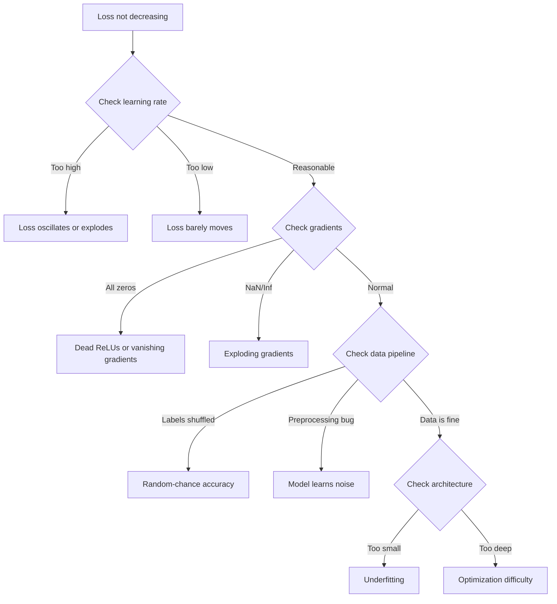
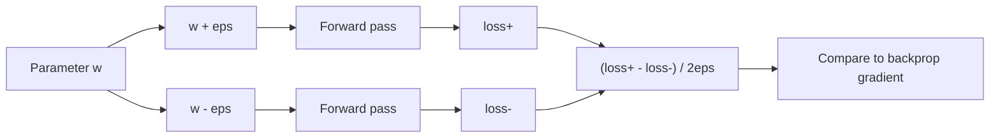
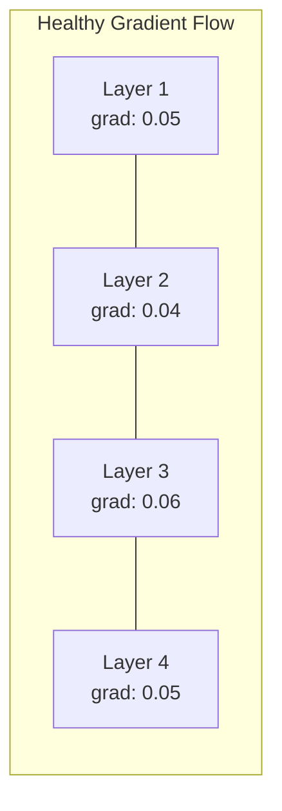
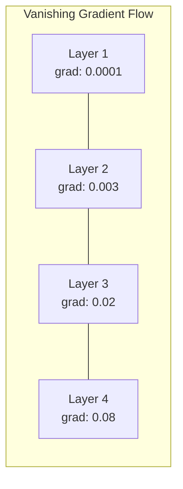
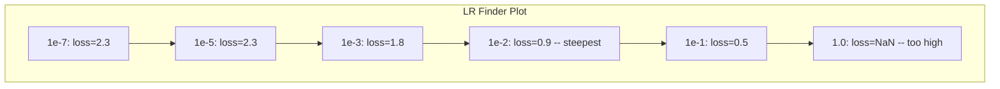

# Debugging Neural Networks

> Mạng của bạn đã biên dịch. Nó đã chạy. Nó tạo ra một con số. Con số đó sai và không có gì bị treo cả. Chào mừng bạn đến với loại hình gỡ lỗi khó nhất -- loại hình mà không có thông báo lỗi nào cả.

**Type:** Build
**Languages:** Python, PyTorch
**Prerequisites:** Phase 03 Lessons 01-10 (đặc biệt là backpropagation, loss functions, optimizers)
**Time:** ~90 phút

## Mục tiêu học tập

- Chẩn đoán các lỗi phổ biến của mạng thần kinh (loss NaN, đường cong loss phẳng, overfitting, dao động) bằng các chiến lược gỡ lỗi có hệ thống.
- Áp dụng kỹ thuật "overfit one batch" để xác minh kiến trúc mô hình và vòng lặp huấn luyện của bạn là chính xác.
- Kiểm tra độ lớn gradient, phân phối kích hoạt (activation) và chuẩn trọng số (weight norms) để xác định các vấn đề gradient biến mất/bùng nổ.
- Xây dựng danh sách kiểm tra gỡ lỗi bao gồm các vấn đề về đường ống dữ liệu (data pipeline), kiến trúc mô hình, hàm loss, trình tối ưu hóa và tốc độ học (learning rate).

## Vấn đề

Phần mềm truyền thống sẽ bị treo khi nó bị hỏng. Một con trỏ null sẽ ném ra một ngoại lệ. Một sự không khớp kiểu dữ liệu sẽ thất bại tại thời điểm biên dịch. Một lỗi off-by-one sẽ tạo ra kết quả sai lệch rõ ràng.

Mạng thần kinh không cho bạn sự xa xỉ đó.

Một mạng thần kinh bị hỏng vẫn chạy đến khi hoàn thành, in ra giá trị loss và đưa ra các dự đoán. Loss có thể giảm. Các dự đoán có vẻ hợp lý. Nhưng mô hình lại sai một cách âm thầm -- học các lối tắt, ghi nhớ nhiễu hoặc hội tụ về một cực tiểu địa phương vô dụng. Các nhà nghiên cứu của Google ước tính rằng 60-70% thời gian gỡ lỗi ML dành cho các lỗi "âm thầm" không tạo ra lỗi nhưng làm giảm chất lượng mô hình.

Sự khác biệt giữa một mô hình hoạt động tốt và một mô hình bị hỏng thường chỉ là một dòng code đặt sai chỗ: thiếu `zero_grad()`, sai chiều tensor, hoặc learning rate lệch 10 lần. "Recipe for Training Neural Networks" (2019) kinh điển đã mở đầu bằng câu: "Những sai lầm phổ biến nhất trong mạng thần kinh là những lỗi không làm treo chương trình."

Bài học này sẽ dạy bạn cách tìm ra những lỗi đó.

## Khái niệm

### Tư duy gỡ lỗi

Hãy quên việc gỡ lỗi bằng cách in (print-and-pray) đi. Gỡ lỗi mạng thần kinh đòi hỏi một cách tiếp cận có hệ thống vì vòng lặp phản hồi chậm (mất vài phút đến vài giờ cho mỗi lần huấn luyện) và các triệu chứng rất mơ hồ (loss xấu có thể có 20 nguyên nhân khác nhau).

Quy tắc vàng: **bắt đầu đơn giản, thêm độ phức tạp từng phần một và xác minh độc lập từng phần.**



### Triệu chứng 1: Loss không giảm

Đây là phàn nàn phổ biến nhất. Vòng lặp huấn luyện chạy, các epoch trôi qua, và loss vẫn phẳng hoặc dao động dữ dội.

**Learning rate sai.** Quá cao: loss dao động hoặc nhảy lên NaN. Quá thấp: loss giảm chậm đến mức trông như phẳng. Với Adam, hãy bắt đầu ở 1e-3. Với SGD, bắt đầu ở 1e-1 hoặc 1e-2. Luôn thử 3 mức learning rate cách nhau 10 lần (ví dụ: 1e-2, 1e-3, 1e-4) trước khi kết luận có vấn đề khác.

**Dead ReLUs.** Nếu một neuron ReLU nhận đầu vào âm lớn, nó xuất ra 0 và gradient của nó là 0. Nó sẽ không bao giờ kích hoạt lại nữa. Nếu đủ số neuron bị chết, mạng không thể học được. Kiểm tra: in tỷ lệ các kích hoạt bằng đúng 0 sau mỗi lớp ReLU. Nếu >50% bị chết, hãy chuyển sang LeakyReLU hoặc giảm learning rate.

**Gradient biến mất (Vanishing gradients).** Trong các mạng sâu với kích hoạt sigmoid hoặc tanh, gradient co lại theo cấp số nhân khi truyền ngược. Đến khi chúng đến lớp đầu tiên, chúng gần bằng 0. Các lớp đầu tiên ngừng học. Khắc phục: sử dụng ReLU/GELU, thêm kết nối tắt (residual connections) hoặc sử dụng batch normalization.

**Gradient bùng nổ (Exploding gradients).** Vấn đề ngược lại -- gradient tăng theo cấp số nhân. Phổ biến trong RNN và các mạng rất sâu. Loss nhảy lên NaN. Khắc phục: gradient clipping (`torch.nn.utils.clip_grad_norm_`), giảm learning rate hoặc thêm chuẩn hóa.

### Triệu chứng 2: Loss giảm nhưng mô hình tệ

Loss giảm. Độ chính xác huấn luyện đạt 99%. Nhưng độ chính xác kiểm tra chỉ là 55%. Hoặc mô hình tạo ra các kết quả vô nghĩa trên dữ liệu thực.

**Overfitting.** Mô hình ghi nhớ dữ liệu huấn luyện thay vì học các quy luật. Khoảng cách giữa loss huấn luyện và validation tăng dần theo thời gian. Khắc phục: thêm dữ liệu, dropout, weight decay, early stopping, tăng cường dữ liệu (data augmentation).

**Data leakage.** Dữ liệu kiểm tra bị rò rỉ vào quá trình huấn luyện. Độ chính xác cao một cách đáng ngờ. Nguyên nhân phổ biến: xáo trộn trước khi chia tập, tiền xử lý bằng thống kê từ toàn bộ tập dữ liệu, các mẫu trùng lặp giữa các tập. Khắc phục: chia tập trước, tiền xử lý sau, kiểm tra trùng lặp.

**Lỗi nhãn (Label errors).** 5-10% nhãn trong hầu hết các tập dữ liệu thực là sai (Northcutt et al., 2021 -- "Pervasive Label Errors in Test Sets"). Mô hình học cả nhiễu. Khắc phục: sử dụng confident learning để tìm và sửa các ví dụ dán nhãn sai, hoặc sử dụng loss truncation để bỏ qua các mẫu có loss cao.

### Triệu chứng 3: NaN hoặc Inf trong Loss

Giá trị loss trở thành `nan` hoặc `inf`. Quá trình huấn luyện đã chết.

**Learning rate quá cao.** Các cập nhật gradient vượt quá mức khiến trọng số bùng nổ. Khắc phục: giảm 10 lần.

**log(0) hoặc log(số âm).** Cross-entropy loss tính toán `log(p)`. Nếu mô hình của bạn xuất ra chính xác 0 hoặc xác suất âm, log sẽ bùng nổ. Khắc phục: kẹp (clamp) các dự đoán vào khoảng `[eps, 1-eps]` với `eps=1e-7`.

**Chia cho 0.** Batch normalization chia cho độ lệch chuẩn. Một batch với các giá trị hằng số có std=0. Khắc phục: thêm epsilon vào mẫu số (PyTorch mặc định làm điều này, nhưng các triển khai tùy chỉnh có thể không).

**Tràn số (Numerical overflow).** Các kích hoạt lớn được đưa vào `exp()` tạo ra Inf. Softmax đặc biệt dễ bị lỗi này. Khắc phục: trừ đi giá trị max trước khi tính lũy thừa (thủ thuật log-sum-exp).

### Kỹ thuật 1: Kiểm tra Gradient (Gradient Checking)

So sánh gradient phân tích (từ backprop) với gradient số (từ sai phân hữu hạn). Nếu chúng không khớp, bước truyền ngược của bạn có lỗi.

Gradient số cho tham số `w`:

```
grad_numerical = (loss(w + eps) - loss(w - eps)) / (2 * eps)
```

Chỉ số đồng thuận (sai lệch tương đối):

```
rel_diff = |grad_analytical - grad_numerical| / max(|grad_analytical|, |grad_numerical|, 1e-8)
```

Nếu `rel_diff < 1e-5`: chính xác. Nếu `rel_diff > 1e-3`: gần như chắc chắn có lỗi.



### Kỹ thuật 2: Thống kê kích hoạt (Activation Statistics)

Theo dõi giá trị trung bình và độ lệch chuẩn của các kích hoạt sau mỗi lớp trong quá trình huấn luyện. Các mạng khỏe mạnh duy trì các kích hoạt với trung bình gần 0 và std gần 1 (sau khi chuẩn hóa) hoặc ít nhất là bị giới hạn.

| Chỉ số sức khỏe | Trung bình | Std | Chẩn đoán |
|-----------------|------|-----|-----------|
| Khỏe mạnh | ~0 | ~1 | Mạng đang học bình thường |
| Bão hòa | >>0 hoặc <<0 | ~0 | Kích hoạt bị kẹt ở các giá trị cực đoan |
| Chết | 0 | 0 | Các neuron đã chết (toàn số 0) |
| Bùng nổ | >>10 | >>10 | Kích hoạt tăng không giới hạn |

### Kỹ thuật 3: Trực quan hóa dòng chảy Gradient

Vẽ biểu đồ độ lớn gradient trung bình cho mỗi lớp. Trong một mạng khỏe mạnh, độ lớn gradient nên tương đương nhau giữa các lớp. Nếu các lớp đầu có gradient nhỏ hơn 1000 lần so với các lớp sau, bạn đang gặp vấn đề gradient biến mất.





### Kỹ thuật 4: Kiểm tra Overfit-One-Batch

Kỹ thuật gỡ lỗi quan trọng nhất trong deep learning.

Lấy một batch nhỏ (8-32 mẫu). Huấn luyện trên đó trong 100+ vòng lặp. Loss nên giảm xuống gần bằng 0 và độ chính xác huấn luyện nên đạt 100%. Nếu không, mô hình hoặc vòng lặp huấn luyện của bạn có lỗi cơ bản -- đừng tiếp tục huấn luyện toàn bộ.

Bài kiểm tra này phát hiện:
- Hàm loss bị hỏng
- Bước truyền ngược bị hỏng
- Kiến trúc quá nhỏ để biểu diễn dữ liệu
- Trình tối ưu hóa không kết nối với tham số mô hình
- Dữ liệu và nhãn bị lệch

Việc này chỉ mất 30 giây để chạy và tiết kiệm hàng giờ gỡ lỗi cho các lần huấn luyện đầy đủ.

### Kỹ thuật 5: Tìm kiếm Learning Rate (LR Finder)

Leslie Smith (2017) đề xuất quét learning rate từ rất nhỏ (1e-7) đến rất lớn (10) trong một epoch trong khi ghi lại loss. Vẽ biểu đồ loss theo learning rate. Learning rate tối ưu thường nhỏ hơn khoảng 10 lần so với mức mà loss bắt đầu giảm nhanh nhất.



LR tốt nhất trong ví dụ này: ~1e-3 (một bậc độ lớn trước điểm dốc nhất).

### Các lỗi PyTorch phổ biến

Đây là những lỗi gây lãng phí nhiều thời gian nhất trong cộng đồng PyTorch:

| Lỗi | Triệu chứng | Khắc phục |
|-----|---------|-----|
| Quên `optimizer.zero_grad()` | Gradient tích lũy qua các batch, loss dao động | Thêm `optimizer.zero_grad()` trước `loss.backward()` |
| Quên `model.eval()` khi test | Dropout và batch norm hoạt động khác biệt, độ chính xác test thay đổi | Thêm `model.eval()` và `torch.no_grad()` |
| Sai hình dạng tensor | Broadcasting âm thầm tạo ra kết quả sai, không báo lỗi | In hình dạng sau mỗi thao tác khi gỡ lỗi |
| CPU/GPU không khớp | `RuntimeError: expected CUDA tensor` | Sử dụng `.to(device)` trên cả mô hình VÀ dữ liệu |
| Không detach tensor | Đồ thị tính toán tăng mãi, OOM | Sử dụng `.detach()` hoặc `with torch.no_grad()` |
| Thao tác in-place làm hỏng autograd | `RuntimeError: modified by in-place operation` | Thay thế `x += 1` bằng `x = x + 1` |
| Dữ liệu chưa chuẩn hóa | Loss kẹt ở mức ngẫu nhiên | Chuẩn hóa đầu vào về mean=0, std=1 |
| Nhãn sai kiểu dữ liệu | Cross-entropy mong đợi `Long`, nhận `Float` | Ép kiểu nhãn: `labels.long()` |

### Bảng gỡ lỗi tổng quát

| Triệu chứng | Nguyên nhân khả dĩ | Việc đầu tiên cần thử |
|---------|-------------|-------------------|
| Loss kẹt ở -log(1/num_classes) | Mô hình dự đoán phân phối đều | Kiểm tra đường ống dữ liệu, xác minh nhãn khớp với đầu vào |
| Loss NaN sau vài bước | Learning rate quá cao | Giảm LR 10 lần |
| Loss NaN ngay lập tức | log(0) hoặc chia cho 0 | Thêm epsilon vào các thao tác log/chia |
| Loss dao động dữ dội | LR quá cao hoặc batch size quá nhỏ | Giảm LR, tăng batch size |
| Loss giảm rồi đi ngang | LR quá cao cho giai đoạn tinh chỉnh | Thêm lịch trình LR (cosine hoặc step decay) |
| Acc huấn luyện cao, acc test thấp | Overfitting | Thêm dropout, weight decay, thêm dữ liệu |
| Acc huấn luyện = acc test = ngẫu nhiên | Mô hình không học được gì | Chạy kiểm tra overfit-one-batch |
| Acc huấn luyện = acc test nhưng đều thấp | Underfitting | Mô hình lớn hơn, nhiều lớp hơn, nhiều đặc trưng hơn |
| Gradient toàn số 0 | Dead ReLUs hoặc đồ thị tính toán bị ngắt | Chuyển sang LeakyReLU, kiểm tra `.requires_grad` |
| Hết bộ nhớ khi huấn luyện | Batch quá lớn hoặc đồ thị không được giải phóng | Giảm batch size, sử dụng `torch.no_grad()` khi eval |

```figure
learning-curves
```

## Xây dựng

Một bộ công cụ chẩn đoán theo dõi các kích hoạt, gradient và đường cong loss. Bạn sẽ cố tình làm hỏng một mạng và sử dụng bộ công cụ để chẩn đoán từng vấn đề.

### Bước 1: Lớp NetworkDebugger

Kết nối vào mô hình PyTorch để ghi lại thống kê kích hoạt và gradient theo từng lớp.

```python
import torch
import torch.nn as nn
import math


class NetworkDebugger:
    def __init__(self, model):
        self.model = model
        self.activation_stats = {}
        self.gradient_stats = {}
        self.loss_history = []
        self.lr_losses = []
        self.hooks = []
        self._register_hooks()

    def _register_hooks(self):
        for name, module in self.model.named_modules():
            if isinstance(module, (nn.Linear, nn.Conv2d, nn.ReLU, nn.LeakyReLU)):
                hook = module.register_forward_hook(self._make_activation_hook(name))
                self.hooks.append(hook)
                hook = module.register_full_backward_hook(self._make_gradient_hook(name))
                self.hooks.append(hook)

    def _make_activation_hook(self, name):
        def hook(module, input, output):
            with torch.no_grad():
                out = output.detach().float()
                self.activation_stats[name] = {
                    "mean": out.mean().item(),
                    "std": out.std().item(),
                    "fraction_zero": (out == 0).float().mean().item(),
                    "min": out.min().item(),
                    "max": out.max().item(),
                }
        return hook

    def _make_gradient_hook(self, name):
        def hook(module, grad_input, grad_output):
            if grad_output[0] is not None:
                with torch.no_grad():
                    grad = grad_output[0].detach().float()
                    self.gradient_stats[name] = {
                        "mean": grad.mean().item(),
                        "std": grad.std().item(),
                        "abs_mean": grad.abs().mean().item(),
                        "max": grad.abs().max().item(),
                    }
        return hook

    def record_loss(self, loss_value):
        self.loss_history.append(loss_value)

    def check_loss_health(self):
        if len(self.loss_history) < 2:
            return "NOT_ENOUGH_DATA"
        recent = self.loss_history[-10:]
        if any(math.isnan(v) or math.isinf(v) for v in recent):
            return "NAN_OR_INF"
        if len(self.loss_history) >= 20:
            first_half = sum(self.loss_history[:10]) / 10
            second_half = sum(self.loss_history[-10:]) / 10
            if second_half >= first_half * 0.99:
                return "NOT_DECREASING"
        if len(recent) >= 5:
            diffs = [recent[i+1] - recent[i] for i in range(len(recent)-1)]
            if max(diffs) - min(diffs) > 2 * abs(sum(diffs) / len(diffs)):
                return "OSCILLATING"
        return "HEALTHY"

    def check_activations(self):
        issues = []
        for name, stats in self.activation_stats.items():
            if stats["fraction_zero"] > 0.5:
                issues.append(f"DEAD_NEURONS: {name} has {stats['fraction_zero']:.0%} zero activations")
            if abs(stats["mean"]) > 10:
                issues.append(f"EXPLODING_ACTIVATIONS: {name} mean={stats['mean']:.2f}")
            if stats["std"] < 1e-6:
                issues.append(f"COLLAPSED_ACTIVATIONS: {name} std={stats['std']:.2e}")
        return issues if issues else ["HEALTHY"]

    def check_gradients(self):
        issues = []
        grad_magnitudes = []
        for name, stats in self.gradient_stats.items():
            grad_magnitudes.append((name, stats["abs_mean"]))
            if stats["abs_mean"] < 1e-7:
                issues.append(f"VANISHING_GRADIENT: {name} abs_mean={stats['abs_mean']:.2e}")
            if stats["abs_mean"] > 100:
                issues.append(f"EXPLODING_GRADIENT: {name} abs_mean={stats['abs_mean']:.2e}")
        if len(grad_magnitudes) >= 2:
            first_mag = grad_magnitudes[0][1]
            last_mag = grad_magnitudes[-1][1]
            if last_mag > 0 and first_mag / last_mag > 100:
                issues.append(f"GRADIENT_RATIO: first/last = {first_mag/last_mag:.0f}x (vanishing)")
        return issues if issues else ["HEALTHY"]

    def print_report(self):
        print("\n=== NETWORK DEBUGGER REPORT ===")
        print(f"\nLoss health: {self.check_loss_health()}")
        if self.loss_history:
            print(f"  Last 5 losses: {[f'{v:.4f}' for v in self.loss_history[-5:]]}")
        print("\nActivation diagnostics:")
        for item in self.check_activations():
            print(f"  {item}")
        print("\nGradient diagnostics:")
        for item in self.check_gradients():
            print(f"  {item}")
        print("\nPer-layer activation stats:")
        for name, stats in self.activation_stats.items():
            print(f"  {name}: mean={stats['mean']:.4f} std={stats['std']:.4f} zero={stats['fraction_zero']:.1%}")
        print("\nPer-layer gradient stats:")
        for name, stats in self.gradient_stats.items():
            print(f"  {name}: abs_mean={stats['abs_mean']:.2e} max={stats['max']:.2e}")

    def remove_hooks(self):
        for hook in self.hooks:
            hook.remove()
        self.hooks.clear()
```

### Bước 2: Kiểm tra Overfit-One-Batch

```python
def overfit_one_batch(model, x_batch, y_batch, criterion, lr=0.01, steps=200):
    optimizer = torch.optim.Adam(model.parameters(), lr=lr)
    model.train()
    print("\n=== OVERFIT ONE BATCH TEST ===")
    print(f"Batch size: {x_batch.shape[0]}, Steps: {steps}")

    for step in range(steps):
        optimizer.zero_grad()
        output = model(x_batch)
        loss = criterion(output, y_batch)
        loss.backward()
        optimizer.step()

        if step % 50 == 0 or step == steps - 1:
            with torch.no_grad():
                preds = (output > 0).float() if output.shape[-1] == 1 else output.argmax(dim=1)
                targets = y_batch if y_batch.dim() == 1 else y_batch.squeeze()
                acc = (preds.squeeze() == targets).float().mean().item()
            print(f"  Step {step:3d} | Loss: {loss.item():.6f} | Accuracy: {acc:.1%}")

    final_loss = loss.item()
    if final_loss > 0.1:
        print(f"\n  FAIL: Loss did not converge ({final_loss:.4f}). Model or training loop is broken.")
        return False
    print(f"\n  PASS: Loss converged to {final_loss:.6f}")
    return True
```

### Bước 3: Tìm kiếm Learning Rate

```python
def find_learning_rate(model, x_data, y_data, criterion, start_lr=1e-7, end_lr=10, steps=100):
    import copy
    original_state = copy.deepcopy(model.state_dict())
    optimizer = torch.optim.SGD(model.parameters(), lr=start_lr)
    lr_mult = (end_lr / start_lr) ** (1 / steps)

    model.train()
    results = []
    best_loss = float("inf")
    current_lr = start_lr

    print("\n=== LEARNING RATE FINDER ===")

    for step in range(steps):
        optimizer.zero_grad()
        output = model(x_data)
        loss = criterion(output, y_data)

        if math.isnan(loss.item()) or loss.item() > best_loss * 10:
            break

        best_loss = min(best_loss, loss.item())
        results.append((current_lr, loss.item()))

        loss.backward()
        optimizer.step()

        current_lr *= lr_mult
        for param_group in optimizer.param_groups:
            param_group["lr"] = current_lr

    model.load_state_dict(original_state)

    if len(results) < 10:
        print("  Could not complete LR sweep -- loss diverged too quickly")
        return results

    min_loss_idx = min(range(len(results)), key=lambda i: results[i][1])
    suggested_lr = results[max(0, min_loss_idx - 10)][0]

    print(f"  Swept {len(results)} steps from {start_lr:.0e} to {results[-1][0]:.0e}")
    print(f"  Minimum loss {results[min_loss_idx][1]:.4f} at lr={results[min_loss_idx][0]:.2e}")
    print(f"  Suggested learning rate: {suggested_lr:.2e}")

    return results
```

### Bước 4: Kiểm tra Gradient

```python
def _flat_to_multi_index(flat_idx, shape):
    multi_idx = []
    remaining = flat_idx
    for dim in reversed(shape):
        multi_idx.insert(0, remaining % dim)
        remaining //= dim
    return tuple(multi_idx)


def gradient_check(model, x, y, criterion, eps=1e-4):
    model.train()
    x_double = x.double()
    y_double = y.double()
    model_double = model.double()

    print("\n=== GRADIENT CHECK ===")
    overall_max_diff = 0
    checked = 0

    for name, param in model_double.named_parameters():
        if not param.requires_grad:
            continue

        layer_max_diff = 0

        model_double.zero_grad()
        output = model_double(x_double)
        loss = criterion(output, y_double)
        loss.backward()
        analytical_grad = param.grad.clone()

        num_checks = min(5, param.numel())
        for i in range(num_checks):
            idx = _flat_to_multi_index(i, param.shape)
            original = param.data[idx].item()

            param.data[idx] = original + eps
            with torch.no_grad():
                loss_plus = criterion(model_double(x_double), y_double).item()

            param.data[idx] = original - eps
            with torch.no_grad():
                loss_minus = criterion(model_double(x_double), y_double).item()

            param.data[idx] = original

            numerical = (loss_plus - loss_minus) / (2 * eps)
            analytical = analytical_grad[idx].item()

            denom = max(abs(numerical), abs(analytical), 1e-8)
            rel_diff = abs(numerical - analytical) / denom

            layer_max_diff = max(layer_max_diff, rel_diff)
            checked += 1

        overall_max_diff = max(overall_max_diff, layer_max_diff)
        status = "OK" if layer_max_diff < 1e-5 else "MISMATCH"
        print(f"  {name}: max_rel_diff={layer_max_diff:.2e} [{status}]")

    model.float()

    print(f"\n  Checked {checked} parameters")
    if overall_max_diff < 1e-5:
        print("  PASS: Gradients match (rel_diff < 1e-5)")
    elif overall_max_diff < 1e-3:
        print("  WARN: Small differences (1e-5 < rel_diff < 1e-3)")
    else:
        print("  FAIL: Gradient mismatch detected (rel_diff > 1e-3)")
    return overall_max_diff
```

### Bước 5: Các mạng bị hỏng có chủ đích

Bây giờ hãy áp dụng bộ công cụ vào các mạng bị hỏng và chẩn đoán từng mạng.

```python
def demo_broken_networks():
    torch.manual_seed(42)
    x = torch.randn(64, 10)
    y = (x[:, 0] > 0).long()

    print("\n" + "=" * 60)
    print("BUG 1: Learning rate too high (lr=10)")
    print("=" * 60)
    model1 = nn.Sequential(nn.Linear(10, 32), nn.ReLU(), nn.Linear(32, 2))
    debugger1 = NetworkDebugger(model1)
    optimizer1 = torch.optim.SGD(model1.parameters(), lr=10.0)
    criterion = nn.CrossEntropyLoss()
    for step in range(20):
        optimizer1.zero_grad()
        out = model1(x)
        loss = criterion(out, y)
        debugger1.record_loss(loss.item())
        loss.backward()
        optimizer1.step()
    debugger1.print_report()
    debugger1.remove_hooks()

    print("\n" + "=" * 60)
    print("BUG 2: Dead ReLUs from bad initialization")
    print("=" * 60)
    model2 = nn.Sequential(nn.Linear(10, 32), nn.ReLU(), nn.Linear(32, 32), nn.ReLU(), nn.Linear(32, 2))
    with torch.no_grad():
        for m in model2.modules():
            if isinstance(m, nn.Linear):
                m.weight.fill_(-1.0)
                m.bias.fill_(-5.0)
    debugger2 = NetworkDebugger(model2)
    optimizer2 = torch.optim.Adam(model2.parameters(), lr=1e-3)
    for step in range(50):
        optimizer2.zero_grad()
        out = model2(x)
        loss = criterion(out, y)
        debugger2.record_loss(loss.item())
        loss.backward()
        optimizer2.step()
    debugger2.print_report()
    debugger2.remove_hooks()

    print("\n" + "=" * 60)
    print("BUG 3: Missing zero_grad (gradients accumulate)")
    print("=" * 60)
    model3 = nn.Sequential(nn.Linear(10, 32), nn.ReLU(), nn.Linear(32, 2))
    debugger3 = NetworkDebugger(model3)
    optimizer3 = torch.optim.SGD(model3.parameters(), lr=0.01)
    for step in range(50):
        out = model3(x)
        loss = criterion(out, y)
        debugger3.record_loss(loss.item())
        loss.backward()
        optimizer3.step()
    debugger3.print_report()
    debugger3.remove_hooks()

    print("\n" + "=" * 60)
    print("HEALTHY NETWORK: Correct setup for comparison")
    print("=" * 60)
    model_good = nn.Sequential(nn.Linear(10, 32), nn.ReLU(), nn.Linear(32, 2))
    debugger_good = NetworkDebugger(model_good)
    optimizer_good = torch.optim.Adam(model_good.parameters(), lr=1e-3)
    for step in range(50):
        optimizer_good.zero_grad()
        out = model_good(x)
        loss = criterion(out, y)
        debugger_good.record_loss(loss.item())
        loss.backward()
        optimizer_good.step()
    debugger_good.print_report()
    debugger_good.remove_hooks()

    print("\n" + "=" * 60)
    print("OVERFIT-ONE-BATCH TEST (healthy model)")
    print("=" * 60)
    model_test = nn.Sequential(nn.Linear(10, 32), nn.ReLU(), nn.Linear(32, 2))
    overfit_one_batch(model_test, x[:8], y[:8], criterion)

    print("\n" + "=" * 60)
    print("LEARNING RATE FINDER")
    print("=" * 60)
    model_lr = nn.Sequential(nn.Linear(10, 32), nn.ReLU(), nn.Linear(32, 2))
    find_learning_rate(model_lr, x, y, criterion)

    print("\n" + "=" * 60)
    print("GRADIENT CHECK")
    print("=" * 60)
    model_grad = nn.Sequential(nn.Linear(10, 8), nn.ReLU(), nn.Linear(8, 2))
    gradient_check(model_grad, x[:4], y[:4], criterion)
```

## Sử dụng

### Công cụ tích hợp sẵn của PyTorch

```python
import torch
import torch.nn as nn

model = nn.Sequential(
    nn.Linear(768, 256),
    nn.ReLU(),
    nn.Linear(256, 10),
)

with torch.autograd.detect_anomaly():
    output = model(input_tensor)
    loss = criterion(output, target)
    loss.backward()

for name, param in model.named_parameters():
    if param.grad is not None:
        print(f"{name}: grad_mean={param.grad.abs().mean():.2e}")
```

### Tích hợp Weights & Biases

```python
import wandb

wandb.init(project="debug-training")

for epoch in range(100):
    loss = train_one_epoch()
    wandb.log({
        "loss": loss,
        "lr": optimizer.param_groups[0]["lr"],
        "grad_norm": torch.nn.utils.clip_grad_norm_(model.parameters(), float("inf")),
    })

    for name, param in model.named_parameters():
        if param.grad is not None:
            wandb.log({f"grad/{name}": wandb.Histogram(param.grad.cpu().numpy())})
```

### TensorBoard

```python
from torch.utils.tensorboard import SummaryWriter

writer = SummaryWriter("runs/debug_experiment")

for epoch in range(100):
    loss = train_one_epoch()
    writer.add_scalar("Loss/train", loss, epoch)

    for name, param in model.named_parameters():
        writer.add_histogram(f"weights/{name}", param, epoch)
        if param.grad is not None:
            writer.add_histogram(f"gradients/{name}", param.grad, epoch)
```

### Danh sách kiểm tra gỡ lỗi (Trước khi huấn luyện đầy đủ)

1. Chạy kiểm tra overfit-one-batch. Nếu thất bại, dừng lại.
2. In tóm tắt mô hình -- xác minh số lượng tham số là hợp lý.
3. Chạy một lượt forward pass với dữ liệu ngẫu nhiên -- kiểm tra hình dạng đầu ra.
4. Huấn luyện trong 5 epoch -- xác minh loss giảm.
5. Kiểm tra thống kê kích hoạt -- không có lớp chết, không có sự bùng nổ.
6. Kiểm tra dòng chảy gradient -- không biến mất, không bùng nổ.
7. Xác minh đường ống dữ liệu -- in 5 mẫu ngẫu nhiên với nhãn.

## Triển khai

Bài học này tạo ra:
- `outputs/prompt-nn-debugger.md` -- một prompt để chẩn đoán các lỗi huấn luyện mạng thần kinh
- `outputs/skill-debug-checklist.md` -- một danh sách kiểm tra dạng cây quyết định để gỡ lỗi các vấn đề huấn luyện

Các mô hình triển khai chính để gỡ lỗi:
- Thêm các hook giám sát vào các script huấn luyện sản xuất
- Ghi lại thống kê kích hoạt và gradient vào W&B hoặc TensorBoard sau mỗi N bước
- Triển khai cảnh báo tự động cho loss NaN, neuron chết (>80% bằng 0) hoặc bùng nổ gradient
- Luôn chạy kiểm tra overfit-one-batch khi thay đổi kiến trúc hoặc đường ống dữ liệu

## Bài tập

1. **Thêm bộ phát hiện gradient bùng nổ.** Sửa đổi `NetworkDebugger` để phát hiện khi gradient vượt quá ngưỡng và tự động đề xuất giá trị gradient clipping. Kiểm tra nó trên mạng 20 lớp không có chuẩn hóa.

2. **Xây dựng bộ hồi sinh neuron chết.** Viết hàm xác định các neuron ReLU chết (luôn xuất ra 0) và khởi tạo lại trọng số đầu vào của chúng bằng Kaiming initialization. Chứng minh rằng điều này khôi phục được mạng có >70% neuron bị chết.

3. **Triển khai tìm kiếm learning rate với vẽ biểu đồ.** Mở rộng `find_learning_rate` để lưu kết quả dưới dạng CSV và viết một script riêng đọc CSV đó và hiển thị đường cong LR vs loss bằng matplotlib. Xác định LR tối ưu cho ResNet-18 trên CIFAR-10.

4. **Tạo trình xác thực đường ống dữ liệu.** Viết hàm kiểm tra: các mẫu trùng lặp giữa các tập train/test, mất cân bằng phân phối nhãn (tỷ lệ >10:1), chuẩn hóa đầu vào (mean gần 0, std gần 1) và các giá trị NaN/Inf trong dữ liệu. Chạy nó trên một tập dữ liệu bị hỏng có chủ đích.

5. **Gỡ lỗi một lỗi thực tế.** Lấy khung làm việc mini từ Bài 10, đưa vào một lỗi tinh vi (ví dụ: chuyển vị ma trận trọng số trong backward) và sử dụng kiểm tra gradient để xác định chính xác tham số nào có gradient không chính xác. Ghi lại quá trình gỡ lỗi.

## Thuật ngữ chính

| Thuật ngữ | Cách gọi thông thường | Ý nghĩa thực tế |
|------|----------------|----------------------|
| Silent bug | "Nó chạy nhưng kết quả tệ" | Lỗi không tạo ra thông báo nhưng làm giảm chất lượng mô hình -- chế độ lỗi phổ biến nhất trong ML |
| Dead ReLU | "Các neuron đã chết" | Neuron ReLU có đầu vào luôn âm, nên xuất ra 0 và nhận gradient 0 vĩnh viễn |
| Vanishing gradients | "Các lớp đầu ngừng học" | Gradient co lại theo cấp số nhân qua các lớp, khiến trọng số ở các lớp đầu bị đóng băng |
| Exploding gradients | "Loss nhảy lên NaN" | Gradient tăng theo cấp số nhân qua các lớp, gây ra cập nhật trọng số quá lớn làm tràn số |
| Gradient checking | "Xác minh backprop đúng" | So sánh gradient phân tích từ backprop với gradient số từ sai phân hữu hạn |
| Overfit-one-batch | "Bài kiểm tra gỡ lỗi quan trọng nhất" | Huấn luyện trên một batch nhỏ để xác minh mô hình CÓ THỂ học -- nếu không, có gì đó bị hỏng cơ bản |
| LR finder | "Quét để tìm learning rate đúng" | Tăng dần learning rate theo cấp số nhân qua một epoch và chọn mức ngay trước khi loss phân kỳ |
| Data leakage | "Dữ liệu test rò rỉ vào train" | Khi thông tin từ tập test nhiễm vào quá trình huấn luyện, tạo ra độ chính xác cao giả tạo |
| Activation statistics | "Giám sát sức khỏe lớp" | Theo dõi trung bình, std và tỷ lệ bằng 0 của đầu ra mỗi lớp để phát hiện neuron chết, bão hòa hoặc bùng nổ |
| Gradient clipping | "Giới hạn độ lớn gradient" | Thu nhỏ gradient khi chuẩn của chúng vượt quá ngưỡng, ngăn chặn các cập nhật gradient bùng nổ |

## Đọc thêm

- Smith, "Cyclical Learning Rates for Training Neural Networks" (2017) -- bài báo giới thiệu kiểm tra phạm vi learning rate (LR finder)
- Northcutt et al., "Pervasive Label Errors in Test Sets Destabilize Machine Learning Benchmarks" (2021) -- chứng minh 3-6% nhãn trong ImageNet, CIFAR-10 và các benchmark lớn khác là sai
- Zhang et al., "Understanding Deep Learning Requires Rethinking Generalization" (2017) -- bài báo cho thấy mạng thần kinh có thể ghi nhớ các nhãn ngẫu nhiên, đó là lý do tại sao kiểm tra overfit-one-batch hoạt động
- Tài liệu PyTorch về `torch.autograd.detect_anomaly` và `torch.autograd.set_detect_anomaly` để phát hiện NaN/Inf tích hợp sẵn