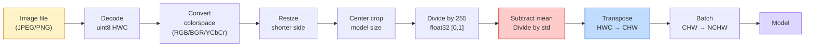
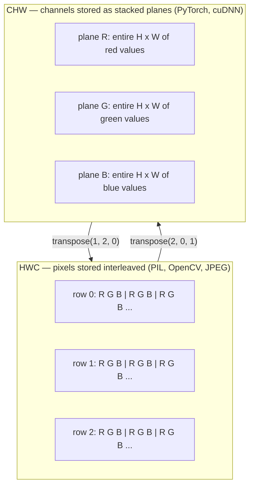

# Nguyên lý cơ bản về hình ảnh — Pixels, Channels, Color Spaces

> Một hình ảnh là một tensor chứa các mẫu ánh sáng. Mọi mô hình thị giác máy tính mà bạn từng sử dụng đều bắt đầu từ sự thật này.

**Type:** Build
**Languages:** Python
**Prerequisites:** Phase 1 Lesson 12 (Tensor Operations), Phase 3 Lesson 11 (Intro to PyTorch)
**Time:** ~45 phút

## Mục tiêu học tập

- Giải thích cách một cảnh quay liên tục được rời rạc hóa thành các pixel và tại sao các quyết định về lấy mẫu (sampling)/lượng tử hóa (quantization) lại đặt ra giới hạn cho mọi mô hình ở hạ nguồn.
- Đọc, cắt (slice) và kiểm tra hình ảnh dưới dạng NumPy array, đồng thời chuyển đổi linh hoạt giữa các bố cục HWC và CHW.
- Chuyển đổi giữa RGB, grayscale, HSV và YCbCr, đồng thời giải thích lý do tại sao mỗi không gian màu lại tồn tại.
- Áp dụng tiền xử lý ở cấp độ pixel (normalize, standardize, resize, channel-first) chính xác như cách các mô hình thị giác PyTorch đã huấn luyện trước mong đợi.

## Vấn đề

Mọi bài báo bạn đọc, mọi trọng số (weights) đã huấn luyện trước mà bạn tải xuống, mọi vision API bạn gọi đều giả định một cách mã hóa đầu vào cụ thể. Nếu bạn truyền một hình ảnh `uint8` trong khi mô hình muốn `float32`, nó vẫn sẽ chạy — nhưng âm thầm tạo ra kết quả rác. Cung cấp BGR cho một mạng được huấn luyện trên RGB sẽ khiến độ chính xác giảm mười điểm. Đưa cho mô hình đầu vào dạng channels-last khi nó mong đợi channels-first sẽ khiến lớp conv đầu tiên coi chiều cao là một kênh đặc trưng. Không có lỗi nào được đưa ra cả. Nó chỉ phá hỏng các chỉ số của bạn và bạn sẽ mất cả tuần để săn lùng một lỗi nằm ở cách bạn tải tệp.

Phép tích chập (convolution) không phức tạp một khi bạn biết nó đang trượt trên cái gì. Phần khó là "một hình ảnh" có ý nghĩa khác nhau đối với máy ảnh, bộ giải mã JPEG, PIL, OpenCV, torchvision và CUDA kernel. Mỗi stack có thứ tự trục, phạm vi byte và quy ước kênh riêng. Một kỹ sư thị giác máy tính không nắm rõ những điều này sẽ tạo ra các pipeline bị lỗi.

Bài học này củng cố nền tảng để phần còn lại của giai đoạn này có thể xây dựng dựa trên đó. Đến cuối bài, bạn sẽ biết pixel là gì, tại sao lại có ba số cho mỗi pixel thay vì một, "chuẩn hóa với các thông số ImageNet" thực sự làm gì và cách di chuyển giữa hai hoặc ba bố cục mà mọi bài học khác trong giai đoạn này sẽ giả định.

## Khái niệm

### Tổng quan về pipeline tiền xử lý

Mọi hệ thống thị giác máy tính trong sản xuất đều là một chuỗi các phép biến đổi có thể đảo ngược. Chỉ cần sai một bước, mô hình sẽ nhìn thấy một đầu vào khác với đầu vào mà nó đã được huấn luyện.



Hai hộp màu đỏ và xanh dương là nơi chứa 80% các lỗi âm thầm: thiếu chuẩn hóa (standardization) và sai bố cục (layout).

### Pixel là một mẫu, không phải một hình vuông

Cảm biến máy ảnh đếm các photon rơi trên một lưới các máy dò nhỏ. Mỗi máy dò tích hợp ánh sáng trong một phần nhỏ của giây và phát ra điện áp tỷ lệ thuận với số lượng photon đập vào nó. Sau đó, cảm biến rời rạc hóa điện áp đó thành một số nguyên. Một máy dò trở thành một pixel.

```
Continuous scene                 Sensor grid                     Digital image
(infinite detail)                (H x W detectors)               (H x W integers)

    ~~~~~                        +--+--+--+--+--+                 210 198 180 155 120
   ~   ~   ~                     |  |  |  |  |  |                 205 195 178 152 118
  ~ light ~      ---->           +--+--+--+--+--+     ---->       200 190 175 150 115
   ~~~~~                         |  |  |  |  |  |                 195 185 170 148 112
                                 +--+--+--+--+--+                 188 180 165 145 108
```

Hai lựa chọn xảy ra ở bước này và chúng quyết định giới hạn của mọi thứ ở hạ nguồn:

- **Lấy mẫu không gian (Spatial sampling)** quyết định số lượng máy dò trên mỗi độ của cảnh. Quá ít, các cạnh sẽ bị răng cưa (aliasing). Quá nhiều, lưu trữ và tính toán sẽ bùng nổ.
- **Lượng tử hóa cường độ (Intensity quantization)** quyết định mức độ chi tiết của điện áp. 8 bit cho 256 mức và là tiêu chuẩn cho hiển thị. 10, 12, 16 bit cho các dải màu mượt mà hơn và quan trọng đối với hình ảnh y tế, HDR và các pipeline cảm biến thô (raw).

Pixel không phải là một hình vuông có màu với diện tích. Nó là một phép đo đơn lẻ. Khi bạn thay đổi kích thước hoặc xoay, bạn đang lấy mẫu lại lưới đo lường đó.

### Tại sao lại có ba kênh

Một máy dò đếm các photon trên toàn bộ quang phổ khả kiến — đó là grayscale. Để có màu, cảm biến bao phủ lưới bằng một bức tranh khảm các bộ lọc đỏ, xanh lục và xanh dương. Sau khi khử khảm (demosaicing), mỗi vị trí không gian có ba số nguyên: phản hồi của máy dò lọc đỏ, xanh lục và xanh dương gần đó. Ba số nguyên đó là bộ ba RGB của một pixel.

```
One pixel in memory:

    (R, G, B) = (210, 140, 30)   <- reddish-orange

An H x W RGB image:

    shape (H, W, 3)     stored as   H rows of W pixels of 3 values
                                    each in [0, 255] for uint8
```

Ba không phải là con số kỳ diệu. Camera chiều sâu thêm kênh Z. Vệ tinh thêm các dải hồng ngoại và tử ngoại. Các bản quét y tế thường có một kênh (X-ray, CT) hoặc nhiều kênh (hyperspectral). Số lượng kênh là trục cuối cùng; các lớp conv học cách trộn lẫn trên trục đó.

### Hai quy ước bố cục: HWC và CHW

Cùng một tensor, hai cách sắp xếp. Mỗi thư viện chọn một cách.

```
HWC (height, width, channels)           CHW (channels, height, width)

   W ->                                    H ->
  +-----+-----+-----+                     +-----+-----+
H |R G B|R G B|R G B|                   C |R R R R R R|
| +-----+-----+-----+                   | +-----+-----+
v |R G B|R G B|R G B|                   v |G G G G G G|
  +-----+-----+-----+                     +-----+-----+
                                          |B B B B B B|
                                          +-----+-----+

   PIL, OpenCV, matplotlib,              PyTorch, most deep learning
   almost every image file on disk       frameworks, cuDNN kernels
```

CHW tồn tại vì các kernel tích chập trượt qua H và W. Việc giữ trục kênh ở đầu có nghĩa là mỗi kernel nhìn thấy một mặt phẳng 2D liên tục cho mỗi kênh, giúp vector hóa sạch sẽ. Các định dạng đĩa giữ HWC vì nó khớp với cách các dòng quét (scanlines) đi ra từ cảm biến.

Phép chuyển đổi một dòng mà bạn sẽ gõ hàng nghìn lần:

```
img_chw = img_hwc.transpose(2, 0, 1)      # NumPy
img_chw = img_hwc.permute(2, 0, 1)        # PyTorch tensor
```

Bố cục bộ nhớ, được trực quan hóa:



### Phạm vi byte và dtype

Ba quy ước chiếm ưu thế:

| Quy ước | dtype | Phạm vi | Nơi bạn thấy nó |
|------------|-------|-------|------------------|
| Raw | `uint8` | [0, 255] | Tệp trên đĩa, PIL, đầu ra OpenCV |
| Normalized | `float32` | [0.0, 1.0] | Sau `img.astype('float32') / 255` |
| Standardized | `float32` | khoảng [-2, +2] | Sau khi trừ trung bình và chia cho độ lệch chuẩn |

Các mạng tích chập được huấn luyện trên các đầu vào đã được chuẩn hóa. Các thông số ImageNet `mean=[0.485, 0.456, 0.406]`, `std=[0.229, 0.224, 0.225]` là giá trị trung bình cộng và độ lệch chuẩn của ba kênh trên toàn bộ tập huấn luyện ImageNet, được tính trên các pixel đã chuẩn hóa [0, 1]. Việc đưa `uint8` thô vào một mô hình mong đợi float đã chuẩn hóa là lỗi âm thầm phổ biến nhất trong thị giác máy tính ứng dụng.

### Không gian màu và lý do chúng tồn tại

RGB là định dạng thu nhận nhưng không phải lúc nào cũng là biểu diễn hữu ích nhất cho một mô hình.

```
 RGB               HSV                       YCbCr / YUV

 R red             H hue (angle 0-360)       Y luminance (brightness)
 G green           S saturation (0-1)        Cb chroma blue-yellow
 B blue            V value/brightness (0-1)  Cr chroma red-green

 Linear to         Separates color from      Separates brightness from
 sensor output     brightness. Useful for    color. JPEG and most video
                   color thresholding, UI    codecs compress the chroma
                   sliders, simple filters   channels harder because the
                                             human eye is less sensitive
                                             to chroma detail than to Y.
```

Đối với hầu hết các CNN hiện đại, bạn cung cấp RGB. Bạn sẽ gặp các không gian khác khi:

- **HSV** — mã CV cổ điển, phân đoạn dựa trên màu sắc, cân bằng trắng.
- **YCbCr** — đọc nội dung JPEG, pipeline video, các mô hình siêu phân giải (super-resolution) chỉ hoạt động trên Y.
- **Grayscale** — OCR, các mô hình tài liệu, bất kỳ trường hợp nào mà màu sắc là biến gây nhiễu thay vì tín hiệu.

Grayscale từ RGB là một tổng có trọng số, không phải trung bình, vì mắt người nhạy cảm với màu xanh lục hơn màu đỏ hoặc xanh dương:

```
Y = 0.299 R + 0.587 G + 0.114 B       (ITU-R BT.601, the classic weights)
```

### Tỷ lệ khung hình, thay đổi kích thước và nội suy

Mỗi mô hình có một kích thước đầu vào cố định (224x224 cho hầu hết các bộ phân loại ImageNet, 384x384 hoặc 512x512 cho các bộ phát hiện hiện đại). Hình ảnh của bạn hiếm khi khớp với kích thước đó. Ba lựa chọn thay đổi kích thước quan trọng:

- **Thay đổi kích thước cạnh ngắn, sau đó cắt tâm (center crop)** — công thức chuẩn của ImageNet. Bảo toàn tỷ lệ khung hình, loại bỏ một dải pixel ở cạnh.
- **Thay đổi kích thước và đệm (pad)** — bảo toàn tỷ lệ khung hình và mọi pixel, thêm các thanh màu đen. Tiêu chuẩn cho phát hiện và OCR.
- **Thay đổi kích thước trực tiếp đến mục tiêu** — kéo giãn hình ảnh. Rẻ, làm biến dạng hình học, ổn cho nhiều tác vụ phân loại.

Phương pháp nội suy (interpolation) quyết định cách các pixel trung gian được tính toán khi lưới mới không khớp với lưới cũ:

```
Nearest neighbour     fastest, blocky, only choice for masks/labels
Bilinear              fast, smooth, default for most image resizing
Bicubic               slower, sharper on upscaling
Lanczos               slowest, best quality, used for final display
```

Quy tắc ngón tay cái: bilinear cho huấn luyện, bicubic hoặc lanczos cho các tài sản bạn sẽ xem, nearest cho bất kỳ thứ gì chứa ID lớp số nguyên.

```figure
conv-output-size
```

## Xây dựng

### Bước 1: Xây dựng tensor hình ảnh và kiểm tra hình dạng của nó

Bắt đầu với một hình ảnh tổng hợp xác định để lab đầu tiên chạy ngoại tuyến chỉ với NumPy. Giải mã tệp là một ranh giới riêng biệt: một khi bộ giải mã JPEG hoặc PNG trả về các byte RGB, mọi thao tác tensor bên dưới đều giống nhau.

```python
import numpy as np

def synthetic_rgb(h=128, w=192, seed=0):
    rng = np.random.default_rng(seed)
    yy, xx = np.meshgrid(np.linspace(0, 1, h), np.linspace(0, 1, w), indexing="ij")
    r = (np.sin(xx * 6) * 0.5 + 0.5) * 255
    g = yy * 255
    b = (1 - yy) * xx * 255
    rgb = np.stack([r, g, b], axis=-1) + rng.normal(0, 6, (h, w, 3))
    return np.clip(rgb, 0, 255).astype(np.uint8)

arr = synthetic_rgb()

print(f"type:   {type(arr).__name__}")
print(f"dtype:  {arr.dtype}")
print(f"shape:  {arr.shape}     # (H, W, C)")
print(f"min:    {arr.min()}")
print(f"max:    {arr.max()}")
print(f"pixel at (0, 0): {arr[0, 0]}")
```

Đầu ra mong đợi: `shape: (H, W, 3)`, `dtype: uint8`, phạm vi `[0, 255]`. Đó là biểu diễn giải mã chuẩn cho dù các byte đến từ máy ảnh, bộ giải mã hình ảnh hay trình tạo tổng hợp này.

### Bước 2: Tách các kênh và sắp xếp lại bố cục

Lấy R, G, B riêng biệt, sau đó chuyển đổi từ HWC sang CHW cho PyTorch.

```python
R = arr[:, :, 0]
G = arr[:, :, 1]
B = arr[:, :, 2]
print(f"R shape: {R.shape}, mean: {R.mean():.1f}")
print(f"G shape: {G.shape}, mean: {G.mean():.1f}")
print(f"B shape: {B.shape}, mean: {B.mean():.1f}")

arr_chw = arr.transpose(2, 0, 1)
print(f"\nHWC shape: {arr.shape}")
print(f"CHW shape: {arr_chw.shape}")
```

Ba mặt phẳng grayscale, mỗi kênh một mặt phẳng. CHW chỉ sắp xếp lại các trục; không cần sao chép dữ liệu khi bố cục bộ nhớ cho phép.

### Bước 3: Chuyển đổi Grayscale và HSV

Grayscale tổng có trọng số, sau đó là RGB-to-HSV thủ công.

```python
def rgb_to_grayscale(rgb):
    weights = np.array([0.299, 0.587, 0.114], dtype=np.float32)
    return (rgb.astype(np.float32) @ weights).astype(np.uint8)

def rgb_to_hsv(rgb):
    rgb_f = rgb.astype(np.float32) / 255.0
    r, g, b = rgb_f[..., 0], rgb_f[..., 1], rgb_f[..., 2]
    cmax = np.max(rgb_f, axis=-1)
    cmin = np.min(rgb_f, axis=-1)
    delta = cmax - cmin

    h = np.zeros_like(cmax)
    mask = delta > 0
    argmax = np.argmax(rgb_f, axis=-1)
    rmax = mask & (argmax == 0)
    gmax = mask & (argmax == 1)
    bmax = mask & (argmax == 2)
    h[rmax] = ((g[rmax] - b[rmax]) / delta[rmax]) % 6
    h[gmax] = ((b[gmax] - r[gmax]) / delta[gmax]) + 2
    h[bmax] = ((r[bmax] - g[bmax]) / delta[bmax]) + 4
    h = h * 60.0

    s = np.divide(delta, cmax, out=np.zeros_like(delta), where=cmax > 0)
    v = cmax
    return np.stack([h, s, v], axis=-1)

gray = rgb_to_grayscale(arr)
hsv = rgb_to_hsv(arr)
print(f"gray shape: {gray.shape}, range: [{gray.min()}, {gray.max()}]")
print(f"hsv   shape: {hsv.shape}")
print(f"hue range: [{hsv[..., 0].min():.1f}, {hsv[..., 0].max():.1f}] degrees")
print(f"sat range: [{hsv[..., 1].min():.2f}, {hsv[..., 1].max():.2f}]")
print(f"val range: [{hsv[..., 2].min():.2f}, {hsv[..., 2].max():.2f}]")
```

Hue tính bằng độ, saturation và value trong [0, 1]. Điều đó khớp với quy ước `hsv_full` của OpenCV.

### Bước 4: Chuẩn hóa, tiêu chuẩn hóa và đảo ngược nó

Đi từ byte thô đến tensor chính xác mà một mô hình ImageNet đã huấn luyện trước mong đợi, sau đó quay lại.

```python
mean = np.array([0.485, 0.456, 0.406], dtype=np.float32)
std = np.array([0.229, 0.224, 0.225], dtype=np.float32)

def preprocess_imagenet(rgb_uint8):
    x = rgb_uint8.astype(np.float32) / 255.0
    x = (x - mean) / std
    x = x.transpose(2, 0, 1)
    return x

def deprocess_imagenet(chw_float32):
    x = chw_float32.transpose(1, 2, 0)
    x = x * std + mean
    x = np.clip(x * 255.0, 0, 255).astype(np.uint8)
    return x

x = preprocess_imagenet(arr)
print(f"preprocessed shape: {x.shape}     # (C, H, W)")
print(f"preprocessed dtype: {x.dtype}")
print(f"preprocessed mean per channel:  {x.mean(axis=(1, 2)).round(3)}")
print(f"preprocessed std  per channel:  {x.std(axis=(1, 2)).round(3)}")

roundtrip = deprocess_imagenet(x)
max_diff = np.abs(roundtrip.astype(int) - arr.astype(int)).max()
print(f"roundtrip max pixel diff: {max_diff}    # should be 0 or 1")
```

Giá trị trung bình trên mỗi kênh phải gần bằng 0, độ lệch chuẩn gần bằng 1. Cặp preprocess/deprocess chính xác là những gì mọi lệnh gọi `transforms.Normalize` của torchvision đang thực hiện bên dưới.

### Bước 5: Thay đổi kích thước từ đầu

Nearest neighbor làm tròn mỗi tọa độ đầu ra thành một pixel nguồn. Nội suy Bilinear tìm bốn pixel xung quanh và trộn chúng theo khoảng cách. Cả hai triển khai bên dưới đều sử dụng tọa độ căn chỉnh điểm cuối để các pixel nguồn đầu tiên và cuối cùng được giữ cố định.

```python
def resize_coordinates(source_length, target_length):
    if target_length == 1:
        return np.zeros(1, dtype=np.float32)
    return np.linspace(0, source_length - 1, target_length, dtype=np.float32)

def nearest_resize(image, target_height, target_width):
    y = np.rint(resize_coordinates(image.shape[0], target_height)).astype(int)
    x = np.rint(resize_coordinates(image.shape[1], target_width)).astype(int)
    return image[y[:, None], x[None, :]]

def bilinear_resize(image, target_height, target_width):
    y = resize_coordinates(image.shape[0], target_height)
    x = resize_coordinates(image.shape[1], target_width)
    y0 = np.floor(y).astype(int)
    x0 = np.floor(x).astype(int)
    y1 = np.minimum(y0 + 1, image.shape[0] - 1)
    x1 = np.minimum(x0 + 1, image.shape[1] - 1)
    wy = (y - y0)[:, None, None]
    wx = (x - x0)[None, :, None]

    source = image.astype(np.float32)
    top = source[y0[:, None], x0[None, :]] * (1 - wx)
    top += source[y0[:, None], x1[None, :]] * wx
    bottom = source[y1[:, None], x0[None, :]] * (1 - wx)
    bottom += source[y1[:, None], x1[None, :]] * wx
    result = top * (1 - wy) + bottom * wy
    return np.clip(np.rint(result), 0, 255).astype(image.dtype)

target_height = arr.shape[0] * 3
target_width = arr.shape[1] * 3
nearest = nearest_resize(arr, target_height, target_width)
bilinear = bilinear_resize(arr, target_height, target_width)

def local_roughness(x):
    gy = np.diff(x.astype(float), axis=0)
    gx = np.diff(x.astype(float), axis=1)
    return float(np.abs(gy).mean() + np.abs(gx).mean())

for name, out in [("nearest", nearest), ("bilinear", bilinear)]:
    print(f"{name:>8}  shape={out.shape}  roughness={local_roughness(out):6.2f}")
```

Nearest đạt điểm cao nhất về độ nhám vì nó giữ các cạnh cứng. Bilinear mượt mà hơn vì mỗi pixel mới trộn hai vị trí trên mỗi trục. Phần đồng hành có thể chạy mở rộng ý tưởng tách biệt tương tự cho bốn hàng xóm trên mỗi trục với kernel cubic Catmull-Rom, sau đó in cả ba kết quả mà không cần thư viện hình ảnh.

## Sử dụng

PyTorch thực hiện các thao tác tương tự trên các tensor theo lô (batched), nhận biết thiết bị. Mã bên dưới thay đổi kích thước cạnh ngắn, thực hiện cắt tâm, tiêu chuẩn hóa từng kênh và tạo ra tensor NCHW mà một mô hình đã huấn luyện trước mong đợi.

```python
import torch
import torch.nn.functional as F

image_hwc = torch.from_numpy(synthetic_rgb(256, 320))
batch = image_hwc.permute(2, 0, 1).unsqueeze(0).float() / 255.0

height, width = batch.shape[-2:]
scale = 256 / min(height, width)
resized_height = round(height * scale)
resized_width = round(width * scale)
batch = F.interpolate(
    batch,
    size=(resized_height, resized_width),
    mode="bilinear",
    align_corners=False,
    antialias=True,
)

top = (resized_height - 224) // 2
left = (resized_width - 224) // 2
batch = batch[:, :, top:top + 224, left:left + 224]

mean = torch.tensor([0.485, 0.456, 0.406]).view(1, 3, 1, 1)
std = torch.tensor([0.229, 0.224, 0.225]).view(1, 3, 1, 1)
batch = (batch - mean) / std

print(f"tensor dtype: {batch.dtype}")
print(f"batched shape: {tuple(batch.shape)}")
print(f"per-channel mean: {batch.mean(dim=(0, 2, 3)).tolist()}")
print(f"per-channel std:  {batch.std(dim=(0, 2, 3)).tolist()}")
```

Bốn bước, theo đúng thứ tự này: chuyển đổi byte sang float và hoán đổi HWC sang NCHW, thay đổi kích thước cạnh ngắn thành 256, thực hiện cắt tâm 224x224, sau đó trừ giá trị trung bình ImageNet và chia cho độ lệch chuẩn của nó. Đảo ngược thứ tự đó sẽ âm thầm thay đổi những gì đến được với mô hình.

## Xuất bản

Bài học này tạo ra:

- `outputs/prompt-vision-preprocessing-audit.md` — một lời nhắc biến bất kỳ model card hoặc dataset card nào thành danh sách kiểm tra các bất biến tiền xử lý chính xác mà một nhóm phải tuân thủ.
- `outputs/skill-image-tensor-inspector.md` — một kỹ năng mà, với bất kỳ tensor hoặc mảng hình ảnh nào, sẽ báo cáo dtype, bố cục, phạm vi và liệu nó trông có vẻ thô, đã chuẩn hóa hay đã tiêu chuẩn hóa.

## Bài tập

1. **(Dễ)** Tạo một mảng RGB 2x2 `uint8` với bốn màu riêng biệt. Chuyển đổi HWC sang CHW và ngược lại, in cả hai hình dạng và chứng minh rằng vòng lặp bảo toàn mọi giá trị.
2. **(Trung bình)** Viết `standardize(img, mean, std)` và nghịch đảo của nó cùng nhau vượt qua bài kiểm tra `roundtrip_max_diff <= 1` trên bất kỳ hình ảnh uint8 nào. Các hàm của bạn phải hoạt động trên một hình ảnh đơn lẻ ở HWC và trên một lô ở NCHW với cùng một lệnh gọi.
3. **(Khó)** Lấy một tensor 3 kênh đã tiêu chuẩn hóa theo ImageNet và chạy nó qua một conv 1x1 học cách trộn có trọng số của RGB thành một kênh grayscale duy nhất. Khởi tạo các trọng số thành `[0.299, 0.587, 0.114]`, đóng băng chúng và xác minh đầu ra khớp với `rgb_to_grayscale` thủ công của bạn trong phạm vi sai số dấu phẩy động. Những phép biến đổi không gian màu cổ điển nào khác có thể được viết dưới dạng tích chập 1x1?

## Thuật ngữ chính

| Thuật ngữ | Mọi người nói | Ý nghĩa thực sự |
|------|----------------|----------------------|
| Pixel | "Một hình vuông màu" | Một mẫu cường độ ánh sáng tại một vị trí lưới — ba số cho màu, một cho grayscale |
| Channel | "Màu sắc" | Một trong các lưới không gian song song được xếp chồng lên nhau thành một tensor hình ảnh; trục cuối trong HWC, đầu tiên trong CHW |
| HWC / CHW | "Hình dạng" | Thứ tự trục cho một tensor hình ảnh; đĩa và PIL sử dụng HWC, PyTorch và cuDNN sử dụng CHW |
| Normalize | "Chia tỷ lệ hình ảnh" | Chia cho 255 để các pixel nằm trong [0, 1] — cần thiết nhưng chưa đủ |
| Standardize | "Tâm bằng 0" | Trừ trung bình và chia cho độ lệch chuẩn trên mỗi kênh để phân phối đầu vào khớp với những gì mô hình đã được huấn luyện |
| Grayscale conversion | "Trung bình các kênh" | Một tổng có trọng số với các hệ số 0.299/0.587/0.114 khớp với nhận thức độ sáng của con người |
| Interpolation | "Cách thay đổi kích thước chọn pixel" | Quy tắc quyết định giá trị đầu ra khi lưới mới không khớp với lưới cũ — nearest cho nhãn, bilinear cho huấn luyện, bicubic cho hiển thị |
| Aspect ratio | "Chiều rộng trên chiều cao" | Tỷ lệ phân biệt "thay đổi kích thước và đệm" với "thay đổi kích thước và kéo giãn" |

## Đọc thêm

- [Charles Poynton — A Guided Tour of Color Space](https://poynton.ca/PDFs/Guided_tour.pdf) — cách xử lý kỹ thuật rõ ràng nhất về lý do tại sao có quá nhiều không gian màu và khi nào mỗi không gian lại quan trọng
- [PyTorch Vision Transforms Docs](https://pytorch.org/vision/stable/transforms.html) — pipeline đầy đủ các phép biến đổi mà bạn sẽ thực sự soạn thảo trong sản xuất
- [How JPEG Works (Colt McAnlis)](https://www.youtube.com/watch?v=F1kYBnY6mwg) — một chuyến tham quan trực quan sắc nét về chroma subsampling, DCT và lý do tại sao JPEG mã hóa YCbCr thay vì RGB
- [ImageNet Preprocessing Conventions (torchvision models)](https://pytorch.org/vision/stable/models.html) — nguồn sự thật cho `mean=[0.485, 0.456, 0.406]` và lý do tại sao mọi mô hình trong sở thú đều mong đợi nó