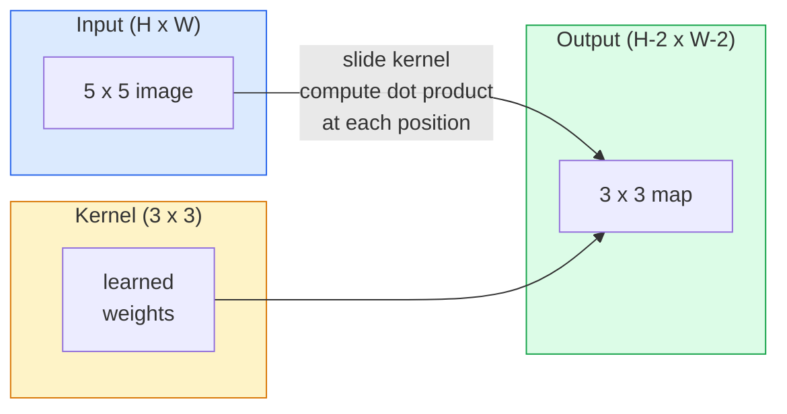
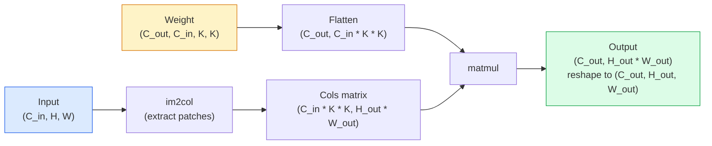

# Convolutions from Scratch

> Convolution là một lớp dense nhỏ mà bạn trượt trên ảnh, chia sẻ cùng trọng số tại mọi vị trí.

**Type:** Build
**Languages:** Python
**Prerequisites:** Phase 3 (Deep Learning Core), Phase 4 Lesson 01 (Image Fundamentals)
**Time:** ~75 minutes

## Mục tiêu học tập

- Triển khai 2D convolution từ đầu chỉ sử dụng NumPy, bao gồm phiên bản dùng vòng lặp lồng nhau và phiên bản vector hóa `im2col`
- Tính toán kích thước không gian đầu ra cho bất kỳ tổ hợp nào của kích thước đầu vào, kích thước kernel, padding và stride, đồng thời giải thích công thức `(H - K + 2P) / S + 1`
- Tự thiết kế các kernel (phát hiện cạnh, làm mờ, làm sắc nét, Sobel) và giải thích lý do tại sao mỗi loại tạo ra mô hình kích hoạt tương ứng
- Xếp chồng các convolution thành một bộ trích xuất đặc trưng (feature extractor) và kết nối độ sâu của chồng lớp với kích thước của trường tiếp nhận (receptive field)

## Vấn đề

Một lớp fully connected trên ảnh RGB 224x224 sẽ cần 224 * 224 * 3 = 150.528 trọng số đầu vào cho mỗi neuron. Một lớp ẩn duy nhất với 1.000 đơn vị đã là 150 triệu tham số — trước khi bạn học được bất cứ điều gì hữu ích. Tệ hơn nữa, lớp đó không có khái niệm rằng một con chó ở góc trên bên trái và một con chó ở góc dưới bên phải là cùng một mẫu. Nó coi mọi vị trí pixel là độc lập, điều này hoàn toàn sai đối với hình ảnh: việc dịch chuyển một con mèo đi ba pixel không nên buộc mạng phải học lại khái niệm đó.

Hai thuộc tính mà một mô hình hình ảnh cần là **translation equivariance** (đầu ra dịch chuyển khi đầu vào dịch chuyển) và **parameter sharing** (cùng một bộ phát hiện đặc trưng chạy ở mọi nơi). Các lớp dense không cung cấp cả hai điều này. Convolution cung cấp cả hai một cách miễn phí.

Convolution không được phát minh cho deep learning. Đó là cùng một thao tác cung cấp năng lượng cho nén JPEG, làm mờ Gaussian trong Photoshop, phát hiện cạnh trong thị giác công nghiệp và mọi bộ lọc âm thanh từng được phát hành. Lý do CNN thống trị ImageNet từ năm 2012 đến 2020 là vì convolution là tiền đề (prior) chính xác cho dữ liệu mà các giá trị gần nhau có liên quan và cùng một mẫu có thể xuất hiện ở bất cứ đâu.

## Khái niệm

### Một kernel, trượt đi

Một 2D convolution lấy một ma trận trọng số nhỏ gọi là kernel (hoặc filter), trượt nó qua đầu vào và tại mỗi vị trí tính tổng các tích từng phần tử. Tổng đó trở thành một pixel đầu ra.



Một ví dụ cụ thể 3x3 trên đầu vào 5x5 (không padding, stride 1):

```
Input X (5 x 5):                Kernel W (3 x 3):

  1  2  0  1  2                   1  0 -1
  0  1  3  1  0                   2  0 -2
  2  1  0  2  1                   1  0 -1
  1  0  2  1  3
  2  1  1  0  1

The kernel slides across every valid 3 x 3 window. Output Y is 3 x 3:

 Y[0,0] = sum( W * X[0:3, 0:3] )
 Y[0,1] = sum( W * X[0:3, 1:4] )
 Y[0,2] = sum( W * X[0:3, 2:5] )
 Y[1,0] = sum( W * X[1:4, 0:3] )
 ... and so on
```

Công thức đó — **trọng số chia sẻ, tính cục bộ, cửa sổ trượt** — là toàn bộ ý tưởng. Mọi thứ khác chỉ là thủ tục tính toán.

### Công thức kích thước đầu ra

Với kích thước không gian đầu vào `H`, kích thước kernel `K`, padding `P`, stride `S`:

```
H_out = floor( (H - K + 2P) / S ) + 1
```

Hãy ghi nhớ điều này. Bạn sẽ tính toán nó hàng chục lần cho mỗi kiến trúc.

| Kịch bản | H | K | P | S | H_out |
|----------|---|---|---|---|-------|
| Valid conv, không padding | 32 | 3 | 0 | 1 | 30 |
| Same conv (giữ nguyên kích thước) | 32 | 3 | 1 | 1 | 32 |
| Downsample theo hệ số 2 | 32 | 3 | 1 | 2 | 16 |
| Pool 2x2 | 32 | 2 | 0 | 2 | 16 |
| Trường tiếp nhận lớn | 32 | 7 | 3 | 2 | 16 |

"Same padding" nghĩa là chọn P sao cho H_out == H khi S == 1. Với K lẻ, đó là P = (K - 1) / 2. Đó là lý do tại sao các kernel 3x3 thống trị — chúng là kernel lẻ nhỏ nhất vẫn có tâm.

### Padding

Nếu không có padding, mỗi convolution sẽ làm thu nhỏ bản đồ đặc trưng (feature map). Xếp chồng 20 lớp và ảnh 224x224 của bạn trở thành 184x184, gây lãng phí tính toán ở biên và làm phức tạp các kết nối residual cần hình dạng khớp nhau.

```
Zero padding (P = 1) on a 5 x 5 input:

  0  0  0  0  0  0  0
  0  1  2  0  1  2  0
  0  0  1  3  1  0  0
  0  2  1  0  2  1  0       Now the kernel can centre on pixel
  0  1  0  2  1  3  0       (0, 0) and still have three rows and
  0  2  1  1  0  1  0       three columns of values to multiply.
  0  0  0  0  0  0  0
```

Các chế độ bạn gặp trong thực tế: `zero` (phổ biến nhất), `reflect` (phản chiếu cạnh, tránh các đường biên cứng trong các mô hình tạo sinh), `replicate` (sao chép cạnh), `circular` (cuộn tròn, được sử dụng trong các bài toán hình xuyến).

### Stride

Stride là kích thước bước nhảy của lần trượt. `stride=1` là mặc định. `stride=2` làm giảm một nửa kích thước không gian và là cách cổ điển để downsample bên trong CNN mà không cần lớp pooling riêng biệt — mọi kiến trúc hiện đại (ResNet, ConvNeXt, MobileNet) đều sử dụng strided conv thay cho max-pool ở một số nơi.

```
Stride 1 on a 5 x 5 input, 3 x 3 kernel:

  starts: (0,0) (0,1) (0,2)        -> output row 0
          (1,0) (1,1) (1,2)        -> output row 1
          (2,0) (2,1) (2,2)        -> output row 2

  Output: 3 x 3

Stride 2 on the same input:

  starts: (0,0) (0,2)              -> output row 0
          (2,0) (2,2)              -> output row 1

  Output: 2 x 2
```

### Nhiều kênh đầu vào

Ảnh thực tế có ba kênh. Một convolution 3x3 trên đầu vào RGB thực chất là một khối 3x3x3: một lát cắt 3x3 cho mỗi kênh đầu vào. Tại mỗi vị trí không gian, bạn nhân và cộng trên cả ba lát cắt và thêm một bias.

```
Input:   (C_in,  H,  W)        3 x 5 x 5
Kernel:  (C_in,  K,  K)        3 x 3 x 3 (one kernel)
Output:  (1,     H', W')       2D map

For a layer that produces C_out output channels, you stack C_out kernels:

Weight:  (C_out, C_in, K, K)   e.g. 64 x 3 x 3 x 3
Output:  (C_out, H', W')       64 x 3 x 3

Parameter count: C_out * C_in * K * K + C_out   (the + C_out is biases)
```

Dòng cuối cùng đó là dòng bạn sẽ tính toán khi lập kế hoạch cho một mô hình. Một conv 3x3 với 64 kênh trên đầu vào 3 kênh có `64 * 3 * 3 * 3 + 64 = 1,792` tham số. Rất rẻ.

### Thủ thuật im2col

Các vòng lặp lồng nhau dễ đọc nhưng chậm. GPU muốn các phép nhân ma trận lớn. Thủ thuật: làm phẳng mọi cửa sổ trường tiếp nhận của đầu vào thành một cột của một ma trận lớn, làm phẳng kernel thành một hàng, và toàn bộ convolution trở thành một phép matmul duy nhất.



Mọi triển khai conv trong sản xuất đều là một biến thể của điều này cộng với các thủ thuật cache-tiling (direct conv, Winograd, FFT conv cho các kernel lớn). Hiểu im2col là bạn hiểu cốt lõi.

### Trường tiếp nhận (Receptive field)

Một conv 3x3 đơn lẻ nhìn vào 9 pixel đầu vào. Xếp chồng hai conv 3x3 và một neuron ở lớp thứ hai nhìn vào 5x5 pixel đầu vào. Ba conv 3x3 cho 7x7. Tổng quát:

```
RF after L stacked K x K convs (stride 1) = 1 + L * (K - 1)

With strides:   RF grows multiplicatively with stride along each layer.
```

Lý do toàn bộ việc "3x3 từ đầu đến cuối" hoạt động (VGG, ResNet, ConvNeXt) là vì hai conv 3x3 nhìn thấy cùng một vùng đầu vào như một conv 5x5 nhưng với ít tham số hơn và có thêm một phi tuyến tính ở giữa.

```figure
convolution-kernel
```

## Xây dựng

### Bước 1: Pad một mảng

Bắt đầu với nguyên thủy nhỏ nhất: một hàm thực hiện padding với các số không xung quanh một mảng H x W.

```python
import numpy as np

def pad2d(x, p):
    if p == 0:
        return x
    h, w = x.shape[-2:]
    out = np.zeros(x.shape[:-2] + (h + 2 * p, w + 2 * p), dtype=x.dtype)
    out[..., p:p + h, p:p + w] = x
    return out

x = np.arange(9).reshape(3, 3)
print(x)
print()
print(pad2d(x, 1))
```

Thủ thuật trailing-axes `x.shape[:-2]` có nghĩa là cùng một hàm hoạt động trên `(H, W)`, `(C, H, W)`, hoặc `(N, C, H, W)` mà không cần sửa đổi.

### Bước 2: 2D convolution với vòng lặp lồng nhau

Triển khai tham chiếu — chậm, nhưng rõ ràng. Đây là những gì `torch.nn.functional.conv2d` thực hiện về nguyên tắc.

```python
def conv2d_naive(x, w, b=None, stride=1, padding=0):
    c_in, h, w_in = x.shape
    c_out, c_in_w, kh, kw = w.shape
    assert c_in == c_in_w

    x_pad = pad2d(x, padding)
    h_out = (h + 2 * padding - kh) // stride + 1
    w_out = (w_in + 2 * padding - kw) // stride + 1

    out = np.zeros((c_out, h_out, w_out), dtype=np.float32)
    for oc in range(c_out):
        for i in range(h_out):
            for j in range(w_out):
                hs = i * stride
                ws = j * stride
                patch = x_pad[:, hs:hs + kh, ws:ws + kw]
                out[oc, i, j] = np.sum(patch * w[oc])
        if b is not None:
            out[oc] += b[oc]
    return out
```

Bốn vòng lặp lồng nhau (kênh đầu ra, hàng, cột, cộng với tổng ngầm định trên C_in, kh, kw). Đây là sự thật cơ bản mà bạn sẽ dùng để kiểm tra mọi triển khai nhanh hơn.

### Bước 3: Xác minh với kernel tự thiết kế

Xây dựng một kernel Sobel dọc, áp dụng nó vào một ảnh bước nhảy tổng hợp và quan sát cạnh dọc sáng lên.

```python
def synthetic_step_image():
    img = np.zeros((1, 16, 16), dtype=np.float32)
    img[:, :, 8:] = 1.0
    return img

sobel_x = np.array([
    [[-1, 0, 1],
     [-2, 0, 2],
     [-1, 0, 1]]
], dtype=np.float32)[None]

x = synthetic_step_image()
y = conv2d_naive(x, sobel_x, padding=1)
print(y[0].round(1))
```

Mong đợi các giá trị dương lớn ở cột 7 (độ sáng tăng từ trái sang phải) và các số không ở mọi nơi khác. Dòng in đơn lẻ đó là kiểm tra tính đúng đắn của toán học.

### Bước 4: im2col

Chuyển đổi mọi cửa sổ có kích thước kernel trong đầu vào thành một cột của ma trận. Đối với `C_in=3, K=3`, mỗi cột là 27 số.

```python
def im2col(x, kh, kw, stride=1, padding=0):
    c_in, h, w = x.shape
    x_pad = pad2d(x, padding)
    h_out = (h + 2 * padding - kh) // stride + 1
    w_out = (w + 2 * padding - kw) // stride + 1

    cols = np.zeros((c_in * kh * kw, h_out * w_out), dtype=x.dtype)
    col = 0
    for i in range(h_out):
        for j in range(w_out):
            hs = i * stride
            ws = j * stride
            patch = x_pad[:, hs:hs + kh, ws:ws + kw]
            cols[:, col] = patch.reshape(-1)
            col += 1
    return cols, h_out, w_out
```

Nó vẫn là một vòng lặp Python, nhưng bây giờ công việc nặng nhọc sẽ là một phép matmul vector hóa duy nhất.

### Bước 5: Fast conv qua im2col + matmul

Thay thế vòng lặp bốn lớp bằng một phép nhân ma trận.

```python
def conv2d_im2col(x, w, b=None, stride=1, padding=0):
    c_out, c_in, kh, kw = w.shape
    cols, h_out, w_out = im2col(x, kh, kw, stride, padding)
    w_flat = w.reshape(c_out, -1)
    out = w_flat @ cols
    if b is not None:
        out += b[:, None]
    return out.reshape(c_out, h_out, w_out)
```

Kiểm tra tính đúng đắn: chạy cả hai triển khai và so sánh.

```python
rng = np.random.default_rng(0)
x = rng.normal(0, 1, (3, 16, 16)).astype(np.float32)
w = rng.normal(0, 1, (8, 3, 3, 3)).astype(np.float32)
b = rng.normal(0, 1, (8,)).astype(np.float32)

y_naive = conv2d_naive(x, w, b, padding=1)
y_im2col = conv2d_im2col(x, w, b, padding=1)

print(f"max abs diff: {np.max(np.abs(y_naive - y_im2col)):.2e}")
```

`max abs diff` sẽ vào khoảng `1e-5` — sự khác biệt là thứ tự tích lũy dấu phẩy động, không phải lỗi.

### Bước 6: Một tập hợp các kernel tự thiết kế

Năm bộ lọc cho thấy một lớp conv đơn lẻ có thể biểu diễn những gì trước khi huấn luyện.

```python
KERNELS = {
    "identity": np.array([[0, 0, 0], [0, 1, 0], [0, 0, 0]], dtype=np.float32),
    "blur_3x3": np.ones((3, 3), dtype=np.float32) / 9.0,
    "sharpen": np.array([[0, -1, 0], [-1, 5, -1], [0, -1, 0]], dtype=np.float32),
    "sobel_x": np.array([[-1, 0, 1], [-2, 0, 2], [-1, 0, 1]], dtype=np.float32),
    "sobel_y": np.array([[-1, -2, -1], [0, 0, 0], [1, 2, 1]], dtype=np.float32),
}

def apply_kernel(img2d, kernel):
    x = img2d[None].astype(np.float32)
    w = kernel[None, None]
    return conv2d_im2col(x, w, padding=1)[0]
```

Áp dụng cho bất kỳ ảnh thang độ xám nào, làm mờ sẽ làm mềm, làm sắc nét sẽ làm rõ các cạnh, Sobel-x làm sáng các cạnh dọc, Sobel-y làm sáng các cạnh ngang. Đây chính xác là những mẫu mà lớp conv được huấn luyện *đầu tiên* trong AlexNet và VGG cuối cùng đã học được — vì một mô hình hình ảnh tốt cần các bộ phát hiện cạnh và đốm bất kể tác vụ sau đó là gì.

## Sử dụng

`nn.Conv2d` của PyTorch bao bọc cùng một thao tác với autograd, các kernel CUDA và tối ưu hóa cuDNN. Ngữ nghĩa hình dạng là giống hệt nhau.

```python
import torch
import torch.nn as nn

conv = nn.Conv2d(in_channels=3, out_channels=64, kernel_size=3, stride=1, padding=1)
print(conv)
print(f"weight shape: {tuple(conv.weight.shape)}   # (C_out, C_in, K, K)")
print(f"bias shape:   {tuple(conv.bias.shape)}")
print(f"param count:  {sum(p.numel() for p in conv.parameters())}")

x = torch.randn(8, 3, 224, 224)
y = conv(x)
print(f"\ninput  shape: {tuple(x.shape)}")
print(f"output shape: {tuple(y.shape)}")
```

Thay `padding=1` bằng `padding=0` và đầu ra giảm xuống 222x222. Thay `stride=1` bằng `stride=2` và nó giảm xuống 112x112. Cùng công thức bạn đã ghi nhớ ở trên.

## Triển khai

Bài học này tạo ra:

- `outputs/prompt-cnn-architect.md` — một prompt mà khi có kích thước đầu vào, ngân sách tham số và trường tiếp nhận mục tiêu, sẽ thiết kế một chồng các lớp `Conv2d` với K/S/P phù hợp tại mỗi bước.
- `outputs/skill-conv-shape-calculator.md` — một kỹ năng đi qua đặc tả mạng theo từng lớp và trả về hình dạng đầu ra, trường tiếp nhận và số lượng tham số cho mỗi khối.

## Bài tập

1. **(Dễ)** Với đầu vào thang độ xám 128x128 và một chồng `[Conv3x3(s=1,p=1), Conv3x3(s=2,p=1), Conv3x3(s=1,p=1), Conv3x3(s=2,p=1)]`, hãy tính toán kích thước không gian đầu ra và trường tiếp nhận tại mỗi lớp bằng tay. Xác minh bằng một `nn.Sequential` của PyTorch với các conv giả.
2. **(Trung bình)** Mở rộng `conv2d_naive` và `conv2d_im2col` để chấp nhận đối số `groups`. Chứng minh rằng `groups=C_in=C_out` tái tạo một depthwise convolution và số lượng tham số của nó là `C * K * K` thay vì `C * C * K * K`.
3. **(Khó)** Triển khai backward pass của `conv2d_im2col` bằng tay: với gradient của đầu ra, tính gradient của `x` và `w`. Xác minh so với `torch.autograd.grad` trên cùng đầu vào và trọng số. Thủ thuật: gradient của im2col là `col2im`, và nó phải tích lũy các cửa sổ chồng lấp.

## Thuật ngữ chính

| Thuật ngữ | Mọi người nói | Ý nghĩa thực sự |
|------|----------------|----------------------|
| Convolution | "Trượt một bộ lọc" | Một tích vô hướng có thể học được áp dụng tại mọi vị trí không gian với trọng số chia sẻ; về mặt toán học là cross-correlation, nhưng mọi người gọi là convolution |
| Kernel / filter | "Bộ phát hiện đặc trưng" | Một tensor trọng số nhỏ có hình dạng (C_in, K, K) mà tích vô hướng của nó với một cửa sổ đầu vào tạo ra một pixel đầu ra |
| Stride | "Nhảy bao xa" | Kích thước bước nhảy giữa các lần đặt kernel liên tiếp; stride 2 làm giảm một nửa mỗi chiều không gian |
| Padding | "Số không ở các cạnh" | Các giá trị bổ sung được thêm xung quanh đầu vào để kernel có thể đặt tâm vào các pixel biên; padding `same` giữ kích thước đầu ra bằng kích thước đầu vào |
| Receptive field | "Neuron nhìn thấy bao nhiêu" | Vùng đầu vào gốc mà một kích hoạt đầu ra nhất định phụ thuộc vào, tăng dần theo độ sâu và stride |
| im2col | "Thủ thuật GEMM" | Sắp xếp lại mọi cửa sổ tiếp nhận thành các cột để convolution trở thành một phép nhân ma trận lớn — cốt lõi của mọi kernel conv nhanh |
| Depthwise conv | "Một kernel mỗi kênh" | Một conv với `groups == C_in`, tính toán mỗi kênh đầu ra chỉ từ kênh đầu vào tương ứng của nó; xương sống của MobileNet và ConvNeXt |
| Translation equivariance | "Dịch chuyển vào, dịch chuyển ra" | Thuộc tính rằng việc dịch chuyển đầu vào k pixel sẽ dịch chuyển đầu ra k pixel; có được miễn phí với trọng số chia sẻ |

## Đọc thêm

- [A guide to convolution arithmetic for deep learning (Dumoulin & Visin, 2016)](https://arxiv.org/abs/1603.07285) — các sơ đồ xác định về padding/stride/dilation mà mọi khóa học đều âm thầm sao chép
- [CS231n: Convolutional Neural Networks for Visual Recognition](https://cs231n.github.io/convolutional-networks/) — các ghi chú bài giảng kinh điển, bao gồm giải thích gốc về im2col
- [The Annotated ConvNet (fast.ai)](https://nbviewer.org/github/fastai/fastbook/blob/master/13_convolutions.ipynb) — một notebook đi từ convolution thủ công đến bộ phân loại chữ số đã được huấn luyện
- [Receptive Field Arithmetic for CNNs (Dang Ha The Hien)](https://distill.pub/2019/computing-receptive-fields/) — tài liệu giải thích tương tác chất lượng cao về các phép tính trường tiếp nhận