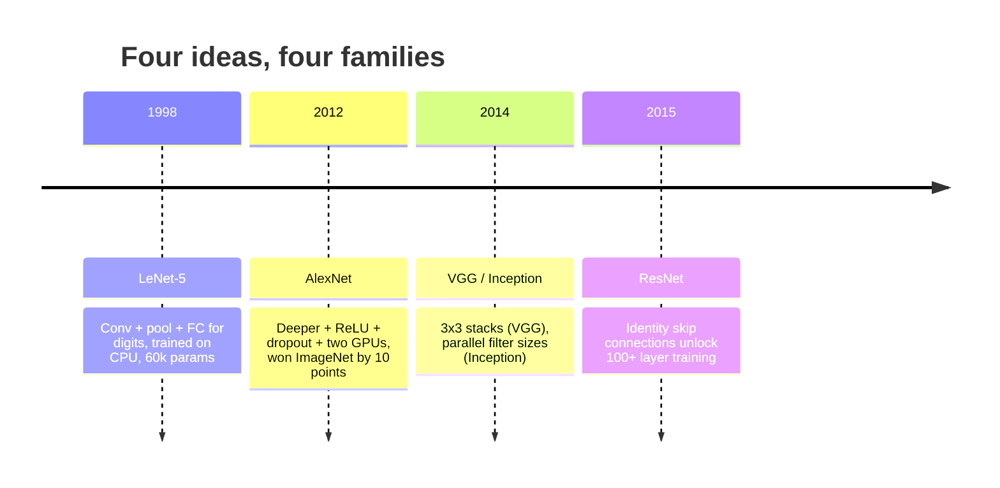
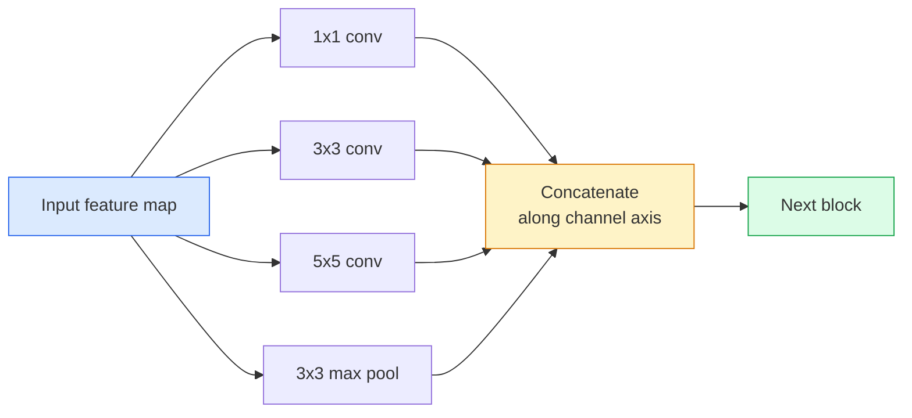
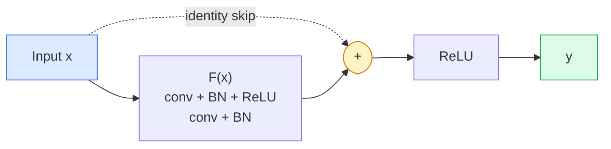

# CNNs — Từ LeNet đến ResNet

> Mọi CNN quan trọng trong ba mươi năm qua đều tuân theo công thức: conv–nonlinearity–downsample với một ý tưởng mới được bổ sung. Hãy học các ý tưởng này theo trình tự.

**Type:** Learn + Build
**Languages:** Python
**Prerequisites:** Phase 3 Lesson 11 (PyTorch), Phase 4 Lesson 01 (Image Fundamentals), Phase 4 Lesson 02 (Convolutions from Scratch)
**Time:** ~75 phút

## Mục tiêu học tập

- Truy vết dòng dõi kiến trúc LeNet-5 -> AlexNet -> VGG -> Inception -> ResNet và nêu ra ý tưởng mới duy nhất mà mỗi dòng họ đóng góp
- Triển khai LeNet-5, một block kiểu VGG, và một ResNet BasicBlock bằng PyTorch, mỗi cái dưới 40 dòng code
- Giải thích tại sao các residual connection biến một mạng 1.000 lớp từ không thể huấn luyện thành trạng thái hiện đại (state-of-the-art)
- Đọc một backbone hiện đại (ResNet-18, ResNet-50) và dự đoán hình dạng đầu ra, receptive field, và số lượng tham số trước khi xem mã nguồn

## Vấn đề

Năm 2011, bộ phân loại ImageNet tốt nhất đạt khoảng 74% độ chính xác top-5. Năm 2012, AlexNet đạt 85%. Năm 2015, ResNet đạt 96%. Không có dữ liệu mới. Không có thế hệ GPU mới. Những bước tiến này đến từ các ý tưởng kiến trúc. Một kỹ sư thị giác máy tính (vision engineer) cần biết ý tưởng nào đến từ bài báo nào, bởi vì mọi backbone sản xuất mà bạn triển khai vào năm 2026 đều là sự kết hợp lại của những mảnh ghép đó — và bởi vì các ý tưởng này liên tục được chuyển giao: grouped convs đi từ CNN sang transformers, residual connections đi từ ResNet sang mọi LLM hiện có, batch normalisation tồn tại trong các mô hình diffusion.

Việc nghiên cứu các mạng này theo thứ tự cũng giúp bạn tránh một sai lầm phổ biến: chọn mô hình lớn nhất có sẵn khi một mạng cỡ LeNet là đủ để giải quyết vấn đề. MNIST không cần ResNet. Biết đường cong mở rộng (scaling curve) của mỗi dòng họ sẽ cho bạn biết vị trí cần đặt mô hình của mình.

## Khái niệm

### Bốn ý tưởng thay đổi thị giác máy tính



Không có gì khác trong thị giác máy tính cổ điển quan trọng bằng bốn bước nhảy này.

### LeNet-5 (1998)

Bộ nhận diện chữ số của Yann LeCun. 60.000 tham số. Hai khối conv-pool, hai lớp fully connected, các hàm kích hoạt tanh. Nó xác định khuôn mẫu mà mọi CNN kế thừa:

```
input (1, 32, 32)
  conv 5x5 -> (6, 28, 28)
  avg pool 2x2 -> (6, 14, 14)
  conv 5x5 -> (16, 10, 10)
  avg pool 2x2 -> (16, 5, 5)
  flatten -> 400
  dense -> 120
  dense -> 84
  dense -> 10
```

Mọi thứ mà thế giới hiện đại gọi là CNN — các lớp tích chập và downsampling xen kẽ dẫn đến một đầu phân loại nhỏ — chính là LeNet với nhiều lớp hơn, kênh rộng hơn và hàm kích hoạt tốt hơn.

### AlexNet (2012)

Ba thay đổi cùng nhau phá vỡ kỷ lục ImageNet:

1. **ReLU** thay vì tanh. Các gradient không còn bị triệt tiêu (vanishing). Tốc độ huấn luyện tăng gấp sáu lần.
2. **Dropout** trong phần đầu fully connected. Regularisation trở thành một lớp, không phải là một thủ thuật.
3. **Độ sâu và độ rộng**. Năm lớp conv, ba lớp dense, 60 triệu tham số, được huấn luyện trên hai GPU với mô hình được chia tách giữa chúng.

Hình 2 của bài báo vẫn hiển thị việc chia tách GPU thành hai luồng song song. Sự song song đó là một giải pháp phần cứng, không phải là một hiểu biết về kiến trúc — nhưng ba ý tưởng trên vẫn nằm trong mọi mô hình bạn sử dụng.

### VGG (2014)

VGG đặt câu hỏi: điều gì xảy ra nếu bạn chỉ sử dụng các tích chập 3x3 và đi sâu hơn?

```
stack:   conv 3x3 -> conv 3x3 -> pool 2x2
repeat:  16 or 19 conv layers
```

Hai lớp conv 3x3 nhìn thấy cùng một vùng đầu vào 5x5 như một lớp conv 5x5 nhưng với ít tham số hơn (2*9*C^2 = 18C^2 so với 25*C^2) và có thêm một lớp ReLU ở giữa. VGG đã biến quan sát này thành một kiến trúc hoàn chỉnh. Sự đơn giản — một loại block, được lặp lại — đã biến nó thành điểm tham chiếu cho mọi thứ sau này.

Chi phí: 138 triệu tham số, huấn luyện chậm, đắt đỏ khi suy luận (inference).

### Inception (2014, cùng năm)

Câu trả lời của Google cho câu hỏi "tôi nên sử dụng kích thước kernel nào?" là: tất cả chúng, song song.



Mỗi nhánh chuyên biệt hóa — 1x1 để trộn kênh, 3x3 cho kết cấu cục bộ, 5x5 cho các mẫu lớn hơn, pooling cho các đặc trưng bất biến với dịch chuyển — và việc concat cho phép lớp tiếp theo chọn bất kỳ nhánh nào hữu ích. Inception v1 sử dụng các tích chập 1x1 bên trong mỗi nhánh như một nút thắt (bottleneck) để giữ số lượng tham số ở mức hợp lý.

### Vấn đề suy giảm (degradation problem)

Đến năm 2015, VGG-19 hoạt động tốt nhưng VGG-32 thì không. Độ sâu được cho là sẽ giúp ích, nhưng sau khoảng 20 lớp, cả loss huấn luyện và kiểm tra đều tệ hơn. Đó không phải là overfitting. Đó là bộ tối ưu hóa (optimizer) không tìm thấy các trọng số hữu ích vì gradient bị thu nhỏ theo cấp số nhân qua từng lớp.

```
Plain deep network:
  y = f_L( f_{L-1}( ... f_1(x) ... ) )

Gradient wrt early layer:
  dL/dW_1 = dL/dy * df_L/df_{L-1} * ... * df_2/df_1 * df_1/dW_1

Each multiplicative term has magnitude roughly (weight magnitude) * (activation gain).
Stack 100 of them with gains < 1 and the gradient is effectively zero.
```

VGG hoạt động ở 19 lớp vì batch norm (được công bố cùng lúc) giữ cho các kích hoạt được cân bằng tốt. Nhưng ngay cả batch norm cũng không thể cứu vãn độ sâu vượt quá khoảng 30 lớp.

### ResNet (2015)

He, Zhang, Ren, Sun đã đề xuất một thay đổi giải quyết mọi thứ:

```
standard block:   y = F(x)
residual block:   y = F(x) + x
```

`+ x` có nghĩa là lớp luôn có thể chọn không làm gì bằng cách đưa `F(x)` về 0. Một ResNet 1.000 lớp giờ đây tệ nhất cũng chỉ bằng một mạng 1 lớp, vì mỗi block bổ sung đều có một lối thoát đơn giản. Với sự đảm bảo đó, bộ tối ưu hóa sẵn sàng làm cho mỗi block trở nên *hơi* hữu ích — và sự hữu ích nhỏ bé đó, khi xếp chồng 100 lần, tạo nên trạng thái hiện đại.



Hai biến thể của block xuất hiện ở khắp mọi nơi:

- **BasicBlock** (ResNet-18, ResNet-34): hai conv 3x3, skip xung quanh cả hai.
- **Bottleneck** (ResNet-50, -101, -152): 1x1 xuống, 3x3 ở giữa, 1x1 lên, skip xung quanh bộ ba. Rẻ hơn khi số lượng kênh lớn.

Khi skip phải vượt qua một bước downsample (stride=2), đường identity được thay thế bằng một conv 1x1 stride=2 để khớp hình dạng.

### Tại sao residuals quan trọng ngoài thị giác máy tính

Ý tưởng này thực sự không chỉ về phân loại ảnh. Nó là về việc biến các mạng sâu từ "cầu nguyện và hy vọng gradient tồn tại" thành một công cụ kỹ thuật đáng tin cậy và có khả năng mở rộng. Mọi transformer mà bạn sẽ đọc ở giai đoạn tiếp theo đều có cùng một skip connection trong mỗi block. Không có ResNet, sẽ không có GPT.

```figure
pooling
```

## Xây dựng

### Bước 1: LeNet-5

Một LeNet tối giản, trung thành. Các hàm kích hoạt tanh, average pooling. Sự nhượng bộ duy nhất cho hiện đại là chúng ta sử dụng `nn.CrossEntropyLoss` ở hạ nguồn thay vì các kết nối Gaussian gốc.

```python
import torch
import torch.nn as nn
import torch.nn.functional as F

class LeNet5(nn.Module):
    def __init__(self, num_classes=10):
        super().__init__()
        self.conv1 = nn.Conv2d(1, 6, kernel_size=5)
        self.conv2 = nn.Conv2d(6, 16, kernel_size=5)
        self.pool = nn.AvgPool2d(2)
        self.fc1 = nn.Linear(16 * 5 * 5, 120)
        self.fc2 = nn.Linear(120, 84)
        self.fc3 = nn.Linear(84, num_classes)

    def forward(self, x):
        x = self.pool(torch.tanh(self.conv1(x)))
        x = self.pool(torch.tanh(self.conv2(x)))
        x = torch.flatten(x, 1)
        x = torch.tanh(self.fc1(x))
        x = torch.tanh(self.fc2(x))
        return self.fc3(x)

net = LeNet5()
x = torch.randn(1, 1, 32, 32)
print(f"output: {net(x).shape}")
print(f"params: {sum(p.numel() for p in net.parameters()):,}")
```

Đầu ra mong đợi: `output: torch.Size([1, 10])`, `params: 61,706`. Đó là toàn bộ bộ phân loại chữ số đã khởi đầu thị giác máy tính hiện đại.

### Bước 2: Một block VGG

Một block có thể tái sử dụng: hai conv 3x3, ReLU, batch norm, max pool.

```python
class VGGBlock(nn.Module):
    def __init__(self, in_c, out_c):
        super().__init__()
        self.conv1 = nn.Conv2d(in_c, out_c, kernel_size=3, padding=1)
        self.bn1 = nn.BatchNorm2d(out_c)
        self.conv2 = nn.Conv2d(out_c, out_c, kernel_size=3, padding=1)
        self.bn2 = nn.BatchNorm2d(out_c)
        self.pool = nn.MaxPool2d(2)

    def forward(self, x):
        x = F.relu(self.bn1(self.conv1(x)))
        x = F.relu(self.bn2(self.conv2(x)))
        return self.pool(x)

class MiniVGG(nn.Module):
    def __init__(self, num_classes=10):
        super().__init__()
        self.stack = nn.Sequential(
            VGGBlock(3, 32),
            VGGBlock(32, 64),
            VGGBlock(64, 128),
        )
        self.head = nn.Sequential(
            nn.AdaptiveAvgPool2d(1),
            nn.Flatten(),
            nn.Linear(128, num_classes),
        )

    def forward(self, x):
        return self.head(self.stack(x))

net = MiniVGG()
x = torch.randn(1, 3, 32, 32)
print(f"output: {net(x).shape}")
print(f"params: {sum(p.numel() for p in net.parameters()):,}")
```

Ba block VGG trên đầu vào cỡ CIFAR, một adaptive pool, một lớp linear. ~290k tham số. Quá đủ cho CIFAR-10.

### Bước 3: Một ResNet BasicBlock

Khối xây dựng cốt lõi của ResNet-18 và ResNet-34.

```python
class BasicBlock(nn.Module):
    def __init__(self, in_c, out_c, stride=1):
        super().__init__()
        self.conv1 = nn.Conv2d(in_c, out_c, kernel_size=3, stride=stride, padding=1, bias=False)
        self.bn1 = nn.BatchNorm2d(out_c)
        self.conv2 = nn.Conv2d(out_c, out_c, kernel_size=3, stride=1, padding=1, bias=False)
        self.bn2 = nn.BatchNorm2d(out_c)
        if stride != 1 or in_c != out_c:
            self.shortcut = nn.Sequential(
                nn.Conv2d(in_c, out_c, kernel_size=1, stride=stride, bias=False),
                nn.BatchNorm2d(out_c),
            )
        else:
            self.shortcut = nn.Identity()

    def forward(self, x):
        out = F.relu(self.bn1(self.conv1(x)))
        out = self.bn2(self.conv2(out))
        out = out + self.shortcut(x)
        return F.relu(out)
```

`bias=False` trên các lớp conv là một quy ước batch-norm — tham số beta của BN đã xử lý bias, vì vậy việc mang theo bias conv là lãng phí. `shortcut` chỉ cần một conv thực sự khi stride hoặc số lượng kênh thay đổi; nếu không, nó là một identity không làm gì cả.

### Bước 4: Một ResNet nhỏ

Xếp chồng bốn nhóm BasicBlock để có một ResNet hoạt động cho đầu vào cỡ CIFAR.

```python
class TinyResNet(nn.Module):
    def __init__(self, num_classes=10):
        super().__init__()
        self.stem = nn.Sequential(
            nn.Conv2d(3, 32, kernel_size=3, stride=1, padding=1, bias=False),
            nn.BatchNorm2d(32),
            nn.ReLU(inplace=True),
        )
        self.layer1 = self._make_group(32, 32, num_blocks=2, stride=1)
        self.layer2 = self._make_group(32, 64, num_blocks=2, stride=2)
        self.layer3 = self._make_group(64, 128, num_blocks=2, stride=2)
        self.layer4 = self._make_group(128, 256, num_blocks=2, stride=2)
        self.head = nn.Sequential(
            nn.AdaptiveAvgPool2d(1),
            nn.Flatten(),
            nn.Linear(256, num_classes),
        )

    def _make_group(self, in_c, out_c, num_blocks, stride):
        blocks = [BasicBlock(in_c, out_c, stride=stride)]
        for _ in range(num_blocks - 1):
            blocks.append(BasicBlock(out_c, out_c, stride=1))
        return nn.Sequential(*blocks)

    def forward(self, x):
        x = self.stem(x)
        x = self.layer1(x)
        x = self.layer2(x)
        x = self.layer3(x)
        x = self.layer4(x)
        return self.head(x)

net = TinyResNet()
x = torch.randn(1, 3, 32, 32)
print(f"output: {net(x).shape}")
print(f"params: {sum(p.numel() for p in net.parameters()):,}")
```

Bốn nhóm, mỗi nhóm hai block. Stride 2 ở đầu các nhóm 2, 3, 4. Số lượng kênh tăng gấp đôi tại mỗi bước downsample. Khoảng 2,8 triệu tham số. Đó là công thức tiêu chuẩn mở rộng sạch sẽ lên đến ResNet-152.

### Bước 5: So sánh hiệu quả tham số-đặc trưng

Chạy cùng một đầu vào qua cả ba mạng và so sánh số lượng tham số.

```python
def summary(name, net, x):
    y = net(x)
    params = sum(p.numel() for p in net.parameters())
    print(f"{name:12s}  input {tuple(x.shape)} -> output {tuple(y.shape)}  params {params:>10,}")

x = torch.randn(1, 3, 32, 32)
summary("LeNet5",     LeNet5(),       torch.randn(1, 1, 32, 32))
summary("MiniVGG",    MiniVGG(),      x)
summary("TinyResNet", TinyResNet(),   x)
```

Ba mô hình, ba kỷ nguyên, ba bậc độ lớn về số lượng tham số. Để đạt độ chính xác CIFAR-10, bạn cần khoảng: LeNet 60%, MiniVGG 89%, TinyResNet 93% sau vài epoch huấn luyện.

## Sử dụng

`torchvision.models` cung cấp cho bạn các phiên bản đã được huấn luyện trước của tất cả các mô hình trên. Chữ ký gọi hàm là giống hệt nhau giữa các dòng họ, đó chính xác là mục đích của sự trừu tượng hóa backbone.

```python
from torchvision.models import resnet18, ResNet18_Weights, vgg16, VGG16_Weights

r18 = resnet18(weights=ResNet18_Weights.IMAGENET1K_V1)
r18.eval()

print(f"ResNet-18 params: {sum(p.numel() for p in r18.parameters()):,}")
print(r18.layer1[0])
print()

v16 = vgg16(weights=VGG16_Weights.IMAGENET1K_V1)
v16.eval()
print(f"VGG-16   params: {sum(p.numel() for p in v16.parameters()):,}")
```

ResNet-18 có 11,7 triệu tham số. VGG-16 có 138 triệu. Độ chính xác ImageNet top-1 tương đương (69,8% so với 71,6%). Các residual connection mang lại hiệu quả tham số gấp 12 lần. Đó là lý do tại sao các biến thể ResNet thống trị từ năm 2016 cho đến khi ViT xuất hiện vào năm 2021 — và vẫn thống trị các triển khai thực tế nơi tài nguyên tính toán là hạn chế.

Đối với transfer learning, công thức luôn giống nhau: tải pretrained, đóng băng backbone, thay thế đầu phân loại.

```python
for p in r18.parameters():
    p.requires_grad = False
r18.fc = nn.Linear(r18.fc.in_features, 10)
```

Ba dòng code. Bạn hiện có một bộ phân loại CIFAR 10 lớp kế thừa các biểu diễn mà ImageNet đã trả giá để có được.

## Triển khai

Bài học này tạo ra:

- `outputs/prompt-backbone-selector.md` — một prompt chọn đúng dòng họ CNN (LeNet/VGG/ResNet/MobileNet/ConvNeXt) dựa trên tác vụ, kích thước tập dữ liệu và ngân sách tính toán.
- `outputs/skill-residual-block-reviewer.md` — một kỹ năng đọc module PyTorch và gắn cờ các lỗi skip-connection (thiếu shortcut khi thay đổi stride, thứ tự kích hoạt shortcut, vị trí BN so với phép cộng).

## Bài tập

1. **(Dễ)** Đếm thủ công các tham số cho `TinyResNet` từng lớp một. So sánh với `sum(p.numel() for p in net.parameters())`. Phần lớn ngân sách tham số nằm ở đâu — convs, BN, hay đầu phân loại?
2. **(Trung bình)** Triển khai block Bottleneck (1x1 -> 3x3 -> 1x1 với skip) và sử dụng nó để xây dựng mạng kiểu ResNet-50 cho CIFAR. So sánh tham số với `TinyResNet`.
3. **(Khó)** Loại bỏ skip connection khỏi `BasicBlock`, huấn luyện mạng "phẳng" 34 block và ResNet 34 block trên CIFAR-10 trong 10 epoch mỗi loại. Vẽ biểu đồ loss huấn luyện theo epoch cho cả hai. Tái tạo kết quả Hình 1 của He et al. nơi mạng sâu phẳng hội tụ đến loss cao hơn so với mạng nông hơn của nó.

## Thuật ngữ chính

| Thuật ngữ | Cách gọi thông thường | Ý nghĩa thực tế |
|------|----------------|----------------------|
| Backbone | "Mô hình" | Tập hợp các khối tích chập tạo ra bản đồ đặc trưng (feature map) được đưa vào đầu tác vụ |
| Residual connection | "Skip connection" | `y = F(x) + x`; cho phép bộ tối ưu hóa học identity bằng cách đặt F về 0, giúp độ sâu tùy ý có thể huấn luyện được |
| BasicBlock | "Hai conv 3x3 với một skip" | Khối xây dựng ResNet-18/34: conv-BN-ReLU-conv-BN-add-ReLU |
| Bottleneck | "1x1 xuống, 3x3, 1x1 lên" | Khối ResNet-50/101/152; rẻ khi số lượng kênh lớn vì 3x3 chạy trên độ rộng đã giảm |
| Degradation problem | "Sâu hơn thì tệ hơn" | Sau khoảng 20 lớp conv phẳng, cả lỗi huấn luyện và kiểm tra đều tăng; được giải quyết bằng residual connections, không phải bằng nhiều dữ liệu hơn |
| Stem | "Lớp đầu tiên" | Lớp conv ban đầu chuyển đổi đầu vào 3 kênh thành độ rộng đặc trưng cơ sở; thường là 7x7 stride 2 cho ImageNet, 3x3 stride 1 cho CIFAR |
| Head | "Bộ phân loại" | Các lớp sau khối backbone cuối cùng: adaptive pool, flatten, linear(s) |
| Transfer learning | "Trọng số pretrained" | Tải backbone đã huấn luyện trên ImageNet và tinh chỉnh (fine-tune) chỉ phần head trên tác vụ của bạn |

## Đọc thêm

- [Deep Residual Learning for Image Recognition (He et al., 2015)](https://arxiv.org/abs/1512.03385) — bài báo ResNet; mọi hình vẽ đều đáng nghiên cứu
- [Very Deep Convolutional Networks (Simonyan & Zisserman, 2014)](https://arxiv.org/abs/1409.1556) — bài báo VGG; vẫn là tài liệu tham khảo tốt nhất cho "tại sao lại là 3x3"
- [ImageNet Classification with Deep CNNs (Krizhevsky et al., 2012)](https://papers.nips.cc/paper_files/paper/2012/hash/c399862d3b9d6b76c8436e924a68c45b-Abstract.html) — AlexNet; bài báo đã kết thúc kỷ nguyên đặc trưng thủ công
- [Going Deeper with Convolutions (Szegedy et al., 2014)](https://arxiv.org/abs/1409.4842) — Inception v1; ý tưởng bộ lọc song song vẫn xuất hiện trong vision transformers