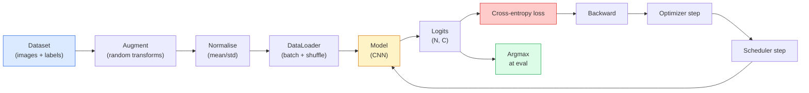

# Phân loại hình ảnh

> Một bộ phân loại (classifier) là một hàm ánh xạ từ các pixel sang một phân phối xác suất trên các lớp. Mọi thứ khác chỉ là đường ống dẫn (plumbing).

**Type:** Build
**Languages:** Python
**Prerequisites:** Phase 2 Lesson 09 (Đánh giá mô hình), Phase 3 Lesson 10 (Mini Framework), Phase 4 Lesson 03 (CNNs)
**Time:** ~75 phút

## Mục tiêu học tập

- Xây dựng một pipeline phân loại hình ảnh end-to-end trên CIFAR-10: tập dữ liệu, tăng cường dữ liệu (augmentation), mô hình, vòng lặp huấn luyện, đánh giá.
- Giải thích vai trò của từng thành phần (dataloader, loss, optimizer, scheduler, augmentation) và dự đoán cách các lỗi trong từng thành phần sẽ biểu hiện trên đường cong loss.
- Triển khai mixup, cutout và label smoothing từ đầu và biện luận khi nào nên áp dụng từng kỹ thuật.
- Đọc ma trận nhầm lẫn (confusion matrix) và bảng precision/recall theo từng lớp để chẩn đoán các lỗi của tập dữ liệu và mô hình thay vì chỉ nhìn vào độ chính xác tổng thể.

## Vấn đề

Mọi tác vụ thị giác máy tính cuối cùng đều quy về phân loại hình ảnh ở một mức độ nào đó. Phát hiện (detection) là phân loại các vùng. Phân đoạn (segmentation) là phân loại các pixel. Truy xuất (retrieval) là xếp hạng theo độ tương đồng với các tâm lớp (class centroids). Làm chủ việc phân loại — vòng lặp dữ liệu, chính sách tăng cường, hàm loss, đánh giá — là kỹ năng có thể chuyển đổi sang mọi tác vụ khác trong giai đoạn này.

Hầu hết các lỗi phân loại không nằm ở mô hình. Chúng nằm ở pipeline: chuẩn hóa bị lỗi, tập huấn luyện không được xáo trộn, tăng cường làm biến dạng nhãn, tập validation bị nhiễm dữ liệu huấn luyện, hoặc learning rate bị phân kỳ âm thầm sau epoch 30. Một CNN có thể đạt 93% trên CIFAR-10 với thiết lập đúng thường chỉ đạt 70-75% với thiết lập sai, và đường cong loss trông vẫn hoàn toàn bình thường.

Bài học này sẽ kết nối toàn bộ pipeline bằng tay để mọi phần đều có thể kiểm tra được. Bạn sẽ không sử dụng bất kỳ thứ gì từ `torchvision.datasets` có thể che giấu lỗi.

## Khái niệm

### Pipeline phân loại



Mỗi dòng trong vòng lặp này đều có thể chứa lỗi. Cross-entropy nhận các logit thô, không phải đầu ra softmax, vì vậy bất kỳ `model(x).softmax()` nào trước hàm loss đều sẽ tính toán sai gradient một cách âm thầm. Các kỹ thuật tăng cường chỉ áp dụng cho đầu vào, không áp dụng cho nhãn — ngoại trừ mixup, kỹ thuật trộn cả hai. `optimizer.zero_grad()` phải được thực hiện một lần mỗi bước; việc bỏ qua nó sẽ làm tích lũy gradient và trông giống như một learning rate cực kỳ không ổn định. Mỗi lỗi trong số đó đều làm phẳng đường cong học tập mà không gây ra lỗi (error).

### Cross-entropy, logits và softmax

Một bộ phân loại tạo ra `C` số cho mỗi hình ảnh, được gọi là logits. Áp dụng softmax sẽ chuyển đổi chúng thành một phân phối xác suất:

```
softmax(z)_i = exp(z_i) / sum_j exp(z_j)
```

Cross-entropy đo lường log xác suất âm của lớp đúng:

```
CE(z, y) = -log( softmax(z)_y )
        = -z_y + log( sum_j exp(z_j) )
```

Dạng bên phải là dạng ổn định về mặt số học (log-sum-exp). `nn.CrossEntropyLoss` của PyTorch kết hợp softmax + NLL trong một toán tử và nhận trực tiếp các logit thô. Việc tự áp dụng softmax trước đó gần như luôn là một lỗi — bạn đang tính log(softmax(softmax(z))), một đại lượng vô nghĩa.

### Tại sao tăng cường dữ liệu (augmentation) hiệu quả

CNN có thiên kiến quy nạp (inductive bias) đối với sự dịch chuyển (nhờ chia sẻ trọng số) nhưng không có tính bất biến tích hợp đối với cắt (crop), lật (flip), thay đổi màu sắc (colour jitter) hoặc che khuất (occlusion). Cách duy nhất để dạy nó những tính bất biến đó là cho nó thấy các pixel thể hiện chúng. Mỗi phép biến đổi ngẫu nhiên trong quá trình huấn luyện là một cách nói: "hai hình ảnh này có cùng nhãn; hãy học các đặc trưng bỏ qua sự khác biệt đó."

```
Original crop:  "dog facing left"
Flip:           "dog facing right"       <- same label, different pixels
Rotate(+15):    "dog, slight tilt"
Colour jitter:  "dog in warmer light"
RandomErasing:  "dog with patch missing"
```

Quy tắc: tăng cường phải bảo toàn nhãn. Cutout và xoay trên một chữ số có thể biến "6" thành "9"; đối với tập dữ liệu đó, bạn sử dụng phạm vi xoay nhỏ hơn và chọn các kỹ thuật tăng cường tôn trọng tính bất biến cụ thể của chữ số.

### Mixup và cutmix

Tăng cường thông thường biến đổi pixel nhưng giữ nhãn ở dạng one-hot. **Mixup** và **cutmix** phá vỡ điều đó bằng cách nội suy cả hai.

```
Mixup:
  lambda ~ Beta(a, a)
  x = lambda * x_i + (1 - lambda) * x_j
  y = lambda * y_i + (1 - lambda) * y_j

Cutmix:
  paste a random rectangle of x_j into x_i
  y = area-weighted mix of y_i and y_j
```

Tại sao nó giúp ích: mô hình ngừng ghi nhớ các mục tiêu one-hot sắc nhọn và học cách nội suy giữa các lớp. Loss huấn luyện tăng lên, độ chính xác trên tập kiểm tra tăng lên. Đây là bản nâng cấp độ bền (robustness) rẻ nhất cho bất kỳ bộ phân loại nào.

### Label smoothing

Một người anh em của mixup. Thay vì huấn luyện với `[0, 0, 1, 0, 0]`, hãy huấn luyện với `[eps/C, eps/C, 1-eps, eps/C, eps/C]` cho một `eps` nhỏ như 0.1. Nó ngăn mô hình tạo ra các logit sắc nhọn tùy ý và cải thiện hiệu chuẩn (calibration) với chi phí gần như bằng không. Được tích hợp sẵn trong `nn.CrossEntropyLoss(label_smoothing=0.1)` từ PyTorch 1.10.

### Đánh giá ngoài độ chính xác (accuracy)

Độ chính xác tổng thể che giấu sự mất cân bằng. Một bộ phân loại nhị phân 90-10 luôn dự đoán lớp đa số sẽ đạt độ chính xác 90%. Các công cụ thực sự cho bạn biết điều gì đang xảy ra:

- **Độ chính xác theo lớp (Per-class accuracy)** — một con số cho mỗi lớp; làm nổi bật ngay các danh mục hoạt động kém.
- **Ma trận nhầm lẫn (Confusion matrix)** — lưới C x C với hàng i cột j = số lượng lớp thực i bị dự đoán thành lớp j; đường chéo là đúng, các ô ngoài đường chéo là nơi mô hình của bạn đang gặp vấn đề.
- **Top-1 / Top-5** — liệu lớp đúng có nằm trong top 1 hoặc top 5 dự đoán hay không; Top-5 quan trọng đối với ImageNet vì các lớp như "Norwich terrier" so với "Norfolk terrier" thực sự gây nhầm lẫn.
- **Hiệu chuẩn (Calibration - ECE)** — liệu một dự đoán có độ tin cậy 0.8 có đúng 80% thời gian không? Các mạng hiện đại thường quá tự tin một cách hệ thống; hãy sửa bằng temperature scaling hoặc label smoothing.

```figure
receptive-field
```

## Xây dựng

### Bước 1: Tập dữ liệu tổng hợp tất yếu (deterministic synthetic dataset)

CIFAR-10 nằm trên đĩa. Để làm cho bài học này có thể tái lập và nhanh chóng, chúng ta xây dựng một tập dữ liệu tổng hợp trông giống CIFAR — hình ảnh RGB 32x32 với cấu trúc cụ thể theo lớp mà mô hình phải học. Pipeline tương tự hoạt động không thay đổi trên CIFAR-10 thực.

```python
import numpy as np
import torch
from torch.utils.data import Dataset


def synthetic_cifar(num_per_class=1000, num_classes=10, seed=0):
    rng = np.random.default_rng(seed)
    X = []
    Y = []
    for c in range(num_classes):
        centre = rng.uniform(0, 1, (3,))
        freq = 2 + c
        for _ in range(num_per_class):
            yy, xx = np.meshgrid(np.linspace(0, 1, 32), np.linspace(0, 1, 32), indexing="ij")
            r = np.sin(xx * freq) * 0.5 + centre[0]
            g = np.cos(yy * freq) * 0.5 + centre[1]
            b = (xx + yy) * 0.5 * centre[2]
            img = np.stack([r, g, b], axis=-1)
            img += rng.normal(0, 0.08, img.shape)
            img = np.clip(img, 0, 1)
            X.append(img.astype(np.float32))
            Y.append(c)
    X = np.stack(X)
    Y = np.array(Y)
    idx = rng.permutation(len(X))
    return X[idx], Y[idx]


class ArrayDataset(Dataset):
    def __init__(self, X, Y, transform=None):
        self.X = X
        self.Y = Y
        self.transform = transform

    def __len__(self):
        return len(self.X)

    def __getitem__(self, i):
        img = self.X[i]
        if self.transform is not None:
            img = self.transform(img)
        img = torch.from_numpy(img).permute(2, 0, 1)
        return img, int(self.Y[i])
```

Mỗi lớp có bảng màu và mẫu tần số riêng, cộng với nhiễu Gaussian để buộc mô hình học tín hiệu thay vì ghi nhớ pixel. Mười lớp, mỗi lớp một nghìn hình ảnh, được hoán vị.

### Bước 2: Chuẩn hóa và tăng cường

Hai phép biến đổi mà mọi pipeline thị giác đều có.

```python
def standardize(mean, std):
    mean = np.array(mean, dtype=np.float32)
    std = np.array(std, dtype=np.float32)
    def _fn(img):
        return (img - mean) / std
    return _fn


def random_hflip(p=0.5):
    def _fn(img):
        if np.random.random() < p:
            return img[:, ::-1, :].copy()
        return img
    return _fn


def random_crop(pad=4):
    def _fn(img):
        h, w = img.shape[:2]
        padded = np.pad(img, ((pad, pad), (pad, pad), (0, 0)), mode="reflect")
        y = np.random.randint(0, 2 * pad)
        x = np.random.randint(0, 2 * pad)
        return padded[y:y + h, x:x + w, :]
    return _fn


def compose(*fns):
    def _fn(img):
        for fn in fns:
            img = fn(img)
        return img
    return _fn
```

Sử dụng reflect-pad trước khi crop, không dùng zero-pad, vì các đường viền đen là một tín hiệu mà mô hình sẽ học cách bỏ qua theo cách không hữu ích.

### Bước 3: Mixup

Trộn hai hình ảnh và hai nhãn bên trong bước huấn luyện. Được triển khai như một phép biến đổi batch để nó nằm cạnh forward pass thay vì bên trong tập dữ liệu.

```python
def mixup_batch(x, y, num_classes, alpha=0.2):
    if alpha <= 0:
        return x, torch.nn.functional.one_hot(y, num_classes).float()
    lam = float(np.random.beta(alpha, alpha))
    idx = torch.randperm(x.size(0), device=x.device)
    x_mixed = lam * x + (1 - lam) * x[idx]
    y_onehot = torch.nn.functional.one_hot(y, num_classes).float()
    y_mixed = lam * y_onehot + (1 - lam) * y_onehot[idx]
    return x_mixed, y_mixed


def soft_cross_entropy(logits, soft_targets):
    log_probs = torch.log_softmax(logits, dim=-1)
    return -(soft_targets * log_probs).sum(dim=-1).mean()
```

`soft_cross_entropy` là cross-entropy so với một phân phối nhãn mềm (soft-label). Nó quy về trường hợp one-hot thông thường khi mục tiêu chính xác là one-hot.

### Bước 4: Vòng lặp huấn luyện

Công thức hoàn chỉnh: một lượt qua dữ liệu, gradient một lần mỗi batch, scheduler được cập nhật một lần mỗi epoch.

```python
import torch
import torch.nn as nn
from torch.utils.data import DataLoader
from torch.optim import SGD
from torch.optim.lr_scheduler import CosineAnnealingLR

def train_one_epoch(model, loader, optimizer, device, num_classes, use_mixup=True):
    model.train()
    total, correct, loss_sum = 0, 0, 0.0
    for x, y in loader:
        x, y = x.to(device), y.to(device)
        if use_mixup:
            x_m, y_soft = mixup_batch(x, y, num_classes)
            logits = model(x_m)
            loss = soft_cross_entropy(logits, y_soft)
        else:
            logits = model(x)
            loss = nn.functional.cross_entropy(logits, y, label_smoothing=0.1)
        optimizer.zero_grad()
        loss.backward()
        optimizer.step()
        loss_sum += loss.item() * x.size(0)
        total += x.size(0)
        # Training accuracy vs the un-mixed labels `y` is only an approximation
        # when mixup is on (the model saw soft targets, not y). Treat it as a
        # rough progress signal; rely on val accuracy for real performance.
        with torch.no_grad():
            pred = logits.argmax(dim=-1)
            correct += (pred == y).sum().item()
    return loss_sum / total, correct / total


@torch.no_grad()
def evaluate(model, loader, device, num_classes):
    model.eval()
    total, correct = 0, 0
    loss_sum = 0.0
    cm = torch.zeros(num_classes, num_classes, dtype=torch.long)
    for x, y in loader:
        x, y = x.to(device), y.to(device)
        logits = model(x)
        loss = nn.functional.cross_entropy(logits, y)
        pred = logits.argmax(dim=-1)
        for t, p in zip(y.cpu(), pred.cpu()):
            cm[t, p] += 1
        loss_sum += loss.item() * x.size(0)
        total += x.size(0)
        correct += (pred == y).sum().item()
    return loss_sum / total, correct / total, cm
```

Năm bất biến bạn kiểm tra mỗi khi viết vòng lặp huấn luyện:

1. `model.train()` trước khi huấn luyện, `model.eval()` trước khi đánh giá — thay đổi hành vi của dropout và batchnorm.
2. `.zero_grad()` trước `.backward()`.
3. `.item()` khi tích lũy các chỉ số để không có gì giữ đồ thị tính toán (computation graph) tồn tại.
4. `@torch.no_grad()` trong quá trình đánh giá — tiết kiệm bộ nhớ và thời gian, ngăn ngừa các tai nạn tinh vi.
5. Argmax so với logit thô, không phải softmax — kết quả như nhau, ít hơn một toán tử.

### Bước 5: Kết hợp lại

Sử dụng `TinyResNet` từ bài học trước, huấn luyện trong vài epoch, đánh giá.

```python
from main import synthetic_cifar, ArrayDataset
from main import standardize, random_hflip, random_crop, compose
from main import mixup_batch, soft_cross_entropy
from main import train_one_epoch, evaluate
# TinyResNet comes from the previous lesson (03-cnns-lenet-to-resnet).
# Adjust the import path to wherever you stored the previous lesson's code.
from cnns_lenet_to_resnet import TinyResNet  # example placeholder

X, Y = synthetic_cifar(num_per_class=500)
split = int(0.9 * len(X))
X_train, Y_train = X[:split], Y[:split]
X_val, Y_val = X[split:], Y[split:]

mean = [0.5, 0.5, 0.5]
std = [0.25, 0.25, 0.25]
train_tf = compose(random_hflip(), random_crop(pad=4), standardize(mean, std))
eval_tf = standardize(mean, std)

train_ds = ArrayDataset(X_train, Y_train, transform=train_tf)
val_ds = ArrayDataset(X_val, Y_val, transform=eval_tf)

train_loader = DataLoader(train_ds, batch_size=128, shuffle=True, num_workers=0)
val_loader = DataLoader(val_ds, batch_size=256, shuffle=False, num_workers=0)

device = "cuda" if torch.cuda.is_available() else "cpu"
model = TinyResNet(num_classes=10).to(device)
optimizer = SGD(model.parameters(), lr=0.1, momentum=0.9, weight_decay=5e-4, nesterov=True)
scheduler = CosineAnnealingLR(optimizer, T_max=10)

for epoch in range(10):
    tr_loss, tr_acc = train_one_epoch(model, train_loader, optimizer, device, 10, use_mixup=True)
    va_loss, va_acc, _ = evaluate(model, val_loader, device, 10)
    scheduler.step()
    print(f"epoch {epoch:2d}  lr {scheduler.get_last_lr()[0]:.4f}  "
          f"train {tr_loss:.3f}/{tr_acc:.3f}  val {va_loss:.3f}/{va_acc:.3f}")
```

Trên tập dữ liệu tổng hợp, điều này đạt được độ chính xác validation gần như hoàn hảo trong vòng năm epoch, đó chính là mục đích: pipeline đúng, mô hình có thể học những gì có thể học. Thay tập dữ liệu bằng CIFAR-10 thực và vòng lặp tương tự sẽ huấn luyện đạt ~90% mà không cần thay đổi.

### Bước 6: Đọc ma trận nhầm lẫn

Chỉ riêng độ chính xác không bao giờ cho bạn biết mô hình đang thất bại ở đâu. Ma trận nhầm lẫn thì có.

```python
def print_confusion(cm, labels=None):
    c = cm.shape[0]
    labels = labels or [str(i) for i in range(c)]
    print(f"{'':>6}" + "".join(f"{l:>5}" for l in labels))
    for i in range(c):
        row = cm[i].tolist()
        print(f"{labels[i]:>6}" + "".join(f"{v:>5}" for v in row))
    print()
    tp = cm.diag().float()
    fp = cm.sum(dim=0).float() - tp
    fn = cm.sum(dim=1).float() - tp
    prec = tp / (tp + fp).clamp_min(1)
    rec = tp / (tp + fn).clamp_min(1)
    f1 = 2 * prec * rec / (prec + rec).clamp_min(1e-9)
    for i in range(c):
        print(f"{labels[i]:>6}  prec {prec[i]:.3f}  rec {rec[i]:.3f}  f1 {f1[i]:.3f}")

_, _, cm = evaluate(model, val_loader, device, 10)
print_confusion(cm)
```

Các hàng là lớp thực, các cột là dự đoán. Một cụm các số đếm ngoài đường chéo giữa lớp 3 và 5 có nghĩa là mô hình nhầm lẫn hai lớp đó và cung cấp cho bạn điểm bắt đầu để thu thập dữ liệu mục tiêu hoặc tăng cường dữ liệu cụ thể cho lớp đó.

## Sử dụng

`torchvision` gói gọn mọi thứ ở trên thành các thành phần thành ngữ (idiomatic components). Đối với CIFAR-10 thực, pipeline đầy đủ chỉ gồm bốn dòng cộng với một vòng lặp huấn luyện.

```python
from torchvision.datasets import CIFAR10
from torchvision.transforms import Compose, RandomCrop, RandomHorizontalFlip, ToTensor, Normalize

mean = (0.4914, 0.4822, 0.4465)
std = (0.2470, 0.2435, 0.2616)
train_tf = Compose([
    RandomCrop(32, padding=4, padding_mode="reflect"),
    RandomHorizontalFlip(),
    ToTensor(),
    Normalize(mean, std),
])
eval_tf = Compose([ToTensor(), Normalize(mean, std)])

train_ds = CIFAR10(root="./data", train=True,  download=True, transform=train_tf)
val_ds   = CIFAR10(root="./data", train=False, download=True, transform=eval_tf)
```

Hai điều cần lưu ý: mean/std là **đặc thù của tập dữ liệu** — được tính trên tập huấn luyện CIFAR-10, không phải ImageNet — và reflect pad là chính sách crop mặc định của cộng đồng. Việc copy-paste các chỉ số ImageNet ở đây là một lỗi rò rỉ độ chính xác ~1% mà không ai phát hiện ra cho đến khi ai đó profiling mô hình.

## Triển khai

Bài học này tạo ra:

- `outputs/prompt-classifier-pipeline-auditor.md` — một prompt kiểm tra script huấn luyện cho năm bất biến ở trên và làm nổi bật vi phạm đầu tiên.
- `outputs/skill-classification-diagnostics.md` — một kỹ năng, khi được cung cấp ma trận nhầm lẫn và danh sách tên lớp, sẽ tóm tắt các lỗi theo từng lớp và đề xuất bản sửa lỗi có tác động lớn nhất.

## Bài tập

1. **(Dễ)** Huấn luyện cùng một mô hình có và không có mixup trong năm epoch trên tập dữ liệu tổng hợp. Vẽ biểu đồ loss huấn luyện và validation cho cả hai. Giải thích tại sao loss huấn luyện với mixup cao hơn nhưng độ chính xác validation lại tương đương hoặc tốt hơn.
2. **(Trung bình)** Triển khai Cutout — đặt giá trị 0 cho một hình vuông 8x8 ngẫu nhiên trong mỗi hình ảnh huấn luyện — và chạy ablation so với không tăng cường, hflip+crop, hflip+crop+cutout, hflip+crop+mixup. Báo cáo độ chính xác validation cho từng trường hợp.
3. **(Khó)** Xây dựng pipeline CIFAR-100 (100 lớp, cùng kích thước đầu vào) và tái lập quá trình huấn luyện ResNet-34 trong phạm vi 1% độ chính xác đã công bố. Mở rộng: quét ba learning rate và hai weight decay, log vào CSV cục bộ, tạo bảng ma trận nhầm lẫn cuối cùng.

## Thuật ngữ chính

| Thuật ngữ | Cách gọi thông thường | Ý nghĩa thực tế |
|------|----------------|----------------------|
| Logits | "Đầu ra thô" | Vector C số trước softmax cho mỗi hình ảnh; cross-entropy mong đợi các giá trị này, không phải giá trị đã qua softmax |
| Cross-entropy | "Hàm loss" | Log xác suất âm của lớp đúng; kết hợp log-softmax và NLL trong một toán tử ổn định |
| DataLoader | "Bộ batch" | Bao bọc tập dữ liệu với xáo trộn, batching và tải đa luồng (tùy chọn); thường bị đổ lỗi cho một nửa số lỗi huấn luyện |
| Augmentation | "Biến đổi ngẫu nhiên" | Bất kỳ phép biến đổi cấp pixel nào tại thời điểm huấn luyện giúp bảo toàn nhãn; dạy các tính bất biến mà CNN không có sẵn |
| Mixup / Cutmix | "Trộn hai hình ảnh" | Trộn cả đầu vào và nhãn để bộ phân loại học các nội suy mượt mà thay vì các ranh giới cứng |
| Label smoothing | "Mục tiêu mềm hơn" | Thay thế one-hot bằng (1-eps, eps/(C-1), ...); cải thiện hiệu chuẩn và tăng nhẹ độ chính xác |
| Top-k accuracy | "Top-5" | Lớp đúng nằm trong k dự đoán có xác suất cao nhất; được sử dụng trên các tập dữ liệu có các lớp thực sự gây nhầm lẫn |
| Confusion matrix | "Nơi lỗi tồn tại" | Bảng C x C nơi mục (i, j) đếm số hình ảnh của lớp thực i bị dự đoán thành j; đường chéo là đúng, ngoài đường chéo cho bạn biết cần sửa gì |

## Đọc thêm

- [CS231n: Training Neural Networks](https://cs231n.github.io/neural-networks-3/) — vẫn là hướng dẫn rõ ràng nhất về pipeline huấn luyện trên một trang duy nhất
- [Bag of Tricks for Image Classification (He et al., 2019)](https://arxiv.org/abs/1812.01187) — mọi thủ thuật nhỏ cùng nhau giúp tăng 3-4% độ chính xác cho ResNet trên ImageNet
- [mixup: Beyond Empirical Risk Minimization (Zhang et al., 2017)](https://arxiv.org/abs/1710.09412) — bài báo gốc về mixup; ba trang lý thuyết cộng với các thí nghiệm thuyết phục
- [Why temperature scaling matters (Guo et al., 2017)](https://arxiv.org/abs/1706.04599) — bài báo chứng minh các mạng hiện đại bị hiệu chuẩn sai và sửa nó bằng một tham số vô hướng (scalar)