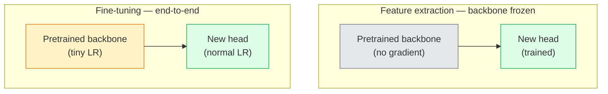

# Transfer Learning & Fine-Tuning

> Ai đó đã dành hàng triệu giờ GPU để dạy một mạng lưới cách nhận diện các cạnh, kết cấu và các bộ phận của vật thể. Bạn nên tận dụng những đặc trưng đó trước khi tự huấn luyện mô hình của riêng mình.

**Type:** Build
**Languages:** Python
**Prerequisites:** Phase 4 Lesson 03 (CNNs), Phase 4 Lesson 04 (Image Classification)
**Time:** ~75 minutes

## Mục tiêu học tập

- Phân biệt giữa trích xuất đặc trưng (feature extraction) và tinh chỉnh (fine-tuning), đồng thời chọn phương pháp phù hợp dựa trên kích thước tập dữ liệu, khoảng cách miền (domain distance) và ngân sách tính toán.
- Tải một backbone đã được huấn luyện trước, thay thế phần đầu phân loại (classifier head) và huấn luyện chỉ phần đầu đó để đạt được baseline trong dưới 20 dòng code.
- Mở khóa dần dần các lớp (unfreeze layers) với tốc độ học (learning rate) phân biệt, sao cho các đặc trưng tổng quát ở lớp đầu nhận được cập nhật nhỏ hơn so với các đặc trưng chuyên biệt ở lớp cuối.
- Chẩn đoán ba lỗi phổ biến: trôi đặc trưng (feature drift) do LR quá cao trên các khối chưa đóng băng, sụp đổ thống kê BatchNorm trên các tập dữ liệu cực nhỏ và quên lãng thảm họa (catastrophic forgetting).

## Vấn đề

Huấn luyện một ResNet-50 trên ImageNet tiêu tốn khoảng 2.000 giờ GPU. Rất ít đội ngũ có ngân sách đó cho mọi tác vụ họ triển khai. Điều mà hầu hết các đội ngũ thực sự triển khai là một backbone đã được huấn luyện trước với một phần đầu mới được huấn luyện trên vài trăm hoặc vài nghìn hình ảnh chuyên biệt cho tác vụ đó.

Đây không phải là một lối tắt. Khối conv đầu tiên của bất kỳ CNN nào được huấn luyện trên ImageNet đều học được các cạnh và các bộ lọc kiểu Gabor. Các khối tiếp theo học được các kết cấu và họa tiết đơn giản. Các khối ở giữa học được các bộ phận của vật thể. Các khối cuối cùng học được các tổ hợp bắt đầu trông giống như 1.000 danh mục của ImageNet. 90% đầu tiên của hệ thống phân cấp đó được chuyển giao gần như nguyên vẹn sang chẩn đoán hình ảnh y tế, kiểm tra công nghiệp, dữ liệu vệ tinh và mọi tác vụ thị giác khác — bởi vì tự nhiên có một vốn từ vựng hạn chế về các cạnh và kết cấu. 10% cuối cùng là những gì bạn thực sự huấn luyện.

Việc thực hiện transfer learning đúng cách có ba lỗi tiềm ẩn: phá hủy các đặc trưng đã được huấn luyện trước bằng tốc độ học quá cao, làm mô hình thiếu thông tin do đóng băng quá nhiều, và để các thống kê chạy (running statistics) của BatchNorm trôi về phía một tập dữ liệu nhỏ mà phần còn lại của mạng lưới chưa từng học. Bài học này sẽ hướng dẫn bạn cách xử lý từng lỗi một.

## Khái niệm

### Trích xuất đặc trưng vs Tinh chỉnh

Hai chế độ, được chọn dựa trên mức độ bạn tin tưởng vào các đặc trưng đã được huấn luyện trước và lượng dữ liệu bạn có.



Quy tắc ngón tay cái:

| Kích thước tập dữ liệu | Khoảng cách miền | Công thức |
|--------------|-----------------|--------|
| < 1k ảnh | gần với ImageNet | Đóng băng backbone, chỉ huấn luyện phần đầu |
| 1k-10k | gần | Đóng băng 2-3 giai đoạn đầu, tinh chỉnh phần còn lại |
| 10k-100k | bất kỳ | Tinh chỉnh end-to-end với LR phân biệt |
| 100k+ | xa | Tinh chỉnh toàn bộ; cân nhắc huấn luyện từ đầu nếu miền quá xa |

"Gần với ImageNet" đại khái có nghĩa là các ảnh RGB tự nhiên với nội dung giống vật thể. Các bản chụp CT y tế, hình ảnh vệ tinh từ trên cao và hình ảnh hiển vi là các miền xa — các đặc trưng vẫn hữu ích, nhưng bạn sẽ cần để nhiều lớp hơn thích nghi.

### Tại sao việc đóng băng lại hiệu quả

Các đặc trưng ImageNet mà một CNN học được không chuyên biệt cho 1.000 danh mục đó. Chúng chuyên biệt cho các thống kê của hình ảnh tự nhiên: các cạnh ở các hướng cụ thể, kết cấu, các mẫu tương phản, các nguyên mẫu hình dạng. Những thống kê đó ổn định trên hầu hết mọi miền thị giác mà con người có thể gọi tên. Đó là lý do tại sao một mô hình được huấn luyện trên ImageNet và đánh giá zero-shot trên CIFAR-10 chỉ với một phần đầu tuyến tính mới (không tinh chỉnh backbone) đạt độ chính xác hơn 80%. Phần đầu đang học cách trọng số các đặc trưng đã học cho tác vụ này.

### Tốc độ học phân biệt (Discriminative learning rates)

Khi bạn mở khóa các lớp, các lớp đầu tiên nên huấn luyện chậm hơn các lớp cuối. Các lớp đầu mã hóa các đặc trưng tổng quát mà bạn muốn bảo tồn; các lớp cuối mã hóa cấu trúc chuyên biệt cho tác vụ mà bạn cần thay đổi nhiều.

```
Typical recipe:

  stage 0 (stem + first group): lr = base_lr / 100    (mostly fixed)
  stage 1:                       lr = base_lr / 10
  stage 2:                       lr = base_lr / 3
  stage 3 (last backbone group): lr = base_lr
  head:                          lr = base_lr  (or slightly higher)
```

Trong PyTorch, đây chỉ là một danh sách các nhóm tham số được truyền vào trình tối ưu hóa (optimizer). Một mô hình, năm tốc độ học, không cần thêm code.

### Vấn đề BatchNorm

Các lớp BN giữ các bộ đệm `running_mean` và `running_var` được tính toán trên ImageNet. Nếu tác vụ của bạn có phân phối pixel khác — ánh sáng khác, cảm biến khác, không gian màu khác — các bộ đệm đó sẽ không chính xác. Ba lựa chọn theo thứ tự ưu tiên:

1. **Tinh chỉnh với BN ở chế độ train.** Để BN cập nhật các thống kê chạy của nó cùng với mọi thứ khác. Lựa chọn mặc định khi tập dữ liệu tác vụ có kích thước trung bình (>= 5k ví dụ).
2. **Đóng băng BN ở chế độ eval.** Giữ các thống kê ImageNet và chỉ huấn luyện các trọng số. Đúng đắn khi tập dữ liệu của bạn đủ nhỏ để trung bình động của BN bị nhiễu.
3. **Thay thế BN bằng GroupNorm.** Loại bỏ hoàn toàn vấn đề trung bình động. Được sử dụng trong các backbone phát hiện và phân đoạn nơi kích thước batch trên mỗi GPU rất nhỏ.

Làm sai điều này sẽ làm giảm độ chính xác từ 5-15% một cách âm thầm.

### Thiết kế phần đầu (Head design)

Phần đầu phân loại gồm 1-3 lớp tuyến tính cộng với dropout tùy chọn. Mọi backbone torchvision đều đi kèm với một phần đầu mặc định mà bạn thay thế:

```
backbone.fc = nn.Linear(backbone.fc.in_features, num_classes)          # ResNet
backbone.classifier[1] = nn.Linear(..., num_classes)                    # EfficientNet, MobileNet
backbone.heads.head = nn.Linear(..., num_classes)                       # torchvision ViT
```

Đối với các tập dữ liệu nhỏ, một lớp tuyến tính duy nhất thường là đủ. Thêm một lớp ẩn (Linear -> ReLU -> Dropout -> Linear) sẽ hữu ích khi phân phối của tác vụ xa hơn so với phân phối huấn luyện của backbone.

### Suy giảm LR theo từng lớp (Layer-wise LR decay)

Một phiên bản mượt mà hơn của LR phân biệt được sử dụng trong tinh chỉnh hiện đại (BEiT, DINOv2, ViT-B). Thay vì nhóm các lớp thành các giai đoạn, hãy cho mỗi lớp một LR nhỏ hơn một chút so với lớp phía trên nó:

```
lr_layer_k = base_lr * decay^(L - k)
```

Với decay = 0.75 và L = 12 khối transformer, khối đầu tiên huấn luyện ở mức `0.75^11 ≈ 0.04x` LR của phần đầu. Điều này quan trọng hơn đối với tinh chỉnh transformer so với CNN, nơi LR theo nhóm giai đoạn thường là đủ.

### Những gì cần đánh giá

Các lần chạy transfer-learning cần hai con số mà bạn sẽ không theo dõi trong một lần chạy từ đầu:

- **Độ chính xác chỉ với pretrained** — độ chính xác của phần đầu với backbone bị đóng băng. Đây là mức sàn của bạn.
- **Độ chính xác sau tinh chỉnh** — cùng một mô hình sau khi huấn luyện end-to-end. Đây là mức trần của bạn.

Nếu độ chính xác sau tinh chỉnh thấp hơn chỉ với pretrained, bạn đang gặp lỗi về tốc độ học hoặc BN. Luôn in ra cả hai.

```figure
transfer-learning
```

## Xây dựng

### Bước 1: Tải một backbone đã được huấn luyện trước và kiểm tra nó

```python
import torch
import torch.nn as nn
from torchvision.models import resnet18, ResNet18_Weights

backbone = resnet18(weights=ResNet18_Weights.IMAGENET1K_V1)
print(backbone)
print()
print("classifier head:", backbone.fc)
print("feature dim:", backbone.fc.in_features)
```

`ResNet18` có bốn giai đoạn (`layer1..layer4`) cộng với một stem và một phần đầu `fc`. Mọi backbone phân loại torchvision đều có cấu trúc tương tự.

### Bước 2: Trích xuất đặc trưng — đóng băng mọi thứ, thay thế phần đầu

```python
def make_feature_extractor(num_classes=10):
    model = resnet18(weights=ResNet18_Weights.IMAGENET1K_V1)
    for p in model.parameters():
        p.requires_grad = False
    model.fc = nn.Linear(model.fc.in_features, num_classes)
    return model

model = make_feature_extractor(num_classes=10)
trainable = sum(p.numel() for p in model.parameters() if p.requires_grad)
frozen = sum(p.numel() for p in model.parameters() if not p.requires_grad)
print(f"trainable: {trainable:>10,}")
print(f"frozen:    {frozen:>10,}")
```

Chỉ có `model.fc` là có thể huấn luyện. Backbone là một bộ trích xuất đặc trưng đã đóng băng.

### Bước 3: Tinh chỉnh phân biệt

Một tiện ích xây dựng các nhóm tham số với tốc độ học cụ thể cho từng giai đoạn.

```python
def discriminative_param_groups(model, base_lr=1e-3, decay=0.3):
    stages = [
        ["conv1", "bn1"],
        ["layer1"],
        ["layer2"],
        ["layer3"],
        ["layer4"],
        ["fc"],
    ]
    groups = []
    for i, names in enumerate(stages):
        lr = base_lr * (decay ** (len(stages) - 1 - i))
        params = [p for n, p in model.named_parameters()
                  if any(n.startswith(k) for k in names)]
        if params:
            groups.append({"params": params, "lr": lr, "name": "_".join(names)})
    return groups

model = resnet18(weights=ResNet18_Weights.IMAGENET1K_V1)
model.fc = nn.Linear(model.fc.in_features, 10)
for p in model.parameters():
    p.requires_grad = True

groups = discriminative_param_groups(model)
for g in groups:
    print(f"{g['name']:>10s}  lr={g['lr']:.2e}  params={sum(p.numel() for p in g['params']):>8,}")
```

`decay=0.3` có nghĩa là mỗi giai đoạn huấn luyện ở mức 30% tốc độ của giai đoạn tiếp theo. `fc` nhận `base_lr`, `layer4` nhận `0.3 * base_lr`, `conv1` nhận `0.3^5 * base_lr ≈ 0.00243 * base_lr`. Nghe có vẻ cực đoan; nhưng thực nghiệm cho thấy nó hiệu quả.

### Bước 4: Xử lý BatchNorm

Trình trợ giúp để đóng băng các thống kê chạy của BN mà không đóng băng trọng số của nó.

```python
def freeze_bn_stats(model):
    for m in model.modules():
        if isinstance(m, (nn.BatchNorm1d, nn.BatchNorm2d, nn.BatchNorm3d)):
            m.eval()
            for p in m.parameters():
                p.requires_grad = False
    return model
```

Gọi nó sau khi bạn đặt `model.train()` ở đầu mỗi epoch. `model.train()` chuyển mọi thứ sang chế độ huấn luyện; lệnh này đảo ngược nó chỉ cho các lớp BN.

### Bước 5: Vòng lặp tinh chỉnh end-to-end tối giản

```python
from torch.optim import SGD
from torch.utils.data import DataLoader
from torch.optim.lr_scheduler import CosineAnnealingLR
import torch.nn.functional as F

def fine_tune(model, train_loader, val_loader, device, epochs=5, base_lr=1e-3, freeze_bn=False):
    model = model.to(device)
    groups = discriminative_param_groups(model, base_lr=base_lr)
    optimizer = SGD(groups, momentum=0.9, weight_decay=1e-4, nesterov=True)
    scheduler = CosineAnnealingLR(optimizer, T_max=epochs)

    for epoch in range(epochs):
        model.train()
        if freeze_bn:
            freeze_bn_stats(model)
        tr_loss, tr_correct, tr_total = 0.0, 0, 0
        for x, y in train_loader:
            x, y = x.to(device), y.to(device)
            logits = model(x)
            loss = F.cross_entropy(logits, y, label_smoothing=0.1)
            optimizer.zero_grad()
            loss.backward()
            optimizer.step()
            tr_loss += loss.item() * x.size(0)
            tr_total += x.size(0)
            tr_correct += (logits.argmax(-1) == y).sum().item()
        scheduler.step()

        model.eval()
        va_total, va_correct = 0, 0
        with torch.no_grad():
            for x, y in val_loader:
                x, y = x.to(device), y.to(device)
                pred = model(x).argmax(-1)
                va_total += x.size(0)
                va_correct += (pred == y).sum().item()
        print(f"epoch {epoch}  train {tr_loss/tr_total:.3f}/{tr_correct/tr_total:.3f}  "
              f"val {va_correct/va_total:.3f}")
    return model
```

Năm epoch với công thức trên trên CIFAR-10 mất `ResNet18-IMAGENET1K_V1` để đưa từ độ chính xác ~70% zero-shot linear-probe lên ~93% độ chính xác sau tinh chỉnh. Chỉ riêng phần đầu sẽ đạt ngưỡng khoảng 86% mà không bao giờ chạm vào backbone.

### Bước 6: Mở khóa dần dần (Progressive unfreezing)

Một lịch trình mở khóa từng giai đoạn mỗi epoch từ cuối về đầu. Giảm thiểu trôi đặc trưng với cái giá là thêm một vài epoch.

```python
def progressive_unfreeze_schedule(model):
    stages = ["layer4", "layer3", "layer2", "layer1"]
    yielded = set()

    def start():
        for p in model.parameters():
            p.requires_grad = False
        for p in model.fc.parameters():
            p.requires_grad = True

    def unfreeze(epoch):
        if epoch < len(stages):
            name = stages[epoch]
            yielded.add(name)
            for n, p in model.named_parameters():
                if n.startswith(name):
                    p.requires_grad = True
            return name
        return None

    return start, unfreeze
```

Gọi `start()` một lần trước epoch đầu tiên. Gọi `unfreeze(epoch)` ở đầu mỗi epoch. Xây dựng lại optimizer bất cứ khi nào tập hợp các tham số có thể huấn luyện thay đổi, nếu không các tham số bị đóng băng vẫn giữ các moment được lưu trong bộ nhớ đệm gây nhầm lẫn cho nó.

## Sử dụng

Đối với hầu hết các tác vụ thực tế, `torchvision.models` + ba dòng code là đủ. Các cơ chế nặng nề ở trên quan trọng khi bạn gặp phải các vấn đề mà các mặc định của thư viện không thể giải quyết.

```python
from torchvision.models import resnet50, ResNet50_Weights

model = resnet50(weights=ResNet50_Weights.IMAGENET1K_V2)
model.fc = nn.Linear(model.fc.in_features, num_classes)
optimizer = torch.optim.AdamW(model.parameters(), lr=1e-4, weight_decay=1e-4)
```

Hai mặc định cấp sản xuất khác:

- `timm` cung cấp ~800 backbone thị giác đã được huấn luyện trước với API nhất quán (`timm.create_model("resnet50", pretrained=True, num_classes=10)`). Đối với bất kỳ tinh chỉnh nào ngoài thư viện torchvision, đây là tiêu chuẩn.
- Đối với transformers, `transformers.AutoModelForImageClassification.from_pretrained(name, num_labels=N)` cung cấp cho bạn ViT / BEiT / DeiT với ngữ nghĩa tải giống như các mô hình văn bản.

## Triển khai

Bài học này tạo ra:

- `outputs/prompt-fine-tune-planner.md` — một prompt chọn giữa trích xuất đặc trưng, mở khóa dần dần hoặc tinh chỉnh end-to-end dựa trên kích thước tập dữ liệu, khoảng cách miền và ngân sách tính toán.
- `outputs/skill-freeze-inspector.md` — một kỹ năng, khi có một mô hình PyTorch, sẽ báo cáo những tham số nào có thể huấn luyện, những lớp BatchNorm nào đang ở chế độ eval và liệu optimizer có thực sự được cung cấp các tham số có thể huấn luyện hay không.

## Bài tập

1. **(Dễ)** Huấn luyện một `ResNet18` dưới dạng linear probe (backbone đóng băng) và dưới dạng tinh chỉnh toàn bộ trên cùng một tập dữ liệu synthetic-CIFAR. Báo cáo cả hai độ chính xác cạnh nhau. Giải thích khoảng cách nào cho bạn biết các đặc trưng chuyển giao tốt và khoảng cách nào cho bạn biết chúng không chuyển giao tốt.
2. **(Trung bình)** Cố tình tạo lỗi: đặt `base_lr = 1e-1` trên giai đoạn backbone thay vì phần đầu. Cho thấy loss huấn luyện bùng nổ, sau đó phục hồi bằng cách áp dụng trình trợ giúp `discriminative_param_groups`. Ghi lại LR tại đó mỗi giai đoạn bắt đầu phân kỳ.
3. **(Khó)** Lấy một tập dữ liệu hình ảnh y tế (ví dụ: CheXpert-small, PatchCamelyon hoặc HAM10000) và so sánh ba chế độ: (a) Backbone đóng băng đã pretrained trên ImageNet + phần đầu tuyến tính; (b) Tinh chỉnh end-to-end đã pretrained trên ImageNet; (c) Huấn luyện từ đầu. Báo cáo độ chính xác và chi phí tính toán cho mỗi loại. Ở kích thước tập dữ liệu nào thì huấn luyện từ đầu trở nên cạnh tranh?

## Thuật ngữ chính

| Thuật ngữ | Cách gọi thông thường | Ý nghĩa thực tế |
|------|----------------|----------------------|
| Feature extraction | "Đóng băng và huấn luyện phần đầu" | Các tham số backbone bị đóng băng, chỉ phần đầu phân loại mới nhận gradient |
| Fine-tuning | "Huấn luyện lại end-to-end" | Tất cả tham số có thể huấn luyện, thường với LR nhỏ hơn nhiều so với huấn luyện từ đầu |
| Discriminative LR | "LR nhỏ hơn cho các lớp đầu" | Các nhóm tham số optimizer trong đó LR giai đoạn đầu là một phần nhỏ của LR giai đoạn cuối |
| Layer-wise LR decay | "Gradient LR mượt mà" | LR mỗi lớp được nhân với decay^(L - k); phổ biến trong tinh chỉnh transformer |
| Catastrophic forgetting | "Mô hình đã mất ImageNet" | LR quá cao ghi đè lên các đặc trưng đã pretrained trước khi tín hiệu tác vụ mới được học |
| BN statistics drift | "Running mean bị sai" | BatchNorm running_mean/var được tính trên một phân phối khác với tác vụ hiện tại, làm giảm độ chính xác một cách âm thầm |
| Linear probe | "Backbone đóng băng + phần đầu tuyến tính" | Đánh giá các đặc trưng pretrained — độ chính xác của bộ phân loại tuyến tính tốt nhất trên biểu diễn đã đóng băng |
| Catastrophic collapse | "Mọi thứ dự đoán một lớp" | Xảy ra khi tinh chỉnh với LR đủ cao để phá hủy các đặc trưng trước khi gradient từ phần đầu có thể ổn định |

## Đọc thêm

- [How transferable are features in deep neural networks? (Yosinski et al., 2014)](https://arxiv.org/abs/1411.1792) — bài báo định lượng khả năng chuyển giao đặc trưng qua các lớp
- [Universal Language Model Fine-tuning (ULMFiT, Howard & Ruder, 2018)](https://arxiv.org/abs/1801.06146) — công thức LR phân biệt / mở khóa dần dần gốc; các ý tưởng chuyển giao trực tiếp sang thị giác
- [timm documentation](https://huggingface.co/docs/timm) — tài liệu tham khảo cho các backbone thị giác hiện đại và các mặc định tinh chỉnh chính xác mà chúng được huấn luyện
- [A Simple Framework for Linear-Probe Evaluation (Kornblith et al., 2019)](https://arxiv.org/abs/1805.08974) — tại sao độ chính xác linear-probe lại quan trọng và cách báo cáo nó chính xác