# Object Detection — YOLO từ đầu (from Scratch)

> Detection (phát hiện đối tượng) là sự kết hợp giữa classification (phân loại) và regression (hồi quy), được thực hiện tại mọi vị trí trên feature map, sau đó được làm sạch bằng non-maximum suppression.

**Type:** Build
**Languages:** Python
**Prerequisites:** Phase 4 Lesson 03 (CNNs), Phase 4 Lesson 04 (Image Classification), Phase 4 Lesson 05 (Transfer Learning)
**Time:** ~75 phút

## Mục tiêu học tập

- Giải thích thiết kế grid-and-anchor giúp biến bài toán detection thành bài toán dự đoán dày đặc (dense prediction) và ý nghĩa của từng con số trong output tensor.
- Tính toán Intersection-over-Union giữa các khung hình (box) và triển khai non-maximum suppression từ đầu.
- Xây dựng một head kiểu YOLO tối giản trên nền một backbone đã được huấn luyện trước, bao gồm các hàm loss cho classification, objectness và box-regression.
- Đọc một hàng chỉ số detection (precision@0.5, recall, mAP@0.5, mAP@0.5:0.95) và quyết định cần điều chỉnh tham số nào tiếp theo.

## Vấn đề

Classification cho biết "đây là một con chó". Detection cho biết "có một con chó tại các pixel (112, 40, 280, 210), có một con mèo tại (400, 180, 560, 310), và không có gì khác trong khung hình". Sự thay đổi cấu trúc đó — dự đoán một số lượng biến đổi các khung hình có nhãn thay vì một nhãn cho mỗi ảnh — là nền tảng cho mọi hệ thống tự hành, sản phẩm giám sát, trình phân tích bố cục tài liệu và dây chuyền thị giác trong nhà máy.

Detection cũng là nơi mọi sự đánh đổi kỹ thuật trong thị giác máy tính xuất hiện cùng lúc. Bạn muốn các khung hình chính xác (regression head), bạn muốn nhãn đúng cho mỗi khung hình (classification head), bạn muốn mô hình biết khi nào không có gì để phát hiện (objectness score), và bạn muốn chính xác một dự đoán cho mỗi đối tượng thực tế (non-maximum suppression). Nếu bỏ lỡ bất kỳ yếu tố nào, pipeline sẽ bỏ sót đối tượng, báo cáo các khung hình ảo hoặc dự đoán cùng một đối tượng mười lăm lần ở các vị trí hơi khác nhau.

YOLO (You Only Look Once, Redmon et al. 2016) là thiết kế giúp tất cả những điều này chạy trong thời gian thực bằng cách thực hiện chỉ với một lần forward pass của conv net, và các quyết định cấu trúc tương tự vẫn là xương sống của các detector hiện đại (YOLOv8, YOLOv9, YOLO-NAS, RT-DETR). Hãy nắm vững cốt lõi và mọi biến thể sẽ chỉ là sự sắp xếp lại của cùng các thành phần đó.

## Khái niệm

### Detection dưới dạng dense prediction

Một classifier xuất ra C con số cho mỗi ảnh. Một detector kiểu YOLO xuất ra `(S x S x (5 + C))` con số cho mỗi ảnh, trong đó S là kích thước lưới không gian (spatial grid size).

```mermaid
flowchart LR
    IMG["Input 416x416 RGB"] --> BB["Backbone<br/>(ResNet, DarkNet, ...)"]
    BB --> FM["Feature map<br/>(C_feat, 13, 13)"]
    FM --> HEAD["Detection head<br/>(1x1 convs)"]
    HEAD --> OUT["Output tensor<br/>(13, 13, B * (5 + C))"]
    OUT --> DEC["Decode<br/>(grid + sigmoid + exp)"]
    DEC --> NMS["Non-max suppression"]
    NMS --> RESULT["Final boxes"]

    style IMG fill:#dbeafe,stroke:#2563eb
    style HEAD fill:#fef3c7,stroke:#d97706
    style NMS fill:#fecaca,stroke:#dc2626
    style RESULT fill:#dcfce7,stroke:#16a34a
```



Mỗi ô lưới trong số `S * S` ô dự đoán `B` khung hình. Đối với mỗi khung hình:

- 4 con số mô tả hình học: `tx, ty, tw, th`.
- 1 con số là điểm objectness: "có đối tượng nào nằm ở trung tâm ô này không?"
- C con số là xác suất lớp.

Tổng số mỗi ô: `B * (5 + C)`. Đối với VOC với `S=13, B=2, C=20`, đó là 50 con số mỗi ô.

### Tại sao lại dùng lưới và anchor

Hồi quy đơn thuần sẽ dự đoán `(x, y, w, h)` cho mỗi đối tượng dưới dạng tọa độ tuyệt đối. Điều này khó đối với conv net vì việc dịch chuyển ảnh không nên làm dịch chuyển tất cả các dự đoán theo cùng một lượng — mỗi đối tượng được neo giữ theo không gian. Lưới giải quyết vấn đề này bằng cách gán mỗi khung hình ground-truth cho ô lưới mà tâm của nó rơi vào; chỉ ô đó chịu trách nhiệm cho đối tượng đó.

Các anchor giải quyết vấn đề thứ hai. Một conv 3x3 không thể dễ dàng hồi quy một khung hình rộng 500 pixel từ một ô feature có receptive field 16 pixel. Thay vào đó, chúng ta định nghĩa trước `B` hình dạng khung hình ưu tiên (anchor) cho mỗi ô và dự đoán các delta nhỏ từ mỗi anchor. Mô hình học cách chọn anchor phù hợp và tinh chỉnh nó thay vì hồi quy từ con số không.

```
Anchor box priors (example for 416x416 input):

  small:   (30,  60)
  medium:  (75,  170)
  large:   (200, 380)

At each grid cell, every anchor emits (tx, ty, tw, th, obj, c_1, ..., c_C).
```

Các detector hiện đại thường sử dụng FPN với các tập anchor khác nhau cho mỗi độ phân giải — anchor nhỏ trên các bản đồ độ phân giải cao nông, anchor lớn trên các bản đồ độ phân giải thấp sâu. Ý tưởng tương tự, nhưng ở nhiều quy mô hơn.

### Giải mã dự đoán

Các `tx, ty, tw, th` thô không phải là tọa độ khung hình; chúng là các mục tiêu hồi quy cần được biến đổi trước khi vẽ:

```
centre x  = (sigmoid(tx) + cell_x) * stride
centre y  = (sigmoid(ty) + cell_y) * stride
width     = anchor_w * exp(tw)
height    = anchor_h * exp(th)
```

`sigmoid` giữ các độ lệch tâm bên trong ô. `exp` cho phép chiều rộng thay đổi tự do từ anchor mà không bị lật dấu. `stride` đưa tọa độ lưới trở lại đơn vị pixel. Bước giải mã này giống nhau trong mọi phiên bản YOLO kể từ v2.

### IoU

Số liệu đo lường sự tương đồng phổ quát của detection giữa hai khung hình:

```
IoU(A, B) = area(A intersect B) / area(A union B)
```

IoU = 1 nghĩa là giống hệt nhau; IoU = 0 nghĩa là không chồng lấp. IoU giữa dự đoán và khung hình ground-truth là yếu tố quyết định liệu một dự đoán có được tính là true positive hay không (thường là IoU >= 0.5). IoU giữa hai dự đoán là thứ mà NMS sử dụng để loại bỏ trùng lặp.

### Non-maximum suppression

Một conv net được huấn luyện trên các anchor liền kề thường sẽ dự đoán các khung hình chồng lấp cho cùng một đối tượng. NMS giữ lại dự đoán có độ tin cậy cao nhất và xóa bất kỳ dự đoán nào khác có IoU vượt quá ngưỡng.

```
NMS(boxes, scores, iou_threshold):
    sort boxes by score descending
    keep = []
    while boxes not empty:
        pick the top-scoring box, add to keep
        remove every box with IoU > iou_threshold to the picked box
    return keep
```

Ngưỡng điển hình: 0.45 cho object detection. Các detector gần đây thay thế NMS tiêu chuẩn bằng `soft-NMS`, `DIoU-NMS`, hoặc học cách triệt tiêu trực tiếp (RT-DETR) nhưng mục đích cấu trúc vẫn như cũ.

### Hàm loss

YOLO loss là ba hàm loss được cộng lại với trọng số:

```
L = lambda_coord * L_box(pred, target, where obj=1)
  + lambda_obj   * L_obj(pred, 1,     where obj=1)
  + lambda_noobj * L_obj(pred, 0,     where obj=0)
  + lambda_cls   * L_cls(pred, target, where obj=1)
```

Chỉ những ô chứa đối tượng mới đóng góp vào loss box-regression và classification. Các ô không có đối tượng chỉ đóng góp vào loss objectness (dạy mô hình giữ im lặng). `lambda_noobj` thường nhỏ (~0.5) vì phần lớn các ô đều trống và nếu không sẽ lấn át tổng loss.

Các biến thể hiện đại thay thế MSE box loss bằng CIoU / DIoU (tối ưu hóa trực tiếp IoU), sử dụng focal loss cho sự mất cân bằng lớp, và cân bằng objectness với quality focal loss. Cấu trúc ba thành phần vẫn không thay đổi.

### Chỉ số detection

Độ chính xác (Accuracy) không áp dụng được cho detection. Bốn con số cần quan tâm:

- **Precision@IoU=0.5** — trong số các dự đoán được tính là dương tính, bao nhiêu là thực sự đúng.
- **Recall@IoU=0.5** — trong số các đối tượng thực tế, chúng ta đã tìm thấy bao nhiêu.
- **AP@0.5** — diện tích dưới đường cong precision-recall tại ngưỡng IoU 0.5; một con số cho mỗi lớp.
- **mAP@0.5:0.95** — trung bình của AP trên các ngưỡng IoU 0.5, 0.55, ..., 0.95. Chỉ số COCO; nghiêm ngặt và giàu thông tin nhất.

Hãy báo cáo cả bốn. Một detector mạnh về mAP@0.5 nhưng yếu về mAP@0.5:0.95 là detector định vị thô nhưng không chặt chẽ; hãy khắc phục bằng hàm box-regression loss tốt hơn. Một detector có precision cao và recall thấp là quá bảo thủ; hãy hạ ngưỡng tin cậy hoặc tăng trọng số objectness.

```figure
object-detection-nms
```

## Xây dựng

### Bước 1: IoU

Công cụ chủ lực của toàn bộ bài học. Hoạt động trên hai mảng khung hình ở định dạng `(x1, y1, x2, y2)`.

```python
import numpy as np

def box_iou(boxes_a, boxes_b):
    ax1, ay1, ax2, ay2 = boxes_a[:, 0], boxes_a[:, 1], boxes_a[:, 2], boxes_a[:, 3]
    bx1, by1, bx2, by2 = boxes_b[:, 0], boxes_b[:, 1], boxes_b[:, 2], boxes_b[:, 3]

    inter_x1 = np.maximum(ax1[:, None], bx1[None, :])
    inter_y1 = np.maximum(ay1[:, None], by1[None, :])
    inter_x2 = np.minimum(ax2[:, None], bx2[None, :])
    inter_y2 = np.minimum(ay2[:, None], by2[None, :])

    inter_w = np.clip(inter_x2 - inter_x1, 0, None)
    inter_h = np.clip(inter_y2 - inter_y1, 0, None)
    inter = inter_w * inter_h

    area_a = (ax2 - ax1) * (ay2 - ay1)
    area_b = (bx2 - bx1) * (by2 - by1)
    union = area_a[:, None] + area_b[None, :] - inter
    return inter / np.clip(union, 1e-8, None)
```

Trả về một ma trận `(N_a, N_b)` các IoU theo cặp. Sử dụng nó với một khung hình ground-truth duy nhất bằng cách tạo một trong các mảng có shape `(1, 4)`.

### Bước 2: Non-max suppression

```python
def nms(boxes, scores, iou_threshold=0.45):
    order = np.argsort(-scores)
    keep = []
    while len(order) > 0:
        i = order[0]
        keep.append(i)
        if len(order) == 1:
            break
        rest = order[1:]
        ious = box_iou(boxes[[i]], boxes[rest])[0]
        order = rest[ious <= iou_threshold]
    return np.array(keep, dtype=np.int64)
```

Tính toán xác định, `O(N log N)` từ việc sắp xếp, và khớp với hành vi của `torchvision.ops.nms` trên các đầu vào giống hệt nhau.

### Bước 3: Mã hóa và giải mã khung hình

Chuyển đổi giữa tọa độ pixel và các mục tiêu `(tx, ty, tw, th)` mà mạng thực sự hồi quy.

```python
def encode(box_xyxy, cell_x, cell_y, stride, anchor_wh):
    x1, y1, x2, y2 = box_xyxy
    cx = 0.5 * (x1 + x2)
    cy = 0.5 * (y1 + y2)
    w = x2 - x1
    h = y2 - y1
    tx = cx / stride - cell_x
    ty = cy / stride - cell_y
    tw = np.log(w / anchor_wh[0] + 1e-8)
    th = np.log(h / anchor_wh[1] + 1e-8)
    return np.array([tx, ty, tw, th])


def decode(tx_ty_tw_th, cell_x, cell_y, stride, anchor_wh):
    tx, ty, tw, th = tx_ty_tw_th
    cx = (sigmoid(tx) + cell_x) * stride
    cy = (sigmoid(ty) + cell_y) * stride
    w = anchor_wh[0] * np.exp(tw)
    h = anchor_wh[1] * np.exp(th)
    return np.array([cx - w / 2, cy - h / 2, cx + w / 2, cy + h / 2])


def sigmoid(x):
    return 1.0 / (1.0 + np.exp(-x))
```

Kiểm tra: mã hóa một khung hình rồi giải mã — bạn sẽ nhận lại kết quả rất gần với bản gốc (ngoại trừ việc nghịch đảo sigmoid không hoàn toàn khả nghịch khi `tx` không nằm trong phạm vi post-sigmoid).

### Bước 4: Một YOLO head tối giản

Một conv 1x1 trên feature map, reshape thành `(B, S, S, num_anchors, 5 + C)`.

```python
import torch
import torch.nn as nn

class YOLOHead(nn.Module):
    def __init__(self, in_c, num_anchors, num_classes):
        super().__init__()
        self.num_anchors = num_anchors
        self.num_classes = num_classes
        self.conv = nn.Conv2d(in_c, num_anchors * (5 + num_classes), kernel_size=1)

    def forward(self, x):
        n, _, h, w = x.shape
        y = self.conv(x)
        y = y.view(n, self.num_anchors, 5 + self.num_classes, h, w)
        y = y.permute(0, 3, 4, 1, 2).contiguous()
        return y
```

Output shape: `(N, H, W, num_anchors, 5 + C)`. Chiều cuối cùng chứa `[tx, ty, tw, th, obj, cls_0, ..., cls_{C-1}]`.

### Bước 5: Gán ground-truth

Đối với mỗi khung hình ground-truth, quyết định ô `(cell, anchor)` nào chịu trách nhiệm.

```python
def assign_targets(boxes_xyxy, classes, anchors, stride, grid_size, num_classes):
    num_anchors = len(anchors)
    target = np.zeros((grid_size, grid_size, num_anchors, 5 + num_classes), dtype=np.float32)
    has_obj = np.zeros((grid_size, grid_size, num_anchors), dtype=bool)

    for box, cls in zip(boxes_xyxy, classes):
        x1, y1, x2, y2 = box
        cx, cy = 0.5 * (x1 + x2), 0.5 * (y1 + y2)
        gx, gy = int(cx / stride), int(cy / stride)
        bw, bh = x2 - x1, y2 - y1

        ious = np.array([
            (min(bw, aw) * min(bh, ah)) / (bw * bh + aw * ah - min(bw, aw) * min(bh, ah))
            for aw, ah in anchors
        ])
        best = int(np.argmax(ious))
        aw, ah = anchors[best]

        target[gy, gx, best, 0] = cx / stride - gx
        target[gy, gx, best, 1] = cy / stride - gy
        target[gy, gx, best, 2] = np.log(bw / aw + 1e-8)
        target[gy, gx, best, 3] = np.log(bh / ah + 1e-8)
        target[gy, gx, best, 4] = 1.0
        target[gy, gx, best, 5 + cls] = 1.0
        has_obj[gy, gx, best] = True
    return target, has_obj
```

Việc chọn anchor là "IoU hình dạng tốt nhất với ground truth" — một proxy rẻ tiền khớp với cách gán của YOLOv2/v3. v5 trở về sau sử dụng các chiến lược tinh vi hơn (task-aligned matching, dynamic k) giúp tinh chỉnh ý tưởng tương tự.

### Bước 6: Ba hàm loss

```python
def yolo_loss(pred, target, has_obj, lambda_coord=5.0, lambda_obj=1.0, lambda_noobj=0.5, lambda_cls=1.0):
    has_obj_t = torch.from_numpy(has_obj).bool()
    target_t = torch.from_numpy(target).float()

    # box-regression loss: only on cells with objects
    box_pred = pred[..., :4][has_obj_t]
    box_true = target_t[..., :4][has_obj_t]
    loss_box = torch.nn.functional.mse_loss(box_pred, box_true, reduction="sum")

    # objectness loss
    obj_pred = pred[..., 4]
    obj_true = target_t[..., 4]
    loss_obj_pos = torch.nn.functional.binary_cross_entropy_with_logits(
        obj_pred[has_obj_t], obj_true[has_obj_t], reduction="sum")
    loss_obj_neg = torch.nn.functional.binary_cross_entropy_with_logits(
        obj_pred[~has_obj_t], obj_true[~has_obj_t], reduction="sum")

    # classification loss on cells with objects
    cls_pred = pred[..., 5:][has_obj_t]
    cls_true = target_t[..., 5:][has_obj_t]
    loss_cls = torch.nn.functional.binary_cross_entropy_with_logits(
        cls_pred, cls_true, reduction="sum")

    total = (lambda_coord * loss_box
             + lambda_obj * loss_obj_pos
             + lambda_noobj * loss_obj_neg
             + lambda_cls * loss_cls)
    return total, {"box": loss_box.item(), "obj_pos": loss_obj_pos.item(),
                   "obj_neg": loss_obj_neg.item(), "cls": loss_cls.item()}
```

Năm siêu tham số mà mọi hướng dẫn YOLO đều hardcode hoặc quét qua. Tỷ lệ rất quan trọng: `lambda_coord=5, lambda_noobj=0.5` phản ánh bài báo YOLOv1 gốc và vẫn hoạt động như một mặc định hợp lý.

### Bước 7: Inference pipeline

Giải mã output thô của head, áp dụng sigmoid/exp, ngưỡng hóa trên objectness, và NMS.

```python
def postprocess(pred_tensor, anchors, stride, img_size, conf_threshold=0.25, iou_threshold=0.45):
    pred = pred_tensor.detach().cpu().numpy()
    grid_h, grid_w = pred.shape[1], pred.shape[2]
    num_anchors = len(anchors)

    boxes, scores, classes = [], [], []
    for gy in range(grid_h):
        for gx in range(grid_w):
            for a in range(num_anchors):
                tx, ty, tw, th, obj, *cls = pred[0, gy, gx, a]
                score = sigmoid(obj) * sigmoid(np.array(cls)).max()
                if score < conf_threshold:
                    continue
                cls_idx = int(np.argmax(cls))
                cx = (sigmoid(tx) + gx) * stride
                cy = (sigmoid(ty) + gy) * stride
                w = anchors[a][0] * np.exp(tw)
                h = anchors[a][1] * np.exp(th)
                boxes.append([cx - w / 2, cy - h / 2, cx + w / 2, cy + h / 2])
                scores.append(float(score))
                classes.append(cls_idx)

    if not boxes:
        return np.zeros((0, 4)), np.zeros((0,)), np.zeros((0,), dtype=int)
    boxes = np.array(boxes)
    scores = np.array(scores)
    classes = np.array(classes)
    keep = nms(boxes, scores, iou_threshold)
    return boxes[keep], scores[keep], classes[keep]
```

Đó là toàn bộ đường dẫn đánh giá: head -> decode -> threshold -> NMS.

## Sử dụng

`torchvision.models.detection` cung cấp các detector sản xuất với cùng cấu trúc khái niệm. Việc tải một mô hình đã huấn luyện trước chỉ mất ba dòng code.

```python
import torch
from torchvision.models.detection import fasterrcnn_resnet50_fpn_v2

model = fasterrcnn_resnet50_fpn_v2(weights="DEFAULT")
model.eval()
with torch.no_grad():
    predictions = model([torch.randn(3, 400, 600)])
print(predictions[0].keys())
print(f"boxes:  {predictions[0]['boxes'].shape}")
print(f"scores: {predictions[0]['scores'].shape}")
print(f"labels: {predictions[0]['labels'].shape}")
```

Đối với các pipeline inference thời gian thực, `ultralytics` (YOLOv8/v9) là tiêu chuẩn: `from ultralytics import YOLO; model = YOLO('yolov8n.pt'); model(img)`. Mô hình xử lý việc giải mã và NMS nội bộ và trả về cùng bộ ba `boxes / scores / labels` mà bạn đã xây dựng ở trên.

## Triển khai

Bài học này tạo ra:

- `outputs/prompt-detection-metric-reader.md` — một prompt biến một hàng `precision, recall, AP, mAP@0.5:0.95` thành chẩn đoán một dòng và thí nghiệm tiếp theo hữu ích nhất.
- `outputs/skill-anchor-designer.md` — một kỹ năng, khi có tập dữ liệu các khung hình ground-truth, sẽ chạy k-means trên `(w, h)` và trả về các tập anchor cho mỗi cấp FPN cộng với các thống kê độ phủ bạn cần để chọn số lượng anchor phù hợp.

## Bài tập

1. **(Dễ)** Triển khai `box_iou` và chạy nó với `torchvision.ops.box_iou` trên 1.000 cặp khung hình ngẫu nhiên. Xác minh sai số tuyệt đối tối đa nằm dưới `1e-6`.
2. **(Trung bình)** Chuyển đổi `yolo_loss` sang phiên bản sử dụng `CIoU` box loss thay vì MSE. Chứng minh trên tập dữ liệu tổng hợp 100 ảnh rằng CIoU hội tụ đến mAP@0.5:0.95 cuối cùng tốt hơn MSE trong cùng số epoch.
3. **(Khó)** Triển khai multi-scale inference: đưa cùng một ảnh ở ba độ phân giải qua mô hình, hợp nhất các dự đoán khung hình, và chạy một NMS duy nhất ở cuối. Đo lường mức tăng mAP so với single-scale inference trên tập dữ liệu giữ lại.

## Thuật ngữ chính

| Thuật ngữ | Cách gọi thông thường | Ý nghĩa thực tế |
|------|----------------|----------------------|
| Anchor | "Box prior" | Hình dạng khung hình được định nghĩa trước tại mỗi ô lưới, từ đó mạng dự đoán các delta thay vì tọa độ tuyệt đối |
| IoU | "Overlap" | Intersection-over-union của hai khung hình; thước đo tương đồng phổ quát trong detection |
| NMS | "Deduplicate" | Thuật toán tham lam giữ lại các dự đoán có điểm số cao nhất và loại bỏ các dự đoán chồng lấp vượt ngưỡng |
| Objectness | "Is there something here" | Scalar cho mỗi anchor, mỗi ô dự đoán liệu một đối tượng có nằm ở trung tâm ô đó hay không |
| Grid stride | "Downsample factor" | Số pixel trên mỗi ô lưới; đầu vào 416-px với head 13-grid có stride 32 |
| mAP | "Mean average precision" | Trung bình diện tích dưới đường cong precision-recall, trung bình trên các lớp và (đối với COCO) các ngưỡng IoU |
| AP@0.5 | "PASCAL VOC AP" | Average precision với ngưỡng IoU 0.5; phiên bản dễ tính của chỉ số này |
| mAP@0.5:0.95 | "COCO AP" | Trung bình trên các ngưỡng IoU 0.5..0.95 bước 0.05; phiên bản nghiêm ngặt và là tiêu chuẩn cộng đồng hiện nay |

## Đọc thêm

- [YOLOv1: You Only Look Once (Redmon et al., 2016)](https://arxiv.org/abs/1506.02640) — bài báo nền tảng; mọi phiên bản YOLO sau đó đều là sự tinh chỉnh của cấu trúc này
- [YOLOv3 (Redmon & Farhadi, 2018)](https://arxiv.org/abs/1804.02767) — bài báo giới thiệu các head kiểu FPN đa quy mô; vẫn là sơ đồ rõ ràng nhất
- [Tài liệu Ultralytics YOLOv8](https://docs.ultralytics.com) — tài liệu tham khảo sản xuất hiện tại; bao gồm định dạng dữ liệu, tăng cường dữ liệu, công thức huấn luyện
- [Hướng dẫn minh họa về Object Detection (Jonathan Hui)](https://jonathan-hui.medium.com/object-detection-series-24d03a12f904) — chuyến tham quan bằng tiếng Anh đơn giản nhất về toàn bộ hệ sinh thái detector; vô giá để hiểu cách DETR, RetinaNet, FCOS và YOLO liên quan với nhau