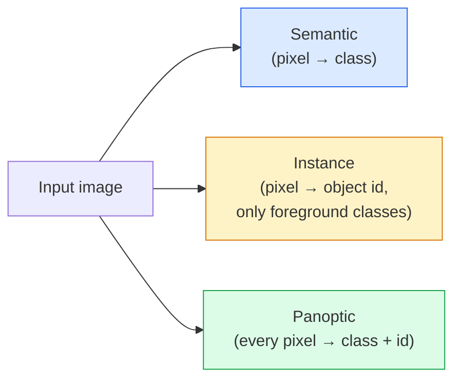
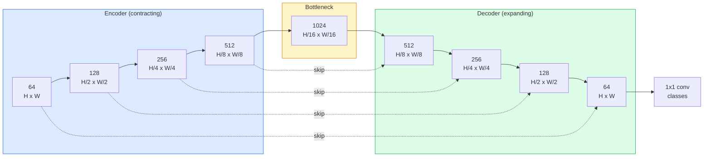

# Semantic Segmentation — U-Net

> Segmentation là phân loại tại mỗi pixel. U-Net thực hiện điều này bằng cách kết hợp một encoder downsampling với một decoder upsampling và nối các skip connection giữa chúng.

**Type:** Build
**Languages:** Python
**Prerequisites:** Phase 4 Lesson 03 (CNNs), Phase 4 Lesson 04 (Image Classification)
**Time:** ~75 phút

## Mục tiêu học tập

- Phân biệt semantic, instance và panoptic segmentation và chọn đúng tác vụ cho một bài toán cụ thể
- Xây dựng U-Net từ đầu bằng PyTorch với các encoder block, một bottleneck, một decoder với transposed convolution và các skip connection
- Triển khai pixel-wise cross-entropy, Dice loss và hàm loss kết hợp (combined loss) - tiêu chuẩn hiện nay cho segmentation trong y tế và công nghiệp
- Đọc các chỉ số IoU và Dice theo từng class và chẩn đoán xem điểm số thấp đến từ việc bỏ sót các vật thể nhỏ, độ chính xác đường biên hay mất cân bằng class

## Vấn đề

Classification xuất ra một nhãn cho mỗi ảnh. Detection xuất ra một vài khung hình (box) cho mỗi ảnh. Segmentation xuất ra một nhãn cho mỗi pixel. Với đầu vào có kích thước `H x W`, đầu ra là một tensor có hình dạng `H x W` (semantic) hoặc `H x W x N_instances` (instance). Đó là hàng triệu dự đoán cho mỗi ảnh, chứ không phải một.

Cấu trúc của segmentation là lý do tại sao nó thúc đẩy hầu hết các sản phẩm thị giác máy tính dự đoán dày đặc (dense-prediction): hình ảnh y tế (mask khối u), xe tự lái (đường, làn đường, vật cản), vệ tinh (dấu chân tòa nhà, ranh giới cây trồng), phân tích tài liệu (vùng bố cục), robot (vùng có thể cầm nắm). Không tác vụ nào trong số đó có thể giải quyết bằng cách đặt một cái khung quanh vật thể; chúng cần hình dáng chính xác (silhouette).

Vấn đề kiến trúc rất dễ nêu ra nhưng không dễ giải quyết: bạn cần mạng lưới nhìn thấy bối cảnh toàn cục của ảnh (đây là loại cảnh gì) và chi tiết pixel cục bộ (chính xác pixel nào là đường, pixel nào là vỉa hè) cùng một lúc. Một CNN tiêu chuẩn nén không gian để lấy bối cảnh, điều này làm mất đi chi tiết. U-Net là thiết kế đạt được cả hai.

## Khái niệm

### Semantic vs instance vs panoptic



- **Semantic** nói rằng "pixel này là đường, pixel kia là xe." Hai chiếc xe cạnh nhau bị gộp thành một khối duy nhất.
- **Instance** nói rằng "pixel này là xe số 3, pixel kia là xe số 5." Bỏ qua các thành phần nền ("stuff" = bầu trời, đường, cỏ).
- **Panoptic** hợp nhất cả hai: mỗi pixel nhận một nhãn class, mỗi instance nhận một id duy nhất, cả stuff và things đều được phân đoạn.

Bài học này bao gồm semantic. Bài học tiếp theo (Mask R-CNN) bao gồm instance.

### Hình dạng của U-Net



Encoder giảm một nửa độ phân giải không gian bốn lần và tăng gấp đôi số kênh. Decoder làm ngược lại: tăng gấp đôi độ phân giải không gian bốn lần và giảm một nửa số kênh. Các skip connection nối các feature của encoder tương ứng với các feature của decoder tại mỗi độ phân giải. Lớp 1x1 conv cuối cùng ánh xạ `64 -> num_classes` ở độ phân giải đầy đủ.

Tại sao skip connection là cần thiết: decoder chỉ nhìn thấy các feature map nhỏ vào thời điểm nó cố gắng xuất ra các dự đoán ở cấp độ pixel. Nếu không có các skip connection, nó không thể định vị các cạnh một cách chính xác vì thông tin đó đã bị nén mất trong encoder. Skip connection cung cấp cho nó các feature map độ phân giải cao mà encoder đã tính toán trên đường đi xuống.

### Transposed vs bilinear upsample

Decoder phải mở rộng các chiều không gian. Có hai lựa chọn:

- **Transposed convolution** (`nn.ConvTranspose2d`) — upsample có thể học được. Mặc định của U-Net truyền thống. Có thể tạo ra các artifact dạng bàn cờ nếu stride và kernel size không chia hết cho nhau.
- **Bilinear upsample + 3x3 conv** — upsample mượt mà theo sau bởi một lớp conv. Ít artifact hơn, ít tham số hơn, hiện là mặc định hiện đại.

Cả hai đều xuất hiện trong thực tế. Đối với U-Net đầu tiên, bilinear an toàn hơn.

### Cross-entropy trên lưới pixel

Đối với semantic segmentation với C class, đầu ra của mô hình là `(N, C, H, W)`. Target là `(N, H, W)` với các ID class số nguyên. Cross-entropy giống hệt trường hợp classification, chỉ là áp dụng tại mỗi vị trí không gian:

```
Loss = mean over (n, h, w) of -log( softmax(logits[n, :, h, w])[target[n, h, w]] )
```

`F.cross_entropy` trong PyTorch xử lý hình dạng này một cách tự nhiên. Không cần reshape.

### Dice loss và tại sao bạn cần nó

Cross-entropy đối xử với mọi pixel như nhau. Điều đó sai khi một class chiếm ưu thế trong khung hình (hình ảnh y tế: 99% nền, 1% khối u). Mạng lưới có thể đạt độ chính xác 99% bằng cách dự đoán nền ở mọi nơi và vẫn vô dụng.

Dice loss giải quyết vấn đề này bằng cách tối ưu hóa trực tiếp sự chồng lấp giữa mask dự đoán và mask thực tế:

```
Dice(p, y) = 2 * sum(p * y) / (sum(p) + sum(y) + epsilon)
Dice_loss = 1 - Dice
```

trong đó `p` là bản đồ xác suất sigmoid/softmax cho một class và `y` là mask ground-truth nhị phân. Loss chỉ bằng 0 khi sự chồng lấp là hoàn hảo. Vì nó dựa trên tỷ lệ, sự mất cân bằng class không còn là vấn đề.

Trong thực tế, hãy sử dụng **combined loss**:

```
L = L_cross_entropy + lambda * L_dice       (lambda ~ 1)
```

Cross-entropy cung cấp gradient ổn định sớm trong quá trình huấn luyện; Dice tập trung vào giai đoạn cuối của quá trình huấn luyện để thực sự khớp với hình dạng mask. Sự kết hợp này là mặc định trong hình ảnh y tế và khó bị đánh bại trên bất kỳ tập dữ liệu mất cân bằng class nào.

### Các chỉ số đánh giá

- **Pixel accuracy** — phần trăm pixel được dự đoán đúng. Rẻ. Bị lỗi trên dữ liệu mất cân bằng vì lý do tương tự như accuracy trong classification.
- **IoU per class** — intersection over union cho mask của mỗi class; trung bình trên các class = mIoU.
- **Dice (F1 on pixels)** — tương tự như IoU; `Dice = 2 * IoU / (1 + IoU)`. Hình ảnh y tế ưu tiên Dice, cộng đồng xe tự lái ưu tiên IoU; chúng có liên quan đơn điệu với nhau.
- **Boundary F1** — đo lường mức độ gần nhau của các đường biên dự đoán so với đường biên ground-truth, phạt cả những thay đổi nhỏ. Quan trọng cho các tác vụ độ chính xác cao như kiểm tra chất bán dẫn.

Hãy báo cáo IoU theo từng class, không chỉ mIoU. Mean IoU che giấu một class ở mức 15% khi chín class khác ở mức 85%.

### Đánh đổi độ phân giải đầu vào

Encoder của U-Net giảm một nửa độ phân giải bốn lần, vì vậy đầu vào phải chia hết cho 16. Hình ảnh y tế thường là 512x512 hoặc 1024x1024. Các crop xe tự lái là 2048x1024. Chi phí bộ nhớ của U-Net tỷ lệ với `H * W * C_max`, và ở 1024x1024 với 1024 kênh bottleneck, quá trình forward pass đã sử dụng hàng gigabyte VRAM.

Hai cách giải quyết tiêu chuẩn:
1. Chia nhỏ đầu vào (Tile) — xử lý các tile 256x256 với sự chồng lấp và ghép lại.
2. Thay thế bottleneck bằng dilated convolution giúp giữ độ phân giải không gian cao hơn nhưng mở rộng trường tiếp nhận (họ DeepLab).

Đối với mô hình đầu tiên, đầu vào 256x256 với U-Net cơ sở 64 kênh huấn luyện thoải mái trên 8 GB VRAM.

```figure
segmentation-flood
```

## Xây dựng

### Bước 1: Encoder block

Hai lớp 3x3 conv với batch norm và ReLU. Lớp conv đầu tiên thay đổi số lượng kênh; lớp thứ hai giữ nguyên.

```python
import torch
import torch.nn as nn
import torch.nn.functional as F

class DoubleConv(nn.Module):
    def __init__(self, in_c, out_c):
        super().__init__()
        self.net = nn.Sequential(
            nn.Conv2d(in_c, out_c, kernel_size=3, padding=1, bias=False),
            nn.BatchNorm2d(out_c),
            nn.ReLU(inplace=True),
            nn.Conv2d(out_c, out_c, kernel_size=3, padding=1, bias=False),
            nn.BatchNorm2d(out_c),
            nn.ReLU(inplace=True),
        )

    def forward(self, x):
        return self.net(x)
```

Block này được sử dụng lại xuyên suốt. `bias=False` vì beta của BN xử lý bias.

### Bước 2: Down và up block

```python
class Down(nn.Module):
    def __init__(self, in_c, out_c):
        super().__init__()
        self.net = nn.Sequential(
            nn.MaxPool2d(2),
            DoubleConv(in_c, out_c),
        )

    def forward(self, x):
        return self.net(x)


class Up(nn.Module):
    def __init__(self, in_c, out_c):
        super().__init__()
        self.up = nn.Upsample(scale_factor=2, mode="bilinear", align_corners=False)
        self.conv = DoubleConv(in_c, out_c)

    def forward(self, x, skip):
        x = self.up(x)
        if x.shape[-2:] != skip.shape[-2:]:
            x = F.interpolate(x, size=skip.shape[-2:], mode="bilinear", align_corners=False)
        x = torch.cat([skip, x], dim=1)
        return self.conv(x)
```

Kiểm tra hình dạng không gian (`shape[-2:]`) xử lý các đầu vào có kích thước không chia hết cho 16; một `F.interpolate` an toàn sẽ căn chỉnh tensor trước khi concat. So sánh toàn bộ hình dạng cũng sẽ kích hoạt khi có sự khác biệt về số lượng kênh, điều này nên là một lỗi lớn, không phải là một phép nội suy thầm lặng.

### Bước 3: U-Net

```python
class UNet(nn.Module):
    def __init__(self, in_channels=3, num_classes=2, base=64):
        super().__init__()
        self.inc = DoubleConv(in_channels, base)
        self.d1 = Down(base, base * 2)
        self.d2 = Down(base * 2, base * 4)
        self.d3 = Down(base * 4, base * 8)
        self.d4 = Down(base * 8, base * 16)
        self.u1 = Up(base * 16 + base * 8, base * 8)
        self.u2 = Up(base * 8 + base * 4, base * 4)
        self.u3 = Up(base * 4 + base * 2, base * 2)
        self.u4 = Up(base * 2 + base, base)
        self.outc = nn.Conv2d(base, num_classes, kernel_size=1)

    def forward(self, x):
        x1 = self.inc(x)
        x2 = self.d1(x1)
        x3 = self.d2(x2)
        x4 = self.d3(x3)
        x5 = self.d4(x4)
        x = self.u1(x5, x4)
        x = self.u2(x, x3)
        x = self.u3(x, x2)
        x = self.u4(x, x1)
        return self.outc(x)

net = UNet(in_channels=3, num_classes=2, base=32)
x = torch.randn(1, 3, 256, 256)
print(f"output: {net(x).shape}")
print(f"params: {sum(p.numel() for p in net.parameters()):,}")
```

Hình dạng đầu ra `(1, 2, 256, 256)` — cùng kích thước không gian với đầu vào, `num_classes` kênh. Khoảng 7.7M tham số tại `base=32`.

### Bước 4: Losses

```python
def dice_loss(logits, targets, num_classes, eps=1e-6):
    probs = F.softmax(logits, dim=1)
    targets_one_hot = F.one_hot(targets, num_classes).permute(0, 3, 1, 2).float()
    dims = (0, 2, 3)
    intersection = (probs * targets_one_hot).sum(dim=dims)
    denom = probs.sum(dim=dims) + targets_one_hot.sum(dim=dims)
    dice = (2 * intersection + eps) / (denom + eps)
    return 1 - dice.mean()


def combined_loss(logits, targets, num_classes, lam=1.0):
    ce = F.cross_entropy(logits, targets)
    dc = dice_loss(logits, targets, num_classes)
    return ce + lam * dc, {"ce": ce.item(), "dice": dc.item()}
```

Dice được tính theo từng class sau đó lấy trung bình (macro Dice). `eps` ngăn chặn chia cho 0 trên các class vắng mặt trong batch.

### Bước 5: Chỉ số IoU

```python
@torch.no_grad()
def iou_per_class(logits, targets, num_classes):
    preds = logits.argmax(dim=1)
    ious = torch.zeros(num_classes)
    for c in range(num_classes):
        pred_c = (preds == c)
        true_c = (targets == c)
        inter = (pred_c & true_c).sum().float()
        union = (pred_c | true_c).sum().float()
        ious[c] = (inter / union) if union > 0 else torch.tensor(float("nan"))
    return ious
```

Trả về một vector có độ dài C. `nan` đánh dấu các class vắng mặt trong batch — không lấy trung bình trên các class đó khi tính mIoU.

### Bước 6: Tập dữ liệu tổng hợp để kiểm chứng end-to-end

Tạo các hình dạng trên nền màu để mạng lưới phải học hình dạng, không phải màu pixel.

```python
import numpy as np
from torch.utils.data import Dataset, DataLoader

def synthetic_segmentation(num_samples=200, size=64, seed=0):
    rng = np.random.default_rng(seed)
    images = np.zeros((num_samples, size, size, 3), dtype=np.float32)
    masks = np.zeros((num_samples, size, size), dtype=np.int64)
    for i in range(num_samples):
        bg = rng.uniform(0, 1, (3,))
        images[i] = bg
        masks[i] = 0
        num_shapes = rng.integers(1, 4)
        for _ in range(num_shapes):
            cls = int(rng.integers(1, 3))
            color = rng.uniform(0, 1, (3,))
            cx, cy = rng.integers(10, size - 10, size=2)
            r = int(rng.integers(4, 12))
            yy, xx = np.meshgrid(np.arange(size), np.arange(size), indexing="ij")
            if cls == 1:
                mask = (xx - cx) ** 2 + (yy - cy) ** 2 < r ** 2
            else:
                mask = (np.abs(xx - cx) < r) & (np.abs(yy - cy) < r)
            images[i][mask] = color
            masks[i][mask] = cls
        images[i] += rng.normal(0, 0.02, images[i].shape)
        images[i] = np.clip(images[i], 0, 1)
    return images, masks


class SegDataset(Dataset):
    def __init__(self, images, masks):
        self.images = images
        self.masks = masks

    def __len__(self):
        return len(self.images)

    def __getitem__(self, i):
        img = torch.from_numpy(self.images[i]).permute(2, 0, 1).float()
        mask = torch.from_numpy(self.masks[i]).long()
        return img, mask
```

Ba class: nền (0), hình tròn (1), hình vuông (2). Mạng lưới phải học cách phân biệt hình dạng.

### Bước 7: Vòng lặp huấn luyện

```python
def train_one_epoch(model, loader, optimizer, device, num_classes):
    model.train()
    loss_sum, total = 0.0, 0
    iou_sum = torch.zeros(num_classes)
    for x, y in loader:
        x, y = x.to(device), y.to(device)
        logits = model(x)
        loss, _ = combined_loss(logits, y, num_classes)
        optimizer.zero_grad()
        loss.backward()
        optimizer.step()
        loss_sum += loss.item() * x.size(0)
        total += x.size(0)
        iou_sum += iou_per_class(logits, y, num_classes).nan_to_num(0)
    return loss_sum / total, iou_sum / len(loader)
```

Chạy vòng lặp này trong 10-30 epoch trên tập dữ liệu tổng hợp và quan sát mIoU vượt qua 0.9 cho các class hình dạng. Lưu ý `nan_to_num(0)` coi các class vắng mặt trong một batch là 0; để có IoU theo từng class chính xác, hãy mask theo sự hiện diện và sử dụng `torch.nanmean` trên các batch tại thời điểm đánh giá thay vì lấy trung bình ở đây.

## Sử dụng

Cho sản xuất, `segmentation_models_pytorch` ("smp") bao bọc mọi kiến trúc segmentation tiêu chuẩn với bất kỳ backbone torchvision hoặc timm nào. Ba dòng code:

```python
import segmentation_models_pytorch as smp

model = smp.Unet(
    encoder_name="resnet34",
    encoder_weights="imagenet",
    in_channels=3,
    classes=3,
)
```

Cũng cần biết cho công việc thực tế:
- **DeepLabV3+** thay thế downsampling dựa trên max-pool bằng dilated conv để bottleneck giữ được độ phân giải; đường biên sắc nét hơn trên dữ liệu vệ tinh và xe tự lái.
- **SegFormer** thay thế conv encoder bằng một transformer phân cấp; SOTA hiện tại trên nhiều benchmark.
- **Mask2Former** / **OneFormer** hợp nhất semantic, instance và panoptic segmentation trong một kiến trúc duy nhất.

Cả ba đều là các thay thế trực tiếp trong `smp` hoặc `transformers` với cùng data loader.

## Triển khai

Bài học này tạo ra:

- `outputs/prompt-segmentation-task-picker.md` — một prompt chọn lựa giữa semantic, instance và panoptic segmentation và đặt tên kiến trúc cho một tác vụ cụ thể.
- `outputs/skill-segmentation-mask-inspector.md` — một kỹ năng báo cáo phân phối class, thống kê mask dự đoán và các class bị dự đoán thiếu hoặc bị mờ đường biên.

## Bài tập

1. **(Dễ)** Triển khai `bce_dice_loss` cho tác vụ binary segmentation (foreground vs background). Kiểm chứng trên tập dữ liệu tổng hợp hai class rằng combined loss hội tụ nhanh hơn so với chỉ dùng BCE khi foreground chiếm 5% số pixel.
2. **(Trung bình)** Thay thế up-block `nn.Upsample + conv` bằng up-block `nn.ConvTranspose2d`. Huấn luyện cả hai trên tập dữ liệu tổng hợp và so sánh mIoU. Quan sát nơi các artifact dạng bàn cờ xuất hiện trong phiên bản transposed-conv.
3. **(Khó)** Lấy một tập dữ liệu segmentation thực tế (Oxford-IIIT Pets, Cityscapes mini split, hoặc một tập con y tế) và huấn luyện U-Net đạt trong khoảng 2 điểm IoU so với tham chiếu `smp.Unet`. Báo cáo IoU theo từng class và xác định class nào hưởng lợi nhiều nhất từ việc thêm Dice vào hàm loss.

## Thuật ngữ chính

| Thuật ngữ | Cách gọi thông thường | Ý nghĩa thực tế |
|------|----------------|----------------------|
| Semantic segmentation | "Gán nhãn mọi pixel" | Phân loại mỗi pixel vào C class; các instance của cùng một class bị gộp lại |
| Instance segmentation | "Gán nhãn mọi vật thể" | Tách biệt các instance riêng biệt của cùng một class; chỉ tập trung vào foreground |
| Panoptic segmentation | "Semantic + instance" | Mỗi pixel nhận một class; mỗi instance của vật thể cũng nhận một id duy nhất |
| Skip connection | "Cầu nối U-Net" | Nối các feature của encoder vào các feature của decoder có độ phân giải tương ứng; bảo toàn chi tiết tần số cao |
| Transposed conv | "Deconvolution" | Upsampling có thể học được; có thể tạo ra artifact dạng bàn cờ |
| Dice loss | "Loss chồng lấp" | 1 - 2|A ∩ B| / (|A| + |B|); tối ưu hóa sự chồng lấp mask trực tiếp và bền vững với mất cân bằng class |
| mIoU | "Mean intersection over union" | IoU trung bình trên các class; chỉ số tiêu chuẩn cộng đồng cho segmentation |
| Boundary F1 | "Độ chính xác đường biên" | Điểm F1 tính toán chỉ trên các pixel đường biên; quan trọng cho các tác vụ yêu cầu độ chính xác cao |

## Đọc thêm

- [U-Net: Convolutional Networks for Biomedical Image Segmentation (Ronneberger et al., 2015)](https://arxiv.org/abs/1505.04597) — bài báo gốc; hình vẽ mà mọi người đều sao chép nằm ở trang 2
- [Fully Convolutional Networks (Long et al., 2015)](https://arxiv.org/abs/1411.4038) — bài báo đầu tiên biến segmentation thành bài toán conv end-to-end
- [segmentation_models_pytorch](https://github.com/qubvel/segmentation_models.pytorch) — tài liệu tham khảo cho segmentation trong sản xuất; mọi kiến trúc tiêu chuẩn cộng với mọi hàm loss tiêu chuẩn
- [Lessons learned from training SOTA segmentation (kaggle.com competitions)](https://www.kaggle.com/code/iafoss/carvana-unet-pytorch) — hướng dẫn về lý do tại sao TTA, pseudo-labeling và trọng số class lại quan trọng trên dữ liệu thực tế