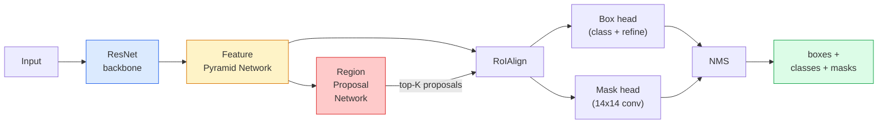

# Instance Segmentation — Mask R-CNN

> Thêm một nhánh mask nhỏ vào bộ dò Faster R-CNN và bạn sẽ có instance segmentation. Phần khó nhất chính là RoIAlign, và nó khó hơn vẻ ngoài của nó rất nhiều.

**Type:** Build + Learn
**Languages:** Python
**Prerequisites:** Phase 4 Lesson 06 (YOLO), Phase 4 Lesson 07 (U-Net)
**Time:** ~75 minutes

## Mục tiêu học tập

- Truy vết kiến trúc Mask R-CNN từ đầu đến cuối: backbone, FPN, RPN, RoIAlign, box head, mask head
- Triển khai RoIAlign từ đầu và giải thích tại sao RoIPool không còn được sử dụng
- Sử dụng mô hình pretrained `maskrcnn_resnet50_fpn_v2` của torchvision cho các instance mask chất lượng sản xuất và đọc đúng định dạng đầu ra của nó
- Fine-tune Mask R-CNN trên một tập dữ liệu nhỏ tùy chỉnh bằng cách thay thế box head và mask head, đồng thời giữ backbone ở trạng thái đóng băng (frozen)

## Vấn đề

Semantic segmentation cung cấp cho bạn một mask cho mỗi lớp. Instance segmentation cung cấp cho bạn một mask cho mỗi đối tượng, ngay cả khi hai đối tượng cùng thuộc một lớp. Việc đếm các cá thể, theo dõi qua các khung hình và đo lường (bounding box của từng viên gạch trên tường, từng tế bào trong ảnh hiển vi) đều đòi hỏi instance segmentation.

Mask R-CNN (He et al., 2017) đã giải quyết vấn đề này bằng cách định hình lại instance segmentation thành detection cộng với một mask. Thiết kế này sạch sẽ đến mức trong 5 năm tiếp theo, hầu như mọi bài báo về instance segmentation đều là một biến thể của Mask R-CNN, và bản triển khai của torchvision vẫn là mặc định cho sản xuất đối với các tập dữ liệu từ nhỏ đến trung bình.

Vấn đề kỹ thuật khó khăn nằm ở việc lấy mẫu (sampling): làm thế nào để cắt một vùng đặc trưng có kích thước cố định từ một hộp đề xuất (proposal box) mà các góc của nó không khớp với ranh giới pixel? Làm sai điều này sẽ khiến mAP giảm đi vài phần mười ở khắp mọi nơi. RoIAlign chính là câu trả lời.

## Khái niệm

### Kiến trúc



Năm thành phần cần hiểu:

1. **Backbone** — ResNet-50 hoặc ResNet-101 được huấn luyện trên ImageNet. Tạo ra một hệ thống phân cấp các feature map ở các bước stride 4, 8, 16, 32.
2. **FPN (Feature Pyramid Network)** — các kết nối top-down + lateral cung cấp cho mỗi cấp độ C kênh các đặc trưng giàu ngữ nghĩa. Detection sẽ truy vấn cấp độ FPN phù hợp với kích thước đối tượng.
3. **RPN (Region Proposal Network)** — một conv head nhỏ, tại mỗi vị trí anchor, dự đoán "có đối tượng ở đây không?" và "làm thế nào để tinh chỉnh hộp?". Tạo ra khoảng 1000 đề xuất mỗi ảnh.
4. **RoIAlign** — lấy mẫu một bản vá đặc trưng kích thước cố định (ví dụ: 7x7) từ bất kỳ hộp nào trên bất kỳ cấp độ FPN nào. Lấy mẫu song tuyến tính (bilinear sampling), không lượng tử hóa.
5. **Heads** — box head hai lớp giúp tinh chỉnh hộp và chọn lớp, cộng với một conv head nhỏ xuất ra mask nhị phân `28x28` cho mỗi đề xuất.

### Tại sao lại là RoIAlign, không phải RoIPool

Fast R-CNN ban đầu sử dụng RoIPool, chia hộp đề xuất thành một lưới, lấy giá trị đặc trưng lớn nhất trong mỗi ô và làm tròn tất cả tọa độ thành số nguyên. Việc làm tròn đó làm lệch feature map so với tọa độ pixel đầu vào lên đến một pixel feature-map đầy đủ — điều này nhỏ trên ảnh 224x224, nhưng lại là thảm họa khi feature map có stride 32.

```
RoIPool:
  box (34.7, 51.3, 98.2, 142.9)
  round -> (34, 51, 98, 142)
  split grid -> round each cell boundary
  misalignment accumulates at every step

RoIAlign:
  box (34.7, 51.3, 98.2, 142.9)
  sample at exact float coordinates using bilinear interpolation
  no rounding anywhere
```

RoIAlign giúp tăng mask AP thêm 3-4 điểm trên COCO một cách miễn phí. Mọi bộ dò quan tâm đến việc định vị hiện nay đều sử dụng nó — YOLOv7 seg, RT-DETR, Mask2Former đều như vậy.

### RPN trong một đoạn văn

Tại mỗi vị trí của feature map, đặt K hộp anchor với các kích thước và hình dạng khác nhau. Dự đoán điểm số objectness cho mỗi anchor và một độ lệch hồi quy để biến anchor thành một hộp khớp hơn. Giữ lại khoảng 1.000 hộp hàng đầu theo điểm số, áp dụng NMS ở IoU 0.7 và chuyển các hộp còn lại cho các head. RPN được huấn luyện với hàm mất mát (loss) riêng — cấu trúc tương tự như YOLO loss từ Bài 6, chỉ với hai lớp (có đối tượng / không có đối tượng).

### Mask head

Đối với mỗi đề xuất (sau RoIAlign), mask head là một FCN nhỏ: bốn lớp conv 3x3, một lớp deconv 2x, một lớp conv 1x1 cuối cùng tạo ra `num_classes` kênh đầu ra ở độ phân giải `28x28`. Chỉ kênh tương ứng với lớp được dự đoán mới được giữ lại; các kênh khác bị bỏ qua. Điều này tách biệt việc dự đoán mask khỏi việc phân loại.

Upsample mask 28x28 về kích thước pixel gốc của đề xuất để tạo ra mask nhị phân cuối cùng.

### Các hàm mất mát (Losses)

Mask R-CNN có bốn hàm mất mát cộng lại:

```
L = L_rpn_cls + L_rpn_box + L_box_cls + L_box_reg + L_mask
```

- `L_rpn_cls`, `L_rpn_box` — objectness + box regression cho các đề xuất của RPN.
- `L_box_cls` — cross-entropy trên (C+1) lớp (bao gồm cả background) trên bộ phân loại của head.
- `L_box_reg` — smooth L1 trên phần tinh chỉnh hộp của head.
- `L_mask` — binary cross-entropy trên mỗi pixel cho đầu ra mask 28x28.

Mỗi hàm mất mát có trọng số mặc định riêng; bản triển khai của torchvision hiển thị chúng dưới dạng các đối số constructor.

### Định dạng đầu ra

`torchvision.models.detection.maskrcnn_resnet50_fpn_v2` trả về một danh sách các dict, mỗi ảnh một dict:

```
{
    "boxes":  (N, 4) in (x1, y1, x2, y2) pixel coordinates,
    "labels": (N,) class IDs, 0 = background so indices are 1-based,
    "scores": (N,) confidence scores,
    "masks":  (N, 1, H, W) float masks in [0, 1] — threshold at 0.5 for binary,
}
```

Mask đã có độ phân giải đầy đủ của ảnh. Đầu ra 28x28 của head đã được upsample nội bộ.

```figure
cv3-roialign-sampling
```

## Xây dựng

### Bước 1: RoIAlign từ đầu

Đây là thành phần duy nhất của Mask R-CNN dễ hiểu dưới dạng mã nguồn hơn là văn bản.

```python
import torch
import torch.nn.functional as F

def roi_align_single(feature, box, output_size=7, spatial_scale=1 / 16.0):
    """
    feature: (C, H, W) single-image feature map
    box: (x1, y1, x2, y2) in original image pixel coordinates
    output_size: side of the output grid (7 for box head, 14 for mask head)
    spatial_scale: reciprocal of the feature map stride
    """
    C, H, W = feature.shape
    x1, y1, x2, y2 = [c * spatial_scale - 0.5 for c in box]
    bin_w = (x2 - x1) / output_size
    bin_h = (y2 - y1) / output_size

    grid_y = torch.linspace(y1 + bin_h / 2, y2 - bin_h / 2, output_size)
    grid_x = torch.linspace(x1 + bin_w / 2, x2 - bin_w / 2, output_size)
    yy, xx = torch.meshgrid(grid_y, grid_x, indexing="ij")

    gx = 2 * (xx + 0.5) / W - 1
    gy = 2 * (yy + 0.5) / H - 1
    grid = torch.stack([gx, gy], dim=-1).unsqueeze(0)
    sampled = F.grid_sample(feature.unsqueeze(0), grid, mode="bilinear",
                            align_corners=False)
    return sampled.squeeze(0)
```

Mỗi con số đều ở vị trí được lấy mẫu song tuyến tính. Không làm tròn, không lượng tử hóa, không mất gradient.

### Bước 2: So sánh với RoIAlign của torchvision

```python
from torchvision.ops import roi_align

feature = torch.randn(1, 16, 50, 50)
boxes = torch.tensor([[0, 10, 20, 100, 90]], dtype=torch.float32)  # (batch_idx, x1, y1, x2, y2)

ours = roi_align_single(feature[0], boxes[0, 1:].tolist(), output_size=7, spatial_scale=1/4)
theirs = roi_align(feature, boxes, output_size=(7, 7), spatial_scale=1/4, sampling_ratio=1, aligned=True)[0]

print(f"shape ours:   {tuple(ours.shape)}")
print(f"shape theirs: {tuple(theirs.shape)}")
print(f"max|diff|:    {(ours - theirs).abs().max().item():.3e}")
```

Với `sampling_ratio=1` và `aligned=True`, hai kết quả khớp nhau trong phạm vi `1e-5`.

### Bước 3: Tải Mask R-CNN pretrained

```python
import torch
from torchvision.models.detection import maskrcnn_resnet50_fpn_v2, MaskRCNN_ResNet50_FPN_V2_Weights

model = maskrcnn_resnet50_fpn_v2(weights=MaskRCNN_ResNet50_FPN_V2_Weights.DEFAULT)
model.eval()
print(f"params: {sum(p.numel() for p in model.parameters()):,}")
print(f"classes (including background): {len(model.roi_heads.box_predictor.cls_score.out_features * [0])}")
```

46 triệu tham số, 91 lớp (COCO). Lớp đầu tiên (id 0) là background; mọi thứ mô hình thực sự phát hiện bắt đầu từ id 1.

### Bước 4: Chạy inference

```python
with torch.no_grad():
    x = torch.randn(3, 400, 600)
    predictions = model([x])
p = predictions[0]
print(f"boxes:  {tuple(p['boxes'].shape)}")
print(f"labels: {tuple(p['labels'].shape)}")
print(f"scores: {tuple(p['scores'].shape)}")
print(f"masks:  {tuple(p['masks'].shape)}")
```

Tensor mask có hình dạng `(N, 1, H, W)`. Ngưỡng tại 0.5 để có mask nhị phân cho mỗi đối tượng:

```python
binary_masks = (p['masks'] > 0.5).squeeze(1)  # (N, H, W) boolean
```

### Bước 5: Thay thế các head cho số lượng lớp tùy chỉnh

Công thức fine-tune phổ biến: tái sử dụng backbone, FPN và RPN; thay thế hai classifier head.

```python
from torchvision.models.detection.faster_rcnn import FastRCNNPredictor
from torchvision.models.detection.mask_rcnn import MaskRCNNPredictor

def build_custom_maskrcnn(num_classes):
    model = maskrcnn_resnet50_fpn_v2(weights=MaskRCNN_ResNet50_FPN_V2_Weights.DEFAULT)
    in_features = model.roi_heads.box_predictor.cls_score.in_features
    model.roi_heads.box_predictor = FastRCNNPredictor(in_features, num_classes)
    in_features_mask = model.roi_heads.mask_predictor.conv5_mask.in_channels
    hidden_layer = 256
    model.roi_heads.mask_predictor = MaskRCNNPredictor(in_features_mask, hidden_layer, num_classes)
    return model

custom = build_custom_maskrcnn(num_classes=5)
print(f"custom cls_score.out_features: {custom.roi_heads.box_predictor.cls_score.out_features}")
```

`num_classes` phải bao gồm lớp background, vì vậy một tập dữ liệu với 4 lớp đối tượng sẽ sử dụng `num_classes=5`.

### Bước 6: Đóng băng những phần không cần huấn luyện

Trên các tập dữ liệu nhỏ, hãy đóng băng backbone và FPN. Chỉ có RPN objectness + regression và hai head là học.

```python
def freeze_backbone_and_fpn(model):
    # torchvision Mask R-CNN packs the FPN inside `model.backbone` (as
    # `model.backbone.fpn`), so iterating `model.backbone.parameters()` covers
    # both the ResNet feature layers and the FPN lateral/output convs.
    for p in model.backbone.parameters():
        p.requires_grad = False
    return model

custom = freeze_backbone_and_fpn(custom)
trainable = sum(p.numel() for p in custom.parameters() if p.requires_grad)
print(f"trainable after freeze: {trainable:,}")
```

Trên các tập dữ liệu 500 ảnh, đây là sự khác biệt giữa việc hội tụ và overfitting.

## Sử dụng

Vòng lặp huấn luyện đầy đủ cho Mask R-CNN trong torchvision chỉ dài 40 dòng và không thay đổi đáng kể giữa các tác vụ — chỉ cần thay đổi tập dữ liệu và chạy.

```python
def train_step(model, images, targets, optimizer):
    model.train()
    loss_dict = model(images, targets)
    losses = sum(loss for loss in loss_dict.values())
    optimizer.zero_grad()
    losses.backward()
    optimizer.step()
    return {k: v.item() for k, v in loss_dict.items()}
```

Danh sách `targets` phải có các dict cho mỗi ảnh với `boxes`, `labels`, và `masks` (dưới dạng các tensor nhị phân `(num_instances, H, W)`). Mô hình trả về một dict gồm bốn hàm mất mát trong quá trình huấn luyện và một danh sách các dự đoán trong quá trình đánh giá, được khóa bởi `model.training`.

Bộ đánh giá `pycocotools` tạo ra mAP@IoU=0.5:0.95 cho cả box và mask; bạn cần cả hai con số để biết liệu box head hay mask head mới là nút thắt cổ chai.

## Triển khai

Bài học này tạo ra:

- `outputs/prompt-instance-vs-semantic-router.md` — một prompt đặt ra ba câu hỏi và chọn instance vs semantic vs panoptic cộng với mô hình chính xác để bắt đầu.
- `outputs/skill-mask-rcnn-head-swapper.md` — một kỹ năng tạo ra 10 dòng mã để thay thế các head trên bất kỳ mô hình detection nào của torchvision, dựa trên `num_classes` mới.

## Bài tập

1. **(Dễ)** Xác minh RoIAlign của bạn so với `torchvision.ops.roi_align` trên 100 hộp ngẫu nhiên. Báo cáo sai số tuyệt đối tối đa. Ngoài ra, hãy chạy RoIPool (hành vi trước năm 2017) và cho thấy nó lệch khoảng 1-2 pixel feature-map trên các hộp gần biên.
2. **(Trung bình)** Fine-tune `maskrcnn_resnet50_fpn_v2` trên tập dữ liệu tùy chỉnh 50 ảnh (bất kỳ hai lớp nào: bóng bay, cá, ổ gà, logo). Đóng băng backbone, huấn luyện trong 20 epoch, báo cáo mask AP@0.5.
3. **(Khó)** Thay thế mask head của Mask R-CNN bằng một head dự đoán ở 56x56 thay vì 28x28. Đo mAP@IoU=0.75 trước và sau khi thay đổi. Giải thích tại sao mức tăng (hoặc thiếu mức tăng) lại phù hợp với sự đánh đổi giữa độ chính xác ranh giới / bộ nhớ.

## Thuật ngữ chính

| Thuật ngữ | Cách gọi thông thường | Ý nghĩa thực tế |
|------|----------------|----------------------|
| Mask R-CNN | "Detection cộng mask" | Faster R-CNN + một FCN head nhỏ dự đoán mask 28x28 cho mỗi đề xuất mỗi lớp |
| FPN | "Feature pyramid" | Các kết nối top-down + lateral cung cấp cho mỗi cấp độ stride C kênh các đặc trưng giàu ngữ nghĩa |
| RPN | "Region proposer" | Một conv head nhỏ tạo ra khoảng 1000 đề xuất có/không có đối tượng mỗi ảnh |
| RoIAlign | "Cắt không làm tròn" | Lấy mẫu song tuyến tính một lưới đặc trưng kích thước cố định từ bất kỳ hộp tọa độ float nào |
| RoIPool | "Cắt trước 2017" | Cùng mục đích với RoIAlign nhưng làm tròn tọa độ hộp; đã lỗi thời |
| Mask AP | "Instance mAP" | Average precision được tính bằng mask IoU thay vì box IoU; thước đo instance segmentation của COCO |
| Binary mask head | "Mask theo lớp" | Dự đoán một mask nhị phân cho mỗi lớp đối với mỗi đề xuất; chỉ giữ lại kênh của lớp được dự đoán |
| Background class | "Lớp 0" | Lớp "không có đối tượng"; chỉ số cho các lớp thực bắt đầu từ 1 |

## Đọc thêm

- [Mask R-CNN (He et al., 2017)](https://arxiv.org/abs/1703.06870) — bài báo gốc; phần 3 về RoIAlign là phần quan trọng cần đọc
- [FPN: Feature Pyramid Networks (Lin et al., 2017)](https://arxiv.org/abs/1612.03144) — bài báo về FPN; mọi bộ dò hiện đại đều sử dụng nó
- [Hướng dẫn Mask R-CNN của torchvision](https://pytorch.org/tutorials/intermediate/torchvision_tutorial.html) — tài liệu tham khảo cho vòng lặp fine-tuning
- [Detectron2 model zoo](https://github.com/facebookresearch/detectron2/blob/main/MODEL_ZOO.md) — các bản triển khai sản xuất với trọng số đã được huấn luyện cho gần như mọi biến thể detection và segmentation