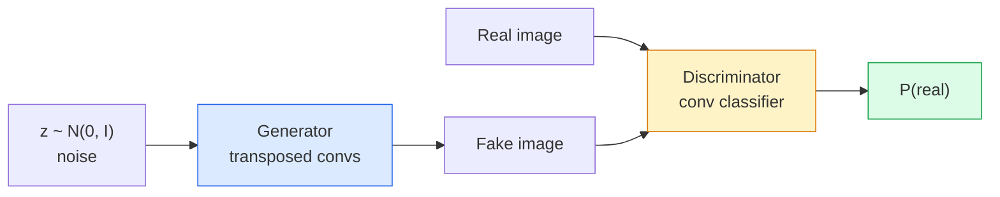
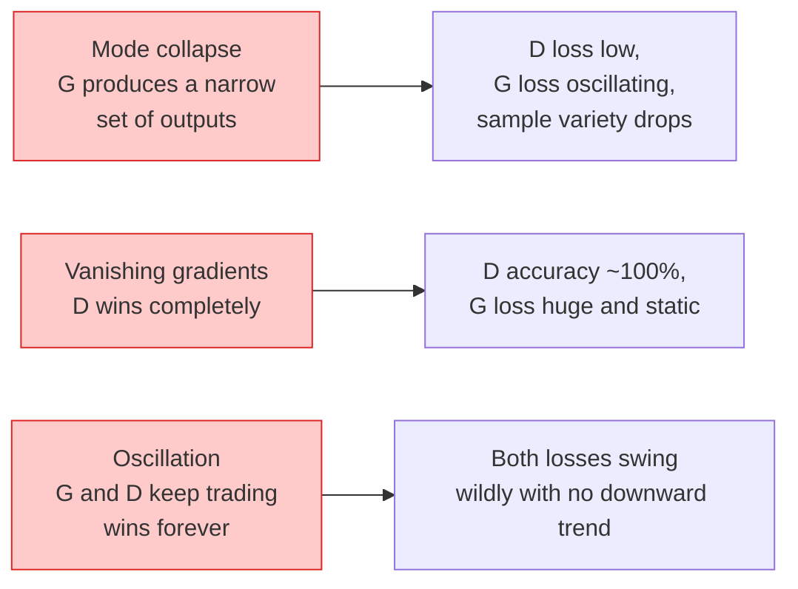

# Image Generation — GANs

> Một GAN là hai mạng thần kinh trong một trò chơi cố định. Một mạng vẽ, một mạng phê bình. Chúng cùng nhau tiến bộ cho đến khi các bức vẽ đánh lừa được người phê bình.

**Type:** Build
**Languages:** Python
**Prerequisites:** Phase 4 Lesson 03 (CNNs), Phase 3 Lesson 06 (Optimizers), Phase 3 Lesson 07 (Regularization)
**Time:** ~75 phút

## Mục tiêu học tập

- Giải thích trò chơi minimax giữa generator và discriminator và lý do tại sao trạng thái cân bằng tương ứng với p_model = p_data
- Triển khai DCGAN trong PyTorch và tạo ra các hình ảnh tổng hợp 32x32 mạch lạc trong dưới 60 dòng mã
- Ổn định quá trình huấn luyện GAN với ba thủ thuật tiêu chuẩn: non-saturating loss, spectral norm, TTUR (two-timescale update rule)
- Đọc các đường cong huấn luyện để phân biệt giữa hội tụ lành mạnh với mode collapse, dao động (oscillation) và việc discriminator thắng hoàn toàn

## Vấn đề

Phân loại (Classification) dạy cho một mạng cách ánh xạ hình ảnh sang nhãn. Tạo sinh (Generation) đảo ngược vấn đề này: lấy mẫu các hình ảnh mới trông như thể chúng đến từ cùng một phân phối. Không có đầu ra "đúng" để bạn so sánh (diff); chỉ có một phân phối mà bạn muốn bắt chước.

Các hàm mất mát tiêu chuẩn (MSE, cross-entropy) không thể đo lường được "liệu mẫu này có đến từ phân phối thực hay không". Việc giảm thiểu sai số trên mỗi pixel tạo ra các hình ảnh trung bình bị mờ, không phải các mẫu thực tế. Bước đột phá là học hàm mất mát: huấn luyện một mạng thứ hai với nhiệm vụ phân biệt thật/giả, và sử dụng đánh giá của nó để thúc đẩy generator.

GANs (Goodfellow và cộng sự, 2014) đã định nghĩa khung làm việc đó. Đến năm 2018, StyleGAN đã tạo ra những khuôn mặt 1024x1024 không thể phân biệt được với ảnh chụp. Các mô hình Diffusion kể từ đó đã chiếm ngôi vương về chất lượng và khả năng kiểm soát, nhưng mọi thủ thuật giúp diffusion trở nên thực tế — các lựa chọn chuẩn hóa, không gian tiềm ẩn (latent spaces), feature losses — đều được hiểu lần đầu tiên trên GANs.

## Khái niệm

### Hai mạng thần kinh



**Generator** G nhận một vector nhiễu `z` và xuất ra một hình ảnh. **Discriminator** D nhận một hình ảnh và xuất ra một giá trị vô hướng duy nhất: xác suất hình ảnh đó là thật.

### Trò chơi

G muốn D sai. D muốn đúng. Về mặt hình thức:

```
min_G max_D  E_x[log D(x)] + E_z[log(1 - D(G(z)))]
```

Đọc từ phải sang trái: D đang tối đa hóa độ chính xác trên các hình ảnh thật (`log D(real)`) và giả (`log (1 - D(fake))`). G đang tối thiểu hóa độ chính xác của D trên các hình ảnh giả — nó muốn `D(G(z))` cao.

Goodfellow đã chứng minh rằng minimax này có một trạng thái cân bằng toàn cục nơi `p_G = p_data`, D xuất ra 0.5 ở mọi nơi, và Jensen-Shannon divergence giữa phân phối được tạo ra và phân phối thực bằng 0. Phần khó là đạt được trạng thái đó.

### Non-saturating loss

Dạng trên không ổn định về mặt số học. Đầu quá trình huấn luyện, `D(G(z))` gần bằng 0 cho mọi hình ảnh giả, vì vậy `log(1 - D(G(z)))` có gradient biến mất đối với G. Cách khắc phục: đảo ngược hàm mất mát của G.

```
L_D = -E_x[log D(x)] - E_z[log(1 - D(G(z)))]
L_G = -E_z[log D(G(z))]                          # non-saturating
```

Bây giờ khi `D(G(z))` gần bằng 0, hàm mất mát của G lớn và gradient của nó mang tính thông tin. Mọi GAN hiện đại đều huấn luyện với biến thể này.

### Các quy tắc kiến trúc DCGAN

Radford, Metz, Chintala (2015) đã chắt lọc nhiều năm thử nghiệm thất bại thành năm quy tắc giúp việc huấn luyện GAN ổn định:

1. Thay thế pooling bằng strided convs (cho cả hai mạng).
2. Sử dụng batch norm trong cả generator và discriminator, ngoại trừ đầu ra của G và đầu vào của D.
3. Loại bỏ các lớp fully connected trên các kiến trúc sâu hơn.
4. G sử dụng ReLU trên tất cả các lớp ngoại trừ đầu ra (tanh cho đầu ra trong khoảng [-1, 1]).
5. D sử dụng LeakyReLU (negative_slope=0.2) trên tất cả các lớp.

Mọi GAN dựa trên conv hiện đại (StyleGAN, BigGAN, GigaGAN) vẫn bắt đầu từ các quy tắc này và thay thế từng phần một.

### Các chế độ thất bại và dấu hiệu nhận biết



- **Mode collapse**: G tìm thấy một hình ảnh đánh lừa được D và chỉ tạo ra hình ảnh đó. Khắc phục: thêm minibatch discrimination, spectral norm, hoặc label-conditioning.
- **Discriminator thắng**: D trở nên quá mạnh quá nhanh, gradient của G biến mất. Khắc phục: D nhỏ hơn, tốc độ học của D thấp hơn, hoặc áp dụng label smoothing trên các nhãn thật.
- **Dao động (Oscillation)**: hai mạng thay phiên nhau thắng mà không bao giờ tiến gần đến trạng thái cân bằng. Khắc phục: TTUR (D học nhanh hơn G theo hệ số 2-4), hoặc chuyển sang Wasserstein loss.

### Đánh giá

GAN không có ground truth, vậy làm thế nào để biết chúng đang hoạt động?

- **Kiểm tra mẫu (Sample inspection)** — chỉ cần nhìn vào 64 mẫu ở cuối mỗi epoch. Không thể thương lượng.
- **FID (Fréchet Inception Distance)** — khoảng cách giữa các phân phối đặc trưng Inception-v3 của tập thực và tập được tạo ra. Càng thấp càng tốt. Tiêu chuẩn cộng đồng.
- **Inception Score** — cũ hơn, kém ổn định hơn; ưu tiên FID.
- **Precision/Recall cho các mô hình tạo sinh** — đo lường chất lượng (precision) và độ bao phủ (recall) riêng biệt. Nhiều thông tin hơn so với chỉ dùng FID.

Đối với một lần chạy dữ liệu tổng hợp nhỏ, kiểm tra mẫu là đủ.

```figure
cv-gan-image
```

## Xây dựng

### Bước 1: Generator

Một generator DCGAN nhỏ nhận nhiễu 64-dim và tạo ra hình ảnh 32x32.

```python
import torch
import torch.nn as nn

class Generator(nn.Module):
    def __init__(self, z_dim=64, img_channels=3, feat=64):
        super().__init__()
        self.net = nn.Sequential(
            nn.ConvTranspose2d(z_dim, feat * 4, kernel_size=4, stride=1, padding=0, bias=False),
            nn.BatchNorm2d(feat * 4),
            nn.ReLU(inplace=True),
            nn.ConvTranspose2d(feat * 4, feat * 2, kernel_size=4, stride=2, padding=1, bias=False),
            nn.BatchNorm2d(feat * 2),
            nn.ReLU(inplace=True),
            nn.ConvTranspose2d(feat * 2, feat, kernel_size=4, stride=2, padding=1, bias=False),
            nn.BatchNorm2d(feat),
            nn.ReLU(inplace=True),
            nn.ConvTranspose2d(feat, img_channels, kernel_size=4, stride=2, padding=1, bias=False),
            nn.Tanh(),
        )

    def forward(self, z):
        return self.net(z.view(z.size(0), -1, 1, 1))
```

Bốn lớp transposed convs, mỗi lớp với `kernel_size=4, stride=2, padding=1` để chúng tăng gấp đôi kích thước không gian một cách sạch sẽ. Kích hoạt đầu ra trong khoảng [-1, 1] thông qua tanh.

### Bước 2: Discriminator

Bản sao của generator. LeakyReLU, strided convs, kết thúc bằng một logit vô hướng.

```python
class Discriminator(nn.Module):
    def __init__(self, img_channels=3, feat=64):
        super().__init__()
        self.net = nn.Sequential(
            nn.Conv2d(img_channels, feat, kernel_size=4, stride=2, padding=1),
            nn.LeakyReLU(0.2, inplace=True),
            nn.Conv2d(feat, feat * 2, kernel_size=4, stride=2, padding=1, bias=False),
            nn.BatchNorm2d(feat * 2),
            nn.LeakyReLU(0.2, inplace=True),
            nn.Conv2d(feat * 2, feat * 4, kernel_size=4, stride=2, padding=1, bias=False),
            nn.BatchNorm2d(feat * 4),
            nn.LeakyReLU(0.2, inplace=True),
            nn.Conv2d(feat * 4, 1, kernel_size=4, stride=1, padding=0),
        )

    def forward(self, x):
        return self.net(x).view(-1)
```

Lớp conv cuối cùng giảm bản đồ đặc trưng `4x4` xuống `1x1`. Đầu ra là một giá trị vô hướng duy nhất cho mỗi hình ảnh; chỉ áp dụng sigmoid trong quá trình tính toán hàm mất mát.

### Bước 3: Bước huấn luyện

Luân phiên: cập nhật D một lần, sau đó G một lần, mỗi batch.

```python
import torch.nn.functional as F

def train_step(G, D, real, z, opt_g, opt_d, device):
    real = real.to(device)
    bs = real.size(0)

    # D step
    opt_d.zero_grad()
    d_real = D(real)
    d_fake = D(G(z).detach())
    loss_d = (F.binary_cross_entropy_with_logits(d_real, torch.ones_like(d_real))
              + F.binary_cross_entropy_with_logits(d_fake, torch.zeros_like(d_fake)))
    loss_d.backward()
    opt_d.step()

    # G step
    opt_g.zero_grad()
    d_fake = D(G(z))
    loss_g = F.binary_cross_entropy_with_logits(d_fake, torch.ones_like(d_fake))
    loss_g.backward()
    opt_g.step()

    return loss_d.item(), loss_g.item()
```

`G(z).detach()` trong bước D là rất quan trọng: chúng ta không muốn gradient chảy vào G trong quá trình cập nhật của nó. Quên điều đó là lỗi kinh điển của người mới bắt đầu.

### Bước 4: Vòng lặp huấn luyện đầy đủ trên các hình dạng tổng hợp

```python
from torch.utils.data import DataLoader, TensorDataset
import numpy as np

def synthetic_images(num=2000, size=32, seed=0):
    rng = np.random.default_rng(seed)
    imgs = np.zeros((num, 3, size, size), dtype=np.float32) - 1.0
    for i in range(num):
        r = rng.uniform(6, 12)
        cx, cy = rng.uniform(r, size - r, size=2)
        yy, xx = np.meshgrid(np.arange(size), np.arange(size), indexing="ij")
        mask = (xx - cx) ** 2 + (yy - cy) ** 2 < r ** 2
        color = rng.uniform(-0.5, 1.0, size=3)
        for c in range(3):
            imgs[i, c][mask] = color[c]
    return torch.from_numpy(imgs)

device = "cuda" if torch.cuda.is_available() else "cpu"
data = synthetic_images()
loader = DataLoader(TensorDataset(data), batch_size=64, shuffle=True)

G = Generator(z_dim=64, img_channels=3, feat=32).to(device)
D = Discriminator(img_channels=3, feat=32).to(device)
opt_g = torch.optim.Adam(G.parameters(), lr=2e-4, betas=(0.5, 0.999))
opt_d = torch.optim.Adam(D.parameters(), lr=2e-4, betas=(0.5, 0.999))

for epoch in range(10):
    for (batch,) in loader:
        z = torch.randn(batch.size(0), 64, device=device)
        ld, lg = train_step(G, D, batch, z, opt_g, opt_d, device)
    print(f"epoch {epoch}  D {ld:.3f}  G {lg:.3f}")
```

`Adam(lr=2e-4, betas=(0.5, 0.999))` là mặc định của DCGAN — beta1 thấp giúp thuật toán momentum không làm ổn định quá mức trò chơi đối kháng.

### Bước 5: Lấy mẫu

```python
@torch.no_grad()
def sample(G, n=16, z_dim=64, device="cpu"):
    G.eval()
    z = torch.randn(n, z_dim, device=device)
    imgs = G(z)
    imgs = (imgs + 1) / 2
    return imgs.clamp(0, 1)
```

Luôn chuyển sang chế độ eval trước khi lấy mẫu. Đối với DCGAN, điều này quan trọng vì các số liệu thống kê chạy (running stats) của batch norm được sử dụng thay vì số liệu thống kê của batch hiện tại.

### Bước 6: Spectral normalisation

Một sự thay thế trực tiếp cho BN trong discriminator đảm bảo mạng là 1-Lipschitz. Khắc phục hầu hết các lỗi "D thắng quá mạnh".

```python
from torch.nn.utils import spectral_norm

def build_sn_discriminator(img_channels=3, feat=64):
    return nn.Sequential(
        spectral_norm(nn.Conv2d(img_channels, feat, 4, 2, 1)),
        nn.LeakyReLU(0.2, inplace=True),
        spectral_norm(nn.Conv2d(feat, feat * 2, 4, 2, 1)),
        nn.LeakyReLU(0.2, inplace=True),
        spectral_norm(nn.Conv2d(feat * 2, feat * 4, 4, 2, 1)),
        nn.LeakyReLU(0.2, inplace=True),
        spectral_norm(nn.Conv2d(feat * 4, 1, 4, 1, 0)),
    )
```

Thay thế `Discriminator` bằng `build_sn_discriminator()` và bạn thường không cần thủ thuật TTUR. Spectral norm là nâng cấp độ bền đơn giản nhất mà bạn có thể áp dụng.

## Sử dụng

Để tạo sinh nghiêm túc, hãy sử dụng các trọng số đã huấn luyện trước hoặc chuyển sang diffusion. Hai thư viện tiêu chuẩn:

- `torch_fidelity` tính toán FID / IS trên generator của bạn mà không cần viết mã đánh giá tùy chỉnh.
- `pytorch-gan-zoo` (cũ) và `StudioGAN` cung cấp các triển khai đã được kiểm thử của DCGAN, WGAN-GP, SN-GAN, StyleGAN và BigGAN.

Vào năm 2026, GAN vẫn là lựa chọn tốt nhất cho: tạo hình ảnh thời gian thực (độ trễ <10 ms), chuyển đổi phong cách (style transfer), dịch hình ảnh sang hình ảnh với khả năng kiểm soát chính xác (Pix2Pix, CycleGAN). Diffusion thắng về độ chân thực ảnh và điều kiện văn bản.

## Triển khai

Bài học này tạo ra:

- `outputs/prompt-gan-training-triage.md` — một prompt đọc mô tả đường cong huấn luyện và chọn chế độ thất bại (mode collapse, D-wins, oscillation) cộng với bản sửa lỗi được đề xuất duy nhất.
- `outputs/skill-dcgan-scaffold.md` — một kỹ năng viết khung DCGAN từ `z_dim`, mục tiêu `image_size`, và `num_channels`, bao gồm vòng lặp huấn luyện và trình lưu mẫu.

## Bài tập

1. **(Dễ)** Huấn luyện DCGAN ở trên trên tập dữ liệu hình tròn tổng hợp và lưu lưới 16 mẫu ở cuối mỗi epoch. Đến epoch nào thì các hình tròn được tạo ra trở nên rõ ràng là hình tròn?
2. **(Trung bình)** Thay thế batch norm của discriminator bằng spectral norm. Huấn luyện cả hai phiên bản song song. Phiên bản nào hội tụ nhanh hơn? Phiên bản nào có phương sai thấp hơn trên ba hạt giống (seeds) khác nhau?
3. **(Khó)** Triển khai một DCGAN có điều kiện (conditional): đưa nhãn lớp vào cả G và D (nối one-hot vào nhiễu trong G, nối kênh nhúng lớp trong D). Huấn luyện trên tập dữ liệu "hình tròn vs hình vuông" tổng hợp từ bài 7 và chứng minh rằng việc điều kiện hóa lớp hoạt động bằng cách lấy mẫu với các nhãn cụ thể.

## Thuật ngữ chính

| Thuật ngữ | Cách gọi thông thường | Ý nghĩa thực tế |
|------|----------------|----------------------|
| Generator (G) | "Mạng vẽ đồ vật" | Ánh xạ nhiễu sang hình ảnh; được huấn luyện để đánh lừa discriminator |
| Discriminator (D) | "Người phê bình" | Bộ phân loại nhị phân; được huấn luyện để phân biệt ảnh thật và ảnh tạo ra |
| Minimax | "Trò chơi" | min trên G, max trên D của hàm mất mát đối kháng; trạng thái cân bằng là p_G = p_data |
| Non-saturating loss | "Phiên bản ổn định về số học" | Hàm mất mát của G là -log(D(G(z))) thay vì log(1 - D(G(z))) để tránh gradient biến mất sớm trong quá trình huấn luyện |
| Mode collapse | "Generator chỉ tạo một thứ" | G chỉ tạo ra một tập con nhỏ của phân phối dữ liệu; khắc phục bằng SN, minibatch discrimination, hoặc batch lớn hơn |
| TTUR | "Hai tốc độ học" | D học nhanh hơn G, thường theo hệ số 2-4; ổn định quá trình huấn luyện |
| Spectral norm | "Lớp 1-Lipschitz" | Một chuẩn hóa trọng số giới hạn hằng số Lipschitz của mỗi lớp; ngăn D trở nên quá dốc một cách tùy ý |
| FID | "Fréchet Inception Distance" | Khoảng cách giữa các phân phối đặc trưng Inception-v3 của tập thực và tập được tạo ra; thước đo đánh giá tiêu chuẩn |

## Đọc thêm

- [Generative Adversarial Networks (Goodfellow và cộng sự, 2014)](https://arxiv.org/abs/1406.2661) — bài báo khởi đầu tất cả
- [DCGAN (Radford, Metz, Chintala, 2015)](https://arxiv.org/abs/1511.06434) — các quy tắc kiến trúc giúp GAN có thể huấn luyện được
- [Spectral Normalization for GANs (Miyato và cộng sự, 2018)](https://arxiv.org/abs/1802.05957) — thủ thuật ổn định hữu ích nhất
- [StyleGAN3 (Karras và cộng sự, 2021)](https://arxiv.org/abs/2106.12423) — SOTA GAN; đọc như một album tổng hợp các thủ thuật hay nhất từ thập kỷ qua