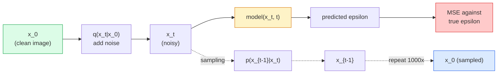

# Image Generation — Diffusion Models

> Một diffusion model học cách khử nhiễu (denoise). Hãy huấn luyện nó để loại bỏ một chút nhiễu từ một bức ảnh bị nhiễu, lặp lại quá trình đó ngược lại một nghìn lần, và bạn sẽ có một trình tạo ảnh.

**Type:** Build
**Languages:** Python
**Prerequisites:** Phase 4 Lesson 07 (U-Net), Phase 1 Lesson 06 (Probability), Phase 3 Lesson 06 (Optimizers)
**Time:** ~75 phút

## Mục tiêu học tập

- Suy luận quy trình thêm nhiễu xuôi (forward noising process) `x_0 -> x_1 -> ... -> x_T` và giải thích tại sao công thức dạng đóng `q(x_t | x_0)` lại đúng với mọi t
- Triển khai mục tiêu huấn luyện theo kiểu DDPM để hồi quy lượng nhiễu được thêm vào tại mỗi bước, và một bộ lấy mẫu (sampler) đi ngược từ nhiễu thuần túy về ảnh
- Xây dựng một U-Net có điều kiện theo thời gian (time-conditioned U-Net) (đủ nhỏ để huấn luyện trên CPU) giúp dự đoán nhiễu cho bất kỳ bước thời gian nào
- Giải thích sự khác biệt giữa lấy mẫu DDPM và DDIM, và khi nào nên sử dụng phương pháp nào (Bài 23 sẽ đề cập sâu về flow matching và rectified flow)

## Vấn đề

GAN tạo ảnh theo kiểu một lần (one-shot): nhiễu đi vào, ảnh đi ra, chỉ một lần truyền xuôi (forward pass). Chúng nhanh nhưng khó huấn luyện. Diffusion models tạo ảnh theo kiểu lặp (iterative): bắt đầu từ nhiễu thuần túy, khử nhiễu từng bước nhỏ, ảnh sẽ dần hiện ra. Chúng chậm hơn nhưng dễ huấn luyện hơn. Trong năm năm qua, đặc tính thứ hai đã chiếm ưu thế: bất kỳ nhóm nhỏ nào cũng có thể huấn luyện một diffusion model và thu được các mẫu hợp lý; trong khi huấn luyện GAN là một kỹ năng đòi hỏi nhiều năm kinh nghiệm với vô số lần thất bại.

Ngoài sự ổn định khi huấn luyện, cấu trúc lặp của diffusion là thứ mở khóa mọi khả năng của tạo ảnh hiện đại: điều kiện văn bản (text conditioning), inpainting, chỉnh sửa ảnh, tăng độ phân giải (super-resolution), và kiểm soát phong cách. Mỗi bước trong vòng lặp lấy mẫu là một nơi để chèn thêm các ràng buộc mới. "Điểm móc" đó là lý do tại sao Stable Diffusion, Imagen, DALL-E 3, Midjourney và mọi mô hình tạo ảnh có thể kiểm soát mà bạn sử dụng đều dựa trên diffusion.

Bài học này xây dựng một DDPM tối giản: thêm nhiễu xuôi, khử nhiễu ngược, và vòng lặp huấn luyện. Bài học tiếp theo (Stable Diffusion) sẽ kết nối nó vào một hệ thống sản xuất với VAE, bộ mã hóa văn bản (text encoder) và classifier-free guidance.

## Khái niệm

### Quy trình xuôi (Forward process)

Lấy một bức ảnh `x_0`. Thêm một lượng nhỏ nhiễu Gaussian để có `x_1`. Thêm một lượng nhỏ nữa để có `x_2`. Tiếp tục trong T bước cho đến khi `x_T` gần như không thể phân biệt được với nhiễu Gaussian thuần túy.

```
q(x_t | x_{t-1}) = N(x_t; sqrt(1 - beta_t) * x_{t-1},  beta_t * I)
```

`beta_t` là một lịch trình phương sai (variance schedule) nhỏ, thường là tuyến tính từ 0.0001 đến 0.02 qua T=1000 bước. Mỗi bước làm giảm nhẹ tín hiệu và chèn thêm nhiễu mới.

### Bước nhảy dạng đóng (Closed-form jump)

Việc thêm nhiễu từng bước một là một chuỗi Markov, nhưng toán học cho phép rút gọn: bạn có thể lấy mẫu `x_t` trực tiếp từ `x_0` chỉ trong một bước.

```
Define alpha_t = 1 - beta_t
Define alpha_bar_t = prod_{s=1..t} alpha_s

Then:
  q(x_t | x_0) = N(x_t; sqrt(alpha_bar_t) * x_0,  (1 - alpha_bar_t) * I)

Equivalently:
  x_t = sqrt(alpha_bar_t) * x_0 + sqrt(1 - alpha_bar_t) * epsilon
  where epsilon ~ N(0, I)
```

Phương trình đơn lẻ này chính là lý do khiến diffusion trở nên thực tế. Trong quá trình huấn luyện, bạn chọn một `t` ngẫu nhiên, lấy mẫu `x_t` trực tiếp từ `x_0`, và huấn luyện trong một bước — không cần mô phỏng toàn bộ chuỗi Markov.

### Quy trình ngược (Reverse process)

Quy trình xuôi là cố định. Quy trình ngược `p(x_{t-1} | x_t)` là thứ mà mạng thần kinh sẽ học. Các diffusion model không dự đoán `x_{t-1}` trực tiếp; chúng dự đoán nhiễu `epsilon` được thêm vào tại bước t, và toán học sẽ suy ra `x_{t-1}` từ đó.



### Hàm mất mát (Training loss)

Với mỗi bước huấn luyện:

1. Lấy mẫu một ảnh thực `x_0`.
2. Lấy mẫu một bước thời gian `t` đồng nhất từ [1, T].
3. Lấy mẫu nhiễu `epsilon ~ N(0, I)`.
4. Tính `x_t = sqrt(alpha_bar_t) * x_0 + sqrt(1 - alpha_bar_t) * epsilon`.
5. Dự đoán `epsilon_theta(x_t, t)` bằng mạng thần kinh.
6. Tối thiểu hóa `|| epsilon - epsilon_theta(x_t, t) ||^2`.

Chỉ vậy thôi. Mạng thần kinh học cách dự đoán nhiễu tại bất kỳ bước thời gian nào. Hàm mất mát là MSE. Không có trò chơi đối kháng, không bị sụp đổ (collapse), không dao động.

### Bộ lấy mẫu (DDPM)

Để tạo ảnh: bắt đầu từ `x_T ~ N(0, I)` và đi ngược lại từng bước một.

```
for t = T, T-1, ..., 1:
    eps = model(x_t, t)
    x_{t-1} = (1 / sqrt(alpha_t)) * (x_t - (beta_t / sqrt(1 - alpha_bar_t)) * eps) + sqrt(beta_t) * z
    where z ~ N(0, I) if t > 1, else 0
return x_0
```

Điểm mấu chốt là mặc dù điều kiện ngược không được biết dưới dạng đóng trong trường hợp tổng quát, nhưng đối với quy trình xuôi Gaussian cụ thể này thì có. Các hệ số trông có vẻ phức tạp chính là kết quả từ định lý Bayes.

### Tại sao lại là 1000 bước

Lịch trình nhiễu xuôi được chọn sao cho mỗi bước thêm vào lượng nhiễu vừa đủ để bước ngược gần như là Gaussian. Nếu quá ít bước, bước ngược sẽ khác xa Gaussian và mạng không thể mô hình hóa tốt. Nếu quá nhiều bước, việc lấy mẫu sẽ trở nên đắt đỏ với lợi ích giảm dần. T=1000 với lịch trình tuyến tính là mặc định của DDPM.

### DDIM: Lấy mẫu nhanh hơn 20 lần

Huấn luyện vẫn giữ nguyên. Việc lấy mẫu thay đổi. DDIM (Song et al., 2020) định nghĩa một quy trình ngược tất định (deterministic) cho phép bỏ qua các bước thời gian mà không cần huấn luyện lại. Lấy mẫu trong 50 bước với DDIM cho chất lượng gần bằng DDPM 1000 bước. Mọi hệ thống sản xuất đều sử dụng DDIM hoặc một biến thể nhanh hơn nữa (DPM-Solver, Euler ancestral).

### Điều kiện theo thời gian (Time conditioning)

Mạng `epsilon_theta(x_t, t)` cần biết nó đang khử nhiễu ở bước thời gian nào. Các diffusion model hiện đại chèn `t` thông qua các nhúng thời gian hình sin (sinusoidal time embeddings) (cùng ý tưởng với positional encoding trong các transformer) được thêm vào các bản đồ đặc trưng (feature maps) tại mỗi tầng của U-Net.

```
t_embedding = sinusoidal(t)
feature_map += MLP(t_embedding)
```

Nếu không có điều kiện thời gian, mạng phải tự đoán mức độ nhiễu từ chính bức ảnh, điều này vẫn hoạt động nhưng kém hiệu quả hơn nhiều về mặt lấy mẫu.

```figure
cv-diffusion-image
```

## Xây dựng

### Bước 1: Lịch trình nhiễu (Noise schedule)

```python
import torch

def linear_beta_schedule(T=1000, beta_start=1e-4, beta_end=2e-2):
    return torch.linspace(beta_start, beta_end, T)


def precompute_schedule(betas):
    alphas = 1.0 - betas
    alphas_cumprod = torch.cumprod(alphas, dim=0)
    return {
        "betas": betas,
        "alphas": alphas,
        "alphas_cumprod": alphas_cumprod,
        "sqrt_alphas_cumprod": torch.sqrt(alphas_cumprod),
        "sqrt_one_minus_alphas_cumprod": torch.sqrt(1.0 - alphas_cumprod),
        "sqrt_recip_alphas": torch.sqrt(1.0 / alphas),
    }

schedule = precompute_schedule(linear_beta_schedule(T=1000))
```

Tính toán trước một lần, thu thập theo chỉ số trong quá trình huấn luyện và lấy mẫu.

### Bước 2: Diffusion xuôi (q_sample)

```python
def q_sample(x0, t, noise, schedule):
    sqrt_a = schedule["sqrt_alphas_cumprod"][t].view(-1, 1, 1, 1)
    sqrt_one_minus_a = schedule["sqrt_one_minus_alphas_cumprod"][t].view(-1, 1, 1, 1)
    return sqrt_a * x0 + sqrt_one_minus_a * noise
```

Công thức dạng đóng một dòng. `t` là một batch các bước thời gian, mỗi bước cho một ảnh trong batch.

### Bước 3: U-Net nhỏ có điều kiện thời gian

```python
import torch.nn as nn
import torch.nn.functional as F
import math

def timestep_embedding(t, dim=64):
    half = dim // 2
    freqs = torch.exp(-math.log(10000) * torch.arange(half, device=t.device) / half)
    args = t[:, None].float() * freqs[None]
    emb = torch.cat([args.sin(), args.cos()], dim=-1)
    return emb


class TinyUNet(nn.Module):
    def __init__(self, img_channels=3, base=32, t_dim=64):
        super().__init__()
        self.t_mlp = nn.Sequential(
            nn.Linear(t_dim, base * 4),
            nn.SiLU(),
            nn.Linear(base * 4, base * 4),
        )
        self.t_dim = t_dim
        self.enc1 = nn.Conv2d(img_channels, base, 3, padding=1)
        self.enc2 = nn.Conv2d(base, base * 2, 4, stride=2, padding=1)
        self.mid = nn.Conv2d(base * 2, base * 2, 3, padding=1)
        self.dec1 = nn.ConvTranspose2d(base * 2, base, 4, stride=2, padding=1)
        self.dec2 = nn.Conv2d(base * 2, img_channels, 3, padding=1)
        self.time_proj = nn.Linear(base * 4, base * 2)

    def forward(self, x, t):
        t_emb = timestep_embedding(t, self.t_dim)
        t_emb = self.t_mlp(t_emb)
        t_proj = self.time_proj(t_emb)[:, :, None, None]

        h1 = F.silu(self.enc1(x))
        h2 = F.silu(self.enc2(h1)) + t_proj
        h3 = F.silu(self.mid(h2))
        d1 = F.silu(self.dec1(h3))
        d2 = torch.cat([d1, h1], dim=1)
        return self.dec2(d2)
```

U-Net hai tầng với điều kiện thời gian được chèn vào tại điểm nghẽn (bottleneck). Mở rộng độ sâu và chiều rộng cho các ảnh thực tế.

### Bước 4: Vòng lặp huấn luyện

```python
def train_step(model, x0, schedule, optimizer, device, T=1000):
    model.train()
    x0 = x0.to(device)
    bs = x0.size(0)
    t = torch.randint(0, T, (bs,), device=device)
    noise = torch.randn_like(x0)
    x_t = q_sample(x0, t, noise, schedule)
    pred = model(x_t, t)
    loss = F.mse_loss(pred, noise)
    optimizer.zero_grad()
    loss.backward()
    optimizer.step()
    return loss.item()
```

Đó là toàn bộ vòng lặp huấn luyện. Không có trò chơi GAN, không có hàm mất mát chuyên biệt, chỉ một lệnh gọi MSE.

### Bước 5: Bộ lấy mẫu (DDPM)

```python
@torch.no_grad()
def sample(model, schedule, shape, T=1000, device="cpu"):
    model.eval()
    x = torch.randn(shape, device=device)
    betas = schedule["betas"].to(device)
    sqrt_one_minus_a = schedule["sqrt_one_minus_alphas_cumprod"].to(device)
    sqrt_recip_alphas = schedule["sqrt_recip_alphas"].to(device)

    for t in reversed(range(T)):
        t_batch = torch.full((shape[0],), t, dtype=torch.long, device=device)
        eps = model(x, t_batch)
        coef = betas[t] / sqrt_one_minus_a[t]
        mean = sqrt_recip_alphas[t] * (x - coef * eps)
        if t > 0:
            x = mean + torch.sqrt(betas[t]) * torch.randn_like(x)
        else:
            x = mean
    return x
```

1000 lần truyền xuôi để tạo ra một batch mẫu. Trong mã nguồn thực tế, bạn sẽ thay thế bằng bộ lấy mẫu DDIM 50 bước.

### Bước 6: Bộ lấy mẫu DDIM (tất định, nhanh hơn ~20 lần)

```python
@torch.no_grad()
def sample_ddim(model, schedule, shape, steps=50, T=1000, device="cpu", eta=0.0):
    model.eval()
    x = torch.randn(shape, device=device)
    alphas_cumprod = schedule["alphas_cumprod"].to(device)

    ts = torch.linspace(T - 1, 0, steps + 1).long()
    for i in range(steps):
        t = ts[i]
        t_prev = ts[i + 1]
        t_batch = torch.full((shape[0],), t, dtype=torch.long, device=device)
        eps = model(x, t_batch)
        a_t = alphas_cumprod[t]
        a_prev = alphas_cumprod[t_prev] if t_prev >= 0 else torch.tensor(1.0, device=device)
        x0_pred = (x - torch.sqrt(1 - a_t) * eps) / torch.sqrt(a_t)
        sigma = eta * torch.sqrt((1 - a_prev) / (1 - a_t) * (1 - a_t / a_prev))
        dir_xt = torch.sqrt(1 - a_prev - sigma ** 2) * eps
        noise = sigma * torch.randn_like(x) if eta > 0 else 0
        x = torch.sqrt(a_prev) * x0_pred + dir_xt + noise
    return x
```

`eta=0` hoàn toàn tất định (cùng một đầu vào nhiễu luôn tạo ra cùng một đầu ra). `eta=1` khôi phục lại DDPM.

## Sử dụng

Đối với công việc sản xuất, hãy sử dụng `diffusers`:

```python
from diffusers import DDPMScheduler, UNet2DModel

unet = UNet2DModel(sample_size=32, in_channels=3, out_channels=3, layers_per_block=2)
scheduler = DDPMScheduler(num_train_timesteps=1000)
```

Thư viện này cung cấp sẵn các bộ lập lịch (DDPM, DDIM, DPM-Solver, Euler, Heun), các U-Net có thể cấu hình, các pipeline cho text-to-image và image-to-image, cùng các công cụ hỗ trợ tinh chỉnh LoRA.

Đối với nghiên cứu, `k-diffusion` (Katherine Crowson) có các triển khai tham chiếu trung thực nhất và các biến thể lấy mẫu tốt nhất.

## Triển khai

Bài học này tạo ra:

- `outputs/prompt-diffusion-sampler-picker.md` — một prompt chọn DDPM / DDIM / DPM-Solver / Euler dựa trên mục tiêu chất lượng, ngân sách độ trễ và loại điều kiện.
- `outputs/skill-noise-schedule-designer.md` — một kỹ năng tạo ra lịch trình beta tuyến tính, cosine hoặc sigmoid dựa trên T và mức độ nhiễu mục tiêu, cộng với các biểu đồ chẩn đoán tỷ lệ tín hiệu trên nhiễu (SNR) theo thời gian.

## Bài tập

1. **(Dễ)** Trực quan hóa quy trình xuôi: lấy một bức ảnh và vẽ `x_t` tại `t in [0, 100, 250, 500, 750, 1000]`. Xác minh rằng `x_1000` trông giống như nhiễu Gaussian thuần túy.
2. **(Trung bình)** Huấn luyện TinyUNet trên tập dữ liệu synthetic-circles trong 20 epoch và lấy mẫu 16 vòng tròn. So sánh việc lấy mẫu DDPM (1000 bước) và DDIM (50 bước) — liệu chúng có tạo ra các hình ảnh tương tự từ cùng một hạt giống nhiễu (noise seed) không?
3. **(Khó)** Triển khai lịch trình nhiễu cosine (Nichol & Dhariwal, 2021): `alpha_bar_t = cos^2((t/T + s) / (1 + s) * pi / 2)`. Huấn luyện cùng một mô hình với lịch trình tuyến tính và cosine, sau đó chứng minh rằng cosine cho các mẫu tốt hơn ở số bước thấp.

## Thuật ngữ chính

| Thuật ngữ | Cách gọi thông thường | Ý nghĩa thực tế |
|------|----------------|----------------------|
| Forward process | "Thêm nhiễu theo thời gian" | Chuỗi Markov cố định làm hỏng ảnh thành nhiễu Gaussian qua T bước |
| Reverse process | "Khử nhiễu từng bước" | Phân phối đã học đi ngược từ nhiễu về ảnh |
| Epsilon prediction | "Dự đoán nhiễu" | Mục tiêu huấn luyện: `epsilon_theta(x_t, t)` dự đoán nhiễu được thêm vào tại bước t |
| Beta schedule | "Lượng nhiễu" | Chuỗi T phương sai nhỏ xác định lượng nhiễu thêm vào mỗi bước |
| alpha_bar_t | "Hệ số giữ lại tích lũy" | Tích của (1 - beta_s) đến thời điểm t; t càng lớn thì tín hiệu còn lại càng ít |
| DDPM sampler | "Ancestral, ngẫu nhiên" | Lấy mẫu mỗi x_{t-1} từ Gaussian có điều kiện của nó; 1000 bước |
| DDIM sampler | "Tất định, nhanh" | Viết lại việc lấy mẫu dưới dạng ODE tất định; 20-100 bước với chất lượng tương đương |
| Time conditioning | "Cho mô hình biết t" | Nhúng hình sin của t được chèn vào U-Net để nó biết mức độ nhiễu |

## Đọc thêm

- [Denoising Diffusion Probabilistic Models (Ho et al., 2020)](https://arxiv.org/abs/2006.11239) — bài báo làm cho diffusion trở nên thực tế và đánh bại GAN về chỉ số FID
- [Improved DDPM (Nichol & Dhariwal, 2021)](https://arxiv.org/abs/2102.09672) — lịch trình cosine và tham số hóa v
- [DDIM (Song, Meng, Ermon, 2020)](https://arxiv.org/abs/2010.02502) — bộ lấy mẫu tất định giúp suy luận thời gian thực trở nên khả thi
- [Elucidating the Design Space of Diffusion (Karras et al., 2022)](https://arxiv.org/abs/2206.00364) — cái nhìn thống nhất về mọi lựa chọn thiết kế diffusion; tài liệu tham khảo tốt nhất hiện nay