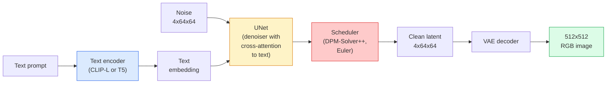

# Stable Diffusion — Kiến trúc & Fine-Tuning

> Stable Diffusion là một DDPM chạy trong không gian latent của một VAE đã được huấn luyện trước, được điều hướng bằng văn bản thông qua cross-attention, lấy mẫu bằng bộ giải ODE tất định nhanh và được điều khiển bởi classifier-free guidance.

**Type:** Learn + Use
**Languages:** Python
**Prerequisites:** Phase 4 Lesson 10 (Diffusion), Phase 7 Lesson 02 (Self-Attention)
**Time:** ~75 minutes

## Mục tiêu học tập

- Truy vết năm thành phần của pipeline Stable Diffusion: VAE, text encoder, U-Net, scheduler, safety checker — và chức năng thực tế của từng thành phần.
- Giải thích latent diffusion và lý do tại sao việc huấn luyện trong không gian latent 4x64x64 (thay vì ảnh 3x512x512) giúp giảm 48 lần khối lượng tính toán mà không làm giảm chất lượng.
- Sử dụng `diffusers` để tạo ảnh, thực hiện image-to-image, inpainting và tạo ảnh có hướng dẫn bằng ControlNet.
- Fine-tune Stable Diffusion với LoRA trên một tập dữ liệu tùy chỉnh nhỏ và load LoRA adapter tại thời điểm inference.

## Vấn đề

Huấn luyện một DDPM trực tiếp trên ảnh RGB 512x512 rất tốn kém. Mỗi bước huấn luyện cần backprop qua một U-Net xử lý 3x512x512 = 786,432 giá trị đầu vào, và việc lấy mẫu (sampling) cần hơn 50 lần forward pass qua cùng U-Net đó. Ở mức chất lượng của Stable Diffusion 1.5 (phát hành năm 2022), diffusion trong không gian pixel sẽ cần khoảng 256 GPU-tháng để huấn luyện và mất 10-30 giây cho mỗi ảnh trên một GPU phổ thông.

Thủ thuật giúp cho các mô hình text-to-image mã nguồn mở trở nên thực tế là **latent diffusion** (Rombach và cộng sự, CVPR 2022). Huấn luyện một VAE để ánh xạ ảnh 3x512x512 sang tensor latent 4x64x64 và ngược lại, sau đó thực hiện diffusion trong không gian latent đó. Khối lượng tính toán giảm đi `(3*512*512)/(4*64*64) = 48x`. Thời gian lấy mẫu giảm từ hàng chục giây xuống dưới hai giây trên cùng một GPU.

Hầu hết các mô hình tạo ảnh hiện đại — SDXL, SD3, FLUX, HunyuanDiT, Wan-Video — đều là các mô hình latent diffusion với những biến thể về autoencoder, bộ khử nhiễu (U-Net hoặc DiT) và cách điều hướng bằng văn bản (text conditioning). Học về Stable Diffusion nghĩa là bạn đã nắm được khuôn mẫu chung.

## Khái niệm

### Pipeline



- **VAE** — autoencoder đã đóng băng (frozen). Encoder chuyển ảnh thành các latent (được dùng cho img2img và huấn luyện). Decoder chuyển latent trở lại thành ảnh.
- **Text encoder** — CLIP text encoder (SD 1.x/2.x), CLIP-L + CLIP-G (SDXL), hoặc T5-XXL (SD3/FLUX). Tạo ra một chuỗi các token embedding.
- **U-Net** — bộ khử nhiễu. Có các lớp cross-attention giúp chú ý từ các latent đến text embedding ở mọi cấp độ phân giải.
- **Scheduler** — thuật toán lấy mẫu (DDIM, Euler, DPM-Solver++). Chọn các giá trị sigma, trộn nhiễu dự đoán trở lại vào latent.
- **Safety checker** — bộ lọc tùy chọn cho nội dung NSFW / bất hợp pháp trên ảnh đầu ra.

### Classifier-free guidance (CFG)

Điều hướng bằng văn bản thuần túy học `epsilon_theta(x_t, t, c)` cho mỗi prompt `c`. CFG huấn luyện cùng một mạng với `c` bị loại bỏ 10% thời gian (thay thế bằng một embedding trống), tạo ra một mô hình duy nhất dự đoán cả nhiễu có điều kiện và không điều kiện. Tại thời điểm inference:

```
eps = eps_uncond + w * (eps_cond - eps_uncond)
```

`w` là thang đo guidance. `w=0` là không điều kiện, `w=1` là có điều kiện thuần túy, `w>1` đẩy đầu ra trở nên "tuân thủ prompt hơn" với cái giá là sự đa dạng. Mặc định của SD là `w=7.5`.

CFG là lý do khiến text-to-image hoạt động ở chất lượng sản xuất. Nếu không có nó, các prompt chỉ tác động yếu lên đầu ra; với nó, các prompt sẽ chiếm ưu thế.

### Hình học không gian latent

Latent 4 kênh của VAE không chỉ là một bức ảnh bị nén. Đó là một đa tạp (manifold) nơi các phép toán tương ứng với các chỉnh sửa ngữ nghĩa (prompt engineering + nội suy đều nằm ở đây), và nơi U-Net diffusion đã được huấn luyện để dành toàn bộ ngân sách mô hình hóa của nó. Giải mã một latent 4x64x64 ngẫu nhiên không tạo ra một bức ảnh trông bình thường — nó tạo ra rác, vì chỉ một tiểu đa tạp cụ thể của các latent mới giải mã thành ảnh hợp lệ.

Hai hệ quả:

1. **Img2img** = mã hóa ảnh thành latent, thêm một phần nhiễu, chạy bộ khử nhiễu, giải mã. Cấu trúc ảnh được giữ lại vì quá trình mã hóa gần như có thể đảo ngược; nội dung thay đổi dựa trên prompt.
2. **Inpainting** = giống như img2img nhưng bộ khử nhiễu chỉ cập nhật các vùng được mask; các vùng không được mask được giữ nguyên ở latent đã mã hóa.

### Kiến trúc U-Net

U-Net của SD là một phiên bản lớn của TinyUNet từ Bài 10 với ba bổ sung:

- **Các khối Transformer** ở mọi độ phân giải không gian, chứa self-attention + cross-attention với text embedding.
- **Time embedding** thông qua MLP trên mã hóa hình sin (sinusoidal encoding).
- **Skip connections** giữa encoder và decoder ở các độ phân giải tương ứng.

Tổng số tham số trong SD 1.5: ~860M. SDXL: ~2.6B. FLUX: ~12B. Sự gia tăng tham số chủ yếu nằm ở các lớp attention.

### LoRA fine-tuning

Việc fine-tune toàn bộ Stable Diffusion cần hơn 20 GB VRAM và cập nhật 860M tham số. LoRA (Low-Rank Adaptation) giữ mô hình cơ sở đóng băng và chèn các ma trận phân rã hạng thấp (rank-decomposition) nhỏ vào các lớp attention. Một LoRA adapter cho SD thường có dung lượng 10-50 MB, huấn luyện trong 10-60 phút trên một GPU phổ thông và được load tại thời điểm inference như một sửa đổi bổ sung.

```
Original: W_q : (d_in, d_out)   frozen
LoRA:     W_q + alpha * (A @ B)   where A : (d_in, r), B : (r, d_out)

r is typically 4-32.
```

LoRA là cách mà hầu hết các bản fine-tune cộng đồng được phân phối. CivitAI và Hugging Face lưu trữ hàng triệu bản như vậy.

### Các Scheduler bạn sẽ gặp

- **DDIM** — tất định, ~50 bước, đơn giản.
- **Euler ancestral** — ngẫu nhiên, 30-50 bước, các mẫu có tính sáng tạo hơn một chút.
- **DPM-Solver++ 2M Karras** — tất định, 20-30 bước, mặc định cho sản xuất.
- **LCM / TCD / Turbo** — các mô hình nhất quán và các biến thể chưng cất; 1-4 bước với cái giá là giảm một chút chất lượng.

Thay đổi scheduler là một thay đổi một dòng trong `diffusers` và đôi khi khắc phục được các vấn đề về mẫu mà không cần huấn luyện lại.

```figure
cv3-latent-compression
```

## Xây dựng

Bài học này sử dụng `diffusers` từ đầu đến cuối thay vì xây dựng lại Stable Diffusion từ đầu. Các phần bạn cần xây dựng lại (VAE, text encoder, U-Net, scheduler) là chủ đề của các bài học riêng; ở đây mục tiêu là sự thành thạo với API sản xuất.

### Bước 1: Text-to-image

```python
import torch
from diffusers import StableDiffusionPipeline

pipe = StableDiffusionPipeline.from_pretrained(
    "runwayml/stable-diffusion-v1-5",
    torch_dtype=torch.float16,
).to("cuda")

image = pipe(
    prompt="a dog riding a skateboard in tokyo, studio ghibli style",
    guidance_scale=7.5,
    num_inference_steps=25,
    generator=torch.Generator("cuda").manual_seed(42),
).images[0]
image.save("dog.png")
```

`float16` giảm một nửa VRAM mà không làm giảm chất lượng hiển thị. `num_inference_steps=25` với DPM-Solver++ mặc định tương đương với `num_inference_steps=50` với DDIM.

### Bước 2: Thay đổi scheduler

```python
from diffusers import DPMSolverMultistepScheduler, EulerAncestralDiscreteScheduler

pipe.scheduler = DPMSolverMultistepScheduler.from_config(pipe.scheduler.config)
pipe.scheduler = EulerAncestralDiscreteScheduler.from_config(pipe.scheduler.config)
```

Trạng thái scheduler được tách rời khỏi trọng số U-Net. Bạn có thể huấn luyện trên DDPM và lấy mẫu với bất kỳ scheduler nào.

### Bước 3: Image-to-image

```python
from diffusers import StableDiffusionImg2ImgPipeline
from PIL import Image

img2img = StableDiffusionImg2ImgPipeline.from_pretrained(
    "runwayml/stable-diffusion-v1-5",
    torch_dtype=torch.float16,
).to("cuda")

init_image = Image.open("dog.png").convert("RGB").resize((512, 512))
out = img2img(
    prompt="a dog riding a skateboard, oil painting",
    image=init_image,
    strength=0.6,
    guidance_scale=7.5,
).images[0]
```

`strength` là lượng nhiễu cần thêm vào trước khi khử nhiễu (0.0 = không thay đổi, 1.0 = tái tạo hoàn toàn). 0.5-0.7 là phạm vi tiêu chuẩn cho chuyển đổi phong cách.

### Bước 4: Inpainting

```python
from diffusers import StableDiffusionInpaintPipeline

inpaint = StableDiffusionInpaintPipeline.from_pretrained(
    "runwayml/stable-diffusion-inpainting",
    torch_dtype=torch.float16,
).to("cuda")

image = Image.open("dog.png").convert("RGB").resize((512, 512))
mask = Image.open("dog_mask.png").convert("L").resize((512, 512))

out = inpaint(
    prompt="a cat",
    image=image,
    mask_image=mask,
    guidance_scale=7.5,
).images[0]
```

Các pixel trắng trong mask là vùng cần tái tạo. Các pixel đen được giữ nguyên.

### Bước 5: LoRA loading

```python
pipe.load_lora_weights("sayakpaul/sd-lora-ghibli")
pipe.fuse_lora(lora_scale=0.8)

image = pipe(prompt="a village square in ghibli style").images[0]
```

`lora_scale` kiểm soát cường độ; 0.0 = không có tác dụng, 1.0 = tác dụng đầy đủ. `fuse_lora` nướng (bake) adapter vào trọng số tại chỗ để tăng tốc, nhưng ngăn cản việc thay đổi. Gọi `pipe.unfuse_lora()` trước khi load một adapter khác.

### Bước 6: LoRA training (phác thảo)

Việc huấn luyện LoRA thực tế nằm trong `peft` hoặc `diffusers.training`. Phác thảo:

```python
# Pseudocode
for step, batch in enumerate(dataloader):
    images, prompts = batch
    latents = vae.encode(images).latent_dist.sample() * 0.18215

    t = torch.randint(0, num_train_timesteps, (batch_size,))
    noise = torch.randn_like(latents)
    noisy_latents = scheduler.add_noise(latents, noise, t)

    text_emb = text_encoder(tokenizer(prompts))

    pred_noise = unet(noisy_latents, t, text_emb)  # LoRA weights injected here

    loss = F.mse_loss(pred_noise, noise)
    loss.backward()
    optimizer.step()
```

Chỉ các ma trận LoRA nhận gradient; U-Net cơ sở, VAE và text encoder đều bị đóng băng. Với batch size là 1 và gradient checkpointing, điều này vừa với 8 GB VRAM.

## Sử dụng

Trong sản xuất, các quyết định bạn thực sự đưa ra:

- **Họ mô hình**: SD 1.5 cho các bản fine-tune cộng đồng mã nguồn mở, SDXL cho độ trung thực cao hơn, SD3 / FLUX cho trạng thái nghệ thuật và các yêu cầu cấp phép nghiêm ngặt.
- **Scheduler**: DPM-Solver++ 2M Karras cho 20-30 bước, LCM-LoRA khi độ trễ dưới 1s.
- **Độ chính xác**: `float16` trên 4080/4090, `bfloat16` trên A100 và mới hơn, `int8` (thông qua `bitsandbytes` hoặc `compel`) khi VRAM hạn chế.
- **Điều hướng**: văn bản thuần túy hoạt động tốt; để kiểm soát mạnh hơn, hãy thêm ControlNet (canny, depth, pose) lên trên pipeline cơ sở.

Để tạo hàng loạt, `AUTO1111` / `ComfyUI` là các công cụ cộng đồng; cho các API sản xuất, `diffusers` + `accelerate` hoặc `optimum-nvidia` với biên dịch TensorRT.

## Triển khai

Bài học này tạo ra:

- `outputs/prompt-sd-pipeline-planner.md` — một prompt chọn SD 1.5 / SDXL / SD3 / FLUX cộng với scheduler và độ chính xác dựa trên ngân sách độ trễ, mục tiêu độ trung thực và ràng buộc cấp phép.
- `outputs/skill-lora-training-setup.md` — một kỹ năng viết cấu hình huấn luyện LoRA đầy đủ cho tập dữ liệu tùy chỉnh bao gồm chú thích, hạng (rank), batch size và tốc độ học (learning rate).

## Bài tập

1. **(Dễ)** Tạo cùng một prompt với `guidance_scale` trong `[1, 3, 5, 7.5, 10, 15]`. Mô tả cách ảnh thay đổi. Ở giá trị guidance nào thì các hiện tượng giả (artefacts) xuất hiện?
2. **(Trung bình)** Lấy bất kỳ bức ảnh thực nào, chạy nó qua `StableDiffusionImg2ImgPipeline` tại `strength` trong `[0.2, 0.4, 0.6, 0.8, 1.0]`. Cường độ nào giữ được bố cục trong khi thay đổi phong cách? Tại sao 1.0 lại bỏ qua hoàn toàn đầu vào?
3. **(Khó)** Huấn luyện một LoRA trên 10-20 ảnh của một chủ thể duy nhất (thú cưng, logo, nhân vật) và tạo các cảnh mới với chủ thể đó trong đó. Báo cáo hạng LoRA và các bước huấn luyện tạo ra sự bảo toàn danh tính tốt nhất mà không bị overfitting vào ảnh đầu vào.

## Thuật ngữ chính

| Thuật ngữ | Cách gọi thông thường | Ý nghĩa thực tế |
|------|----------------|----------------------|
| Latent diffusion | "Diffuse in latents" | Chạy toàn bộ DDPM trong không gian latent của VAE (4x64x64) thay vì không gian pixel (3x512x512); tiết kiệm 48 lần tính toán |
| VAE scale factor | "0.18215" | Hằng số điều chỉnh lại latent thô của VAE về phương sai đơn vị; được hardcode trong mọi pipeline SD |
| Classifier-free guidance | "CFG" | Trộn các dự đoán nhiễu có điều kiện và không điều kiện; nút điều khiển inference quan trọng nhất |
| Scheduler | "Sampler" | Thuật toán biến nhiễu + dự đoán của mô hình thành quỹ đạo latent đã khử nhiễu |
| LoRA | "Low-rank adapter" | Các ma trận phân rã hạng thấp nhỏ giúp fine-tune các lớp attention mà không chạm vào trọng số cơ sở |
| Cross-attention | "Text-image attention" | Attention từ các token latent đến các token văn bản; chèn thông tin prompt ở mọi cấp độ U-Net |
| ControlNet | "Structure conditioning" | Một adapter được huấn luyện riêng biệt giúp điều hướng SD với một đầu vào bổ sung (canny, depth, pose, segmentation) |
| DPM-Solver++ | "The default scheduler" | Bộ giải ODE tất định bậc hai; chất lượng tốt nhất ở số bước thấp (20-30) vào năm 2026 |

## Đọc thêm

- [High-Resolution Image Synthesis with Latent Diffusion (Rombach et al., 2022)](https://arxiv.org/abs/2112.10752) — bài báo về Stable Diffusion; bao gồm mọi thử nghiệm ablation chứng minh cho thiết kế này
- [Classifier-Free Diffusion Guidance (Ho & Salimans, 2022)](https://arxiv.org/abs/2207.12598) — bài báo về CFG
- [LoRA: Low-Rank Adaptation of Large Language Models (Hu et al., 2021)](https://arxiv.org/abs/2106.09685) — LoRA ban đầu dành cho NLP; nó được chuyển sang SD gần như không thay đổi
- [diffusers documentation](https://huggingface.co/docs/diffusers) — tài liệu tham khảo cho mọi pipeline SD / SDXL / SD3 / FLUX