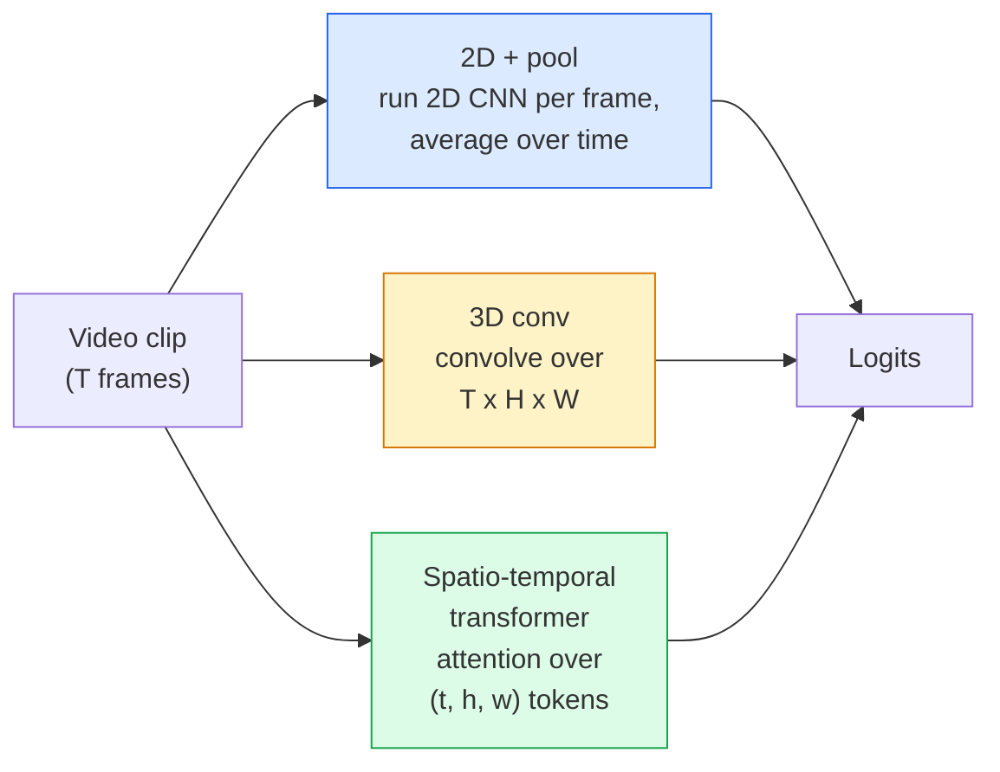

# Video Understanding — Temporal Modeling

> Video là một chuỗi các hình ảnh cộng với các quy luật vật lý kết nối chúng. Mọi mô hình video đều xử lý thời gian theo một trong ba cách: coi thời gian là một trục bổ sung (3D conv), một chuỗi để thực hiện cơ chế attention (transformer), hoặc một đặc trưng được trích xuất một lần rồi gộp lại (2D+pool).

**Type:** Learn + Build
**Languages:** Python
**Prerequisites:** Phase 4 Lesson 03 (CNNs), Phase 4 Lesson 04 (Image Classification)
**Time:** ~45 phút

## Mục tiêu học tập

- Phân biệt ba phương pháp mô hình hóa video chính (2D+pool, 3D conv, spatio-temporal transformer) và dự đoán sự đánh đổi giữa chi phí và độ chính xác của chúng.
- Triển khai lấy mẫu khung hình (frame sampling), gộp thời gian (temporal pooling) và bộ phân loại baseline 2D+pool trong PyTorch.
- Giải thích lý do tại sao các kernel 3D "được thổi phồng" (inflated) của I3D chuyển đổi tốt từ trọng số ImageNet và cách một conv (2+1)D phân tách hoạt động khác biệt như thế nào.
- Đọc hiểu các bộ dữ liệu và chỉ số nhận diện hành động tiêu chuẩn: Kinetics-400/600, UCF101, Something-Something V2; độ chính xác top-1 ở cấp độ clip và cấp độ video.

## Vấn đề

Một video dài 30 giây ở tốc độ 30 fps bao gồm 900 hình ảnh. Một cách ngây thơ, phân loại video chính là phân loại hình ảnh được chạy 900 lần, sau đó là một dạng tổng hợp nào đó. Cách này hiệu quả khi hành động có thể nhìn thấy trong hầu hết mọi khung hình (thể thao, nấu ăn, video tập thể dục) nhưng lại thất bại thảm hại khi hành động được định nghĩa bởi chính chuyển động: "đẩy một vật từ trái sang phải" trông giống như hai vật thể đứng yên trong từng khung hình đơn lẻ.

Câu hỏi cốt lõi cho mọi kiến trúc video là: cấu trúc thời gian được mô hình hóa khi nào và như thế nào? Câu trả lời quyết định mọi thứ khác — chi phí tính toán, chiến lược tiền huấn luyện, liệu bạn có thể tái sử dụng trọng số ImageNet hay không, và mô hình được huấn luyện trên bộ dữ liệu nào.

Bài học này cố tình ngắn hơn các bài học về hình ảnh tĩnh. Các cơ chế hình ảnh cốt lõi đã được thiết lập, và hiểu video chủ yếu là về câu chuyện thời gian: lấy mẫu, mô hình hóa và tổng hợp.

## Khái niệm

### Ba họ kiến trúc



### 2D + pool

Sử dụng một CNN 2D (ResNet, EfficientNet, ViT). Chạy độc lập trên mọi khung hình được lấy mẫu. Tính trung bình (hoặc max-pool, hoặc attention-pool) các embedding của từng khung hình. Đưa vector đã gộp vào bộ phân loại.

Ưu điểm:
- Tiền huấn luyện ImageNet chuyển đổi trực tiếp.
- Dễ triển khai nhất.
- Rẻ: T khung hình * chi phí suy luận của một ảnh đơn.

Nhược điểm:
- Không thể mô hình hóa chuyển động. Hành động = tổng hợp của các hình ảnh.
- Gộp thời gian không phụ thuộc vào thứ tự; "mở cửa" và "đóng cửa" trông giống hệt nhau.

Khi nào nên dùng: các tác vụ thiên về hình ảnh, transfer learning trên các bộ dữ liệu video nhỏ, các baseline ban đầu.

### 3D convolutions

Thay thế các kernel 2D (H, W) bằng các kernel 3D (T, H, W). Mạng thực hiện tích chập trên cả không gian và thời gian. Các họ đời đầu: C3D, I3D, SlowFast.

Thủ thuật I3D: lấy một mô hình 2D ImageNet đã được tiền huấn luyện, "thổi phồng" (inflate) mỗi kernel 2D bằng cách sao chép nó dọc theo trục thời gian mới. Một conv 2D 3x3 trở thành một conv 3D 3x3x3. Điều này cung cấp cho mô hình 3D các trọng số tiền huấn luyện mạnh mẽ thay vì phải huấn luyện từ đầu.

Ưu điểm:
- Mô hình hóa trực tiếp chuyển động.
- Sự thổi phồng của I3D cho phép transfer learning miễn phí.

Nhược điểm:
- Tốn nhiều FLOPs hơn gấp T/8 lần so với đối tác 2D (với kernel thời gian 3 xếp chồng 3 lần).
- Các kernel thời gian nhỏ; chuyển động tầm xa cần phương pháp kim tự tháp hoặc dual-stream.

Khi nào nên dùng: nhận diện hành động nơi chuyển động là tín hiệu chính (Something-Something V2, Kinetics với các lớp thiên về chuyển động).

### Spatio-temporal transformers

Token hóa video thành một lưới các patch không gian-thời gian và thực hiện attention trên tất cả chúng. TimeSformer, ViViT, Video Swin, VideoMAE.

Các mô hình attention quan trọng:
- **Joint** — một attention lớn trên (t, h, w). Độ phức tạp bậc hai theo `T*H*W`; đắt đỏ.
- **Divided** — hai attention mỗi block: một trên thời gian, một trên không gian. Quy mô tuyến tính.
- **Factorised** — attention thời gian xen kẽ với attention không gian qua các block.

Ưu điểm:
- Độ chính xác SOTA trên mọi benchmark lớn.
- Chuyển đổi từ các transformer hình ảnh (ViT) thông qua patch inflation.
- Hỗ trợ video ngữ cảnh dài thông qua sparse attention.

Nhược điểm:
- Đòi hỏi tính toán lớn.
- Yêu cầu lựa chọn mô hình attention cẩn thận nếu không thời gian chạy sẽ tăng vọt.

Khi nào nên dùng: các bộ dữ liệu lớn, hiểu video độ trung thực cao, các tác vụ đa phương thức video+văn bản.

### Lấy mẫu khung hình (Frame sampling)

Một clip 10 giây ở tốc độ 30 fps là 300 khung hình; đưa tất cả 300 khung hình vào bất kỳ mô hình nào đều gây lãng phí. Các chiến lược tiêu chuẩn:

- **Uniform sampling** — chọn T khung hình đều nhau trên toàn bộ clip. Mặc định cho 2D+pool.
- **Dense sampling** — cửa sổ T khung hình liên tiếp ngẫu nhiên. Phổ biến cho 3D conv vì chuyển động yêu cầu các khung hình lân cận.
- **Multi-clip** — lấy mẫu nhiều cửa sổ T khung hình từ cùng một video, phân loại từng cái, tính trung bình dự đoán tại thời điểm kiểm thử.

T thường là 8, 16, 32 hoặc 64. T càng cao = tín hiệu thời gian càng nhiều với chi phí tính toán cao hơn.

### Đánh giá

Hai cấp độ:
- **Độ chính xác cấp độ clip** — mô hình nhìn thấy một clip T khung hình, báo cáo top-k.
- **Độ chính xác cấp độ video** — tính trung bình các dự đoán cấp độ clip trên nhiều clip mỗi video; cao hơn và ổn định hơn.

Luôn báo cáo cả hai. Một mô hình đạt 78% clip / 82% video đang dựa nhiều vào việc tính trung bình khi kiểm thử; một mô hình đạt 80% / 81% thì mạnh mẽ hơn trên từng clip.

### Các bộ dữ liệu bạn sẽ gặp

- **Kinetics-400 / 600 / 700** — bộ dữ liệu hành động mục đích chung. 400k clip; URL YouTube (nhiều cái hiện đã hỏng).
- **Something-Something V2** — các hành động được định nghĩa bởi chuyển động ("di chuyển X từ trái sang phải"). Không thể giải quyết bằng 2D+pool.
- **UCF-101**, **HMDB-51** — cũ hơn, nhỏ hơn, vẫn được báo cáo.
- **AVA** — định vị hành động trong không gian và thời gian; khó hơn phân loại.

```figure
v4-video-temporal
```

## Xây dựng

### Bước 1: Bộ lấy mẫu khung hình

Các bộ lấy mẫu đồng nhất (uniform) và dày đặc (dense) hoạt động trên một danh sách các khung hình (hoặc một tensor video).

```python
import numpy as np

def sample_uniform(num_frames_total, T):
    if num_frames_total <= T:
        return list(range(num_frames_total)) + [num_frames_total - 1] * (T - num_frames_total)
    step = num_frames_total / T
    return [int(i * step) for i in range(T)]


def sample_dense(num_frames_total, T, rng=None):
    rng = rng or np.random.default_rng()
    if num_frames_total <= T:
        return list(range(num_frames_total)) + [num_frames_total - 1] * (T - num_frames_total)
    start = int(rng.integers(0, num_frames_total - T + 1))
    return list(range(start, start + T))
```

Cả hai đều trả về `T` các chỉ số mà bạn sử dụng để cắt (slice) tensor video.

### Bước 2: Baseline 2D+pool

Chạy một ResNet-18 2D trên mọi khung hình, gộp đặc trưng bằng average-pool, phân loại.

```python
import torch
import torch.nn as nn
from torchvision.models import resnet18, ResNet18_Weights

class FramePool(nn.Module):
    def __init__(self, num_classes=400, pretrained=True):
        super().__init__()
        weights = ResNet18_Weights.IMAGENET1K_V1 if pretrained else None
        backbone = resnet18(weights=weights)
        self.features = nn.Sequential(*(list(backbone.children())[:-1]))  # global avg pool kept
        self.head = nn.Linear(512, num_classes)

    def forward(self, x):
        # x: (N, T, 3, H, W)
        N, T = x.shape[:2]
        x = x.view(N * T, *x.shape[2:])
        feats = self.features(x).view(N, T, -1)
        pooled = feats.mean(dim=1)
        return self.head(pooled)

model = FramePool(num_classes=10)
x = torch.randn(2, 8, 3, 224, 224)
print(f"output: {model(x).shape}")
print(f"params: {sum(p.numel() for p in model.parameters()):,}")
```

Mười một triệu tham số, tiền huấn luyện ImageNet, chạy trên từng khung hình, tính trung bình, phân loại. Baseline này thường nằm trong khoảng 5-10 điểm so với các mô hình 3D thực thụ trên các tác vụ thiên về hình ảnh — đôi khi tốt hơn, vì nó tái sử dụng backbone ImageNet mạnh mẽ hơn.

### Bước 3: Tích chập 3D thổi phồng kiểu I3D

Biến một conv 2D đơn lẻ thành một conv 3D bằng cách lặp lại trọng số dọc theo trục thời gian mới.

```python
def inflate_2d_to_3d(conv2d, time_kernel=3):
    out_c, in_c, kh, kw = conv2d.weight.shape
    weight_3d = conv2d.weight.data.unsqueeze(2)  # (out, in, 1, kh, kw)
    weight_3d = weight_3d.repeat(1, 1, time_kernel, 1, 1) / time_kernel
    conv3d = nn.Conv3d(in_c, out_c, kernel_size=(time_kernel, kh, kw),
                        padding=(time_kernel // 2, conv2d.padding[0], conv2d.padding[1]),
                        stride=(1, conv2d.stride[0], conv2d.stride[1]),
                        bias=False)
    conv3d.weight.data = weight_3d
    return conv3d

conv2d = nn.Conv2d(3, 64, kernel_size=3, padding=1, bias=False)
conv3d = inflate_2d_to_3d(conv2d, time_kernel=3)
print(f"2D weight shape:  {tuple(conv2d.weight.shape)}")
print(f"3D weight shape:  {tuple(conv3d.weight.shape)}")
x = torch.randn(1, 3, 8, 56, 56)
print(f"3D output shape:  {tuple(conv3d(x).shape)}")
```

Việc chia cho `time_kernel` giữ cho độ lớn của các activation tương đối không đổi — quan trọng để không làm hỏng các thống kê batch-norm trong lần truyền đầu tiên.

### Bước 4: Tích chập (2+1)D phân tách

Chia một conv 3D thành một conv 2D (không gian) và một conv 1D (thời gian). Cùng trường tiếp nhận (receptive field), ít tham số hơn, độ chính xác tốt hơn trên một số benchmark.

```python
class Conv2Plus1D(nn.Module):
    def __init__(self, in_c, out_c, kernel_size=3):
        super().__init__()
        mid_c = (in_c * out_c * kernel_size * kernel_size * kernel_size) \
                // (in_c * kernel_size * kernel_size + out_c * kernel_size)
        self.spatial = nn.Conv3d(in_c, mid_c, kernel_size=(1, kernel_size, kernel_size),
                                 padding=(0, kernel_size // 2, kernel_size // 2), bias=False)
        self.bn = nn.BatchNorm3d(mid_c)
        self.act = nn.ReLU(inplace=True)
        self.temporal = nn.Conv3d(mid_c, out_c, kernel_size=(kernel_size, 1, 1),
                                  padding=(kernel_size // 2, 0, 0), bias=False)

    def forward(self, x):
        return self.temporal(self.act(self.bn(self.spatial(x))))

c = Conv2Plus1D(3, 64)
x = torch.randn(1, 3, 8, 56, 56)
print(f"(2+1)D output: {tuple(c(x).shape)}")
```

Một mạng R(2+1)D đầy đủ giống như một ResNet-18 với mọi conv 3x3 được thay thế bằng `Conv2Plus1D`.

## Sử dụng

Hai thư viện bao phủ công việc video trong sản xuất:

- `torchvision.models.video` — R(2+1)D, MViT, Swin3D với trọng số Kinetics tiền huấn luyện. API giống như các mô hình hình ảnh.
- `pytorchvideo` (Meta) — model zoo, data loader cho Kinetics / SSv2 / AVA, các phép biến đổi tiêu chuẩn.

Đối với các mô hình video Vision-Language (chú thích video, QA video), hãy sử dụng `transformers` (`VideoMAE`, `VideoLLaMA`, `InternVideo`).

## Triển khai

Bài học này tạo ra:

- `outputs/prompt-video-architecture-picker.md` — một gợi ý chọn 2D+pool / I3D / (2+1)D / transformer dựa trên sự xuất hiện-so-với-chuyển động, kích thước bộ dữ liệu và ngân sách tính toán.
- `outputs/skill-frame-sampler-auditor.md` — một kỹ năng kiểm tra bộ lấy mẫu của pipeline video và gắn cờ các lỗi phổ biến: chỉ số lệch 1 đơn vị, lấy mẫu không đều khi `num_frames < T`, thiếu cắt giữ nguyên tỷ lệ khung hình, v.v.

## Bài tập

1. **(Dễ)** Tính FLOPs (xấp xỉ) cho FramePool với T=8 so với một ResNet 3D kiểu I3D với T=8. Giải thích tại sao 2D+pool rẻ hơn 3-5 lần.
2. **(Trung bình)** Tạo một bộ dữ liệu video tổng hợp: các quả bóng ngẫu nhiên di chuyển theo các hướng ngẫu nhiên, được dán nhãn theo hướng chuyển động ("trái-sang-phải", "phải-sang-trái", "chéo-lên"). Huấn luyện FramePool trên đó. Chứng minh rằng nó đạt độ chính xác gần như ngẫu nhiên, chứng tỏ chỉ riêng hình ảnh là không đủ cho các tác vụ chuyển động.
3. **(Khó)** Xây dựng một R(2+1)D-18 bằng cách thay thế mọi Conv2d trong ResNet-18 bằng `Conv2Plus1D`. Thổi phồng trọng số của conv đầu tiên từ một ResNet-18 tiền huấn luyện ImageNet. Huấn luyện trên bộ dữ liệu chuyển động từ bài tập 2 và đánh bại FramePool.

## Thuật ngữ chính

| Thuật ngữ | Cách gọi thông thường | Ý nghĩa thực tế |
|------|----------------|----------------------|
| 2D + pool | "Bộ phân loại từng khung hình" | Chạy CNN 2D trên mọi khung hình được lấy mẫu, gộp đặc trưng theo thời gian, phân loại |
| 3D convolution | "Kernel không gian-thời gian" | Kernel tích chập trên (T, H, W); có thể mô hình hóa chuyển động một cách tự nhiên |
| Inflation | "Nâng trọng số 2D lên 3D" | Khởi tạo trọng số conv 3D bằng cách lặp lại trọng số conv 2D dọc theo trục thời gian mới, sau đó chia cho kernel_T để bảo toàn thang đo activation |
| (2+1)D | "Tích chập phân tách" | Chia 3D thành 2D không gian + 1D thời gian; ít tham số hơn, thêm phi tuyến tính ở giữa |
| Divided attention | "Thời gian rồi đến không gian" | Block transformer với hai attention mỗi lớp: một trên các token cùng khung hình, một trên các token cùng vị trí |
| Clip | "Cửa sổ T khung hình" | Một chuỗi con T khung hình được lấy mẫu; đơn vị mà mô hình video tiêu thụ |
| Clip vs video accuracy | "Hai thiết lập đánh giá" | Clip = một mẫu mỗi video, video = trung bình trên nhiều clip được lấy mẫu |
| Kinetics | "ImageNet của video" | 400-700 lớp hành động, 300k+ clip YouTube, kho dữ liệu tiền huấn luyện video tiêu chuẩn |

## Đọc thêm

- [I3D: Quo Vadis, Action Recognition (Carreira & Zisserman, 2017)](https://arxiv.org/abs/1705.07750) — giới thiệu về inflation và bộ dữ liệu Kinetics
- [R(2+1)D: A Closer Look at Spatiotemporal Convolutions (Tran et al., 2018)](https://arxiv.org/abs/1711.11248) — tích chập phân tách, vẫn là một baseline mạnh
- [TimeSformer: Is Space-Time Attention All You Need? (Bertasius et al., 2021)](https://arxiv.org/abs/2102.05095) — transformer video mạnh mẽ đầu tiên
- [VideoMAE (Tong et al., 2022)](https://arxiv.org/abs/2203.12602) — tiền huấn luyện masked autoencoder cho video; công thức tiền huấn luyện thống trị hiện nay