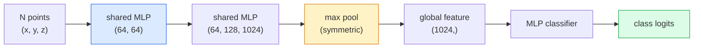

# 3D Vision — Point Clouds & NeRFs

> Tầm nhìn 3D có hai dạng chính. Point clouds là dữ liệu thô từ cảm biến. NeRFs là trường thể tích (volumetric field) đã được học. Cả hai đều trả lời cho câu hỏi "cái gì nằm ở đâu trong không gian."

**Type:** Learn + Build
**Languages:** Python
**Prerequisites:** Phase 4 Lesson 03 (CNNs), Phase 1 Lesson 12 (Tensor Operations)
**Time:** ~45 phút

## Mục tiêu học tập

- Phân biệt các biểu diễn 3D tường minh (point cloud, mesh, voxel) và ẩn (signed distance field, NeRF) và thời điểm sử dụng từng loại
- Hiểu thủ thuật hàm đối xứng (symmetric-function) của PointNet giúp mạng thần kinh bất biến với hoán vị (permutation-invariant) trên một tập hợp điểm không có thứ tự
- Theo dõi quá trình forward pass của NeRF: ray casting, volumetric rendering, positional encoding, MLP density+colour head
- Sử dụng `nerfstudio` hoặc `instant-ngp` để tái tạo 3D tiền huấn luyện từ một tập hợp nhỏ các hình ảnh đã xác định vị trí (posed images)

## Vấn đề

Một camera tạo ra hình ảnh 2D. Một cảm biến LIDAR tạo ra một tập hợp các điểm 3D không có thứ tự. Một pipeline structure-from-motion tạo ra một đám mây điểm thưa thớt (sparse cloud) gồm các keypoint 3D. Một NeRF tái tạo toàn bộ cảnh 3D từ một vài hình ảnh đã xác định vị trí. Tất cả những thứ này đều là "tầm nhìn" nhưng không cái nào giống với tensor dày đặc mà một CNN yêu cầu.

Tầm nhìn 3D rất quan trọng vì hầu hết các tác vụ robot giá trị cao đều chạy trong không gian 3D: gắp vật thể, tránh chướng ngại vật, điều hướng, che khuất trong AR, thu thập nội dung 3D. Một kỹ sư thị giác chỉ hiểu hình ảnh 2D sẽ bị loại khỏi phân khúc phát triển nhanh nhất của lĩnh vực này (nội dung AR/VR, robot, hệ thống lái xe tự động, tái tạo 3D dựa trên NeRF cho bất động sản hoặc xây dựng).

Hai biểu diễn này chiếm ưu thế vì những lý do khác nhau. Point clouds là những gì cảm biến cung cấp miễn phí cho bạn. NeRFs và các thế hệ kế thừa (3D Gaussian splatting, neural SDFs) là những gì bạn nhận được khi yêu cầu một mạng thần kinh học một cảnh.

## Khái niệm

### Point clouds

Point cloud là một tập hợp không có thứ tự gồm N điểm trong R^3, tùy chọn mỗi điểm có các đặc trưng (màu sắc, cường độ, pháp tuyến).

```
cloud = [
  (x1, y1, z1, r1, g1, b1),
  (x2, y2, z2, r2, g2, b2),
  ...
  (xN, yN, zN, rN, gN, bN),
]
```

Không có lưới, không có kết nối. Hai thuộc tính khiến điều này trở nên khó khăn đối với các mạng thần kinh:

- **Bất biến hoán vị (Permutation invariance)** — đầu ra không được phụ thuộc vào thứ tự điểm.
- **N biến thiên (Variable N)** — một mô hình duy nhất phải xử lý được các đám mây có kích thước khác nhau.

PointNet (Qi et al., 2017) đã giải quyết cả hai vấn đề bằng một ý tưởng: áp dụng một MLP dùng chung cho mọi điểm, sau đó tổng hợp bằng một hàm đối xứng (max pool). Kết quả là một vector có kích thước cố định không phụ thuộc vào thứ tự.

```
f(P) = max_{p in P} MLP(p)
```

Đây là cốt lõi của PointNet. Các biến thể sâu hơn (PointNet++, Point Transformer) bổ sung lấy mẫu phân cấp và tổng hợp cục bộ nhưng thủ thuật hàm đối xứng vẫn không thay đổi.

### Kiến trúc PointNet



"Shared MLP" có nghĩa là cùng một MLP chạy trên mọi điểm một cách độc lập. Được triển khai dưới dạng conv 1x1 trên chiều điểm để đạt hiệu quả.

### Neural Radiance Fields (NeRFs)

NeRFs (Mildenhall et al., 2020) đã đặt câu hỏi "chúng ta có thể tái tạo một cảnh 3D từ N bức ảnh không?" và trả lời bằng một mạng thần kinh đóng vai trò là chính cảnh đó. Mạng này ánh xạ `(x, y, z, viewing_direction)` tới `(density, colour)`. Việc render một góc nhìn mới là một vòng lặp ray-casting qua mạng này.

```
NeRF MLP:  (x, y, z, theta, phi) -> (sigma, r, g, b)

To render a pixel (u, v) of a new view:
  1. Cast a ray from the camera through pixel (u, v)
  2. Sample points along the ray at distances t_1, t_2, ..., t_N
  3. Query the MLP at each point
  4. Composite the colours weighted by (1 - exp(-sigma * dt))
  5. The sum is the rendered pixel colour
```

Một hàm mất mát (loss) so sánh pixel được render với pixel thực tế (ground-truth) trong các bức ảnh huấn luyện. Backprop qua bước render sẽ cập nhật các trọng số MLP. Không có ground truth 3D, không có hình học tường minh — cảnh được lưu trữ trong các trọng số MLP.

### Positional encoding trong NeRF

Một MLP thông thường trên `(x, y, z)` không thể biểu diễn các chi tiết tần số cao vì các MLP có xu hướng thiên lệch về tần số thấp. NeRF khắc phục điều này bằng cách mã hóa mỗi tọa độ thành một vector đặc trưng Fourier trước khi đưa vào MLP:

```
gamma(p) = (sin(2^0 pi p), cos(2^0 pi p), sin(2^1 pi p), cos(2^1 pi p), ...)
```

Lên đến L=10 cấp độ tần số. Đây là cùng một thủ thuật mà các transformer sử dụng cho vị trí, và nó xuất hiện trở lại trong điều kiện hóa thời gian (time conditioning) của diffusion (Bài 10). Nếu không có nó, NeRF sẽ trông bị mờ.

### Volumetric rendering

```
C(r) = sum_i T_i * (1 - exp(-sigma_i * delta_i)) * c_i

T_i  = exp(- sum_{j<i} sigma_j * delta_j)
delta_i = t_{i+1} - t_i
```

`T_i` là độ truyền qua (transmittance) — lượng ánh sáng truyền đến điểm i. `(1 - exp(-sigma_i * delta_i))` là độ mờ (opacity) tại điểm i. `c_i` là màu sắc. Pixel cuối cùng là tổng có trọng số dọc theo tia sáng.

### Những gì đã thay thế NeRFs

NeRF thuần túy huấn luyện chậm (hàng giờ) và render chậm (vài giây mỗi ảnh). Các thế hệ kế thừa:

- **Instant-NGP** (2022) — mã hóa hash-grid thay thế đầu vào vị trí của MLP; huấn luyện trong vài giây.
- **Mip-NeRF 360** — xử lý các cảnh không giới hạn và khử răng cưa.
- **3D Gaussian Splatting** (2023) — thay thế trường thể tích bằng hàng triệu Gaussian 3D; huấn luyện trong vài phút, render theo thời gian thực. Đây là tiêu chuẩn sản xuất hiện nay.

Hầu hết mọi sản phẩm NeRF thực tế vào năm 2026 thực chất đều là 3D Gaussian splatting. Mô hình tư duy vẫn là NeRF.

### Các tập dữ liệu và benchmark

- **ShapeNet** — phân loại và phân đoạn các mô hình CAD 3D dưới dạng point cloud.
- **ScanNet** — quét thực tế trong nhà để phân đoạn.
- **KITTI** — point cloud LIDAR ngoài trời cho lái xe tự động.
- **NeRF Synthetic** / **Blended MVS** — tập dữ liệu ảnh đã xác định vị trí để tổng hợp góc nhìn.
- **Mip-NeRF 360** dataset — các cảnh thực tế không giới hạn.

```figure
nerf-rays
```

## Xây dựng

### Bước 1: Phân loại PointNet

```python
import torch
import torch.nn as nn

class PointNet(nn.Module):
    def __init__(self, num_classes=10):
        super().__init__()
        self.mlp1 = nn.Sequential(
            nn.Conv1d(3, 64, 1),    nn.BatchNorm1d(64),   nn.ReLU(inplace=True),
            nn.Conv1d(64, 64, 1),   nn.BatchNorm1d(64),   nn.ReLU(inplace=True),
        )
        self.mlp2 = nn.Sequential(
            nn.Conv1d(64, 128, 1),  nn.BatchNorm1d(128),  nn.ReLU(inplace=True),
            nn.Conv1d(128, 1024, 1), nn.BatchNorm1d(1024), nn.ReLU(inplace=True),
        )
        self.head = nn.Sequential(
            nn.Linear(1024, 512),   nn.BatchNorm1d(512),  nn.ReLU(inplace=True),
            nn.Dropout(0.3),
            nn.Linear(512, 256),    nn.BatchNorm1d(256),  nn.ReLU(inplace=True),
            nn.Dropout(0.3),
            nn.Linear(256, num_classes),
        )

    def forward(self, x):
        # x: (N, 3, num_points) — transposed for Conv1d
        x = self.mlp1(x)
        x = self.mlp2(x)
        x = torch.max(x, dim=-1)[0]       # (N, 1024)
        return self.head(x)

pts = torch.randn(4, 3, 1024)
net = PointNet(num_classes=10)
print(f"output: {net(pts).shape}")
print(f"params: {sum(p.numel() for p in net.parameters()):,}")
```

Khoảng 1.6 triệu tham số. Chạy trên 1.024 điểm mỗi đám mây.

### Bước 2: Positional encoding

```python
def positional_encoding(x, L=10):
    """
    x: (..., D) -> (..., D * 2 * L)
    """
    freqs = 2.0 ** torch.arange(L, dtype=x.dtype, device=x.device)
    args = x.unsqueeze(-1) * freqs * 3.141592653589793
    sinc = torch.cat([args.sin(), args.cos()], dim=-1)
    return sinc.reshape(*x.shape[:-1], -1)

x = torch.randn(5, 3)
y = positional_encoding(x, L=10)
print(f"input:  {x.shape}")
print(f"encoded: {y.shape}     # (5, 60)")
```

Nhân với `2^l * pi` tạo ra các tần số cao dần.

### Bước 3: Tiny NeRF MLP

```python
class TinyNeRF(nn.Module):
    def __init__(self, L_pos=10, L_dir=4, hidden=128):
        super().__init__()
        self.L_pos = L_pos
        self.L_dir = L_dir
        pos_dim = 3 * 2 * L_pos
        dir_dim = 3 * 2 * L_dir
        self.trunk = nn.Sequential(
            nn.Linear(pos_dim, hidden), nn.ReLU(inplace=True),
            nn.Linear(hidden, hidden),  nn.ReLU(inplace=True),
            nn.Linear(hidden, hidden),  nn.ReLU(inplace=True),
            nn.Linear(hidden, hidden),  nn.ReLU(inplace=True),
        )
        self.sigma = nn.Linear(hidden, 1)
        self.color = nn.Sequential(
            nn.Linear(hidden + dir_dim, hidden // 2), nn.ReLU(inplace=True),
            nn.Linear(hidden // 2, 3), nn.Sigmoid(),
        )

    def forward(self, x, d):
        x_enc = positional_encoding(x, self.L_pos)
        d_enc = positional_encoding(d, self.L_dir)
        h = self.trunk(x_enc)
        sigma = torch.relu(self.sigma(h)).squeeze(-1)
        rgb = self.color(torch.cat([h, d_enc], dim=-1))
        return sigma, rgb

nerf = TinyNeRF()
x = torch.randn(128, 3)
d = torch.randn(128, 3)
s, c = nerf(x, d)
print(f"sigma: {s.shape}   rgb: {c.shape}")
```

Rất nhỏ so với NeRF gốc (có 2 nhánh MLP với độ sâu 8). Đủ để minh họa kiến trúc.

### Bước 4: Volumetric rendering dọc theo một tia

```python
def volumetric_render(sigma, rgb, t_vals):
    """
    sigma: (..., N_samples)
    rgb:   (..., N_samples, 3)
    t_vals: (N_samples,) distances along the ray
    """
    delta = torch.cat([t_vals[1:] - t_vals[:-1], torch.full_like(t_vals[:1], 1e10)])
    alpha = 1.0 - torch.exp(-sigma * delta)
    trans = torch.cumprod(torch.cat([torch.ones_like(alpha[..., :1]), 1.0 - alpha + 1e-10], dim=-1), dim=-1)[..., :-1]
    weights = alpha * trans
    rendered = (weights.unsqueeze(-1) * rgb).sum(dim=-2)
    depth = (weights * t_vals).sum(dim=-1)
    return rendered, depth, weights


N = 64
t_vals = torch.linspace(2.0, 6.0, N)
sigma = torch.rand(N) * 0.5
rgb = torch.rand(N, 3)
rendered, depth, weights = volumetric_render(sigma, rgb, t_vals)
print(f"rendered colour: {rendered.tolist()}")
print(f"depth:           {depth.item():.2f}")
```

Một tia, 64 mẫu, tổng hợp thành một pixel RGB và một độ sâu.

## Sử dụng

Đối với công việc thực tế:

- `nerfstudio` (Tancik et al.) — thư viện tham chiếu hiện tại cho NeRF / Instant-NGP / Gaussian Splatting. Dòng lệnh cộng với trình xem web.
- `pytorch3d` (Meta) — render vi phân, tiện ích point-cloud, các thao tác mesh.
- `open3d` — xử lý point cloud, đăng ký (registration), trực quan hóa.

Để triển khai, 3D Gaussian splatting đã thay thế phần lớn NeRF thuần túy vì nó render nhanh hơn 100 lần. Chất lượng tái tạo tương đương.

## Triển khai

Bài học này tạo ra:

- `outputs/prompt-3d-task-router.md` — một prompt định tuyến đến biểu diễn 3D phù hợp (point cloud, mesh, voxel, NeRF, Gaussian splat) dựa trên tác vụ và dữ liệu đầu vào.
- `outputs/skill-point-cloud-loader.md` — một kỹ năng viết PyTorch `Dataset` cho các tệp .ply / .pcd / .xyz với chuẩn hóa, căn giữa và lấy mẫu điểm chính xác.

## Bài tập

1. **(Dễ)** Chứng minh PointNet bất biến với hoán vị: chạy cùng một đám mây hai lần, một lần với các điểm bị xáo trộn. Xác minh đầu ra giống hệt nhau (ngoại trừ nhiễu dấu phẩy động).
2. **(Trung bình)** Triển khai hàm tạo tia tối thiểu, với các thông số nội tại và vị trí camera, tạo ra các điểm gốc và hướng tia cho mọi pixel của hình ảnh H x W.
3. **(Khó)** Huấn luyện một TinyNeRF trên tập dữ liệu tổng hợp các góc nhìn đã render của một khối lập phương màu (được tạo qua render vi phân hoặc ray tracer đơn giản). Báo cáo loss render tại epoch 1, 10 và 100. Tại epoch nào mô hình tạo ra các góc nhìn có thể nhận dạng được?

## Thuật ngữ chính

| Thuật ngữ | Cách gọi thông thường | Ý nghĩa thực tế |
|------|----------------|----------------------|
| Point cloud | "Điểm 3D từ LIDAR" | Tập hợp không thứ tự các (x, y, z) + đặc trưng tùy chọn mỗi điểm |
| PointNet | "Mạng thần kinh đầu tiên trên point cloud" | MLP dùng chung mỗi điểm + gộp đối xứng (max); bất biến hoán vị theo cấu trúc |
| NeRF | "MLP là chính cảnh đó" | Mạng ánh xạ (x, y, z, dir) tới (mật độ, màu sắc); render bằng ray casting |
| Positional encoding | "Đặc trưng Fourier" | Mã hóa mỗi tọa độ thành sin/cos ở nhiều tần số để vượt qua thiên lệch tần số thấp của MLP |
| Volumetric rendering | "Tích phân tia" | Tổng hợp các mẫu dọc theo tia thành một pixel duy nhất sử dụng độ truyền qua và alpha |
| Instant-NGP | "Hash-grid NeRF" | Thay thế MLP tọa độ của NeRF bằng hash grid đa độ phân giải; nhanh hơn 100-1000 lần |
| 3D Gaussian splatting | "Hàng triệu Gaussian" | Cảnh = tập hợp các Gaussian 3D; render thời gian thực, huấn luyện trong vài phút |
| SDF | "Signed distance field" | Hàm trả về khoảng cách có dấu tới bề mặt gần nhất; một biểu diễn ẩn khác |

## Đọc thêm

- [PointNet (Qi et al., 2017)](https://arxiv.org/abs/1612.00593) — bộ phân loại bất biến hoán vị
- [NeRF (Mildenhall et al., 2020)](https://arxiv.org/abs/2003.08934) — bài báo biến việc tái tạo 3D từ ảnh thành bài toán mạng thần kinh
- [Instant-NGP (Müller et al., 2022)](https://arxiv.org/abs/2201.05989) — hash grids, tăng tốc 1000 lần
- [3D Gaussian Splatting (Kerbl et al., 2023)](https://arxiv.org/abs/2308.04079) — kiến trúc thay thế NeRF trong sản xuất