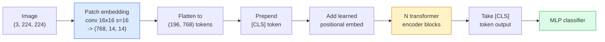

# Vision Transformers (ViT)

> Cắt ảnh thành các bản vá (patch), coi mỗi bản vá như một từ, và chạy một transformer tiêu chuẩn. Không cần nhìn lại.

**Type:** Build
**Languages:** Python
**Prerequisites:** Phase 7 Lesson 02 (Self-Attention), Phase 4 Lesson 04 (Image Classification)
**Time:** ~45 phút

## Mục tiêu học tập

- Triển khai patch embedding, learned positional embedding, class token, và các khối transformer encoder từ đầu để xây dựng một ViT tối giản.
- Giải thích lý do tại sao ViT từng được cho là cần dữ liệu tiền huấn luyện khổng lồ cho đến khi DeiT và MAE chứng minh điều ngược lại.
- So sánh ViT, Swin, và ConvNeXt dựa trên các tiền đề kiến trúc (không có, local window attention, conv backbone).
- Fine-tune một ViT đã được tiền huấn luyện trên một tập dữ liệu nhỏ bằng cách sử dụng `timm` và quy trình linear-probe / fine-tune tiêu chuẩn.

## Vấn đề

Trong một thập kỷ, convolution đồng nghĩa với thị giác máy tính (computer vision). Các CNN có các inductive bias mạnh mẽ — tính cục bộ (locality), tính bất biến tịnh tiến (translation equivariance) — mà không ai nghĩ rằng có thể thay thế được. Sau đó, Dosovitskiy và cộng sự (2020) đã chỉ ra rằng một transformer thuần túy áp dụng trên các bản vá ảnh đã được làm phẳng, không cần bất kỳ cơ chế convolution nào, có thể ngang bằng hoặc vượt qua các CNN tốt nhất ở quy mô lớn.

Điểm mấu chốt nằm ở "quy mô lớn". ViT trên ImageNet-1k thua ResNet. ViT được tiền huấn luyện trên ImageNet-21k hoặc JFT-300M rồi fine-tune trên ImageNet-1k thì lại thắng. Kết luận là các transformer thiếu các tiền đề hữu ích nhưng có thể học chúng từ đủ dữ liệu. Các nghiên cứu sau đó (DeiT, MAE, DINO) cho thấy với các quy trình huấn luyện phù hợp — tăng cường dữ liệu mạnh, tiền huấn luyện tự giám sát, chưng cất (distillation) — ViT cũng huấn luyện tốt trên dữ liệu nhỏ.

Đến năm 2026, các CNN thuần túy vẫn cạnh tranh tốt trên các thiết bị biên (ConvNeXt là mạnh nhất), nhưng transformer thống trị mọi lĩnh vực khác: phân đoạn (Mask2Former, SegFormer), phát hiện (DETR, RT-DETR), đa phương thức (CLIP, SigLIP), video (VideoMAE, VJEPA). Cấu trúc khối ViT là thứ cần phải nắm vững.

## Khái niệm

### Quy trình (Pipeline)



Bảy bước. Patches -> tokens -> attention -> classifier. Mọi biến thể (DeiT, Swin, ConvNeXt, MAE pretraining) đều thay đổi một hoặc hai trong số bảy bước này và giữ nguyên phần còn lại.

### Patch embedding

Conv đầu tiên là bí mật. Kích thước kernel 16, stride 16, vì vậy một ảnh 224x224 trở thành lưới 14x14 gồm các bản vá 16x16, mỗi bản vá được chiếu (project) thành một embedding 768 chiều. Conv đơn lẻ đó vừa thực hiện chia bản vá vừa chiếu tuyến tính.

```
Input:  (3, 224, 224)
Conv (3 -> 768, k=16, s=16, no padding):
Output: (768, 14, 14)
Flatten spatial: (196, 768)
```

196 bản vá = 196 token. Kích thước đặc trưng của mỗi token là 768 (ViT-B), 1024 (ViT-L), hoặc 1280 (ViT-H).

### Class token

Một vector học được (learned vector) được thêm vào phía trước chuỗi:

```
tokens = [CLS; patch_1; patch_2; ...; patch_196]   shape (197, 768)
```

Sau N khối transformer, đầu ra `[CLS]` là biểu diễn ảnh toàn cục. Đầu phân loại (classification head) chỉ đọc vector này.

### Positional embedding

Transformer không có khái niệm tích hợp về vị trí không gian. Thêm một vector học được vào mỗi token:

```
tokens = tokens + learned_pos_embedding   (also shape (197, 768))
```

Embedding này là một tham số của mô hình; quá trình huấn luyện dựa trên gradient sẽ điều chỉnh nó theo cấu trúc ảnh 2D. Các phương án thay thế 2D hình sin tồn tại nhưng hiếm khi được sử dụng trong thực tế.

### Khối Transformer encoder

Tiêu chuẩn. Multi-head self-attention, MLP, kết nối tắt (residual connections), pre-LayerNorm.

```
x = x + MSA(LN(x))
x = x + MLP(LN(x))

MLP is two-layer with GELU: Linear(d -> 4d) -> GELU -> Linear(4d -> d)
```

ViT-B/16 xếp chồng 12 khối này, mỗi khối có 12 attention head, tổng cộng 86 triệu tham số.

### Tại sao dùng pre-LN

Các transformer đời đầu sử dụng post-LN (`x = LN(x + sublayer(x))`) và gặp khó khăn khi huấn luyện quá 6-8 lớp mà không cần warmup. Pre-LN (`x = x + sublayer(LN(x))`) huấn luyện các mạng sâu hơn một cách ổn định mà không cần warmup. Mọi ViT và mọi LLM hiện đại đều sử dụng pre-LN.

### Đánh đổi kích thước bản vá (Patch size)

- Bản vá 16x16 -> 196 token, tiêu chuẩn.
- Bản vá 32x32 -> 49 token, nhanh hơn nhưng độ phân giải thấp hơn.
- Bản vá 8x8 -> 784 token, chi tiết hơn nhưng chi phí attention O(n^2) tăng rất tệ.

Bản vá lớn hơn = ít token hơn = nhanh hơn nhưng ít chi tiết không gian hơn. SwinV2 sử dụng bản vá 4x4 trong các cửa sổ phân cấp.

### Quy trình của DeiT để huấn luyện ViT trên ImageNet-1k

ViT gốc cần JFT-300M để đánh bại CNN. DeiT (Touvron và cộng sự, 2020) đã huấn luyện ViT-B đạt 81.8% top-1 trên ImageNet-1k chỉ với bốn thay đổi:

1. Tăng cường dữ liệu mạnh: RandAugment, Mixup, CutMix, Random Erasing.
2. Stochastic depth (loại bỏ ngẫu nhiên các khối trong quá trình huấn luyện).
3. Repeated augmentation (cùng một ảnh được lấy mẫu 3 lần mỗi batch).
4. Chưng cất từ giáo viên CNN (tùy chọn, nâng cao độ chính xác hơn nữa).

Mọi quy trình huấn luyện ViT hiện đại đều bắt nguồn từ DeiT.

### Swin vs ConvNeXt

- **Swin** (Liu và cộng sự, 2021) — attention dựa trên cửa sổ. Mỗi khối thực hiện attention trong một cửa sổ cục bộ; các khối xen kẽ dịch chuyển cửa sổ để trộn thông tin giữa các cửa sổ. Mang lại tiền đề cục bộ giống CNN trong khi vẫn giữ toán tử attention.
- **ConvNeXt** (Liu và cộng sự, 2022) — CNN được thiết kế lại phù hợp với các lựa chọn kiến trúc của Swin (depthwise convs, LayerNorm, GELU, inverted bottleneck). Cho thấy khoảng cách không phải là "attention vs convolution" mà là "quy trình huấn luyện hiện đại + kiến trúc".

Năm 2026, ConvNeXt-V2 và Swin-V2 đều đạt chuẩn sản xuất; lựa chọn đúng phụ thuộc vào stack suy luận của bạn (ConvNeXt biên dịch tốt hơn cho thiết bị biên) và tập dữ liệu tiền huấn luyện.

### Tiền huấn luyện MAE

Masked Autoencoder (He và cộng sự, 2022): che 75% các bản vá một cách ngẫu nhiên, huấn luyện encoder chỉ xử lý 25% phần hiển thị, huấn luyện một decoder nhỏ để tái tạo các bản vá bị che từ đầu ra của encoder. Sau khi tiền huấn luyện, loại bỏ decoder và fine-tune encoder.

MAE giúp ViT có thể huấn luyện trên ImageNet-1k, đạt SOTA, và là quy trình tự giám sát mặc định hiện nay.

```figure
batchnorm-inference
```

## Xây dựng

### Bước 1: Patch embedding

```python
import torch
import torch.nn as nn

class PatchEmbedding(nn.Module):
    def __init__(self, in_channels=3, patch_size=16, dim=192, image_size=64):
        super().__init__()
        assert image_size % patch_size == 0
        self.proj = nn.Conv2d(in_channels, dim, kernel_size=patch_size, stride=patch_size)
        num_patches = (image_size // patch_size) ** 2
        self.num_patches = num_patches

    def forward(self, x):
        x = self.proj(x)
        return x.flatten(2).transpose(1, 2)
```

Một conv, một flatten, một transpose. Đó là toàn bộ bước chuyển đổi từ ảnh sang token.

### Bước 2: Khối Transformer

Pre-LN, multi-head self-attention, MLP với GELU, kết nối tắt.

```python
class Block(nn.Module):
    def __init__(self, dim, num_heads, mlp_ratio=4, dropout=0.0):
        super().__init__()
        self.ln1 = nn.LayerNorm(dim)
        self.attn = nn.MultiheadAttention(dim, num_heads, dropout=dropout, batch_first=True)
        self.ln2 = nn.LayerNorm(dim)
        self.mlp = nn.Sequential(
            nn.Linear(dim, dim * mlp_ratio),
            nn.GELU(),
            nn.Dropout(dropout),
            nn.Linear(dim * mlp_ratio, dim),
            nn.Dropout(dropout),
        )

    def forward(self, x):
        a, _ = self.attn(self.ln1(x), self.ln1(x), self.ln1(x), need_weights=False)
        x = x + a
        x = x + self.mlp(self.ln2(x))
        return x
```

`nn.MultiheadAttention` xử lý việc chia thành các head, scaled dot-product, và output projection. `batch_first=True` để các hình dạng là `(N, seq, dim)`.

### Bước 3: ViT

```python
class ViT(nn.Module):
    def __init__(self, image_size=64, patch_size=16, in_channels=3,
                 num_classes=10, dim=192, depth=6, num_heads=3, mlp_ratio=4):
        super().__init__()
        self.patch = PatchEmbedding(in_channels, patch_size, dim, image_size)
        num_patches = self.patch.num_patches
        self.cls_token = nn.Parameter(torch.zeros(1, 1, dim))
        self.pos_embed = nn.Parameter(torch.zeros(1, num_patches + 1, dim))
        self.blocks = nn.ModuleList([
            Block(dim, num_heads, mlp_ratio) for _ in range(depth)
        ])
        self.ln = nn.LayerNorm(dim)
        self.head = nn.Linear(dim, num_classes)
        nn.init.trunc_normal_(self.pos_embed, std=0.02)
        nn.init.trunc_normal_(self.cls_token, std=0.02)

    def forward(self, x):
        x = self.patch(x)
        cls = self.cls_token.expand(x.size(0), -1, -1)
        x = torch.cat([cls, x], dim=1)
        x = x + self.pos_embed
        for blk in self.blocks:
            x = blk(x)
        x = self.ln(x[:, 0])
        return self.head(x)

vit = ViT(image_size=64, patch_size=16, num_classes=10, dim=192, depth=6, num_heads=3)
x = torch.randn(2, 3, 64, 64)
print(f"output: {vit(x).shape}")
print(f"params: {sum(p.numel() for p in vit.parameters()):,}")
```

Khoảng 2.8 triệu tham số — một ViT nhỏ có thể chạy trên CPU. ViT-B thực tế là 86 triệu; cùng định nghĩa lớp với `dim=768, depth=12, num_heads=12`.

### Bước 4: Kiểm tra — suy luận trên một ảnh đơn lẻ

```python
logits = vit(torch.randn(1, 3, 64, 64))
print(f"logits: {logits}")
print(f"probs:  {logits.softmax(-1)}")
```

Nên chạy mà không có lỗi. Xác suất tổng bằng 1.

## Sử dụng

`timm` cung cấp mọi biến thể ViT với trọng số tiền huấn luyện ImageNet. Một dòng lệnh:

```python
import timm

model = timm.create_model("vit_base_patch16_224", pretrained=True, num_classes=10)
```

`timm` là mặc định cho sản xuất đối với vision transformer vào năm 2026. Hỗ trợ ViT, DeiT, Swin, Swin-V2, ConvNeXt, ConvNeXt-V2, MaxViT, MViT, EfficientFormer, và hàng chục loại khác dưới cùng một API.

Đối với công việc đa phương thức (ảnh + văn bản), `transformers` cung cấp CLIP, SigLIP, BLIP-2, LLaVA. Bộ mã hóa ảnh trong tất cả các mô hình đó đều là một biến thể ViT.

## Triển khai

Bài học này tạo ra:

- `outputs/prompt-vit-vs-cnn-picker.md` — một prompt chọn giữa ViT, ConvNeXt, hoặc Swin dựa trên kích thước tập dữ liệu, tài nguyên tính toán và stack suy luận.
- `outputs/skill-vit-patch-and-pos-embed-inspector.md` — một kỹ năng xác minh hình dạng patch embedding và positional embedding của ViT có khớp với độ dài chuỗi dự kiến của mô hình hay không, giúp bắt các lỗi porting phổ biến nhất.

## Bài tập

1. **(Dễ)** In hình dạng của mọi tensor trung gian cho một lượt forward pass qua ViT nhỏ ở trên. Xác nhận: đầu vào `(N, 3, 64, 64)` -> patches `(N, 16, 192)` -> với CLS `(N, 17, 192)` -> đầu vào classifier `(N, 192)` -> đầu ra `(N, num_classes)`.
2. **(Trung bình)** Fine-tune một ViT-S/16 đã tiền huấn luyện `timm` trên tập dữ liệu synthetic-CIFAR từ Bài 4. So sánh với việc fine-tune ResNet-18 trên cùng dữ liệu. Báo cáo thời gian huấn luyện và độ chính xác cuối cùng.
3. **(Khó)** Triển khai tiền huấn luyện MAE cho ViT nhỏ: che 75% các bản vá, huấn luyện encoder + một decoder nhỏ để tái tạo các bản vá bị che. Đánh giá độ chính xác linear-probe trên dữ liệu tổng hợp trước và sau khi tiền huấn luyện.

## Thuật ngữ chính

| Thuật ngữ | Cách gọi thông thường | Ý nghĩa thực tế |
|------|----------------|----------------------|
| Patch embedding | "Conv đầu tiên" | Một conv với kernel size = stride = patch size; biến ảnh thành lưới các token embedding |
| Class token | "[CLS]" | Một vector học được thêm vào trước chuỗi token; đầu ra cuối cùng của nó là biểu diễn ảnh toàn cục |
| Positional embedding | "Learned pos" | Một vector học được thêm vào mỗi token để transformer biết mỗi bản vá đến từ đâu |
| Pre-LN | "LayerNorm trước sublayer" | Biến thể transformer ổn định: `x + sublayer(LN(x))` thay vì `LN(x + sublayer(x))` |
| Multi-head attention | "Attention song song" | Attention transformer tiêu chuẩn được chia thành num_heads không gian con độc lập, sau đó nối lại |
| ViT-B/16 | "Base, patch 16" | Kích thước chuẩn: dim=768, depth=12, heads=12, patch_size=16, image=224; ~86M tham số |
| DeiT | "Data-efficient ViT" | ViT được huấn luyện trên ImageNet-1k với tăng cường dữ liệu mạnh; chứng minh không nhất thiết cần tập dữ liệu tiền huấn luyện khổng lồ |
| MAE | "Masked autoencoder" | Tiền huấn luyện tự giám sát: che 75% bản vá, tái tạo; quy trình tiền huấn luyện ViT thống trị hiện nay |

## Đọc thêm

- [An Image is Worth 16x16 Words (Dosovitskiy và cộng sự, 2020)](https://arxiv.org/abs/2010.11929) — bài báo gốc về ViT
- [DeiT: Data-efficient Image Transformers (Touvron và cộng sự, 2020)](https://arxiv.org/abs/2012.12877) — cách huấn luyện ViT trên ImageNet-1k
- [Masked Autoencoders are Scalable Vision Learners (He và cộng sự, 2022)](https://arxiv.org/abs/2111.06377) — tiền huấn luyện MAE
- [tài liệu timm](https://huggingface.co/docs/timm) — tài liệu tham khảo cho mọi vision transformer bạn sẽ sử dụng trong sản xuất