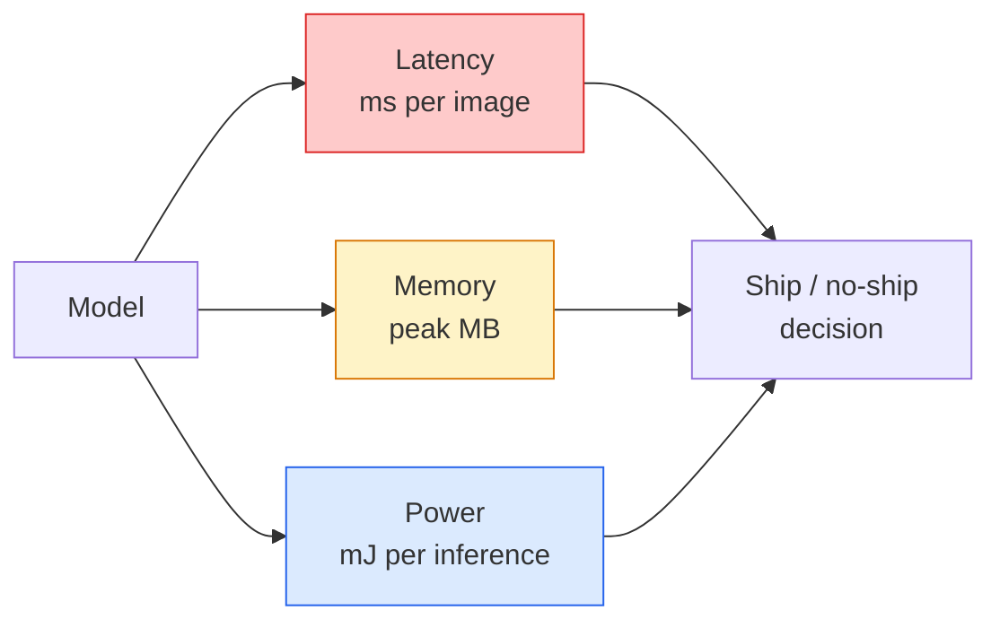

# Real-Time Vision — Edge Deployment

> Edge inference là kỷ luật đưa một mô hình có độ chính xác 90% chạy ở tốc độ 30 fps trên một thiết bị có 2 GB RAM. Mỗi điểm phần trăm độ chính xác đều được đánh đổi bằng độ trễ tính bằng mili giây.

**Type:** Learn + Build
**Languages:** Python
**Prerequisites:** Phase 4 Lesson 04 (Image Classification), Phase 10 Lesson 11 (Quantization)
**Time:** ~75 minutes

## Learning Objectives

- Đo lường độ trễ inference, bộ nhớ đỉnh và throughput cho bất kỳ mô hình PyTorch nào, đồng thời đọc được sự đánh đổi giữa FLOPs / params / độ trễ
- Quantise một mô hình vision sang INT8 bằng phương pháp post-training quantisation của PyTorch và xác minh độ chính xác bị mất < 1%
- Export sang ONNX và biên dịch bằng ONNX Runtime hoặc TensorRT; nêu tên ba lỗi export phổ biến nhất và cách khắc phục
- Giải thích khi nào nên chọn MobileNetV3, EfficientNet-Lite, ConvNeXt-Tiny hoặc MobileViT cho các ràng buộc ở edge

## The Problem

Một mô hình vision tại thời điểm huấn luyện là một con quái vật dấu phẩy động (floating-point). 100 triệu tham số, 10 GFLOPs mỗi lần forward pass, 2 GB VRAM. Không có thứ nào trong số đó phù hợp với điện thoại, hệ thống thông tin giải trí trên ô tô, camera công nghiệp hoặc máy bay không người lái. Việc triển khai một hệ thống vision đồng nghĩa với việc đưa các dự đoán tương tự vào một ngân sách nhỏ hơn 100 lần.

Ba núm điều chỉnh thực hiện phần lớn công việc: lựa chọn mô hình (kiến trúc nhỏ hơn với cùng công thức), quantisation (INT8 thay vì FP32) và inference runtime (ONNX Runtime, TensorRT, Core ML, TFLite). Làm đúng những điều này chính là sự khác biệt giữa một bản demo chạy trên máy trạm và một sản phẩm được xuất xưởng trên một module camera giá 30 USD.

Bài học này thiết lập kỷ luật đo lường trước tiên (bạn không thể tối ưu hóa những gì bạn không thể đo lường), sau đó đi qua ba núm điều chỉnh. Mục tiêu không phải là học mọi edge runtime mà là biết những đòn bẩy nào tồn tại và cách xác minh từng cái hoạt động như bạn nghĩ.

## The Concept

### Ba ngân sách (The three budgets)



- **Latency**: p50, p95, p99. Chỉ lấy trung bình p50 sẽ che giấu hành vi ở phần đuôi (tail behaviour) vốn rất quan trọng đối với các hệ thống thời gian thực.
- **Peak memory**: mức tối đa mà thiết bị từng thấy, không phải mức trung bình ở trạng thái ổn định. Quan trọng vì OOM (Out of Memory) là lỗi chí mạng trên các mục tiêu nhúng.
- **Power / energy**: millijoules trên mỗi lần inference trên thiết bị chạy bằng pin. Thường được tính toán thông qua mức sử dụng CPU/GPU * thời gian.

Một bảng (mô hình, độ trễ, bộ nhớ, độ chính xác) là thứ dùng để đưa ra quyết định ở edge. Mỗi ô được đo trên thiết bị mục tiêu, không phải trên máy trạm.

### Kỷ luật đo lường

Ba quy tắc mà mọi edge profile nên tuân theo:

1. **Warm up** mô hình với 5-10 lần forward pass giả trước khi đo. Cache lạnh và JIT compilation tạo ra các con số ban đầu không đại diện.
2. **Synchronise** các workload GPU với `torch.cuda.synchronize()` trước và sau khối thời gian. Nếu không có điều này, bạn đang đo việc gửi kernel (kernel dispatch) chứ không phải thực thi kernel (kernel execution).
3. **Cố định kích thước đầu vào** theo độ phân giải sản xuất. Độ trễ ở 224x224 không phải là độ trễ ở 512x512.

### FLOPs như một đại diện

FLOPs (số phép tính dấu phẩy động trên mỗi lần inference) là một đại diện rẻ tiền, không phụ thuộc vào thiết bị cho độ trễ. Hữu ích để so sánh kiến trúc, nhưng gây hiểu lầm nếu coi là thời gian thực tế. Một mô hình có nhiều hơn 10% FLOPs có thể nhanh gấp 2 lần trong thực tế vì nó sử dụng các toán tử thân thiện với phần cứng (depthwise convs biên dịch tốt, các convs 7x7 lớn thì không).

Quy tắc: sử dụng FLOPs để tìm kiếm kiến trúc, sử dụng độ trễ trên thiết bị để đưa ra quyết định triển khai.

### Quantisation trong một đoạn văn

Thay thế trọng số và activation FP32 bằng INT8. Kích thước mô hình giảm 4 lần, băng thông bộ nhớ giảm 4 lần, tính toán giảm 2-4 lần trên phần cứng có nhân INT8 (mọi SoC di động hiện đại, mọi GPU NVIDIA có Tensor Cores). Mất độ chính xác trên các tác vụ vision thường là 0.1-1 điểm phần trăm với post-training static quantisation.

Các loại:

- **Dynamic** — quantise trọng số sang INT8, activation được tính bằng FP. Dễ, tăng tốc nhỏ.
- **Static (post-training)** — quantise trọng số + hiệu chỉnh phạm vi activation trên một tập hiệu chỉnh nhỏ. Nhanh hơn nhiều so với dynamic.
- **Quantisation-aware training (QAT)** — mô phỏng quantisation trong quá trình huấn luyện để mô hình học cách thích nghi. Độ chính xác tốt nhất, cần dữ liệu có nhãn.

Đối với vision, post-training static quantisation mang lại 95% lợi ích với 5% nỗ lực. Chỉ sử dụng QAT khi mức độ mất độ chính xác từ PTQ là không thể chấp nhận được.

### Pruning và distillation

- **Pruning** — loại bỏ các trọng số không quan trọng (dựa trên độ lớn) hoặc các kênh (có cấu trúc). Hoạt động tốt trên các mô hình quá tham số; ít hữu ích hơn trên các kiến trúc vốn đã nhỏ gọn.
- **Distillation** — huấn luyện một học sinh nhỏ để bắt chước logits của một giáo viên lớn. Thường khôi phục hầu hết độ chính xác bị mất do thu nhỏ mô hình. Tiêu chuẩn cho các mô hình edge sản xuất.

### Các inference runtime

- **PyTorch eager** — chậm, không dùng để triển khai. Chỉ dùng để phát triển.
- **TorchScript** — cũ. Đã được thay thế bởi `torch.compile` và export ONNX.
- **ONNX Runtime** — runtime trung lập. CPU, CUDA, CoreML, TensorRT, OpenVINO đều có các ONNX provider. Hãy bắt đầu từ đây.
- **TensorRT** — trình biên dịch của NVIDIA. Độ trễ tốt nhất trên GPU NVIDIA (máy trạm và Jetson). Tích hợp với ONNX Runtime hoặc độc lập.
- **Core ML** — runtime của Apple cho iOS/macOS. Cần `.mlmodel` hoặc `.mlpackage`.
- **TFLite** — runtime của Google cho Android/ARM. Cần `.tflite`.
- **OpenVINO** — runtime của Intel cho CPU/VPU. Cần `.xml` + `.bin`.

Trong thực tế: export PyTorch -> ONNX -> chọn runtime cho mục tiêu. ONNX là ngôn ngữ chung (lingua franca).

### Bộ chọn kiến trúc Edge

| Ngân sách | Mô hình | Tại sao |
|--------|-------|-----|
| < 3M params | MobileNetV3-Small | Biên dịch ở mọi nơi, baseline tốt |
| 3-10M | EfficientNet-Lite-B0 | Độ chính xác trên mỗi tham số tốt nhất trên TFLite |
| 10-20M | ConvNeXt-Tiny | Độ chính xác trên mỗi tham số tốt nhất, thân thiện với CPU |
| 20-30M | MobileViT-S hoặc EfficientViT | Transformer với độ chính xác ImageNet |
| 30-80M | Swin-V2-Tiny | Nếu stack hỗ trợ window attention |

Quantise tất cả các mô hình này sang INT8 trừ khi bạn có lý do cụ thể để không làm vậy.

```figure
cnn-param-count
```

## Build It

### Bước 1: Đo độ trễ chính xác

```python
import time
import torch

def measure_latency(model, input_shape, device="cpu", warmup=10, iters=50):
    model = model.to(device).eval()
    x = torch.randn(input_shape, device=device)
    with torch.no_grad():
        for _ in range(warmup):
            model(x)
        if device == "cuda":
            torch.cuda.synchronize()
        times = []
        for _ in range(iters):
            if device == "cuda":
                torch.cuda.synchronize()
            t0 = time.perf_counter()
            model(x)
            if device == "cuda":
                torch.cuda.synchronize()
            times.append((time.perf_counter() - t0) * 1000)
    times.sort()
    return {
        "p50_ms": times[len(times) // 2],
        "p95_ms": times[int(len(times) * 0.95)],
        "p99_ms": times[int(len(times) * 0.99)],
        "mean_ms": sum(times) / len(times),
    }
```

Warm up, đồng bộ hóa, sử dụng `time.perf_counter()`. Báo cáo các phân vị (percentiles), không chỉ giá trị trung bình.

### Bước 2: Đếm tham số và FLOPs

```python
def parameter_count(model):
    return sum(p.numel() for p in model.parameters())

def flops_estimate(model, input_shape):
    """
    Rough FLOP count for a conv/linear-only model. For production use `fvcore` or `ptflops`.
    """
    total = 0
    def conv_hook(m, inp, out):
        nonlocal total
        c_out, c_in, kh, kw = m.weight.shape
        h, w = out.shape[-2:]
        total += 2 * c_in * c_out * kh * kw * h * w
    def linear_hook(m, inp, out):
        nonlocal total
        total += 2 * m.in_features * m.out_features
    hooks = []
    for m in model.modules():
        if isinstance(m, torch.nn.Conv2d):
            hooks.append(m.register_forward_hook(conv_hook))
        elif isinstance(m, torch.nn.Linear):
            hooks.append(m.register_forward_hook(linear_hook))
    model.eval()
    with torch.no_grad():
        model(torch.randn(input_shape))
    for h in hooks:
        h.remove()
    return total
```

Đối với các dự án thực tế, hãy sử dụng `fvcore.nn.FlopCountAnalysis` hoặc `ptflops`; chúng xử lý chính xác mọi loại module.

### Bước 3: Post-training static quantisation

```python
def quantise_ptq(model, calibration_loader, backend="x86"):
    import torch.ao.quantization as tq
    model = model.eval().cpu()
    model.qconfig = tq.get_default_qconfig(backend)
    tq.prepare(model, inplace=True)
    with torch.no_grad():
        for x, _ in calibration_loader:
            model(x)
    tq.convert(model, inplace=True)
    return model
```

Ba bước: cấu hình, chuẩn bị (chèn observers), hiệu chỉnh với dữ liệu thực, chuyển đổi (fuse + quantise). Yêu cầu mô hình phải được fuse (`Conv -> BN -> ReLU` -> `ConvBnReLU`), điều mà `torch.ao.quantization.fuse_modules` xử lý.

### Bước 4: Export sang ONNX

```python
def export_onnx(model, sample_input, path="model.onnx"):
    model = model.eval()
    torch.onnx.export(
        model,
        sample_input,
        path,
        input_names=["input"],
        output_names=["output"],
        dynamic_axes={"input": {0: "batch"}, "output": {0: "batch"}},
        opset_version=17,
    )
    return path
```

`opset_version=17` là mặc định an toàn vào năm 2026. `dynamic_axes` cho phép bạn chạy mô hình ONNX với batch size tùy ý.

### Bước 5: Benchmark và so sánh các chế độ

```python
import torch.nn as nn
from torchvision.models import mobilenet_v3_small

def compare_regimes():
    model = mobilenet_v3_small(weights=None, num_classes=10)
    params = parameter_count(model)
    flops = flops_estimate(model, (1, 3, 224, 224))
    lat_fp32 = measure_latency(model, (1, 3, 224, 224), device="cpu")
    print(f"FP32 MobileNetV3-Small: {params:,} params  {flops/1e9:.2f} GFLOPs  "
          f"p50={lat_fp32['p50_ms']:.2f}ms  p95={lat_fp32['p95_ms']:.2f}ms")
```

Chạy cùng một hàm cho `resnet50`, `efficientnet_v2_s` và `convnext_tiny` và bạn sẽ có bảng so sánh cần thiết để đưa ra quyết định triển khai.

## Use It

Các stack sản xuất hội tụ vào một trong ba con đường:

- **Web / serverless**: PyTorch -> ONNX -> ONNX Runtime (provider CPU hoặc CUDA). Dễ nhất, đủ tốt cho hầu hết các trường hợp.
- **NVIDIA edge (Jetson, GPU server)**: PyTorch -> ONNX -> TensorRT. Độ trễ tốt nhất, nỗ lực kỹ thuật lớn nhất.
- **Mobile**: PyTorch -> ONNX -> Core ML (iOS) hoặc TFLite (Android). Quantise trước khi export.

Để đo lường, `torch-tb-profiler`, `nvprof` / `nsys` và Instruments trên macOS cung cấp các phân tích chi tiết từng lớp. `benchmark_app` (OpenVINO) và `trtexec` (TensorRT) cung cấp các con số CLI độc lập.

## Ship It

Bài học này tạo ra:

- `outputs/prompt-edge-deployment-planner.md` — một prompt chọn backbone, chiến lược quantisation và runtime dựa trên thiết bị mục tiêu và SLA độ trễ.
- `outputs/skill-latency-profiler.md` — một kỹ năng viết script benchmark độ trễ hoàn chỉnh với warmup, đồng bộ hóa, phân vị và theo dõi bộ nhớ.

## Exercises

1. **(Dễ)** Đo độ trễ p50 cho `resnet18`, `mobilenet_v3_small`, `efficientnet_v2_s` và `convnext_tiny` ở 224x224 trên CPU. Báo cáo bảng và xác định kiến trúc nào có độ chính xác trên mỗi ms tốt nhất.
2. **(Trung bình)** Áp dụng post-training static quantisation cho `mobilenet_v3_small`. Báo cáo độ trễ FP32 so với INT8 và mức độ mất độ chính xác trên một tập con CIFAR-10 hoặc tương tự.
3. **(Khó)** Export `convnext_tiny` sang ONNX, chạy nó qua `onnxruntime` với `CPUExecutionProvider` và so sánh độ trễ với baseline PyTorch eager. Xác định lớp đầu tiên mà ONNX Runtime nhanh hơn và giải thích tại sao.

## Key Terms

| Thuật ngữ | Cách gọi thông thường | Ý nghĩa thực tế |
|------|----------------|----------------------|
| Latency | "Tốc độ" | Thời gian từ đầu vào đến đầu ra; phân vị p50/p95/p99, không phải trung bình |
| FLOPs | "Kích thước mô hình" | Số phép tính dấu phẩy động mỗi lần forward pass; đại diện thô cho chi phí tính toán |
| INT8 quantisation | "8-bit" | Thay thế trọng số/activation FP32 bằng số nguyên 8-bit; nhỏ hơn ~4 lần, nhanh hơn 2-4 lần |
| PTQ | "Post-training quantisation" | Quantise mô hình đã huấn luyện mà không cần huấn luyện lại; dễ, thường là đủ |
| QAT | "Quantisation-aware training" | Mô phỏng quantisation trong khi huấn luyện; độ chính xác tốt nhất, cần dữ liệu có nhãn |
| ONNX | "Định dạng trung lập" | Định dạng trao đổi mô hình được hỗ trợ bởi mọi inference runtime chính thống |
| TensorRT | "Trình biên dịch NVIDIA" | Biên dịch ONNX thành engine tối ưu cho GPU NVIDIA |
| Distillation | "Giáo viên -> học sinh" | Huấn luyện mô hình nhỏ bắt chước logits của mô hình lớn; khôi phục hầu hết độ chính xác đã mất |

## Further Reading

- [EfficientNet (Tan & Le, 2019)](https://arxiv.org/abs/1905.11946) — compound scaling cho các kiến trúc hiệu quả
- [MobileNetV3 (Howard et al., 2019)](https://arxiv.org/abs/1905.02244) — kiến trúc ưu tiên di động với h-swish và squeeze-excite
- [A Practical Guide to TensorRT Optimization (NVIDIA)](https://developer.nvidia.com/blog/accelerating-model-inference-with-tensorrt-tips-and-best-practices-for-pytorch-users/) — cách thực sự đạt được các con số throughput trong bài báo
- [ONNX Runtime docs](https://onnxruntime.ai/docs/) — quantisation, tối ưu hóa đồ thị, lựa chọn provider