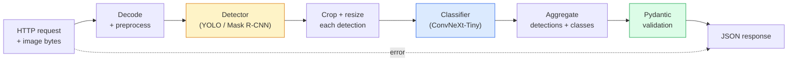

# Xây dựng Pipeline thị giác máy tính hoàn chỉnh — Capstone

> Một hệ thống thị giác máy tính trong môi trường production là một chuỗi các mô hình và quy tắc được kết nối bằng các hợp đồng dữ liệu (data contracts). Các thành phần đã có sẵn trong giai đoạn này; capstone này sẽ kết nối chúng lại với nhau từ đầu đến cuối.

**Type:** Build
**Languages:** Python
**Prerequisites:** Phase 4 Lessons 01-15
**Time:** ~120 phút

## Mục tiêu học tập

- Thiết kế một pipeline thị giác máy tính production có khả năng phát hiện đối tượng, phân loại chúng và xuất ra JSON có cấu trúc — với mọi đường dẫn lỗi được xử lý.
- Tích hợp detector (Mask R-CNN hoặc YOLO), classifier (ConvNeXt-Tiny) và data contract (Pydantic) vào một service duy nhất.
- Benchmark pipeline end-to-end và xác định nút thắt cổ chai đầu tiên (thường là tiền xử lý, sau đó là detector).
- Triển khai một service FastAPI tối giản chấp nhận tải lên hình ảnh, chạy pipeline và trả về các kết quả phát hiện kèm phân loại.

## Vấn đề

Các mô hình thị giác máy tính riêng lẻ rất hữu ích; nhưng các sản phẩm thị giác máy tính là chuỗi kết hợp của chúng. Kiểm kê kệ hàng bán lẻ là một detector cộng với một bộ phân loại sản phẩm cộng với một pipeline OCR giá. Xe tự lái là một detector 2D cộng với detector 3D cộng với segmenter cộng với tracker cộng với planner. Sàng lọc y tế là một segmenter cộng với bộ phân loại vùng cộng với giao diện bác sĩ.

Việc kết nối các chuỗi đó là phần tách biệt giữa một ML prototype và một sản phẩm thực tế. Mỗi giao diện giữa các mô hình là một nơi tiềm ẩn lỗi. Mỗi phép biến đổi tọa độ, mỗi phép chuẩn hóa, mỗi lần thay đổi kích thước mask đều là ứng viên cho các lỗi ngầm (silent-failure). Một pipeline chỉ mạnh bằng giao diện yếu nhất của nó.

Capstone này thiết lập pipeline tối thiểu khả thi: phát hiện + phân loại + đầu ra có cấu trúc + lớp phục vụ (serving layer). Mọi thứ khác trong Phase 4 đều có thể lắp vào khung này: thay Mask R-CNN bằng YOLOv8, thêm OCR head, thêm nhánh segmentation, thêm tracker. Kiến trúc này ổn định; các thành phần có thể thay thế (pluggable).

## Khái niệm

### Pipeline



Bảy giai đoạn. Hai giai đoạn mô hình rất tốn kém; năm giai đoạn còn lại là nơi các lỗi thường trú ngụ.

### Data contracts với Pydantic

Mỗi ranh giới mô hình trở thành một đối tượng có kiểu dữ liệu (typed object). Điều này biến các lỗi ngầm thành các lỗi rõ ràng.

```
Detection(
    box: tuple[float, float, float, float],   # (x1, y1, x2, y2), absolute pixels
    score: float,                              # [0, 1]
    class_id: int,                             # from detector's label map
    mask: Optional[list[list[int]]],           # RLE-encoded if present
)

PipelineResult(
    image_id: str,
    detections: list[Detection],
    classifications: list[Classification],
    inference_ms: float,
)
```

Khi một detector trả về các hộp trong `(cx, cy, w, h)` thay vì `(x1, y1, x2, y2)`, quá trình xác thực của Pydantic sẽ thất bại ngay tại ranh giới và bạn sẽ phát hiện ra ngay lập tức thay vì phải debug một quá trình crop hạ nguồn vốn trả về các vùng trống một cách âm thầm.

### Độ trễ nằm ở đâu

Ba sự thật luôn đúng trong hầu hết các pipeline thị giác máy tính:

1. **Tiền xử lý thường là khối đơn lẻ lớn nhất.** Giải mã JPEG, chuyển đổi không gian màu, thay đổi kích thước — đây là các tác vụ nặng về CPU và dễ bị bỏ qua.
2. **Detector chiếm ưu thế về thời gian GPU.** 70-90% thời gian GPU nằm ở quá trình forward pass của detector.
3. **Hậu xử lý (NMS, mã hóa/giải mã RLE) rẻ trên GPU, đắt trên CPU.** Luôn luôn profile với mục tiêu thực tế.

Biết được sự phân bổ này là điều biến việc tối ưu hóa thành một danh sách ưu tiên.

### Các chế độ lỗi

- **Không phát hiện được gì** — trả về danh sách rỗng, không làm crash hệ thống. Ghi log.
- **Hộp nằm ngoài biên** — ép về kích thước ảnh trước khi crop.
- **Crop quá nhỏ** — bỏ qua phân loại cho các hộp nhỏ hơn đầu vào tối thiểu của bộ phân loại.
- **Tải lên bị hỏng** — phản hồi 400 với mã lỗi cụ thể, không phải 500.
- **Lỗi tải mô hình** — thất bại khi khởi động service, không phải ở request đầu tiên.

Một pipeline production xử lý từng lỗi này mà không viết các `try/except` chung chung che giấu lỗi. Mỗi lỗi đều có mã định danh và phản hồi riêng.

### Batching

Một service production phục vụ nhiều client. Batching các phát hiện và phân loại trên các request giúp nhân rộng thông lượng. Đánh đổi: độ trễ tăng thêm do chờ đợi batch đầy. Thiết lập điển hình: thu thập các request trong tối đa 20ms, batch lại, xử lý, phân phối phản hồi. `torchserve` và `triton` thực hiện việc này một cách tự nhiên; các service nhỏ với tải dự đoán được thường tự xây dựng micro-batcher riêng.

```figure
v4-vision-pipeline
```

## Xây dựng

### Bước 1: Data contracts

```python
from pydantic import BaseModel, Field
from typing import List, Optional, Tuple

class Detection(BaseModel):
    box: Tuple[float, float, float, float]
    score: float = Field(ge=0, le=1)
    class_id: int = Field(ge=0)
    mask_rle: Optional[str] = None


class Classification(BaseModel):
    detection_index: int
    class_id: int
    class_name: str
    score: float = Field(ge=0, le=1)


class PipelineResult(BaseModel):
    image_id: str
    detections: List[Detection]
    classifications: List[Classification]
    inference_ms: float
```

Năm giây viết code giúp tiết kiệm một giờ debug trên bất kỳ pipeline nghiêm túc nào.

### Bước 2: Lớp Pipeline tối giản

```python
import time
import numpy as np
import torch
from PIL import Image

class VisionPipeline:
    def __init__(self, detector, classifier, class_names,
                 device="cpu", min_crop=32):
        self.detector = detector.to(device).eval()
        self.classifier = classifier.to(device).eval()
        self.class_names = class_names
        self.device = device
        self.min_crop = min_crop

    def preprocess(self, image):
        """
        image: PIL.Image or np.ndarray (H, W, 3) uint8
        returns: CHW float tensor on device
        """
        if isinstance(image, Image.Image):
            image = np.asarray(image.convert("RGB"))
        tensor = torch.from_numpy(image).permute(2, 0, 1).float() / 255.0
        return tensor.to(self.device)

    @torch.no_grad()
    def detect(self, image_tensor):
        return self.detector([image_tensor])[0]

    @torch.no_grad()
    def classify(self, crops):
        if len(crops) == 0:
            return []
        batch = torch.stack(crops).to(self.device)
        logits = self.classifier(batch)
        probs = logits.softmax(-1)
        scores, cls = probs.max(-1)
        return list(zip(cls.tolist(), scores.tolist()))

    def run(self, image, image_id="anonymous"):
        t0 = time.perf_counter()
        tensor = self.preprocess(image)
        det = self.detect(tensor)

        crops = []
        detections = []
        valid_indices = []
        for i, (box, score, cls) in enumerate(zip(det["boxes"], det["scores"], det["labels"])):
            x1, y1, x2, y2 = [max(0, int(b)) for b in box.tolist()]
            x2 = min(x2, tensor.shape[-1])
            y2 = min(y2, tensor.shape[-2])
            detections.append(Detection(
                box=(x1, y1, x2, y2),
                score=float(score),
                class_id=int(cls),
            ))
            if (x2 - x1) < self.min_crop or (y2 - y1) < self.min_crop:
                continue
            crop = tensor[:, y1:y2, x1:x2]
            crop = torch.nn.functional.interpolate(
                crop.unsqueeze(0),
                size=(224, 224),
                mode="bilinear",
                align_corners=False,
            )[0]
            crops.append(crop)
            valid_indices.append(i)

        class_preds = self.classify(crops)

        classifications = []
        for valid_idx, (cls_id, cls_score) in zip(valid_indices, class_preds):
            classifications.append(Classification(
                detection_index=valid_idx,
                class_id=int(cls_id),
                class_name=self.class_names[cls_id],
                score=float(cls_score),
            ))

        return PipelineResult(
            image_id=image_id,
            detections=detections,
            classifications=classifications,
            inference_ms=(time.perf_counter() - t0) * 1000,
        )
```

Mỗi giao diện đều được định kiểu. Mỗi đường dẫn lỗi đều có quyết định xử lý cụ thể.

### Bước 3: Kết nối detector và classifier

```python
from torchvision.models.detection import maskrcnn_resnet50_fpn_v2
from torchvision.models import convnext_tiny

# Use ImageNet-pretrained weights for a realistic pipeline without training
detector = maskrcnn_resnet50_fpn_v2(weights="DEFAULT")
classifier = convnext_tiny(weights="DEFAULT")
class_names = [f"imagenet_class_{i}" for i in range(1000)]

pipe = VisionPipeline(detector, classifier, class_names)

# Smoke test with a synthetic image
test_image = (np.random.rand(400, 600, 3) * 255).astype(np.uint8)
result = pipe.run(test_image, image_id="demo")
print(result.model_dump_json(indent=2)[:500])
```

### Bước 4: Service FastAPI

```python
from fastapi import FastAPI, UploadFile, HTTPException
from io import BytesIO

app = FastAPI()
pipe = None  # initialised on startup

@app.on_event("startup")
def load():
    global pipe
    detector = maskrcnn_resnet50_fpn_v2(weights="DEFAULT").eval()
    classifier = convnext_tiny(weights="DEFAULT").eval()
    pipe = VisionPipeline(detector, classifier, class_names=[f"c{i}" for i in range(1000)])

@app.post("/detect")
async def detect_endpoint(file: UploadFile):
    if file.content_type not in {"image/jpeg", "image/png", "image/webp"}:
        raise HTTPException(status_code=400, detail="unsupported image type")
    data = await file.read()
    try:
        img = Image.open(BytesIO(data)).convert("RGB")
    except Exception:
        raise HTTPException(status_code=400, detail="cannot decode image")
    result = pipe.run(img, image_id=file.filename or "upload")
    return result.model_dump()
```

Chạy với `uvicorn main:app --host 0.0.0.0 --port 8000`. Kiểm tra với `curl -F 'file=@dog.jpg' http://localhost:8000/detect`.

### Bước 5: Benchmark pipeline

```python
import time

def benchmark(pipe, num_runs=20, image_size=(400, 600)):
    img = (np.random.rand(*image_size, 3) * 255).astype(np.uint8)
    pipe.run(img)  # warm up

    stages = {"preprocess": [], "detect": [], "classify": [], "total": []}
    for _ in range(num_runs):
        t0 = time.perf_counter()
        tensor = pipe.preprocess(img)
        t1 = time.perf_counter()
        det = pipe.detect(tensor)
        t2 = time.perf_counter()
        crops = []
        for box in det["boxes"]:
            x1, y1, x2, y2 = [max(0, int(b)) for b in box.tolist()]
            x2 = min(x2, tensor.shape[-1])
            y2 = min(y2, tensor.shape[-2])
            if (x2 - x1) >= pipe.min_crop and (y2 - y1) >= pipe.min_crop:
                crop = tensor[:, y1:y2, x1:x2]
                crop = torch.nn.functional.interpolate(
                    crop.unsqueeze(0), size=(224, 224), mode="bilinear", align_corners=False
                )[0]
                crops.append(crop)
        pipe.classify(crops)
        t3 = time.perf_counter()
        stages["preprocess"].append((t1 - t0) * 1000)
        stages["detect"].append((t2 - t1) * 1000)
        stages["classify"].append((t3 - t2) * 1000)
        stages["total"].append((t3 - t0) * 1000)

    for stage, times in stages.items():
        times.sort()
        print(f"{stage:12s}  p50={times[len(times)//2]:7.1f} ms  p95={times[int(len(times)*0.95)]:7.1f} ms")
```

Kết quả điển hình trên CPU: tiền xử lý ~3 ms, phát hiện 300-500 ms, phân loại 20-40 ms, tổng cộng 350-550 ms. Trên GPU, phát hiện mất 20-40 ms và tiền xử lý + phân loại bắt đầu quan trọng hơn về mặt tương đối.

## Sử dụng

Các template production hội tụ về cùng một cấu trúc, cộng với:

- **Model versioning** — luôn ghi log tên mô hình và hash trọng số trong phản hồi.
- **Per-request trace IDs** — ghi log thời gian của từng giai đoạn cho mỗi request để bạn có thể tương quan các phản hồi chậm với các giai đoạn.
- **Fallback path** — nếu bộ phân loại bị timeout, hãy trả về các kết quả phát hiện mà không có phân loại thay vì làm hỏng toàn bộ request.
- **Safety filters** — các bộ lọc NSFW / PII chạy sau khi phân loại, trước khi phản hồi rời khỏi service.
- **Batch endpoint** — một `/detect_batch` chấp nhận danh sách các URL hình ảnh để xử lý hàng loạt.

Đối với việc phục vụ production, `torchserve`, `Triton Inference Server` và `BentoML` xử lý batching, versioning, metrics và kiểm tra sức khỏe (health checks) ngay lập tức. Chạy `FastAPI` trực tiếp là ổn cho các prototype và sản phẩm quy mô nhỏ.

## Triển khai

Bài học này tạo ra:

- `outputs/prompt-vision-service-shape-reviewer.md` — một prompt đánh giá code của service thị giác máy tính về các vi phạm hình dạng hợp đồng/phản hồi và chỉ ra lỗi phá vỡ đầu tiên.
- `outputs/skill-pipeline-budget-planner.md` — một kỹ năng mà khi có độ trễ và thông lượng mục tiêu, sẽ gán ngân sách thời gian cho từng giai đoạn pipeline và gắn cờ giai đoạn nào sẽ vượt quá ngân sách trước tiên.

## Bài tập

1. **(Dễ)** Chạy pipeline trên 10 hình ảnh từ bất kỳ tập dữ liệu mở nào. Báo cáo thời gian trung bình mỗi giai đoạn và sự phân bổ số lượng phát hiện trên mỗi hình ảnh.
2. **(Trung bình)** Thêm trường đầu ra mask vào `Detection` và mã hóa nó dưới dạng RLE. Xác minh JSON vẫn dưới 1MB ngay cả đối với hình ảnh có 10 đối tượng.
3. **(Khó)** Thêm một micro-batcher phía trước bộ phân loại: thu thập các crop trong tối đa 10 ms, phân loại tất cả chúng trong một lần gọi GPU, trả về kết quả cho từng request. Đo lường mức tăng thông lượng ở 5 request đồng thời mỗi giây và độ trễ được thêm vào.

## Thuật ngữ chính

| Thuật ngữ | Cách gọi thông thường | Ý nghĩa thực tế |
|------|----------------|----------------------|
| Pipeline | "Hệ thống" | Một chuỗi có thứ tự các bước tiền xử lý, suy luận và hậu xử lý với giao diện định kiểu giữa mỗi cặp |
| Data contract | "Schema" | Các định nghĩa Pydantic / dataclass mà mọi đầu vào và đầu ra của giai đoạn phải tuân thủ; bắt lỗi tích hợp tại ranh giới |
| Preprocessing | "Trước mô hình" | Giải mã, chuyển đổi màu, thay đổi kích thước, chuẩn hóa; thường là nơi tiêu tốn thời gian CPU lớn nhất |
| Postprocessing | "Sau mô hình" | NMS, thay đổi kích thước mask, ngưỡng, mã hóa RLE; rẻ trên GPU, đắt trên CPU |
| Microbatcher | "Thu thập rồi chuyển tiếp" | Bộ tổng hợp chờ một cửa sổ cố định cho nhiều request, chạy một lần forward pass batch duy nhất |
| Trace ID | "Request id" | Định danh cho mỗi request được ghi log ở mọi giai đoạn để các request chậm có thể được truy vết end-to-end |
| Failure code | "Lỗi có tên" | Mã lỗi cụ thể cho từng lớp lỗi thay vì 500 chung chung; cho phép logic thử lại của client |
| Health check | "Readiness probe" | Endpoint giá rẻ báo cáo liệu service có thể phản hồi hay không; các bộ cân bằng tải dựa vào điều này |

## Đọc thêm

- [Full Stack Deep Learning — Deploying Models](https://fullstackdeeplearning.com/course/2022/lecture-5-deployment/) — tổng quan chính thống về triển khai ML trong production
- [BentoML docs](https://docs.bentoml.com) — framework phục vụ với batching, versioning và metrics
- [torchserve docs](https://pytorch.org/serve/) — thư viện phục vụ chính thức của PyTorch
- [NVIDIA Triton Inference Server](https://developer.nvidia.com/triton-inference-server) — phục vụ thông lượng cao với batching và hỗ trợ đa mô hình