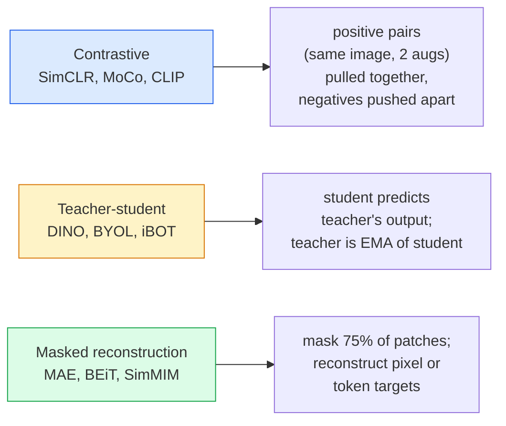

# Tầm nhìn tự giám sát (Self-Supervised Vision) — SimCLR, DINO, MAE

> Nhãn (labels) là nút thắt cổ chai của thị giác máy tính có giám sát. Tiền huấn luyện tự giám sát (self-supervised pretraining) loại bỏ nút thắt này: học các đặc trưng thị giác từ 100 triệu hình ảnh không nhãn, sau đó tinh chỉnh (fine-tune) trên 10 nghìn hình ảnh có nhãn.

**Type:** Học + Xây dựng
**Languages:** Python
**Prerequisites:** Bài 04 Giai đoạn 4 (Phân loại hình ảnh), Bài 14 Giai đoạn 4 (ViT)
**Time:** ~75 phút

## Mục tiêu học tập

- Truy vết ba họ phương pháp tự giám sát chính — tương phản (SimCLR), giáo viên-học sinh (DINO), tái tạo có che giấu (MAE) — và nêu rõ mục tiêu tối ưu hóa của từng phương pháp.
- Triển khai hàm mất mát InfoNCE từ đầu và giải thích tại sao batch size 512 hoạt động tốt nhưng 32 lại thất bại.
- Giải thích tại sao tỷ lệ che giấu 75% của MAE không phải là ngẫu nhiên và sự khác biệt của nó so với tỷ lệ 15% của BERT trong văn bản.
- Sử dụng các checkpoint DINOv2 hoặc MAE trên ImageNet để thực hiện linear probing và truy xuất zero-shot.

## Vấn đề

ImageNet có giám sát chứa 1,3 triệu hình ảnh có nhãn, tiêu tốn khoảng 10 triệu USD để gán nhãn. Các tập dữ liệu y tế và công nghiệp nhỏ hơn và thậm chí còn đắt đỏ hơn để gán nhãn. Mọi đội ngũ thị giác máy tính đều đặt câu hỏi: liệu chúng ta có thể tiền huấn luyện trên dữ liệu không nhãn giá rẻ — khung hình YouTube, dữ liệu thu thập từ web, cảnh quay webcam, ảnh vệ tinh — và sau đó tinh chỉnh trên một tập dữ liệu có nhãn nhỏ?

Học tự giám sát là câu trả lời. Một mô hình ViT tự giám sát hiện đại được huấn luyện trên LAION hoặc JFT đạt được hoặc vượt qua độ chính xác của ImageNet có giám sát khi được tinh chỉnh. Nó cũng chuyển đổi tốt hơn sang các tác vụ hạ nguồn (phát hiện, phân đoạn, độ sâu) so với tiền huấn luyện có giám sát. DINOv2 (Meta, 2023) và MAE (Meta, 2022) hiện là các tiêu chuẩn sản xuất cho các đặc trưng thị giác có khả năng chuyển đổi.

Sự thay đổi về tư duy ở đây là tác vụ tiền đề (pretext task) — thứ mà mô hình được huấn luyện để thực hiện — không nhất thiết phải là tác vụ hạ nguồn. Điều quan trọng là nó buộc mô hình phải học các đặc trưng hữu ích. Dự đoán màu sắc của ảnh thang độ xám, xoay ảnh và yêu cầu mô hình phân loại góc xoay, che giấu các mảng (patches) và tái tạo chúng — tất cả đều đã mang lại hiệu quả. Ba phương pháp có khả năng mở rộng là học tương phản, chưng cất giáo viên-học sinh và tái tạo có che giấu.

## Khái niệm

### Ba họ phương pháp



### Học tương phản (SimCLR)

Lấy một hình ảnh, áp dụng hai phép tăng cường (augmentations) ngẫu nhiên để có hai góc nhìn (views). Đưa cả hai qua cùng một encoder cộng với một projection head. Tối thiểu hóa hàm mất mát với mục tiêu: "hai embedding này phải gần nhau" và "embedding này phải xa các embedding của mọi hình ảnh khác trong batch".

```
Loss for positive pair (z_i, z_j) among 2N views per batch:

   L_ij = -log( exp(sim(z_i, z_j) / tau) / sum_k in batch \ {i} exp(sim(z_i, z_k) / tau) )

sim = cosine similarity
tau = temperature (0.1 standard)
```

Đây là hàm mất mát InfoNCE. Nó yêu cầu nhiều mẫu âm (negatives) cho mỗi mẫu dương (positive), vì vậy batch size rất quan trọng — SimCLR cần từ 512 đến 8192. MoCo đã giới thiệu hàng đợi động lượng (momentum queue) của các batch trước đó để tách biệt số lượng mẫu âm khỏi batch size.

### Giáo viên-học sinh (DINO)

Hai mạng có cùng kiến trúc: học sinh (student) và giáo viên (teacher). Giáo viên là trung bình trượt lũy thừa (EMA) của trọng số học sinh. Cả hai đều nhìn thấy các góc nhìn đã tăng cường của hình ảnh. Đầu ra của học sinh được huấn luyện để khớp với đầu ra của giáo viên — không cần các mẫu âm rõ ràng.

```
loss = CE( student_output(view_1),  teacher_output(view_2) )
     + CE( student_output(view_2),  teacher_output(view_1) )

teacher_weights = m * teacher_weights + (1 - m) * student_weights   (m ≈ 0.996)
```

Lý do nó không bị sụp đổ (collapse) thành "dự đoán một hằng số": đầu ra của giáo viên được căn giữa (trừ đi giá trị trung bình theo chiều) và làm sắc nét (chia cho nhiệt độ nhỏ). Việc căn giữa ngăn một chiều chiếm ưu thế; việc làm sắc nét ngăn đầu ra sụp đổ về phân phối đồng nhất.

DINO là nền tảng mà DINOv2 mở rộng, trên 142 triệu hình ảnh được chọn lọc. Các đặc trưng thu được hiện là SOTA cho truy xuất thị giác zero-shot và dự đoán dày đặc (dense prediction).

### Tái tạo có che giấu (MAE)

Che giấu 75% các mảng của đầu vào ViT. Chỉ đưa 25% phần hiển thị qua encoder. Một decoder nhỏ nhận đầu ra của encoder cộng với các mask token tại các vị trí bị che giấu, và được huấn luyện để tái tạo các pixel của các mảng bị che giấu.

```
Encoder:  visible 25% of patches -> features
Decoder:  features + mask tokens at masked positions -> reconstructed pixels
Loss:     MSE between reconstructed and original pixels on masked patches only
```

Các lựa chọn thiết kế chính giúp MAE hoạt động:

- **Tỷ lệ che giấu 75%** — rất cao. Buộc encoder phải học các đặc trưng ngữ nghĩa; việc tái tạo 25% sẽ gần như tầm thường (các pixel lân cận có tương quan rất cao đến mức một CNN có thể thực hiện dễ dàng).
- **Encoder/decoder bất đối xứng** — encoder ViT lớn chỉ nhìn thấy các mảng hiển thị; một decoder nhỏ (8 lớp, 512-dim) xử lý việc tái tạo. Tốc độ tiền huấn luyện nhanh gấp 3 lần so với BEiT thông thường.
- **Mục tiêu tái tạo trong không gian pixel** — đơn giản hơn mục tiêu token hóa của BEiT và hoạt động tốt hơn trên ViT.

Sau khi tiền huấn luyện, loại bỏ decoder. Encoder chính là bộ trích xuất đặc trưng.

### Tại sao là 75% mà không phải 15%

BERT che giấu 15% token. MAE che giấu 75%. Sự khác biệt nằm ở mật độ thông tin.

- Ngôn ngữ tự nhiên có entropy cao trên mỗi token. Dự đoán 15% token vẫn khó vì mỗi vị trí bị che giấu có nhiều cách hoàn thiện hợp lý.
- Các mảng hình ảnh có entropy thấp — một vùng lân cận không bị che giấu thường xác định gần như chính xác các pixel của mảng bị che giấu. Để việc dự đoán đòi hỏi sự hiểu biết về ngữ nghĩa, bạn phải che giấu một cách quyết liệt.

75% là đủ cao để việc ngoại suy không gian đơn giản không thể giải quyết tác vụ; encoder buộc phải biểu diễn nội dung hình ảnh.

### Đánh giá Linear-probe

Sau khi tiền huấn luyện tự giám sát, phương pháp đánh giá tiêu chuẩn là **linear probe**: đóng băng encoder, huấn luyện một bộ phân loại tuyến tính duy nhất phía trên dựa trên nhãn ImageNet. Báo cáo độ chính xác top-1.

- SimCLR ResNet-50: ~71% (2020)
- DINO ViT-S/16: ~77% (2021)
- MAE ViT-L/16: ~76% (2022)
- DINOv2 ViT-g/14: ~86% (2023)

Linear probe là thước đo thuần túy về chất lượng đặc trưng; tinh chỉnh thường tăng thêm 2-5 điểm nhưng cũng bao gồm cả hiệu ứng của việc huấn luyện lại head.

```figure
data-augmentation
```

## Xây dựng

### Bước 1: Pipeline tăng cường hai góc nhìn

```python
import torch
import torchvision.transforms as T

two_view_train = lambda: T.Compose([
    T.RandomResizedCrop(96, scale=(0.2, 1.0)),
    T.RandomHorizontalFlip(),
    T.ColorJitter(0.4, 0.4, 0.4, 0.1),
    T.RandomGrayscale(p=0.2),
    T.ToTensor(),
])


class TwoViewDataset(torch.utils.data.Dataset):
    def __init__(self, base):
        self.base = base
        self.aug = two_view_train()

    def __len__(self):
        return len(self.base)

    def __getitem__(self, i):
        img, _ = self.base[i]
        v1 = self.aug(img)
        v2 = self.aug(img)
        return v1, v2
```

Mỗi __getitem__ trả về hai góc nhìn đã tăng cường của cùng một hình ảnh; không cần nhãn.

### Bước 2: Hàm mất mát InfoNCE

```python
import torch.nn.functional as F

def info_nce(z1, z2, tau=0.1):
    """
    z1, z2: (N, D) L2-normalised embeddings of paired views
    """
    N, D = z1.shape
    z = torch.cat([z1, z2], dim=0)  # (2N, D)
    sim = z @ z.T / tau              # (2N, 2N)

    mask = torch.eye(2 * N, dtype=torch.bool, device=z.device)
    sim = sim.masked_fill(mask, float("-inf"))

    targets = torch.cat([torch.arange(N, 2 * N), torch.arange(0, N)]).to(z.device)
    return F.cross_entropy(sim, targets)
```

Chuẩn hóa L2 các embedding trước khi gọi. `tau=0.1` là mặc định của SimCLR; giá trị thấp hơn làm cho hàm mất mát sắc nét hơn và yêu cầu nhiều mẫu âm hơn.

### Bước 3: Kiểm tra tính hợp lý của InfoNCE

```python
z1 = F.normalize(torch.randn(16, 32), dim=-1)
z2 = z1.clone()
loss_same = info_nce(z1, z2, tau=0.1).item()
z2_random = F.normalize(torch.randn(16, 32), dim=-1)
loss_random = info_nce(z1, z2_random, tau=0.1).item()
print(f"InfoNCE with identical pairs:  {loss_same:.3f}")
print(f"InfoNCE with random pairs:     {loss_random:.3f}")
```

Các cặp giống hệt nhau sẽ cho hàm mất mát thấp (gần bằng 0 đối với batch lớn và nhiệt độ thấp). Các cặp ngẫu nhiên sẽ cho log(2N-1) = ~log(31) = ~3.4 với batch 16 cặp.

### Bước 4: Che giấu kiểu MAE

```python
def random_mask_indices(num_patches, mask_ratio=0.75, seed=0):
    g = torch.Generator().manual_seed(seed)
    n_keep = int(num_patches * (1 - mask_ratio))
    perm = torch.randperm(num_patches, generator=g)
    visible = perm[:n_keep]
    masked = perm[n_keep:]
    return visible.sort().values, masked.sort().values


num_patches = 196
visible, masked = random_mask_indices(num_patches, mask_ratio=0.75)
print(f"visible: {len(visible)} / {num_patches}")
print(f"masked:  {len(masked)} / {num_patches}")
```

Đơn giản, nhanh và xác định cho một seed nhất định. Các triển khai MAE thực tế sẽ batch hóa việc này và giữ các mask riêng cho từng mẫu.

## Sử dụng

DINOv2 là tiêu chuẩn sản xuất vào năm 2026:

```python
import torch
from transformers import AutoImageProcessor, AutoModel

processor = AutoImageProcessor.from_pretrained("facebook/dinov2-base")
model = AutoModel.from_pretrained("facebook/dinov2-base")
model.eval()

# Per-image embeddings for zero-shot retrieval
with torch.no_grad():
    inputs = processor(images=[pil_image], return_tensors="pt")
    outputs = model(**inputs)
    embedding = outputs.last_hidden_state[:, 0]  # CLS token
```

Embedding 768-dim thu được là xương sống của các pipeline truy xuất hình ảnh hiện đại, tương ứng dày đặc và chuyển đổi zero-shot. Việc tinh chỉnh trên tác vụ hạ nguồn hiếm khi cần nhiều hơn một linear head.

Đối với embedding hình ảnh-văn bản, SigLIP hoặc OpenCLIP là tương đương; đối với tinh chỉnh kiểu MAE, repo `timm` cung cấp mọi checkpoint MAE.

## Triển khai

Bài học này tạo ra:

- `outputs/prompt-ssl-pretraining-picker.md` — một prompt chọn SimCLR / MAE / DINOv2 dựa trên kích thước tập dữ liệu, tài nguyên tính toán và tác vụ hạ nguồn.
- `outputs/skill-linear-probe-runner.md` — kỹ năng viết đánh giá linear-probe cho bất kỳ encoder đóng băng + tập dữ liệu có nhãn nào.

## Bài tập

1. **(Dễ)** Xác minh rằng hàm mất mát InfoNCE giảm khi bạn giảm nhiệt độ cho các embedding đã căn chỉnh tốt và tăng khi bạn giảm nhiệt độ cho các embedding ngẫu nhiên. Vẽ biểu đồ `tau in [0.05, 0.1, 0.2, 0.5]` so với hàm mất mát.
2. **(Trung bình)** Triển khai bộ đệm trung tâm (centre buffer) kiểu DINO. Chứng minh rằng nếu không có việc căn giữa, học sinh sẽ sụp đổ thành một vector hằng số trong vài epoch.
3. **(Khó)** Huấn luyện MAE trên CIFAR-100 sử dụng TinyUNet từ Bài 10 làm xương sống. Báo cáo độ chính xác linear-probe tại 10, 50 và 200 epoch. Chứng minh rằng linear probe tiền huấn luyện bằng MAE vượt trội hơn so với linear probe có giám sát huấn luyện từ đầu trên cùng tập con 1.000 hình ảnh.

## Thuật ngữ chính

| Thuật ngữ | Cách gọi thông thường | Ý nghĩa thực tế |
|------|----------------|----------------------|
| Self-supervised | "Không nhãn" | Tác vụ tiền đề tạo ra các biểu diễn hữu ích từ dữ liệu không nhãn |
| Pretext task | "Tác vụ giả" | Mục tiêu được sử dụng trong SSL (tái tạo mảng, khớp góc nhìn); bị loại bỏ sau tiền huấn luyện |
| Linear probe | "Encoder đóng băng + linear head" | Đánh giá SSL tiêu chuẩn: chỉ huấn luyện bộ phân loại tuyến tính trên các đặc trưng đã đóng băng |
| InfoNCE | "Hàm mất mát tương phản" | softmax trên các độ tương đồng cosine; cặp dương là lớp mục tiêu, tất cả các lớp khác là mẫu âm |
| EMA teacher | "Giáo viên trung bình trượt" | Giáo viên có trọng số là trung bình trượt lũy thừa của học sinh; được sử dụng bởi BYOL, MoCo, DINO |
| Mask ratio | "% mảng bị ẩn" | Tỷ lệ các mảng bị che giấu trong MAE; 75% cho thị giác, 15% cho văn bản |
| Representation collapse | "Đầu ra hằng số" | Lỗi SSL khi encoder xuất ra một vector hằng số cho mọi đầu vào; được ngăn chặn bằng căn giữa, làm sắc nét hoặc mẫu âm |
| DINOv2 | "Xương sống SSL sản xuất" | ViT tự giám sát năm 2023 của Meta; các đặc trưng hình ảnh đa năng mạnh mẽ nhất năm 2026 |

## Đọc thêm

- [SimCLR (Chen et al., 2020)](https://arxiv.org/abs/2002.05709) — tài liệu tham khảo về học tương phản
- [DINO (Caron et al., 2021)](https://arxiv.org/abs/2104.14294) — giáo viên-học sinh với động lượng, căn giữa, làm sắc nét
- [MAE (He et al., 2022)](https://arxiv.org/abs/2111.06377) — tiền huấn luyện masked autoencoder cho ViT
- [DINOv2 (Oquab et al., 2023)](https://arxiv.org/abs/2304.07193) — mở rộng ViT tự giám sát sang các đặc trưng sản xuất