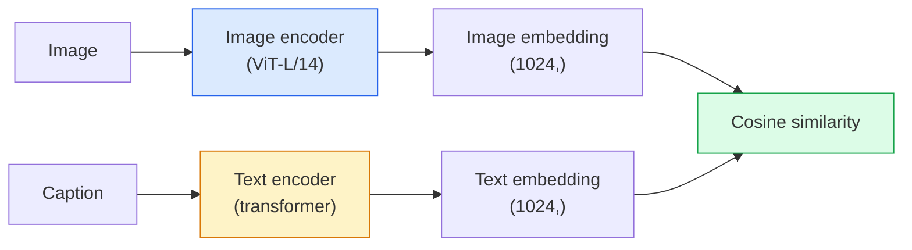

# Open-Vocabulary Vision — CLIP

> Huấn luyện một bộ mã hóa hình ảnh (image encoder) và một bộ mã hóa văn bản (text encoder) cùng nhau sao cho các cặp (hình ảnh, chú thích) khớp nhau nằm tại cùng một điểm trong không gian chung. Đó là toàn bộ bí quyết.

**Type:** Build + Use
**Languages:** Python
**Prerequisites:** Phase 4 Lesson 14 (ViT), Phase 4 Lesson 17 (Self-Supervised)
**Time:** ~45 phút

## Mục tiêu học tập

- Giải thích kiến trúc hai tháp (two-tower) của CLIP và mục tiêu huấn luyện tương phản (contrastive training objective)
- Sử dụng CLIP (hoặc SigLIP) đã được huấn luyện trước cho phân loại zero-shot mà không cần huấn luyện chuyên biệt cho tác vụ
- Triển khai phân loại zero-shot từ đầu: mã hóa các prompt lớp, tính toán độ tương đồng cosine, thực hiện argmax
- Phân biệt các mô hình CLIP, SigLIP, OpenCLIP và LLaVA/LLaMA-vision — mục đích của từng loại trong năm 2026

## Vấn đề

Các bộ phân loại truyền thống có từ vựng đóng (closed-vocabulary): một mô hình ImageNet 1000 lớp chỉ có thể dự đoán 1000 nhãn. Mỗi danh mục mới đều yêu cầu dữ liệu có nhãn và phải huấn luyện lại lớp đầu ra (head).

CLIP (Radford và cộng sự, OpenAI 2021) đã chứng minh rằng việc huấn luyện trên 400 triệu cặp (hình ảnh, chú thích) thu thập từ web tạo ra một mô hình có thể phân loại vào bất kỳ tập hợp danh mục nào tại thời điểm suy luận (inference), được mô tả hoàn toàn bằng ngôn ngữ tự nhiên. Bạn cung cấp cho nó một lớp mới bằng cách viết một câu.

Khả năng đó — zero-shot transfer — là lý do tại sao mọi hệ thống thị giác hiện đại đều bắt đầu với một checkpoint thuộc họ CLIP. Phát hiện đối tượng (Grounding DINO, OWL-ViT), phân đoạn (CLIPSeg, SAM), truy xuất, kiểm duyệt nội dung, VLM và tạo ảnh từ văn bản đều được xây dựng dựa trên các embedding chung theo phong cách CLIP.

## Khái niệm

### Hai tháp (Two towers)



Cả hai bộ mã hóa đều kết thúc bằng một phép chiếu tuyến tính (linear projection) về cùng một chiều embedding (512 cho CLIP-B/32, 1024 cho CLIP-L/14). Thực hiện chuẩn hóa L2 và tính toán độ tương đồng cosine.

### Mục tiêu (The objective)

Với một batch gồm N cặp (hình ảnh, chú thích), xây dựng một ma trận tương đồng NxN. Huấn luyện cả hai bộ mã hóa sao cho đường chéo (các cặp khớp nhau) có độ tương đồng cao và các phần tử ngoài đường chéo (không khớp) có độ tương đồng thấp.

```
sim_matrix = image_embeddings @ text_embeddings.T / tau

loss_i2t = cross_entropy(sim_matrix,       targets=arange(N))
loss_t2i = cross_entropy(sim_matrix.T,     targets=arange(N))
loss = (loss_i2t + loss_t2i) / 2
```

Đối xứng vì cả việc truy xuất hình ảnh-sang-văn bản và văn bản-sang-hình ảnh đều phải hoạt động. `tau` (nhiệt độ) thường được học như một tham số vô hướng, khởi tạo ở mức 0.07.

### SigLIP: một hàm loss tốt hơn

SigLIP (Zhai và cộng sự, 2023) đã thay thế softmax bằng sigmoid trên mỗi cặp:

```
loss = mean over pairs of log(1 + exp(-y_ij * sim_ij))
y_ij = +1 if matching, -1 otherwise
```

Hàm loss trên mỗi cặp loại bỏ việc chuẩn hóa theo batch mà CLIP yêu cầu. SigLIP huấn luyện tốt hơn ở các batch size nhỏ và đạt hiệu suất ngang bằng hoặc vượt trội hơn CLIP với cùng lượng dữ liệu.

### Phân loại Zero-shot

Với một CLIP đã được huấn luyện:

1. Với mỗi lớp, soạn một prompt: "a photo of a {class}".
2. Mã hóa tất cả các prompt lớp bằng bộ mã hóa văn bản -> `T` có shape (C, d).
3. Mã hóa hình ảnh kiểm thử -> `I` có shape (1, d).
4. Độ tương đồng = `I @ T.T` có shape (1, C).
5. Argmax -> lớp được dự đoán.

Prompt engineering rất quan trọng. OpenAI đã công bố 80 mẫu prompt cho ImageNet ("a photo of a {}", "a blurry photo of a {}", "a sketch of a {}", ...). Lấy trung bình các embedding của tất cả các mẫu cho mỗi lớp để tăng thêm 1-3% độ chính xác top-1.

### Các mô hình phong cách CLIP được sử dụng ở đâu trong năm 2026

- **Phân loại Zero-shot** — sử dụng trực tiếp.
- **Truy xuất hình ảnh** — mã hóa tất cả hình ảnh một lần, nhúng truy vấn tại thời điểm suy luận.
- **Phát hiện đối tượng theo văn bản** — Grounding DINO, OWL-ViT bao bọc một tháp văn bản CLIP xung quanh một bộ phát hiện.
- **Phân đoạn theo văn bản** — CLIPSeg; SAM sử dụng đầu vào là prompt văn bản thông qua CLIP.
- **VLM** — LLaVA, Qwen-VL, InternVL kết nối bộ mã hóa thị giác họ CLIP vào một LLM.
- **Tạo ảnh từ văn bản** — Stable Diffusion, DALL-E 3 điều kiện hóa trên các embedding văn bản của CLIP.

Khi bạn có một không gian embedding chung, mọi tác vụ thị giác+ngôn ngữ đều trở thành một phép tính khoảng cách.

```figure
clip-contrastive
```

## Xây dựng (Build It)

### Bước 1: Một mô hình hai tháp nhỏ

CLIP thực tế là ViT + transformer. Đối với bài học này, các tháp là các MLP nhỏ trên các đặc trưng đã trích xuất trước để tín hiệu huấn luyện có thể quan sát được trên CPU.

```python
import torch
import torch.nn as nn
import torch.nn.functional as F


class TwoTower(nn.Module):
    def __init__(self, img_in=128, txt_in=64, emb=64):
        super().__init__()
        self.image_proj = nn.Sequential(nn.Linear(img_in, 128), nn.ReLU(), nn.Linear(128, emb))
        self.text_proj = nn.Sequential(nn.Linear(txt_in, 128), nn.ReLU(), nn.Linear(128, emb))
        self.logit_scale = nn.Parameter(torch.ones([]) * 2.6592)  # ln(1/0.07)

    def forward(self, img_feats, txt_feats):
        i = F.normalize(self.image_proj(img_feats), dim=-1)
        t = F.normalize(self.text_proj(txt_feats), dim=-1)
        return i, t, self.logit_scale.exp()
```

Hai phép chiếu, đầu ra có chiều chung, nhiệt độ được học. Cùng shape với API CLIP thực tế.

### Bước 2: Hàm loss tương phản

```python
def clip_loss(image_emb, text_emb, logit_scale):
    N = image_emb.size(0)
    sim = logit_scale * image_emb @ text_emb.T
    targets = torch.arange(N, device=sim.device)
    l_i = F.cross_entropy(sim, targets)
    l_t = F.cross_entropy(sim.T, targets)
    return (l_i + l_t) / 2
```

Đối xứng. logit_scale càng cao = softmax càng sắc nét = tự tin hơn nhưng có nguy cơ mất ổn định.

### Bước 3: Bộ phân loại Zero-shot

```python
@torch.no_grad()
def zero_shot_classify(model, image_feats, class_text_feats, class_names):
    """
    image_feats:      (N, img_in)
    class_text_feats: (C, txt_in)   one averaged embedding per class
    """
    i = F.normalize(model.image_proj(image_feats), dim=-1)
    t = F.normalize(model.text_proj(class_text_feats), dim=-1)
    sim = i @ t.T
    pred = sim.argmax(dim=-1)
    return [class_names[p] for p in pred.tolist()]
```

Mỗi bước một dòng. Đây là quy trình zero-shot chính xác được sử dụng với một checkpoint CLIP trong môi trường sản xuất.

### Bước 4: Kiểm tra tính hợp lý (Sanity check)

```python
torch.manual_seed(0)
model = TwoTower()

img = torch.randn(8, 128)
txt = torch.randn(8, 64)
i, t, scale = model(img, txt)
loss = clip_loss(i, t, scale)
print(f"batch size: {i.size(0)}   loss: {loss.item():.3f}")
```

Loss nên gần bằng `log(N) = log(8) = 2.08` đối với một mô hình khởi tạo ngẫu nhiên — mục tiêu cross-entropy đối xứng khi chưa có cấu trúc nào được học.

## Sử dụng (Use It)

OpenCLIP là lựa chọn mặc định của cộng đồng vào năm 2026:

```python
import open_clip
import torch
from PIL import Image

model, _, preprocess = open_clip.create_model_and_transforms("ViT-B-32", pretrained="laion2b_s34b_b79k")
tokenizer = open_clip.get_tokenizer("ViT-B-32")

image = preprocess(Image.open("dog.jpg")).unsqueeze(0)
text = tokenizer(["a photo of a dog", "a photo of a cat", "a photo of a car"])

with torch.no_grad():
    image_features = model.encode_image(image)
    text_features = model.encode_text(text)
    image_features = image_features / image_features.norm(dim=-1, keepdim=True)
    text_features = text_features / text_features.norm(dim=-1, keepdim=True)
    probs = (100.0 * image_features @ text_features.T).softmax(dim=-1)

print(probs)
```

SigLIP mới hơn, huấn luyện tốt hơn ở quy mô nhỏ và được ưu tiên cho các công việc mới: `google/siglip-base-patch16-224`. Hugging Face cung cấp cả hai.

## Triển khai (Ship It)

Bài học này tạo ra:

- `outputs/prompt-zero-shot-class-picker.md` — một prompt thiết kế các mẫu lớp cho zero-shot CLIP dựa trên danh sách các lớp và lĩnh vực.
- `outputs/skill-image-text-retriever.md` — một kỹ năng xây dựng chỉ mục embedding hình ảnh với bất kỳ checkpoint CLIP nào, hỗ trợ truy vấn bằng văn bản và truy vấn bằng hình ảnh.

## Bài tập

1. **(Dễ)** Sử dụng OpenCLIP ViT-B/32 đã được huấn luyện trước và thực hiện phân loại zero-shot trên CIFAR-10 với tập 80 mẫu prompt. Báo cáo độ chính xác top-1; nó sẽ đạt khoảng 85-90%.
2. **(Trung bình)** So sánh embedding trung bình của 80 mẫu với một mẫu duy nhất ("a photo of a {}") trên cùng tác vụ CIFAR-10. Định lượng khoảng cách và giải thích tại sao các mẫu prompt lại giúp ích.
3. **(Khó)** Xây dựng chỉ mục truy xuất hình ảnh zero-shot: nhúng 1.000 hình ảnh với CLIP, xây dựng chỉ mục FAISS, truy vấn bằng mô tả ngôn ngữ tự nhiên. Báo cáo recall@5 cho 20 truy vấn giữ lại mà bạn tự viết.

## Thuật ngữ chính

| Thuật ngữ | Cách gọi thông thường | Ý nghĩa thực tế |
|------|----------------|----------------------|
| Two-tower | "Dual encoder" | Các bộ mã hóa hình ảnh và văn bản riêng biệt kết thúc bằng một đầu chiếu (projection head) có chiều chung |
| Zero-shot | "No task-specific training" | Phân loại vào các lớp chỉ được mô tả bằng văn bản tại thời điểm suy luận; không cần nhãn |
| Temperature / logit_scale | "tau" | Giá trị vô hướng được học dùng để chia tỷ lệ ma trận tương đồng trước khi qua softmax |
| Prompt template | "A photo of a {}" | Lớp bao bọc ngôn ngữ tự nhiên xung quanh tên lớp; lấy trung bình nhiều mẫu giúp tăng độ chính xác zero-shot |
| CLIP | "Image+text model" | Mô hình OpenAI năm 2021; từ vựng tiêu chuẩn của lĩnh vực này vào năm 2026 |
| SigLIP | "Sigmoid CLIP" | Thay thế softmax bằng sigmoid trên mỗi cặp; huấn luyện tốt hơn ở các batch nhỏ |
| OpenCLIP | "Open reproduction" | Các biến thể CLIP do cộng đồng huấn luyện trên LAION; mặc định cho các pipeline mã nguồn mở |
| VLM | "Vision-language model" | Một bộ mã hóa họ CLIP kết hợp với LLM, được huấn luyện để trả lời câu hỏi về hình ảnh |

## Đọc thêm

- [CLIP: Learning Transferable Visual Models from Natural Language Supervision (Radford et al., 2021)](https://arxiv.org/abs/2103.00020)
- [SigLIP: Sigmoid Loss for Language-Image Pre-Training (Zhai et al., 2023)](https://arxiv.org/abs/2303.15343)
- [OpenCLIP](https://github.com/mlfoundations/open_clip) — codebase của cộng đồng
- [DINOv2 vs CLIP vs MAE: a features comparison](https://huggingface.co/blog/dinov2) — hướng dẫn của HF với các trường hợp sử dụng song song