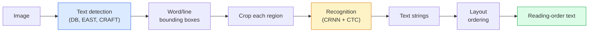

# OCR & Document Understanding

> OCR là một pipeline gồm ba giai đoạn — phát hiện các khung văn bản (detect), nhận dạng ký tự (recognise), sau đó dàn trang (layout). Mọi hệ thống OCR hiện đại đều sắp xếp lại hoặc hợp nhất các giai đoạn này.

**Type:** Learn + Use
**Languages:** Python
**Prerequisites:** Phase 4 Lesson 06 (Detection), Phase 7 Lesson 02 (Self-Attention)
**Time:** ~45 minutes

## Mục tiêu học tập

- Nắm vững pipeline OCR cổ điển (detect -> recognise -> layout) và các giải pháp thay thế end-to-end hiện đại (Donut, Qwen-VL-OCR)
- Triển khai CTC (Connectionist Temporal Classification) loss cho việc huấn luyện OCR theo mô hình sequence-to-sequence
- Sử dụng PaddleOCR hoặc EasyOCR để phân tích tài liệu trong môi trường production mà không cần huấn luyện lại
- Phân biệt OCR, layout parsing và document understanding — đồng thời chọn đúng công cụ cho từng tác vụ

## Vấn đề

Hình ảnh chứa văn bản xuất hiện ở khắp mọi nơi: hóa đơn, biên lai, giấy tờ tùy thân, sách quét, biểu mẫu, bảng trắng, biển báo, ảnh chụp màn hình. Việc trích xuất dữ liệu có cấu trúc từ chúng — không chỉ là các ký tự, mà là "đây là tổng số tiền" — là một trong những bài toán thị giác máy tính ứng dụng có giá trị cao nhất.

Lĩnh vực này được chia thành ba tầng kỹ năng:

1. **OCR thuần túy**: chuyển đổi pixel thành văn bản.
2. **Layout parsing**: nhóm đầu ra của OCR thành các vùng (tiêu đề, nội dung, bảng, tiêu đề phụ).
3. **Document understanding**: trích xuất các trường có cấu trúc ("invoice_total = $42.50") từ layout.

Mỗi tầng đều có các phương pháp tiếp cận cổ điển và hiện đại, và khoảng cách giữa "Tôi muốn lấy văn bản từ hình ảnh" và "Tôi cần tổng số tiền từ hóa đơn này" lớn hơn hầu hết các đội ngũ nhận ra.

## Khái niệm

### Pipeline cổ điển



- **Text detection** tạo ra các tứ giác cho mỗi dòng hoặc mỗi từ.
- **Recognition** cắt từng vùng thành một chiều cao cố định, chạy CNN + BiLSTM + CTC để tạo ra một chuỗi ký tự.
- **Layout** tái tạo thứ tự đọc (từ trên xuống dưới, từ trái sang phải đối với tiếng Latin; khác biệt đối với tiếng Ả Rập, tiếng Nhật).

### CTC trong một đoạn văn

Nhận dạng OCR tạo ra một chuỗi có độ dài thay đổi từ một bản đồ đặc trưng (feature map) có độ dài cố định. CTC (Graves et al., 2006) cho phép bạn huấn luyện mô hình này mà không cần căn chỉnh (alignment) ở cấp độ ký tự. Mô hình xuất ra một phân phối trên (từ vựng + blank) tại mỗi bước thời gian; CTC loss tính toán biên (marginalise) trên tất cả các cách căn chỉnh mà sau khi hợp nhất các ký tự lặp lại và loại bỏ các ký tự trống (blank) sẽ thu về văn bản mục tiêu.

```
raw output: "h h h _ _ e e l l _ l l o _ _"
after merge repeats and remove blanks: "hello"
```

CTC là lý do tại sao CRNN hoạt động hiệu quả vào năm 2015 và vẫn được dùng để huấn luyện hầu hết các mô hình OCR trong môi trường production vào năm 2026.

### Các mô hình end-to-end hiện đại

- **Donut** (Kim et al., 2022) — một ViT encoder + một text decoder; đọc hình ảnh và xuất ra JSON trực tiếp. Không cần bộ phát hiện văn bản, không cần module layout.
- **TrOCR** — ViT + transformer decoder cho OCR ở cấp độ dòng.
- **Qwen-VL-OCR / InternVL** — các mô hình vision-language đầy đủ được tinh chỉnh cho các tác vụ OCR; độ chính xác tốt nhất vào năm 2026 trên các tài liệu phức tạp.
- **PaddleOCR** — pipeline DB + CRNN cổ điển trong một gói sản phẩm hoàn thiện; vẫn là công cụ mã nguồn mở mạnh mẽ nhất.

Các mô hình end-to-end cần nhiều dữ liệu và tài nguyên tính toán hơn nhưng tránh được sự tích lũy lỗi của các pipeline đa giai đoạn.

### Layout parsing

Đối với các tài liệu có cấu trúc, hãy chạy một bộ phát hiện layout (LayoutLMv3, DocLayNet) để dán nhãn từng vùng: Tiêu đề, Đoạn văn, Hình ảnh, Bảng, Chú thích. Thứ tự đọc sau đó trở thành "lặp qua các vùng theo thứ tự layout, sau đó nối lại".

Đối với các biểu mẫu, hãy sử dụng các mô hình **Key-Value extraction** (Donut cho các tài liệu giàu thông tin thị giác, LayoutLMv3 cho các bản quét thông thường). Chúng nhận đầu vào là hình ảnh + văn bản đã phát hiện + vị trí và dự đoán các cặp key-value có cấu trúc.

### Các chỉ số đánh giá

- **Character Error Rate (CER)** — Khoảng cách Levenshtein / độ dài của tham chiếu. Càng thấp càng tốt. Mục tiêu production: < 2% trên các bản quét sạch.
- **Word Error Rate (WER)** — tương tự ở cấp độ từ.
- **F1 trên các trường có cấu trúc** — cho các tác vụ key-value; đo lường xem `{invoice_total: 42.50}` có xuất hiện chính xác hay không.
- **Edit distance trên JSON** — cho việc phân tích tài liệu end-to-end; bài báo Donut đã giới thiệu khoảng cách chỉnh sửa cây chuẩn hóa (normalised tree edit distance).

```figure
cv3-ctc-collapse
```

## Xây dựng

### Bước 1: CTC loss + greedy decoder

```python
import torch
import torch.nn as nn
import torch.nn.functional as F


def ctc_loss(log_probs, targets, input_lengths, target_lengths, blank=0):
    """
    log_probs:      (T, N, C) log-softmax over vocab including blank at index 0
    targets:        (N, S) int targets (no blanks)
    input_lengths:  (N,) per-sample time steps used
    target_lengths: (N,) per-sample target length
    """
    return F.ctc_loss(log_probs, targets, input_lengths, target_lengths,
                      blank=blank, reduction="mean", zero_infinity=True)


def greedy_ctc_decode(log_probs, blank=0):
    """
    log_probs: (T, N, C) log-softmax
    returns: list of index sequences (blanks removed, repeats merged)
    """
    preds = log_probs.argmax(dim=-1).transpose(0, 1).cpu().tolist()
    out = []
    for seq in preds:
        decoded = []
        prev = None
        for idx in seq:
            if idx != prev and idx != blank:
                decoded.append(idx)
            prev = idx
        out.append(decoded)
    return out
```

`F.ctc_loss` sử dụng triển khai CuDNN hiệu quả khi có sẵn. Greedy decoder đơn giản hơn beam search và thường có CER chênh lệch trong khoảng 1% so với beam search.

### Bước 2: Tiny CRNN recogniser

CNN + BiLSTM tối giản cho OCR dòng.

```python
class TinyCRNN(nn.Module):
    def __init__(self, vocab_size=40, hidden=128, feat=32):
        super().__init__()
        self.cnn = nn.Sequential(
            nn.Conv2d(1, feat, 3, 1, 1), nn.BatchNorm2d(feat), nn.ReLU(inplace=True),
            nn.MaxPool2d(2),
            nn.Conv2d(feat, feat * 2, 3, 1, 1), nn.BatchNorm2d(feat * 2), nn.ReLU(inplace=True),
            nn.MaxPool2d(2),
            nn.Conv2d(feat * 2, feat * 4, 3, 1, 1), nn.BatchNorm2d(feat * 4), nn.ReLU(inplace=True),
            nn.MaxPool2d((2, 1)),
            nn.Conv2d(feat * 4, feat * 4, 3, 1, 1), nn.BatchNorm2d(feat * 4), nn.ReLU(inplace=True),
            nn.MaxPool2d((2, 1)),
        )
        self.rnn = nn.LSTM(feat * 4, hidden, bidirectional=True, batch_first=True)
        self.head = nn.Linear(hidden * 2, vocab_size)

    def forward(self, x):
        # x: (N, 1, H, W)
        f = self.cnn(x)                # (N, C, H', W')
        f = f.mean(dim=2).transpose(1, 2)  # (N, W', C)
        h, _ = self.rnn(f)
        return F.log_softmax(self.head(h).transpose(0, 1), dim=-1)  # (W', N, vocab)
```

Đầu vào chiều cao cố định (CNN max-pool chiều cao về 1). Chiều rộng là chiều thời gian cho CTC.

### Bước 3: Synthetic OCR

Tạo các chuỗi chữ số đen trên nền trắng cho một bài kiểm tra end-to-end (smoke test).

```python
import numpy as np

def synthetic_line(text, height=32, char_width=16):
    W = char_width * len(text)
    img = np.ones((height, W), dtype=np.float32)
    for i, c in enumerate(text):
        x = i * char_width
        shade = 0.0 if c.isalnum() else 0.5
        img[6:height - 6, x + 2:x + char_width - 2] = shade
    return img


def build_batch(strings, vocab):
    H = 32
    W = 16 * max(len(s) for s in strings)
    imgs = np.ones((len(strings), 1, H, W), dtype=np.float32)
    target_lengths = []
    targets = []
    for i, s in enumerate(strings):
        imgs[i, 0, :, :16 * len(s)] = synthetic_line(s)
        ids = [vocab.index(c) for c in s]
        targets.extend(ids)
        target_lengths.append(len(ids))
    return torch.from_numpy(imgs), torch.tensor(targets), torch.tensor(target_lengths)


vocab = ["_"] + list("0123456789abcdefghijklmnopqrstuvwxyz")
imgs, targets, lengths = build_batch(["hello", "world"], vocab)
print(f"images: {imgs.shape}   targets: {targets.shape}   lengths: {lengths.tolist()}")
```

Một tập dữ liệu OCR thực tế sẽ thêm phông chữ, nhiễu, xoay, mờ và màu sắc. Pipeline ở trên vẫn giữ nguyên.

### Bước 4: Phác thảo huấn luyện

```python
model = TinyCRNN(vocab_size=len(vocab))
opt = torch.optim.Adam(model.parameters(), lr=1e-3)

for step in range(200):
    strings = ["abc" + str(step % 10)] * 4 + ["xyz" + str((step + 1) % 10)] * 4
    imgs, targets, target_lens = build_batch(strings, vocab)
    log_probs = model(imgs)  # (W', 8, vocab)
    input_lens = torch.full((8,), log_probs.size(0), dtype=torch.long)
    loss = ctc_loss(log_probs, targets, input_lens, target_lens, blank=0)
    opt.zero_grad(); loss.backward(); opt.step()
```

Loss sẽ giảm từ ~3 xuống ~0.2 sau 200 bước trên dữ liệu tổng hợp đơn giản này.

## Sử dụng

Ba lộ trình triển khai production:

- **PaddleOCR** — hoàn thiện, nhanh, đa ngôn ngữ. Cách sử dụng một dòng: `paddleocr.PaddleOCR(lang="en").ocr(image_path)`.
- **EasyOCR** — thuần Python, đa ngôn ngữ, backbone PyTorch.
- **Tesseract** — cổ điển; vẫn hữu ích cho các tài liệu quét cũ khi các mô hình hiện đại gặp khó khăn.

Đối với phân tích tài liệu end-to-end, hãy sử dụng Donut hoặc VLM:

```python
from transformers import DonutProcessor, VisionEncoderDecoderModel

processor = DonutProcessor.from_pretrained("naver-clova-ix/donut-base-finetuned-cord-v2")
model = VisionEncoderDecoderModel.from_pretrained("naver-clova-ix/donut-base-finetuned-cord-v2")
```

Đối với biên lai, hóa đơn và biểu mẫu có cấu trúc lặp lại, hãy tinh chỉnh Donut. Đối với các tài liệu tùy ý hoặc OCR cần suy luận, một VLM như Qwen-VL-OCR là lựa chọn mặc định hiện nay.

## Triển khai

Bài học này tạo ra:

- `outputs/prompt-ocr-stack-picker.md` — một prompt chọn Tesseract / PaddleOCR / Donut / VLM-OCR dựa trên loại tài liệu, ngôn ngữ và cấu trúc.
- `outputs/skill-ctc-decoder.md` — một kỹ năng viết các bộ giải mã CTC greedy và beam-search từ đầu, bao gồm cả chuẩn hóa độ dài.

## Bài tập

1. **(Dễ)** Huấn luyện TinyCRNN trên các chuỗi số ngẫu nhiên 5 chữ số trong 500 bước. Báo cáo CER trên tập kiểm tra (held-out set).
2. **(Trung bình)** Thay thế greedy decoding bằng beam search (beam_width=5). Báo cáo sự thay đổi CER. Beam search thắng trên những đầu vào nào?
3. **(Khó)** Sử dụng PaddleOCR trên 20 hóa đơn, trích xuất các mục dòng (line items) và tính F1 so với ground truth được dán nhãn thủ công cho các cặp {item_name, price}.

## Thuật ngữ chính

| Thuật ngữ | Cách gọi thông thường | Ý nghĩa thực tế |
|------|----------------|----------------------|
| OCR | "Văn bản từ pixel" | Chuyển đổi các vùng hình ảnh thành chuỗi ký tự |
| CTC | "Loss không cần căn chỉnh" | Loss huấn luyện mô hình chuỗi mà không cần nhãn theo từng bước thời gian; tính toán biên trên các cách căn chỉnh |
| CRNN | "Mô hình OCR cổ điển" | Conv feature extractor + BiLSTM + CTC; baseline năm 2015 vẫn được dùng trong production |
| Donut | "OCR end-to-end" | ViT encoder + text decoder; xuất JSON trực tiếp từ hình ảnh |
| Layout parsing | "Tìm các vùng" | Phát hiện và dán nhãn các vùng Tiêu đề/Bảng/Hình ảnh/Đoạn văn trong tài liệu |
| Reading order | "Chuỗi văn bản" | Thứ tự của các vùng đã nhận dạng thành một câu; đơn giản với tiếng Latin, phức tạp với các layout hỗn hợp |
| CER / WER | "Tỷ lệ lỗi" | Khoảng cách Levenshtein / độ dài tham chiếu ở cấp độ ký tự hoặc từ |
| VLM-OCR | "LLM biết đọc" | Một mô hình vision-language được huấn luyện hoặc prompt cho các tác vụ OCR; SOTA hiện tại trên các tài liệu phức tạp |

## Đọc thêm

- [CRNN (Shi et al., 2015)](https://arxiv.org/abs/1507.05717) — kiến trúc CNN+RNN+CTC gốc
- [CTC (Graves et al., 2006)](https://www.cs.toronto.edu/~graves/icml_2006.pdf) — bài báo gốc về CTC; chứa đầy đủ các ý tưởng thuật toán
- [Donut (Kim et al., 2022)](https://arxiv.org/abs/2111.15664) — transformer hiểu tài liệu không cần OCR
- [PaddleOCR](https://github.com/PaddlePaddle/PaddleOCR) — bộ công cụ OCR mã nguồn mở cho production