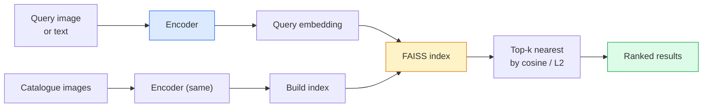

# Image Retrieval & Metric Learning

> Một hệ thống truy xuất xếp hạng các ứng viên dựa trên khoảng cách trong không gian embedding. Metric learning là lĩnh vực định hình không gian đó sao cho các khoảng cách mang ý nghĩa như bạn mong muốn.

**Type:** Build
**Languages:** Python
**Prerequisites:** Phase 4 Lesson 14 (ViT), Phase 4 Lesson 18 (CLIP)
**Time:** ~45 phút

## Mục tiêu học tập

- Giải thích các hàm loss trong metric learning như triplet, contrastive và proxy-based, đồng thời chọn hàm phù hợp cho một tập dữ liệu nhất định.
- Triển khai L2-normalisation và cosine similarity một cách chính xác, đồng thời phân biệt rõ ràng giữa truy xuất "cùng mục" (same item) và "cùng lớp" (same class).
- Xây dựng chỉ mục FAISS, truy vấn bằng văn bản và hình ảnh, đồng thời báo cáo recall@K cho tập truy vấn giữ lại (held-out query set).
- Sử dụng DINOv2, CLIP và SigLIP làm các backbone embedding có sẵn và biết khi nào nên sử dụng loại nào.

## Vấn đề

Truy xuất (retrieval) xuất hiện ở khắp mọi nơi trong thị giác máy tính thực tế: phát hiện trùng lặp, tìm kiếm hình ảnh ngược, tìm kiếm trực quan ("tìm sản phẩm tương tự"), nhận dạng lại khuôn mặt, nhận dạng người trong giám sát, khớp cấp độ thực thể (instance-level) cho thương mại điện tử. Câu hỏi về sản phẩm luôn giống nhau: "với hình ảnh truy vấn này, hãy xếp hạng danh mục của tôi."

Hai quyết định thiết kế định hình toàn bộ hệ thống. Embedding — mô hình nào tạo ra các vector. Chỉ mục (index) — cách tìm các láng giềng gần nhất ở quy mô lớn. Cả hai đều là hàng hóa phổ thông vào năm 2026 (DINOv2 cho embedding, FAISS cho chỉ mục), điều này nâng cao tiêu chuẩn: phần khó là xác định *thế nào là tương tự* cho ứng dụng của bạn, sau đó định hình không gian embedding sao cho các khoảng cách khớp với định nghĩa đó.

Việc định hình đó chính là metric learning. Đây là một lĩnh vực nhỏ nhưng có đòn bẩy cao.

## Khái niệm

### Tổng quan về truy xuất



### Bốn nhóm hàm loss

| Loss | Yêu cầu | Ưu điểm | Nhược điểm |
|------|----------|------|------|
| **Contrastive** | (anchor, positive) + negatives | Đơn giản, hoạt động với mọi nhãn cặp | Hội tụ chậm nếu không có nhiều negatives |
| **Triplet** | (anchor, positive, negative) | Trực quan; kiểm soát margin trực tiếp | Khai thác hard-triplet tốn kém |
| **NT-Xent / InfoNCE** | Cặp + negatives được khai thác theo batch | Mở rộng tốt với batch lớn | Cần batch lớn hoặc momentum queue |
| **Proxy-based (ProxyNCA)** | Chỉ nhãn lớp | Nhanh, ổn định, không cần khai thác | Có thể overfitting vào các proxy trên tập dữ liệu nhỏ |

Đối với hầu hết các trường hợp sử dụng thực tế, hãy bắt đầu với một backbone đã được huấn luyện trước và chỉ thêm tinh chỉnh (fine-tune) metric learning nếu các embedding có sẵn không đạt hiệu suất trên tập kiểm tra của bạn.

### Triplet loss về mặt hình thức

```
L = max(0, ||f(a) - f(p)||^2 - ||f(a) - f(n)||^2 + margin)
```

Kéo anchor `a` lại gần positive `p`, đẩy nó ra xa negative `n`, với một `margin` đảm bảo khoảng cách. Cấu trúc ba hình ảnh này tổng quát hóa cho bất kỳ thứ tự tương đồng nào.

Việc khai thác (mining) rất quan trọng: các triplet dễ (`n` đã ở xa `a`) đóng góp loss bằng không; chỉ các triplet khó mới dạy được mạng. Khai thác bán cứng (semi-hard mining) (`n` xa hơn `p` nhưng nằm trong margin) là công thức FaceNet năm 2016 và vẫn chiếm ưu thế.

### Cosine similarity so với L2

Hai chỉ số, hai quy ước:

- **Cosine**: góc giữa các vector. Yêu cầu các embedding đã được L2-normalised.
- **L2**: khoảng cách Euclidean. Hoạt động trên các embedding thô hoặc đã chuẩn hóa, nhưng thường được kết hợp với L2-normalised + bình phương L2.

Đối với hầu hết các mạng hiện đại, hai chỉ số này tương đương nhau: `||a - b||^2 = 2 - 2 cos(a, b)` khi `||a|| = ||b|| = 1`. Hãy chọn quy ước khớp với quá trình huấn luyện embedding của bạn; việc trộn lẫn chúng sẽ thay đổi ý nghĩa của "gần nhất" một cách âm thầm.

### Recall@K

Chỉ số truy xuất tiêu chuẩn:

```
recall@K = fraction of queries where at least one correct match is in the top K results
```

Báo cáo recall@1, @5, @10 cạnh nhau. Recall@10 trên 0.95 với recall@1 dưới 0.5 có nghĩa là không gian embedding có cấu trúc đúng nhưng thứ hạng bị nhiễu — hãy thử tinh chỉnh lâu hơn hoặc thêm bước xếp hạng lại (re-ranking).

Đối với phát hiện trùng lặp, precision@K quan trọng hơn vì mỗi false positive là một lỗi mà người dùng nhìn thấy. Đối với tìm kiếm trực quan, recall@K là tín hiệu sản phẩm.

### FAISS trong một đoạn văn

Facebook AI Similarity Search. Thư viện mặc định cho tìm kiếm láng giềng gần nhất. Ba lựa chọn chỉ mục:

- `IndexFlatIP` / `IndexFlatL2` — brute force, chính xác, không cần huấn luyện. Sử dụng cho tối đa ~1 triệu vector.
- `IndexIVFFlat` — phân vùng thành K ô, chỉ tìm kiếm trong vài ô gần nhất. Xấp xỉ, nhanh, cần dữ liệu huấn luyện.
- `IndexHNSW` — dựa trên đồ thị, nhanh nhất cho nhiều truy vấn, kích thước chỉ mục lớn.

Với 100k vector, bạn có thể muốn `IndexFlatIP` trên cosine similarity. Với 10M, bạn muốn `IndexIVFFlat`. Với 100M+ kết hợp với product quantisation (`IndexIVFPQ`).

### Truy xuất cấp độ thực thể (instance-level) so với cấp độ danh mục (category-level)

Hai vấn đề rất khác nhau với cùng một tên gọi:

- **Category-level** — "tìm mèo trong danh mục của tôi." Sự tương đồng theo điều kiện lớp; các embedding CLIP / DINOv2 có sẵn hoạt động tốt.
- **Instance-level** — "tìm *chính xác sản phẩm này* trong danh mục của tôi." Cần sự phân biệt chi tiết giữa các đối tượng tương tự nhau về mặt thị giác trong cùng một lớp; các embedding có sẵn hoạt động kém; việc tinh chỉnh với metric learning là rất quan trọng.

Luôn tự hỏi bạn đang giải quyết vấn đề nào trước khi chọn mô hình.

```figure
metric-embedding
```

## Xây dựng

### Bước 1: Triplet loss

```python
import torch
import torch.nn.functional as F

def triplet_loss(anchor, positive, negative, margin=0.2):
    d_ap = F.pairwise_distance(anchor, positive, p=2)
    d_an = F.pairwise_distance(anchor, negative, p=2)
    return F.relu(d_ap - d_an + margin).mean()
```

Một dòng. Hoạt động trên các embedding đã L2-normalised hoặc thô.

### Bước 2: Semi-hard mining

Với một batch các embedding và nhãn, hãy tìm negative bán cứng khó nhất cho mỗi anchor.

```python
def semi_hard_negatives(emb, labels, margin=0.2):
    dist = torch.cdist(emb, emb)
    same_class = labels[:, None] == labels[None, :]
    diff_class = ~same_class
    N = emb.size(0)

    positives = dist.clone()
    positives[~same_class] = float("-inf")
    positives.fill_diagonal_(float("-inf"))
    pos_idx = positives.argmax(dim=1)

    semi_hard = dist.clone()
    semi_hard[same_class] = float("inf")
    d_ap = dist[torch.arange(N), pos_idx].unsqueeze(1)
    semi_hard[dist <= d_ap] = float("inf")
    neg_idx = semi_hard.argmin(dim=1)

    fallback_mask = semi_hard[torch.arange(N), neg_idx] == float("inf")
    if fallback_mask.any():
        hardest = dist.clone()
        hardest[same_class] = float("inf")
        neg_idx = torch.where(fallback_mask, hardest.argmin(dim=1), neg_idx)
    return pos_idx, neg_idx
```

Mỗi anchor nhận được positive khó nhất trong cùng lớp và một negative bán cứng xa hơn positive nhưng nằm trong margin.

### Bước 3: Recall@K

```python
def recall_at_k(query_emb, gallery_emb, query_labels, gallery_labels, k=1):
    sim = query_emb @ gallery_emb.T
    _, top_k = sim.topk(k, dim=-1)
    matches = (gallery_labels[top_k] == query_labels[:, None]).any(dim=-1)
    return matches.float().mean().item()
```

Top-k theo tích vô hướng trên các embedding đã L2-normalised tương đương với top-k theo cosine. Báo cáo tỷ lệ trung bình các truy vấn có ít nhất một láng giềng đúng.

### Bước 4: Kết hợp lại

```python
import torch
import torch.nn as nn
from torch.optim import Adam

class Encoder(nn.Module):
    def __init__(self, in_dim=128, emb_dim=64):
        super().__init__()
        self.net = nn.Sequential(
            nn.Linear(in_dim, 128), nn.ReLU(),
            nn.Linear(128, emb_dim),
        )

    def forward(self, x):
        return F.normalize(self.net(x), dim=-1)

torch.manual_seed(0)
num_classes = 6
protos = F.normalize(torch.randn(num_classes, 128), dim=-1)

def sample_batch(bs=32):
    labels = torch.randint(0, num_classes, (bs,))
    x = protos[labels] + 0.15 * torch.randn(bs, 128)
    return x, labels

enc = Encoder()
opt = Adam(enc.parameters(), lr=3e-3)

for step in range(200):
    x, y = sample_batch(32)
    emb = enc(x)
    pos_idx, neg_idx = semi_hard_negatives(emb, y)
    loss = triplet_loss(emb, emb[pos_idx], emb[neg_idx])
    opt.zero_grad(); loss.backward(); opt.step()
```

Sau vài trăm bước, các cụm embedding tạo thành một cụm cho mỗi lớp.

## Sử dụng

Các stack sản xuất năm 2026:

- **DINOv2 + FAISS** — truy xuất thị giác mục đích chung. Hoạt động ngay lập tức.
- **CLIP + FAISS** — khi truy vấn là văn bản.
- **Fine-tuned DINOv2 + FAISS** — truy xuất cấp độ thực thể, nhận dạng lại khuôn mặt, thời trang, thương mại điện tử.
- **Milvus / Weaviate / Qdrant** — các trình bao bọc vector DB được quản lý xung quanh FAISS hoặc HNSW.

Để truy xuất thực thể SOTA, công thức là: backbone DINOv2, thêm một embedding head, tinh chỉnh với triplet hoặc InfoNCE loss trên các cặp được gắn nhãn thực thể, lập chỉ mục trong FAISS.

## Triển khai

Bài học này tạo ra:

- `outputs/prompt-retrieval-loss-picker.md` — một gợi ý chọn triplet / InfoNCE / ProxyNCA cho một vấn đề truy xuất nhất định.
- `outputs/skill-recall-at-k-runner.md` — kỹ năng viết một bộ đánh giá sạch cho recall@K với các phân chia train/val/gallery và hợp đồng dữ liệu phù hợp.

## Bài tập

1. **(Dễ)** Chạy ví dụ mẫu ở trên. Vẽ các embedding bằng PCA trước và sau khi huấn luyện để thấy sáu cụm hình thành.
2. **(Trung bình)** Thêm triển khai ProxyNCA loss: một "proxy" được học cho mỗi lớp, cross-entropy tiêu chuẩn trên cosine similarity. So sánh tốc độ hội tụ với triplet loss trên dữ liệu mẫu.
3. **(Khó)** Lấy 1.000 hình ảnh xác thực ImageNet, nhúng bằng DINOv2 qua HuggingFace, xây dựng chỉ mục FAISS phẳng, và báo cáo recall@{1, 5, 10} so với chính các hình ảnh đó làm truy vấn (phải là 1.0) và so với một tập giữ lại với các nhãn ImageNet làm ground truth.

## Thuật ngữ chính

| Thuật ngữ | Cách gọi thông thường | Ý nghĩa thực tế |
|------|----------------|----------------------|
| Metric learning | "Định hình không gian" | Huấn luyện bộ mã hóa sao cho khoảng cách trong không gian đầu ra phản ánh sự tương đồng mục tiêu |
| Triplet loss | "Kéo và đẩy" | L = max(0, d(a, p) - d(a, n) + margin); hàm loss metric-learning kinh điển |
| Semi-hard mining | "Negatives hữu ích" | Các negative xa anchor hơn positive nhưng nằm trong margin; thực nghiệm cho thấy đây là loại thông tin nhất |
| Proxy-based loss | "Nguyên mẫu lớp" | Một proxy được học cho mỗi lớp; cross-entropy trên sự tương đồng với các proxy; không cần khai thác cặp |
| Recall@K | "Tỷ lệ trúng Top-K" | Tỷ lệ các truy vấn có ít nhất một kết quả đúng trong top K |
| Instance retrieval | "Tìm chính xác thứ này" | Khớp chi tiết; các đặc trưng có sẵn thường hoạt động kém |
| FAISS | "Thư viện NN" | Thư viện láng giềng gần nhất của Facebook; hỗ trợ chỉ mục chính xác và xấp xỉ |
| HNSW | "Chỉ mục đồ thị" | Hierarchical navigable small world; NN xấp xỉ nhanh với chi phí bộ nhớ thấp |

## Đọc thêm

- [FaceNet: A Unified Embedding for Face Recognition (Schroff et al., 2015)](https://arxiv.org/abs/1503.03832) — bài báo về triplet loss / semi-hard mining
- [In Defense of the Triplet Loss for Person Re-Identification (Hermans et al., 2017)](https://arxiv.org/abs/1703.07737) — hướng dẫn thực tế về tinh chỉnh triplet
- [Tài liệu FAISS](https://github.com/facebookresearch/faiss/wiki) — mọi chỉ mục, mọi sự đánh đổi
- [SMoT: Metric Learning Taxonomy (Kim et al., 2021)](https://arxiv.org/abs/2010.06927) — khảo sát về các hàm loss hiện đại và mối liên hệ của chúng