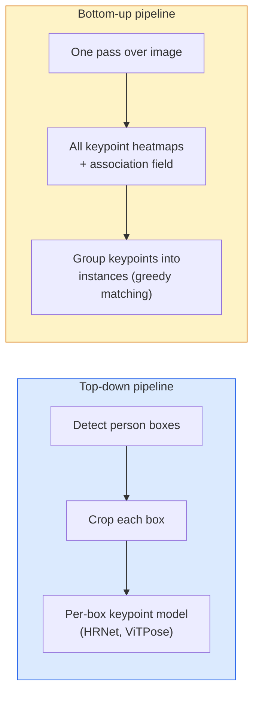

# Keypoint Detection & Pose Estimation

> Một tư thế (pose) là một tập hợp các keypoint có thứ tự. Một bộ phát hiện keypoint thực chất là một bộ hồi quy heatmap. Mọi thứ khác chỉ là các bước xử lý phụ trợ.

**Type:** Build
**Languages:** Python
**Prerequisites:** Phase 4 Lesson 06 (Detection), Phase 4 Lesson 07 (U-Net)
**Time:** ~45 minutes

## Learning Objectives

- Phân biệt giữa pose estimation theo hướng top-down và bottom-up, đồng thời xác định khi nào nên sử dụng mỗi loại.
- Hồi quy các heatmap cho K keypoint với mục tiêu là Gaussian-per-keypoint và trích xuất tọa độ keypoint tại thời điểm inference.
- Giải thích Part Affinity Fields (PAFs) và cách các pipeline bottom-up liên kết các keypoint thành từng đối tượng (instance).
- Sử dụng MediaPipe Pose hoặc MMPose cho việc ước tính keypoint trong môi trường production và hiểu định dạng đầu ra của chúng.

## The Problem

Các tác vụ keypoint ẩn dưới nhiều tên gọi khác nhau: tư thế con người (17 khớp cơ thể), các điểm mốc trên khuôn mặt (68 hoặc 478 điểm), bàn tay (21 điểm), tư thế động vật, tư thế vật thể robot, các điểm mốc giải phẫu y tế. Tất cả đều có chung một cấu trúc: phát hiện K điểm rời rạc trên một vật thể và xuất ra tọa độ (x, y) của chúng.

Pose estimation là nền tảng của motion capture, ứng dụng thể dục, phân tích thể thao, điều khiển bằng cử chỉ, hoạt hình, thử đồ ảo (AR try-on) và gắp vật thể bằng robot. Trường hợp 2D đã rất hoàn thiện; pose 3D (ước tính vị trí khớp trong tọa độ thế giới từ một camera duy nhất) là biên giới nghiên cứu hiện nay.

Vấn đề kỹ thuật nằm ở quy mô. Pose cho một người trong một ảnh là bài toán 20ms. Pose cho nhiều người trong đám đông ở tốc độ 30 fps là một bài toán khác với các kiến trúc khác biệt.

## The Concept

### Top-down vs bottom-up



- **Top-down** — phát hiện người trước, sau đó chạy mô hình keypoint cho từng người trên mỗi vùng cắt (crop). Độ chính xác cao nhất; quy mô tăng tuyến tính theo số lượng người.
- **Bottom-up** — một lần forward pass dự đoán tất cả các keypoint cộng với một trường liên kết (association field); sau đó nhóm chúng lại. Thời gian xử lý không đổi bất kể quy mô đám đông.

Top-down (HRNet, ViTPose) dẫn đầu về độ chính xác; bottom-up (OpenPose, HigherHRNet) dẫn đầu về thông lượng (throughput) cho các cảnh đông người.

### Heatmap regression

Thay vì hồi quy `(x, y)` trực tiếp, hãy dự đoán một heatmap `H x W` cho mỗi keypoint với một khối Gaussian tập trung tại vị trí thực tế.

```
target[k, y, x] = exp(-((x - cx_k)^2 + (y - cy_k)^2) / (2 sigma^2))
```

Tại thời điểm inference, argmax của mỗi heatmap chính là vị trí keypoint được dự đoán.

Tại sao heatmap hoạt động tốt hơn hồi quy trực tiếp: cấu trúc không gian của mạng (conv feature map) tự nhiên khớp với đầu ra không gian. Các mục tiêu Gaussian cũng đóng vai trò điều chuẩn (regularise) — một sai số định vị nhỏ tạo ra một loss nhỏ, thay vì bằng không.

### Sub-pixel localisation

Argmax chỉ cho ra tọa độ số nguyên. Để có độ chính xác sub-pixel, hãy tinh chỉnh bằng cách khớp một parabol vào vị trí argmax và các điểm lân cận, hoặc sử dụng hướng offset `(dx, dy) = 0.25 * (heatmap[y, x+1] - heatmap[y, x-1], ...)` đã biết.

### Part Affinity Fields (PAFs)

Thủ thuật của OpenPose cho việc liên kết bottom-up. Với mỗi cặp keypoint được kết nối (ví dụ: vai trái đến khuỷu tay trái), dự đoán một trường 2 kênh mã hóa vector đơn vị chỉ từ điểm này sang điểm kia. Để liên kết một vai với khuỷu tay của nó, hãy tích phân PAF dọc theo đường thẳng nối các cặp ứng viên; cặp có tích phân cao nhất sẽ được khớp.

```
For each connection (limb):
  PAF channels: 2 (unit vector x, y)
  Line integral: sum over sample points of (PAF . line_direction)
  Higher integral = stronger match
```

Cách tiếp cận này rất thanh lịch và có thể mở rộng cho đám đông bất kỳ mà không cần cắt ảnh theo từng người.

### COCO keypoints

Bộ dữ liệu tư thế cơ thể tiêu chuẩn: 17 keypoint mỗi người, sử dụng các chỉ số PCK (Percentage of Correct Keypoints) và OKS (Object Keypoint Similarity). OKS là tương đương của IoU trong keypoint và là chỉ số mà COCO mAP@OKS báo cáo.

### 2D vs 3D

- **2D pose** — tọa độ ảnh; đã được giải quyết ở chất lượng production (MediaPipe, HRNet, ViTPose).
- **3D pose** — tọa độ thế giới / camera; vẫn là lĩnh vực nghiên cứu tích cực. Các cách tiếp cận phổ biến:
  - Nâng các dự đoán 2D lên 3D bằng một MLP nhỏ (VideoPose3D).
  - Hồi quy 3D trực tiếp từ ảnh (PyMAF, MHFormer).
  - Thiết lập đa góc nhìn (CMU Panoptic) để lấy ground truth.

```figure
cv3-pose-heatmap
```

## Build It

### Step 1: Gaussian heatmap target

```python
import numpy as np
import torch

def gaussian_heatmap(size, cx, cy, sigma=2.0):
    yy, xx = np.meshgrid(np.arange(size), np.arange(size), indexing="ij")
    return np.exp(-((xx - cx) ** 2 + (yy - cy) ** 2) / (2 * sigma ** 2)).astype(np.float32)

hm = gaussian_heatmap(64, 32, 32, sigma=2.0)
print(f"peak: {hm.max():.3f} at ({hm.argmax() % 64}, {hm.argmax() // 64})")
```

Các heatmap cho từng keypoint được xếp chồng dọc theo trục kênh sẽ tạo ra tensor mục tiêu đầy đủ.

### Step 2: Tiny keypoint head

Một mô hình kiểu U-Net xuất ra K kênh heatmap.

```python
import torch.nn as nn
import torch.nn.functional as F

class TinyKeypointNet(nn.Module):
    def __init__(self, num_keypoints=4, base=16):
        super().__init__()
        self.down1 = nn.Sequential(nn.Conv2d(3, base, 3, 2, 1), nn.ReLU(inplace=True))
        self.down2 = nn.Sequential(nn.Conv2d(base, base * 2, 3, 2, 1), nn.ReLU(inplace=True))
        self.mid = nn.Sequential(nn.Conv2d(base * 2, base * 2, 3, 1, 1), nn.ReLU(inplace=True))
        self.up1 = nn.ConvTranspose2d(base * 2, base, 2, 2)
        self.up2 = nn.ConvTranspose2d(base, num_keypoints, 2, 2)

    def forward(self, x):
        h1 = self.down1(x)
        h2 = self.down2(h1)
        h3 = self.mid(h2)
        u1 = self.up1(h3)
        return self.up2(u1)
```

Đầu vào `(N, 3, H, W)`, đầu ra `(N, K, H, W)`. Loss là MSE trên mỗi pixel so với các mục tiêu Gaussian.

### Step 3: Inference — extract keypoint coordinates

```python
def heatmap_to_coords(heatmaps):
    """
    heatmaps: (N, K, H, W)
    returns:  (N, K, 2) float coordinates in image pixels
    """
    N, K, H, W = heatmaps.shape
    hm = heatmaps.reshape(N, K, -1)
    idx = hm.argmax(dim=-1)
    ys = (idx // W).float()
    xs = (idx % W).float()
    return torch.stack([xs, ys], dim=-1)

coords = heatmap_to_coords(torch.randn(2, 4, 32, 32))
print(f"coords: {coords.shape}")  # (2, 4, 2)
```

Một dòng code tại thời điểm inference. Để tinh chỉnh sub-pixel, hãy nội suy xung quanh argmax.

### Step 4: Synthetic keypoint dataset

Đơn giản: vẽ bốn điểm trên một khung hình trắng và học cách dự đoán chúng.

```python
def make_synthetic_sample(size=64):
    img = np.ones((3, size, size), dtype=np.float32)
    rng = np.random.default_rng()
    kps = rng.integers(8, size - 8, size=(4, 2))
    for cx, cy in kps:
        img[:, cy - 2:cy + 2, cx - 2:cx + 2] = 0.0
    hms = np.stack([gaussian_heatmap(size, cx, cy) for cx, cy in kps])
    return img, hms, kps
```

Đủ dễ để một mô hình nhỏ học trong một phút.

### Step 5: Training

```python
model = TinyKeypointNet(num_keypoints=4)
opt = torch.optim.Adam(model.parameters(), lr=3e-3)

for step in range(200):
    batch = [make_synthetic_sample() for _ in range(16)]
    imgs = torch.from_numpy(np.stack([b[0] for b in batch]))
    hms = torch.from_numpy(np.stack([b[1] for b in batch]))
    pred = model(imgs)
    # Upsample pred to full resolution
    pred = F.interpolate(pred, size=hms.shape[-2:], mode="bilinear", align_corners=False)
    loss = F.mse_loss(pred, hms)
    opt.zero_grad(); loss.backward(); opt.step()
```

## Use It

- **MediaPipe Pose** — bộ ước tính tư thế production của Google; tích hợp sẵn WebGL + runtime di động với độ trễ dưới 10ms.
- **MMPose** (OpenMMLab) — cơ sở mã nghiên cứu toàn diện; mọi kiến trúc SOTA với các trọng số đã được huấn luyện sẵn.
- **YOLOv8-pose** — tư thế đa người thời gian thực nhanh nhất với một lần forward pass duy nhất.
- **transformers HumanDPT / PoseAnything** — các cách tiếp cận vision-language mới hơn cho tư thế từ vựng mở (bất kỳ vật thể nào, bất kỳ tập hợp keypoint nào).

## Ship It

Bài học này tạo ra:

- `outputs/prompt-pose-stack-picker.md` — một prompt giúp chọn MediaPipe / YOLOv8-pose / HRNet / ViTPose dựa trên độ trễ, quy mô đám đông và nhu cầu 2D vs 3D.
- `outputs/skill-heatmap-to-coords.md` — một kỹ năng viết routine chuyển đổi heatmap-to-coordinate sub-pixel được sử dụng bởi mọi mô hình pose production.

## Exercises

1. **(Easy)** Huấn luyện mô hình keypoint nhỏ trên bộ dữ liệu 4 điểm tổng hợp. Báo cáo sai số L2 trung bình giữa các keypoint dự đoán và thực tế sau 200 bước.
2. **(Medium)** Thêm tinh chỉnh sub-pixel: với vị trí argmax, hãy khớp một parabol 1D dọc theo x và y từ các pixel lân cận. Báo cáo mức tăng độ chính xác so với argmax số nguyên.
3. **(Hard)** Xây dựng bộ dữ liệu tổng hợp 2 người, trong đó mỗi ảnh hiển thị hai instance của mẫu 4-keypoint. Huấn luyện một pipeline bottom-up với PAFs để dự đoán keypoint nào thuộc về instance nào, và đánh giá bằng OKS.

## Key Terms

| Thuật ngữ | Cách gọi thông thường | Ý nghĩa thực tế |
|------|----------------|----------------------|
| Keypoint | "Một điểm mốc" | Một điểm cụ thể có thứ tự trên vật thể (khớp, góc, đặc trưng) |
| Pose | "Bộ khung xương" | Một tập hợp các keypoint có thứ tự thuộc về một instance |
| Top-down | "Phát hiện rồi pose" | Pipeline hai giai đoạn: bộ phát hiện người + mô hình keypoint cho mỗi vùng cắt; độ chính xác cao nhất |
| Bottom-up | "Pose trước, nhóm sau" | Dự đoán tất cả keypoint trong một lần + nhóm lại; thời gian không đổi theo quy mô đám đông |
| Heatmap | "Mục tiêu Gaussian" | Tensor H x W cho mỗi keypoint với đỉnh tại vị trí thực; mục tiêu hồi quy ưu tiên |
| PAF | "Part Affinity Field" | Trường vector đơn vị 2 kênh mã hóa hướng chi; dùng để nhóm keypoint thành instance |
| OKS | "Keypoint IoU" | Object Keypoint Similarity; chỉ số COCO cho pose |
| HRNet | "High-Resolution Net" | Kiến trúc keypoint top-down thống trị; bảo toàn các đặc trưng độ phân giải cao xuyên suốt |

## Further Reading

- [OpenPose (Cao et al., 2017)](https://arxiv.org/abs/1812.08008) — bottom-up với PAFs; vẫn là tài liệu mô tả tốt nhất về cách tiếp cận này
- [HRNet (Sun et al., 2019)](https://arxiv.org/abs/1902.09212) — kiến trúc tham chiếu top-down
- [ViTPose (Xu et al., 2022)](https://arxiv.org/abs/2204.12484) — sử dụng ViT làm backbone cho pose; SOTA hiện tại trên nhiều benchmark
- [MediaPipe Pose](https://developers.google.com/mediapipe/solutions/vision/pose_landmarker) — pose thời gian thực cho production; stack được triển khai nhanh nhất vào năm 2026