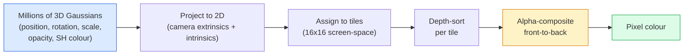

# 3D Gaussian Splatting từ con số 0

> Một cảnh quay là một đám mây gồm hàng triệu 3D Gaussian. Mỗi Gaussian có vị trí, hướng, tỷ lệ, độ mờ và màu sắc phụ thuộc vào hướng nhìn. Rasterise chúng, thực hiện backprop qua quá trình rasterisation, và xong.

**Type:** Build
**Languages:** Python
**Prerequisites:** Phase 4 Lesson 13 (3D Vision & NeRF), Phase 1 Lesson 12 (Tensor Operations), Phase 4 Lesson 10 (Diffusion basics optional)
**Time:** ~90 phút

## Mục tiêu học tập

- Giải thích lý do tại sao 3D Gaussian Splatting thay thế NeRF trở thành mặc định trong sản xuất cho tái tạo 3D chân thực vào năm 2026
- Nêu được sáu tham số cho mỗi Gaussian (vị trí, quaternion xoay, tỷ lệ, độ mờ, màu sắc spherical harmonics, đặc trưng tùy chọn) và số lượng float mà mỗi tham số đóng góp
- Triển khai một bộ rasterizer 2D Gaussian splatting từ đầu sử dụng `alpha` compositing, sau đó chỉ ra cách trường hợp 3D chiếu vào cùng một vòng lặp đó
- Sử dụng `nerfstudio`, `gsplat`, hoặc `SuperSplat` để tái tạo một cảnh từ 20-50 bức ảnh và xuất sang phần mở rộng `KHR_gaussian_splatting` glTF hoặc schema `UsdVolParticleField3DGaussianSplat` của OpenUSD 26.03

## Vấn đề

NeRF lưu trữ một cảnh dưới dạng trọng số của một MLP. Mỗi pixel được render là hàng trăm truy vấn MLP dọc theo một tia. Việc huấn luyện mất hàng giờ, render mất vài giây và các trọng số không thể chỉnh sửa — nếu bạn muốn di chuyển một chiếc ghế trong cảnh, bạn phải huấn luyện lại.

3D Gaussian Splatting (Kerbl, Kopanas, Leimkühler, Drettakis, SIGGRAPH 2023) đã thay thế tất cả những điều đó. Một cảnh là một tập hợp tường minh các 3D Gaussian. Render là quá trình GPU rasterisation ở tốc độ 100+ fps. Huấn luyện chỉ mất vài phút. Chỉnh sửa rất trực tiếp: dịch chuyển một tập hợp con các Gaussian và bạn đã di chuyển chiếc ghế. Đến năm 2026, Khronos Group đã phê chuẩn một phần mở rộng glTF cho Gaussian splats, OpenUSD 26.03 phát hành schema Gaussian splat, Zillow và Apartments.com render bất động sản bằng công nghệ này, và hầu hết các bài báo nghiên cứu mới về tái tạo 3D đều là các biến thể của ý tưởng 3DGS cốt lõi.

Mô hình tư duy rất đơn giản, toán học có đủ các thành phần chuyển động khiến hầu hết các phần giới thiệu đều bắt đầu từ rasterisation và bỏ qua các phép chiếu và spherical harmonics. Bài học này xây dựng toàn bộ hệ thống — phiên bản 2D trước, sau đó là phần mở rộng 3D.

## Khái niệm

### Một Gaussian mang theo những gì

Một 3D Gaussian là một khối tham số trong không gian với các thuộc tính sau:

```
position         mu         (3,)    centre in world coordinates
rotation         q          (4,)    unit quaternion encoding orientation
scale            s          (3,)    log-scales per axis (exponentiated at render time)
opacity          alpha      (1,)    post-sigmoid opacity [0, 1]
SH coefficients  c_lm       (3 * (L+1)^2,)   view-dependent colour
```

Xoay + tỷ lệ tạo thành một ma trận hiệp phương sai 3x3: `Sigma = R S S^T R^T`. Đó là hình dạng của Gaussian trong không gian 3D. Spherical harmonics cho phép màu sắc thay đổi theo hướng nhìn — các điểm sáng phản chiếu, độ bóng tinh tế, ánh sáng phụ thuộc vào góc nhìn — mà không cần lưu trữ texture cho mỗi góc nhìn. Với SH bậc 3, bạn có 16 hệ số cho mỗi kênh màu, 48 float cho mỗi Gaussian chỉ riêng cho màu sắc.

Một cảnh thường có từ 1-5 triệu Gaussian. Mỗi Gaussian lưu trữ khoảng 60 float (3 + 4 + 3 + 1 + 48 + linh tinh). Đó là 240 MB cho một cảnh 5 triệu Gaussian — nhỏ hơn nhiều so với point cloud tương đương với texture cho mỗi điểm, và nhỏ hơn một bậc so với trọng số MLP của NeRF khi render lại ở độ phân giải cao.

### Rasterisation, không phải ray marching



Năm bước, tất cả đều thân thiện với GPU. Không cần truy vấn MLP cho mỗi pixel. Một chiếc RTX 3080 Ti duy nhất render 6 triệu splat ở tốc độ 147 fps.

### Bước chiếu (Projection)

3D Gaussian tại vị trí thế giới `mu` với ma trận hiệp phương sai 3D `Sigma` chiếu thành một 2D Gaussian tại vị trí màn hình `mu'` với ma trận hiệp phương sai 2D `Sigma'`:

```
mu' = project(mu)
Sigma' = J W Sigma W^T J^T          (2 x 2)

W = viewing transform (rotation + translation of camera)
J = Jacobian of the perspective projection at mu'
```

Dấu chân của 2D Gaussian là một hình elip có các trục là các vector riêng của `Sigma'`. Mỗi pixel bên trong hình elip đó nhận đóng góp của Gaussian, được trọng số bởi `exp(-0.5 * (p - mu')^T Sigma'^-1 (p - mu'))`.

### Quy tắc alpha-compositing

Đối với một pixel, các Gaussian bao phủ nó được sắp xếp từ sau ra trước (hoặc tương đương từ trước ra sau với công thức đảo ngược). Màu sắc được tổng hợp với cùng phương trình như mọi bộ rasterizer bán trong suốt kể từ những năm 1980:

```
C_pixel = sum_i alpha_i * T_i * c_i

T_i = prod_{j < i} (1 - alpha_j)       transmittance up to i
alpha_i = opacity_i * exp(-0.5 * d^T Sigma'^-1 d)   local contribution
c_i = eval_SH(SH_i, view_direction)    view-dependent colour
```

Đây **là cùng một phương trình với render thể tích của NeRF**, chỉ khác là trên một tập hợp thưa thớt các Gaussian thay vì các mẫu dày đặc dọc theo một tia. Sự đồng nhất đó là lý do tại sao chất lượng render tương đương với NeRF — cả hai đều đang tích phân cùng một phương trình trường bức xạ (radiance-field).

### Tại sao nó có thể vi phân (differentiable)

Mọi bước — chiếu, gán tile, alpha compositing, đánh giá SH — đều có thể vi phân đối với các tham số Gaussian. Với một hình ảnh thực tế (ground-truth), tính toán loss của pixel đã render, backprop qua bộ rasterizer, cập nhật tất cả `(mu, q, s, alpha, c_lm)` bằng gradient descent. Sau khoảng 30.000 vòng lặp, các Gaussian tìm thấy vị trí, tỷ lệ và màu sắc chính xác của chúng.

### Làm dày (Densification) và tỉa (Pruning)

Một tập hợp Gaussian cố định không thể bao phủ một cảnh phức tạp. Quá trình huấn luyện bao gồm hai cơ chế thích nghi:

- **Clone** một Gaussian tại vị trí hiện tại khi độ lớn gradient của nó cao nhưng tỷ lệ của nó nhỏ — quá trình tái tạo cần thêm chi tiết ở đây.
- **Split** một Gaussian quy mô lớn thành hai Gaussian nhỏ hơn khi gradient của nó cao — một Gaussian lớn quá mịn để khớp với vùng đó.
- **Prune** các Gaussian có độ mờ giảm xuống dưới một ngưỡng — chúng không đóng góp gì cả.

Quá trình làm dày chạy sau mỗi N vòng lặp. Một cảnh thường phát triển từ ~100k Gaussian ban đầu (được gieo từ các điểm SfM) lên 1-5 triệu khi kết thúc huấn luyện.

### Spherical harmonics trong một đoạn văn

Màu sắc phụ thuộc vào góc nhìn là một hàm `c(direction)` trên mặt cầu đơn vị. Spherical harmonics là cơ sở Fourier của mặt cầu. Cắt bớt ở bậc `L` và bạn nhận được `(L+1)^2` hàm cơ sở cho mỗi kênh. Đánh giá màu sắc cho một góc nhìn mới là tích vô hướng giữa các hệ số SH đã học và cơ sở được đánh giá tại hướng nhìn. Bậc 0 = một hệ số = màu không đổi. Bậc 3 = 16 hệ số = đủ để nắm bắt đổ bóng Lambertian, phản xạ và phản chiếu nhẹ. Các bài báo về 3D Gaussian Splatting sử dụng bậc 3 theo mặc định.

### Stack sản xuất năm 2026

```
1. Capture         smartphone / DJI drone / handheld scanner
2. SfM / MVS       COLMAP or GLOMAP derives camera poses + sparse points
3. Train 3DGS      nerfstudio / gsplat / inria official / PostShot (~10-30 min on RTX 4090)
4. Edit            SuperSplat / SplatForge (clean floaters, segment)
5. Export          .ply -> glTF KHR_gaussian_splatting or .usd (OpenUSD 26.03)
6. View            Cesium / Unreal / Babylon.js / Three.js / Vision Pro
```

### Các biến thể 4D và tạo sinh (Generative)

- **4D Gaussian Splatting** — Các Gaussian là hàm của thời gian; được sử dụng cho video thể tích (Superman 2026, "Helicopter" của A$AP Rocky).
- **Generative splats** — các mô hình text-to-splat (Marble của World Labs) tạo ra toàn bộ cảnh.
- **3D Gaussian Unscented Transform** — Biến thể của NVIDIA NuRec cho mô phỏng lái xe tự động.

```figure
cv3-gaussian-splat
```

## Xây dựng

### Bước 1: Một 2D Gaussian

Trước tiên, chúng ta xây dựng một bộ rasterizer 2D. Trường hợp 3D sẽ quy về trường hợp này sau khi chiếu.

```python
import torch
import torch.nn as nn
import torch.nn.functional as F


def eval_2d_gaussian(means, covs, points):
    """
    means:  (G, 2)      centres
    covs:   (G, 2, 2)   covariance matrices
    points: (H, W, 2)   pixel coordinates
    returns: (G, H, W)  density at every pixel for every Gaussian
    """
    G = means.size(0)
    H, W, _ = points.shape
    flat = points.view(-1, 2)
    inv = torch.linalg.inv(covs)
    diff = flat[None, :, :] - means[:, None, :]
    d = torch.einsum("gpi,gij,gpj->gp", diff, inv, diff)
    density = torch.exp(-0.5 * d)
    return density.view(G, H, W)
```

`einsum` thực hiện dạng toàn phương `diff^T Sigma^-1 diff` cho mỗi cặp (Gaussian, pixel).

### Bước 2: Bộ rasterizer 2D splatting

Alpha-compositing từ trước ra sau. Độ sâu trong 2D không có ý nghĩa, vì vậy chúng ta sử dụng một scalar cho mỗi Gaussian đã học để sắp xếp thứ tự.

```python
def rasterise_2d(means, covs, colours, opacities, depths, image_size):
    """
    means:     (G, 2)
    covs:      (G, 2, 2)
    colours:   (G, 3)
    opacities: (G,)     in [0, 1]
    depths:    (G,)     per-Gaussian scalar used for ordering
    image_size: (H, W)
    returns:   (H, W, 3) rendered image
    """
    H, W = image_size
    yy, xx = torch.meshgrid(
        torch.arange(H, dtype=torch.float32, device=means.device),
        torch.arange(W, dtype=torch.float32, device=means.device),
        indexing="ij",
    )
    points = torch.stack([xx, yy], dim=-1)

    densities = eval_2d_gaussian(means, covs, points)
    alphas = opacities[:, None, None] * densities
    alphas = alphas.clamp(0.0, 0.99)

    order = torch.argsort(depths)
    alphas = alphas[order]
    colours_sorted = colours[order]

    T = torch.ones(H, W, device=means.device)
    out = torch.zeros(H, W, 3, device=means.device)
    for i in range(means.size(0)):
        a = alphas[i]
        out += (T * a)[..., None] * colours_sorted[i][None, None, :]
        T = T * (1.0 - a)
    return out
```

Không nhanh — một triển khai thực tế sử dụng các kernel CUDA dựa trên tile — nhưng toán học hoàn toàn chính xác và có thể vi phân hoàn toàn.

### Bước 3: Một cảnh splat 2D có thể huấn luyện

```python
class Splats2D(nn.Module):
    def __init__(self, num_splats=128, image_size=64, seed=0):
        super().__init__()
        g = torch.Generator().manual_seed(seed)
        H, W = image_size, image_size
        self.means = nn.Parameter(torch.rand(num_splats, 2, generator=g) * torch.tensor([W, H]))
        self.log_scale = nn.Parameter(torch.ones(num_splats, 2) * math.log(2.0))
        self.rot = nn.Parameter(torch.zeros(num_splats))  # single angle in 2D
        self.colour_logits = nn.Parameter(torch.randn(num_splats, 3, generator=g) * 0.5)
        self.opacity_logit = nn.Parameter(torch.zeros(num_splats))
        self.depth = nn.Parameter(torch.rand(num_splats, generator=g))

    def covs(self):
        s = torch.exp(self.log_scale)
        c, si = torch.cos(self.rot), torch.sin(self.rot)
        R = torch.stack([
            torch.stack([c, -si], dim=-1),
            torch.stack([si, c], dim=-1),
        ], dim=-2)
        S = torch.diag_embed(s ** 2)
        return R @ S @ R.transpose(-1, -2)

    def forward(self, image_size):
        covs = self.covs()
        colours = torch.sigmoid(self.colour_logits)
        opacities = torch.sigmoid(self.opacity_logit)
        return rasterise_2d(self.means, covs, colours, opacities, self.depth, image_size)
```

`log_scale`, `opacity_logit`, và `colour_logits` đều là các tham số không bị ràng buộc được ánh xạ qua hàm kích hoạt phù hợp tại thời điểm render. Đây là mô hình tiêu chuẩn cho mọi triển khai 3DGS.

### Bước 4: Khớp các 2D Gaussian với một hình ảnh mục tiêu

```python
import math
import numpy as np

def make_target(size=64):
    yy, xx = np.meshgrid(np.arange(size), np.arange(size), indexing="ij")
    img = np.zeros((size, size, 3), dtype=np.float32)
    # Red circle
    mask = (xx - 20) ** 2 + (yy - 20) ** 2 < 10 ** 2
    img[mask] = [1.0, 0.2, 0.2]
    # Blue square
    mask = (np.abs(xx - 45) < 8) & (np.abs(yy - 40) < 8)
    img[mask] = [0.2, 0.3, 1.0]
    return torch.from_numpy(img)


target = make_target(64)
model = Splats2D(num_splats=64, image_size=64)
opt = torch.optim.Adam(model.parameters(), lr=0.05)

for step in range(200):
    pred = model((64, 64))
    loss = F.mse_loss(pred, target)
    opt.zero_grad(); loss.backward(); opt.step()
    if step % 40 == 0:
        print(f"step {step:3d}  mse {loss.item():.4f}")
```

Sau 200 bước, 64 Gaussian ổn định thành hai hình dạng. Đó là toàn bộ ý tưởng — gradient-descent trên các nguyên hàm hình học tường minh.

### Bước 5: Từ 2D sang 3D

Phần mở rộng 3D giữ nguyên vòng lặp đó. Các bổ sung:

1. Xoay cho mỗi Gaussian là một quaternion thay vì một góc đơn lẻ.
2. Ma trận hiệp phương sai là `R S S^T R^T` với `R` được xây dựng từ quaternion và `S = diag(exp(log_scale))`.
3. Phép chiếu `(mu, Sigma) -> (mu', Sigma')` sử dụng các tham số ngoại lai (extrinsics) của camera và Jacobian của phép chiếu phối cảnh tại `mu`.
4. Màu sắc trở thành một khai triển spherical-harmonics; đánh giá nó tại hướng nhìn.
5. Sắp xếp độ sâu dựa trên z trong không gian camera thực tế thay vì một scalar đã học.

Mọi triển khai sản xuất (`gsplat`, `inria/gaussian-splatting`, `nerfstudio`) đều thực hiện chính xác điều này trên GPU với các kernel CUDA dựa trên tile.

### Bước 6: Đánh giá spherical harmonics

Cơ sở SH lên đến bậc 3 có 16 số hạng cho mỗi kênh. Đánh giá:

```python
def eval_sh_degree_3(sh_coeffs, dirs):
    """
    sh_coeffs: (..., 16, 3)   last dim is RGB channels
    dirs:      (..., 3)       unit vectors
    returns:   (..., 3)
    """
    C0 = 0.282094791773878
    C1 = 0.488602511902920
    C2 = [1.092548430592079, 1.092548430592079,
          0.315391565252520, 1.092548430592079,
          0.546274215296039]
    x, y, z = dirs[..., 0], dirs[..., 1], dirs[..., 2]
    x2, y2, z2 = x * x, y * y, z * z
    xy, yz, xz = x * y, y * z, x * z

    result = C0 * sh_coeffs[..., 0, :]
    result = result - C1 * y[..., None] * sh_coeffs[..., 1, :]
    result = result + C1 * z[..., None] * sh_coeffs[..., 2, :]
    result = result - C1 * x[..., None] * sh_coeffs[..., 3, :]

    result = result + C2[0] * xy[..., None] * sh_coeffs[..., 4, :]
    result = result + C2[1] * yz[..., None] * sh_coeffs[..., 5, :]
    result = result + C2[2] * (2.0 * z2 - x2 - y2)[..., None] * sh_coeffs[..., 6, :]
    result = result + C2[3] * xz[..., None] * sh_coeffs[..., 7, :]
    result = result + C2[4] * (x2 - y2)[..., None] * sh_coeffs[..., 8, :]

    # degree 3 terms omitted here for brevity; full 16-coefficient version in the code file
    return result
```

Các `sh_coeffs` đã học lưu trữ "màu sắc theo mọi hướng" cho Gaussian đó. Tại thời điểm render, bạn đánh giá dựa trên hướng nhìn hiện tại và nhận được một vector RGB 3 chiều.

## Sử dụng

Đối với công việc 3DGS thực tế, hãy sử dụng `gsplat` (Meta) hoặc `nerfstudio`:

```bash
pip install nerfstudio gsplat
ns-download-data example
ns-train splatfacto --data path/to/data
```

`splatfacto` là trình huấn luyện 3DGS của nerfstudio. Quá trình chạy mất 10-30 phút trên RTX 4090 cho một cảnh điển hình.

Các tùy chọn xuất quan trọng vào năm 2026:

- `.ply` — đám mây Gaussian thô (di động, tệp lớn nhất).
- `.splat` — định dạng định lượng PlayCanvas / SuperSplat.
- glTF `KHR_gaussian_splatting` — tiêu chuẩn Khronos, di động trên các trình xem (Feb 2026 RC).
- OpenUSD `UsdVolParticleField3DGaussianSplat` — định dạng gốc của USD, cho các pipeline NVIDIA Omniverse và Vision Pro.

Đối với các cảnh 4D / động, `4DGS` và `Deformable-3DGS` mở rộng cùng một bộ máy với các giá trị trung bình và độ mờ thay đổi theo thời gian.

## Triển khai

Bài học này tạo ra:

- `outputs/prompt-3dgs-capture-planner.md` — một prompt lập kế hoạch cho phiên chụp (số lượng ảnh, đường đi camera, ánh sáng) cho một loại cảnh nhất định.
- `outputs/skill-3dgs-export-router.md` — một kỹ năng chọn định dạng xuất phù hợp (`.ply` / `.splat` / glTF / USD) dựa trên trình xem hoặc engine hạ nguồn.

## Bài tập

1. **(Dễ)** Chạy trình huấn luyện splat 2D ở trên trên một hình ảnh tổng hợp khác. Thay đổi `num_splats` trong `[16, 64, 256]` và vẽ biểu đồ MSE theo bước cho mỗi trường hợp. Xác định điểm lợi nhuận giảm dần.
2. **(Trung bình)** Mở rộng bộ rasterizer 2D để hỗ trợ màu RGB cho mỗi Gaussian phụ thuộc vào "góc nhìn" scalar thông qua harmonic bậc 2. Huấn luyện trên một cặp hình ảnh mục tiêu và xác minh mô hình tái tạo được cả hai.
3. **(Khó)** Clone `nerfstudio` và huấn luyện `splatfacto` trên một bản chụp 20 ảnh của bất kỳ cảnh nào bạn có (bàn làm việc, cây cối, khuôn mặt, căn phòng). Xuất sang glTF `KHR_gaussian_splatting` và mở nó trong trình xem (Three.js `GaussianSplats3D`, SuperSplat, Babylon.js V9). Báo cáo thời gian huấn luyện, số lượng Gaussian và fps render được.

## Thuật ngữ chính

| Thuật ngữ | Cách gọi thông thường | Ý nghĩa thực tế |
|------|----------------|----------------------|
| 3DGS | "Gaussian splats" | Biểu diễn cảnh tường minh dưới dạng hàng triệu 3D Gaussian với vị trí, xoay, tỷ lệ, độ mờ, màu SH cho mỗi Gaussian |
| Covariance | "Hình dạng của Gaussian" | `Sigma = R S S^T R^T`; hướng và tỷ lệ bất đẳng hướng của một Gaussian |
| Alpha compositing | "Trộn từ sau ra trước" | Cùng phương trình với render thể tích của NeRF, nay trên một tập hợp thưa thớt tường minh |
| Densification | "Clone và split" | Thêm mới các Gaussian một cách thích nghi ở nơi tái tạo chưa khớp |
| Pruning | "Xóa độ mờ thấp" | Loại bỏ các Gaussian đã suy giảm về độ mờ gần bằng 0 trong quá trình huấn luyện |
| Spherical harmonics | "Màu phụ thuộc góc nhìn" | Cơ sở Fourier trên mặt cầu; lưu trữ màu sắc như một hàm của hướng nhìn |
| Splatfacto | "3DGS của nerfstudio" | Con đường dễ dàng nhất để huấn luyện 3DGS vào năm 2026 |
| `KHR_gaussian_splatting` | "Tiêu chuẩn glTF" | Phần mở rộng Khronos 2026 giúp 3DGS di động trên các trình xem và engine |

## Đọc thêm

- [3D Gaussian Splatting for Real-Time Radiance Field Rendering (Kerbl et al., SIGGRAPH 2023)](https://repo-sam.inria.fr/fungraph/3d-gaussian-splatting/) — bài báo gốc
- [gsplat (Meta/nerfstudio)](https://github.com/nerfstudio-project/gsplat) — bộ rasterizer CUDA chất lượng sản xuất
- [nerfstudio Splatfacto](https://docs.nerf.studio/nerfology/methods/splat.html) — công thức huấn luyện tham chiếu
- [Khronos KHR_gaussian_splatting extension](https://github.com/KhronosGroup/glTF/blob/main/extensions/2.0/Khronos/KHR_gaussian_splatting/README.md) — định dạng di động năm 2026
- [OpenUSD 26.03 release notes](https://openusd.org/release/) — schema `UsdVolParticleField3DGaussianSplat`
- [THE FUTURE 3D State of Gaussian Splatting 2026](https://www.thefuture3d.com/blog-0/2026/4/4/state-of-gaussian-splatting-2026) — tổng quan ngành công nghiệp