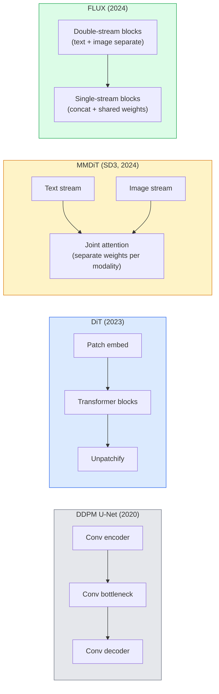

# Diffusion Transformers & Rectified Flow

> U-Net không phải là bí mật của diffusion. Hãy thay thế nó bằng một transformer, đổi lịch trình nhiễu (noise schedule) thành luồng đường thẳng (straight-line flow), và đột nhiên bạn có SD3, FLUX, cùng mọi mô hình text-to-image của năm 2026.

**Type:** Learn + Build
**Languages:** Python
**Prerequisites:** Phase 4 Lesson 10 (Diffusion DDPM), Phase 4 Lesson 14 (ViT), Phase 7 Lesson 02 (Self-Attention)
**Time:** ~75 phút

## Mục tiêu học tập

- Theo dõi sự tiến hóa từ U-Net DDPM (Bài 10) đến Diffusion Transformer (DiT), MMDiT (SD3), và DiT luồng đơn + luồng kép (FLUX)
- Giải thích rectified flow: tại sao quỹ đạo đường thẳng giữa nhiễu và dữ liệu cho phép mô hình lấy mẫu trong 20 bước thay vì 1000
- Triển khai một khối DiT nhỏ và vòng lặp huấn luyện rectified-flow, cả hai đều dưới 100 dòng code
- Phân biệt các biến thể mô hình (SD3, FLUX.1-dev, FLUX.1-schnell, Z-Image, Qwen-Image) theo kiến trúc, số lượng tham số và giấy phép

## Vấn đề

Bài 10 đã xây dựng một DDPM với bộ khử nhiễu U-Net. Công thức đó đã thống trị giai đoạn 2020-2023: U-Net + beta schedule + hàm mất mát dự đoán nhiễu. Nó đã tạo ra Stable Diffusion 1.5, 2.1 và DALL-E 2.

Mọi mô hình text-to-image hiện đại năm 2026 đều đã vượt qua nó. Stable Diffusion 3, FLUX, SD4, Z-Image, Qwen-Image, Hunyuan-Image — không mô hình nào sử dụng U-Net. Chúng sử dụng Diffusion Transformers (DiT). SD3 và FLUX cũng thay thế lịch trình nhiễu DDPM bằng rectified flow, giúp làm thẳng đường đi từ nhiễu đến dữ liệu và cho phép suy luận (inference) trong 1-4 bước với các biến thể consistency hoặc distilled.

Sự thay đổi này rất quan trọng vì đó là lý do tại sao việc tạo ảnh dựa trên diffusion trở nên có thể kiểm soát, chính xác với prompt (SD3/SD4 đã giải quyết vấn đề hiển thị văn bản) và đạt tốc độ sản xuất. Hiểu về DiT + rectified flow chính là hiểu về stack tạo ảnh thế hệ mới năm 2026.

## Khái niệm

### Từ U-Net đến transformer



- **DiT** (Peebles & Xie, 2023) — thay thế U-Net bằng một transformer giống ViT trên các latent patch. Điều kiện hóa thông qua adaptive layer norm (AdaLN).
- **MMDiT** (SD3, Esser et al., 2024) — hai luồng với trọng số riêng biệt cho token văn bản và hình ảnh, chia sẻ chung một cơ chế attention.
- **FLUX** (Black Forest Labs, 2024) — N khối đầu tiên là luồng kép (double-stream) giống SD3, các khối sau đó nối ghép và chia sẻ trọng số (luồng đơn - single-stream) để đạt hiệu quả ở độ sâu lớn hơn.
- **Z-Image** (2025) — một DiT luồng đơn hiệu quả với 6B tham số, thách thức tư duy "quy mô là trên hết".

### Rectified flow trong một đoạn văn

DDPM định nghĩa quá trình thuận là một SDE nhiễu, nơi `x_t` bị làm hỏng dần. Quá trình ngược được học là một SDE thứ hai, được giải bằng 1000 bước nhỏ.

Rectified flow định nghĩa một phép nội suy **đường thẳng** giữa dữ liệu sạch và nhiễu thuần túy:

```
x_t = (1 - t) * x_0 + t * epsilon,     t in [0, 1]
```

Huấn luyện một mạng để dự đoán vận tốc `v_theta(x_t, t) = epsilon - x_0` — hướng thuận dọc theo đường thẳng từ dữ liệu sạch đến nhiễu (`dx_t/dt`). Trong quá trình lấy mẫu, bạn tích phân vận tốc này ngược lại để đi từ nhiễu về phía dữ liệu. ODE kết quả gần với đường thẳng hơn nhiều, vì vậy cần ít bước tích phân hơn để lấy mẫu.

SD3 gọi đây là **Rectified Flow Matching**. FLUX, Z-Image và hầu hết các mô hình năm 2026 đều sử dụng mục tiêu này. Suy luận điển hình: 20-30 bước Euler (xác định) so với 50+ bước DDIM trong chế độ DDPM cũ. Các biến thể distilled / turbo / schnell / LCM đưa con số này xuống còn 1-4 bước.

### Điều kiện hóa AdaLN

DiT điều kiện hóa theo timestep và class/text thông qua **adaptive layer norm**: dự đoán `scale` và `shift` từ vector điều kiện và áp dụng chúng sau LayerNorm. Cách này gọn gàng hơn nhiều so với điều biến kiểu FiLM trong U-Net và là mặc định trong mọi DiT hiện đại.

```
cond -> MLP -> (scale, shift, gate)
norm(x) * (1 + scale) + shift, then residual add * gate
```

### Text encoder trong SD3 và FLUX

- **SD3** sử dụng ba text encoder: hai mô hình CLIP + T5-XXL. Các embedding được nối ghép và đưa vào luồng hình ảnh dưới dạng điều kiện văn bản.
- **FLUX** sử dụng một CLIP-L + T5-XXL.
- Các biến thể **Qwen-Image / Z-Image** sử dụng text encoder riêng được căn chỉnh với LLM cơ sở của chúng.

Text encoder là một phần lớn lý do tại sao SD3/FLUX hiểu prompt tốt hơn nhiều so với SD1.5. Chỉ riêng T5-XXL đã có 4.7B tham số.

### Classifier-free guidance vẫn giữ nguyên giá trị

Rectified flow thay đổi bộ lấy mẫu, không phải cách điều kiện hóa. Classifier-free guidance (loại bỏ văn bản với xác suất 10% trong quá trình huấn luyện, trộn dự đoán có điều kiện và không điều kiện khi suy luận) hoạt động giống hệt với rectified flow. Hầu hết các mô hình năm 2026 sử dụng guidance scale 3.5-5 — thấp hơn mức 7.5 của SD1.5 vì các mô hình rectified-flow tuân thủ prompt chặt chẽ hơn theo mặc định.

### Consistency, Turbo, Schnell, LCM

Bốn cái tên cho cùng một ý tưởng: chưng cất (distill) một mô hình nhiều bước chậm thành một mô hình ít bước nhanh.

- **LCM (Latent Consistency Model)** — huấn luyện một học viên dự đoán `x_0` cuối cùng từ bất kỳ `x_t` trung gian nào trong một bước.
- **SDXL Turbo / FLUX schnell** — các mô hình 1-4 bước được huấn luyện bằng adversarial diffusion distillation.
- **SD Turbo** — các mô hình Consistency kiểu OpenAI được điều chỉnh cho latent diffusion.

Việc triển khai sản xuất bất kỳ mô hình mới nào cũng đều cung cấp cả checkpoint "chất lượng đầy đủ" và biến thể "turbo / schnell". Schnell ("nhanh" trong tiếng Đức, quy ước của Black Forest Labs) chạy trong 1-4 bước và phù hợp với các pipeline thời gian thực.

### Bối cảnh mô hình năm 2026

| Mô hình | Kích thước | Kiến trúc | Giấy phép |
|-------|------|--------------|---------|
| Stable Diffusion 3 Medium | 2B | MMDiT | SAI Community |
| Stable Diffusion 3.5 Large | 8B | MMDiT | SAI Community |
| FLUX.1-dev | 12B | Double + Single Stream DiT | phi thương mại |
| FLUX.1-schnell | 12B | tương tự, đã chưng cất | Apache 2.0 |
| FLUX.2 | — | FLUX.1 lặp lại | hỗn hợp |
| Z-Image | 6B | S3-DiT (Scalable Single-Stream) | cho phép |
| Qwen-Image | ~20B | DiT + Qwen text tower | Apache 2.0 |
| Hunyuan-Image-3.0 | ~80B | DiT | nghiên cứu |
| SD4 Turbo | 3B | DiT + chưng cất | SAI Thương mại |

FLUX.1-schnell là mặc định mã nguồn mở năm 2026. Z-Image là người dẫn đầu về hiệu suất. FLUX.2 và SD4 là những đỉnh cao về chất lượng hiện nay.

### Tại sao sự thay đổi pha này quan trọng

DDPM + U-Net đã hoạt động tốt. DiT + rectified flow hoạt động **tốt hơn, nhanh hơn và mở rộng quy mô sạch hơn**. Sự chuyển đổi này tương tự như từ RNN sang transformer trong NLP: cả hai kiến trúc đều giải quyết cùng một vấn đề, nhưng transformer có khả năng mở rộng và hiện đang thống trị. Mọi bài báo năm 2026 về tạo ảnh, video hoặc 3D đều sử dụng bộ khử nhiễu dạng DiT và thường là mục tiêu rectified flow. U-Net DDPM hiện chủ yếu mang tính sư phạm (Bài 10).

```figure
cv3-rectified-flow
```

## Xây dựng

### Bước 1: Một khối DiT với AdaLN

```python
import torch
import torch.nn as nn


class AdaLNZero(nn.Module):
    """
    Adaptive LayerNorm with a gate. Predicts (scale, shift, gate) from the conditioning.
    Init such that the whole block starts as identity ("zero init").
    """

    def __init__(self, dim, cond_dim):
        super().__init__()
        self.norm = nn.LayerNorm(dim, elementwise_affine=False)
        self.mlp = nn.Linear(cond_dim, dim * 3)
        nn.init.zeros_(self.mlp.weight)
        nn.init.zeros_(self.mlp.bias)

    def forward(self, x, cond):
        scale, shift, gate = self.mlp(cond).chunk(3, dim=-1)
        h = self.norm(x) * (1 + scale.unsqueeze(1)) + shift.unsqueeze(1)
        return h, gate.unsqueeze(1)


class DiTBlock(nn.Module):
    def __init__(self, dim=192, heads=3, mlp_ratio=4, cond_dim=192):
        super().__init__()
        self.adaln1 = AdaLNZero(dim, cond_dim)
        self.attn = nn.MultiheadAttention(dim, heads, batch_first=True)
        self.adaln2 = AdaLNZero(dim, cond_dim)
        self.mlp = nn.Sequential(
            nn.Linear(dim, dim * mlp_ratio),
            nn.GELU(),
            nn.Linear(dim * mlp_ratio, dim),
        )

    def forward(self, x, cond):
        h, gate1 = self.adaln1(x, cond)
        a, _ = self.attn(h, h, h, need_weights=False)
        x = x + gate1 * a
        h, gate2 = self.adaln2(x, cond)
        x = x + gate2 * self.mlp(h)
        return x
```

`AdaLNZero` bắt đầu như một phép ánh xạ đồng nhất (identity mapping) vì trọng số MLP của nó được khởi tạo bằng 0. Quá trình huấn luyện sẽ đẩy khối này ra khỏi trạng thái đồng nhất; điều này giúp ổn định các mô hình diffusion transformer sâu một cách đáng kể.

### Bước 2: Một DiT nhỏ

```python
def timestep_embedding(t, dim):
    import math
    half = dim // 2
    freqs = torch.exp(-math.log(10000) * torch.arange(half, device=t.device) / half)
    args = t[:, None].float() * freqs[None]
    return torch.cat([args.sin(), args.cos()], dim=-1)


class TinyDiT(nn.Module):
    def __init__(self, image_size=16, patch_size=2, in_channels=3, dim=96, depth=4, heads=3):
        super().__init__()
        self.patch_size = patch_size
        self.num_patches = (image_size // patch_size) ** 2
        self.patch = nn.Conv2d(in_channels, dim, kernel_size=patch_size, stride=patch_size)
        self.pos = nn.Parameter(torch.zeros(1, self.num_patches, dim))
        self.time_mlp = nn.Sequential(
            nn.Linear(dim, dim * 2),
            nn.SiLU(),
            nn.Linear(dim * 2, dim),
        )
        self.blocks = nn.ModuleList([DiTBlock(dim, heads, cond_dim=dim) for _ in range(depth)])
        self.norm_out = nn.LayerNorm(dim, elementwise_affine=False)
        self.head = nn.Linear(dim, patch_size * patch_size * in_channels)

    def forward(self, x, t):
        n = x.size(0)
        x = self.patch(x)
        x = x.flatten(2).transpose(1, 2) + self.pos
        t_emb = self.time_mlp(timestep_embedding(t, self.pos.size(-1)))
        for blk in self.blocks:
            x = blk(x, t_emb)
        x = self.norm_out(x)
        x = self.head(x)
        return self._unpatchify(x, n)

    def _unpatchify(self, x, n):
        p = self.patch_size
        h = w = int(self.num_patches ** 0.5)
        x = x.view(n, h, w, p, p, -1).permute(0, 5, 1, 3, 2, 4).reshape(n, -1, h * p, w * p)
        return x
```

### Bước 3: Huấn luyện Rectified flow

```python
import torch.nn.functional as F

def rectified_flow_train_step(model, x0, optimizer, device):
    model.train()
    x0 = x0.to(device)
    n = x0.size(0)
    t = torch.rand(n, device=device)
    epsilon = torch.randn_like(x0)
    x_t = (1 - t[:, None, None, None]) * x0 + t[:, None, None, None] * epsilon

    target_velocity = epsilon - x0
    pred_velocity = model(x_t, t)

    loss = F.mse_loss(pred_velocity, target_velocity)
    optimizer.zero_grad()
    loss.backward()
    optimizer.step()
    return loss.item()
```

So sánh với hàm mất mát dự đoán nhiễu của DDPM (Bài 10): cùng cấu trúc, mục tiêu khác nhau. Thay vì dự đoán nhiễu `epsilon`, chúng ta dự đoán **vận tốc** `epsilon - x_0`, hướng từ dữ liệu đến nhiễu dọc theo phép nội suy đường thẳng.

### Bước 4: Bộ lấy mẫu Euler

Rectified flow là một ODE. Phương pháp Euler là đơn giản nhất và đối với một mô hình rectified-flow được huấn luyện tốt, nó gần như chính xác như các bộ giải bậc cao hơn ở mức 20+ bước.

```python
@torch.no_grad()
def rectified_flow_sample(model, shape, steps=20, device="cpu"):
    model.eval()
    x = torch.randn(shape, device=device)
    dt = 1.0 / steps
    t = torch.ones(shape[0], device=device)
    for _ in range(steps):
        v = model(x, t)
        x = x - dt * v
        t = t - dt
    return x
```

20 bước. Trên một mô hình đã huấn luyện, điều này tạo ra các mẫu tương đương với DDPM 1000 bước.

### Bước 5: Kiểm tra toàn diện (Smoke test)

```python
import numpy as np

def synthetic_blobs(num=200, size=16, seed=0):
    rng = np.random.default_rng(seed)
    out = np.zeros((num, 3, size, size), dtype=np.float32)
    yy, xx = np.meshgrid(np.arange(size), np.arange(size), indexing="ij")
    for i in range(num):
        cx, cy = rng.uniform(4, size - 4, size=2)
        r = rng.uniform(2, 4)
        mask = (xx - cx) ** 2 + (yy - cy) ** 2 < r ** 2
        colour = rng.uniform(-1, 1, size=3)
        for c in range(3):
            out[i, c][mask] = colour[c]
    return torch.from_numpy(out)
```

Huấn luyện một `TinyDiT` trên dữ liệu này với rectified flow. Sau 500 bước, các đầu ra được lấy mẫu sẽ trông giống như những vệt màu mờ.

## Sử dụng

Để tạo ảnh thực tế với FLUX / SD3 / Z-Image, `diffusers` cung cấp API thống nhất cho mọi mô hình:

```python
from diffusers import FluxPipeline, StableDiffusion3Pipeline
import torch

pipe = FluxPipeline.from_pretrained(
    "black-forest-labs/FLUX.1-schnell",
    torch_dtype=torch.bfloat16,
).to("cuda")

out = pipe(
    prompt="a golden retriever surfing a tsunami, hyperrealistic, studio lighting",
    guidance_scale=0.0,           # schnell was trained without CFG
    num_inference_steps=4,
    max_sequence_length=256,
).images[0]
out.save("surf.png")
```

Ba dòng code. `FLUX.1-schnell` trong bốn bước. Thay đổi model id thành `black-forest-labs/FLUX.1-dev` để có chất lượng cao hơn ở mức 20-30 bước với CFG.

Đối với SD3:

```python
pipe = StableDiffusion3Pipeline.from_pretrained(
    "stabilityai/stable-diffusion-3.5-large",
    torch_dtype=torch.bfloat16,
).to("cuda")
out = pipe(prompt, guidance_scale=3.5, num_inference_steps=28).images[0]
```

## Triển khai

Bài học này tạo ra:

- `outputs/prompt-dit-model-picker.md` — lựa chọn giữa SD3, FLUX.1-dev, FLUX.1-schnell, Z-Image, SD4 Turbo dựa trên các ràng buộc về chất lượng, độ trễ và giấy phép.
- `outputs/skill-rectified-flow-trainer.md` — viết một vòng lặp huấn luyện hoàn chỉnh cho rectified flow với AdaLN DiT và lấy mẫu Euler.

## Bài tập

1. **(Dễ)** Huấn luyện TinyDiT ở trên trên tập dữ liệu blob tổng hợp trong 500 bước. So sánh các mẫu được tạo với 10, 20 và 50 bước Euler.
2. **(Trung bình)** Thêm điều kiện văn bản bằng cách nối ghép một class embedding đã học vào time embedding (10 "lớp" blob theo màu sắc). Lấy mẫu với lớp 0, 5 và 9 để xác minh màu sắc khớp nhau.
3. **(Khó)** Tính khoảng cách Fréchet (FID proxy) giữa các mẫu được tạo từ rectified-flow và các phiên bản DDPM của cùng một mạng có kích thước tương đương, được huấn luyện trên cùng dữ liệu với cùng số bước. Báo cáo mô hình nào hội tụ nhanh hơn.

## Thuật ngữ chính

| Thuật ngữ | Cách gọi thông thường | Ý nghĩa thực tế |
|------|----------------|----------------------|
| DiT | "Diffusion transformer" | Transformer thay thế U-Net làm bộ khử nhiễu diffusion; hoạt động trên các latent đã chia patch |
| AdaLN | "Adaptive layer norm" | Điều kiện hóa timestep/văn bản thông qua scale, shift, gate được học và áp dụng sau LayerNorm; tiêu chuẩn trong mọi DiT hiện đại |
| MMDiT | "Multi-modal DiT (SD3)" | Các luồng trọng số riêng biệt cho token văn bản và hình ảnh chia sẻ chung self-attention |
| Single-stream / double-stream | "FLUX trick" | N khối đầu là luồng kép (trọng số riêng cho mỗi modality), các khối sau là luồng đơn (nối ghép + chia sẻ trọng số) để đạt hiệu quả |
| Rectified flow | "Straight-line noise-to-data" | Nội suy tuyến tính giữa dữ liệu và nhiễu; mạng dự đoán vận tốc; cần ít bước ODE hơn khi suy luận |
| Velocity target | "epsilon - x_0" | Mục tiêu hồi quy trong rectified flow; hướng từ dữ liệu sạch đến nhiễu |
| CFG guidance | "classifier-free guidance" | Trộn dự đoán có điều kiện và không điều kiện; vẫn được sử dụng trong các mô hình rectified-flow |
| Schnell / turbo / LCM | "1-4 step distillation" | Các biến thể ít bước được chưng cất từ các mô hình chất lượng đầy đủ; dùng cho sản xuất thời gian thực |

## Đọc thêm

- [Scalable Diffusion Models with Transformers (Peebles & Xie, 2023)](https://arxiv.org/abs/2212.09748) — bài báo gốc về DiT
- [Scaling Rectified Flow Transformers (Esser et al., SD3 paper)](https://arxiv.org/abs/2403.03206) — MMDiT và rectified-flow ở quy mô lớn
- [FLUX.1 model card and technical report (Black Forest Labs)](https://huggingface.co/black-forest-labs/FLUX.1-dev) — chi tiết về double + single-stream
- [Z-Image: Efficient Image Generation Foundation Model (2025)](https://arxiv.org/html/2511.22699v1) — DiT luồng đơn 6B
- [Elucidating the Design Space of Diffusion (Karras et al., 2022)](https://arxiv.org/abs/2206.00364) — tài liệu tham khảo cho mọi đánh đổi trong thiết kế diffusion
- [Latent Consistency Models (Luo et al., 2023)](https://arxiv.org/abs/2310.04378) — cách LCM-LoRA giúp bạn suy luận trong 4 bước