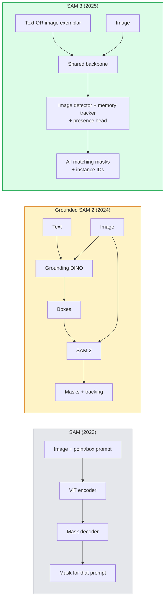

# SAM 3 & Open-Vocabulary Segmentation

> Cung cấp cho mô hình một prompt văn bản và một hình ảnh, sau đó nhận về các mask cho mọi đối tượng khớp với yêu cầu. SAM 3 thực hiện điều này chỉ trong một lần forward pass duy nhất.

**Type:** Use + Build
**Languages:** Python
**Prerequisites:** Phase 4 Lesson 07 (U-Net), Phase 4 Lesson 08 (Mask R-CNN), Phase 4 Lesson 18 (CLIP)
**Time:** ~60 phút

## Mục tiêu học tập

- Phân biệt giữa SAM (chỉ dùng visual prompt), Grounded SAM / SAM 2 (detector + SAM), và SAM 3 (native text prompt thông qua Promptable Concept Segmentation)
- Giải thích kiến trúc SAM 3: shared backbone + image detector + memory-based video tracker + presence head + thiết kế detector-tracker tách biệt
- Sử dụng tích hợp Hugging Face `transformers` SAM 3 để thực hiện detection, segmentation và video tracking bằng text prompt
- Lựa chọn giữa SAM 3, Grounded SAM 2, YOLO-World và SAM-MI dựa trên độ trễ (latency), độ phức tạp của khái niệm (concept complexity) và mục tiêu triển khai

## Vấn đề

SAM năm 2023 là mô hình chỉ hỗ trợ visual prompt: bạn nhấp vào một điểm hoặc vẽ một khung hình và nó trả về một mask. Để thực hiện yêu cầu "cho tôi tất cả các quả cam trong ảnh này", bạn cần một detector (Grounding DINO) để tạo ra các box, sau đó dùng SAM để segment từng đối tượng. Grounded SAM đã biến điều này thành một pipeline, nhưng đó là sự kết hợp của hai mô hình đóng băng (frozen models) với sự tích tụ lỗi không thể tránh khỏi.

SAM 3 (Meta, tháng 11/2025, ICLR 2026) đã loại bỏ sự kết hợp tầng này. Nó chấp nhận một cụm danh từ ngắn hoặc một hình ảnh mẫu (image exemplar) làm prompt và trả về tất cả các mask khớp và ID thực thể trong một lần forward pass duy nhất. Đó chính là **Promptable Concept Segmentation (PCS)**. Kết hợp với bản cập nhật Object Multiplex tháng 3/2026 (SAM 3.1), nó theo dõi nhiều thực thể của cùng một khái niệm qua video một cách hiệu quả.

Bài học này nói về sự thay đổi cấu trúc mà nó đại diện. 2D seg, detection và text-image grounding đã hợp nhất thành một mô hình. Câu hỏi trong sản xuất không còn là "tôi nên kết nối pipeline nào với nhau" mà là "mô hình promptable nào xử lý trọn vẹn (end-to-end) trường hợp sử dụng của tôi".

## Khái niệm

### Ba thế hệ



### Promptable Concept Segmentation

Một "concept prompt" là một cụm danh từ ngắn (`"yellow school bus"`, `"striped red umbrella"`, `"hand holding a mug"`) hoặc một hình ảnh mẫu. Mô hình trả về các mask segmentation cho mọi thực thể trong ảnh khớp với khái niệm đó, cộng với một ID thực thể duy nhất cho mỗi kết quả khớp.

Điều này khác với SAM visual-prompt cổ điển ở ba điểm:

1. Không cần prompt cho từng thực thể — một text prompt trả về tất cả các kết quả khớp.
2. Open-vocabulary — khái niệm có thể là bất cứ thứ gì mô tả được bằng ngôn ngữ tự nhiên.
3. Trả về nhiều thực thể cùng lúc thay vì một mask cho mỗi prompt.

### Các thành phần kiến trúc chính

- **Shared backbone** — một ViT duy nhất xử lý hình ảnh. Cả detector head và memory-based tracker đều đọc từ đó.
- **Presence head** — dự đoán liệu khái niệm đó có xuất hiện trong ảnh hay không. Tách biệt việc "nó có ở đây không?" với "nó ở đâu?". Giảm các kết quả dương tính giả (false positives) đối với các khái niệm không tồn tại.
- **Decoupled detector-tracker** — detection cấp độ ảnh và tracking cấp độ video có các head riêng biệt để không gây nhiễu lẫn nhau.
- **Memory bank** — lưu trữ các đặc trưng (features) theo từng thực thể qua các khung hình để theo dõi video (cơ chế tương tự SAM 2).

### Huấn luyện ở quy mô lớn

SAM 3 được huấn luyện trên **4 triệu khái niệm độc nhất** được tạo ra bởi một công cụ dữ liệu (data engine) thực hiện chú thích và sửa lỗi lặp đi lặp lại bằng AI + đánh giá của con người. Benchmark **SA-CO** mới chứa 270K khái niệm độc nhất, lớn gấp 50 lần so với các benchmark trước đó. SAM 3 đạt 75-80% hiệu suất của con người trên SA-CO và gấp đôi hiệu suất của các hệ thống hiện có trên PCS hình ảnh + video.

### SAM 3.1 Object Multiplex

Bản cập nhật tháng 3/2026: **Object Multiplex** giới thiệu cơ chế bộ nhớ chia sẻ (shared-memory) để theo dõi đồng thời nhiều thực thể của cùng một khái niệm. Trước đây, việc theo dõi N thực thể đồng nghĩa với N memory bank riêng biệt. Multiplex gộp chúng thành một bộ nhớ chia sẻ với các truy vấn theo từng thực thể. Kết quả: theo dõi đa đối tượng nhanh hơn đáng kể mà không làm giảm độ chính xác.

### Khi nào Grounded SAM vẫn quan trọng vào năm 2026

- Khi bạn cần thay thế một detector open-vocabulary cụ thể (DINO-X, Florence-2).
- Khi giấy phép của SAM 3 (được kiểm soát trên HF) là một rào cản.
- Khi bạn cần kiểm soát ngưỡng (threshold) của detector chặt chẽ hơn mức SAM 3 cho phép.
- Dành cho công việc nghiên cứu / ablation về thành phần detector.

Các pipeline dạng module vẫn có chỗ đứng. Đối với hầu hết công việc sản xuất, SAM 3 là câu trả lời đơn giản hơn.

### YOLO-World vs SAM 3

- **YOLO-World** — chỉ là detector open-vocabulary (không có mask). Thời gian thực. Tốt nhất khi bạn cần các box ở tốc độ khung hình cao (fps).
- **SAM 3** — full segmentation + tracking. Chậm hơn nhưng đầu ra phong phú hơn.

Phân chia trong sản xuất: YOLO-World cho các pipeline chỉ cần detection nhanh (điều hướng robot, dashboard nhanh), SAM 3 cho bất cứ thứ gì cần mask hoặc tracking.

### Hiệu quả của SAM-MI

SAM-MI (2025-2026) giải quyết nút thắt cổ chai của bộ giải mã (decoder) trong SAM. Các ý tưởng chính:

- **Sparse point prompting** — sử dụng một vài điểm được chọn kỹ thay vì các prompt dày đặc; giảm 96% số lần gọi decoder.
- **Shallow mask aggregation** — hợp nhất các dự đoán mask thô thành một mask sắc nét hơn.
- **Decoupled mask injection** — decoder nhận các đặc trưng mask đã tính toán trước thay vì chạy lại.

Kết quả: tốc độ nhanh hơn ~1.6 lần so với Grounded-SAM trên các benchmark open-vocabulary.

### Định dạng đầu ra cho ba mô hình

Tất cả đều trả về cùng một cấu trúc chung (boxes + labels + scores + masks + IDs), điều này rất hữu ích — pipeline hạ nguồn của bạn không cần phải phân nhánh dựa trên mô hình nào đã chạy.

```figure
cv3-open-vocab
```

## Build It

### Bước 1: Xây dựng Prompt

Xây dựng một helper chuyển đổi câu của người dùng thành danh sách các concept prompt cho SAM 3. Đây là ranh giới nơi "những gì người dùng nhập" gặp "những gì mô hình tiêu thụ".

```python
def split_concepts(sentence):
    """
    Heuristic splitter for multi-concept prompts.
    Returns list of short noun phrases.
    """
    for sep in [",", ";", "and", "or", "&"]:
        if sep in sentence:
            parts = [p.strip() for p in sentence.replace("and ", ",").split(",")]
            return [p for p in parts if p]
    return [sentence.strip()]

print(split_concepts("cats, dogs and balloons"))
```

SAM 3 chấp nhận một khái niệm cho mỗi lần forward pass; đối với các truy vấn đa khái niệm, hãy lặp hoặc batch chúng.

### Bước 2: Các helper xử lý hậu kỳ (Post-processing)

Chuyển đổi đầu ra thô của SAM 3 thành danh sách các detection sạch khớp với hợp đồng pipeline Phase 4 Lesson 16 của chúng ta.

```python
from dataclasses import dataclass
from typing import List

@dataclass
class ConceptDetection:
    concept: str
    instance_id: int
    box: tuple          # (x1, y1, x2, y2)
    score: float
    mask_rle: str       # run-length encoded


def rle_encode(binary_mask):
    flat = binary_mask.flatten().astype("uint8")
    runs = []
    prev, count = flat[0], 0
    for v in flat:
        if v == prev:
            count += 1
        else:
            runs.append((int(prev), count))
            prev, count = v, 1
    runs.append((int(prev), count))
    return ";".join(f"{v}x{c}" for v, c in runs)
```

RLE giữ cho payload phản hồi nhỏ ngay cả với nhiều mask độ phân giải cao. Định dạng tương tự hoạt động trên SAM 2, SAM 3, Grounded SAM 2.

### Bước 3: Giao diện segmentation open-vocab thống nhất

Bọc bất kỳ backend nào bạn có (SAM 3, Grounded SAM 2, YOLO-World + SAM 2) đằng sau một phương thức duy nhất. Mã hạ nguồn của bạn không thay đổi khi backend thay đổi.

```python
from abc import ABC, abstractmethod
import numpy as np

class OpenVocabSeg(ABC):
    @abstractmethod
    def detect(self, image: np.ndarray, concept: str) -> List[ConceptDetection]:
        ...


class StubOpenVocabSeg(OpenVocabSeg):
    """
    Deterministic stub used for pipeline testing when real models are not loaded.
    """
    def detect(self, image, concept):
        h, w = image.shape[:2]
        return [
            ConceptDetection(
                concept=concept,
                instance_id=0,
                box=(w * 0.2, h * 0.3, w * 0.5, h * 0.8),
                score=0.89,
                mask_rle="0x100;1x50;0x200",
            ),
            ConceptDetection(
                concept=concept,
                instance_id=1,
                box=(w * 0.55, h * 0.25, w * 0.85, h * 0.75),
                score=0.74,
                mask_rle="0x80;1x40;0x220",
            ),
        ]
```

Lớp con `SAM3OpenVocabSeg` thực tế sẽ bọc `transformers.Sam3Model` và `Sam3Processor`.

### Bước 4: Sử dụng Hugging Face SAM 3 (tham khảo)

Đối với mô hình thực tế, tích hợp `transformers`:

```python
from transformers import Sam3Processor, Sam3Model
import torch

processor = Sam3Processor.from_pretrained("facebook/sam3")
model = Sam3Model.from_pretrained("facebook/sam3").eval()

inputs = processor(images=pil_image, return_tensors="pt")
inputs = processor.set_text_prompt(inputs, "yellow school bus")

with torch.no_grad():
    outputs = model(**inputs)

masks = processor.post_process_masks(
    outputs.masks, inputs.original_sizes, inputs.reshaped_input_sizes
)
boxes = outputs.boxes
scores = outputs.scores
```

Một prompt, tất cả các kết quả khớp được trả về trong một lần gọi.

### Bước 5: Đo lường những gì Grounded SAM 2 đã mang lại miễn phí

Một benchmark trung thực: điều gì xảy ra khi bạn thay thế Grounded SAM 2 bằng SAM 3 trong một pipeline thực tế?

- Độ trễ: SAM 3 tiết kiệm một lần forward pass (không cần detector riêng) nhưng bản thân mô hình nặng hơn; thường là trung hòa hoặc nhanh hơn một chút.
- Độ chính xác: SAM 3 tốt hơn đáng kể đối với các khái niệm hiếm hoặc phức hợp ("chiếc ô màu đỏ có sọc"). Tương tự trên các khái niệm một từ phổ biến.
- Tính linh hoạt: Grounded SAM 2 cho phép bạn thay đổi detector (DINO-X, Florence-2, Grounding DINO 1.5); SAM 3 là nguyên khối (monolithic).

Kết luận: SAM 3 là mặc định cho seg open-vocab năm 2026. Grounded SAM 2 vẫn là câu trả lời đúng khi bạn cần sự linh hoạt của detector hoặc các điều khoản cấp phép khác.

## Use It

Các mô hình triển khai sản xuất:

- **Chú thích thời gian thực** — SAM 3 + tính năng label-as-text-prompt của CVAT. Người chú thích chọn tên nhãn; SAM 3 gán nhãn trước mọi thực thể khớp. Xem xét và sửa lỗi.
- **Phân tích video** — SAM 3.1 Object Multiplex cho theo dõi đa đối tượng; đưa các khung hình vào tracker dựa trên bộ nhớ.
- **Robot** — SAM 3 cho thao tác open-vocab ("nhặt cái cốc màu đỏ"); chạy như một primitive lập kế hoạch.
- **Hình ảnh y tế** — SAM 3 được tinh chỉnh (fine-tuned) trên các khái niệm y tế; yêu cầu quyền truy cập trên HF.

Ultralytics bọc SAM 3 trong gói Python của nó:

```python
from ultralytics import SAM

model = SAM("sam3.pt")
results = model(image_path, prompts="yellow school bus")
```

Giao diện tương tự như YOLO và SAM 2.

## Ship It

Bài học này tạo ra:

- `outputs/prompt-open-vocab-stack-picker.md` — một prompt chọn SAM 3 / Grounded SAM 2 / YOLO-World / SAM-MI dựa trên độ trễ, độ phức tạp của khái niệm và cấp phép.
- `outputs/skill-concept-prompt-designer.md` — một kỹ năng chuyển đổi lời nói của người dùng thành các concept prompt SAM 3 được định dạng tốt (tách, khử nhiễu, dự phòng).

## Bài tập

1. **(Dễ)** Chạy SAM 3 trên 10 hình ảnh với các concept prompt bạn chọn. So sánh với SAM 2 + Grounding DINO 1.5 trên cùng các hình ảnh đó. Báo cáo những khái niệm mà mỗi mô hình đã bỏ lỡ.
2. **(Trung bình)** Xây dựng UI "nhấp để bao gồm / nhấp để loại trừ" trên SAM 3: một text prompt trả về các thực thể ứng viên; người dùng nhấp để giữ lại những cái nào được tính là dương tính. Xuất tập hợp khái niệm cuối cùng dưới dạng JSON.
3. **(Khó)** Tinh chỉnh SAM 3 trên một tập hợp khái niệm tùy chỉnh (ví dụ: 5 loại linh kiện điện tử) với 20 hình ảnh được dán nhãn mỗi loại. So sánh với zero-shot SAM 3 trên cùng tập kiểm tra; đo lường sự cải thiện IoU của mask.

## Thuật ngữ chính

| Thuật ngữ | Cách gọi thông thường | Ý nghĩa thực tế |
|------|----------------|----------------------|
| Open-vocabulary segmentation | "Segment theo văn bản" | Tạo mask cho các đối tượng được mô tả bằng ngôn ngữ tự nhiên, không phải tập nhãn cố định |
| PCS | "Promptable Concept Segmentation" | Nhiệm vụ cốt lõi của SAM 3 — với một cụm danh từ hoặc hình ảnh mẫu, segment tất cả các thực thể khớp |
| Concept prompt | "Đầu vào văn bản" | Cụm danh từ ngắn hoặc hình ảnh mẫu; không phải là một câu đầy đủ |
| Presence head | "Nó có ở đây không?" | Module SAM 3 quyết định xem khái niệm có tồn tại trong ảnh hay không trước khi định vị |
| SA-CO | "Benchmark SAM 3" | Benchmark segmentation open-vocabulary 270K khái niệm; lớn gấp 50 lần so với các benchmark trước đó |
| Object Multiplex | "Bản cập nhật SAM 3.1" | Theo dõi đa đối tượng bằng bộ nhớ chia sẻ; theo dõi chung nhanh chóng nhiều thực thể |
| Grounded SAM 2 | "Pipeline dạng module" | Cascade Detector + SAM 2; vẫn phù hợp khi việc thay đổi detector là quan trọng |
| SAM-MI | "Biến thể SAM hiệu quả" | Mask Injection để tăng tốc 1.6x so với Grounded-SAM |

## Đọc thêm

- [SAM 3: Segment Anything with Concepts (arXiv 2511.16719)](https://arxiv.org/abs/2511.16719)
- [SAM 3.1 Object Multiplex (Meta AI, tháng 3/2026)](https://ai.meta.com/blog/segment-anything-model-3/)
- [Trang mô hình SAM 3 trên Hugging Face](https://huggingface.co/facebook/sam3)
- [Hướng dẫn Grounded SAM 2 (PyImageSearch)](https://pyimagesearch.com/2026/01/19/grounded-sam-2-from-open-set-detection-to-segmentation-and-tracking/)
- [Tài liệu Ultralytics SAM 3](https://docs.ultralytics.com/models/sam-3/)
- [SAM3-I: Instruction-aware SAM (arXiv 2512.04585)](https://arxiv.org/abs/2512.04585)