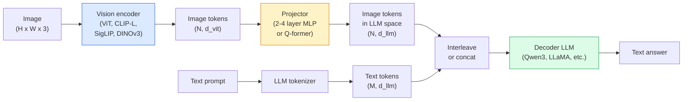

# Vision-Language Models — Mô hình ViT-MLP-LLM

> Một bộ mã hóa hình ảnh (vision encoder) chuyển đổi hình ảnh thành các token. Một bộ projector MLP ánh xạ các token đó vào không gian embedding của LLM. Một mô hình ngôn ngữ sẽ thực hiện phần còn lại. Mô hình đó — ViT-MLP-LLM — là tiêu chuẩn cho mọi VLM trong sản xuất vào năm 2026.

**Type:** Học + Sử dụng
**Languages:** Python
**Prerequisites:** Phase 4 Lesson 14 (ViT), Phase 4 Lesson 18 (CLIP), Phase 7 Lesson 02 (Self-Attention)
**Time:** ~75 phút

## Mục tiêu học tập

- Nêu được kiến trúc ViT-MLP-LLM và giải thích đóng góp của từng thành phần trong ba thành phần này
- So sánh Qwen3-VL, InternVL3.5, LLaVA-Next và GLM-4.6V về số lượng tham số, độ dài ngữ cảnh và hiệu suất trên các benchmark
- Giải thích DeepStack: tại sao các đặc trưng ViT đa tầng giúp căn chỉnh vision-language chặt chẽ hơn so với việc chỉ sử dụng đặc trưng lớp cuối
- Đo lường hiện tượng ảo tưởng (hallucination) của VLM trong sản xuất bằng Cross-Modal Error Rate (CMER) và xử lý dựa trên tín hiệu đó

## Vấn đề

CLIP (Phase 4 Lesson 18) cung cấp cho bạn một không gian embedding chung cho hình ảnh và văn bản, đủ để phân loại và truy xuất zero-shot. Nó không thể trả lời câu hỏi "có bao nhiêu chiếc xe màu đỏ trong hình này?" vì CLIP không tạo ra văn bản — nó chỉ tính điểm tương đồng.

Các Vision-Language Models (VLM) — Qwen3-VL, InternVL3.5, LLaVA-Next, GLM-4.6V — kết hợp một bộ mã hóa hình ảnh họ CLIP với một mô hình ngôn ngữ hoàn chỉnh. Mô hình nhìn thấy hình ảnh cộng với câu hỏi và tạo ra câu trả lời. Vào năm 2026, các VLM mã nguồn mở cạnh tranh hoặc vượt qua GPT-5 và Gemini-2.5-Pro trên các benchmark đa phương thức (MMMU, MMBench, DocVQA, ChartQA, MathVista, OSWorld).

Bộ ba thành phần (ViT, projector, LLM) là tiêu chuẩn. Sự khác biệt giữa các mô hình nằm ở việc chọn ViT nào, projector nào, LLM nào, dữ liệu huấn luyện và công thức căn chỉnh. Khi bạn đã hiểu mô hình này, việc thay thế bất kỳ thành phần nào đều trở nên đơn giản.

## Khái niệm

### Kiến trúc ViT-MLP-LLM



1. **Vision encoder** — một ViT đã được huấn luyện trước (CLIP-L/14, SigLIP, DINOv3, hoặc một biến thể đã tinh chỉnh). Tạo ra các patch token.
2. **Projector** — một module nhỏ (MLP 2-4 lớp, hoặc Q-former) ánh xạ các vision token vào chiều embedding của LLM. Đây là nơi diễn ra phần lớn quá trình tinh chỉnh (fine-tuning).
3. **LLM** — một mô hình ngôn ngữ chỉ giải mã (decoder-only) (Qwen3, Llama, Mistral, GLM, InternLM). Đọc các token hình ảnh + văn bản theo trình tự và tạo ra văn bản.

Về nguyên tắc, cả ba phần đều có thể huấn luyện được. Trong thực tế, vision encoder và LLM thường được đóng băng (frozen) trong khi projector được huấn luyện — giúp tiết kiệm chi phí với vài tỷ tham số tín hiệu.

### DeepStack

Projection thông thường chỉ sử dụng lớp ViT cuối cùng. DeepStack (Qwen3-VL) lấy mẫu các đặc trưng từ nhiều độ sâu ViT khác nhau và xếp chồng chúng. Các lớp sâu hơn mang ngữ nghĩa cấp cao; các lớp nông hơn mang thông tin không gian và kết cấu chi tiết. Việc đưa cả hai vào LLM giúp thu hẹp khoảng cách giữa "hình ảnh chứa gì" (ngữ nghĩa) và "chính xác ở đâu" (định vị không gian).

### Ba giai đoạn huấn luyện

Các VLM hiện đại huấn luyện theo từng giai đoạn:

1. **Alignment (Căn chỉnh)** — đóng băng ViT và LLM. Chỉ huấn luyện projector trên các cặp hình ảnh-chú thích. Dạy projector cách ánh xạ không gian hình ảnh vào không gian ngôn ngữ.
2. **Pre-training (Huấn luyện trước)** — mở đóng băng mọi thứ. Huấn luyện trên dữ liệu hình ảnh-văn bản xen kẽ quy mô lớn (hơn 500 triệu cặp). Xây dựng kiến thức thị giác cho mô hình.
3. **Instruction tuning (Tinh chỉnh hướng dẫn)** — tinh chỉnh trên các bộ ba (hình ảnh, câu hỏi, câu trả lời) đã được chọn lọc. Dạy hành vi hội thoại và định dạng tác vụ. Đây là bước biến một "LM có nhận thức thị giác" thành một trợ lý hữu dụng.

Hầu hết các tinh chỉnh LoRA đều nhắm vào giai đoạn 3 với một tập dữ liệu nhỏ có nhãn.

### So sánh các dòng mô hình (đầu năm 2026)

| Mô hình | Tham số | Vision encoder | LLM | Ngữ cảnh | Điểm mạnh |
|-------|--------|----------------|-----|---------|-----------|
| Qwen3-VL-235B-A22B (MoE) | 235B (22B active) | custom ViT + DeepStack | Qwen3 | 256K | SOTA tổng quát, tác nhân GUI |
| Qwen3-VL-30B-A3B (MoE) | 30B (3B active) | custom ViT + DeepStack | Qwen3 | 256K | Thay thế MoE nhỏ hơn |
| Qwen3-VL-8B (dense) | 8B | custom ViT | Qwen3 | 128K | Mặc định cho sản xuất |
| InternVL3.5-38B | 38B | InternViT-6B | Qwen3 + GPT-OSS | 128K | MMBench / MMVet mạnh |
| InternVL3.5-241B-A28B | 241B (28B active) | InternViT-6B | Qwen3 | 128K | Cạnh tranh với GPT-4o |
| LLaVA-Next 72B | 72B | SigLIP | Llama-3 | 32K | Mở, dễ tinh chỉnh |
| GLM-4.6V | ~70B | custom | GLM | 64K | Mã nguồn mở, OCR mạnh |
| MiniCPM-V-2.6 | 8B | SigLIP | MiniCPM | 32K | Thân thiện với thiết bị biên |

### Các tác nhân thị giác (Visual agents)

Qwen3-VL-235B đạt hiệu suất hàng đầu thế giới trên OSWorld — một benchmark cho các **tác nhân thị giác** vận hành GUI (desktop, di động, web). Mô hình nhìn thấy ảnh chụp màn hình, hiểu giao diện và đưa ra các hành động (nhấp, nhập, cuộn). Kết hợp với các công cụ, nó khép kín vòng lặp cho các tác vụ desktop thông thường. Đây là những gì hầu hết các bản demo "AI PC" năm 2026 chạy bên dưới.

### Khả năng tác nhân + Các biến thể RoPE

VLM cần biết **khi nào** một khung hình xuất hiện trong video. Qwen3-VL đã phát triển từ T-RoPE (temporal rotary position embeddings) sang **căn chỉnh thời gian dựa trên văn bản** — các token văn bản chứa dấu thời gian rõ ràng xen kẽ với các khung hình video. Mô hình nhìn thấy "`<timestamp 00:32>` frame, prompt" và có thể suy luận về các mối quan hệ thời gian.

### Vấn đề căn chỉnh

12% các cặp hình ảnh-văn bản trong tập dữ liệu thu thập chứa các mô tả không hoàn toàn dựa trên hình ảnh. Một VLM được huấn luyện trên dữ liệu này sẽ âm thầm học cách ảo tưởng — bịa đặt các đối tượng, đọc sai số liệu, phát minh ra các mối quan hệ. Trong sản xuất, đây là chế độ lỗi phổ biến nhất.

Skywork.ai đã giới thiệu **Cross-Modal Error Rate (CMER)** để theo dõi vấn đề này:

```
CMER = fraction of outputs where the text confidence is high but the image-text similarity (via a CLIP-family checker) is low
```

CMER cao có nghĩa là mô hình đang tự tin khẳng định những điều không có cơ sở trong hình ảnh. Việc giám sát CMER và coi nó như một KPI sản xuất đã giúp giảm tỷ lệ ảo tưởng khoảng 35% trong quá trình triển khai của họ. Bí quyết không phải là "sửa mô hình" mà là "chuyển các đầu ra có CMER cao sang cho con người kiểm duyệt."

### Tinh chỉnh với LoRA / QLoRA

Việc tinh chỉnh toàn bộ một VLM 70B là quá sức đối với hầu hết các đội ngũ. LoRA (rank 16-64) trên các lớp attention + projector, hoặc QLoRA với trọng số cơ sở 4-bit, có thể chạy trên một GPU A100 / H100 duy nhất. Chi phí: 5.000-50.000 ví dụ, $100-$5.000 về tính toán, 2-10 giờ huấn luyện.

### Suy luận không gian vẫn còn yếu

Các VLM hiện tại đạt 50-60% trên các benchmark suy luận không gian (trên-dưới, trái-phải, đếm, khoảng cách). Nếu trường hợp sử dụng của bạn phụ thuộc vào "đối tượng nào nằm trên đối tượng nào", hãy kiểm chứng kỹ lưỡng — hiệu suất VLM thông thường thấp hơn con người. Các giải pháp thay thế tốt hơn VLM cho các tác vụ không gian thuần túy: bộ ước tính keypoint / pose chuyên dụng, mô hình độ sâu, hoặc mô hình phát hiện đối tượng với hình học hộp bao (box geometry) được xử lý hậu kỳ.

```figure
v4-vlm-projector
```

## Xây dựng

### Bước 1: Projector

Phần bạn sẽ huấn luyện thường xuyên nhất. MLP 2-4 lớp với GELU.

```python
import torch
import torch.nn as nn


class Projector(nn.Module):
    def __init__(self, vit_dim=768, llm_dim=4096, hidden=4096):
        super().__init__()
        self.net = nn.Sequential(
            nn.Linear(vit_dim, hidden),
            nn.GELU(),
            nn.Linear(hidden, llm_dim),
        )

    def forward(self, x):
        return self.net(x)
```

Đầu vào là một tensor token `(N_patches, d_vit)`. Đầu ra là `(N_patches, d_llm)`. LLM coi mỗi hàng đầu ra như một token bình thường.

### Bước 2: Lắp ráp ViT-MLP-LLM hoàn chỉnh

Khung của forward pass cho một VLM tối giản. Mã thực tế sử dụng `transformers`; đây là bố cục khái niệm.

```python
class MinimalVLM(nn.Module):
    def __init__(self, vit, projector, llm, image_token_id):
        super().__init__()
        self.vit = vit
        self.projector = projector
        self.llm = llm
        self.image_token_id = image_token_id  # placeholder token in text prompt

    def forward(self, image, input_ids, attention_mask):
        # 1. vision features
        vision_tokens = self.vit(image)                     # (B, N_patches, d_vit)
        vision_embeds = self.projector(vision_tokens)       # (B, N_patches, d_llm)

        # 2. text embeddings
        text_embeds = self.llm.get_input_embeddings()(input_ids)  # (B, M, d_llm)

        # 3. replace image placeholder tokens with vision embeds
        merged = self._merge(text_embeds, vision_embeds, input_ids)

        # 4. run LLM
        return self.llm(inputs_embeds=merged, attention_mask=attention_mask)

    def _merge(self, text_embeds, vision_embeds, input_ids):
        out = text_embeds.clone()
        expected = vision_embeds.size(1)
        for b in range(input_ids.size(0)):
            positions = (input_ids[b] == self.image_token_id).nonzero(as_tuple=True)[0]
            if len(positions) != expected:
                raise ValueError(
                    f"batch item {b} has {len(positions)} image tokens but vision_embeds has {expected} patches."
                    " Every sample in the batch must be pre-padded to the same number of image placeholder tokens.")
            out[b, positions] = vision_embeds[b]
        return out
```

Token giữ chỗ `<image>` trong văn bản được thay thế bằng các embedding hình ảnh thực tế — cùng mô hình mà LLaVA, Qwen-VL và InternVL sử dụng.

### Bước 3: Tính toán CMER

Một kiểm tra runtime nhẹ.

```python
import torch.nn.functional as F


def cross_modal_error_rate(image_emb, text_emb, text_confidence, sim_threshold=0.25, conf_threshold=0.8):
    """
    image_emb, text_emb: embeddings of image and generated text (normalised internally)
    text_confidence:     mean per-token probability in [0, 1]
    Returns:             fraction of high-confidence outputs with low image-text alignment
    """
    image_emb = F.normalize(image_emb, dim=-1)
    text_emb = F.normalize(text_emb, dim=-1)
    sim = (image_emb * text_emb).sum(dim=-1)        # cosine similarity
    high_conf_low_sim = (text_confidence > conf_threshold) & (sim < sim_threshold)
    return high_conf_low_sim.float().mean().item()
```

Hãy coi CMER là một KPI sản xuất. Giám sát nó theo từng endpoint, từng loại prompt, từng khách hàng. CMER tăng cao cho thấy mô hình bắt đầu ảo tưởng trên một số phân phối đầu vào.

### Bước 4: VLM phân loại đồ chơi (có thể chạy được)

Chứng minh projector được huấn luyện. Các "đặc trưng ViT" giả đi vào; một token kiểu LLM nhỏ dự đoán một lớp.

```python
class ToyVLM(nn.Module):
    def __init__(self, vit_dim=32, llm_dim=64, num_classes=5):
        super().__init__()
        self.projector = Projector(vit_dim, llm_dim, hidden=64)
        self.head = nn.Linear(llm_dim, num_classes)

    def forward(self, vision_tokens):
        projected = self.projector(vision_tokens)
        pooled = projected.mean(dim=1)
        return self.head(pooled)
```

Người ta có thể chạy thử trên các cặp (đặc trưng, lớp) tổng hợp trong dưới 200 bước — đủ để cho thấy mô hình projector hoạt động.

## Sử dụng

Ba cách các đội ngũ sản xuất sử dụng VLM vào năm 2026:

- **Hosted API** — OpenAI Vision, Anthropic Claude Vision, Google Gemini Vision. Không cần hạ tầng, rủi ro từ nhà cung cấp.
- **Tự lưu trữ mã nguồn mở** — Qwen3-VL hoặc InternVL3.5 thông qua `transformers` và `vllm`. Kiểm soát hoàn toàn, nỗ lực ban đầu cao hơn.
- **Tinh chỉnh theo miền** — tải Qwen2.5-VL-7B hoặc LLaVA-1.6-7B, LoRA trên 5k-50k ví dụ tùy chỉnh, phục vụ với `vllm` hoặc `TGI`.

```python
from transformers import AutoProcessor, AutoModelForVision2Seq
import torch
from PIL import Image

model_id = "Qwen/Qwen3-VL-8B-Instruct"
processor = AutoProcessor.from_pretrained(model_id)
model = AutoModelForVision2Seq.from_pretrained(model_id, torch_dtype=torch.bfloat16, device_map="auto")

messages = [{
    "role": "user",
    "content": [
        {"type": "image", "image": Image.open("plot.png")},
        {"type": "text", "text": "What does this chart show?"},
    ],
}]
inputs = processor.apply_chat_template(messages, add_generation_prompt=True, tokenize=True, return_dict=True, return_tensors="pt").to("cuda")
generated = model.generate(**inputs, max_new_tokens=256)
answer = processor.decode(generated[0][inputs["input_ids"].shape[1]:], skip_special_tokens=True)
```

`apply_chat_template` ẩn việc token hóa token giữ chỗ `<image>`; mô hình xử lý việc hợp nhất nội bộ.

## Triển khai

Bài học này tạo ra:

- `outputs/prompt-vlm-selector.md` — chọn Qwen3-VL / InternVL3.5 / LLaVA-Next / API dựa trên độ chính xác, độ trễ, độ dài ngữ cảnh và ngân sách.
- `outputs/skill-cmer-monitor.md` — xuất mã để đo lường một endpoint VLM sản xuất với tỷ lệ lỗi đa phương thức, bảng điều khiển theo endpoint và ngưỡng cảnh báo.

## Bài tập

1. **(Dễ)** Chạy ba prompt ("đây là gì?", "đếm các đối tượng", "mô tả cảnh") qua bất kỳ VLM mở nào trên năm hình ảnh. Đánh giá thủ công từng câu trả lời là đúng / đúng một phần / ảo tưởng. Tính tỷ lệ giống CMER lần đầu.
2. **(Trung bình)** Tinh chỉnh Qwen2.5-VL-3B hoặc LLaVA-1.6-7B với LoRA (rank 16) trên 500 hình ảnh của một miền mục tiêu với chú thích. So sánh độ chính xác kiểu MMBench giữa zero-shot và đã tinh chỉnh.
3. **(Khó)** Thay thế bộ mã hóa hình ảnh của VLM bằng DINOv3 thay vì SigLIP/CLIP mặc định. Chỉ huấn luyện lại projector (LLM đóng băng + DINOv3 đóng băng). Đo lường xem các tác vụ dự đoán dày đặc (đếm, suy luận không gian) có cải thiện không.

## Thuật ngữ chính

| Thuật ngữ | Cách gọi thông thường | Ý nghĩa thực tế |
|------|----------------|----------------------|
| ViT-MLP-LLM | "Mô hình VLM" | Vision encoder + projector + language model; mọi VLM 2026 |
| Projector | "Cây cầu" | MLP 2-4 lớp (hoặc Q-former) ánh xạ vision token vào không gian embedding LLM |
| DeepStack | "Thủ thuật đặc trưng Qwen3-VL" | Các đặc trưng ViT đa tầng được xếp chồng thay vì chỉ lớp cuối |
| Image token | "Token giữ chỗ <image>" | Token đặc biệt trong luồng văn bản được thay thế bằng các embedding thị giác đã chiếu |
| CMER | "KPI ảo tưởng" | Cross-Modal Error Rate; cao khi độ tin cậy văn bản cao nhưng độ tương đồng hình ảnh-văn bản thấp |
| Visual agent | "VLM biết nhấp chuột" | VLM vận hành GUI (OSWorld, di động, web) với các lệnh gọi công cụ |
| Q-former | "Cầu nối token số lượng cố định" | Projector kiểu BLIP-2 tạo ra số lượng token truy vấn thị giác cố định |
| Alignment / pre-training / instruction tuning | "Ba giai đoạn" | Quy trình huấn luyện VLM tiêu chuẩn |

## Đọc thêm

- [Báo cáo kỹ thuật Qwen3-VL (arXiv 2511.21631)](https://arxiv.org/abs/2511.21631)
- [InternVL3.5 Thúc đẩy các mô hình đa phương thức mã nguồn mở (arXiv 2508.18265)](https://arxiv.org/html/2508.18265v1)
- [Dòng LLaVA-Next](https://llava-vl.github.io/blog/2024-05-10-llava-next-stronger-llms/)
- [BentoML: Các VLM mã nguồn mở tốt nhất 2026](https://www.bentoml.com/blog/multimodal-ai-a-guide-to-open-source-vision-language-models)
- [MMMU: Benchmark hiểu đa phương thức đa ngành](https://mmmu-benchmark.github.io/)
- [VLM trong sản xuất (Robotics Tomorrow, tháng 3/2026)](https://www.roboticstomorrow.com/story/2026/03/when-machines-learn-to-see-like-experts-the-rise-of-vision-language-models-in-manufacturing/26335/)