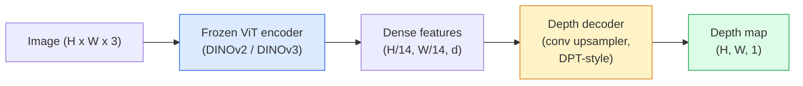

# Ước lượng Độ sâu Đơn ảnh & Hình học (Monocular Depth & Geometry Estimation)

> Bản đồ độ sâu (depth map) là một hình ảnh đơn kênh, trong đó mỗi pixel đại diện cho khoảng cách từ camera. Việc dự đoán bản đồ này từ một khung hình RGB đơn lẻ từng là điều bất khả thi nếu không có stereo hoặc LiDAR. Vào năm 2026, một bộ mã hóa ViT đóng băng kết hợp với một head nhẹ đã đạt được độ chính xác gần với ground truth chỉ trong vài phần trăm sai số.

**Type:** Build + Use
**Languages:** Python
**Prerequisites:** Phase 4 Lesson 14 (ViT), Phase 4 Lesson 17 (Self-Supervised Vision), Phase 4 Lesson 07 (U-Net)
**Time:** ~60 phút

## Mục tiêu học tập

- Phân biệt độ sâu tương đối (relative depth) và độ sâu hệ mét (metric depth), đồng thời xác định mô hình sản xuất nào (MiDaS, Marigold, Depth Anything V3, ZoeDepth) giải quyết loại bài toán nào.
- Sử dụng Depth Anything V3 (backbone DINOv2) để dự đoán độ sâu cho các hình ảnh tùy ý mà không cần hiệu chuẩn (calibration).
- Giải thích lý do tại sao ước lượng độ sâu đơn ảnh có thể hoạt động từ một hình ảnh duy nhất (các tín hiệu phối cảnh, gradient kết cấu, các priors đã học) và những gì mô hình không thể khôi phục (tỷ lệ tuyệt đối, hình học bị che khuất).
- Chuyển đổi các phát hiện 2D thành các điểm 3D bằng cách sử dụng bản đồ độ sâu và các thông số nội tại (intrinsics) của camera lỗ kim (pinhole camera).

## Vấn đề

Độ sâu là trục còn thiếu trong thị giác máy tính 2D. Với RGB, bạn biết các vật thể xuất hiện ở đâu trên mặt phẳng hình ảnh; nhưng bạn không biết chúng cách bao xa. Các cảm biến độ sâu (giàn stereo, LiDAR, time-of-flight) giải quyết trực tiếp vấn đề này nhưng lại đắt đỏ, dễ hỏng và bị giới hạn về phạm vi.

Ước lượng độ sâu đơn ảnh — dự đoán độ sâu từ một khung hình RGB duy nhất — trước đây thường cho ra kết quả mờ và không đáng tin cậy. Đến năm 2026, các bộ mã hóa tiền huấn luyện quy mô lớn đã thay đổi điều đó: Depth Anything V3 sử dụng backbone DINOv2 đóng băng và tạo ra các bản đồ độ sâu có khả năng tổng quát hóa trên các lĩnh vực trong nhà, ngoài trời, y tế và vệ tinh. Marigold tái cấu trúc độ sâu thành một bài toán khuếch tán có điều kiện (conditional diffusion). ZoeDepth hồi quy các khoảng cách hệ mét thực tế.

Độ sâu cũng là cầu nối giữa phát hiện 2D và hiểu biết 3D: nhân các pixel của hộp phát hiện với độ sâu và bạn sẽ nâng vật thể 2D đó thành một đám mây điểm 3D. Đó là cốt lõi của mọi hệ thống che khuất AR, mọi pipeline tránh chướng ngại vật và mọi robot "nhặt cốc".

## Khái niệm

### Độ sâu tương đối vs độ sâu hệ mét

- **Độ sâu tương đối (Relative depth)** — các giá trị `z` có thứ tự nhưng không có đơn vị thực tế. "Pixel A gần hơn pixel B, nhưng tỷ lệ khoảng cách không được gắn với mét."
- **Độ sâu hệ mét (Metric depth)** — khoảng cách tuyệt đối tính bằng mét từ camera. Yêu cầu mô hình phải học được mối quan hệ thống kê giữa các tín hiệu hình ảnh và khoảng cách thực tế.

MiDaS và Depth Anything V3 tạo ra độ sâu tương đối. Marigold tạo ra độ sâu tương đối. ZoeDepth, UniDepth và Metric3D tạo ra độ sâu hệ mét. Các mô hình hệ mét nhạy cảm với các thông số nội tại của camera; các mô hình tương đối thì không.

### Mô hình Encoder-Decoder



Depth Anything V3 đóng băng bộ mã hóa (encoder) và chỉ huấn luyện bộ giải mã (decoder) kiểu DPT. Bộ mã hóa cung cấp các đặc trưng phong phú; bộ giải mã nội suy chúng trở lại độ phân giải hình ảnh và hồi quy độ sâu.

### Tại sao một hình ảnh đơn lẻ có thể tạo ra độ sâu?

Một hình ảnh 2D chứa nhiều tín hiệu đơn ảnh tương quan với độ sâu:

- **Phối cảnh (Perspective)** — các đường song song trong 3D hội tụ trong 2D.
- **Gradient kết cấu (Texture gradient)** — các bề mặt ở xa có kết cấu nhỏ hơn và dày đặc hơn.
- **Thứ tự che khuất (Occlusion order)** — các vật thể gần hơn che khuất các vật thể ở xa hơn.
- **Sự ổn định kích thước (Size constancy)** — các vật thể quen thuộc (ô tô, con người) cung cấp tỷ lệ xấp xỉ.
- **Phối cảnh khí quyển (Atmospheric perspective)** — các vật thể ở xa trông mờ hơn và xanh hơn trong các cảnh ngoài trời.

Một ViT được huấn luyện trên hàng tỷ hình ảnh đã nội hóa các tín hiệu này. Với đủ dữ liệu và một backbone mạnh, độ sâu đơn ảnh đạt được độ chính xác hợp lý mà không cần bất kỳ sự giám sát 3D rõ ràng nào.

### Những gì độ sâu đơn ảnh không thể làm được

- **Tỷ lệ hệ mét tuyệt đối** nếu không có thông số nội tại hoặc một vật thể đã biết trong cảnh. Mạng có thể dự đoán "cái cốc cách xa gấp đôi cái thìa" mà không cần biết cái cốc cách 1m hay 10m.
- **Hình học bị che khuất** — mặt sau của một chiếc ghế không được nhìn thấy và không thể suy luận một cách đáng tin cậy.
- **Các bề mặt không có kết cấu / phản chiếu** — gương, kính, tường đồng nhất. Mạng sẽ báo cáo độ sâu có vẻ hợp lý nhưng sai lệch.

### Depth Anything V3 vào năm 2026

- Sử dụng DINOv2 ViT-L/14 nguyên bản làm encoder (đóng băng).
- Decoder DPT.
- Huấn luyện trên các cặp hình ảnh có tư thế từ nhiều nguồn đa dạng (không cần giám sát độ sâu rõ ràng ngoài tính nhất quán quang trắc).
- Dự đoán hình học nhất quán về không gian từ **một số lượng tùy ý các đầu vào hình ảnh, có hoặc không có tư thế camera đã biết**.
- SOTA trên các tác vụ độ sâu đơn ảnh, hình học mọi góc nhìn, kết xuất hình ảnh, ước lượng tư thế camera.

Đây là mô hình "cắm và chạy" để sử dụng khi bạn cần độ sâu vào năm 2026.

### Marigold — khuếch tán cho độ sâu

Marigold (Ke và cộng sự, CVPR 2024) tái cấu trúc ước lượng độ sâu thành khuếch tán hình ảnh-sang-hình ảnh có điều kiện. Điều kiện: RGB. Mục tiêu: bản đồ độ sâu. Sử dụng U-Net của Stable Diffusion 2 làm backbone. Các bản đồ độ sâu đầu ra cực kỳ sắc nét tại các ranh giới vật thể. Đánh đổi: suy luận chậm hơn so với các mô hình feed-forward (10-50 bước khử nhiễu).

### Thông số nội tại và camera lỗ kim

Để nâng một pixel `(u, v)` với độ sâu `d` thành một điểm 3D `(X, Y, Z)` trong tọa độ camera:

```
fx, fy, cx, cy = camera intrinsics
X = (u - cx) * d / fx
Y = (v - cy) * d / fy
Z = d
```

Các thông số nội tại (intrinsics) đến từ siêu dữ liệu EXIF, mẫu hiệu chuẩn hoặc bộ ước lượng thông số nội tại đơn ảnh (Perspective Fields, UniDepth). Nếu không có thông số nội tại, bạn vẫn có thể kết xuất đám mây điểm bằng cách giả định FOV 60-70° và các thông số chính ở độ phân giải trung bình — có thể dùng để trực quan hóa, không dùng để đo lường.

### Đánh giá

Hai chỉ số tiêu chuẩn:

- **AbsRel** (sai số tương đối tuyệt đối): `mean(|d_pred - d_gt| / d_gt)`. Càng thấp càng tốt. 0.05-0.1 cho các mô hình sản xuất.
- **delta < 1.25** (độ chính xác ngưỡng): tỷ lệ các pixel mà `max(d_pred/d_gt, d_gt/d_pred) < 1.25`. Càng cao càng tốt. 0.9+ cho SOTA.

Đối với độ sâu tương đối (Depth Anything V3, MiDaS), việc đánh giá sử dụng các phiên bản bất biến với tỷ lệ và độ dịch chuyển (scale-and-shift invariant) của cả hai chỉ số.

```figure
depth-sweep
```

## Xây dựng

### Bước 1: Các chỉ số độ sâu

```python
import torch

def abs_rel_error(pred, target, mask=None):
    if mask is not None:
        pred = pred[mask]
        target = target[mask]
    return (torch.abs(pred - target) / target.clamp(min=1e-6)).mean().item()


def delta_accuracy(pred, target, threshold=1.25, mask=None):
    if mask is not None:
        pred = pred[mask]
        target = target[mask]
    ratio = torch.maximum(pred / target.clamp(min=1e-6), target / pred.clamp(min=1e-6))
    return (ratio < threshold).float().mean().item()
```

Luôn mask các pixel độ sâu không hợp lệ (zero, NaN, bão hòa) trước khi đánh giá.

### Bước 2: Căn chỉnh tỷ lệ và độ dịch chuyển

Đối với các mô hình độ sâu tương đối, hãy căn chỉnh dự đoán với ground truth trước khi tính toán các chỉ số. Khớp bình phương tối thiểu của `a * pred + b = target`:

```python
def align_scale_shift(pred, target, mask=None):
    if mask is not None:
        p = pred[mask]
        t = target[mask]
    else:
        p = pred.flatten()
        t = target.flatten()
    A = torch.stack([p, torch.ones_like(p)], dim=1)
    coeffs, *_ = torch.linalg.lstsq(A, t.unsqueeze(-1))
    a, b = coeffs[:2, 0]
    return a * pred + b
```

Chạy `align_scale_shift` trước `abs_rel_error` khi đánh giá MiDaS / Depth Anything.

### Bước 3: Nâng độ sâu thành đám mây điểm

```python
import numpy as np

def depth_to_point_cloud(depth, intrinsics):
    H, W = depth.shape
    fx, fy, cx, cy = intrinsics
    v, u = np.meshgrid(np.arange(H), np.arange(W), indexing="ij")
    z = depth
    x = (u - cx) * z / fx
    y = (v - cy) * z / fy
    return np.stack([x, y, z], axis=-1)


depth = np.random.uniform(0.5, 4.0, (240, 320))
intr = (320.0, 320.0, 160.0, 120.0)
pc = depth_to_point_cloud(depth, intr)
print(f"point cloud shape: {pc.shape}  (H, W, 3)")
```

Một hàm duy nhất cho mọi ứng dụng nâng 3D. Xuất đám mây điểm sang `.ply` và mở trong MeshLab hoặc CloudCompare.

### Bước 4: Kiểm tra nhanh với cảnh độ sâu tổng hợp

```python
def synthetic_depth(size=96):
    yy, xx = np.meshgrid(np.arange(size), np.arange(size), indexing="ij")
    # Floor: linear gradient from near (top) to far (bottom)
    depth = 1.0 + (yy / size) * 4.0
    # Box in the middle: closer
    mask = (np.abs(xx - size / 2) < size / 6) & (np.abs(yy - size * 0.6) < size / 6)
    depth[mask] = 2.0
    return depth.astype(np.float32)


gt = torch.from_numpy(synthetic_depth(96))
pred = gt + 0.3 * torch.randn_like(gt)  # simulated prediction
aligned = align_scale_shift(pred, gt)
print(f"before align  absRel = {abs_rel_error(pred, gt):.3f}")
print(f"after align   absRel = {abs_rel_error(aligned, gt):.3f}")
```

### Bước 5: Sử dụng Depth Anything V3 (tham khảo)

```python
import torch
from transformers import pipeline
from PIL import Image

pipe = pipeline(task="depth-estimation", model="LiheYoung/depth-anything-v2-large")

image = Image.open("street.jpg").convert("RGB")
out = pipe(image)
depth_np = np.array(out["depth"])
```

Ba dòng code. `out["depth"]` là một ảnh PIL thang độ xám; hãy chuyển đổi sang numpy để tính toán. Đối với Depth Anything V3, hãy thay đổi model id sau khi nó được phát hành; API vẫn giữ nguyên.

## Sử dụng

- **Depth Anything V3** (Meta AI / ByteDance, 2024-2026) — mặc định cho độ sâu tương đối. Mô hình backbone ViT-large nhanh nhất trong sản xuất.
- **Marigold** (ETH, 2024) — chất lượng hình ảnh cao nhất, suy luận chậm.
- **UniDepth** (ETH, 2024) — độ sâu hệ mét với ước lượng thông số nội tại camera.
- **ZoeDepth** (Intel, 2023) — độ sâu hệ mét; cũ hơn nhưng vẫn đáng tin cậy.
- **MiDaS v3.1** — cũ nhưng ổn định; baseline tốt để so sánh.

Mô hình tích hợp điển hình:

1. Khung hình RGB đến.
2. Mô hình độ sâu tạo ra bản đồ độ sâu.
3. Bộ phát hiện tạo ra các hộp (boxes).
4. Nâng tâm hộp qua độ sâu thành 3D; hợp nhất với đám mây điểm nếu có.
5. Hạ nguồn: che khuất AR, lập kế hoạch đường đi, ước lượng kích thước vật thể, thay thế stereo.

Để sử dụng thời gian thực, Depth Anything V2 Small (định lượng INT8) đạt ~30 fps trên GPU phổ thông ở độ phân giải 518x518.

## Triển khai

Bài học này tạo ra:

- `outputs/prompt-depth-model-picker.md` — lựa chọn giữa Depth Anything V3, Marigold, UniDepth, MiDaS dựa trên độ trễ, nhu cầu hệ mét-vs-tương đối và loại cảnh.
- `outputs/skill-depth-to-pointcloud.md` — kỹ năng xây dựng đám mây điểm từ bản đồ độ sâu với việc xử lý thông số nội tại chính xác và xuất sang `.ply`.

## Bài tập

1. **(Dễ)** Chạy Depth Anything V2 trên 10 hình ảnh bất kỳ về bàn làm việc của bạn. Lưu độ sâu dưới dạng PNG thang độ xám và kiểm tra. Xác định một vật thể có độ sâu dự đoán sai và giải thích tại sao các tín hiệu đơn ảnh thất bại.
2. **(Trung bình)** Với RGB + độ sâu từ Depth Anything V2, hãy nâng thành đám mây điểm và kết xuất với `open3d`. So sánh hai cảnh (trong nhà / ngoài trời) và ghi chú cảnh nào trông đáng tin hơn.
3. **(Khó)** Lấy năm cặp hình ảnh chỉ khác nhau bởi vị trí của một vật thể đã biết (ví dụ: chai nước di chuyển gần hơn 30 cm). Sử dụng UniDepth để dự đoán độ sâu hệ mét trên cả hai. Báo cáo delta khoảng cách dự đoán so với 30 cm thực tế.

## Thuật ngữ chính

| Thuật ngữ | Cách gọi thông thường | Ý nghĩa thực tế |
|------|----------------|----------------------|
| Monocular depth | "Độ sâu đơn ảnh" | Ước lượng độ sâu từ một khung hình RGB, không dùng stereo hoặc LiDAR |
| Relative depth | "Độ sâu có thứ tự" | Các giá trị z có thứ tự không có đơn vị thực tế |
| Metric depth | "Khoảng cách tuyệt đối" | Độ sâu tính bằng mét; yêu cầu hiệu chuẩn hoặc mô hình được huấn luyện với giám sát hệ mét |
| AbsRel | "Sai số tương đối tuyệt đối" | Trung bình của |d_pred - d_gt| / d_gt; chỉ số độ sâu tiêu chuẩn |
| Delta accuracy | "delta < 1.25" | Tỷ lệ pixel có dự đoán nằm trong phạm vi 25% so với ground truth |
| Pinhole camera | "fx, fy, cx, cy" | Mô hình camera được sử dụng để nâng (u, v, d) thành (X, Y, Z) |
| DPT | "Dense Prediction Transformer" | Bộ giải mã dựa trên conv được sử dụng trên các bộ mã hóa ViT đóng băng cho độ sâu |
| DINOv2 backbone | "Lý do nó hoạt động" | Các đặc trưng tự giám sát có khả năng tổng quát hóa trên các miền mà không cần nhãn độ sâu |

## Đọc thêm

- [Trang bài báo Depth Anything V3](https://depth-anything.github.io/) — SOTA độ sâu đơn ảnh với encoder DINOv2
- [Marigold (Ke và cộng sự, CVPR 2024)](https://marigoldmonodepth.github.io/) — ước lượng độ sâu dựa trên khuếch tán
- [UniDepth (Piccinelli và cộng sự, 2024)](https://arxiv.org/abs/2403.18913) — độ sâu hệ mét với thông số nội tại
- [MiDaS v3.1 (Intel ISL)](https://github.com/isl-org/MiDaS) — baseline độ sâu tương đối chuẩn
- [Bài đăng blog DINOv3 (Meta)](https://ai.meta.com/blog/dinov3-self-supervised-vision-model/) — họ encoder giúp nâng cao độ chính xác độ sâu