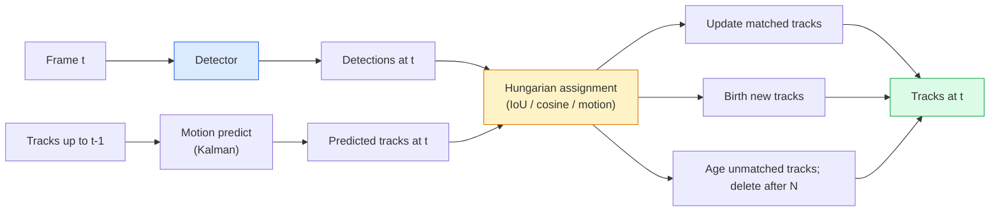

# Multi-Object Tracking & Video Memory

> Tracking là detection cộng với association. Phát hiện mọi khung hình. Khớp các detection của khung hình này với các track của khung hình trước theo ID.

**Type:** Build
**Languages:** Python
**Prerequisites:** Phase 4 Lesson 06 (YOLO Detection), Phase 4 Lesson 08 (Mask R-CNN), Phase 4 Lesson 24 (SAM 3)
**Time:** ~60 minutes

## Learning Objectives

- Phân biệt tracking-by-detection với query-based tracking và liệt kê các họ thuật toán (SORT, DeepSORT, ByteTrack, BoT-SORT, SAM 2 memory tracker, SAM 3.1 Object Multiplex)
- Triển khai IoU + Hungarian assignment từ đầu cho tracking-by-detection cổ điển
- Giải thích memory bank của SAM 2 và lý do tại sao nó xử lý occlusion tốt hơn association dựa trên IoU
- Đọc ba chỉ số tracking (MOTA, IDF1, HOTA) và chọn chỉ số phù hợp cho từng trường hợp sử dụng cụ thể

## The Problem

Một detector cho bạn biết vị trí các đối tượng trong một khung hình đơn lẻ. Một tracker cho bạn biết detection nào trong khung hình `t` là cùng một đối tượng với một detection trong khung hình `t-1`. Nếu không có điều đó, bạn không thể đếm các đối tượng băng qua một vạch kẻ, theo dõi một quả bóng qua vùng bị che khuất (occlusion), hoặc biết "xe số 4 đã ở trong làn đường được 8 giây".

Tracking là yếu tố thiết yếu cho mọi sản phẩm liên quan đến video: phân tích thể thao, giám sát, xe tự lái, phân tích video y tế, giám sát động vật hoang dã, đếm từ ngữ. Các khối xây dựng cốt lõi được chia sẻ: detector theo từng khung hình, mô hình chuyển động (Kalman filter hoặc thứ gì đó phong phú hơn), bước association (thuật toán Hungarian trên IoU / cosine / các đặc trưng đã học), và vòng đời của track (sinh ra, cập nhật, kết thúc).

Năm 2026 mang đến hai mô hình mới: **SAM 2 memory-based tracking** (feature-memory thay vì association dựa trên mô hình chuyển động) và **SAM 3.1 Object Multiplex** (bộ nhớ chia sẻ cho nhiều instance của cùng một khái niệm). Bài học này sẽ đi qua stack cổ điển trước, sau đó là phương pháp dựa trên bộ nhớ.

## The Concept

### Tracking-by-detection



Mọi tracker bạn gặp vào năm 2026 đều là một biến thể của vòng lặp này. Sự khác biệt:

- **SORT** (2016): Kalman filter + IoU Hungarian. Đơn giản, nhanh, không có mô hình ngoại hình (appearance model).
- **DeepSORT** (2017): SORT + một đặc trưng ngoại hình dựa trên CNN cho mỗi track (ReID embedding). Xử lý các trường hợp giao nhau tốt hơn.
- **ByteTrack** (2021): liên kết các detection có độ tin cậy thấp như một giai đoạn thứ hai; không cần đặc trưng ngoại hình nhưng là thuật toán hiệu suất cao nhất trên MOT17.
- **BoT-SORT** (2022): Byte + bù chuyển động camera + ReID.
- **StrongSORT / OC-SORT** — các hậu duệ của ByteTrack với chuyển động và ngoại hình tốt hơn.

### Kalman filter trong một đoạn văn

Một Kalman filter duy trì trạng thái `(x, y, w, h, dx, dy, dw, dh)` cho mỗi track với một ma trận hiệp phương sai (covariance). Tại mỗi khung hình, **dự đoán (predict)** trạng thái bằng mô hình vận tốc không đổi, sau đó **cập nhật (update)** với detection đã khớp. Việc cập nhật tin tưởng vào detection nhiều hơn khi độ không chắc chắn của dự đoán cao. Điều này tạo ra các quỹ đạo mượt mà và khả năng duy trì track qua một khoảng che khuất ngắn (1-5 khung hình).

Mọi tracker cổ điển đều sử dụng Kalman filter trong bước dự đoán chuyển động.

### The Hungarian algorithm

Với ma trận chi phí `M x N` (tracks x detections), tìm phép gán một-một giúp giảm thiểu tổng chi phí. Chi phí thường là `1 - IoU(track_bbox, detection_bbox)` hoặc độ tương đồng cosine âm của các đặc trưng ngoại hình. Thời gian chạy là O((M+N)^3); với M, N lên đến ~1000, nó đủ nhanh trong Python thông qua `scipy.optimize.linear_sum_assignment`.

### Ý tưởng chính của ByteTrack

Các tracker tiêu chuẩn loại bỏ các detection có độ tin cậy thấp (< 0.5). ByteTrack giữ chúng lại làm **ứng viên giai đoạn hai**: sau khi khớp các track với các detection có độ tin cậy cao, các track chưa được khớp sẽ cố gắng khớp với các detection có độ tin cậy thấp bằng ngưỡng IoU lỏng hơn một chút. Phục hồi các trường hợp che khuất ngắn, chuyển đổi ID gần đám đông.

### SAM 2 memory-based tracking

SAM 2 xử lý video bằng cách giữ một **memory bank** các đặc trưng không gian-thời gian cho mỗi instance. Với một prompt (click, box, text) trên một khung hình, nó mã hóa instance đó vào bộ nhớ. Ở các khung hình tiếp theo, bộ nhớ được cross-attended với các đặc trưng của khung hình mới, và bộ giải mã tạo ra một mask cho cùng instance đó trong khung hình mới.

Không Kalman filter, không Hungarian assignment. Association được ẩn trong thao tác memory-attention.

Ưu điểm:
- Mạnh mẽ với các trường hợp che khuất lớn (bộ nhớ mang theo danh tính instance qua nhiều khung hình).
- Open-vocabulary khi kết hợp với các text prompt của SAM 3.
- Hoạt động mà không cần mô hình chuyển động riêng biệt.

Nhược điểm:
- Chậm hơn ByteTrack khi tracking nhiều đối tượng.
- Memory bank tăng lên; giới hạn cửa sổ ngữ cảnh.

### SAM 3.1 Object Multiplex

Các phương pháp tracking SAM 2 / SAM 3 trước đây giữ một memory bank riêng cho mỗi instance. Với 50 đối tượng, cần 50 memory bank. Object Multiplex (tháng 3 năm 2026) gộp chúng thành một bộ nhớ chia sẻ với **per-instance query tokens**. Chi phí mở rộng theo tỷ lệ dưới tuyến tính với số lượng instance.

Multiplex là mặc định mới cho tracking đám đông vào năm 2026: đám đông buổi hòa nhạc, công nhân kho bãi, giao lộ giao thông.

### Ba chỉ số cần biết

- **MOTA (Multi-Object Tracking Accuracy)** — 1 - (FN + FP + ID switches) / GT. Được trọng số theo loại lỗi; một chỉ số duy nhất kết hợp cả lỗi detection và association.
- **IDF1 (ID F1)** — trung bình điều hòa của độ chính xác ID và độ thu hồi ID. Tập trung cụ thể vào việc mỗi ground-truth track giữ ID của nó tốt như thế nào theo thời gian. Tốt hơn MOTA cho các tác vụ nhạy cảm với ID-switch.
- **HOTA (Higher Order Tracking Accuracy)** — phân tách thành độ chính xác detection (DetA) và độ chính xác association (AssA). Tiêu chuẩn cộng đồng từ năm 2020; toàn diện nhất.

Đối với giám sát (ai là ai): IDF1 là chỉ số bạn báo cáo. Đối với phân tích thể thao (đếm đường chuyền): HOTA. Đối với so sánh học thuật chung: HOTA.

```figure
cv3-track-assoc
```

## Build It

### Step 1: IoU-based cost matrix

```python
import numpy as np


def bbox_iou(a, b):
    """
    a, b: (N, 4) arrays of [x1, y1, x2, y2].
    Returns (N_a, N_b) IoU matrix.
    """
    ax1, ay1, ax2, ay2 = a[:, 0], a[:, 1], a[:, 2], a[:, 3]
    bx1, by1, bx2, by2 = b[:, 0], b[:, 1], b[:, 2], b[:, 3]
    inter_x1 = np.maximum(ax1[:, None], bx1[None, :])
    inter_y1 = np.maximum(ay1[:, None], by1[None, :])
    inter_x2 = np.minimum(ax2[:, None], bx2[None, :])
    inter_y2 = np.minimum(ay2[:, None], by2[None, :])
    inter = np.clip(inter_x2 - inter_x1, 0, None) * np.clip(inter_y2 - inter_y1, 0, None)
    area_a = (ax2 - ax1) * (ay2 - ay1)
    area_b = (bx2 - bx1) * (by2 - by1)
    union = area_a[:, None] + area_b[None, :] - inter
    return inter / np.clip(union, 1e-8, None)
```

### Step 2: Minimal SORT-style tracker

Kalman filter vận tốc không đổi cố định được lược bỏ để ngắn gọn — chúng ta sử dụng association IoU đơn giản ở đây; trong thực tế, Kalman predict là thiết yếu. Gói Python `sort` cung cấp phiên bản đầy đủ.

```python
from scipy.optimize import linear_sum_assignment


class Track:
    def __init__(self, tid, bbox, frame):
        self.id = tid
        self.bbox = bbox
        self.last_frame = frame
        self.hits = 1

    def update(self, bbox, frame):
        self.bbox = bbox
        self.last_frame = frame
        self.hits += 1


class SimpleTracker:
    def __init__(self, iou_threshold=0.3, max_age=5):
        self.tracks = []
        self.next_id = 1
        self.iou_threshold = iou_threshold
        self.max_age = max_age

    def step(self, detections, frame):
        if not self.tracks:
            for d in detections:
                self.tracks.append(Track(self.next_id, d, frame))
                self.next_id += 1
            return [(t.id, t.bbox) for t in self.tracks]

        track_boxes = np.array([t.bbox for t in self.tracks])
        det_boxes = np.array(detections) if len(detections) else np.empty((0, 4))

        iou = bbox_iou(track_boxes, det_boxes) if len(det_boxes) else np.zeros((len(track_boxes), 0))
        cost = 1 - iou
        cost[iou < self.iou_threshold] = 1e6

        matched_track = set()
        matched_det = set()
        if cost.size > 0:
            row, col = linear_sum_assignment(cost)
            for r, c in zip(row, col):
                if cost[r, c] < 1.0:
                    self.tracks[r].update(det_boxes[c], frame)
                    matched_track.add(r); matched_det.add(c)

        for i, d in enumerate(det_boxes):
            if i not in matched_det:
                self.tracks.append(Track(self.next_id, d, frame))
                self.next_id += 1

        self.tracks = [t for t in self.tracks if frame - t.last_frame <= self.max_age]
        return [(t.id, t.bbox) for t in self.tracks]
```

60 dòng. Nhận các detection theo khung hình, trả về các track ID theo khung hình. Các hệ thống thực tế sẽ thêm Kalman predict, bước re-match giai đoạn hai của ByteTrack, và các đặc trưng ngoại hình.

### Step 3: Synthetic trajectory test

```python
def synthetic_frames(num_frames=20, num_objects=3, H=240, W=320, seed=0):
    rng = np.random.default_rng(seed)
    starts = rng.uniform(20, 200, size=(num_objects, 2))
    velocities = rng.uniform(-5, 5, size=(num_objects, 2))
    frames = []
    for f in range(num_frames):
        dets = []
        for i in range(num_objects):
            cx, cy = starts[i] + f * velocities[i]
            dets.append([cx - 10, cy - 10, cx + 10, cy + 10])
        frames.append(dets)
    return frames


tracker = SimpleTracker()
for f, dets in enumerate(synthetic_frames()):
    tracks = tracker.step(dets, f)
```

Ba đối tượng di chuyển theo đường thẳng sẽ giữ ID của chúng qua tất cả 20 khung hình.

### Step 4: ID-switch metric

```python
def count_id_switches(tracks_per_frame, gt_per_frame):
    """
    tracks_per_frame:  list of list of (track_id, bbox)
    gt_per_frame:      list of list of (gt_id, bbox)
    Returns number of ID switches.
    """
    prev_assignment = {}
    switches = 0
    for tracks, gts in zip(tracks_per_frame, gt_per_frame):
        if not tracks or not gts:
            continue
        t_boxes = np.array([b for _, b in tracks])
        g_boxes = np.array([b for _, b in gts])
        iou = bbox_iou(g_boxes, t_boxes)
        for g_idx, (gt_id, _) in enumerate(gts):
            j = iou[g_idx].argmax()
            if iou[g_idx, j] > 0.5:
                t_id = tracks[j][0]
                if gt_id in prev_assignment and prev_assignment[gt_id] != t_id:
                    switches += 1
                prev_assignment[gt_id] = t_id
    return switches
```

Đây là một chỉ số đơn giản hóa gần giống IDF1: đếm số lần một đối tượng ground-truth thay đổi track ID dự đoán được gán cho nó. Các công cụ MOTA / IDF1 / HOTA thực tế nằm trong `py-motmetrics` và `TrackEval`.

## Use It

Các tracker sản xuất vào năm 2026:

- `ultralytics` — tích hợp sẵn YOLOv8 + ByteTrack / BoT-SORT. `results = model.track(source, tracker="bytetrack.yaml")`. Mặc định.
- `supervision` (Roboflow) — các wrapper ByteTrack cộng với các tiện ích chú thích.
- SAM 2 / SAM 3.1 — tracking dựa trên bộ nhớ thông qua `processor.track()`.
- Custom stack: detector (YOLOv8 / RT-DETR) + `sort-tracker` / `OC-SORT` / `StrongSORT`.

Lựa chọn:

- Người đi bộ / xe hơi / hộp ở tốc độ 30+ fps: **ByteTrack với ultralytics**.
- Nhiều instance của một lớp trong đám đông: **SAM 3.1 Object Multiplex**.
- Che khuất nặng với ngoại hình có thể nhận dạng: **DeepSORT / StrongSORT** (đặc trưng ReID).
- Thể thao / tương tác phức tạp: **BoT-SORT** hoặc các tracker đã học (MOTRv3).

## Ship It

Bài học này tạo ra:

- `outputs/prompt-tracker-picker.md` — chọn SORT / ByteTrack / BoT-SORT / SAM 2 / SAM 3.1 dựa trên loại cảnh, kiểu che khuất và ngân sách độ trễ.
- `outputs/skill-mot-evaluator.md` — viết một bộ đánh giá hoàn chỉnh cho MOTA / IDF1 / HOTA so với các ground-truth track.

## Exercises

1. **(Dễ)** Chạy synthetic tracker ở trên với 3, 10 và 30 đối tượng. Báo cáo số lượng ID-switch trong mỗi trường hợp. Xác định nơi mà association chỉ dựa trên IoU đơn giản bắt đầu thất bại.
2. **(Trung bình)** Thêm bước Kalman predict vận tốc không đổi trước khi association. Chứng minh rằng các trường hợp che khuất ngắn (2-3 khung hình) không còn gây ra ID-switch.
3. **(Khó)** Tích hợp tracker dựa trên bộ nhớ của SAM 2 (thông qua `transformers`) như một backend tracker thay thế. Chạy cả SimpleTracker và SAM 2 trên một clip đám đông 30 giây và so sánh số lượng ID-switch, gắn nhãn thủ công ID ground-truth cho 5 người nổi bật.

## Key Terms

| Thuật ngữ | Cách gọi thông thường | Ý nghĩa thực tế |
|------|----------------|----------------------|
| Tracking-by-detection | "Phát hiện rồi liên kết" | Detector theo khung hình + Hungarian assignment trên IoU / ngoại hình |
| Kalman filter | "Dự đoán chuyển động" | Động lực học tuyến tính + hiệp phương sai cho dự đoán track mượt mà và xử lý che khuất |
| Hungarian algorithm | "Phép gán tối ưu" | Giải quyết bài toán khớp lưỡng phân chi phí tối thiểu; `scipy.optimize.linear_sum_assignment` |
| ByteTrack | "Lượt thứ hai độ tin cậy thấp" | Khớp lại các track chưa được khớp với các detection độ tin cậy thấp để phục hồi che khuất ngắn |
| DeepSORT | "SORT + ngoại hình" | Thêm đặc trưng ReID để khớp giữa các khung hình; tốt hơn cho việc bảo toàn ID |
| Memory bank | "Thủ thuật SAM 2" | Đặc trưng không gian-thời gian cho mỗi instance được lưu trữ qua các khung hình; cross-attention thay thế association tường minh |
| Object Multiplex | "Bộ nhớ chia sẻ SAM 3.1" | Bộ nhớ chia sẻ duy nhất với các query cho mỗi instance để tracking nhiều đối tượng nhanh chóng |
| HOTA | "Chỉ số tracking hiện đại" | Phân tách thành độ chính xác detection và association; tiêu chuẩn cộng đồng |

## Further Reading

- [SORT (Bewley et al., 2016)](https://arxiv.org/abs/1602.00763) — bài báo tracking-by-detection tối giản
- [DeepSORT (Wojke et al., 2017)](https://arxiv.org/abs/1703.07402) — thêm đặc trưng ngoại hình
- [ByteTrack (Zhang et al., 2022)](https://arxiv.org/abs/2110.06864) — lượt thứ hai độ tin cậy thấp
- [BoT-SORT (Aharon et al., 2022)](https://arxiv.org/abs/2206.14651) — bù chuyển động camera
- [HOTA (Luiten et al., 2020)](https://arxiv.org/abs/2009.07736) — chỉ số tracking phân tách
- [SAM 2 video segmentation (Meta, 2024)](https://ai.meta.com/sam2/) — tracker dựa trên bộ nhớ
- [SAM 3.1 Object Multiplex (Meta, March 2026)](https://ai.meta.com/blog/segment-anything-model-3/)