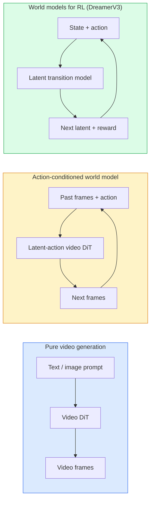

# World Models & Video Diffusion

> Một mô hình video dự đoán những giây tiếp theo của một cảnh quay chính là một trình mô phỏng thế giới (world simulator). Nếu kết hợp dự đoán đó với các hành động, bạn sẽ có một game engine đã được học.

**Type:** Learn + Build
**Languages:** Python
**Prerequisites:** Phase 4 Lesson 10 (Diffusion), Phase 4 Lesson 12 (Video Understanding), Phase 4 Lesson 23 (DiT + Rectified Flow)
**Time:** ~75 phút

## Mục tiêu học tập

- Giải thích sự khác biệt giữa mô hình tạo video thuần túy (Sora 2) và mô hình thế giới có điều kiện hành động (Genie 3, DreamerV3).
- Mô tả một video DiT: các patch không-thời gian (spatio-temporal patches), mã hóa vị trí 3D, cơ chế attention kết hợp trên các token (T, H, W).
- Truy vết cách một world model tích hợp vào robotics: VLM lập kế hoạch → mô hình video mô phỏng → inverse dynamics phát lệnh hành động.
- Lựa chọn giữa Sora 2, Genie 3, Runway GWM-1 Worlds, Wan-Video và HunyuanVideo cho một trường hợp sử dụng cụ thể (video sáng tạo, mô phỏng tương tác, tổng hợp dữ liệu lái xe tự động).

## Vấn đề

Việc tạo video và mô hình hóa thế giới đã hội tụ vào năm 2026. Một mô hình có thể tạo ra một phút video mạch lạc, theo một nghĩa nào đó, đã học được cách thế giới vận hành: sự tồn tại của vật thể (object permanence), trọng lực, tính nhân quả, phong cách. Nếu bạn điều kiện hóa dự đoán đó dựa trên các hành động (đi sang trái, mở cửa), mô hình video sẽ trở thành một trình mô phỏng có thể học được, thay thế cho game engine, trình mô phỏng lái xe hoặc môi trường robotics.

Các yếu tố đặt cược rất cụ thể. Genie 3 tạo ra các môi trường có thể chơi được từ một hình ảnh duy nhất. Runway GWM-1 Worlds tổng hợp các cảnh quay vô tận có thể khám phá. Sora 2 tạo ra các video dài một phút với âm thanh đồng bộ và vật lý được mô hình hóa. NVIDIA Cosmos-Drive, Wayve Gaia-2 và Tesla DrivingWorld tạo ra video lái xe thực tế cho dữ liệu huấn luyện xe tự hành. Mô hình thế giới đang âm thầm chiếm lĩnh lĩnh vực sim-to-real cho robotics.

Bài học này là bài học "bức tranh toàn cảnh" cho Phase 4. Nó kết nối việc tạo hình ảnh, hiểu video và suy luận tác nhân (agentic reasoning) thành mô hình kiến trúc mà nghiên cứu chủ đạo đang hướng tới.

## Khái niệm

### Ba nhóm mô hình hóa thế giới



- **Sora 2** là mô hình tạo video thuần túy dựa trên prompt. Không có giao diện hành động. Bạn không thể "điều khiển" nó giữa chừng khi đang chạy.
- **Genie 3**, **GWM-1 Worlds**, **Mirage / Magica** là các world model có điều kiện hành động. Suy luận các hành động tiềm ẩn (latent actions) từ video quan sát được, sau đó điều kiện hóa các dự đoán khung hình tương lai dựa trên các hành động đó. Có tính tương tác — bạn nhấn phím hoặc di chuyển camera và cảnh quay sẽ phản hồi.
- **DreamerV3** và nhóm world model RL cổ điển dự đoán trong không gian tiềm ẩn (latent space) với điều kiện hành động rõ ràng, được huấn luyện trên tín hiệu phần thưởng (reward signal). Ít tập trung vào hình ảnh; hữu ích hơn cho RL hiệu quả về mẫu (sample-efficient RL).

### Kiến trúc Video DiT

```
Video latent:          (C, T, H, W)
Patchify (spatial):    grid of P_h x P_w patches per frame
Patchify (temporal):   group P_t frames into a temporal patch
Resulting tokens:      (T / P_t) * (H / P_h) * (W / P_w) tokens
```

Mã hóa vị trí là 3D: một embedding xoay (rotary) hoặc embedding đã học cho mỗi tọa độ (t, h, w). Attention có thể là:

- **Full joint** — tất cả các token đều chú ý đến tất cả các token khác. Độ phức tạp O(N^2) với N token. Quá tốn kém cho các video dài.
- **Divided** — luân phiên giữa temporal attention (cùng vị trí không gian, qua thời gian: `(H*W) * T^2`) và spatial attention (cùng thời điểm, qua không gian: `T * (H*W)^2`). Được sử dụng bởi TimeSformer và hầu hết các video DiT.
- **Window** — các cửa sổ cục bộ trong (t, h, w). Được sử dụng bởi Video Swin.

Mọi mô hình diffusion video năm 2026 đều sử dụng một trong ba mô hình này cộng với AdaLN conditioning (Bài 23) và rectified flow.

### Điều kiện hóa dựa trên hành động: mô hình hành động tiềm ẩn

Genie học một **latent action** cho mỗi khung hình bằng cách dự đoán phân biệt hành động giữa một cặp khung hình liên tiếp. Bộ giải mã (decoder) của mô hình sau đó điều kiện hóa dựa trên latent action đã suy luận — không phải dựa trên các phím bàn phím rõ ràng. Tại thời điểm suy luận (inference), người dùng có thể chỉ định một latent action (hoặc lấy mẫu từ một prior mới) và mô hình sẽ tạo ra khung hình tiếp theo nhất quán với hành động đó.

Sora bỏ qua hoàn toàn giao diện hành động. Bộ giải mã của nó dự đoán các token không-thời gian tiếp theo từ các token không-thời gian trong quá khứ. Prompt điều kiện hóa điểm bắt đầu; không có gì điều khiển nó giữa quá trình tạo.

### Tính hợp lý về vật lý

Phiên bản Sora 2 năm 2026 quảng cáo rõ ràng về **tính hợp lý về vật lý (physical plausibility)**: trọng lượng, sự cân bằng, sự tồn tại của vật thể, nguyên nhân và kết quả. Được đo lường bởi đội ngũ thông qua các điểm số hợp lý do con người đánh giá; mô hình cải thiện rõ rệt về các vật thể bị rơi, nhân vật va chạm và các lỗi cố ý (như nhảy hụt) so với Sora 1.

Tính hợp lý vẫn là chế độ lỗi phổ biến nhất. Các video năm 2024-2025 về người ăn mì spaghetti hoặc uống nước từ ly cho thấy mô hình thiếu khả năng biểu diễn vật thể bền vững. Các mô hình năm 2026 (Sora 2, Runway Gen-5, HunyuanVideo) giảm thiểu nhưng không loại bỏ hoàn toàn các lỗi này.

### World model cho lái xe tự động

Các world model lái xe tạo ra các cảnh đường phố thực tế dựa trên quỹ đạo, hộp bao (bounding boxes) hoặc bản đồ điều hướng. Ứng dụng:

- **Cosmos-Drive-Dreams** (NVIDIA) — tạo ra hàng phút video lái xe cho huấn luyện RL.
- **Gaia-2** (Wayve) — tổng hợp cảnh quay dựa trên quỹ đạo để đánh giá chính sách.
- **DrivingWorld** (Tesla) — mô phỏng các điều kiện thời tiết, thời gian trong ngày, tình trạng giao thông khác nhau.
- **Vista** (ByteDance) — tổng hợp cảnh lái xe phản ứng.

Chúng thay thế việc thu thập dữ liệu thực tế đắt đỏ cho các trường hợp hiếm gặp (corner cases) — người đi bộ băng qua đường vào ban đêm, ngã tư đóng băng, các loại phương tiện lạ — những trường hợp mà nếu không có mô hình này sẽ đòi hỏi hàng triệu dặm lái xe.

### Robotics stack: VLM + mô hình video + inverse dynamics

Vòng lặp robotics ba thành phần đang nổi lên:

1. **VLM** phân tích mục tiêu ("nhặt cái cốc màu đỏ"), lập kế hoạch chuỗi hành động cấp cao.
2. **Mô hình tạo video** mô phỏng việc thực hiện từng hành động sẽ trông như thế nào — dự đoán các quan sát trước N khung hình.
3. **Mô hình inverse dynamics** trích xuất các lệnh điều khiển động cơ cụ thể sẽ tạo ra các quan sát đó.

Điều này thay thế việc định hình phần thưởng (reward shaping) và RL tốn nhiều mẫu. World model thực hiện việc tưởng tượng; inverse dynamics đóng vòng lặp điều khiển. Genie Envisioner là một ví dụ; nhiều nhóm nghiên cứu đang hội tụ về cấu trúc này.

### Đánh giá

- **Chất lượng hình ảnh** — FVD (Fréchet Video Distance), nghiên cứu người dùng.
- **Sự căn chỉnh với prompt** — CLIPScore trên mỗi khung hình, đánh giá kiểu VQA.
- **Tính hợp lý về vật lý** — đánh giá thủ công trên bộ benchmark (benchmark nội bộ của Sora 2, VBench).
- **Khả năng kiểm soát** (cho các world model tương tác) — tính nhất quán giữa hành động → quan sát; bạn có thể quay lại trạng thái trước đó không?

### Bối cảnh mô hình năm 2026

| Mô hình | Sử dụng | Tham số | Đầu ra | Giấy phép |
|-------|-----|------------|--------|---------|
| Sora 2 | text-to-video, audio | — | 1-phút 1080p + audio | Chỉ API |
| Runway Gen-5 | text/image-to-video | — | clip 10s | API |
| Runway GWM-1 Worlds | thế giới tương tác | — | rollout 3D vô tận | API |
| Genie 3 | thế giới tương tác từ ảnh | 11B+ | khung hình có thể chơi | bản xem trước nghiên cứu |
| Wan-Video 2.1 | open text-to-video | 14B | clip chất lượng cao | phi thương mại |
| HunyuanVideo | open text-to-video | 13B | clip 10s | cho phép |
| Cosmos / Cosmos-Drive | mô phỏng lái xe tự động | 7-14B | cảnh lái xe | NVIDIA open |
| Magica / Mirage 2 | AI-native game engine | — | thế giới có thể sửa đổi | sản phẩm |

```figure
v4-world-rollout
```

## Xây dựng

### Bước 1: 3D patchify cho video

```python
import torch
import torch.nn as nn


class VideoPatch3D(nn.Module):
    def __init__(self, in_channels=4, dim=64, patch_t=2, patch_h=2, patch_w=2):
        super().__init__()
        self.proj = nn.Conv3d(
            in_channels, dim,
            kernel_size=(patch_t, patch_h, patch_w),
            stride=(patch_t, patch_h, patch_w),
        )
        self.patch_t = patch_t
        self.patch_h = patch_h
        self.patch_w = patch_w

    def forward(self, x):
        # x: (N, C, T, H, W)
        x = self.proj(x)
        n, c, t, h, w = x.shape
        tokens = x.reshape(n, c, t * h * w).transpose(1, 2)
        return tokens, (t, h, w)
```

Một phép tích chập 3D với stride bằng kernel đóng vai trò là bộ patchifier không-thời gian. Lưới `(T, H, W) -> (T/2, H/2, W/2)` các token.

### Bước 2: Mã hóa vị trí xoay 3D

Rotary Position Embeddings (RoPE) được áp dụng riêng biệt dọc theo các trục `t`, `h`, `w`:

```python
def rope_3d(tokens, t_dim, h_dim, w_dim, grid):
    """
    tokens: (N, T*H*W, D)
    grid: (T, H, W) sizes
    t_dim + h_dim + w_dim == D
    """
    T, H, W = grid
    n, seq, d = tokens.shape
    if t_dim + h_dim + w_dim != d:
        raise ValueError(f"t_dim+h_dim+w_dim ({t_dim}+{h_dim}+{w_dim}) must equal D={d}")
    assert seq == T * H * W
    t_idx = torch.arange(T, device=tokens.device).repeat_interleave(H * W)
    h_idx = torch.arange(H, device=tokens.device).repeat_interleave(W).repeat(T)
    w_idx = torch.arange(W, device=tokens.device).repeat(T * H)
    # Simplified: just scale channels by frequencies. Real RoPE rotates pairs.
    freqs_t = torch.exp(-torch.log(torch.tensor(10000.0)) * torch.arange(t_dim // 2, device=tokens.device) / (t_dim // 2))
    freqs_h = torch.exp(-torch.log(torch.tensor(10000.0)) * torch.arange(h_dim // 2, device=tokens.device) / (h_dim // 2))
    freqs_w = torch.exp(-torch.log(torch.tensor(10000.0)) * torch.arange(w_dim // 2, device=tokens.device) / (w_dim // 2))
    emb_t = torch.cat([torch.sin(t_idx[:, None] * freqs_t), torch.cos(t_idx[:, None] * freqs_t)], dim=-1)
    emb_h = torch.cat([torch.sin(h_idx[:, None] * freqs_h), torch.cos(h_idx[:, None] * freqs_h)], dim=-1)
    emb_w = torch.cat([torch.sin(w_idx[:, None] * freqs_w), torch.cos(w_idx[:, None] * freqs_w)], dim=-1)
    return tokens + torch.cat([emb_t, emb_h, emb_w], dim=-1)
```

Dạng cộng đơn giản hóa. RoPE thực tế xoay các kênh theo cặp ở các tần số; thông tin vị trí là như nhau.

### Bước 3: Khối divided attention

```python
class DividedAttentionBlock(nn.Module):
    def __init__(self, dim=64, heads=2):
        super().__init__()
        self.time_attn = nn.MultiheadAttention(dim, heads, batch_first=True)
        self.space_attn = nn.MultiheadAttention(dim, heads, batch_first=True)
        self.ln1 = nn.LayerNorm(dim)
        self.ln2 = nn.LayerNorm(dim)
        self.ln3 = nn.LayerNorm(dim)
        self.mlp = nn.Sequential(nn.Linear(dim, 4 * dim), nn.GELU(), nn.Linear(4 * dim, dim))

    def forward(self, x, grid):
        T, H, W = grid
        n, seq, d = x.shape
        # time attention: same (h, w), across t
        xt = x.view(n, T, H * W, d).permute(0, 2, 1, 3).reshape(n * H * W, T, d)
        a, _ = self.time_attn(self.ln1(xt), self.ln1(xt), self.ln1(xt), need_weights=False)
        xt = (xt + a).reshape(n, H * W, T, d).permute(0, 2, 1, 3).reshape(n, seq, d)
        # space attention: same t, across (h, w)
        xs = xt.view(n, T, H * W, d).reshape(n * T, H * W, d)
        a, _ = self.space_attn(self.ln2(xs), self.ln2(xs), self.ln2(xs), need_weights=False)
        xs = (xs + a).reshape(n, T, H * W, d).reshape(n, seq, d)
        xs = xs + self.mlp(self.ln3(xs))
        return xs
```

Time attention chú ý trong mỗi vị trí không gian qua thời gian; space attention chú ý trong mỗi khung hình qua các vị trí. Hai phép toán O(T^2 + (HW)^2) thay vì một phép toán O((THW)^2). Đây là cốt lõi của TimeSformer và mọi video DiT hiện đại.

### Bước 4: Soạn một video DiT nhỏ

```python
class TinyVideoDiT(nn.Module):
    def __init__(self, in_channels=4, dim=64, depth=2, heads=2):
        super().__init__()
        self.patch = VideoPatch3D(in_channels=in_channels, dim=dim, patch_t=2, patch_h=2, patch_w=2)
        self.blocks = nn.ModuleList([DividedAttentionBlock(dim, heads) for _ in range(depth)])
        self.out = nn.Linear(dim, in_channels * 2 * 2 * 2)

    def forward(self, x):
        tokens, grid = self.patch(x)
        for blk in self.blocks:
            tokens = blk(tokens, grid)
        return self.out(tokens), grid
```

Không phải là một trình tạo video hoàn chỉnh; một bản demo cấu trúc để đảm bảo mọi mảnh ghép đều khớp đúng.

### Bước 5: Kiểm tra hình dạng (shapes)

```python
vid = torch.randn(1, 4, 8, 16, 16)  # (N, C, T, H, W)
model = TinyVideoDiT()
out, grid = model(vid)
print(f"input  {tuple(vid.shape)}")
print(f"tokens grid {grid}")
print(f"output {tuple(out.shape)}")
```

Mong đợi `grid = (4, 8, 8)` và `out = (1, 256, 32)` sau khi patching; phần đầu (head) sau đó chiếu ra các patch không-thời gian cho mỗi token, sẵn sàng để un-patchify trở lại thành video.

## Sử dụng

Các mô hình truy cập sản xuất năm 2026:

- **Sora 2 API** (OpenAI) — text-to-video, âm thanh đồng bộ. Giá cao cấp.
- **Runway Gen-5 / GWM-1** (Runway) — image-to-video, thế giới tương tác.
- **Wan-Video 2.1 / HunyuanVideo** — mã nguồn mở tự lưu trữ.
- **Cosmos / Cosmos-Drive** (NVIDIA) — mô phỏng lái xe trọng số mở.
- **Genie 3** — bản xem trước nghiên cứu, yêu cầu quyền truy cập.

Để xây dựng bản demo world-model tương tác: bắt đầu với Wan-Video để lấy chất lượng, thêm bộ điều hợp latent-action để tạo tính tương tác. Để mô phỏng lái xe tự động: Cosmos-Drive là tài liệu tham khảo mở năm 2026.

Đối với robotics, stack thực tế:

1. Mục tiêu ngôn ngữ -> VLM (Qwen3-VL) -> kế hoạch cấp cao.
2. Kế hoạch -> mô hình video latent-action -> rollout tưởng tượng.
3. Rollout -> mô hình inverse dynamics -> hành động cấp thấp.
4. Hành động được thực hiện -> quan sát được phản hồi lại bước 1.

## Triển khai

Bài học này tạo ra:

- `outputs/prompt-video-model-picker.md` — lựa chọn giữa Sora 2 / Runway / Wan / HunyuanVideo / Cosmos dựa trên tác vụ, giấy phép và độ trễ.
- `outputs/skill-physical-plausibility-checks.md` — một kỹ năng xác định các kiểm tra tự động (sự tồn tại của vật thể, trọng lực, tính liên tục) để chạy trên bất kỳ video nào được tạo trước khi xuất bản.

## Bài tập

1. **(Dễ)** Tính số lượng token cho một video 360p dài 5 giây với patch-t=2, patch-h=8, patch-w=8. Suy luận về bộ nhớ cho attention ở kích thước này.
2. **(Trung bình)** Thay thế khối divided attention ở trên bằng khối full joint attention và đo lường hình dạng cũng như số lượng tham số. Giải thích tại sao divided attention là cần thiết cho các mô hình video thực tế.
3. **(Khó)** Xây dựng một mô hình video latent-action tối giản: lấy tập dữ liệu các bộ ba (frame_t, action_t, frame_{t+1}) (bất kỳ game 2D đơn giản nào), huấn luyện một video DiT nhỏ có điều kiện dựa trên các embedding hành động, và chứng minh rằng các hành động khác nhau tạo ra các khung hình tiếp theo khác nhau.

## Thuật ngữ chính

| Thuật ngữ | Mọi người nói | Ý nghĩa thực tế |
|------|----------------|----------------------|
| World model | "Trình mô phỏng đã học" | Mô hình dự đoán các quan sát tương lai dựa trên trạng thái và hành động |
| Video DiT | "Transformer không-thời gian" | Diffusion transformer với 3D patchification và divided attention |
| Latent action | "Điều khiển suy luận" | Hành động rời rạc hoặc liên tục được suy luận từ các cặp khung hình; dùng để điều kiện hóa việc tạo khung hình tiếp theo |
| Divided attention | "Thời gian rồi đến không gian" | Hai phép toán attention mỗi khối — qua thời gian rồi qua không gian — để giữ O(N^2) ở mức quản lý được |
| Object permanence | "Vật thể tồn tại bền vững" | Thuộc tính cảnh quay mà các mô hình video phải học; chế độ lỗi kinh điển trên thực phẩm, đồ thủy tinh |
| FVD | "Fréchet Video Distance" | Tương đương với FID cho video; thước đo chất lượng hình ảnh chính |
| Inverse dynamics model | "Quan sát thành hành động" | Cho (trạng thái, trạng thái tiếp theo), xuất ra hành động kết nối chúng; đóng vòng lặp robotics |
| Cosmos-Drive | "Mô phỏng lái xe NVIDIA" | World model lái xe tự động trọng số mở cho RL và đánh giá |

## Đọc thêm

- [Sora technical report (OpenAI)](https://openai.com/index/video-generation-models-as-world-simulators/)
- [Genie: Generative Interactive Environments (Bruce et al., 2024)](https://arxiv.org/abs/2402.15391) — latent action world models
- [TimeSformer (Bertasius et al., 2021)](https://arxiv.org/abs/2102.05095) — divided attention for video transformers
- [DreamerV3 (Hafner et al., 2023)](https://arxiv.org/abs/2301.04104) — world models for RL
- [Cosmos-Drive-Dreams (NVIDIA, 2025)](https://research.nvidia.com/labs/toronto-ai/cosmos-drive-dreams/) — driving world model
- [Top 10 Video Generation Models 2026 (DataCamp)](https://www.datacamp.com/blog/top-video-generation-models)
- [From Video Generation to World Model — survey repo](https://github.com/ziqihuangg/Awesome-From-Video-Generation-to-World-Model/)