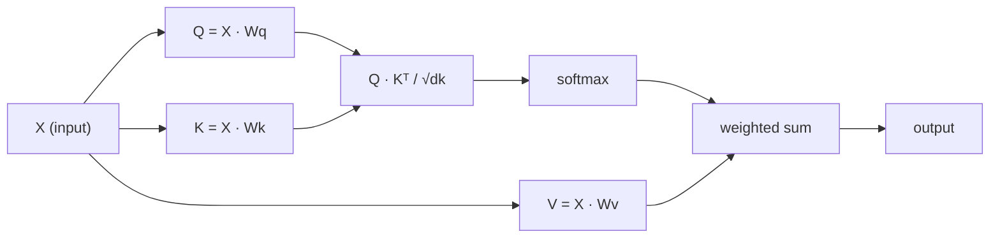

# Self-Attention từ đầu

> Attention là một bảng tra cứu, nơi mỗi từ tự hỏi "ai quan trọng với mình?" - và học cách trả lời câu hỏi đó.

**Type:** Build
**Languages:** Python
**Prerequisites:** Phase 3 (Deep Learning Core), Phase 5 Lesson 10 (Sequence-to-Sequence)
**Time:** ~90 phút

## Mục tiêu học tập

- Triển khai scaled dot-product self-attention từ đầu chỉ sử dụng NumPy, bao gồm các phép chiếu query/key/value và tổng có trọng số softmax
- Xây dựng một lớp multi-head attention có khả năng chia các head, tính toán attention song song và nối kết quả lại với nhau
- Truy vết cách ma trận attention nắm bắt các mối quan hệ giữa các token và giải thích tại sao việc chia cho sqrt(d_k) lại ngăn chặn hiện tượng bão hòa softmax
- Áp dụng causal masking để chuyển đổi attention hai chiều thành attention tự hồi quy (kiểu decoder)

## Vấn đề

RNN xử lý các chuỗi theo từng token một. Đến khi bạn xử lý đến token thứ 50, thông tin từ token thứ 1 đã phải đi qua 50 bước nén. Các phụ thuộc tầm xa bị nghiền nát thành một trạng thái ẩn có kích thước cố định - một nút thắt cổ chai mà không cơ chế LSTM gating nào giải quyết triệt để được.

Bài báo về attention của Bahdanau năm 2014 đã chỉ ra cách khắc phục: cho phép decoder nhìn lại mọi vị trí của encoder và quyết định vị trí nào quan trọng cho bước hiện tại. Tuy nhiên, nó vẫn bị gắn chặt vào một RNN. Bài báo "Attention Is All You Need" năm 2017 đã đặt ra một câu hỏi sắc bén hơn: điều gì sẽ xảy ra nếu attention là cơ chế *duy nhất*? Không đệ quy. Không tích chập. Chỉ có attention.

Self-attention cho phép mọi vị trí trong một chuỗi chú ý đến mọi vị trí khác trong một bước song song duy nhất. Đó là điều làm cho các transformer trở nên nhanh, có khả năng mở rộng và chiếm ưu thế.

## Khái niệm

### Phép ẩn dụ về tra cứu cơ sở dữ liệu

Hãy coi attention như một phép tra cứu cơ sở dữ liệu mềm:

```
Traditional database:
  Query: "capital of France"  -->  exact match  -->  "Paris"

Attention:
  Query: "capital of France"  -->  similarity to ALL keys  -->  weighted blend of ALL values
```

Mỗi token tạo ra ba vector:
- **Query (Q)**: "Tôi đang tìm kiếm điều gì?"
- **Key (K)**: "Tôi chứa đựng điều gì?"
- **Value (V)**: "Tôi cung cấp thông tin gì nếu được chọn?"

Tích vô hướng giữa một query và tất cả các key tạo ra các điểm số attention. Điểm số cao nghĩa là "key này khớp với query của tôi". Những điểm số đó sẽ làm trọng số cho các value. Đầu ra là tổng có trọng số của các value.

### Tính toán Q, K, V

Mỗi embedding của token được chiếu qua ba ma trận trọng số đã học:

```
Input embeddings (sequence of n tokens, each d-dimensional):

  X = [x1, x2, x3, ..., xn]       shape: (n, d)

Three weight matrices:

  Wq  shape: (d, dk)
  Wk  shape: (d, dk)
  Wv  shape: (d, dv)

Projections:

  Q = X @ Wq    shape: (n, dk)      each token's query
  K = X @ Wk    shape: (n, dk)      each token's key
  V = X @ Wv    shape: (n, dv)      each token's value
```

Trực quan hóa cho một token:

```
             Wq
  x_i ------[*]------> q_i    "What am I looking for?"
       |
       |     Wk
       +----[*]------> k_i    "What do I contain?"
       |
       |     Wv
       +----[*]------> v_i    "What do I offer?"
```

### Ma trận Attention

Khi bạn đã có Q, K, V cho tất cả các token, các điểm số attention tạo thành một ma trận:

```
Scores = Q @ K^T    shape: (n, n)

              k1    k2    k3    k4    k5
        +-----+-----+-----+-----+-----+
   q1   | 2.1 | 0.3 | 0.1 | 0.8 | 0.2 |   <- how much q1 attends to each key
        +-----+-----+-----+-----+-----+
   q2   | 0.4 | 1.9 | 0.7 | 0.1 | 0.3 |
        +-----+-----+-----+-----+-----+
   q3   | 0.2 | 0.6 | 2.3 | 0.5 | 0.1 |
        +-----+-----+-----+-----+-----+
   q4   | 0.9 | 0.1 | 0.4 | 1.7 | 0.6 |
        +-----+-----+-----+-----+-----+
   q5   | 0.1 | 0.3 | 0.2 | 0.5 | 2.0 |
        +-----+-----+-----+-----+-----+

Each row: one token's attention over the entire sequence
```

Hãy quan sát từng query quét qua các key: mỗi hàng chấm điểm mọi token, softmax biến các điểm số thành trọng số, và vector ngữ cảnh là sự pha trộn có trọng số của các value.

```figure
attention-matrix
```

### Tại sao cần Scale?

Các tích vô hướng tăng dần theo số chiều dk. Nếu dk = 64, các tích vô hướng có thể nằm trong phạm vi hàng chục, đẩy softmax vào các vùng mà gradient bị triệt tiêu. Cách khắc phục: chia cho sqrt(dk).

```
Scaled scores = (Q @ K^T) / sqrt(dk)
```

Điều này giữ cho các giá trị nằm trong phạm vi mà softmax tạo ra các gradient hữu ích.

### Softmax biến điểm số thành trọng số

Softmax chuyển đổi các logit thô thành một phân phối xác suất trên mỗi hàng:

```
Raw scores for q1:   [2.1, 0.3, 0.1, 0.8, 0.2]
                            |
                         softmax
                            |
Attention weights:   [0.52, 0.09, 0.07, 0.14, 0.08]   (sums to ~1.0)
```

Bây giờ mỗi token có một tập hợp các trọng số cho biết mức độ chú ý đến mọi token khác.

### Tổng có trọng số của các Value

Đầu ra cuối cùng cho mỗi token là tổng có trọng số của tất cả các vector value:

```
output_i = sum( attention_weight[i][j] * v_j  for all j )

For token 1:
  output_1 = 0.52 * v1 + 0.09 * v2 + 0.07 * v3 + 0.14 * v4 + 0.08 * v5
```

### Quy trình đầy đủ



Công thức trong một dòng:

```
Attention(Q, K, V) = softmax( Q @ K^T / sqrt(dk) ) @ V
```

```figure
softmax-attention-scaling
```

## Xây dựng

### Bước 1: Softmax từ đầu

Softmax chuyển đổi các logit thô thành xác suất. Trừ đi giá trị lớn nhất để đảm bảo tính ổn định số học.

```python
import numpy as np

def softmax(x):
    shifted = x - np.max(x, axis=-1, keepdims=True)
    exp_x = np.exp(shifted)
    return exp_x / np.sum(exp_x, axis=-1, keepdims=True)

logits = np.array([2.0, 1.0, 0.1])
print(f"logits:  {logits}")
print(f"softmax: {softmax(logits)}")
print(f"sum:     {softmax(logits).sum():.4f}")
```

### Bước 2: Scaled dot-product attention

Hàm cốt lõi. Nhận vào các ma trận Q, K, V và trả về đầu ra attention cùng với ma trận trọng số.

```python
def scaled_dot_product_attention(Q, K, V):
    dk = Q.shape[-1]
    scores = Q @ K.T / np.sqrt(dk)
    weights = softmax(scores)
    output = weights @ V
    return output, weights
```

### Bước 3: Lớp self-attention với các phép chiếu đã học

Một module self-attention hoàn chỉnh với các ma trận trọng số Wq, Wk, Wv được khởi tạo với kỹ thuật scaling kiểu Xavier.

```python
class SelfAttention:
    def __init__(self, d_model, dk, dv, seed=42):
        rng = np.random.default_rng(seed)
        scale = np.sqrt(2.0 / (d_model + dk))
        self.Wq = rng.normal(0, scale, (d_model, dk))
        self.Wk = rng.normal(0, scale, (d_model, dk))
        scale_v = np.sqrt(2.0 / (d_model + dv))
        self.Wv = rng.normal(0, scale_v, (d_model, dv))
        self.dk = dk

    def forward(self, X):
        Q = X @ self.Wq
        K = X @ self.Wk
        V = X @ self.Wv
        output, weights = scaled_dot_product_attention(Q, K, V)
        return output, weights
```

### Bước 4: Chạy thử trên một câu

Tạo các embedding giả cho một câu và quan sát các trọng số attention.

```python
sentence = ["The", "cat", "sat", "on", "the", "mat"]
n_tokens = len(sentence)
d_model = 8
dk = 4
dv = 4

rng = np.random.default_rng(42)
X = rng.normal(0, 1, (n_tokens, d_model))

attn = SelfAttention(d_model, dk, dv, seed=42)
output, weights = attn.forward(X)

print("Attention weights (each row: where that token looks):\n")
print(f"{'':>6}", end="")
for token in sentence:
    print(f"{token:>6}", end="")
print()

for i, token in enumerate(sentence):
    print(f"{token:>6}", end="")
    for j in range(n_tokens):
        w = weights[i][j]
        print(f"{w:6.3f}", end="")
    print()
```

### Bước 5: Trực quan hóa attention với bản đồ nhiệt ASCII

Ánh xạ các trọng số attention vào các ký tự để có cái nhìn trực quan nhanh chóng.

```python
def ascii_heatmap(weights, tokens, chars=" ░▒▓█"):
    n = len(tokens)
    print(f"\n{'':>6}", end="")
    for t in tokens:
        print(f"{t:>6}", end="")
    print()

    for i in range(n):
        print(f"{tokens[i]:>6}", end="")
        for j in range(n):
            level = int(weights[i][j] * (len(chars) - 1) / weights.max())
            level = min(level, len(chars) - 1)
            print(f"{'  ' + chars[level] + '   '}", end="")
        print()

ascii_heatmap(weights, sentence)
```

## Sử dụng

Lớp `nn.MultiheadAttention` của PyTorch thực hiện chính xác những gì chúng ta đã xây dựng, cộng thêm việc chia multi-head và phép chiếu đầu ra:

```python
import torch
import torch.nn as nn

d_model = 8
n_heads = 2
seq_len = 6

mha = nn.MultiheadAttention(embed_dim=d_model, num_heads=n_heads, batch_first=True)

X_torch = torch.randn(1, seq_len, d_model)

output, attn_weights = mha(X_torch, X_torch, X_torch)

print(f"Input shape:            {X_torch.shape}")
print(f"Output shape:           {output.shape}")
print(f"Attention weight shape: {attn_weights.shape}")
print(f"\nAttn weights (averaged over heads):")
print(attn_weights[0].detach().numpy().round(3))
```

Sự khác biệt chính: multi-head attention chạy nhiều hàm attention song song, mỗi hàm có các phép chiếu Q, K, V riêng với kích thước dk = d_model / n_heads, sau đó nối các kết quả lại. Điều này cho phép mô hình chú ý đến các loại mối quan hệ khác nhau cùng một lúc.

## Triển khai

Bài học này tạo ra:
- `outputs/prompt-attention-explainer.md` - một prompt để giải thích attention thông qua phép ẩn dụ tra cứu cơ sở dữ liệu

## Bài tập

1. Sửa đổi `scaled_dot_product_attention` để chấp nhận một ma trận mask tùy chọn, đặt các vị trí nhất định thành âm vô cùng trước khi thực hiện softmax (đây là cách hoạt động của causal/decoder masking)
2. Triển khai multi-head attention từ đầu: chia Q, K, V thành `n_heads` phần, chạy attention trên mỗi phần, nối lại và chiếu qua một ma trận trọng số cuối cùng Wo
3. Lấy hai câu khác nhau có cùng độ dài, đưa chúng qua cùng một instance SelfAttention và so sánh các mô hình attention của chúng. Điều gì thay đổi? Điều gì giữ nguyên?

## Thuật ngữ chính

| Thuật ngữ | Cách gọi thông thường | Ý nghĩa thực tế |
|------|----------------|----------------------|
| Query (Q) | "Vector câu hỏi" | Một phép chiếu đã học của đầu vào, đại diện cho thông tin mà token này đang tìm kiếm |
| Key (K) | "Vector nhãn" | Một phép chiếu đã học đại diện cho thông tin mà token này chứa đựng, được so khớp với các query |
| Value (V) | "Vector nội dung" | Một phép chiếu đã học mang thông tin thực tế được tổng hợp dựa trên các điểm số attention |
| Scaled dot-product attention | "Công thức attention" | softmax(QK^T / sqrt(dk)) @ V - việc scaling ngăn chặn bão hòa softmax ở các chiều cao |
| Self-attention | "Token tự nhìn vào chính nó và các token khác" | Attention nơi Q, K, V đều đến từ cùng một chuỗi, cho phép mọi vị trí chú ý đến mọi vị trí khác |
| Attention weights | "Mức độ tập trung" | Một phân phối xác suất trên các vị trí, được tạo ra bởi softmax trên các tích vô hướng đã scale |
| Multi-head attention | "Attention song song" | Chạy nhiều hàm attention với các phép chiếu khác nhau, sau đó nối kết quả để có biểu diễn phong phú hơn |

## Đọc thêm

- [Attention Is All You Need (Vaswani et al., 2017)](https://arxiv.org/abs/1706.03762) - bài báo gốc về transformer
- [The Illustrated Transformer (Jay Alammar)](https://jalammar.github.io/illustrated-transformer/) - hướng dẫn trực quan tốt nhất về toàn bộ kiến trúc
- [The Annotated Transformer (Harvard NLP)](https://nlp.seas.harvard.edu/annotated-transformer/) - triển khai PyTorch từng dòng kèm giải thích