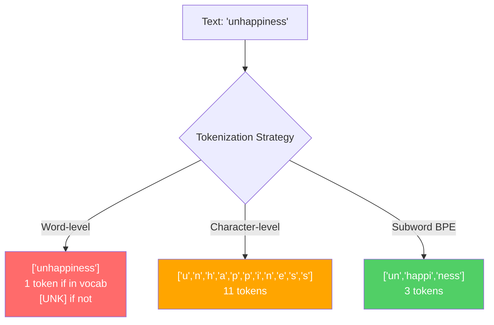
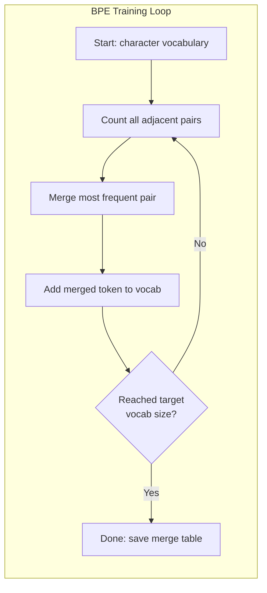
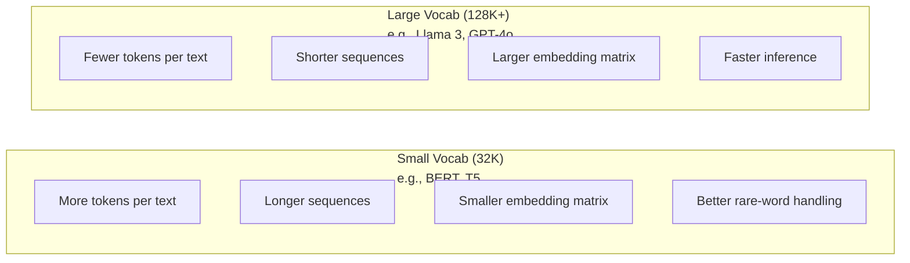

# Tokenizers: BPE, WordPiece, SentencePiece

> LLM của bạn không đọc tiếng Anh. Nó đọc các số nguyên. Tokenizer quyết định xem những số nguyên đó mang ý nghĩa hay là sự lãng phí.

**Type:** Build
**Languages:** Python
**Prerequisites:** Phase 05 (NLP Foundations)
**Time:** ~90 phút

## Mục tiêu học tập

- Triển khai các thuật toán tokenization BPE, WordPiece và Unigram từ đầu và so sánh các chiến lược gộp (merge) của chúng
- Giải thích cách kích thước từ vựng (vocabulary size) ảnh hưởng đến hiệu suất mô hình: quá nhỏ tạo ra chuỗi dài, quá lớn gây lãng phí tham số embedding
- Phân tích các artifact của tokenization trên các ngôn ngữ và mã nguồn, xác định nơi các tokenizer cụ thể bị lỗi
- Sử dụng các thư viện tiktoken và sentencepiece để tokenize văn bản và kiểm tra các token ID kết quả

## Vấn đề

LLM của bạn không đọc tiếng Anh. Nó không đọc bất kỳ ngôn ngữ nào. Nó đọc các con số.

Khoảng cách giữa "Hello, world!" và [15496, 11, 995, 0] chính là tokenizer. Mọi từ, mọi khoảng trắng, mọi dấu câu đều phải được chuyển đổi thành một số nguyên trước khi mô hình có thể xử lý. Quá trình chuyển đổi này không hề trung lập. Nó đưa các giả định vào mô hình mà sau này không thể hoàn tác.

Nếu làm sai, mô hình của bạn sẽ lãng phí năng lực khi mã hóa các từ phổ biến bằng nhiều token. "unfortunately" trở thành bốn token thay vì một. Cửa sổ ngữ cảnh 128K của bạn vừa bị thu hẹp 75% đối với văn bản chứa nhiều từ đa âm tiết. Nếu làm đúng, cùng một cửa sổ ngữ cảnh đó sẽ chứa được lượng ý nghĩa gấp đôi. Sự khác biệt giữa "mô hình này xử lý code tốt" và "mô hình này bị nghẽn với Python" thường nằm ở cách tokenizer được huấn luyện.

Mỗi lệnh gọi API bạn thực hiện tới GPT-4 hoặc Claude đều được tính phí theo token. Mỗi token mà mô hình của bạn tạo ra đều tốn chi phí tính toán. Càng ít token cần thiết để biểu diễn một đầu ra, suy luận (inference) end-to-end càng nhanh. Tokenization không phải là tiền xử lý. Nó là kiến trúc.

## Khái niệm

### Ba cách tiếp cận đã thất bại (và một cách thành công)

Có ba cách rõ ràng để chuyển đổi văn bản thành số. Hai trong số đó không hoạt động ở quy mô lớn.

**Tokenization cấp độ từ (Word-level)** tách theo khoảng trắng và dấu câu. "The cat sat" trở thành ["The", "cat", "sat"]. Đơn giản. Nhưng còn "tokenization" thì sao? Hay "GPT-4o"? Hoặc một từ ghép tiếng Đức như "Geschwindigkeitsbegrenzung"? Cấp độ từ đòi hỏi một từ vựng khổng lồ để bao phủ mọi từ trong mọi ngôn ngữ. Nếu thiếu một từ, bạn sẽ nhận được token `[UNK]` đáng sợ -- cách mô hình nói rằng "Tôi không biết đây là cái gì". Chỉ riêng tiếng Anh đã có hơn một triệu dạng từ. Thêm mã nguồn, URL, ký hiệu khoa học và 100 ngôn ngữ khác, bạn sẽ cần một từ vựng vô hạn.

**Tokenization cấp độ ký tự (Character-level)** đi theo hướng ngược lại. "hello" trở thành ["h", "e", "l", "l", "o"]. Từ vựng rất nhỏ (vài trăm ký tự). Không bao giờ có token lạ (unknown tokens). Nhưng các chuỗi trở nên cực kỳ dài. Một câu lẽ ra là 10 token cấp độ từ sẽ trở thành 50 token cấp độ ký tự. Mô hình phải học rằng "t", "h", "e" đi cùng nhau có nghĩa là "the" -- đốt cháy năng lực chú ý (attention capacity) vào thứ mà con người học được từ năm ba tuổi.

**Tokenization cấp độ từ phụ (Subword tokenization)** tìm ra điểm cân bằng. Các từ phổ biến được giữ nguyên: "the" là một token. Các từ hiếm được phân tách thành các mảnh có nghĩa: "unhappiness" trở thành ["un", "happi", "ness"]. Từ vựng vẫn ở mức quản lý được (30K đến 128K token). Các chuỗi vẫn ngắn. Token lạ về cơ bản biến mất vì bất kỳ từ nào cũng có thể được xây dựng từ các mảnh từ phụ.

Mọi LLM hiện đại đều sử dụng subword tokenization. GPT-2, GPT-4, BERT, Llama 3, Claude -- tất cả đều vậy. Câu hỏi là thuật toán nào.



### BPE: Byte Pair Encoding

BPE là một thuật toán nén tham lam được tái sử dụng cho tokenization. Ý tưởng đơn giản đến mức có thể viết vừa trên một tấm thẻ.

Bắt đầu với các ký tự riêng lẻ. Đếm mọi cặp liền kề trong tập dữ liệu huấn luyện. Gộp cặp xuất hiện thường xuyên nhất thành một token mới. Lặp lại cho đến khi bạn đạt được kích thước từ vựng mục tiêu.

```figure
tokenizer-bpe
```

Đây là BPE chạy trên một tập dữ liệu nhỏ với các từ "lower", "lowest" và "newest":

```
Corpus (with word frequencies):
  "lower"  x5
  "lowest" x2
  "newest" x6

Step 0 -- Start with characters:
  l o w e r       (x5)
  l o w e s t     (x2)
  n e w e s t     (x6)

Step 1 -- Count adjacent pairs:
  (e,s): 8    (s,t): 8    (l,o): 7    (o,w): 7
  (w,e): 13   (e,r): 5    (n,e): 6    ...

Step 2 -- Merge most frequent pair (w,e) -> "we":
  l o we r        (x5)
  l o we s t      (x2)
  n e we s t      (x6)

Step 3 -- Recount and merge (e,s) -> "es":
  l o we r        (x5)
  l o we s t      (x2)    <- 'es' only forms from 'e'+'s', not 'we'+'s'
  n e we s t      (x6)    <- wait, the 'e' before 'we' and 's' after 'we'

Actually tracking this precisely:
  After "we" merge, remaining pairs:
  (l,o): 7   (o,we): 7   (we,r): 5   (we,s): 8
  (s,t): 8   (n,e): 6    (e,we): 6

Step 3 -- Merge (we,s) -> "wes" or (s,t) -> "st" (tied at 8, pick first):
  Merge (we,s) -> "wes":
  l o we r        (x5)
  l o wes t       (x2)
  n e wes t       (x6)

Step 4 -- Merge (wes,t) -> "west":
  l o we r        (x5)
  l o west        (x2)
  n e west        (x6)

...continue until target vocab size reached.
```

Bảng gộp (merge table) chính là tokenizer. Để mã hóa văn bản mới, hãy áp dụng các quy tắc gộp theo thứ tự chúng được học. Tập dữ liệu huấn luyện xác định các quy tắc gộp nào tồn tại, và lựa chọn đó định hình vĩnh viễn những gì mô hình nhìn thấy.



### Byte-Level BPE (GPT-2, GPT-3, GPT-4)

BPE tiêu chuẩn hoạt động trên các ký tự Unicode. Byte-level BPE hoạt động trên các byte thô (0-255). Điều này cung cấp cho bạn một từ vựng cơ sở chính xác là 256, xử lý bất kỳ ngôn ngữ hoặc mã hóa nào và không bao giờ tạo ra token lạ.

GPT-2 đã giới thiệu cách tiếp cận này. Từ vựng cơ sở bao phủ mọi byte có thể. Các quy tắc gộp BPE được xây dựng dựa trên đó. Thư viện tiktoken của OpenAI triển khai byte-level BPE với các kích thước từ vựng sau:

- GPT-2: 50,257 token
- GPT-3.5/GPT-4: ~100,256 token (mã hóa cl100k_base)
- GPT-4o: 200,019 token (mã hóa o200k_base)

### WordPiece (BERT)

WordPiece trông tương tự như BPE nhưng chọn các quy tắc gộp khác. Thay vì tần suất thô, nó tối đa hóa khả năng xảy ra (likelihood) của dữ liệu huấn luyện:

```
BPE merge criterion:      count(A, B)
WordPiece merge criterion: count(AB) / (count(A) * count(B))
```

BPE hỏi: "Cặp nào xuất hiện thường xuyên nhất?" WordPiece hỏi: "Cặp nào xuất hiện cùng nhau thường xuyên hơn mức bạn mong đợi một cách ngẫu nhiên?" Sự khác biệt tinh tế này tạo ra các từ vựng khác nhau. WordPiece ưu tiên các quy tắc gộp nơi sự đồng xuất hiện là đáng ngạc nhiên, không chỉ là thường xuyên.

WordPiece cũng sử dụng tiền tố "##" cho các từ phụ tiếp nối:

```
"unhappiness" -> ["un", "##happi", "##ness"]
"embedding"   -> ["em", "##bed", "##ding"]
```

Tiền tố "##" cho bạn biết mảnh này tiếp nối một token trước đó. BERT sử dụng WordPiece với từ vựng 30,522 token. Mọi biến thể BERT -- DistilBERT, RoBERTa (tokenizer của RoBERTa thực tế là BPE, nhưng bản thân BERT là WordPiece).

### SentencePiece (Llama, T5)

SentencePiece coi đầu vào là một luồng ký tự Unicode thô, bao gồm cả khoảng trắng. Không có bước tiền tokenization. Không có quy tắc cụ thể theo ngôn ngữ về ranh giới từ. Điều này làm cho nó thực sự bất khả tri về ngôn ngữ (language-agnostic) -- nó hoạt động trên tiếng Trung, tiếng Nhật, tiếng Thái và các ngôn ngữ khác mà khoảng trắng không phân tách các từ.

SentencePiece hỗ trợ hai thuật toán:
- **Chế độ BPE**: logic gộp giống như BPE tiêu chuẩn, áp dụng cho các chuỗi ký tự thô
- **Chế độ Unigram**: bắt đầu với một từ vựng lớn và loại bỏ lặp đi lặp lại các token ít ảnh hưởng nhất đến khả năng xảy ra tổng thể. Ngược lại với BPE -- cắt tỉa thay vì gộp.

Llama 2 sử dụng SentencePiece BPE với từ vựng 32,000 token. T5 sử dụng SentencePiece Unigram với 32,000 token. Lưu ý: Llama 3 đã chuyển sang tokenizer byte-level BPE dựa trên tiktoken với 128,256 token.

### Đánh đổi kích thước từ vựng

Đây là một quyết định kỹ thuật thực sự với những hậu quả có thể đo lường được.



Các con số cụ thể. Đối với từ vựng 128K với embedding 4,096 chiều, ma trận embedding chỉ riêng đã là 128,000 x 4,096 = 524 triệu tham số. Đối với từ vựng 32K, nó là 131 triệu tham số. Đó là sự khác biệt 400 triệu tham số chỉ từ lựa chọn tokenizer.

Nhưng từ vựng lớn hơn nén văn bản mạnh mẽ hơn. Cùng một đoạn văn tiếng Anh chiếm 100 token với từ vựng 32K có thể chỉ chiếm 70 token với từ vựng 128K. Điều đó có nghĩa là ít hơn 30% lượt truyền tiến (forward passes) trong quá trình tạo. Đối với một mô hình phục vụ hàng triệu yêu cầu, đó là sự giảm trực tiếp chi phí tính toán.

Xu hướng rất rõ ràng: kích thước từ vựng đang tăng lên. GPT-2 sử dụng 50,257. GPT-4 sử dụng ~100K. Llama 3 sử dụng 128K. GPT-4o sử dụng 200K.

| Mô hình | Kích thước từ vựng | Loại Tokenizer | Trung bình token mỗi từ tiếng Anh |
|-------|-----------|----------------|---------------------------|
| BERT | 30,522 | WordPiece | ~1.4 |
| GPT-2 | 50,257 | Byte-level BPE | ~1.3 |
| Llama 2 | 32,000 | SentencePiece BPE | ~1.4 |
| GPT-4 | ~100,256 | Byte-level BPE | ~1.2 |
| Llama 3 | 128,256 | Byte-level BPE (tiktoken) | ~1.1 |
| GPT-4o | 200,019 | Byte-level BPE | ~1.0 |

### Thuế đa ngôn ngữ (The Multilingual Tax)

Các tokenizer được huấn luyện chủ yếu bằng tiếng Anh rất khắc nghiệt với các ngôn ngữ khác. Văn bản tiếng Hàn trong tokenizer của GPT-2 trung bình là 2-3 token mỗi từ. Tiếng Trung có thể tệ hơn. Điều này có nghĩa là một người dùng tiếng Hàn thực tế có cửa sổ ngữ cảnh bằng một nửa kích thước của người dùng tiếng Anh -- trả cùng một mức giá cho mật độ thông tin ít hơn.

Đây là lý do tại sao Llama 3 tăng gấp bốn lần từ vựng của mình từ 32K lên 128K. Nhiều token dành riêng cho các hệ thống chữ viết không phải tiếng Anh có nghĩa là sự nén công bằng hơn giữa các ngôn ngữ.

```figure
tokenizer-tradeoff
```

## Xây dựng

### Bước 1: Tokenizer cấp độ ký tự

Bắt đầu từ nền tảng. Một tokenizer cấp độ ký tự ánh xạ mỗi ký tự tới điểm mã Unicode của nó. Không cần huấn luyện. Không có token lạ. Chỉ là một ánh xạ trực tiếp.

```python
class CharTokenizer:
    def encode(self, text):
        return [ord(c) for c in text]

    def decode(self, tokens):
        return "".join(chr(t) for t in tokens)
```

"hello" trở thành [104, 101, 108, 108, 111]. Mỗi ký tự là token của riêng nó. Đây là đường cơ sở mà chúng ta cải thiện.

### Bước 2: BPE Tokenizer từ đầu

Triển khai thực tế. Chúng ta huấn luyện trên các byte thô (như GPT-2), đếm các cặp, gộp cặp thường xuyên nhất và ghi lại mọi quy tắc gộp theo thứ tự. Bảng gộp chính là tokenizer.

```python
from collections import Counter

class BPETokenizer:
    def __init__(self):
        self.merges = {}
        self.vocab = {}

    def _get_pairs(self, tokens):
        pairs = Counter()
        for i in range(len(tokens) - 1):
            pairs[(tokens[i], tokens[i + 1])] += 1
        return pairs

    def _merge_pair(self, tokens, pair, new_token):
        merged = []
        i = 0
        while i < len(tokens):
            if i < len(tokens) - 1 and tokens[i] == pair[0] and tokens[i + 1] == pair[1]:
                merged.append(new_token)
                i += 2
            else:
                merged.append(tokens[i])
                i += 1
        return merged

    def train(self, text, num_merges):
        tokens = list(text.encode("utf-8"))
        self.vocab = {i: bytes([i]) for i in range(256)}

        for i in range(num_merges):
            pairs = self._get_pairs(tokens)
            if not pairs:
                break
            best_pair = max(pairs, key=pairs.get)
            new_token = 256 + i
            tokens = self._merge_pair(tokens, best_pair, new_token)
            self.merges[best_pair] = new_token
            self.vocab[new_token] = self.vocab[best_pair[0]] + self.vocab[best_pair[1]]

        return self

    def encode(self, text):
        tokens = list(text.encode("utf-8"))
        for pair, new_token in self.merges.items():
            tokens = self._merge_pair(tokens, pair, new_token)
        return tokens

    def decode(self, tokens):
        byte_sequence = b"".join(self.vocab[t] for t in tokens)
        return byte_sequence.decode("utf-8", errors="replace")
```

Vòng lặp huấn luyện là cốt lõi của BPE: đếm các cặp, gộp cặp chiến thắng, lặp lại. Mỗi lần gộp làm giảm tổng số token. Sau `num_merges` vòng, từ vựng tăng từ 256 (byte cơ sở) lên 256 + số_lần_gộp.

Mã hóa áp dụng các quy tắc gộp theo đúng thứ tự chúng được học. Điều này rất quan trọng. Nếu lần gộp 1 tạo ra "th" và lần gộp 5 tạo ra "the", việc mã hóa phải áp dụng lần gộp 1 trước để "the" có thể hình thành từ "th" + "e" trong lần gộp 5.

Giải mã là ngược lại: tra cứu mỗi token ID trong từ vựng, nối các byte lại, giải mã sang UTF-8.

### Bước 3: Vòng lặp Encode và Decode

```python
corpus = (
    "The cat sat on the mat. The cat ate the rat. "
    "The dog sat on the log. The dog ate the frog. "
    "Natural language processing is the study of how computers "
    "understand and generate human language. "
    "Tokenization is the first step in any NLP pipeline."
)

tokenizer = BPETokenizer()
tokenizer.train(corpus, num_merges=40)

test_sentences = [
    "The cat sat on the mat.",
    "Natural language processing",
    "tokenization pipeline",
    "unhappiness",
]

for sentence in test_sentences:
    encoded = tokenizer.encode(sentence)
    decoded = tokenizer.decode(encoded)
    raw_bytes = len(sentence.encode("utf-8"))
    ratio = len(encoded) / raw_bytes
    print(f"'{sentence}'")
    print(f"  Tokens: {len(encoded)} (from {raw_bytes} bytes) -- ratio: {ratio:.2f}")
    print(f"  Roundtrip: {'PASS' if decoded == sentence else 'FAIL'}")
```

Tỷ lệ nén cho bạn biết tokenizer hiệu quả như thế nào. Tỷ lệ 0.50 có nghĩa là tokenizer đã nén văn bản xuống còn một nửa số token so với byte thô. Thấp hơn là tốt hơn. Trên tập dữ liệu huấn luyện, tỷ lệ sẽ tốt. Trên văn bản ngoài phân phối (out-of-distribution) như "unhappiness" (không xuất hiện trong tập dữ liệu), tỷ lệ sẽ tệ hơn -- tokenizer quay lại mã hóa cấp độ ký tự cho các mẫu chưa thấy.

### Bước 4: So sánh với tiktoken

```python
import tiktoken

enc = tiktoken.get_encoding("cl100k_base")

texts = [
    "The cat sat on the mat.",
    "unhappiness",
    "Hello, world!",
    "def fibonacci(n): return n if n < 2 else fibonacci(n-1) + fibonacci(n-2)",
    "Geschwindigkeitsbegrenzung",
]

for text in texts:
    our_tokens = tokenizer.encode(text)
    tiktoken_tokens = enc.encode(text)
    tiktoken_pieces = [enc.decode([t]) for t in tiktoken_tokens]
    print(f"'{text}'")
    print(f"  Our BPE:   {len(our_tokens)} tokens")
    print(f"  tiktoken:  {len(tiktoken_tokens)} tokens -> {tiktoken_pieces}")
```

tiktoken sử dụng chính xác thuật toán tương tự nhưng được huấn luyện trên hàng trăm gigabyte văn bản với 100,000 quy tắc gộp. Thuật toán là giống hệt nhau. Sự khác biệt nằm ở dữ liệu huấn luyện và số lượng quy tắc gộp. Tokenizer của bạn được huấn luyện trên một đoạn văn với 40 quy tắc gộp không thể cạnh tranh với 100K quy tắc gộp của tiktoken trên một tập dữ liệu khổng lồ. Nhưng cơ chế là như nhau.

### Bước 5: Phân tích từ vựng

```python
def analyze_vocabulary(tokenizer, test_texts):
    total_tokens = 0
    total_chars = 0
    token_usage = Counter()

    for text in test_texts:
        encoded = tokenizer.encode(text)
        total_tokens += len(encoded)
        total_chars += len(text)
        for t in encoded:
            token_usage[t] += 1

    print(f"Vocabulary size: {len(tokenizer.vocab)}")
    print(f"Total tokens across all texts: {total_tokens}")
    print(f"Total characters: {total_chars}")
    print(f"Avg tokens per character: {total_tokens / total_chars:.2f}")

    print(f"\nMost used tokens:")
    for token_id, count in token_usage.most_common(10):
        token_bytes = tokenizer.vocab[token_id]
        display = token_bytes.decode("utf-8", errors="replace")
        print(f"  Token {token_id:4d}: '{display}' (used {count} times)")

    unused = [t for t in tokenizer.vocab if t not in token_usage]
    print(f"\nUnused tokens: {len(unused)} out of {len(tokenizer.vocab)}")
```

Điều này tiết lộ phân phối Zipf trong từ vựng của bạn. Một vài token chiếm ưu thế (khoảng trắng, "the", "e"). Hầu hết các token hiếm khi được sử dụng. Các tokenizer sản xuất tối ưu hóa cho phân phối này -- các mẫu phổ biến nhận được token ID ngắn, các mẫu hiếm nhận được biểu diễn dài hơn.

## Sử dụng

BPE tự xây dựng của bạn đã hoạt động. Bây giờ hãy xem các công cụ sản xuất trông như thế nào.

### tiktoken (OpenAI)

```python
import tiktoken

enc = tiktoken.get_encoding("cl100k_base")

text = "Tokenizers convert text to integers"
tokens = enc.encode(text)
print(f"Tokens: {tokens}")
print(f"Pieces: {[enc.decode([t]) for t in tokens]}")
print(f"Roundtrip: {enc.decode(tokens)}")
```

tiktoken được viết bằng Rust với các ràng buộc Python. Nó mã hóa hàng triệu token mỗi giây. Cùng thuật toán BPE, triển khai ở cấp độ công nghiệp.

### Hugging Face tokenizers

```python
from tokenizers import Tokenizer
from tokenizers.models import BPE
from tokenizers.trainers import BpeTrainer
from tokenizers.pre_tokenizers import ByteLevel

tokenizer = Tokenizer(BPE())
tokenizer.pre_tokenizer = ByteLevel()

trainer = BpeTrainer(vocab_size=1000, special_tokens=["<pad>", "<eos>", "<unk>"])
tokenizer.train(["corpus.txt"], trainer)

output = tokenizer.encode("The cat sat on the mat.")
print(f"Tokens: {output.tokens}")
print(f"IDs: {output.ids}")
```

Thư viện tokenizers của Hugging Face cũng sử dụng Rust bên dưới. Nó huấn luyện BPE trên các tập dữ liệu quy mô gigabyte trong vài giây. Đây là thứ bạn sử dụng khi huấn luyện mô hình của riêng mình.

### Tải Tokenizer của Llama

```python
from transformers import AutoTokenizer

tokenizer = AutoTokenizer.from_pretrained("meta-llama/Llama-3.1-8B")

text = "Tokenizers are the unsung heroes of LLMs"
tokens = tokenizer.encode(text)
print(f"Token IDs: {tokens}")
print(f"Tokens: {tokenizer.convert_ids_to_tokens(tokens)}")
print(f"Vocab size: {tokenizer.vocab_size}")

multilingual = ["Hello world", "Hola mundo", "Bonjour le monde"]
for text in multilingual:
    ids = tokenizer.encode(text)
    print(f"'{text}' -> {len(ids)} tokens")
```

Từ vựng 128K của Llama 3 nén văn bản không phải tiếng Anh tốt hơn đáng kể so với từ vựng 50K của GPT-2. Bạn có thể tự mình xác minh điều này -- mã hóa cùng một câu bằng nhiều ngôn ngữ và đếm các token.

## Ship It

Bài học này tạo ra `outputs/prompt-tokenizer-analyzer.md` -- một prompt có thể tái sử dụng để phân tích hiệu suất tokenization cho bất kỳ sự kết hợp văn bản và mô hình nào. Cung cấp cho nó một mẫu văn bản và nó sẽ cho bạn biết tokenizer của mô hình nào xử lý nó tốt nhất.

## Bài tập

1. Sửa đổi BPE tokenizer để in từ vựng tại mỗi bước gộp. Quan sát cách "t" + "h" trở thành "th", sau đó "th" + "e" trở thành "the". Theo dõi cách các từ tiếng Anh phổ biến được lắp ráp từng mảnh một.

2. Thêm các token đặc biệt (`<pad>`, `<eos>`, `<unk>`) vào BPE tokenizer. Gán cho chúng ID 0, 1, 2 và dịch chuyển tất cả các token khác tương ứng. Triển khai một bước tiền tokenization tách theo khoảng trắng trước khi chạy BPE.

3. Triển khai tiêu chí gộp WordPiece (tỷ lệ khả năng xảy ra thay vì tần suất). Huấn luyện cả BPE và WordPiece trên cùng một tập dữ liệu với cùng số lượng quy tắc gộp. So sánh các từ vựng kết quả -- cái nào tạo ra các từ phụ có ý nghĩa ngôn ngữ hơn?

4. Xây dựng một chuẩn đo lường hiệu suất tokenizer đa ngôn ngữ. Lấy 10 câu bằng tiếng Anh, Tây Ban Nha, Trung, Hàn và Ả Rập. Tokenize mỗi câu bằng tiktoken (cl100k_base) và đo trung bình token trên mỗi ký tự. Định lượng "thuế đa ngôn ngữ" cho mỗi ngôn ngữ.

5. Huấn luyện BPE tokenizer của bạn trên một tập dữ liệu lớn hơn (tải xuống một bài viết Wikipedia). Điều chỉnh số lượng quy tắc gộp để đạt được tỷ lệ nén trong vòng 10% so với tiktoken trên cùng văn bản đó. Điều này buộc bạn phải hiểu mối quan hệ giữa kích thước tập dữ liệu, số lượng gộp và chất lượng nén.

## Thuật ngữ chính

| Thuật ngữ | Mọi người nói | Ý nghĩa thực tế |
|------|----------------|----------------------|
| Token | "Một từ" | Một đơn vị trong từ vựng của mô hình -- có thể là ký tự, từ phụ, từ hoặc đoạn nhiều từ |
| BPE | "Thứ nén nào đó" | Byte Pair Encoding -- gộp lặp đi lặp lại cặp token liền kề thường xuyên nhất cho đến khi đạt kích thước từ vựng mục tiêu |
| WordPiece | "Tokenizer của BERT" | Giống BPE nhưng các quy tắc gộp tối đa hóa tỷ lệ khả năng xảy ra count(AB)/(count(A)*count(B)) thay vì tần suất thô |
| SentencePiece | "Một thư viện tokenizer" | Một tokenizer bất khả tri về ngôn ngữ hoạt động trên Unicode thô mà không cần tiền tokenization, hỗ trợ thuật toán BPE và Unigram |
| Kích thước từ vựng | "Nó biết bao nhiêu từ" | Tổng số token duy nhất: GPT-2 có 50,257, BERT có 30,522, Llama 3 có 128,256 |
| Fertility | "Không phải thuật ngữ tokenizer" | Số lượng token trung bình trên mỗi từ -- đo lường hiệu suất tokenizer giữa các ngôn ngữ (1.0 là hoàn hảo, 3.0 nghĩa là mô hình làm việc vất vả gấp ba) |
| Byte-level BPE | "Tokenizer của GPT" | BPE hoạt động trên các byte thô (0-255) thay vì ký tự Unicode, đảm bảo không có token lạ cho bất kỳ đầu vào nào |
| Bảng gộp | "Tệp tokenizer" | Danh sách thứ tự các cặp gộp được học trong quá trình huấn luyện -- đây CHÍNH LÀ tokenizer, và thứ tự rất quan trọng |
| Tiền tokenization | "Tách theo khoảng trắng" | Các quy tắc được áp dụng trước khi subword tokenization: tách khoảng trắng, tách chữ số, xử lý dấu câu |
| Tỷ lệ nén | "Tokenizer hiệu quả thế nào" | Số token tạo ra chia cho byte đầu vào -- thấp hơn nghĩa là nén tốt hơn và suy luận nhanh hơn |

## Đọc thêm

- [Sennrich et al., 2016 -- "Neural Machine Translation of Rare Words with Subword Units"](https://arxiv.org/abs/1508.07909) -- bài báo giới thiệu BPE cho NLP, biến một thuật toán nén năm 1994 thành nền tảng của tokenization hiện đại
- [Kudo & Richardson, 2018 -- "SentencePiece: A simple and language independent subword tokenizer"](https://arxiv.org/abs/1808.06226) -- tokenization bất khả tri về ngôn ngữ giúp các mô hình đa ngôn ngữ trở nên thực tế
- [OpenAI tiktoken repository](https://github.com/openai/tiktoken) -- triển khai BPE sản xuất bằng Rust với các ràng buộc Python, được sử dụng bởi GPT-3.5/4/4o
- [Hugging Face Tokenizers documentation](https://huggingface.co/docs/tokenizers) -- huấn luyện tokenizer cấp độ sản xuất với hiệu suất của Rust