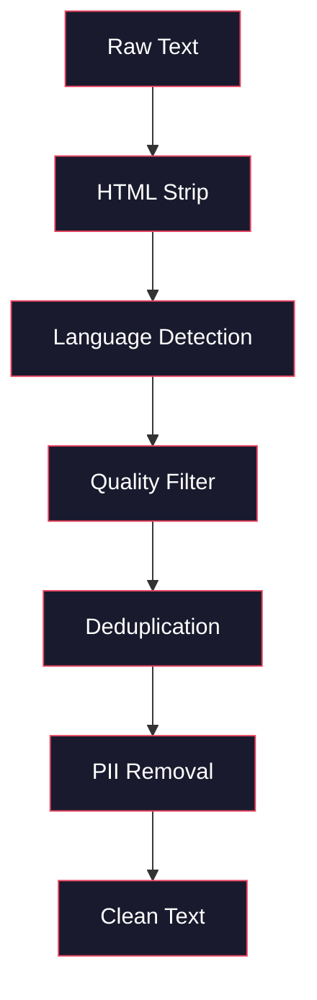
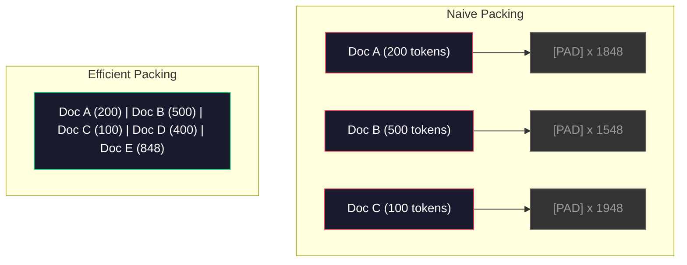

# Data Pipelines for Pre-Training

> The model is a mirror. It reflects whatever data you feed it. Feed it garbage, it reflects garbage with perfect fluency.

**Type:** Build
**Languages:** Python
**Prerequisites:** Phase 10, Lessons 01-02 (Tokenizers, Building a Tokenizer)
**Time:** ~90 minutes

## Learning Objectives

- Xây dựng pipeline dữ liệu streaming để tokenize, chia nhỏ (chunk), xáo trộn (shuffle) và tạo batch cho hàng terabyte văn bản mà không cần tải toàn bộ vào bộ nhớ.
- Triển khai các bộ lọc chất lượng dữ liệu (khử trùng lặp, phát hiện ngôn ngữ, lọc nội dung) được sử dụng trong các pipeline pre-training thực tế.
- Tạo các chuỗi huấn luyện có độ dài cố định với attention mask phù hợp và xử lý ranh giới tài liệu.
- Đo lường thông lượng (throughput) của pipeline để đảm bảo dataloader theo kịp tốc độ huấn luyện của GPU.

## The Problem

Bạn đã có một tokenizer. Bây giờ bạn cần dữ liệu.

Không phải một tập dữ liệu (dataset). Không phải một tệp CSV. Mà là hàng terabyte văn bản -- đã được làm sạch, khử trùng lặp, lọc chất lượng, token hóa thành các chuỗi có độ dài cố định và được cung cấp theo các batch ngẫu nhiên đủ nhanh để cụm 8-GPU của bạn không bao giờ phải chờ đợi batch tiếp theo.

Hầu hết mọi người nghĩ rằng huấn luyện LLM là về kiến trúc mô hình. Thực tế không phải vậy. Llama 3 sử dụng 15,6 nghìn tỷ token. GPT-3 sử dụng 300 tỷ. DeepSeek-V2 sử dụng 8,1 nghìn tỷ. Kiến trúc của cả ba về cơ bản là giống nhau: các khối transformer xếp chồng với các lớp attention và feedforward. Sự khác biệt về chất lượng đầu ra chủ yếu đến từ dữ liệu.

Bài báo Chinchilla từ DeepMind đã làm rõ điều này. Với một ngân sách tính toán nhất định, có một tỷ lệ tối ưu giữa số lượng tham số mô hình và số lượng token huấn luyện. Chinchilla cho thấy hầu hết các mô hình vào năm 2022 đều bị thiếu dữ liệu huấn luyện trầm trọng -- chúng có quá nhiều tham số so với lượng dữ liệu mà chúng được tiếp cận. Một mô hình 70B tham số được huấn luyện trên 1,4 nghìn tỷ token (tối ưu theo Chinchilla) đã vượt trội hơn một mô hình 280B được huấn luyện trên 300 tỷ token (Gopher).

Pipeline dữ liệu của bạn quyết định liệu mô hình của bạn học được ngôn ngữ hay chỉ học được nhiễu.

## The Concept

### Where the Data Comes From

Mỗi mô hình ngôn ngữ lớn đều được huấn luyện trên sự kết hợp của nhiều nguồn. Thành phần chính xác là một bí mật được bảo vệ chặt chẽ đối với hầu hết các phòng thí nghiệm, nhưng chúng ta biết đủ để hiểu các danh mục.

| Nguồn | Kích thước | Chất lượng | Được sử dụng bởi |
|--------|------|---------|---------|
| Common Crawl | ~250 TB thô | Thấp (cần lọc kỹ) | GPT-3, Llama, hầu hết các mô hình mở |
| Wikipedia | ~20 GB | Cao | Mọi LLM lớn |
| GitHub code | ~1 TB+ | Trung bình (nhiều trùng lặp, code chết) | StarCoder, CodeLlama, DeepSeek-Coder |
| Sách (BookCorpus, Pile) | ~100 GB | Cao | GPT-2, GPT-3, các mô hình đời đầu |
| Bài báo khoa học (arXiv, S2ORC) | ~100 GB | Cao cho STEM | Llama, Galactica |
| StackOverflow, Reddit | ~100 GB | Trung bình | Llama, Falcon |
| Web đã chọn lọc (C4, RefinedWeb) | ~5 TB | Trung bình-Cao (đã lọc trước) | T5, Falcon |

Llama 3 đã tiết lộ hỗn hợp dữ liệu của mình: khoảng 50% dữ liệu web, 25% code, 13% sách và bài báo khoa học, 8% dữ liệu toán học và 4% dữ liệu web đa ngôn ngữ. Tổng cộng là 15,6 nghìn tỷ token từ các nguồn vượt quá 5 TB văn bản thô.

Tỷ lệ quan trọng cũng như tổng kích thước. Quá nhiều dữ liệu web và mô hình sẽ trở thành một con vẹt Reddit. Quá ít code và nó không thể lập trình. Quá ít toán học và nó thất bại trong việc suy luận. Việc đạt được tỷ lệ này là một trong những phần khó nhất của việc huấn luyện LLM, và không có công thức nào cả -- nó đòi hỏi sự thử nghiệm và đánh giá.

### Data Cleaning

Dữ liệu web thô rất bẩn. Một bản dump Common Crawl điển hình chứa:

- Thẻ HTML và JavaScript
- Header, footer, menu điều hướng
- Các trang trùng lặp (chính xác và gần như trùng lặp)
- Spam do máy tạo ra
- Thông tin nhận dạng cá nhân (PII)
- Văn bản chất lượng thấp (danh sách từ khóa, SEO spam)
- Nội dung không phải văn bản được mã hóa dưới dạng văn bản

Việc làm sạch là bắt buộc. Đó là sự khác biệt giữa một mô hình tạo ra các đoạn văn mạch lạc và một mô hình xuất ra các thẻ HTML lẫn với danh sách sản phẩm.



Mỗi bước loại bỏ một loại nhiễu:

**HTML stripping:** Loại bỏ tất cả markup. Chỉ giữ lại nội dung văn bản hiển thị. Các thư viện như `trafilatura` hoặc `readability` trích xuất nội dung bài viết trong khi loại bỏ điều hướng, quảng cáo và boilerplate.

**Language detection:** Sử dụng mô hình nhận dạng ngôn ngữ của fastText (lid.176.bin) để phân loại từng tài liệu. Lọc theo ngôn ngữ mục tiêu của bạn. Một tài liệu được phân loại là tiếng Anh với độ tin cậy dưới 0,8 có khả năng không phải là tiếng Anh sạch.

**Quality filtering:** Đây là nơi mọi thứ trở nên thú vị. RefinedWeb (tập dữ liệu đằng sau Falcon) sử dụng bộ lọc dựa trên perplexity: huấn luyện một mô hình ngôn ngữ nhỏ trên Wikipedia, sau đó chấm điểm từng tài liệu. Perplexity cao có nghĩa là tài liệu đó không giống Wikipedia -- có khả năng là spam, danh sách từ khóa hoặc nội dung do máy tạo ra. Các tài liệu có perplexity vượt quá ngưỡng sẽ bị loại bỏ.

**Deduplication:** Bước làm sạch có tác động mạnh nhất. Common Crawl chứa một lượng lớn các trang trùng lặp -- tuyên bố từ chối trách nhiệm pháp lý, thông báo cookie, điều khoản dịch vụ. Huấn luyện trên các bản trùng lặp gây lãng phí tài nguyên tính toán và có thể khiến mô hình ghi nhớ và lặp lại nguyên văn các đoạn cụ thể.

**PII removal:** Tên, địa chỉ email, số điện thoại, số an sinh xã hội. Phát hiện dựa trên Regex cho PII có cấu trúc, các mô hình NER cho tên trong ngữ cảnh.

### Deduplication with MinHash

Khử trùng lặp chính xác rất dễ: băm (hash) từng tài liệu, loại bỏ các bản trùng lặp. Nhưng các bản gần như trùng lặp (near-duplicates) mới là vấn đề thực sự. Hai bản sao của cùng một bài báo với các quảng cáo hơi khác nhau xung quanh là các bản gần như trùng lặp. Nội dung giống nhau 95%, nhưng từng byte lại khác nhau.

MinHash + Locality-Sensitive Hashing (LSH) giải quyết vấn đề này một cách hiệu quả.


Ý tưởng:

1. **Shingling:** Chuyển đổi mỗi tài liệu thành một tập hợp các n-gram (ví dụ: 5-gram của từ hoặc ký tự). "the quick brown fox" với 3-word shingles trở thành {"the quick brown", "quick brown fox"}.

2. **MinHash:** Đối với tập hợp shingle của mỗi tài liệu, tính toán k giá trị băm. Mỗi giá trị băm là giá trị băm nhỏ nhất trong tất cả các shingle theo một hàm băm khác nhau. Điều này tạo ra một "chữ ký" có kích thước cố định xấp xỉ độ tương đồng Jaccard giữa hai tài liệu bất kỳ.

3. **LSH:** Nhóm các tài liệu vào các bucket dựa trên các dải (band) của chữ ký MinHash. Các tài liệu trong cùng một bucket là các ứng viên gần như trùng lặp. Điều này tránh việc phải so sánh mọi cặp -- bạn chỉ so sánh các ứng viên.

4. **Verify:** Đối với mỗi cặp ứng viên, tính toán độ tương đồng Jaccard chính xác. Loại bỏ một bản sao nếu độ tương đồng vượt quá ngưỡng (thường là 0,8).

Nhóm Llama báo cáo đã loại bỏ khoảng 38% dữ liệu web của họ thông qua khử trùng lặp. Đó không phải là một con số nhỏ. Hơn một phần ba Common Crawl là nội dung trùng lặp hoặc gần như trùng lặp.

### Sequence Packing

Mô hình của bạn mong đợi các chuỗi đầu vào có độ dài cố định. Tài liệu của bạn có độ dài thay đổi. Một số là 50 token. Một số là 50.000 token.

Cách tiếp cận ngây thơ: pad mọi tài liệu đến độ dài chuỗi tối đa. Điều này lãng phí tài nguyên tính toán khổng lồ cho các token padding không đóng góp gì vào việc học.

Cách tiếp cận tốt hơn: đóng gói (pack) nhiều tài liệu vào một chuỗi duy nhất, được ngăn cách bởi các token kết thúc chuỗi (EOS). Một chuỗi 2048-token có thể chứa ba tài liệu ngắn được nối với nhau bằng các token [EOS].



Attention mask phải được thiết lập chính xác. Các token từ Tài liệu A không nên chú ý (attend) đến các token từ Tài liệu B trong cùng một chuỗi đã đóng gói. Điều này đòi hỏi một block-diagonal attention mask.

Các tài liệu dài bị cắt bớt hoặc chia thành các đoạn tại ranh giới chuỗi. Điểm chia rất quan trọng: chia giữa câu buộc mô hình phải nhìn thấy những ý tưởng chưa hoàn chỉnh. Một số pipeline căn chỉnh các điểm chia theo ranh giới đoạn văn hoặc câu khi có thể.

### The Chinchilla Scaling Law

Với ngân sách tính toán cố định C (đo bằng FLOPs), kích thước mô hình tối ưu N và kích thước tập dữ liệu D tuân theo:

```
N_opt ~ C^0.5
D_opt ~ C^0.5
```

Trong thực tế, điều này có nghĩa là bạn nên mở rộng kích thước mô hình và kích thước tập dữ liệu một cách tương đương. Một mô hình có số lượng tham số gấp 10 lần cần số lượng token huấn luyện gấp khoảng 10 lần để đạt được cùng mức loss.

| Mô hình | Tham số | Token huấn luyện | Tối ưu Chinchilla? |
|-------|-----------|----------------|-------------------|
| GPT-3 | 175B | 300B | Không (thiếu dữ liệu 3-4 lần) |
| Chinchilla | 70B | 1.4T | Có (theo thiết kế) |
| Llama 2 | 70B | 2T | Quá mức (có chủ đích) |
| Llama 3 | 70B | 15T | Quá mức trầm trọng |

Llama 3 cố tình vi phạm định luật Chinchilla. Meta nhận thấy rằng việc huấn luyện quá mức trên nhiều dữ liệu hơn -- vượt xa tỷ lệ tối ưu tính toán -- tạo ra các mô hình tốt hơn cho việc suy luận (inference). Chi phí huấn luyện thêm được trả một lần, nhưng mô hình nhỏ hơn sẽ rẻ hơn để phục vụ mãi mãi. Điều này đôi khi được gọi là cách tiếp cận mở rộng "tối ưu cho suy luận" và nó đã trở thành tiêu chuẩn công nghiệp kể từ năm 2024.

```figure
l5-data-pipeline
```

## Build It

### Step 1: Text Cleaning

Loại bỏ HTML, chuẩn hóa khoảng trắng, loại bỏ nội dung không phải văn bản. Chúng ta sẽ sử dụng một văn bản thuộc phạm vi công cộng (Project Gutenberg) làm tập dữ liệu nhỏ của mình.

```python
import re

def clean_text(text):
    text = re.sub(r"<[^>]+>", "", text)
    text = re.sub(r"http\S+", "", text)
    text = re.sub(r"[^\x20-\x7E\n]", "", text)
    text = re.sub(r"\n{3,}", "\n\n", text)
    text = re.sub(r" {2,}", " ", text)
    return text.strip()

def quality_filter(text, min_words=50, max_ratio_caps=0.3, max_ratio_special=0.1):
    words = text.split()
    if len(words) < min_words:
        return False
    caps_ratio = sum(1 for w in words if w.isupper()) / len(words)
    if caps_ratio > max_ratio_caps:
        return False
    special_chars = sum(1 for c in text if not c.isalnum() and not c.isspace())
    if special_chars / max(len(text), 1) > max_ratio_special:
        return False
    return True
```

Bộ lọc chất lượng bắt được SEO spam (VIẾT HOA TOÀN BỘ), nhiễu do máy tạo ra (tỷ lệ ký tự đặc biệt cao) và các trang stub (quá ngắn). Chỉ ba kiểm tra này thôi đã loại bỏ một lượng rác đáng kinh ngạc từ các bản crawl web.

### Step 2: MinHash Deduplication

Triển khai MinHash từ đầu. Không cần thư viện bên ngoài -- chỉ cần `hashlib`.

```python
import hashlib
from collections import defaultdict

def get_shingles(text, k=5):
    words = text.lower().split()
    if len(words) < k:
        return set()
    return {" ".join(words[i:i+k]) for i in range(len(words) - k + 1)}

def minhash_signature(shingles, num_hashes=128):
    signature = []
    for i in range(num_hashes):
        min_hash = float("inf")
        for shingle in shingles:
            h = int(hashlib.sha256(f"{i}:{shingle}".encode()).hexdigest(), 16)
            min_hash = min(min_hash, h)
        signature.append(min_hash)
    return signature

def lsh_buckets(signature, bands=16):
    rows_per_band = len(signature) // bands
    buckets = []
    for b in range(bands):
        start = b * rows_per_band
        band_data = tuple(signature[start:start + rows_per_band])
        bucket_hash = hashlib.md5(str(band_data).encode()).hexdigest()
        buckets.append((b, bucket_hash))
    return buckets

def deduplicate(documents, threshold=0.8, num_hashes=128, bands=16):
    signatures = []
    shingle_sets = []
    for doc in documents:
        shingles = get_shingles(doc)
        shingle_sets.append(shingles)
        signatures.append(minhash_signature(shingles, num_hashes))

    bucket_map = defaultdict(list)
    for doc_idx, sig in enumerate(signatures):
        for band_id, bucket_hash in lsh_buckets(sig, bands):
            bucket_map[(band_id, bucket_hash)].append(doc_idx)

    duplicate_pairs = set()
    for bucket_docs in bucket_map.values():
        if len(bucket_docs) < 2:
            continue
        for i in range(len(bucket_docs)):
            for j in range(i + 1, len(bucket_docs)):
                duplicate_pairs.add((bucket_docs[i], bucket_docs[j]))

    removed = set()
    for i, j in duplicate_pairs:
        if i in removed or j in removed:
            continue
        s1, s2 = shingle_sets[i], shingle_sets[j]
        if not s1 or not s2:
            continue
        jaccard = len(s1 & s2) / len(s1 | s2)
        if jaccard >= threshold:
            removed.add(j)

    return [doc for idx, doc in enumerate(documents) if idx not in removed], len(removed)
```

Các tham số `num_hashes=128` và `bands=16` kiểm soát sự đánh đổi giữa độ chính xác và độ thu hồi (precision-recall). Nhiều hàm băm hơn mang lại ước tính độ tương đồng chính xác hơn. Nhiều dải (band) hơn làm tăng độ thu hồi (bắt được nhiều bản trùng lặp hơn) với cái giá là nhiều kết quả dương tính giả hơn. Các giá trị này hoạt động tốt cho văn bản web điển hình.

### Step 3: Tokenize and Pack Sequences

Lấy văn bản đã làm sạch, khử trùng lặp, token hóa nó và đóng gói thành các chuỗi có độ dài cố định để huấn luyện.

```python
def tokenize_corpus(documents, tokenizer):
    all_tokens = []
    for doc in documents:
        tokens = tokenizer.encode(doc)
        all_tokens.extend(tokens)
        all_tokens.append(tokenizer.eos_id)
    return all_tokens

def pack_sequences(token_ids, seq_length, pad_id=0):
    sequences = []
    attention_masks = []
    for i in range(0, len(token_ids), seq_length):
        seq = token_ids[i:i + seq_length]
        mask = [1] * len(seq)
        if len(seq) < seq_length:
            pad_count = seq_length - len(seq)
            seq = seq + [pad_id] * pad_count
            mask = mask + [0] * pad_count
        sequences.append(seq)
        attention_masks.append(mask)
    return sequences, attention_masks
```

### Step 4: DataLoader for Training

Tạo ra các batch ngẫu nhiên của các chuỗi đã đóng gói. Đây là những gì vòng lặp huấn luyện tiêu thụ.

```python
import random

class PreTrainingDataLoader:
    def __init__(self, sequences, attention_masks, batch_size, shuffle=True):
        self.sequences = sequences
        self.attention_masks = attention_masks
        self.batch_size = batch_size
        self.shuffle = shuffle

    def __len__(self):
        return (len(self.sequences) + self.batch_size - 1) // self.batch_size

    def __iter__(self):
        indices = list(range(len(self.sequences)))
        if self.shuffle:
            random.shuffle(indices)
        for start in range(0, len(indices), self.batch_size):
            batch_idx = indices[start:start + self.batch_size]
            batch_seqs = [self.sequences[i] for i in batch_idx]
            batch_masks = [self.attention_masks[i] for i in batch_idx]
            yield batch_seqs, batch_masks
```

### Step 5: Dataset Statistics

Tính toán các con số quan trọng: tổng số token, số token duy nhất, tỷ lệ nén, phân phối độ dài tài liệu.

```python
from collections import Counter

def compute_statistics(documents, token_ids, sequences, tokenizer_vocab_size):
    total_chars = sum(len(d) for d in documents)
    total_tokens = len(token_ids)
    unique_tokens = len(set(token_ids))
    compression_ratio = total_chars / total_tokens

    doc_lengths = [len(d.split()) for d in documents]
    avg_doc_length = sum(doc_lengths) / max(len(doc_lengths), 1)
    max_doc_length = max(doc_lengths) if doc_lengths else 0
    min_doc_length = min(doc_lengths) if doc_lengths else 0

    token_counts = Counter(token_ids)
    top_tokens = token_counts.most_common(10)

    non_pad_tokens = sum(sum(1 for t in seq if t != 0) for seq in sequences)
    total_positions = sum(len(seq) for seq in sequences)
    utilization = non_pad_tokens / max(total_positions, 1)

    stats = {
        "total_documents": len(documents),
        "total_characters": total_chars,
        "total_tokens": total_tokens,
        "unique_tokens": unique_tokens,
        "vocab_utilization": unique_tokens / tokenizer_vocab_size,
        "compression_ratio": compression_ratio,
        "avg_doc_length_words": avg_doc_length,
        "max_doc_length_words": max_doc_length,
        "min_doc_length_words": min_doc_length,
        "num_sequences": len(sequences),
        "sequence_utilization": utilization,
        "top_10_tokens": top_tokens,
    }
    return stats
```

Tỷ lệ nén cho bạn biết tokenizer hiệu quả như thế nào trên tập dữ liệu này. Văn bản tiếng Anh thường nén thành khoảng 3-4 ký tự mỗi token. Nếu bạn thấy 1,5 ký tự mỗi token, tokenizer của bạn đang chia quá mạnh tay. Nếu bạn thấy 8+, nó đã học được các merge rất đặc thù cho miền dữ liệu.

Hiệu suất sử dụng chuỗi cho bạn biết bao nhiêu phần trăm chuỗi đã đóng gói của bạn là dữ liệu thực so với padding. Dưới 90% có nghĩa là việc đóng gói của bạn không hiệu quả -- bạn đang lãng phí tài nguyên tính toán cho các token padding.

## Use It

### Compare With HuggingFace Datasets

Tải cùng một tập dữ liệu thông qua thư viện datasets của HuggingFace và so sánh tốc độ pipeline.

```python
from datasets import load_dataset
from transformers import AutoTokenizer

ds = load_dataset("wikitext", "wikitext-2-raw-v1", split="train")
tokenizer = AutoTokenizer.from_pretrained("meta-llama/Meta-Llama-3-8B")

import time

start = time.time()
tokenized = ds.map(
    lambda x: tokenizer(x["text"], truncation=True, max_length=2048),
    batched=True,
    num_proc=4,
)
hf_time = time.time() - start
total_tokens = sum(len(t) for t in tokenized["input_ids"])
print(f"HuggingFace: {total_tokens:,} tokens in {hf_time:.2f}s ({total_tokens/hf_time:,.0f} tokens/sec)")
```

Pipeline của HuggingFace sử dụng các tokenizer Rust bên dưới và xử lý song song trên 4 lõi. Pipeline Python thuần túy của bạn sẽ chậm hơn 10-50 lần. Khoảng cách đó là lý do tại sao các đội ngũ sản xuất sử dụng các tokenizer đã được biên dịch. Thuật toán là như nhau. Ngôn ngữ triển khai mới là sự khác biệt.

## Ship It

Bài học này tạo ra một prompt để xác thực và gỡ lỗi chất lượng dữ liệu trong các pipeline huấn luyện LLM. Xem `outputs/prompt-data-quality-checker.md`.

## Exercises

1. **Dễ:** Thêm tính năng phát hiện ngôn ngữ vào pipeline làm sạch bằng cách sử dụng heuristic đơn giản (phân tích bộ ký tự). Chỉ lọc các tài liệu tiếng Anh và đo lường xem có bao nhiêu tài liệu bị loại bỏ.
2. **Trung bình:** Triển khai khử trùng lặp chính xác bằng cách sử dụng hàm băm SHA-256 cùng với khử trùng lặp gần đúng MinHash. So sánh số lượng bản trùng lặp được bắt bởi mỗi phương pháp trên một tập dữ liệu web.
3. **Khó:** Xây dựng bộ lọc chất lượng dựa trên perplexity. Huấn luyện một mô hình ngôn ngữ bigram nhỏ trên văn bản Wikipedia, chấm điểm từng tài liệu theo perplexity và loại bỏ 20% thấp nhất. So sánh chất lượng đầu ra của mô hình khi huấn luyện trên dữ liệu đã lọc so với dữ liệu chưa lọc.

## Key Terms

| Thuật ngữ | Cách gọi thông thường | Ý nghĩa thực tế |
|------|----------------|----------------------|
| Common Crawl | "Internet" | Một tổ chức phi lợi nhuận crawl web hàng tháng -- ~250TB thô, điểm khởi đầu cho hầu hết dữ liệu huấn luyện LLM |
| MinHash | "Mẹo băm" | Kỹ thuật ước tính độ tương đồng Jaccard giữa các tập hợp bằng chữ ký kích thước cố định -- cho phép phát hiện gần như trùng lặp ở quy mô lớn |
| LSH | "Locality-Sensitive Hashing" | Phương pháp nhóm các mục tương tự vào cùng một bucket -- giảm so sánh cặp từ O(n^2) xuống gần như tuyến tính |
| Sequence packing | "Nối tài liệu" | Đóng gói nhiều tài liệu vào các chuỗi độ dài cố định với attention mask phù hợp -- loại bỏ lãng phí padding |
| Chinchilla scaling | "Huấn luyện nhiều dữ liệu hơn" | Với ngân sách tính toán cố định, hiệu suất tối ưu đòi hỏi mở rộng kích thước mô hình và số lượng token huấn luyện tương đương nhau |
| Fertility | "Token trên mỗi từ" | Số lượng token trung bình trên mỗi từ -- 1,3 cho tiếng Anh trong GPT-4, cao hơn cho các ngôn ngữ không dùng chữ Latin |
| Data mixing | "Chọn dữ liệu huấn luyện" | Tỷ lệ giữa code, văn bản, toán học và dữ liệu đa ngôn ngữ -- không có công thức, đòi hỏi thử nghiệm |
| Perplexity filter | "Chấm điểm chất lượng" | Sử dụng mô hình ngôn ngữ nhỏ để chấm điểm tài liệu -- perplexity cao có nghĩa là văn bản không giống dữ liệu tham chiếu sạch |
| Deduplication | "Loại bỏ bản sao" | Loại bỏ các tài liệu trùng lặp chính xác và gần như trùng lặp -- thường loại bỏ 30-40% dữ liệu web thô |
| Attention mask | "Token nào cần chú ý" | Một mask nhị phân ngăn chặn sự chú ý qua ranh giới tài liệu trong các chuỗi đã đóng gói |

## Further Reading

- [Hoffmann et al., 2022 -- Training Compute-Optimal Large Language Models (Chinchilla)](https://arxiv.org/abs/2203.15556) -- bài báo thay đổi cách chúng ta nghĩ về quy mô dữ liệu
- [Penedo et al., 2023 -- The RefinedWeb Dataset for Falcon LLM](https://arxiv.org/abs/2306.01116) -- cách lọc Common Crawl để đạt chất lượng cao
- [Touvron et al., 2023 -- Llama 2: Open Foundation and Fine-Tuned Chat Models](https://arxiv.org/abs/2307.09288) -- chi tiết pipeline dữ liệu cho Llama 2
- [Lee et al., 2022 -- Deduplicating Training Data Makes Language Models Better](https://arxiv.org/abs/2107.06499) -- tại sao khử trùng lặp quan trọng hơn bạn nghĩ
- [Broder, 1997 -- On the Resemblance and Containment of Documents](https://ieeexplore.ieee.org/document/666900) -- bài báo gốc về MinHash
- [Meta, 2024 -- Llama 3 Technical Report](https://arxiv.org/abs/2407.21783) -- 15,6T token, tỷ lệ trộn dữ liệu, pipeline lọc