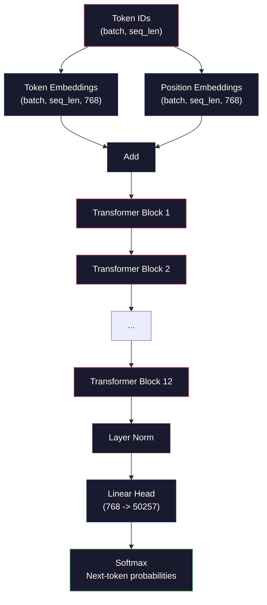
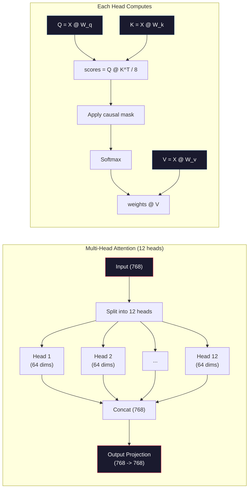
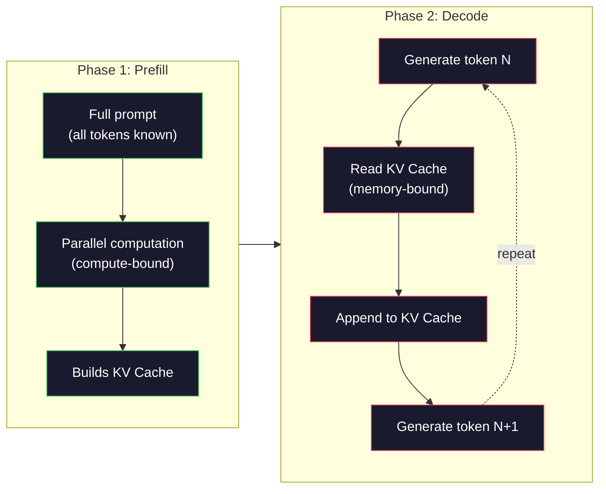

# Tiền huấn luyện một Mini GPT (124 triệu tham số)

> GPT-2 Small có 124 triệu tham số. Đó là 12 lớp transformer, 12 đầu attention (attention heads) và các embedding 768 chiều. Bạn có thể huấn luyện nó từ đầu trên một GPU đơn lẻ trong vài giờ. Hầu hết mọi người không bao giờ làm điều này. Họ sử dụng các checkpoint đã được huấn luyện sẵn. Nhưng nếu bạn không tự huấn luyện một mô hình, bạn sẽ không thực sự hiểu những gì đang diễn ra bên trong mô hình mà bạn đang dùng để xây dựng sản phẩm.

**Type:** Build
**Languages:** Python (với numpy)
**Prerequisites:** Phase 10, Bài 01-03 (Tokenizers, Xây dựng Tokenizer, Data Pipelines)
**Time:** ~120 phút

## Mục tiêu học tập

- Triển khai toàn bộ kiến trúc GPT-2 (124 triệu tham số) từ đầu: token embeddings, positional embeddings, các khối transformer và đầu ra ngôn ngữ (language model head)
- Huấn luyện mô hình GPT trên một tập dữ liệu văn bản bằng cách dự đoán token tiếp theo với hàm mất mát cross-entropy
- Triển khai tạo văn bản tự hồi quy (autoregressive) với lấy mẫu nhiệt độ (temperature sampling) và lọc top-k/top-p
- Theo dõi đường cong mất mát (loss curves) trong quá trình huấn luyện và xác nhận rằng mô hình học được các quy luật ngôn ngữ mạch lạc

## Vấn đề

Bạn biết transformer là gì. Bạn đã đọc các sơ đồ. Bạn có thể đọc thuộc lòng "attention is all you need" và vẽ các ô có nhãn "Multi-Head Attention" trên bảng trắng.

Không điều nào trong số đó có nghĩa là bạn hiểu chuyện gì xảy ra khi một mô hình tạo văn bản.

Có 124.438.272 tham số trong GPT-2 Small (với weight tying). Mỗi tham số trong số đó được thiết lập bằng cách chạy một vòng lặp huấn luyện: forward pass, tính toán loss, backward pass, cập nhật trọng số. Mười hai khối transformer. Mười hai đầu attention mỗi khối. Một không gian embedding 768 chiều. Một từ vựng gồm 50.257 token. Mỗi khi mô hình tạo ra một token, tất cả 124 triệu tham số tham gia vào một chuỗi nhân ma trận duy nhất, lấy một chuỗi các ID token và tạo ra một phân phối xác suất cho token tiếp theo.

Nếu bạn chưa bao giờ tự xây dựng điều này, bạn đang làm việc với một "hộp đen". Bạn có thể sử dụng API. Bạn có thể fine-tune. Nhưng khi có sự cố xảy ra -- khi mô hình bị ảo giác, khi nó lặp lại chính mình, khi nó từ chối làm theo hướng dẫn -- bạn không có mô hình tư duy nào để hiểu *tại sao*.

Bài học này xây dựng GPT-2 Small từ đầu. Không phải bằng PyTorch. Bằng numpy. Mọi phép nhân ma trận đều hiển thị. Mọi gradient đều được tính toán bởi mã nguồn của bạn. Bạn sẽ thấy chính xác cách 124 triệu con số phối hợp với nhau để dự đoán từ tiếp theo.

## Khái niệm

### Kiến trúc GPT

GPT là một mô hình ngôn ngữ tự hồi quy (autoregressive). "Tự hồi quy" có nghĩa là nó tạo ra từng token một, mỗi token được điều kiện hóa dựa trên tất cả các token trước đó. Kiến trúc này là một chồng các khối transformer decoder.

Dưới đây là đồ thị tính toán đầy đủ từ ID token đến xác suất của token tiếp theo:

1. ID token đầu vào. Hình dạng: (batch_size, seq_len).
2. Tra cứu token embedding. Mỗi ID ánh xạ tới một vector 768 chiều. Hình dạng: (batch_size, seq_len, 768).
3. Tra cứu position embedding. Mỗi vị trí (0, 1, 2, ...) ánh xạ tới một vector 768 chiều. Hình dạng tương tự.
4. Cộng token embeddings + position embeddings.
5. Đi qua 12 khối transformer.
6. Chuẩn hóa lớp cuối cùng (Layer normalization).
7. Phép chiếu tuyến tính (Linear projection) tới kích thước từ vựng. Hình dạng: (batch_size, seq_len, vocab_size).
8. Softmax để lấy xác suất.

Đó là toàn bộ mô hình. Không tích chập. Không đệ quy. Chỉ có embeddings, attention, mạng feedforward và layer norms xếp chồng lên nhau 12 lần.



### Khối Transformer

Mỗi khối trong số 12 khối tuân theo cùng một mô hình. Kiến trúc pre-norm (GPT-2 sử dụng pre-norm, không phải post-norm như transformer gốc):

1. LayerNorm
2. Multi-Head Self-Attention
3. Kết nối dư (Residual connection - cộng lại đầu vào)
4. LayerNorm
5. Mạng Feed-Forward (MLP)
6. Kết nối dư (Residual connection - cộng lại đầu vào)

Các kết nối dư là rất quan trọng. Nếu không có chúng, gradient sẽ biến mất trước khi đến được khối 1 trong quá trình lan truyền ngược (backpropagation). Với chúng, gradient có thể chảy trực tiếp từ loss đến bất kỳ lớp nào thông qua đường dẫn "tắt". Đây là lý do tại sao bạn có thể xếp chồng 12, 32 hoặc thậm chí 96 khối (GPT-4 được đồn đại là sử dụng 120).

### Attention: Cơ chế cốt lõi

Self-attention cho phép mỗi token nhìn vào mọi token trước đó và quyết định mức độ chú ý đến từng token. Đây là toán học.

Đối với mỗi vị trí token, tính toán ba vector từ đầu vào:
- **Query (Q)**: "Tôi đang tìm kiếm cái gì?"
- **Key (K)**: "Tôi chứa cái gì?"
- **Value (V)**: "Tôi mang thông tin gì?"

```
Q = input @ W_q    (768 -> 768)
K = input @ W_k    (768 -> 768)
V = input @ W_v    (768 -> 768)

attention_scores = Q @ K^T / sqrt(d_k)
attention_scores = mask(attention_scores)   # causal mask: -inf for future positions
attention_weights = softmax(attention_scores)
output = attention_weights @ V
```

Mặt nạ nhân quả (causal mask) là thứ làm cho GPT trở nên tự hồi quy. Vị trí 5 có thể chú ý đến các vị trí 0-5 nhưng không phải 6, 7, 8, v.v. Điều này ngăn mô hình "gian lận" bằng cách nhìn vào các token tương lai trong quá trình huấn luyện.

**Multi-head attention** chia không gian 768 chiều thành 12 đầu, mỗi đầu 64 chiều. Mỗi đầu học một mô hình chú ý khác nhau. Một đầu có thể theo dõi các mối quan hệ cú pháp (sự hòa hợp chủ ngữ-động từ). Một đầu khác có thể theo dõi sự tương đồng ngữ nghĩa (từ đồng nghĩa). Một đầu khác có thể theo dõi sự gần gũi về vị trí (các từ gần nhau). Đầu ra từ tất cả 12 đầu được nối lại và chiếu ngược về 768 chiều.



Phép chia cho sqrt(d_k) -- sqrt(64) = 8 -- là phép chia tỷ lệ. Nếu không có nó, các tích vô hướng sẽ trở nên lớn đối với các vector nhiều chiều, đẩy softmax vào các vùng mà gradient gần bằng 0. Đây là một trong những hiểu biết quan trọng trong bài báo "Attention Is All You Need" gốc.

### KV Cache: Tại sao suy luận (Inference) lại nhanh

Trong quá trình huấn luyện, bạn xử lý toàn bộ chuỗi cùng một lúc. Trong quá trình suy luận, bạn tạo từng token một. Nếu không tối ưu hóa, việc tạo token N đòi hỏi phải tính toán lại attention cho tất cả N-1 token trước đó. Đó là O(N^2) cho mỗi token được tạo, hoặc O(N^3) tổng cộng cho một chuỗi có độ dài N.

KV Cache giải quyết vấn đề này. Sau khi tính toán K và V cho mỗi token, hãy lưu trữ chúng. Khi tạo token N+1, bạn chỉ cần tính Q cho token mới và tra cứu K và V đã lưu từ tất cả các token trước đó. Điều này giảm chi phí mỗi token từ O(N) xuống O(1) cho việc tính toán K và V. Việc tính toán điểm attention vẫn là O(N) vì bạn chú ý đến tất cả các vị trí trước đó, nhưng bạn tránh được các phép nhân ma trận dư thừa trên đầu vào.

Đối với GPT-2 với 12 lớp và 12 đầu, KV cache lưu trữ 2 (K + V) x 12 lớp x 12 đầu x 64 chiều = 18.432 giá trị mỗi token. Đối với chuỗi 1024 token, đó là khoảng 75MB ở định dạng FP32. Đối với Llama 3 405B với 128 lớp, KV cache cho một chuỗi đơn lẻ có thể vượt quá 10GB. Đây là lý do tại sao suy luận với ngữ cảnh dài bị giới hạn bởi bộ nhớ.

### Prefill vs Decode: Hai giai đoạn suy luận

Khi bạn gửi một prompt đến một LLM, suy luận diễn ra trong hai giai đoạn riêng biệt.

**Prefill** xử lý toàn bộ prompt của bạn song song. Tất cả các token đều đã biết, vì vậy mô hình có thể tính toán attention cho tất cả các vị trí cùng một lúc. Giai đoạn này bị giới hạn bởi tính toán (compute-bound) -- GPU đang thực hiện các phép nhân ma trận với thông lượng tối đa. Đối với một prompt 1000 token trên A100, prefill mất khoảng 20-50ms.

**Decode** tạo các token từng cái một. Mỗi token mới phụ thuộc vào tất cả các token trước đó. Giai đoạn này bị giới hạn bởi bộ nhớ (memory-bound) -- nút thắt cổ chai là việc đọc trọng số mô hình và KV cache từ bộ nhớ GPU, không phải bản thân phép toán ma trận. Các lõi tính toán của GPU hầu như không hoạt động trong khi chờ đọc bộ nhớ. Đối với GPT-2, mỗi bước decode mất khoảng thời gian như nhau bất kể các phép nhân ma trận yêu cầu bao nhiêu FLOPs, vì băng thông bộ nhớ là yếu tố hạn chế.

Sự khác biệt này quan trọng đối với các hệ thống sản xuất. Thông lượng Prefill tỷ lệ thuận với khả năng tính toán của GPU (nhiều FLOPS hơn = prefill nhanh hơn). Thông lượng Decode tỷ lệ thuận với băng thông bộ nhớ (bộ nhớ nhanh hơn = decode nhanh hơn). Đó là lý do tại sao H100 của NVIDIA tập trung vào cải thiện băng thông bộ nhớ so với A100 -- nó trực tiếp tăng tốc độ tạo token.



### Vòng lặp huấn luyện

Huấn luyện một LLM là dự đoán token tiếp theo. Cho các token [0, 1, 2, ..., N-1], dự đoán các token [1, 2, 3, ..., N]. Hàm mất mát là cross-entropy giữa phân phối xác suất dự đoán của mô hình và token tiếp theo thực tế.

Một bước huấn luyện:

1. **Forward pass**: Chạy batch qua tất cả 12 khối. Lấy logits (điểm số trước softmax) cho mỗi vị trí.
2. **Tính toán loss**: Cross-entropy giữa logits và các token mục tiêu (đầu vào dịch chuyển một vị trí).
3. **Backward pass**: Tính toán gradient cho tất cả 124 triệu tham số bằng lan truyền ngược.
4. **Optimizer step**: Cập nhật trọng số. GPT-2 sử dụng Adam với learning rate warmup và cosine decay.

Lịch trình learning rate quan trọng hơn bạn nghĩ. GPT-2 khởi động từ 0 đến learning rate đỉnh trong 2.000 bước đầu tiên, sau đó giảm dần theo đường cong cosine. Bắt đầu với learning rate cao khiến mô hình bị phân kỳ. Giữ tốc độ cao không đổi gây ra dao động trong quá trình huấn luyện sau này. Mô hình warmup-rồi-giảm dần được sử dụng bởi mọi LLM lớn.

### GPT-2 Small: Các con số

| Thành phần | Hình dạng | Tham số |
|-----------|-------|------------|
| Token embeddings | (50257, 768) | 38.597.376 |
| Position embeddings | (1024, 768) | 786.432 |
| Attention mỗi khối (W_q, W_k, W_v, W_out) | 4 x (768, 768) | 2.359.296 |
| FFN mỗi khối (lên + xuống) | (768, 3072) + (3072, 768) | 4.718.592 |
| LayerNorms mỗi khối (2x) | 2 x 768 x 2 | 3.072 |
| LayerNorm cuối cùng | 768 x 2 | 1.536 |
| **Tổng mỗi khối** | | **7.080.960** |
| **Tổng (12 khối)** | | **85.054.464 + 39.383.808 = 124.438.272** |

Phép chiếu đầu ra (logits head) chia sẻ trọng số với ma trận token embedding. Đây được gọi là weight tying -- nó giảm số lượng tham số đi 38 triệu và cải thiện hiệu suất vì nó buộc mô hình sử dụng cùng một không gian biểu diễn cho đầu vào và đầu ra.

## Xây dựng

### Bước 1: Lớp Embedding

Token embeddings ánh xạ mỗi token trong số 50.257 token có thể có tới một vector 768 chiều. Position embeddings thêm thông tin về vị trí của mỗi token trong chuỗi. Hai giá trị này được cộng lại.

```python
import numpy as np

class Embedding:
    def __init__(self, vocab_size, embed_dim, max_seq_len):
        self.token_embed = np.random.randn(vocab_size, embed_dim) * 0.02
        self.pos_embed = np.random.randn(max_seq_len, embed_dim) * 0.02

    def forward(self, token_ids):
        seq_len = token_ids.shape[-1]
        tok_emb = self.token_embed[token_ids]
        pos_emb = self.pos_embed[:seq_len]
        return tok_emb + pos_emb
```

Độ lệch chuẩn 0.02 cho việc khởi tạo đến từ bài báo GPT-2. Nếu quá lớn, các forward pass ban đầu tạo ra các giá trị cực đoan làm mất ổn định quá trình huấn luyện. Nếu quá nhỏ, các đầu ra ban đầu gần như giống hệt nhau cho tất cả các đầu vào, làm cho các tín hiệu gradient sớm trở nên vô dụng.

### Bước 2: Self-Attention với Causal Mask

Attention đơn đầu trước. Causal mask đặt các vị trí tương lai thành âm vô cùng trước softmax, đảm bảo mỗi vị trí chỉ có thể chú ý đến chính nó và các vị trí trước đó.

```python
def attention(Q, K, V, mask=None):
    d_k = Q.shape[-1]
    scores = Q @ K.transpose(0, -1, -2 if Q.ndim == 4 else 1) / np.sqrt(d_k)
    if mask is not None:
        scores = scores + mask
    weights = np.exp(scores - scores.max(axis=-1, keepdims=True))
    weights = weights / weights.sum(axis=-1, keepdims=True)
    return weights @ V
```

Việc triển khai softmax trừ đi giá trị lớn nhất trước khi lũy thừa. Nếu không có điều này, exp(số_lớn) sẽ tràn thành vô cùng. Đây là một thủ thuật ổn định số học không làm thay đổi đầu ra vì softmax(x - c) = softmax(x) với bất kỳ hằng số c nào.

### Bước 3: Multi-Head Attention

Chia đầu vào 768 chiều thành 12 đầu, mỗi đầu 64 chiều. Mỗi đầu tính toán attention độc lập. Nối các kết quả lại và chiếu ngược về 768 chiều.

```python
class MultiHeadAttention:
    def __init__(self, embed_dim, num_heads):
        self.num_heads = num_heads
        self.head_dim = embed_dim // num_heads
        self.W_q = np.random.randn(embed_dim, embed_dim) * 0.02
        self.W_k = np.random.randn(embed_dim, embed_dim) * 0.02
        self.W_v = np.random.randn(embed_dim, embed_dim) * 0.02
        self.W_out = np.random.randn(embed_dim, embed_dim) * 0.02

    def forward(self, x, mask=None):
        batch, seq_len, d = x.shape
        Q = (x @ self.W_q).reshape(batch, seq_len, self.num_heads, self.head_dim).transpose(0, 2, 1, 3)
        K = (x @ self.W_k).reshape(batch, seq_len, self.num_heads, self.head_dim).transpose(0, 2, 1, 3)
        V = (x @ self.W_v).reshape(batch, seq_len, self.num_heads, self.head_dim).transpose(0, 2, 1, 3)

        scores = Q @ K.transpose(0, 1, 3, 2) / np.sqrt(self.head_dim)
        if mask is not None:
            scores = scores + mask
        weights = np.exp(scores - scores.max(axis=-1, keepdims=True))
        weights = weights / weights.sum(axis=-1, keepdims=True)
        attn_out = weights @ V

        attn_out = attn_out.transpose(0, 2, 1, 3).reshape(batch, seq_len, d)
        return attn_out @ self.W_out
```

Vũ điệu reshape-transpose-reshape là phần khó hiểu nhất của multi-head attention. Đây là những gì xảy ra: tensor (batch, seq_len, 768) trở thành (batch, seq_len, 12, 64), sau đó là (batch, 12, seq_len, 64). Bây giờ mỗi đầu trong số 12 đầu có ma trận (seq_len, 64) riêng để chạy attention. Sau attention, chúng ta đảo ngược quá trình: (batch, 12, seq_len, 64) trở thành (batch, seq_len, 12, 64) trở thành (batch, seq_len, 768).

### Bước 4: Khối Transformer

Một khối transformer hoàn chỉnh: LayerNorm, multi-head attention với residual, LayerNorm, feedforward với residual.

```python
class LayerNorm:
    def __init__(self, dim, eps=1e-5):
        self.gamma = np.ones(dim)
        self.beta = np.zeros(dim)
        self.eps = eps

    def forward(self, x):
        mean = x.mean(axis=-1, keepdims=True)
        var = x.var(axis=-1, keepdims=True)
        return self.gamma * (x - mean) / np.sqrt(var + self.eps) + self.beta


class FeedForward:
    def __init__(self, embed_dim, ff_dim):
        self.W1 = np.random.randn(embed_dim, ff_dim) * 0.02
        self.b1 = np.zeros(ff_dim)
        self.W2 = np.random.randn(ff_dim, embed_dim) * 0.02
        self.b2 = np.zeros(embed_dim)

    def forward(self, x):
        h = x @ self.W1 + self.b1
        h = np.maximum(0, h)  # GELU approximation: ReLU for simplicity
        return h @ self.W2 + self.b2


class TransformerBlock:
    def __init__(self, embed_dim, num_heads, ff_dim):
        self.ln1 = LayerNorm(embed_dim)
        self.attn = MultiHeadAttention(embed_dim, num_heads)
        self.ln2 = LayerNorm(embed_dim)
        self.ffn = FeedForward(embed_dim, ff_dim)

    def forward(self, x, mask=None):
        x = x + self.attn.forward(self.ln1.forward(x), mask)
        x = x + self.ffn.forward(self.ln2.forward(x))
        return x
```

Mạng feedforward mở rộng đầu vào 768 chiều lên 3.072 chiều (4x), áp dụng phi tuyến tính, sau đó chiếu ngược về 768. Mô hình mở rộng-co lại này cung cấp cho mô hình một biểu diễn nội bộ "rộng hơn" để làm việc tại mỗi vị trí. GPT-2 sử dụng kích hoạt GELU, nhưng chúng ta sử dụng ReLU ở đây cho đơn giản -- sự khác biệt là nhỏ đối với việc hiểu kiến trúc.

### Bước 5: Mô hình GPT đầy đủ

Xếp chồng 12 khối transformer. Thêm lớp embedding ở phía trước và phép chiếu đầu ra ở phía sau.

```python
class MiniGPT:
    def __init__(self, vocab_size=50257, embed_dim=768, num_heads=12,
                 num_layers=12, max_seq_len=1024, ff_dim=3072):
        self.embedding = Embedding(vocab_size, embed_dim, max_seq_len)
        self.blocks = [
            TransformerBlock(embed_dim, num_heads, ff_dim)
            for _ in range(num_layers)
        ]
        self.ln_f = LayerNorm(embed_dim)
        self.vocab_size = vocab_size
        self.embed_dim = embed_dim

    def forward(self, token_ids):
        seq_len = token_ids.shape[-1]
        mask = np.triu(np.full((seq_len, seq_len), -1e9), k=1)

        x = self.embedding.forward(token_ids)
        for block in self.blocks:
            x = block.forward(x, mask)
        x = self.ln_f.forward(x)

        logits = x @ self.embedding.token_embed.T
        return logits

    def count_parameters(self):
        total = 0
        total += self.embedding.token_embed.size
        total += self.embedding.pos_embed.size
        for block in self.blocks:
            total += block.attn.W_q.size + block.attn.W_k.size
            total += block.attn.W_v.size + block.attn.W_out.size
            total += block.ffn.W1.size + block.ffn.b1.size
            total += block.ffn.W2.size + block.ffn.b2.size
            total += block.ln1.gamma.size + block.ln1.beta.size
            total += block.ln2.gamma.size + block.ln2.beta.size
        total += self.ln_f.gamma.size + self.ln_f.beta.size
        return total
```

Lưu ý weight tying: `logits = x @ self.embedding.token_embed.T`. Phép chiếu đầu ra tái sử dụng ma trận token embedding (đã chuyển vị). Đây không chỉ là một thủ thuật tiết kiệm tham số. Nó có nghĩa là mô hình sử dụng cùng một không gian vector để hiểu các token (embeddings) và dự đoán chúng (đầu ra).

### Bước 6: Vòng lặp huấn luyện

Đối với một lần huấn luyện thực tế trên 124 triệu tham số, bạn sẽ cần GPU và PyTorch. Vòng lặp huấn luyện này minh họa các cơ chế trên một mô hình nhỏ chạy bằng numpy thuần túy. Chúng ta sử dụng một mô hình nhỏ (4 lớp, 4 đầu, 128 chiều) để làm cho nó có thể thực hiện được.

```python
def cross_entropy_loss(logits, targets):
    batch, seq_len, vocab_size = logits.shape
    logits_flat = logits.reshape(-1, vocab_size)
    targets_flat = targets.reshape(-1)

    max_logits = logits_flat.max(axis=-1, keepdims=True)
    log_softmax = logits_flat - max_logits - np.log(
        np.exp(logits_flat - max_logits).sum(axis=-1, keepdims=True)
    )

    loss = -log_softmax[np.arange(len(targets_flat)), targets_flat].mean()
    return loss


def train_mini_gpt(text, vocab_size=256, embed_dim=128, num_heads=4,
                   num_layers=4, seq_len=64, num_steps=200, lr=3e-4):
    tokens = np.array(list(text.encode("utf-8")[:2048]))
    model = MiniGPT(
        vocab_size=vocab_size, embed_dim=embed_dim, num_heads=num_heads,
        num_layers=num_layers, max_seq_len=seq_len, ff_dim=embed_dim * 4
    )

    print(f"Model parameters: {model.count_parameters():,}")
    print(f"Training tokens: {len(tokens):,}")
    print(f"Config: {num_layers} layers, {num_heads} heads, {embed_dim} dims")
    print()

    for step in range(num_steps):
        start_idx = np.random.randint(0, max(1, len(tokens) - seq_len - 1))
        batch_tokens = tokens[start_idx:start_idx + seq_len + 1]

        input_ids = batch_tokens[:-1].reshape(1, -1)
        target_ids = batch_tokens[1:].reshape(1, -1)

        logits = model.forward(input_ids)
        loss = cross_entropy_loss(logits, target_ids)

        if step % 20 == 0:
            print(f"Step {step:4d} | Loss: {loss:.4f}")

    return model
```

Loss bắt đầu gần ln(vocab_size) -- đối với từ vựng byte-level 256 token, đó là ln(256) = 5.55. Một mô hình ngẫu nhiên gán xác suất bằng nhau cho mọi token. Khi quá trình huấn luyện tiến triển, loss giảm vì mô hình học cách dự đoán các mẫu phổ biến: "th" sau "t", khoảng trắng sau dấu chấm, v.v.

Trong sản xuất, bạn sẽ sử dụng trình tối ưu hóa Adam với tích lũy gradient, warmup learning rate và cắt gradient (gradient clipping). Vòng lặp forward-pass-loss-backward-update là giống hệt nhau. Trình tối ưu hóa phức tạp hơn.

### Bước 7: Tạo văn bản

Việc tạo văn bản sử dụng mô hình đã huấn luyện để dự đoán từng token một. Mỗi dự đoán được lấy mẫu từ phân phối đầu ra (hoặc lấy tham lam dưới dạng argmax).

```python
def generate(model, prompt_tokens, max_new_tokens=100, temperature=0.8):
    tokens = list(prompt_tokens)
    seq_len = model.embedding.pos_embed.shape[0]

    for _ in range(max_new_tokens):
        context = np.array(tokens[-seq_len:]).reshape(1, -1)
        logits = model.forward(context)
        next_logits = logits[0, -1, :]

        next_logits = next_logits / temperature
        probs = np.exp(next_logits - next_logits.max())
        probs = probs / probs.sum()

        next_token = np.random.choice(len(probs), p=probs)
        tokens.append(next_token)

    return tokens
```

Nhiệt độ (Temperature) kiểm soát tính ngẫu nhiên. Nhiệt độ 1.0 sử dụng phân phối thô. Nhiệt độ 0.5 làm sắc nét nó (quyết định hơn -- mô hình chọn các lựa chọn hàng đầu của nó thường xuyên hơn). Nhiệt độ 1.5 làm phẳng nó (ngẫu nhiên hơn -- các token xác suất thấp có cơ hội lớn hơn). Nhiệt độ 0.0 là giải mã tham lam (luôn chọn token có xác suất cao nhất).

Cửa sổ `tokens[-seq_len:]` là cần thiết vì mô hình có độ dài ngữ cảnh tối đa (1024 cho GPT-2). Khi bạn vượt quá nó, bạn phải loại bỏ các token cũ nhất. Đây là "cửa sổ ngữ cảnh" mà mọi người thường nói đến.

```figure
sampling-decoder
```

## Sử dụng

### Demo huấn luyện và tạo văn bản đầy đủ

```python
corpus = """The transformer architecture has revolutionized natural language processing.
Attention mechanisms allow the model to focus on relevant parts of the input.
Self-attention computes relationships between all pairs of positions in a sequence.
Multi-head attention splits the representation into multiple subspaces.
Each attention head can learn different types of relationships.
The feedforward network provides nonlinear transformations at each position.
Residual connections enable gradient flow through deep networks.
Layer normalization stabilizes training by normalizing activations.
Position embeddings give the model information about token ordering.
The causal mask ensures autoregressive generation during training.
Pre-training on large text corpora teaches the model general language understanding.
Fine-tuning adapts the pre-trained model to specific downstream tasks."""

model = train_mini_gpt(corpus, num_steps=200)

prompt = list("The transformer".encode("utf-8"))
output_tokens = generate(model, prompt, max_new_tokens=100, temperature=0.8)
generated_text = bytes(output_tokens).decode("utf-8", errors="replace")
print(f"\nGenerated: {generated_text}")
```

Trên một tập dữ liệu nhỏ với một mô hình nhỏ, văn bản được tạo ra sẽ chỉ mạch lạc ở mức độ trung bình. Nó sẽ học được một số mẫu byte-level từ văn bản huấn luyện nhưng không thể khái quát hóa theo cách GPT-2 làm với 40GB dữ liệu huấn luyện và kiến trúc 124 triệu tham số đầy đủ. Điểm quan trọng không phải là chất lượng đầu ra. Điểm quan trọng là bạn có thể theo dõi từng bước: tra cứu embedding, tính toán attention, biến đổi feedforward, chiếu logit, softmax và lấy mẫu. Mọi thao tác đều hiển thị.

## Triển khai

Bài học này tạo ra `outputs/prompt-gpt-architecture-analyzer.md` -- một prompt phân tích các lựa chọn kiến trúc trong bất kỳ mô hình kiểu GPT nào. Cung cấp cho nó một thẻ mô hình (model card) hoặc báo cáo kỹ thuật và nó sẽ phân tích việc phân bổ tham số, thiết kế attention và các quyết định mở rộng.

## Bài tập

1. Sửa đổi mô hình để sử dụng 24 lớp và 16 đầu thay vì 12/12. Đếm các tham số. Việc tăng gấp đôi độ sâu so với tăng gấp đôi chiều rộng (kích thước embedding) như thế nào?

2. Triển khai hàm kích hoạt GELU (GELU(x) = x * 0.5 * (1 + erf(x / sqrt(2)))) và thay thế ReLU trong mạng feedforward. Chạy huấn luyện trong 500 bước với mỗi hàm kích hoạt và so sánh loss cuối cùng.

3. Thêm KV cache vào hàm tạo. Lưu trữ các tensor K và V cho mỗi lớp sau lần forward pass đầu tiên và tái sử dụng chúng cho các token tiếp theo. Đo lường tốc độ tăng tốc: tạo 200 token có và không có cache và so sánh thời gian thực tế.

4. Triển khai lấy mẫu top-k (chỉ xem xét k token có xác suất cao nhất) và lấy mẫu top-p (lấy mẫu hạt nhân: xem xét tập hợp nhỏ nhất các token có xác suất tích lũy vượt quá p). So sánh chất lượng đầu ra ở nhiệt độ 0.8 với top-k=50 so với top-p=0.95.

5. Xây dựng trình vẽ đường cong mất mát huấn luyện. Huấn luyện mô hình trong 1000 bước và vẽ loss theo bước. Xác định ba giai đoạn: giảm nhanh ban đầu (học các byte phổ biến), giai đoạn giữa chậm hơn (học các mẫu byte) và bình nguyên (quá khớp trên tập dữ liệu nhỏ). Hình dạng của đường cong này là giống nhau cho dù bạn đang huấn luyện mô hình 128 chiều hay GPT-4.

## Thuật ngữ chính

| Thuật ngữ | Mọi người nói | Ý nghĩa thực sự |
|------|----------------|----------------------|
| Autoregressive | "Nó tạo từng từ một" | Mỗi token đầu ra được điều kiện hóa trên tất cả các token trước đó -- mô hình dự đoán P(token_n \| token_0, ..., token_{n-1}) |
| Causal mask | "Nó không thể nhìn thấy tương lai" | Một ma trận tam giác trên với các giá trị âm vô cùng ngăn cản sự chú ý đến các vị trí tương lai trong quá trình huấn luyện |
| Multi-head attention | "Nhiều mô hình chú ý" | Chia Q, K, V thành các đầu song song (ví dụ: 12 đầu, mỗi đầu 64 chiều cho GPT-2) để mỗi đầu có thể học các loại mối quan hệ khác nhau |
| KV Cache | "Caching để tăng tốc" | Lưu trữ các tensor Key và Value đã tính toán từ các token trước đó để tránh tính toán dư thừa trong quá trình tạo tự hồi quy |
| Prefill | "Xử lý prompt" | Giai đoạn suy luận đầu tiên nơi tất cả các token prompt được xử lý song song -- bị giới hạn bởi tính toán trên GPU FLOPS |
| Decode | "Tạo token" | Giai đoạn suy luận thứ hai nơi các token được tạo từng cái một -- bị giới hạn bởi bộ nhớ trên băng thông GPU |
| Weight tying | "Chia sẻ embeddings" | Sử dụng cùng một ma trận cho token embeddings đầu vào và đầu chiếu đầu ra -- tiết kiệm 38 triệu tham số trong GPT-2 |
| Residual connection | "Kết nối tắt" | Cộng trực tiếp đầu vào vào đầu ra của một lớp con (x + sublayer(x)) -- cho phép dòng gradient trong các mạng sâu |
| Layer normalization | "Chuẩn hóa các kích hoạt" | Chuẩn hóa trên chiều đặc trưng về trung bình 0 và phương sai 1, với các tham số tỷ lệ và độ lệch có thể học được |
| Cross-entropy loss | "Dự đoán sai bao nhiêu" | -log(xác suất được gán cho token tiếp theo đúng), trung bình trên tất cả các vị trí -- mục tiêu huấn luyện LLM tiêu chuẩn |

## Đọc thêm

- [Radford et al., 2019 -- "Language Models are Unsupervised Multitask Learners" (GPT-2)](https://cdn.openai.com/better-language-models/language_models_are_unsupervised_multitask_learners.pdf) -- bài báo GPT-2 giới thiệu dòng mô hình từ 124 triệu đến 1,5 tỷ tham số
- [Vaswani et al., 2017 -- "Attention Is All You Need"](https://arxiv.org/abs/1706.03762) -- bài báo transformer gốc với scaled dot-product attention và multi-head attention
- [Llama 3 Technical Report](https://arxiv.org/abs/2407.21783) -- cách Meta mở rộng kiến trúc GPT lên 405 tỷ tham số với 16K GPU
- [Pope et al., 2022 -- "Efficiently Scaling Transformer Inference"](https://arxiv.org/abs/2211.05102) -- bài báo chính thức hóa phân tích prefill vs decode và KV cache