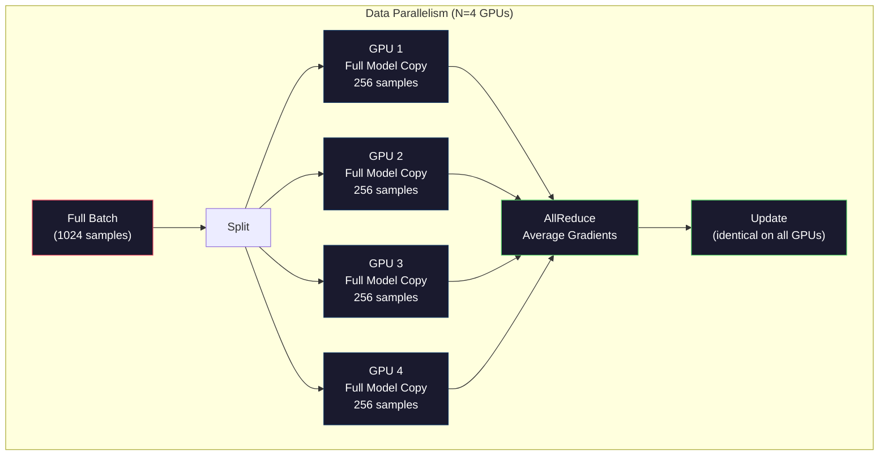
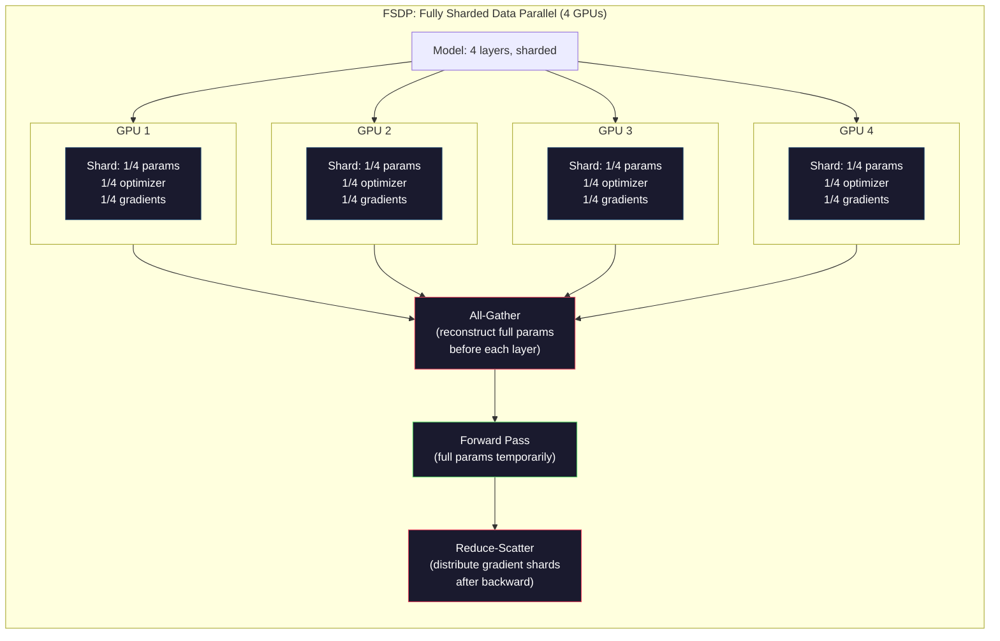
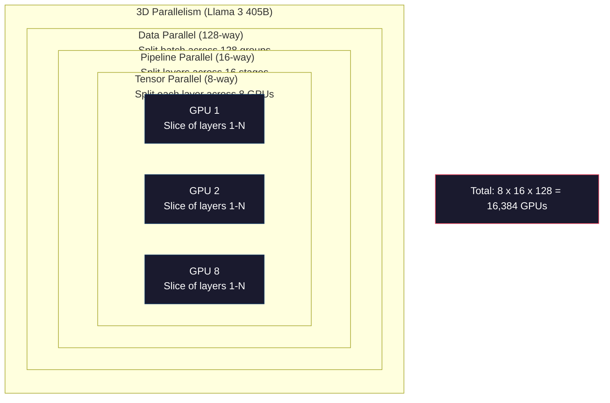

# Scaling: Distributed Training, FSDP, DeepSpeed

> Mô hình 124M của bạn đã được huấn luyện trên một GPU. Bây giờ hãy thử với 7 tỷ tham số. Mô hình không vừa với bộ nhớ. Dữ liệu mất hàng tuần trên một máy đơn lẻ. Huấn luyện phân tán không phải là tùy chọn ở quy mô lớn. Đó là con đường duy nhất để tiến về phía trước.

**Type:** Build
**Languages:** Python
**Prerequisites:** Phase 10, Lesson 04 (Pre-Training a Mini GPT)
**Time:** ~120 phút

## Mục tiêu học tập

- Giải thích ba loại song song hóa (data, tensor, pipeline) và khi nào cần sử dụng từng loại dựa trên kích thước mô hình và cụm máy chủ (cluster)
- Triển khai huấn luyện song song dữ liệu (data-parallel) sử dụng PyTorch DDP với đồng bộ hóa gradient trên nhiều GPU
- Tính toán ngân sách bộ nhớ cho một kích thước mô hình nhất định (weights + optimizer states + gradients + activations) để xác định phần cứng tối thiểu
- Cấu hình FSDP hoặc các giai đoạn ZeRO của DeepSpeed để phân mảnh (shard) trạng thái mô hình trên các GPU và chạy các mô hình vượt quá bộ nhớ của một GPU đơn lẻ

## Vấn đề

Một mô hình 7B tham số ở định dạng FP16 cần 14GB chỉ riêng cho các trọng số (weights). Bộ tối ưu hóa Adam lưu trữ thêm hai bản sao của mỗi tham số (ước tính moment bậc nhất và bậc hai). Đó là thêm 28GB nữa. Các gradient trong quá trình lan truyền ngược (backpropagation) cộng thêm 14GB nữa. Bạn đã đạt mức 56GB trước khi một activation nào được lưu trữ.

Một NVIDIA A100 có 80GB bộ nhớ.

56GB trên tổng số 80GB đã bị tiêu thụ. Điều đó để lại 24GB cho các activation -- các giá trị trung gian được tính toán trong quá trình lan truyền xuôi (forward pass) cần được giữ lại cho lan truyền ngược. Đối với chuỗi 2048 token với mô hình 4096 chiều, các activation của một lớp đơn lẻ sử dụng khoảng 64MB. Với 32 lớp, bạn cần 2GB cho mỗi mẫu. Batch size là 8 yêu cầu 16GB. Bạn có 24GB. Batch size là 12 sẽ gây tràn bộ nhớ.

Bây giờ hãy thử với 70B tham số. Chỉ riêng trọng số: 140GB ở định dạng FP16. Không thể vừa trên một GPU. Bạn cần ít nhất 2 card A100 (2 x 80GB = 160GB) chỉ để chứa trọng số. Thêm trạng thái bộ tối ưu hóa và gradient, bạn cần nhiều hơn thế: tối thiểu 3+ GPU, và thực tế là 8-16 tùy thuộc vào chiến lược phân mảnh.

Llama 3 405B được huấn luyện trên 16.384 GPU NVIDIA H100. Quá trình huấn luyện tiêu tốn ước tính $100 million in compute. DeepSeek V3 trained a comparable model for roughly $5,6 triệu đô la nhờ sự thông minh trong kiến trúc (Mixture of Experts nghĩa là chỉ một phần nhỏ tham số được kích hoạt trên mỗi token) và hiệu quả huấn luyện.

Bài học này bao gồm bốn chiến lược giúp việc huấn luyện quy mô lớn trở nên khả thi: song song dữ liệu (data parallelism), song song tensor (tensor parallelism), song song pipeline (pipeline parallelism) và song song dữ liệu phân mảnh hoàn toàn (fully sharded data parallelism). Bạn sẽ mô phỏng từng chiến lược bằng Python thuần túy để hiểu cơ chế trước khi chạm vào bất kỳ framework huấn luyện phân tán nào.

## Khái niệm

### Tại sao cần phân tán?

Dưới đây là toán học về bộ nhớ cho các mô hình thực tế. Mọi con số đều được tính toán, không phải ước tính.

| Mô hình | Tham số | Trọng số (FP16) | Trạng thái Adam | Gradient (FP16) | Tổng (không tính activation) |
|-------|--------|----------------|-------------|------------------|----------------------|
| GPT-2 Small | 124M | 248 MB | 992 MB | 248 MB | 1,5 GB |
| Llama 3 8B | 8B | 16 GB | 64 GB | 16 GB | 96 GB |
| Llama 3 70B | 70B | 140 GB | 560 GB | 140 GB | 840 GB |
| Llama 3 405B | 405B | 810 GB | 3.240 GB | 810 GB | 4.860 GB |

Cột "Trạng thái Adam" là yếu tố gây chết người. Adam lưu trữ giá trị trung bình (m) và phương sai (v) cho mỗi tham số, cả hai đều ở định dạng FP32. Đối với mô hình 70B, đó là 70B x 4 byte x 2 = 560GB. Chỉ riêng bộ tối ưu hóa đã cần bảy card A100.

Một card H100 có 80GB. Llama 3 405B cần ít nhất 61 card H100 để chứa trọng số, bộ tối ưu hóa và gradient. Thêm các activation và con số này còn tăng lên nữa. Meta đã sử dụng 16.384 GPU không phải vì họ muốn -- mà vì họ buộc phải làm vậy.

### Data Parallelism (Song song dữ liệu)

Chiến lược phân tán đơn giản nhất. Sao chép toàn bộ mô hình sang N GPU. Chia mỗi batch huấn luyện thành N phần bằng nhau. Mỗi GPU chạy một lượt lan truyền xuôi và ngược trên phần dữ liệu của nó. Sau lượt lan truyền ngược, tính trung bình các gradient trên tất cả các GPU. Mỗi GPU cập nhật bản sao trọng số của nó với cùng các gradient đã được tính trung bình, giữ cho tất cả các bản sao đồng bộ.

**Ưu điểm:** Thông lượng tăng tuyến tính. N GPU xử lý lượng dữ liệu gấp N lần mỗi bước. Giao tiếp chỉ giới hạn ở việc tính trung bình gradient, vốn có thể chồng lấp với tính toán.

**Nhược điểm:** Mỗi GPU giữ một bản sao hoàn chỉnh của mô hình, trạng thái bộ tối ưu hóa và gradient. Đối với mô hình 70B, mỗi GPU cần 840GB. Data parallelism không giúp giảm bộ nhớ trên mỗi GPU. Nó chỉ giảm thời gian huấn luyện.

**Toán học:** Batch size hiệu dụng = batch_size_trên_mỗi_gpu x N. Với N=64 GPU và batch trên mỗi GPU là 16, batch hiệu dụng là 1.024. Llama 3 đã sử dụng batch size hiệu dụng là 16 triệu token mỗi bước.



### Tensor Parallelism (Song song Tensor)

Chia các lớp riêng lẻ trên các GPU. Một phép nhân ma trận đơn lẻ được chia nhỏ giữa các GPU, mỗi GPU tính toán một phần của kết quả.

Hãy xem xét ma trận trọng số có hình dạng (8192, 8192) trong một lớp feedforward. Với tensor parallelism 4 chiều, mỗi GPU giữ một phân mảnh (8192, 2048). Mỗi GPU nhân đầu vào với phân mảnh của nó, tạo ra một kết quả một phần. Các kết quả một phần được kết hợp (thông qua all-reduce hoặc all-gather) để tạo ra đầu ra đầy đủ.

**Ưu điểm:** Giảm bộ nhớ trên mỗi GPU cho trọng số mô hình. Một mô hình 70B chia trên 8 GPU nghĩa là mỗi GPU giữ khoảng 8,75B tham số trọng số.

**Nhược điểm:** Yêu cầu giao tiếp liên GPU tốc độ cao sau mỗi lớp. Phép all-reduce sau mỗi phép nhân ma trận làm tăng độ trễ. Điều này hoạt động tốt với NVLink (900 GB/s giữa các GPU trên cùng một node) nhưng kém hiệu quả giữa các node kết nối qua InfiniBand (400 Gb/s, khoảng 50 GB/s). Tensor parallelism hầu như luôn giới hạn trong một node đơn lẻ (8 GPU).

**Sử dụng thực tế:** Megatron-LM tiên phong trong tensor parallelism. Llama 3 405B sử dụng tensor parallelism 8 chiều trong mỗi node.

### Pipeline Parallelism (Song song Pipeline)

Chia mô hình theo các lớp. GPU 1 chạy các lớp 1-8. GPU 2 chạy các lớp 9-16. GPU 3 chạy các lớp 17-24. GPU 4 chạy các lớp 25-32. Dữ liệu chảy qua pipeline: GPU 1 tính toán các lớp của nó và gửi activation đến GPU 2, GPU 2 tính toán các lớp của nó và gửi đến GPU 3, v.v.

**Ưu điểm:** Giao tiếp tối thiểu giữa các GPU -- chỉ là các activation tại ranh giới các lớp, vốn nhỏ so với gradient hoặc trọng số. Hoạt động tốt giữa các node vì yêu cầu băng thông thấp.

**Nhược điểm:** Pipeline bubbles (bong bóng pipeline). Khi GPU 4 đang tính toán lan truyền xuôi trên micro-batch 1, các GPU 1, 2 và 3 đang nhàn rỗi (chúng đã chuyển tiếp phần của mình). Trong quá trình lan truyền ngược, mô hình đảo ngược. Với pipelining ngây thơ, hiệu suất sử dụng GPU chỉ là 1/N cho N giai đoạn pipeline.

**GPipe và PipeDream** giải quyết vấn đề bong bóng bằng cách chia batch thành các micro-batch. GPU 1 bắt đầu micro-batch 2 ngay khi nó hoàn thành chuyển tiếp micro-batch 1. Điều này chồng lấp tính toán giữa các giai đoạn pipeline. Với M micro-batch và N giai đoạn, tỷ lệ bong bóng giảm xuống (N-1)/M. Sử dụng M=16 micro-batch với N=4 giai đoạn, bong bóng là 3/16 = 18,75% thời gian nhàn rỗi.

### FSDP: Fully Sharded Data Parallel

FSDP kết hợp khả năng mở rộng của data parallelism với hiệu quả bộ nhớ của việc phân mảnh. Thay vì mỗi GPU giữ một bản sao hoàn chỉnh của mô hình, mỗi GPU chỉ giữ 1/N tham số, gradient và trạng thái bộ tối ưu hóa.

Trước lượt lan truyền xuôi của một lớp, FSDP chạy một lệnh **all-gather** để thu thập đầy đủ các tham số từ tất cả các GPU vào bộ nhớ của mỗi GPU. Sau lượt lan truyền xuôi, mỗi GPU loại bỏ các tham số không thuộc về nó. Trong quá trình lan truyền ngược, all-gather chạy lại để tái tạo tham số cho việc tính toán gradient. Sau lượt lan truyền ngược, một lệnh **reduce-scatter** phân phối các phân mảnh gradient để mỗi GPU chỉ lưu trữ 1/N gradient.

**Toán học cho mô hình 70B trên 8 GPU:**

| Thành phần | Không có FSDP | Với FSDP |
|-----------|-------------|-----------|
| Trọng số (FP16) | 140 GB mỗi GPU | 17,5 GB mỗi GPU |
| Trạng thái Adam (FP32) | 560 GB mỗi GPU | 70 GB mỗi GPU |
| Gradient (FP16) | 140 GB mỗi GPU | 17,5 GB mỗi GPU |
| **Tổng** | **840 GB mỗi GPU** | **105 GB mỗi GPU** |

Nếu không có FSDP, bạn không thể chứa mô hình 70B trên một GPU 80GB đơn lẻ. Với FSDP trên 8 GPU, mỗi GPU sử dụng 105GB -- khoan đã, vẫn không vừa. Bạn cần ít nhất 16 GPU để giảm xuống dưới 80GB mỗi GPU, hoặc bạn kết hợp FSDP với activation checkpointing (tính toán lại các activation trong quá trình lan truyền ngược thay vì lưu trữ chúng).

Chi phí giao tiếp cao hơn so với data parallelism thông thường do lệnh all-gather trước mỗi lớp. Nhưng việc tiết kiệm bộ nhớ làm cho các quá trình huấn luyện vốn không thể thực hiện được trở nên khả thi.



### DeepSpeed ZeRO

ZeRO (Zero Redundancy Optimizer) của DeepSpeed có khái niệm giống hệt FSDP nhưng được phát triển độc lập bởi Microsoft. Nó định nghĩa ba giai đoạn, mỗi giai đoạn phân mảnh mạnh mẽ hơn:

| Giai đoạn | Phân mảnh | Tiết kiệm bộ nhớ | Giao tiếp |
|-------|--------|---------------|---------------|
| ZeRO-1 | Chỉ trạng thái bộ tối ưu hóa | Giảm ~4x | Giống data parallel |
| ZeRO-2 | + Gradient | Giảm ~8x | Nhiều hơn một chút |
| ZeRO-3 | + Tham số | Giảm ~Nx (N GPU) | All-gather mỗi lớp |

ZeRO-3 tương đương với FSDP. Tên gọi khác nhau, cơ chế giống nhau. PyTorch đã thêm FSDP như một triển khai gốc sau khi DeepSpeed chứng minh được khái niệm này.

DeepSpeed cũng giới thiệu ZeRO-Offload (chuyển trạng thái bộ tối ưu hóa sang RAM CPU, vốn rẻ và lớn hơn) và ZeRO-Infinity (chuyển sang NVMe SSD). Những kỹ thuật này đánh đổi tốc độ tính toán lấy dung lượng bộ nhớ -- các thao tác được chuyển ra ngoài sẽ chậm hơn nhưng giải phóng bộ nhớ GPU.

### Huấn luyện Mixed Precision (Độ chính xác hỗn hợp)

Huấn luyện hiện đại sử dụng đồng thời nhiều định dạng dấu phẩy động:

- **Lan truyền xuôi**: FP16 hoặc BF16 (16-bit). Một nửa bộ nhớ so với FP32. Các phép nhân ma trận chạy nhanh gấp 2 lần trên các nhân tensor.
- **Trọng số chính (Master weights)**: FP32 (32-bit). Được duy trì bởi bộ tối ưu hóa để đảm bảo độ chính xác số học trong quá trình cập nhật trọng số.
- **Loss scaling**: Nhân loss với một hằng số lớn trước khi lan truyền ngược để ngăn gradient FP16 bị tràn xuống 0 (underflow). Chia cho cùng hằng số đó trước bước cập nhật của bộ tối ưu hóa.

BF16 (Brain Float 16) có cùng phạm vi số mũ như FP32 (8 bit số mũ) nhưng giảm độ chính xác (7 bit định trị so với 23 bit của FP32). Nó hiếm khi cần loss scaling vì nó có thể biểu diễn cùng phạm vi giá trị. FP16 có 5 bit số mũ và 10 bit định trị -- nó có thể biểu diễn các giá trị chi tiết nhưng bị tràn/tràn xuống ở các mức độ lớn.

TPU của Google sử dụng BF16 nguyên bản. A100 và H100 của NVIDIA hỗ trợ cả FP16 và BF16. Ngành công nghiệp phần lớn đã chuyển sang BF16 vì nó loại bỏ các rắc rối về loss scaling.

**So sánh bộ nhớ cho mô hình 7B:**

| Độ chính xác | Trọng số | Bộ tối ưu hóa | Gradient | Tổng |
|-----------|---------|-----------|-----------|-------|
| FP32 toàn bộ | 28 GB | 56 GB | 28 GB | 112 GB |
| Hỗn hợp (BF16 + FP32 master) | 14 GB | 56 GB | 14 GB | 84 GB |

Mixed precision tiết kiệm 28GB trên mô hình này. Trạng thái bộ tối ưu hóa vẫn ở định dạng FP32 bất kể thế nào -- đây là nơi tiêu tốn bộ nhớ nhiều nhất.

### Megatron-LM và 3D Parallelism

Huấn luyện quy mô lớn thực tế kết hợp cả ba loại song song:

- **Data parallelism** giữa các nhóm node (mở rộng batch size)
- **Tensor parallelism** trong một node (chia các lớp trên 8 GPU)
- **Pipeline parallelism** giữa các node (chia các nhóm lớp giữa các máy)

Llama 3 405B trên 16.384 H100:
- Tensor parallelism 8 chiều trong mỗi node (8 GPU mỗi node)
- Pipeline parallelism 16 chiều giữa các node (16 giai đoạn pipeline)
- Data parallelism 128 chiều trên chiều còn lại (16.384 / 8 / 16 = 128)

Sự phân tách 3D này (8 x 16 x 128 = 16.384) là cách bạn mở rộng lên hàng nghìn GPU. Mỗi GPU nhìn thấy một phân mảnh dữ liệu khác nhau (data parallel), giữ một lát cắt của mỗi lớp (tensor parallel) và tính toán một tập hợp các lớp khác nhau (pipeline parallel).

DeepSeek V3 đã thực hiện một cách tiếp cận khác. Kiến trúc Mixture of Experts của họ chỉ kích hoạt 37B trong số 671B tham số trên mỗi token. Điều này có nghĩa là mỗi GPU chỉ cần tính toán (và lưu trữ activation cho) các tham số đang hoạt động. Họ đã huấn luyện trên 2.048 GPU H800 -- ít hơn 1/8 số lượng GPU của Meta -- với chi phí $5.6M vs Meta's estimated $100 triệu đô la.



```figure
paged-kv-cache
```

## Xây dựng

### Bước 1: Mô phỏng Data Parallelism

Chia một batch trên các GPU mô phỏng. Mỗi GPU tính toán một lượt lan truyền xuôi trên phân mảnh của nó. Tính trung bình các "gradient" (chúng ta mô phỏng chúng dưới dạng các giá trị loss).

```python
import numpy as np

def simulate_data_parallelism(data, num_gpus, model_fn):
    batch_size = len(data)
    shard_size = batch_size // num_gpus
    remainder = batch_size % num_gpus

    gpu_losses = []
    gpu_gradients = []

    offset = 0
    for gpu_id in range(num_gpus):
        extra = 1 if gpu_id < remainder else 0
        shard = data[offset:offset + shard_size + extra]
        offset += shard_size + extra

        loss, grad = model_fn(shard)
        gpu_losses.append(loss)
        gpu_gradients.append(grad)

    avg_loss = np.mean(gpu_losses)
    avg_gradient = np.mean(gpu_gradients, axis=0)

    return avg_loss, avg_gradient
```

Thao tác all-reduce (tính trung bình gradient) là giao tiếp duy nhất trong data parallelism. Trong thực tế, điều này sử dụng thư viện NCCL trên GPU NVIDIA, triển khai ring all-reduce: mỗi GPU gửi 1/N gradient của nó cho hàng xóm, nhận 1/N từ hàng xóm khác, và sau N-1 bước, mỗi GPU có giá trị trung bình hoàn chỉnh. Tổng khối lượng giao tiếp: 2 x gradient_size x (N-1)/N, tiến gần đến 2 lần kích thước gradient cho N lớn.

### Bước 2: Mô phỏng Tensor Parallelism

Chia ma trận trọng số trên các GPU. Mỗi GPU tính toán một phép nhân ma trận một phần. Kết hợp các kết quả.

```python
def simulate_tensor_parallelism(input_data, weight_matrix, num_gpus):
    d_in, d_out = weight_matrix.shape
    assert d_out % num_gpus == 0, f"d_out {d_out} not divisible by num_gpus {num_gpus}"
    shard_size = d_out // num_gpus

    partial_results = []
    for gpu_id in range(num_gpus):
        start = gpu_id * shard_size
        end = start + shard_size
        weight_shard = weight_matrix[:, start:end]

        partial = input_data @ weight_shard
        partial_results.append(partial)

    full_output = np.concatenate(partial_results, axis=-1)

    direct_output = input_data @ weight_matrix
    error = np.abs(full_output - direct_output).max()

    return full_output, error
```

Sai số phải chính xác bằng 0 (hoặc machine epsilon). Tensor parallelism chính xác về mặt toán học -- nó tạo ra kết quả tương tự như tính toán toàn bộ phép nhân ma trận trên một GPU. Việc chia nhỏ nằm dọc theo chiều đầu ra, vì vậy mỗi GPU tạo ra một phần cột khác nhau, và việc nối lại sẽ tái tạo kết quả đầy đủ.

Đối với các lớp tuyến tính song song cột (chia chiều đầu ra), bạn nối lại. Đối với song song hàng (chia chiều đầu vào), bạn cộng lại. Trong một transformer FFN, lớp tuyến tính đầu tiên (mở rộng) sử dụng song song cột và lớp tuyến tính thứ hai (thu hẹp) sử dụng song song hàng. Điều này tránh được lệnh all-reduce giữa hai lớp.

### Bước 3: Mô phỏng Pipeline Parallelism

Chia các lớp của mô hình trên các GPU ảo. Hiển thị vấn đề bong bóng nơi các giai đoạn đầu nhàn rỗi trong khi các giai đoạn sau tính toán.

```python
def simulate_pipeline_parallelism(num_layers, num_stages, num_microbatches):
    layers_per_stage = num_layers // num_stages

    timeline = {}
    clock = 0

    for mb in range(num_microbatches):
        for stage in range(num_stages):
            start_time = max(
                timeline.get((stage, mb - 1, "fwd"), (0, 0))[1] if mb > 0 else 0,
                timeline.get((stage - 1, mb, "fwd"), (0, 0))[1] if stage > 0 else 0,
            )
            end_time = start_time + layers_per_stage
            timeline[(stage, mb, "fwd")] = (start_time, end_time)

    last_fwd_end = max(v[1] for v in timeline.values())

    for mb in range(num_microbatches - 1, -1, -1):
        for stage in range(num_stages - 1, -1, -1):
            deps = [last_fwd_end]
            if mb < num_microbatches - 1 and (stage, mb + 1, "bwd") in timeline:
                deps.append(timeline[(stage, mb + 1, "bwd")][1])
            if stage < num_stages - 1 and (stage + 1, mb, "bwd") in timeline:
                deps.append(timeline[(stage + 1, mb, "bwd")][1])
            start_time = max(deps)
            end_time = start_time + layers_per_stage
            timeline[(stage, mb, "bwd")] = (start_time, end_time)

    total_time = max(v[1] for v in timeline.values())
    compute_time = num_microbatches * num_stages * layers_per_stage * 2
    bubble_fraction = 1.0 - compute_time / (total_time * num_stages)

    return timeline, total_time, bubble_fraction
```

Với 4 giai đoạn và 1 micro-batch, tỷ lệ bong bóng là 75% -- ba trong số bốn GPU nhàn rỗi tại bất kỳ thời điểm nào. Với 16 micro-batch, nó giảm xuống còn khoảng 19%. Chi phí để loại bỏ bong bóng là bộ nhớ: bạn phải lưu trữ activation cho tất cả các micro-batch đang chạy đồng thời.

### Bước 4: Máy tính bộ nhớ

Tính toán các yêu cầu bộ nhớ chính xác để huấn luyện bất kỳ kích thước mô hình nào.

```python
def memory_calculator(
    params_billions,
    precision_bytes=2,
    optimizer="adam",
    num_gpus=1,
    sharding="none",
    sequence_length=2048,
    batch_size_per_gpu=1,
    hidden_dim=None,
    num_layers=None,
):
    params = params_billions * 1e9

    weight_memory = params * precision_bytes

    if optimizer == "adam":
        optimizer_memory = params * 4 * 2
    elif optimizer == "sgd":
        optimizer_memory = params * 4
    else:
        optimizer_memory = 0

    gradient_memory = params * precision_bytes

    total_no_activation = weight_memory + optimizer_memory + gradient_memory

    if hidden_dim and num_layers:
        activation_per_layer = (
            sequence_length * batch_size_per_gpu * hidden_dim * precision_bytes * 4
        )
        activation_memory = activation_per_layer * num_layers
    else:
        activation_memory = params * precision_bytes * 0.5

    if sharding == "fsdp" or sharding == "zero3":
        weight_memory /= num_gpus
        optimizer_memory /= num_gpus
        gradient_memory /= num_gpus
    elif sharding == "zero2":
        optimizer_memory /= num_gpus
        gradient_memory /= num_gpus
    elif sharding == "zero1":
        optimizer_memory /= num_gpus

    per_gpu_total = weight_memory + optimizer_memory + gradient_memory + activation_memory

    return {
        "params_billions": params_billions,
        "weights_gb": weight_memory / 1e9,
        "optimizer_gb": optimizer_memory / 1e9,
        "gradients_gb": gradient_memory / 1e9,
        "activations_gb": activation_memory / 1e9,
        "per_gpu_total_gb": per_gpu_total / 1e9,
        "total_across_gpus_gb": per_gpu_total * num_gpus / 1e9,
        "fits_on_80gb": per_gpu_total / 1e9 <= 80,
        "num_gpus": num_gpus,
        "sharding": sharding,
    }
```

Máy tính này trả lời câu hỏi mà mọi kỹ sư ML đều hỏi: "Tôi cần bao nhiêu GPU?". Nhập kích thước mô hình và xem nó có vừa không. Điều chỉnh chiến lược phân mảnh cho đến khi tổng bộ nhớ trên mỗi GPU giảm xuống dưới 80GB.

### Bước 5: Mô phỏng Mixed Precision

So sánh việc sử dụng bộ nhớ giữa huấn luyện FP32, FP16 và mixed precision.

```python
def mixed_precision_comparison(params_billions):
    params = params_billions * 1e9

    fp32_weights = params * 4
    fp32_optimizer = params * 4 * 2
    fp32_gradients = params * 4
    fp32_total = fp32_weights + fp32_optimizer + fp32_gradients

    fp16_weights = params * 2
    fp16_master = params * 4
    fp16_optimizer = params * 4 * 2
    fp16_gradients = params * 2
    fp16_total = fp16_weights + fp16_master + fp16_optimizer + fp16_gradients

    mixed_weights = params * 2
    mixed_optimizer = params * 4 * 2
    mixed_gradients = params * 2
    mixed_total = mixed_weights + mixed_optimizer + mixed_gradients

    return {
        "fp32_total_gb": fp32_total / 1e9,
        "fp16_with_master_gb": fp16_total / 1e9,
        "mixed_bf16_gb": mixed_total / 1e9,
        "savings_vs_fp32": 1 - mixed_total / fp32_total,
    }
```

Điều bất ngờ lớn nhất đối với hầu hết mọi người: mixed precision không làm giảm một nửa bộ nhớ. Trạng thái bộ tối ưu hóa (m và v của Adam) vẫn ở định dạng FP32 bất kể độ chính xác. Đối với mô hình 7B, huấn luyện FP32 sử dụng 112GB. Mixed precision sử dụng 84GB. Đó là mức giảm 25%, không phải 50%. Bộ tối ưu hóa chiếm ưu thế.

## Sử dụng

### Chạy tất cả các mô phỏng

```python
def run_all_demos():
    print("=" * 70)
    print("DATA PARALLELISM SIMULATION")
    print("=" * 70)

    np.random.seed(42)
    data = np.random.randn(64, 32)
    weight = np.random.randn(32, 16)

    def model_fn(batch):
        output = batch @ weight
        loss = np.mean(output ** 2)
        grad = 2 * batch.T @ (batch @ weight) / len(batch)
        return loss, grad

    for n_gpus in [1, 2, 4, 8]:
        loss, grad = simulate_data_parallelism(data, n_gpus, model_fn)
        print(f"  {n_gpus} GPUs: loss={loss:.4f}, grad_norm={np.linalg.norm(grad):.4f}")

    print()
    print("=" * 70)
    print("TENSOR PARALLELISM SIMULATION")
    print("=" * 70)

    x = np.random.randn(4, 8192)
    W = np.random.randn(8192, 8192)

    for n_gpus in [1, 2, 4, 8]:
        output, error = simulate_tensor_parallelism(x, W, n_gpus)
        print(f"  {n_gpus} GPUs: output_shape={output.shape}, max_error={error:.2e}")

    print()
    print("=" * 70)
    print("PIPELINE PARALLELISM SIMULATION")
    print("=" * 70)

    for n_mb in [1, 4, 8, 16, 32]:
        _, total_t, bubble = simulate_pipeline_parallelism(32, 4, n_mb)
        print(f"  {n_mb:2d} micro-batches: total_time={total_t:4d}, bubble={bubble:.1%}")

    print()
    print("=" * 70)
    print("MEMORY CALCULATOR")
    print("=" * 70)

    configs = [
        (7, "none", 1),
        (7, "fsdp", 8),
        (70, "none", 1),
        (70, "fsdp", 8),
        (70, "fsdp", 16),
        (405, "fsdp", 64),
        (405, "fsdp", 128),
    ]

    print(f"  {'Model':>8} {'Sharding':>8} {'GPUs':>5} {'Per-GPU':>10} {'Fits 80GB':>10}")
    print("  " + "-" * 50)
    for params, shard, gpus in configs:
        result = memory_calculator(params, num_gpus=gpus, sharding=shard)
        fits = "Yes" if result["fits_on_80gb"] else "No"
        print(f"  {params:>6}B {shard:>8} {gpus:>5} {result['per_gpu_total_gb']:>8.1f}GB {fits:>10}")

    print()
    print("=" * 70)
    print("MIXED PRECISION COMPARISON")
    print("=" * 70)

    for params_b in [7, 13, 70, 405]:
        result = mixed_precision_comparison(params_b)
        print(f"  {params_b}B: FP32={result['fp32_total_gb']:.0f}GB, "
              f"Mixed BF16={result['mixed_bf16_gb']:.0f}GB, "
              f"Savings={result['savings_vs_fp32']:.0%}")
```

## Vận chuyển

Bài học này tạo ra `outputs/prompt-distributed-training-planner.md` -- một prompt nhận vào kích thước mô hình và phần cứng khả dụng, sau đó tạo ra một kế hoạch huấn luyện phân tán hoàn chỉnh: chiến lược song song hóa, ngân sách bộ nhớ, chi phí giao tiếp và thông lượng dự kiến.

## Bài tập

1. Sửa đổi máy tính bộ nhớ để bao gồm activation checkpointing. Với checkpointing, chỉ lưu trữ activation tại mỗi lớp thứ K (K=1 thông thường, nghĩa là tính toán lại tất cả). Hiển thị sự đánh đổi giữa bộ nhớ và tính toán: checkpointing tiết kiệm bao nhiêu bộ nhớ, và nó làm chậm quá trình huấn luyện bao nhiêu (khoảng 33% tính toán thêm cho checkpointing đầy đủ)?

2. Mở rộng mô phỏng pipeline parallelism để triển khai lịch trình 1F1B (một forward, một backward) được sử dụng bởi PipeDream. So sánh tỷ lệ bong bóng với lịch trình ngây thơ cho 4 giai đoạn và 8 micro-batch. Lịch trình 1F1B sẽ có bộ nhớ đỉnh thấp hơn vì nó bắt đầu các lượt lan truyền ngược sớm hơn.

3. Triển khai trình mô phỏng tích lũy gradient (gradient accumulation). Thay vì all-reduce sau mỗi micro-batch, hãy tích lũy gradient cục bộ trong K bước, sau đó all-reduce. Cho thấy cách điều này giảm giao tiếp đi K lần nhưng tạo ra các gradient cuối cùng giống hệt nhau (và do đó huấn luyện giống hệt nhau).

4. Xây dựng công cụ ước tính chi phí. Với kích thước mô hình, số lượng token mục tiêu, loại GPU (A100 với giá $2/hr, H100 at $3,50/giờ) và chiến lược song song hóa, hãy ước tính tổng chi phí huấn luyện bằng đô la. Xác thực với các chi phí đã biết: Llama 3 405B được báo cáo tốn khoảng $100M, DeepSeek V3 cost ~$5,6 triệu đô la.

5. Thêm ZeRO-Offload vào máy tính bộ nhớ. Giả sử RAM CPU là 512GB mỗi node và NVMe là 2TB. Cho thấy cách chuyển trạng thái bộ tối ưu hóa sang CPU cho phép mô hình 70B huấn luyện trên 4 GPU thay vì 16, với chi phí là các bước tối ưu hóa chậm hơn 30-50%.

## Thuật ngữ chính

| Thuật ngữ | Mọi người nói | Ý nghĩa thực tế |
|------|----------------|----------------------|
| Data parallelism | "Sao chép mô hình sang mọi GPU" | Mỗi GPU xử lý một phân mảnh dữ liệu khác nhau; gradient được tính trung bình qua all-reduce sau mỗi bước |
| Tensor parallelism | "Chia một lớp trên các GPU" | Phân mảnh ma trận trọng số để mỗi GPU tính toán một phần của phép nhân ma trận; yêu cầu kết nối NVLink tốc độ cao |
| Pipeline parallelism | "Chia các lớp trên các GPU" | Mỗi GPU chạy một nhóm lớp khác nhau; dữ liệu chảy qua pipeline với các micro-batch để giảm bong bóng |
| FSDP | "Phân mảnh mọi thứ" | Fully Sharded Data Parallel -- mỗi GPU giữ 1/N trọng số, gradient và trạng thái bộ tối ưu hóa; all-gather trước khi tính toán |
| ZeRO | "Phiên bản FSDP của DeepSpeed" | Zero Redundancy Optimizer với 3 giai đoạn: phân mảnh bộ tối ưu hóa (Giai đoạn 1), + gradient (Giai đoạn 2), + tham số (Giai đoạn 3) |
| All-reduce | "Trung bình trên các GPU" | Thao tác tập thể nơi mọi GPU kết thúc với tổng (hoặc trung bình) đầu vào của tất cả các GPU -- thường được triển khai dưới dạng ring all-reduce |
| All-gather | "Thu thập từ tất cả GPU" | Thao tác tập thể nơi mọi GPU kết thúc với sự nối tiếp dữ liệu của tất cả các GPU -- được sử dụng trong FSDP để tái tạo tham số đầy đủ |
| Reduce-scatter | "Tổng và phân phối" | Thao tác tập thể giảm (tổng) dữ liệu và phân tán các phần khác nhau đến các GPU khác nhau -- được sử dụng trong FSDP để phân mảnh gradient |
| Mixed precision | "Huấn luyện ở độ chính xác một nửa" | Sử dụng FP16/BF16 cho lan truyền xuôi/ngược và FP32 cho trạng thái bộ tối ưu hóa -- tiết kiệm ~25% bộ nhớ, không phải 50%, vì bộ tối ưu hóa chiếm ưu thế |
| Pipeline bubble | "Thời gian nhàn rỗi trong pipeline" | Tỷ lệ thời gian GPU nhàn rỗi chờ dữ liệu từ giai đoạn trước -- giảm bằng cách sử dụng nhiều micro-batch hơn |

## Đọc thêm

- [Rajbhandari et al., 2020 -- "ZeRO: Memory Optimizations Toward Training Trillion Parameter Models"](https://arxiv.org/abs/1910.02054) -- bài báo về DeepSpeed ZeRO định nghĩa ba giai đoạn phân mảnh
- [Shoeybi et al., 2020 -- "Megatron-LM: Training Multi-Billion Parameter Language Models Using Model Parallelism"](https://arxiv.org/abs/1909.08053) -- tensor parallelism của NVIDIA cho transformer
- [Narayanan et al., 2021 -- "Efficient Large-Scale Language Model Training on GPU Clusters Using Megatron-LM"](https://arxiv.org/abs/2104.04473) -- song song hóa 3D kết hợp data, tensor và pipeline
- [Zhao et al., 2023 -- "PyTorch FSDP: Experiences on Scaling Fully Sharded Data Parallel"](https://arxiv.org/abs/2304.11277) -- triển khai FSDP gốc của PyTorch
- [Báo cáo kỹ thuật Llama 3](https://arxiv.org/abs/2407.21783) -- huấn luyện 16.384 GPU với chi tiết song song hóa 3D
- [Báo cáo kỹ thuật DeepSeek-V3](https://arxiv.org/abs/2412.19437) -- cách kiến trúc MoE giảm chi phí huấn luyện theo cấp số nhân