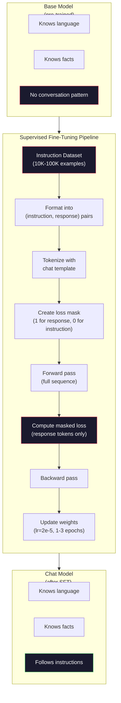

# Instruction Tuning (SFT)

> Một base model chỉ dự đoán token tiếp theo. Chỉ vậy thôi. Nó không tuân theo chỉ dẫn, không trả lời câu hỏi, cũng không từ chối các yêu cầu độc hại. SFT là cầu nối giữa một bộ dự đoán token và một trợ lý hữu ích. Mọi mô hình mà bạn từng trò chuyện -- Claude, GPT, Llama Chat -- đều đã trải qua bước này.

**Type:** Build
**Languages:** Python (với numpy)
**Prerequisites:** Phase 10, Lesson 04 (Pre-Training a Mini GPT)
**Time:** ~90 phút

## Mục tiêu học tập

- Triển khai supervised fine-tuning (SFT) để chuyển đổi một base language model thành một trợ lý biết tuân theo chỉ dẫn
- Định dạng dữ liệu huấn luyện bằng chat template với các vai trò system, user, và assistant, đồng thời áp dụng mask loss trên các token không thuộc về assistant
- Giải thích lý do tại sao SFT là cần thiết: các base model thường tiếp tục văn bản thay vì trả lời câu hỏi
- Đánh giá chất lượng SFT bằng cách so sánh phản hồi của base model và mô hình đã fine-tuned trên một tập chỉ dẫn độc lập (held-out instruction set)

## Vấn đề

Bạn đã huấn luyện một mô hình trong Lesson 04. Nó có thể dự đoán token tiếp theo dựa trên một chuỗi đầu vào. Nếu đưa cho nó "The transformer architecture", nó có thể tiếp tục bằng "has revolutionized natural language processing." Đó là một kết quả ấn tượng đối với một bộ dự đoán token tiếp theo.

Bây giờ hãy thử điều này: đưa cho nó "What is the capital of France?" Một base model sẽ không trả lời "Paris." Nó tiếp tục theo quy luật của văn bản. Nó có thể tạo ra "What is the capital of Germany? What is the capital of France?" vì nó đã học được từ các tài liệu chứa danh sách các câu hỏi. Hoặc nó có thể tạo ra "is a question that many people ask" vì đó là một sự tiếp nối token hợp lý. Mô hình không có khái niệm về việc *trả lời*. Nó chỉ biết *tiếp tục*.

Đây là khoảng cách giữa GPT-3 (base model, phát hành tháng 6 năm 2020) và ChatGPT (instruction-tuned, phát hành tháng 11 năm 2022). Cùng kiến trúc. Cùng quá trình pre-training. Sự khác biệt nằm ở 20.000 đến 100.000 cặp (chỉ dẫn, phản hồi) được thiết kế cẩn thận giúp mô hình học cách tuân theo quy luật hội thoại.

Stanford Alpaca đã chứng minh rằng bạn không cần hàng triệu ví dụ. Vào tháng 3 năm 2023, họ đã fine-tune Llama 7B chỉ trên 52.000 cặp chỉ dẫn-phản hồi được tạo bởi GPT-3.5. Tổng chi phí: $600. The result was a chatbot that could follow instructions, answer questions, and hold conversations. Not as good as ChatGPT, but shockingly close for $600 và vài giờ huấn luyện.

Llama 2 Chat của Meta chỉ sử dụng khoảng 27.000 ví dụ chất lượng cao cho giai đoạn SFT ban đầu. Bài học quan trọng: chất lượng quan trọng hơn số lượng. 27.000 ví dụ được viết bởi các chuyên gia có kỹ năng tốt hơn 1 triệu ví dụ nhiễu được thu thập từ internet.

## Khái niệm

### SFT thực sự làm gì

Supervised Fine-Tuning tiếp tục vòng lặp huấn luyện tương tự như pre-training -- forward pass, tính loss, backward pass, cập nhật trọng số -- nhưng trên một loại dữ liệu khác. Thay vì văn bản thô, bạn huấn luyện trên các cuộc hội thoại có cấu trúc:

```json
{
  "system": "You are a helpful assistant.",
  "user": "What is the capital of France?",
  "assistant": "The capital of France is Paris."
}
```

Mô hình đã biết Paris là thủ đô của Pháp. Nó đã học được điều này trong quá trình pre-training trên Wikipedia, sách giáo khoa và các trang web. SFT không dạy mô hình các kiến thức mới. Nó dạy mô hình một *hành vi* mới: khi thấy một câu hỏi, hãy đưa ra câu trả lời. Khi thấy một chỉ dẫn, hãy đưa ra kết quả hoàn thành. Khi thấy một yêu cầu độc hại, hãy đưa ra lời từ chối.

Hãy nghĩ theo cách này. Pre-training cung cấp cho mô hình kiến thức. SFT cung cấp cho mô hình cách ứng xử.

### Định dạng dữ liệu

Ba định dạng thống trị ngành công nghiệp. Mỗi định dạng mã hóa cùng một thông tin -- ai đã nói gì -- với các dấu phân cách khác nhau.

**Định dạng Alpaca** (Stanford, tháng 3 năm 2023):

```json
{
  "instruction": "Summarize the following article in 3 sentences.",
  "input": "The European Central Bank raised interest rates...",
  "output": "The ECB increased rates by 25 basis points..."
}
```

Đơn giản và được sử dụng rộng rãi. Trường `input` là tùy chọn -- nhiều chỉ dẫn không cần ngữ cảnh bổ sung. Stanford đã phát hành 52.000 ví dụ ở định dạng này, được tạo bởi GPT-3.5 với giá 600 đô la. Điều này đã khởi đầu phong trào instruction tuning mã nguồn mở.

**Định dạng ShareGPT** (cộng đồng, 2023):

```json
{
  "conversations": [
    {"from": "system", "value": "You are a helpful assistant."},
    {"from": "human", "value": "What causes tides?"},
    {"from": "gpt", "value": "Tides are caused by the gravitational pull of the Moon..."},
    {"from": "human", "value": "How often do they occur?"},
    {"from": "gpt", "value": "Most coastal areas experience two high tides and two low tides per day..."}
  ]
}
```

Hỗ trợ các cuộc hội thoại đa lượt (multi-turn). Trường "from" sử dụng "human" và "gpt" theo quy ước, bất kể mô hình thực tế là gì. Vicuna được huấn luyện trên 70.000 cuộc hội thoại ShareGPT được thu thập từ các bản ghi ChatGPT do người dùng chia sẻ.

**Định dạng ChatML** (OpenAI, được nhiều mô hình mã nguồn mở sử dụng):

```
<|im_start|>system
You are a helpful assistant.<|im_end|>
<|im_start|>user
What is the capital of France?<|im_end|>
<|im_start|>assistant
The capital of France is Paris.<|im_end|>
```

Sử dụng các token đặc biệt (`<|im_start|>`, `<|im_end|>`) để phân định vai trò. Các token này được thêm vào từ vựng của tokenizer trong quá trình fine-tuning. Qwen, Yi và nhiều mô hình khác sử dụng ChatML.

Cả ba định dạng đều đạt được cùng một mục đích: chúng nói với mô hình "đây là chỉ dẫn, đây là phản hồi, hãy học quy luật này."

### Tại sao nó hiệu quả

Mô hình đã biết ngôn ngữ từ quá trình pre-training. Nó đã thấy hàng tỷ ví dụ về các câu hỏi theo sau bởi câu trả lời, các chỉ dẫn theo sau bởi kết quả hoàn thành, và các cuộc hội thoại giữa con người. Các quy luật đã được mã hóa trong trọng số.

SFT tập trung khả năng tiềm ẩn này. Thay vì mô hình cần phải tự tìm hiểu từ ngữ cảnh xem nó nên trả lời câu hỏi hay tiếp tục tài liệu, SFT huấn luyện trực tiếp trên quy luật hội thoại. Sau vài nghìn ví dụ, mô hình học được: khi thấy dấu hiệu vai trò assistant, hãy đưa ra phản hồi hữu ích.

Đây là lý do tại sao 27.000 ví dụ là đủ. Bạn không dạy mô hình tiếng Anh. Bạn không dạy nó các sự thật về thế giới. Bạn đang dạy nó một hành vi đơn giản: phản hồi lại các chỉ dẫn. Kiến thức đã có sẵn ở đó rồi.

### Masked Loss

Đây là chi tiết kỹ thuật quan trọng nhất trong SFT, và hầu hết các hướng dẫn đều bỏ qua nó.

Trong quá trình pre-training, bạn tính loss trên mọi token. Mô hình học cách dự đoán mọi token tiếp theo trong chuỗi. Trong quá trình SFT, bạn chỉ tính loss trên các token *phản hồi*. Các token chỉ dẫn đóng vai trò ngữ cảnh, nhưng mô hình không bị phạt nếu "dự đoán" chúng sai.

Tại sao? Bởi vì bạn không muốn mô hình học cách *tạo ra* chỉ dẫn. Bạn muốn nó học cách *phản hồi lại* chỉ dẫn. Nếu bạn tính loss trên các token chỉ dẫn, bạn đang huấn luyện mô hình dự đoán "What is the capital of France?" như thể chính nó là người đặt câu hỏi. Điều đó làm lãng phí tín hiệu gradient và có thể gây nhầm lẫn cho mô hình về vai trò của nó.

Trong thực tế, bạn tạo một loss mask: 1 cho các token phản hồi, 0 cho các token chỉ dẫn. Nhân loss trên mỗi token với mask này trước khi tính trung bình.

```
Tokens:    [SYS] You are helpful [USER] What is the capital? [ASST] Paris is the capital [EOS]
Loss mask:   0    0    0     0      0     0   0  0     0       1     1    1   1     1      1
```

Chỉ các token sau `[ASST]` mới đóng góp vào loss. Mô hình nhìn thấy toàn bộ cuộc hội thoại trong quá trình forward pass (nó cần chỉ dẫn để đưa ra phản hồi đúng) nhưng chỉ cập nhật trọng số dựa trên mức độ dự đoán chính xác phản hồi.

### Hyperparameters huấn luyện

SFT sử dụng các hyperparameters khác biệt đáng kể so với pre-training. Bạn không huấn luyện từ đầu. Bạn đang điều chỉnh một mô hình đã hoạt động.

| Tham số | Pre-Training (Llama 2 7B) | SFT (Llama 2 Chat) |
|-----------|---------------------------|---------------------|
| Learning rate | 3e-4 (đỉnh) | 2e-5 |
| Epochs | 1 (một lượt qua dữ liệu) | 2 |
| Batch size | 4M tokens | 64 ví dụ |
| Warmup steps | 2,000 | 0-100 |
| Weight decay | 0.1 | 0.0-0.1 |
| Data size | 2T tokens | 27,000 ví dụ |

Learning rate thấp hơn 15 lần cho SFT. Điều này rất quan trọng. Learning rate cao trong quá trình fine-tuning sẽ phá hủy kiến thức đã được pre-train. Mô hình "quên" những gì nó đã học và bị overfitting trên tập dữ liệu fine-tuning nhỏ. Đây là hiện tượng catastrophic forgetting (quên thảm họa).

Hai epochs có nghĩa là mô hình nhìn thấy mỗi ví dụ huấn luyện hai lần. Hơn 3 epochs trên một tập dữ liệu nhỏ dẫn đến việc ghi nhớ vẹt -- mô hình bắt đầu tái tạo lại các ví dụ huấn luyện thay vì tổng quát hóa.

### Catastrophic Forgetting

Fine-tuning có thể phá hủy các khả năng tổng quát. Huấn luyện quá lâu trên dữ liệu tuân theo chỉ dẫn sẽ khiến mô hình mất khả năng viết code, làm toán hoặc tạo ra văn bản sáng tạo. Nó trở nên rất giỏi ở định dạng cụ thể của dữ liệu huấn luyện nhưng lại tệ ở mọi thứ khác.

Ba cách giảm thiểu:

1. **Learning rate thấp.** 1e-5 đến 5e-5. Các cập nhật nhỏ hơn đồng nghĩa với việc ít phá hủy các đặc trưng đã được pre-train hơn.

2. **Huấn luyện ngắn.** 1-3 epochs. Dừng lại trước khi mô hình bị overfitting.

3. **Trộn dữ liệu pre-training.** Llama 2 Chat đã trộn một tỷ lệ nhỏ (2-5%) dữ liệu pre-training thô vào tập dữ liệu SFT. Điều này "nhắc nhở" mô hình về các khả năng tổng quát của nó trong khi học hành vi tuân theo chỉ dẫn mới.

### Số liệu thực tế

Fine-tuning một mô hình 7B trên 10.000 cặp chỉ dẫn chất lượng cao mất khoảng 1 giờ trên một GPU NVIDIA A100 80GB. Phép tính như sau:

- 10.000 ví dụ x 512 tokens trung bình = 5.12M tokens
- 2 epochs = 10.24M tokens tổng cộng
- Thông lượng A100 cho fine-tuning mô hình 7B: ~3,000 tokens/giây
- 10.24M / 3,000 = ~3,400 giây = ~57 phút

Đối với mini GPT của chúng ta (4 layers, 128 dims), việc huấn luyện gần như tức thì. Mục đích là hiểu cơ chế, không phải quy mô.



```figure
loss-masking
```

## Xây dựng

### Bước 1: Tập dữ liệu chỉ dẫn

Tạo một tập dữ liệu chỉ dẫn tổng hợp. Trong thực tế, các công ty như Scale AI và Anthropic thuê người chú giải để viết những dữ liệu này. Chúng ta sẽ tạo chúng theo chương trình để minh họa định dạng.

```python
import numpy as np

INSTRUCTION_DATA = [
    {
        "instruction": "What is the capital of France?",
        "response": "The capital of France is Paris."
    },
    {
        "instruction": "Explain gravity in one sentence.",
        "response": "Gravity is the force that attracts objects with mass toward each other."
    },
    {
        "instruction": "Write a haiku about the ocean.",
        "response": "Waves crash on the shore, salt and foam beneath the sun, endless blue expanse."
    },
    {
        "instruction": "What is 15 multiplied by 7?",
        "response": "15 multiplied by 7 is 105."
    },
    {
        "instruction": "Name three programming languages.",
        "response": "Three programming languages are Python, Rust, and TypeScript."
    },
    {
        "instruction": "Summarize photosynthesis.",
        "response": "Photosynthesis converts sunlight, water, and carbon dioxide into glucose and oxygen."
    },
    {
        "instruction": "What year did World War II end?",
        "response": "World War II ended in 1945."
    },
    {
        "instruction": "Define machine learning.",
        "response": "Machine learning is a field where algorithms learn patterns from data to make predictions."
    },
]
```

Tám ví dụ là rất nhỏ. Stanford Alpaca sử dụng 52.000. Nhưng cơ chế là giống hệt nhau dù bạn có 8 hay 52.000 ví dụ: tokenize, mask, tính loss chỉ trên các phản hồi.

### Bước 2: Tokenize với Chat Template

Chuyển đổi các cặp chỉ dẫn-phản hồi thành các chuỗi token với các dấu hiệu vai trò đặc biệt. Các dấu hiệu này cho mô hình biết nơi chỉ dẫn kết thúc và nơi phản hồi bắt đầu.

```python
SPECIAL_TOKENS = {
    "INST_START": 253,
    "INST_END": 254,
    "RESP_START": 255,
}


def tokenize_instruction_pair(instruction, response, vocab_size=256):
    inst_tokens = list(instruction.encode("utf-8"))
    resp_tokens = list(response.encode("utf-8"))

    inst_tokens = [min(t, vocab_size - 4) for t in inst_tokens]
    resp_tokens = [min(t, vocab_size - 4) for t in resp_tokens]

    tokens = (
        [SPECIAL_TOKENS["INST_START"]]
        + inst_tokens
        + [SPECIAL_TOKENS["INST_END"]]
        + [SPECIAL_TOKENS["RESP_START"]]
        + resp_tokens
    )

    return tokens


def create_loss_mask(tokens):
    mask = np.zeros(len(tokens), dtype=np.float32)
    in_response = False

    for i, token in enumerate(tokens):
        if token == SPECIAL_TOKENS["RESP_START"]:
            in_response = True
            continue
        if in_response:
            mask[i] = 1.0

    return mask
```

Loss mask là tất cả các số 0 cho các token chỉ dẫn và tất cả các số 1 cho các token phản hồi. Bản thân token `RESP_START` nhận mask là 0 vì nó là dấu phân cách, không phải là một phần của nội dung phản hồi.

### Bước 3: Masked Cross-Entropy Loss

Cross-entropy tiêu chuẩn, nhưng được nhân với loss mask. Chỉ các token phản hồi mới đóng góp vào gradient.

```python
def masked_cross_entropy_loss(logits, targets, loss_mask):
    batch, seq_len, vocab_size = logits.shape
    logits_flat = logits.reshape(-1, vocab_size)
    targets_flat = targets.reshape(-1)
    mask_flat = loss_mask.reshape(-1)

    max_logits = logits_flat.max(axis=-1, keepdims=True)
    log_softmax = logits_flat - max_logits - np.log(
        np.exp(logits_flat - max_logits).sum(axis=-1, keepdims=True)
    )

    per_token_loss = -log_softmax[np.arange(len(targets_flat)), targets_flat]

    masked_loss = per_token_loss * mask_flat
    num_response_tokens = mask_flat.sum()
    if num_response_tokens == 0:
        return 0.0
    loss = masked_loss.sum() / num_response_tokens

    return loss
```

Mẫu số là `num_response_tokens`, không phải `seq_len`. Nếu bạn chia cho tổng độ dài chuỗi, các chỉ dẫn dài hơn sẽ làm loãng tín hiệu gradient. Chia cho số lượng token phản hồi đảm bảo trọng số bằng nhau trên mỗi token phản hồi bất kể độ dài chỉ dẫn.

### Bước 4: Vòng lặp huấn luyện SFT

Sử dụng lại MiniGPT từ Lesson 04. Vòng lặp huấn luyện trông gần như giống hệt với pre-training, nhưng với định dạng chỉ dẫn và masked loss.

```python
import sys
import os
sys.path.insert(0, os.path.join(os.path.dirname(__file__), "..", "..", "04-pre-training-mini-gpt", "code"))
from main import MiniGPT, LayerNorm, FeedForward, MultiHeadAttention, TransformerBlock, Embedding


def sft_train(model, dataset, num_epochs=2, lr=2e-5, seq_len=64):
    formatted_data = []
    for example in dataset:
        tokens = tokenize_instruction_pair(example["instruction"], example["response"])
        mask = create_loss_mask(tokens)
        formatted_data.append((tokens, mask))

    print(f"SFT Training: {len(formatted_data)} examples, {num_epochs} epochs, lr={lr}")
    print(f"Total tokens: {sum(len(t) for t, _ in formatted_data):,}")
    print()

    losses = []

    for epoch in range(num_epochs):
        epoch_loss = 0.0
        num_batches = 0

        indices = np.random.permutation(len(formatted_data))

        for idx in indices:
            tokens, mask = formatted_data[idx]

            if len(tokens) < 3:
                continue
            if len(tokens) > seq_len:
                tokens = tokens[:seq_len]
                mask = mask[:seq_len]

            input_ids = np.array(tokens[:-1]).reshape(1, -1)
            target_ids = np.array(tokens[1:]).reshape(1, -1)
            loss_mask = np.array(mask[1:]).reshape(1, -1)

            logits = model.forward(input_ids)
            loss = masked_cross_entropy_loss(logits, target_ids, loss_mask)

            batch_size, s_len, v_size = logits.shape
            probs = np.exp(logits - logits.max(axis=-1, keepdims=True))
            probs = probs / probs.sum(axis=-1, keepdims=True)
            dlogits = probs.copy()
            dlogits[np.arange(batch_size)[:, None], np.arange(s_len), target_ids] -= 1.0

            mask_expanded = loss_mask[:, :, np.newaxis]
            num_resp = loss_mask.sum()
            if num_resp > 0:
                dlogits = dlogits * mask_expanded / num_resp

            for block in model.blocks:
                block.ffn.W1 -= lr * np.random.randn(*block.ffn.W1.shape) * 0.01
                block.ffn.W2 -= lr * np.random.randn(*block.ffn.W2.shape) * 0.01
                block.ffn.b1 -= lr * np.random.randn(*block.ffn.b1.shape) * 0.01
                block.ffn.b2 -= lr * np.random.randn(*block.ffn.b2.shape) * 0.01

            epoch_loss += loss
            num_batches += 1
            losses.append(loss)

        avg_loss = epoch_loss / max(num_batches, 1)
        print(f"Epoch {epoch + 1}/{num_epochs} | Avg Loss: {avg_loss:.4f}")

    return model, losses
```

Learning rate là 2e-5, khớp với Llama 2 Chat. Hãy so sánh với 3e-4 được sử dụng trong pre-training -- nhỏ hơn 15 lần. Gradient được mask: các token chỉ dẫn tạo ra gradient bằng 0. Chỉ các token phản hồi mới đẩy trọng số.

### Bước 5: So sánh Base vs SFT Model

Toàn bộ mục đích của SFT là thay đổi hành vi. Hãy đo lường nó bằng cách kiểm tra cách mô hình phản hồi với các đầu vào được định dạng chỉ dẫn so với các đoạn văn bản thô.

```python
def generate_response(model, prompt_tokens, max_new_tokens=50, temperature=0.8):
    tokens = list(prompt_tokens)
    seq_len = model.embedding.pos_embed.shape[0]

    for _ in range(max_new_tokens):
        context = np.array(tokens[-seq_len:]).reshape(1, -1)
        logits = model.forward(context)
        next_logits = logits[0, -1, :]

        next_logits = next_logits / max(temperature, 1e-8)
        probs = np.exp(next_logits - next_logits.max())
        probs = probs / probs.sum()
        probs = np.clip(probs, 1e-10, 1.0)
        probs = probs / probs.sum()

        next_token = np.random.choice(len(probs), p=probs)
        tokens.append(int(next_token))

    return tokens


def evaluate_instruction_following(model, instructions):
    print("Evaluating instruction following:")
    print("-" * 50)

    for instruction in instructions:
        tokens = (
            [SPECIAL_TOKENS["INST_START"]]
            + [min(t, 252) for t in list(instruction.encode("utf-8"))]
            + [SPECIAL_TOKENS["INST_END"]]
            + [SPECIAL_TOKENS["RESP_START"]]
        )

        output = generate_response(model, tokens, max_new_tokens=30, temperature=0.6)
        response_start = len(tokens)
        response_tokens = output[response_start:]
        response_bytes = bytes([t for t in response_tokens if t < 128])
        response_text = response_bytes.decode("utf-8", errors="replace")

        print(f"  Q: {instruction}")
        print(f"  A: {response_text[:80]}")
        print()
```

Trên một mô hình nhỏ với 8 ví dụ, các phản hồi sẽ không có ý nghĩa. Điều đó là bình thường. Điều quan trọng là *cấu trúc*: mô hình học cách tạo ra đầu ra sau dấu hiệu phản hồi thay vì tiếp tục tạo thêm các chỉ dẫn.

### Bước 6: Đo lường Catastrophic Forgetting

So sánh khả năng dự đoán token tiếp theo của mô hình trước và sau SFT. Nếu SFT làm hỏng các khả năng tổng quát, loss trên văn bản thô sẽ tăng lên.

```python
def measure_forgetting(model, test_text, seq_len=64):
    tokens = np.array(list(test_text.encode("utf-8")[:512]))

    total_loss = 0.0
    num_windows = 0

    for start in range(0, len(tokens) - seq_len - 1, seq_len):
        input_ids = tokens[start:start + seq_len].reshape(1, -1)
        target_ids = tokens[start + 1:start + seq_len + 1].reshape(1, -1)

        logits = model.forward(input_ids)

        batch, s_len, vocab_size = logits.shape
        logits_flat = logits.reshape(-1, vocab_size)
        targets_flat = target_ids.reshape(-1)

        max_logits = logits_flat.max(axis=-1, keepdims=True)
        log_softmax = logits_flat - max_logits - np.log(
            np.exp(logits_flat - max_logits).sum(axis=-1, keepdims=True)
        )

        loss = -log_softmax[np.arange(len(targets_flat)), targets_flat].mean()
        total_loss += loss
        num_windows += 1

    return total_loss / max(num_windows, 1)
```

Trong quá trình fine-tuning thực tế, bạn sẽ theo dõi chỉ số này trong suốt quá trình huấn luyện. Nếu loss trên văn bản thô tăng hơn 10-15%, SFT của bạn đang quá mạnh tay. Hãy giảm learning rate hoặc giảm số lượng epochs.

## Sử dụng

### Demo quy trình SFT đầy đủ

```python
if __name__ == "__main__":
    np.random.seed(42)

    test_text = """The transformer architecture processes sequences through self-attention.
Each layer applies multi-head attention followed by a feedforward network.
Residual connections and layer normalization stabilize deep networks.
The model learns to predict the next token given all previous tokens."""

    print("=" * 70)
    print("INSTRUCTION TUNING (SFT) DEMO")
    print("=" * 70)
    print()

    model = MiniGPT(
        vocab_size=256, embed_dim=128, num_heads=4,
        num_layers=4, max_seq_len=128, ff_dim=512
    )
    print(f"Model: {model.count_parameters():,} parameters")
    print(f"Config: 4 layers, 4 heads, 128 dims (mini GPT from Lesson 04)")
    print()

    print("PRE-SFT: Measuring base model loss on raw text")
    base_loss = measure_forgetting(model, test_text)
    print(f"  Base model loss: {base_loss:.4f}")
    print()

    print("=" * 70)
    print("SFT TRAINING")
    print("=" * 70)

    model, losses = sft_train(
        model, INSTRUCTION_DATA, num_epochs=3, lr=2e-5, seq_len=128
    )

    print()
    print("POST-SFT: Measuring fine-tuned model loss on raw text")
    sft_loss = measure_forgetting(model, test_text)
    print(f"  SFT model loss: {sft_loss:.4f}")
    print(f"  Change: {((sft_loss - base_loss) / base_loss * 100):+.1f}%")
    if abs(sft_loss - base_loss) / base_loss < 0.15:
        print("  Minimal forgetting (< 15% change)")
    else:
        print("  Significant forgetting detected")
    print()

    print("=" * 70)
    print("INSTRUCTION FOLLOWING EVALUATION")
    print("=" * 70)
    print()

    test_instructions = [
        "What is the capital of France?",
        "Name a programming language.",
        "Define gravity.",
    ]
    evaluate_instruction_following(model, test_instructions)

    print("=" * 70)
    print("DATA FORMAT EXAMPLES")
    print("=" * 70)
    print()

    for i, example in enumerate(INSTRUCTION_DATA[:3]):
        tokens = tokenize_instruction_pair(example["instruction"], example["response"])
        mask = create_loss_mask(tokens)
        resp_count = int(mask.sum())
        total_count = len(tokens)
        print(f"  Example {i + 1}: {total_count} tokens, {resp_count} response tokens ({resp_count/total_count:.0%} of sequence)")
        print(f"    Instruction: {example['instruction']}")
        print(f"    Response: {example['response']}")
        print()

    print("=" * 70)
    print("TRAINING LOSS CURVE")
    print("=" * 70)
    print()

    if losses:
        window = max(1, len(losses) // 5)
        for i in range(0, len(losses), window):
            chunk = losses[i:i + window]
            avg = sum(chunk) / len(chunk)
            print(f"  Steps {i:3d}-{i + len(chunk) - 1:3d}: avg loss = {avg:.4f}")
```

## Triển khai

Bài học này tạo ra `outputs/prompt-sft-data-curator.md` -- một prompt giúp bạn thiết kế và quản lý các tập dữ liệu chỉ dẫn cho SFT. Với một khả năng mục tiêu (tạo code, toán học, hội thoại), nó tạo ra một kế hoạch thu thập dữ liệu với các thông số kỹ thuật định dạng, tiêu chí chất lượng và yêu cầu về sự đa dạng.

## Bài tập

1. Thêm hỗ trợ system prompt. Sửa đổi `tokenize_instruction_pair` để chấp nhận một system message và đặt nó trước chỉ dẫn. Tạo 5 ví dụ với các system prompt khác nhau ("Bạn là một nhà thơ", "Bạn là một gia sư toán") và xác minh mô hình thấy các system prompt khác nhau trong quá trình huấn luyện.

2. Triển khai trộn dữ liệu. Tạo một hàm nhận vào một tập dữ liệu SFT và một tập văn bản thô, sau đó tạo ra các batch huấn luyện trong đó 5% ví dụ là văn bản thô (không mask) và 95% là các cặp chỉ dẫn (có mask). Chạy 3 epochs và so sánh các chỉ số quên (forgetting) với huấn luyện SFT thuần túy.

3. Xây dựng bộ chấm điểm chất lượng dữ liệu. Đối với mỗi cặp chỉ dẫn-phản hồi, tính toán: (a) độ dài phản hồi theo token, (b) tỷ lệ chỉ dẫn trên phản hồi, (c) độ đa dạng từ vựng (token duy nhất / tổng số token). Lọc bỏ các ví dụ có độ dài phản hồi < 10 token hoặc độ đa dạng < 0.3. Cho thấy việc lọc ảnh hưởng thế nào đến loss cuối cùng.

4. Triển khai huấn luyện hội thoại đa lượt. Mở rộng quá trình tokenization để xử lý các cuộc hội thoại 3 lượt (user-assistant-user-assistant-user-assistant). Loss mask nên bao phủ cả ba lượt của assistant. Xác minh mask là chính xác bằng cách in ra sự căn chỉnh token-mask cho một ví dụ.

5. So sánh các learning rate. Huấn luyện cùng một mô hình ba lần với lr=1e-4, lr=2e-5, và lr=1e-6. Vẽ các đường cong loss. Lần chạy 1e-4 sẽ cho thấy sự giảm nhanh ban đầu nhưng loss cuối cùng cao hơn (overfitting). Lần chạy 1e-6 sẽ gần như không thay đổi. Lần chạy 2e-5 sẽ là điểm tối ưu.

## Thuật ngữ chính

| Thuật ngữ | Cách gọi thông thường | Ý nghĩa thực tế |
|------|----------------|----------------------|
| SFT | "Fine-tuning trên các cuộc hội thoại" | Supervised Fine-Tuning: tiếp tục huấn luyện trên các cặp (chỉ dẫn, phản hồi) với loss chỉ tính trên các token phản hồi |
| Instruction tuning | "Dạy mô hình tuân theo chỉ dẫn" | Huấn luyện trên các cặp chỉ dẫn-phản hồi rõ ràng để base model học được quy luật hội thoại, không phải kiến thức mới |
| Loss masking | "Bỏ qua prompt" | Thiết lập loss bằng 0 cho các token chỉ dẫn để gradient chỉ chảy từ các dự đoán token phản hồi |
| ChatML | "Chat Markup Language" | Một định dạng token sử dụng các dấu phân cách `<\|im_start\|>` và `<\|im_end\|>` để đánh dấu vai trò người nói trong dữ liệu hội thoại |
| Alpaca format | "Định dạng của Stanford" | Một định dạng JSON với các trường instruction/input/output, được sử dụng cho 52K ví dụ do GPT-3.5 tạo ra với giá 600 đô la |
| Catastrophic forgetting | "Mô hình trở nên kém thông minh hơn" | Fine-tuning phá hủy các khả năng đã được pre-train vì các cập nhật gradient ghi đè kiến thức tổng quát bằng các quy luật cụ thể của tác vụ |
| Weight tying | "Shared embeddings" | Sử dụng cùng một ma trận cho input token embeddings và output prediction head, giúp tiết kiệm tham số và cải thiện sự mạch lạc |
| Chat template | "Cách bạn định dạng prompt" | Chuỗi token cụ thể (dấu hiệu vai trò, dấu phân cách) cấu trúc một cuộc hội thoại cho mô hình |

## Đọc thêm

- [Ouyang et al., 2022 -- "Training language models to follow instructions with human feedback" (InstructGPT)](https://arxiv.org/abs/2203.02155) -- bài báo giới thiệu instruction tuning + RLHF tại OpenAI
- [Taori et al., 2023 -- "Stanford Alpaca: An Instruction-following LLaMA Model"](https://github.com/tatsu-lab/stanford_alpaca) -- 52K ví dụ chỉ dẫn với giá 600 đô la, chứng minh SFT hiệu quả trên các tập dữ liệu nhỏ
- [Touvron et al., 2023 -- "Llama 2: Open Foundation and Fine-Tuned Chat Models"](https://arxiv.org/abs/2307.09288) -- quy trình SFT + RLHF của Meta với 27K ví dụ chất lượng cao
- [Chiang et al., 2023 -- "Vicuna: An Open-Source Chatbot Impressing GPT-4"](https://lmsys.org/blog/2023-03-30-vicuna/) -- huấn luyện trên 70K cuộc hội thoại ShareGPT
- [Zhou et al., 2023 -- "LIMA: Less Is More for Alignment"](https://arxiv.org/abs/2305.11206) -- chứng minh rằng 1.000 ví dụ được chọn lọc cẩn thận có thể sánh ngang với SFT trên các tập dữ liệu lớn hơn nhiều