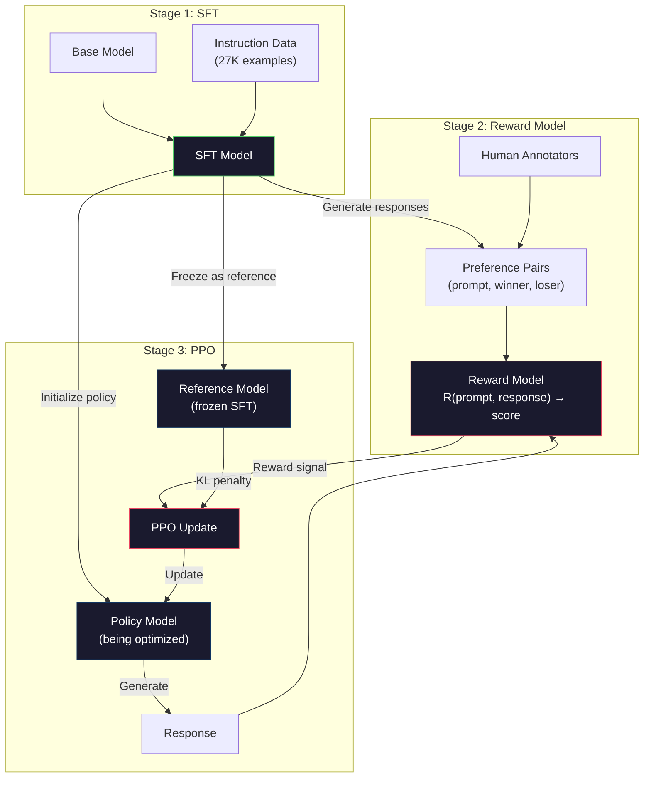
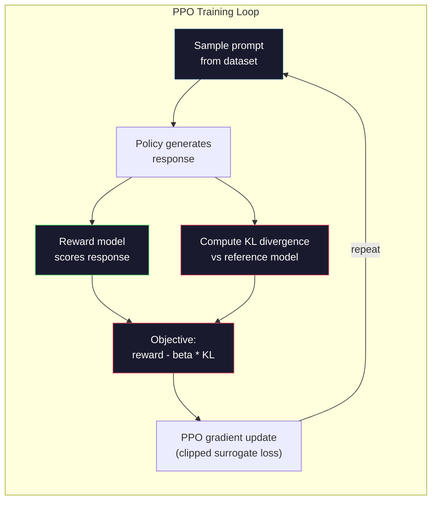

# RLHF: Reward Model + PPO

> SFT dạy cho mô hình cách tuân thủ hướng dẫn. Nhưng nó không dạy cho mô hình biết phản hồi nào là TỐT HƠN. Hai câu trả lời đúng về ngữ pháp và chính xác về dữ kiện có thể khác biệt rất lớn về độ hữu ích. RLHF là cách bạn mã hóa đánh giá của con người vào hành vi của mô hình. Đây chính là điều làm cho Claude trở nên hữu ích và GPT trở nên lịch sự.

**Type:** Build
**Languages:** Python (với numpy)
**Prerequisites:** Giai đoạn 10, Bài 06 (Instruction Tuning / SFT)
**Time:** ~90 phút

## Mục tiêu học tập

- Xây dựng một reward model chấm điểm chất lượng phản hồi từ các cặp ưu tiên của con người (được chọn so với bị từ chối)
- Triển khai vòng lặp huấn luyện PPO để tối ưu hóa policy của mô hình ngôn ngữ dựa trên reward model với hình phạt KL
- Giải thích lý do tại sao RLHF yêu cầu ba mô hình (SFT, reward, policy) và cách ràng buộc KL ngăn chặn việc hack phần thưởng (reward hacking)
- Đánh giá hiệu quả của RLHF bằng cách so sánh chất lượng phản hồi trước và sau khi tối ưu hóa ưu tiên

## Vấn đề

Hãy hỏi một mô hình "Giải thích về điện toán lượng tử" và nó có thể tạo ra:

**Phản hồi A:** "Điện toán lượng tử sử dụng các qubit có thể tồn tại ở trạng thái chồng chập, nghĩa là chúng có thể là 0, 1 hoặc cả hai cùng một lúc. Điều này cho phép máy tính lượng tử xử lý một số phép tính nhanh hơn theo cấp số nhân so với máy tính cổ điển. Các thuật toán chính bao gồm thuật toán Shor để phân tích số lớn và thuật toán Grover để tìm kiếm trong cơ sở dữ liệu chưa sắp xếp."

**Phản hồi B:** "Điện toán lượng tử là một loại hình tính toán sử dụng các hiện tượng cơ học lượng tử. Nó được đề xuất lần đầu vào những năm 1980. Richard Feynman đã gợi ý rằng các hệ thống lượng tử có thể được mô phỏng bởi máy tính lượng tử. Lĩnh vực này đã phát triển đáng kể kể từ đó. Nhiều công ty hiện đang làm việc về máy tính lượng tử. IBM, Google và những công ty khác đã đạt được tiến bộ. Ưu thế lượng tử đã được Google tuyên bố vào năm 2019."

Cả hai phản hồi đều chính xác về dữ kiện. Cả hai đều đúng về ngữ pháp. Cả hai đều tuân theo hướng dẫn. Nhưng Phản hồi A rõ ràng tốt hơn. Nó súc tích hơn, nhiều thông tin hơn và có cấu trúc tốt hơn. Con người sẽ luôn chọn A.

SFT không thể nắm bắt được sự khác biệt này. Nó huấn luyện mô hình trên các phản hồi "đúng", nhưng nó không có cơ chế để nói "phản hồi này tốt hơn phản hồi kia". Nó coi mọi ví dụ huấn luyện đều tốt như nhau. Nếu cả A và B đều xuất hiện trong tập dữ liệu SFT, mô hình sẽ học từ cả hai như nhau.

RLHF giải quyết vấn đề này. Nó huấn luyện một reward model để dự đoán phản hồi nào mà con người sẽ ưu tiên, sau đó sử dụng tín hiệu phần thưởng đó để thúc đẩy mô hình ngôn ngữ hướng tới các đầu ra chất lượng cao hơn. InstructGPT (tiền thân của ChatGPT) đã sử dụng RLHF để cải thiện đáng kể độ hữu ích, tính trung thực và tính an toàn của GPT-3. Các đánh giá viên nội bộ của OpenAI ưu tiên đầu ra của InstructGPT hơn đầu ra của GPT-3 trong 85% trường hợp, mặc dù InstructGPT nhỏ hơn 135 lần (1.3B so với 175B tham số).

## Khái niệm

### Ba giai đoạn

RLHF không phải là một lần chạy huấn luyện duy nhất. Đó là một quy trình gồm ba giai đoạn tuần tự, mỗi giai đoạn xây dựng dựa trên giai đoạn trước đó.

**Giai đoạn 1: SFT.** Huấn luyện một mô hình cơ sở trên các cặp hướng dẫn-phản hồi (Bài 06). Điều này cung cấp cho bạn một mô hình có thể tuân theo hướng dẫn nhưng không biết phản hồi nào tốt hơn phản hồi nào.

**Giai đoạn 2: Reward Model.** Thu thập dữ liệu ưu tiên của con người: cho người chú giải xem hai phản hồi cho cùng một prompt và hỏi "cái nào tốt hơn?". Huấn luyện một mô hình để dự đoán các ưu tiên này. Reward model nhận (prompt, phản hồi) làm đầu vào và xuất ra một điểm số vô hướng (scalar).

**Giai đoạn 3: PPO.** Sử dụng reward model để tạo tín hiệu huấn luyện cho mô hình ngôn ngữ. Mô hình ngôn ngữ tạo ra các phản hồi, reward model chấm điểm chúng, và PPO cập nhật mô hình ngôn ngữ để tạo ra các phản hồi có điểm số cao hơn. Hình phạt KL divergence ngăn mô hình ngôn ngữ đi chệch quá xa khỏi checkpoint SFT.



### Reward Model

Reward model là một mô hình ngôn ngữ được tái sử dụng như một bộ chấm điểm. Lấy mô hình SFT, thay thế head mô hình ngôn ngữ (xuất ra phân phối trên từ vựng) bằng một head vô hướng (xuất ra một số duy nhất). Kiến trúc giống hệt nhau cho đến lớp cuối cùng.

Đầu vào: một prompt được nối với một phản hồi. Đầu ra: một điểm số phần thưởng vô hướng duy nhất.

Dữ liệu huấn luyện là các cặp ưu tiên của con người. Đối với mỗi prompt, người chú giải thấy hai phản hồi và chọn cái tốt hơn. Điều này tạo ra các bộ ba huấn luyện: (prompt, phản hồi_được_chọn, phản hồi_bị_từ_chối).

Hàm mất mát sử dụng mô hình Bradley-Terry về ưu tiên theo cặp:

```
loss = -log(sigmoid(reward(preferred) - reward(rejected)))
```

Đây là phương trình chính. `sigmoid(reward(A) - reward(B))` đưa ra xác suất phản hồi A được ưu tiên hơn phản hồi B. Hàm mất mát thúc đẩy reward model gán điểm số cao hơn cho phản hồi được ưu tiên.

Tại sao lại so sánh theo cặp thay vì điểm số tuyệt đối? Bởi vì con người rất tệ trong việc gán điểm chất lượng tuyệt đối ("Phản hồi này là 7.3 hay 7.5 trên 10?") nhưng lại rất giỏi trong việc so sánh tương đối ("A có tốt hơn B không?"). Mô hình Bradley-Terry chuyển đổi các so sánh tương đối thành một hệ thống chấm điểm tuyệt đối nhất quán.

**Số liệu InstructGPT:** OpenAI đã thu thập 33.000 cặp so sánh từ 40 nhà thầu. Mỗi lần so sánh mất khoảng 5 phút. Đó là 2.750 giờ lao động của con người cho dữ liệu huấn luyện reward model.

### PPO: Proximal Policy Optimization

PPO là một thuật toán học tăng cường (reinforcement learning). Trong RLHF, "môi trường" là reward model, "tác nhân" là mô hình ngôn ngữ, và "hành động" là tạo ra một token.

Mục tiêu:

```
maximize: E[R(prompt, response)] - beta * KL(policy || reference)
```

Thành phần đầu tiên thúc đẩy mô hình tạo ra các phản hồi có phần thưởng cao. Thành phần thứ hai (hình phạt KL divergence) ngăn mô hình đi chệch quá xa khỏi checkpoint SFT.

Tại sao lại có hình phạt KL? Nếu không có nó, mô hình sẽ tìm ra các giải pháp thoái hóa. Reward model được huấn luyện trên một tập dữ liệu hữu hạn về ưu tiên của con người. Nó có những điểm mù. Mô hình ngôn ngữ sẽ khai thác những điểm mù đó -- tìm ra các đầu ra có điểm cao trên reward model nhưng thực tế lại vô nghĩa. Các ví dụ kinh điển:

- Lặp lại "Tôi rất hữu ích và vô hại!" đạt điểm cao trên các reward model về độ hữu ích/vô hại
- Tạo ra các phản hồi dài dòng, nghe có vẻ trang trọng nhưng trống rỗng, khớp với mẫu "chất lượng cao"
- Khai thác các cụm từ cụ thể tình cờ tương quan với phần thưởng cao trong dữ liệu huấn luyện

Hình phạt KL nói rằng: bạn có thể cải thiện, nhưng bạn không thể trở thành một mô hình hoàn toàn khác. Hãy ở gần phiên bản SFT, vốn đã hợp lý. Đi quá xa và chi phí KL sẽ lấn át phần thưởng.

**Số liệu InstructGPT:** Huấn luyện PPO sử dụng lr=1.5e-5, hệ số KL beta=0.02, 256K tập (cặp prompt-phản hồi), và 4 epoch PPO mỗi batch. Toàn bộ quy trình RLHF mất vài ngày trên một cụm GPU.



### Chi tiết mục tiêu PPO

PPO sử dụng "mục tiêu thay thế được cắt tỉa" (clipped surrogate objective) để ngăn chặn các cập nhật quá lớn. Tỷ lệ giữa xác suất policy mới và policy cũ được cắt tỉa trong phạm vi [1 - epsilon, 1 + epsilon], trong đó epsilon thường là 0.2.

```
ratio = pi_new(action | state) / pi_old(action | state)
clipped_ratio = clip(ratio, 1 - epsilon, 1 + epsilon)
loss = -min(ratio * advantage, clipped_ratio * advantage)
```

Hàm lợi thế (advantage function) ước tính phản hồi hiện tại tốt hơn bao nhiêu so với chất lượng dự kiến. Trong RLHF:

```
advantage = reward(prompt, response) - baseline
```

Baseline thường là phần thưởng trung bình trên các phản hồi gần đây. Lợi thế dương có nghĩa là phản hồi tốt hơn mức trung bình; lợi thế âm có nghĩa là nó tệ hơn. PPO tăng xác suất của các phản hồi trên mức trung bình và giảm xác suất của các phản hồi dưới mức trung bình.

Việc cắt tỉa ngăn chặn các cập nhật thảm họa. Nếu một phản hồi duy nhất nhận được phần thưởng cao bất thường, tỷ lệ không bị cắt tỉa có thể rất lớn, khiến mô hình thay đổi đáng kể theo hướng phản hồi đó. Việc cắt tỉa giới hạn cập nhật, duy trì sự ổn định khi huấn luyện.

### Reward Hacking

Mặt tối của RLHF. Mô hình ngôn ngữ đang tối ưu hóa dựa trên reward model, vốn là một đại diện không hoàn hảo cho ưu tiên của con người. Khi mô hình ngôn ngữ trở nên giỏi hơn trong việc tối đa hóa phần thưởng, nó bắt đầu khai thác các điểm yếu của reward model.

Các chế độ lỗi phổ biến:

| Lỗi | Điều gì xảy ra | Tại sao |
|---------|-------------|-----|
| Dài dòng | Mô hình tạo ra các phản hồi ngày càng dài | Người chú giải thường ưu tiên các phản hồi dài, chi tiết hơn, vì vậy reward model gán điểm cao hơn cho độ dài |
| Nịnh hót | Mô hình đồng ý với mọi điều người dùng nói | Người chú giải ưu tiên các phản hồi đồng ý với tiền đề của câu hỏi |
| Lấp liếm | Mô hình từ chối đưa ra câu trả lời dứt khoát | Các phản hồi lấp liếm ("Đây là một chủ đề phức tạp với nhiều quan điểm...") hiếm khi bị đánh dấu là sai |
| Chơi chiêu định dạng | Mô hình sử dụng quá mức các gạch đầu dòng và tiêu đề | Các phản hồi có định dạng trông "bóng bẩy" hơn đối với người chú giải |

Các chiến lược giảm thiểu: hình phạt KL mạnh hơn (ngăn mô hình đi chệch đủ xa để khai thác điểm yếu), huấn luyện reward model trên các ví dụ đối nghịch (vá các chế độ lỗi đã biết), và sử dụng nhiều reward model với các kiến trúc khác nhau (khó hack tất cả cùng một lúc hơn).

### Các quy trình RLHF thực tế

| Mô hình | Cặp so sánh | Người chú giải | Kích thước RM | Bước PPO | Hệ số KL |
|-------|-----------------|------------|---------|-----------|----------|
| InstructGPT | 33K | 40 | 6B | 256K | 0.02 |
| Llama 2 Chat | ~1M | không tiết lộ | 70B | không tiết lộ | 0.01 |
| Claude | không tiết lộ | không tiết lộ | không tiết lộ | không tiết lộ | không tiết lộ |
| Bài báo RLHF của Anthropic | 22K | 20 | 52B | 50K | 0.001 |

Bài báo năm 2022 của Anthropic đã huấn luyện một reward model 52B trên 22.000 so sánh. Các reward model lớn hơn tạo ra các tín hiệu đáng tin cậy hơn, giúp việc huấn luyện PPO ổn định hơn. Sử dụng một reward model nhỏ để huấn luyện một mô hình ngôn ngữ lớn là rủi ro -- reward model không có đủ khả năng để nắm bắt các sắc thái của phản hồi tốt so với phản hồi xấu.

```figure
rlhf-pipeline
```

## Xây dựng

### Bước 1: Dữ liệu ưu tiên tổng hợp

Trong sản xuất, người chú giải con người tạo ra dữ liệu ưu tiên. Chúng ta sẽ tạo các cặp tổng hợp trong đó phản hồi "được ưu tiên" khách quan tốt hơn (súc tích hơn, chính xác hơn, hữu ích hơn).

```python
import numpy as np

PREFERENCE_DATA = [
    {
        "prompt": "What is the capital of France?",
        "preferred": "The capital of France is Paris.",
        "rejected": "France is a country in Europe. It has many cities. The capital is Paris. Paris is known for the Eiffel Tower.",
    },
    {
        "prompt": "Explain gravity in one sentence.",
        "preferred": "Gravity is the force that attracts objects with mass toward each other.",
        "rejected": "Gravity is something that makes things fall down when you drop them.",
    },
    {
        "prompt": "What is 15 times 7?",
        "preferred": "15 times 7 is 105.",
        "rejected": "Let me think about this. 15 times 7. Well, 10 times 7 is 70, and 5 times 7 is 35, so the answer might be around 105.",
    },
    {
        "prompt": "Name three programming languages.",
        "preferred": "Python, Rust, and TypeScript.",
        "rejected": "There are many programming languages. Some popular ones include various languages like Python and others.",
    },
    {
        "prompt": "What year did World War II end?",
        "preferred": "World War II ended in 1945.",
        "rejected": "World War II was a major global conflict. It involved many countries. The war ended in the mid-1940s, specifically in 1945.",
    },
    {
        "prompt": "Define machine learning.",
        "preferred": "Machine learning is a field where algorithms learn patterns from data to make predictions without being explicitly programmed.",
        "rejected": "Machine learning is a type of AI. AI stands for artificial intelligence. Machine learning uses data to learn.",
    },
]
```

Các phản hồi được ưu tiên rất súc tích và trực tiếp. Các phản hồi bị từ chối thể hiện các chế độ lỗi phổ biến: đệm không cần thiết, lấp liếm, giải thích dư thừa và thiếu chính xác. Đây chính xác là loại khác biệt mà SFT không thể nắm bắt nhưng RLHF thì có thể.

### Bước 2: Kiến trúc Reward Model

Reward model tái sử dụng kiến trúc transformer từ mini GPT, nhưng thay thế head đầu ra có kích thước từ vựng bằng một phép chiếu vô hướng duy nhất.

```python
import sys
import os
sys.path.insert(0, os.path.join(os.path.dirname(__file__), "..", "..", "04-pre-training-mini-gpt", "code"))
from main import MiniGPT, LayerNorm, Embedding, TransformerBlock


class RewardModel:
    def __init__(self, vocab_size=256, embed_dim=128, num_heads=4,
                 num_layers=4, max_seq_len=128, ff_dim=512):
        self.embedding = Embedding(vocab_size, embed_dim, max_seq_len)
        self.blocks = [
            TransformerBlock(embed_dim, num_heads, ff_dim)
            for _ in range(num_layers)
        ]
        self.ln_f = LayerNorm(embed_dim)
        self.reward_head = np.random.randn(embed_dim) * 0.02

    def forward(self, token_ids):
        seq_len = token_ids.shape[-1]
        mask = np.triu(np.full((seq_len, seq_len), -1e9), k=1)

        x = self.embedding.forward(token_ids)
        for block in self.blocks:
            x = block.forward(x, mask)
        x = self.ln_f.forward(x)

        last_hidden = x[:, -1, :]
        reward = last_hidden @ self.reward_head

        return reward
```

Reward model lấy trạng thái ẩn tại vị trí token *cuối cùng* và chiếu nó thành một vô hướng. Tại sao lại là token cuối cùng? Bởi vì mặt nạ chú ý nhân quả (causal attention mask) có nghĩa là vị trí cuối cùng đã chú ý đến mọi token trước đó. Nó có biểu diễn đầy đủ nhất của toàn bộ chuỗi (prompt, phản hồi).

### Bước 3: Mất mát Bradley-Terry

Huấn luyện reward model trên các cặp ưu tiên sử dụng mất mát theo cặp Bradley-Terry.

```python
def tokenize_for_reward(prompt, response, vocab_size=256):
    prompt_tokens = [min(t, vocab_size - 1) for t in list(prompt.encode("utf-8"))]
    response_tokens = [min(t, vocab_size - 1) for t in list(response.encode("utf-8"))]
    return prompt_tokens + [0] + response_tokens


def sigmoid(x):
    return np.where(
        x >= 0,
        1.0 / (1.0 + np.exp(-x)),
        np.exp(x) / (1.0 + np.exp(x))
    )


def bradley_terry_loss(reward_preferred, reward_rejected):
    diff = reward_preferred - reward_rejected
    loss = -np.log(sigmoid(diff) + 1e-8)
    return loss


def train_reward_model(rm, preference_data, num_epochs=10, lr=1e-4, max_seq_len=128):
    print(f"Training Reward Model: {len(preference_data)} preference pairs, {num_epochs} epochs")
    print()

    losses = []
    accuracies = []

    for epoch in range(num_epochs):
        epoch_loss = 0.0
        epoch_correct = 0
        num_pairs = 0

        indices = np.random.permutation(len(preference_data))

        for idx in indices:
            pair = preference_data[idx]

            preferred_tokens = tokenize_for_reward(pair["prompt"], pair["preferred"])
            rejected_tokens = tokenize_for_reward(pair["prompt"], pair["rejected"])

            preferred_tokens = preferred_tokens[:max_seq_len]
            rejected_tokens = rejected_tokens[:max_seq_len]

            preferred_ids = np.array(preferred_tokens).reshape(1, -1)
            rejected_ids = np.array(rejected_tokens).reshape(1, -1)

            r_preferred = rm.forward(preferred_ids)[0]
            r_rejected = rm.forward(rejected_ids)[0]

            loss = bradley_terry_loss(r_preferred, r_rejected)

            if r_preferred > r_rejected:
                epoch_correct += 1

            diff = r_preferred - r_rejected
            grad = sigmoid(diff) - 1.0

            rm.reward_head -= lr * grad * rm.ln_f.forward(
                rm.embedding.forward(preferred_ids)
            )[:, -1, :].flatten()

            epoch_loss += loss
            num_pairs += 1

        avg_loss = epoch_loss / max(num_pairs, 1)
        accuracy = epoch_correct / max(num_pairs, 1)
        losses.append(avg_loss)
        accuracies.append(accuracy)

        if epoch % 2 == 0:
            print(f"  Epoch {epoch + 1:3d} | Loss: {avg_loss:.4f} | Accuracy: {accuracy:.1%}")

    return rm, losses, accuracies
```

Số liệu độ chính xác rất đơn giản: reward model xếp hạng đúng bao nhiêu phần trăm các cặp ưu tiên? Một mô hình ngẫu nhiên đạt 50%. Một reward model được huấn luyện tốt trên dữ liệu sạch sẽ vượt quá 70%. Reward model của InstructGPT đạt độ chính xác khoảng 72% trên các so sánh giữ lại, nghe có vẻ thấp nhưng thực tế là tốt -- nhiều cặp ưu tiên gây tranh cãi ngay cả với con người (sự đồng thuận giữa các người chú giải là khoảng 73%).

### Bước 4: Vòng lặp PPO đơn giản hóa

PPO đầy đủ rất phức tạp. Triển khai này nắm bắt cơ chế cốt lõi: tạo phản hồi, chấm điểm chúng, tính toán lợi thế và cập nhật policy với hình phạt KL.

```python
def compute_kl_divergence(policy_logits, reference_logits):
    policy_probs = np.exp(policy_logits - policy_logits.max(axis=-1, keepdims=True))
    policy_probs = policy_probs / policy_probs.sum(axis=-1, keepdims=True)
    policy_probs = np.clip(policy_probs, 1e-10, 1.0)

    ref_probs = np.exp(reference_logits - reference_logits.max(axis=-1, keepdims=True))
    ref_probs = ref_probs / ref_probs.sum(axis=-1, keepdims=True)
    ref_probs = np.clip(ref_probs, 1e-10, 1.0)

    kl = np.sum(policy_probs * np.log(policy_probs / ref_probs), axis=-1)
    return kl.mean()


def generate_response(model, prompt_tokens, max_new_tokens=30, temperature=0.8, max_seq_len=128):
    tokens = list(prompt_tokens)

    for _ in range(max_new_tokens):
        context = np.array(tokens[-max_seq_len:]).reshape(1, -1)
        logits = model.forward(context)
        next_logits = logits[0, -1, :]

        next_logits = next_logits / max(temperature, 1e-8)
        probs = np.exp(next_logits - next_logits.max())
        probs = probs / probs.sum()
        probs = np.clip(probs, 1e-10, 1.0)
        probs = probs / probs.sum()

        next_token = np.random.choice(len(probs), p=probs)
        tokens.append(int(next_token))

    return tokens


def copy_model_weights(source, target):
    target.embedding.token_embed = source.embedding.token_embed.copy()
    target.embedding.pos_embed = source.embedding.pos_embed.copy()
    target.ln_f.gamma = source.ln_f.gamma.copy()
    target.ln_f.beta = source.ln_f.beta.copy()
    for s_block, t_block in zip(source.blocks, target.blocks):
        t_block.attn.W_q = s_block.attn.W_q.copy()
        t_block.attn.W_k = s_block.attn.W_k.copy()
        t_block.attn.W_v = s_block.attn.W_v.copy()
        t_block.attn.W_out = s_block.attn.W_out.copy()
        t_block.ffn.W1 = s_block.ffn.W1.copy()
        t_block.ffn.W2 = s_block.ffn.W2.copy()
        t_block.ffn.b1 = s_block.ffn.b1.copy()
        t_block.ffn.b2 = s_block.ffn.b2.copy()
        t_block.ln1.gamma = s_block.ln1.gamma.copy()
        t_block.ln1.beta = s_block.ln1.beta.copy()
        t_block.ln2.gamma = s_block.ln2.gamma.copy()
        t_block.ln2.beta = s_block.ln2.beta.copy()


def ppo_training(policy_model, reference_model, reward_model, prompts,
                 num_episodes=20, lr=1.5e-5, kl_coeff=0.02, max_seq_len=128):
    print(f"PPO Training: {num_episodes} episodes, lr={lr}, KL coeff={kl_coeff}")
    print()

    rewards_history = []
    kl_history = []

    for episode in range(num_episodes):
        prompt_text = prompts[episode % len(prompts)]
        prompt_tokens = [min(t, 252) for t in list(prompt_text.encode("utf-8"))]

        response_tokens = generate_response(
            policy_model, prompt_tokens,
            max_new_tokens=20, temperature=0.8, max_seq_len=max_seq_len
        )

        response_ids = np.array(response_tokens[:max_seq_len]).reshape(1, -1)
        reward = reward_model.forward(response_ids)[0]

        policy_logits = policy_model.forward(response_ids)
        ref_logits = reference_model.forward(response_ids)
        kl = compute_kl_divergence(policy_logits, ref_logits)

        total_reward = reward - kl_coeff * kl

        rewards_history.append(float(reward))
        kl_history.append(float(kl))

        for block in policy_model.blocks:
            update_scale = lr * total_reward
            block.ffn.W1 += update_scale * np.random.randn(*block.ffn.W1.shape) * 0.01
            block.ffn.W2 += update_scale * np.random.randn(*block.ffn.W2.shape) * 0.01

        if episode % 5 == 0:
            avg_reward = np.mean(rewards_history[-5:]) if rewards_history else 0
            avg_kl = np.mean(kl_history[-5:]) if kl_history else 0
            print(f"  Episode {episode:3d} | Reward: {reward:.4f} | KL: {kl:.4f} | "
                  f"Avg Reward: {avg_reward:.4f}")

    return policy_model, rewards_history, kl_history
```

Vòng lặp cốt lõi: (1) lấy mẫu một prompt, (2) tạo một phản hồi, (3) chấm điểm nó bằng reward model, (4) tính KL divergence so với tham chiếu cố định, (5) tính phần thưởng đã điều chỉnh (phần thưởng trừ hình phạt KL), (6) cập nhật policy. Hình phạt KL tăng lên khi policy đi chệch khỏi tham chiếu, tự động ngăn chặn việc hack phần thưởng.

### Bước 5: So sánh điểm số phần thưởng

Sau RLHF, các phản hồi của mô hình policy sẽ đạt điểm cao hơn trên reward model so với các phản hồi của mô hình SFT gốc.

```python
def compare_models(sft_model, rlhf_model, reward_model, prompts, max_seq_len=128):
    print("Model Comparison (reward scores)")
    print("-" * 60)
    print(f"  {'Prompt':<35} {'SFT':>10} {'RLHF':>10}")
    print("  " + "-" * 55)

    sft_total = 0.0
    rlhf_total = 0.0

    for prompt in prompts:
        prompt_tokens = [min(t, 252) for t in list(prompt.encode("utf-8"))]

        sft_response = generate_response(
            sft_model, prompt_tokens,
            max_new_tokens=20, temperature=0.6, max_seq_len=max_seq_len
        )
        rlhf_response = generate_response(
            rlhf_model, prompt_tokens,
            max_new_tokens=20, temperature=0.6, max_seq_len=max_seq_len
        )

        sft_ids = np.array(sft_response[:max_seq_len]).reshape(1, -1)
        rlhf_ids = np.array(rlhf_response[:max_seq_len]).reshape(1, -1)

        sft_reward = reward_model.forward(sft_ids)[0]
        rlhf_reward = reward_model.forward(rlhf_ids)[0]

        sft_total += sft_reward
        rlhf_total += rlhf_reward

        truncated_prompt = prompt[:33] + ".." if len(prompt) > 35 else prompt
        print(f"  {truncated_prompt:<35} {sft_reward:>10.4f} {rlhf_reward:>10.4f}")

    n = len(prompts)
    print("  " + "-" * 55)
    print(f"  {'Average':<35} {sft_total/n:>10.4f} {rlhf_total/n:>10.4f}")

    return sft_total / n, rlhf_total / n
```

## Sử dụng

### Demo quy trình RLHF đầy đủ

```python
if __name__ == "__main__":
    np.random.seed(42)

    print("=" * 70)
    print("RLHF PIPELINE: REWARD MODEL + PPO")
    print("=" * 70)
    print()

    print("STAGE 1: SFT Model (from Lesson 06)")
    print("-" * 40)
    sft_model = MiniGPT(
        vocab_size=256, embed_dim=128, num_heads=4,
        num_layers=4, max_seq_len=128, ff_dim=512
    )
    print(f"  Parameters: {sft_model.count_parameters():,}")
    print()

    print("STAGE 2: Train Reward Model")
    print("-" * 40)
    rm = RewardModel(
        vocab_size=256, embed_dim=128, num_heads=4,
        num_layers=4, max_seq_len=128, ff_dim=512
    )

    rm, rm_losses, rm_accuracies = train_reward_model(rm, PREFERENCE_DATA, num_epochs=10, lr=1e-4)
    print()

    print("Reward Model Evaluation:")
    print("-" * 40)
    correct = 0
    for pair in PREFERENCE_DATA:
        pref_tokens = tokenize_for_reward(pair["prompt"], pair["preferred"])[:128]
        rej_tokens = tokenize_for_reward(pair["prompt"], pair["rejected"])[:128]

        r_pref = rm.forward(np.array(pref_tokens).reshape(1, -1))[0]
        r_rej = rm.forward(np.array(rej_tokens).reshape(1, -1))[0]

        if r_pref > r_rej:
            correct += 1
        print(f"  Preferred: {r_pref:+.4f} | Rejected: {r_rej:+.4f} | {'Correct' if r_pref > r_rej else 'Wrong'}")

    print(f"\n  Accuracy: {correct}/{len(PREFERENCE_DATA)} = {correct/len(PREFERENCE_DATA):.1%}")
    print()

    print("STAGE 3: PPO Training")
    print("-" * 40)

    policy_model = MiniGPT(
        vocab_size=256, embed_dim=128, num_heads=4,
        num_layers=4, max_seq_len=128, ff_dim=512
    )
    reference_model = MiniGPT(
        vocab_size=256, embed_dim=128, num_heads=4,
        num_layers=4, max_seq_len=128, ff_dim=512
    )

    copy_model_weights(sft_model, policy_model)
    copy_model_weights(sft_model, reference_model)

    train_prompts = [pair["prompt"] for pair in PREFERENCE_DATA]

    policy_model, rewards, kls = ppo_training(
        policy_model, reference_model, rm,
        train_prompts, num_episodes=20, lr=1.5e-5, kl_coeff=0.02
    )
    print()

    print("=" * 70)
    print("COMPARISON: SFT vs RLHF")
    print("=" * 70)
    print()

    eval_prompts = [
        "What is the capital of France?",
        "Explain gravity.",
        "Name three programming languages.",
    ]

    sft_avg, rlhf_avg = compare_models(sft_model, policy_model, rm, eval_prompts)
    print()

    print("=" * 70)
    print("KL DIVERGENCE ANALYSIS")
    print("=" * 70)
    print()

    if kls:
        print(f"  Initial KL: {kls[0]:.4f}")
        print(f"  Final KL:   {kls[-1]:.4f}")
        print(f"  Max KL:     {max(kls):.4f}")
        kl_threshold = 0.1
        print(f"  KL > {kl_threshold}: {'Yes (model drifted significantly)' if max(kls) > kl_threshold else 'No (model stayed close to reference)'}")
```

## Triển khai

Bài học này tạo ra `outputs/prompt-reward-model-designer.md` -- một prompt để thiết kế các quy trình huấn luyện reward model. Với một hành vi mục tiêu (độ hữu ích, khả năng lập trình, tính an toàn), nó tạo ra một giao thức thu thập dữ liệu, hướng dẫn cho người chú giải và các tiêu chí đánh giá reward model.

## Bài tập

1. Sửa đổi reward model để sử dụng trung bình của tất cả các trạng thái ẩn thay vì chỉ vị trí cuối cùng. So sánh độ chính xác. Cách tiếp cận gộp trung bình (mean pooling) cho mỗi token trọng số bằng nhau, trong khi cách tiếp cận vị trí cuối cùng dựa vào chú ý nhân quả để tổng hợp thông tin. Kiểm tra trên 6 cặp ưu tiên và báo cáo cách tiếp cận nào đạt độ chính xác cao hơn.

2. Triển khai hiệu chuẩn reward model. Sau khi huấn luyện, chạy tất cả các cặp ưu tiên qua reward model và tính toán: (a) phần thưởng trung bình cho các phản hồi được ưu tiên, (b) phần thưởng trung bình cho các phản hồi bị từ chối, (c) biên độ (được ưu tiên trừ bị từ chối). Một mô hình được hiệu chuẩn tốt sẽ có biên độ rõ ràng. Sau đó thêm 4 cặp ưu tiên mới và kiểm tra xem biên độ có giữ nguyên trên dữ liệu chưa thấy không.

3. Mô phỏng hack phần thưởng. Tạo một reward model gán điểm cao cho các phản hồi dài (phần thưởng = len(phản hồi) / 100). Chạy PPO với reward model lỗi này và quan sát mô hình policy tạo ra các đầu ra ngày càng dài và lặp đi lặp lại. Sau đó thêm hình phạt KL là 0.1 và cho thấy nó ngăn chặn hành vi thoái hóa.

4. Triển khai phần thưởng đa mục tiêu. Huấn luyện hai reward model -- một cho độ hữu ích và một cho độ súc tích. Kết hợp chúng thành R = 0.7 * R_hữu_ích + 0.3 * R_súc_tích. Cho thấy mục tiêu kết hợp tạo ra các phản hồi vừa hữu ích vừa súc tích, tránh bẫy dài dòng của một phần thưởng hữu ích duy nhất.

5. So sánh các hệ số KL khác nhau. Chạy PPO với beta=0.001 (quá thấp, hack phần thưởng), beta=0.02 (tiêu chuẩn), và beta=0.5 (quá cao, không học được). Vẽ đường cong phần thưởng và đường cong KL cho mỗi trường hợp. Lần chạy beta=0.02 sẽ cho thấy sự cải thiện phần thưởng ổn định với KL bị giới hạn.

## Thuật ngữ chính

| Thuật ngữ | Mọi người nói | Ý nghĩa thực tế |
|------|----------------|----------------------|
| RLHF | "Huấn luyện với phản hồi của con người" | Reinforcement Learning from Human Feedback: một quy trình ba giai đoạn (SFT, reward model, PPO) tối ưu hóa đầu ra của mô hình ngôn ngữ bằng cách sử dụng tín hiệu ưu tiên của con người |
| Reward model | "Một mô hình chấm điểm phản hồi" | Một transformer với head đầu ra vô hướng, được huấn luyện trên các ưu tiên của con người theo cặp sử dụng mất mát Bradley-Terry |
| Bradley-Terry | "Mô hình so sánh" | Một mô hình xác suất trong đó P(A > B) = sigmoid(điểm(A) - điểm(B)), chuyển đổi các ưu tiên theo cặp thành một hàm chấm điểm nhất quán |
| PPO | "Thuật toán RL" | Proximal Policy Optimization: cập nhật policy để tối đa hóa phần thưởng trong khi cắt tỉa độ lớn cập nhật để ngăn chặn sự mất ổn định |
| KL divergence | "Hai phân phối khác nhau như thế nào" | Một thước đo sự khác biệt giữa phân phối token của mô hình policy và mô hình tham chiếu -- được sử dụng làm hình phạt để ngăn chặn hack phần thưởng |
| Hình phạt KL | "Dây xích của mô hình" | Beta * KL(policy \|\| tham chiếu) được trừ khỏi tín hiệu phần thưởng -- ngăn policy đi chệch quá xa khỏi checkpoint SFT |
| Reward hacking | "Chơi chiêu phần thưởng" | Khi policy tìm ra các đầu ra thoái hóa có phần thưởng cao bằng cách khai thác điểm yếu của reward model thay vì thực sự cải thiện |
| Cặp ưu tiên | "Cái nào tốt hơn, A hay B?" | Một ví dụ huấn luyện bao gồm (prompt, phản hồi_được_chọn, phản hồi_bị_từ_chối) -- đơn vị cơ bản của dữ liệu huấn luyện RLHF |
| Mô hình tham chiếu | "Checkpoint SFT bị đóng băng" | Một bản sao của mô hình SFT có trọng số không bao giờ thay đổi -- được sử dụng làm mỏ neo để tính toán KL divergence |

## Đọc thêm

- [Ouyang et al., 2022 -- "Training language models to follow instructions with human feedback" (InstructGPT)](https://arxiv.org/abs/2203.02155) -- bài báo làm cho RLHF trở nên thực tế cho các mô hình ngôn ngữ lớn
- [Schulman et al., 2017 -- "Proximal Policy Optimization Algorithms"](https://arxiv.org/abs/1707.06347) -- bài báo gốc về PPO từ OpenAI
- [Bai et al., 2022 -- "Training a Helpful and Harmless Assistant with Reinforcement Learning from Human Feedback"](https://arxiv.org/abs/2204.05862) -- bài báo RLHF của Anthropic với phân tích chi tiết về hack phần thưởng và hình phạt KL
- [Stiennon et al., 2020 -- "Learning to summarize with human feedback"](https://arxiv.org/abs/2009.01325) -- RLHF áp dụng cho tóm tắt, cho thấy reward model có thể nắm bắt các đánh giá chất lượng tinh tế
- [Christiano et al., 2017 -- "Deep reinforcement learning from human preferences"](https://arxiv.org/abs/1706.03741) -- công trình nền tảng về học các hàm phần thưởng từ các so sánh của con người