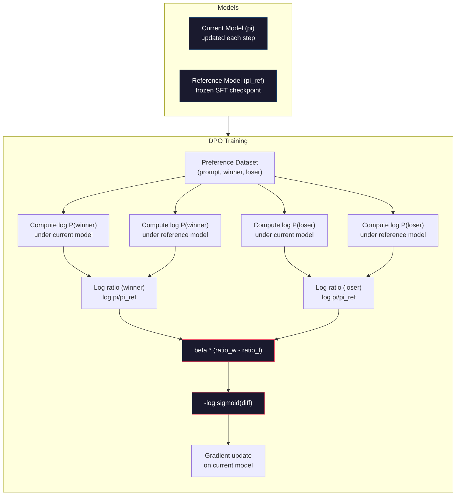

# DPO: Direct Preference Optimization

> RLHF hoạt động hiệu quả. Tuy nhiên, nó đòi hỏi phải huấn luyện ba mô hình (SFT, mô hình phần thưởng, chính sách), quản lý sự bất ổn của PPO và tinh chỉnh hình phạt KL. DPO đặt câu hỏi: điều gì sẽ xảy ra nếu bạn có thể bỏ qua tất cả những bước đó? DPO tối ưu hóa trực tiếp mô hình ngôn ngữ dựa trên các cặp ưu tiên. Không cần mô hình phần thưởng. Không cần PPO. Một vòng lặp huấn luyện duy nhất. Kết quả tương đương.

**Type:** Build
**Languages:** Python (với numpy)
**Prerequisites:** Phase 10, Lesson 07 (RLHF)
**Time:** ~90 phút

## Mục tiêu học tập

- Triển khai huấn luyện DPO giúp tối ưu hóa trực tiếp mô hình ngôn ngữ dựa trên các cặp ưu tiên mà không cần mô hình phần thưởng riêng biệt
- Suy luận hàm mất mát (loss function) của DPO và giải thích cách nó đại diện ngầm cho một mô hình phần thưởng thông qua log-xác suất của chính sách
- So sánh DPO và RLHF về độ ổn định khi huấn luyện, chi phí tính toán và số lượng mô hình cần thiết
- Tinh chỉnh tham số beta để kiểm soát mức độ sai lệch của chính sách đã huấn luyện so với mô hình tham chiếu

## Vấn đề

Bạn đã xây dựng một pipeline RLHF trong Bài 07. Ba giai đoạn. Ba mô hình. Mô hình SFT, mô hình phần thưởng và mô hình chính sách được tối ưu hóa bằng PPO. Chỉ riêng mô hình phần thưởng đã yêu cầu hàng ngàn cặp ưu tiên của con người và một vòng lặp huấn luyện riêng biệt. PPO đòi hỏi phải tinh chỉnh cẩn thận hệ số KL, tốc độ học, tỷ lệ cắt (clip ratio) và số lượng epoch.

Trên thực tế, việc huấn luyện PPO nổi tiếng là không ổn định. Những thay đổi nhỏ về siêu tham số cũng có thể khiến quá trình huấn luyện bị phân kỳ. Mô hình phần thưởng chỉ là một đại diện không hoàn hảo cho sở thích của con người, và mô hình chính sách thường tìm cách khai thác các điểm yếu của nó. Hình phạt KL giúp ích nhưng lại cần phải tự tinh chỉnh -- nếu quá thấp, bạn sẽ gặp tình trạng "reward hacking", nếu quá cao, mô hình hầu như không học được gì.

Sự phức tạp này là lý do tại sao hầu hết các mô hình mã nguồn mở gặp khó khăn với RLHF trong nhiều năm sau khi InstructGPT được công bố. Pipeline ba giai đoạn rất mong manh. Mỗi giai đoạn đều có các chế độ lỗi riêng và các sai số sẽ tích tụ.

Vào tháng 5 năm 2023, Rafael Rafailov, Archit Sharma và các đồng nghiệp tại Stanford đã công bố "Direct Preference Optimization: Your Language Model is Secretly a Reward Model". Điểm mấu chốt: bạn không cần một mô hình phần thưởng riêng biệt. Hàm phần thưởng tối ưu được xác định về mặt toán học bởi chính xác suất token của mô hình ngôn ngữ. Bạn có thể bỏ qua hoàn toàn mô hình phần thưởng và tối ưu hóa trực tiếp mô hình ngôn ngữ dựa trên các cặp ưu tiên.

DPO rút gọn RLHF thành một bước học có giám sát duy nhất. Một mô hình. Một hàm mất mát. Một vòng lặp huấn luyện. Không cần học tăng cường. Zephyr-7B, một trong những mô hình đầu tiên sử dụng DPO ở quy mô lớn, đã đạt hoặc vượt qua các mô hình được huấn luyện bằng RLHF đầy đủ trên một số benchmark. Meta đã sử dụng DPO như một phần trong pipeline căn chỉnh của Llama 3. Anthropic cũng đã trích dẫn các phương pháp kiểu DPO trong nghiên cứu căn chỉnh của họ.

## Khái niệm

### Điểm mấu chốt

RLHF tối ưu hóa mục tiêu sau:

```
maximize: E[R(x, y)] - beta * KL(pi || pi_ref)
```

trong đó R là mô hình phần thưởng, pi là chính sách, pi_ref là mô hình tham chiếu và beta là hệ số KL.

Bài báo DPO đã chỉ ra rằng mục tiêu này có một nghiệm tối ưu dạng đóng (closed-form). Đối với bất kỳ hàm phần thưởng R nào, chính sách tối ưu là:

```
pi*(y | x) = pi_ref(y | x) * exp(R(x, y) / beta) / Z(x)
```

trong đó Z(x) là hằng số chuẩn hóa. Sắp xếp lại:

```
R(x, y) = beta * log(pi*(y | x) / pi_ref(y | x)) + beta * log Z(x)
```

Đây chính là bước đột phá. Phần thưởng được biểu diễn hoàn toàn dựa trên xác suất của mô hình chính sách và xác suất của mô hình tham chiếu. Bạn không cần huấn luyện một mô hình phần thưởng riêng biệt. Phần thưởng được *ẩn* trong tỷ lệ xác suất.

Thay thế điều này vào mô hình ưu tiên Bradley-Terry:

```
P(y_w > y_l | x) = sigmoid(R(x, y_w) - R(x, y_l))
                  = sigmoid(beta * (log pi(y_w|x)/pi_ref(y_w|x) - log pi(y_l|x)/pi_ref(y_l|x)))
```

Các số hạng Z(x) triệt tiêu lẫn nhau vì cả hai phản hồi đều dựa trên cùng một prompt x. Những gì còn lại chỉ là hàm của log-xác suất của mô hình chính sách và log-xác suất của mô hình tham chiếu trên các phản hồi được ưu tiên và bị từ chối.

### Hàm mất mát DPO

```
L_DPO = -log(sigmoid(beta * (log pi(y_w|x)/pi_ref(y_w|x) - log pi(y_l|x)/pi_ref(y_l|x))))
```

Hãy phân tích từng phần:

- **y_w** = phản hồi được ưu tiên (chiến thắng)
- **y_l** = phản hồi bị từ chối (thua cuộc)
- **x** = prompt
- **pi** = mô hình hiện tại (đang được huấn luyện)
- **pi_ref** = mô hình tham chiếu (checkpoint SFT đã đóng băng)
- **beta** = tham số nhiệt độ kiểm soát độ lệch so với tham chiếu (thường từ 0.1 đến 0.5)

Tỷ lệ `log pi(y|x) / pi_ref(y|x)` là tỷ lệ log-xác suất. Khi tỷ lệ này dương, mô hình hiện tại gán xác suất cao hơn cho phản hồi y so với mô hình tham chiếu. Khi âm, mô hình hiện tại gán xác suất thấp hơn.

Hàm mất mát DPO thúc đẩy mô hình tăng tỷ lệ log-xác suất cho các phản hồi được ưu tiên và giảm tỷ lệ này cho các phản hồi bị từ chối. Tham số beta kiểm soát mức độ mạnh mẽ mà mô hình có thể lệch khỏi tham chiếu -- beta nhỏ cho phép sai lệch lớn, beta lớn giữ mô hình gần với tham chiếu hơn.



### Tại sao DPO đơn giản hơn

| Khía cạnh | RLHF (PPO) | DPO |
|--------|-----------|-----|
| Số mô hình cần huấn luyện | 3 (SFT + reward + policy) | 1 (chỉ policy) |
| Vòng lặp huấn luyện | 3 (SFT, RM training, PPO) | 2 (SFT, DPO) |
| Siêu tham số | lr, KL coeff, clip ratio, RM lr, epochs x3 | lr, beta, epochs |
| Mô hình phần thưởng | Bắt buộc (huấn luyện riêng) | Ẩn trong xác suất mô hình |
| Thuật toán RL | PPO (phức tạp, không ổn định) | Học có giám sát (ổn định) |
| Bộ nhớ GPU | 3-4 mô hình trong bộ nhớ khi chạy PPO | 2 mô hình (hiện tại + tham chiếu) |
| Độ ổn định huấn luyện | Nhạy cảm với siêu tham số | Mạnh mẽ, tương tự SFT |

DPO cần hai mô hình trong bộ nhớ trong quá trình huấn luyện -- mô hình hiện tại và mô hình tham chiếu đã đóng băng. RLHF cần ba hoặc bốn: chính sách, tham chiếu, mô hình phần thưởng và tùy chọn là baseline hàm giá trị. Đối với một mô hình 70B, mỗi bản sao chiếm 140GB ở định dạng FP16. Việc tiết kiệm bộ nhớ nhờ loại bỏ mô hình phần thưởng là rất đáng kể.

### Khi nào DPO vượt trội hơn RLHF

**Tập dữ liệu nhỏ.** Với 5.000-20.000 cặp ưu tiên, DPO thường đạt kết quả tương đương hoặc vượt trội hơn RLHF. Mô hình phần thưởng trong RLHF cần đủ dữ liệu để tổng quát hóa -- với dữ liệu hạn chế, nó sẽ bị overfitting và tạo ra các tín hiệu phần thưởng không đáng tin cậy. DPO bỏ qua vấn đề này bằng cách không cần mô hình phần thưởng.

**Tính toán hạn chế.** DPO yêu cầu khoảng một phần ba lượng tính toán so với RLHF đầy đủ (một vòng lặp huấn luyện thay vì ba). Đối với các nhóm không có cụm GPU lớn, đây là lựa chọn thực tế.

**Lặp lại nhanh.** Bạn muốn thử 10 tập dữ liệu ưu tiên khác nhau để xem tập nào tạo ra mô hình tốt nhất? DPO cho phép bạn chạy mỗi thí nghiệm trong vài giờ. RLHF yêu cầu huấn luyện lại mô hình phần thưởng cho mỗi tập dữ liệu.

### Khi nào RLHF vượt trội hơn DPO

**Huấn luyện quy mô lớn.** Ở quy mô của GPT-4 hoặc Claude, mô hình phần thưởng riêng biệt của RLHF có thể nắm bắt các tín hiệu ưu tiên tinh tế hơn. Mô hình phần thưởng đóng vai trò như một hàm mất mát đã học, thích nghi với các tiêu chí chất lượng phức tạp.

**Tín hiệu phần thưởng phức tạp.** Khi "tốt hơn" bao gồm nhiều khía cạnh (hữu ích, vô hại, trung thực), mô hình phần thưởng có thể học được sự đánh đổi đa mục tiêu này. DPO coi mỗi cặp ưu tiên là một tín hiệu nhị phân -- cái này tốt hơn, cái kia tệ hơn -- mà không mô hình hóa lý do tại sao.

**Căn chỉnh lặp lại.** Các pipeline RLHF có thể tạo ra các phản hồi mới với chính sách hiện tại, để con người đánh giá và huấn luyện lại mô hình phần thưởng trong một vòng lặp trực tuyến. DPO hoạt động trên một tập dữ liệu cố định các cặp ưu tiên. Constitutional AI (phương pháp của Anthropic) sử dụng rộng rãi đặc tính lặp lại này của RLHF.

### Ngoài DPO: KTO, ORPO, SimPO

DPO đã truyền cảm hứng cho một loạt các phương pháp căn chỉnh đơn giản hóa.

**KTO (Kahneman-Tversky Optimization, 2024):** Bạn thậm chí không cần các cặp. KTO hoạt động với phản hồi không theo cặp -- chỉ cần gắn nhãn mỗi phản hồi là "tốt" hoặc "xấu" mà không cần so sánh với phương án thay thế. Điều này đơn giản hóa đáng kể việc thu thập dữ liệu. Thay vì cho người chú giải xem hai phản hồi và hỏi "cái nào tốt hơn?", bạn cho xem một phản hồi và hỏi "cái này có tốt không?". Hàm mất mát áp dụng sự ác cảm mất mát (loss aversion) từ lý thuyết triển vọng: các phản hồi xấu bị phạt nặng hơn so với việc các phản hồi tốt được thưởng.

**ORPO (Odds Ratio Preference Optimization, 2024):** Kết hợp SFT và căn chỉnh trong một bước huấn luyện duy nhất. Thay vì thực hiện SFT rồi đến DPO, ORPO sửa đổi hàm mất mát SFT để bao gồm tín hiệu ưu tiên. Hàm mất mát có hai thành phần: hàm mất mát dự đoán token tiếp theo tiêu chuẩn trên các phản hồi được ưu tiên, cộng với một số hạng tỷ lệ chênh lệch (odds ratio) làm tăng khoảng cách giữa xác suất phản hồi được ưu tiên và bị từ chối. Một vòng lặp huấn luyện thay vì hai.

**SimPO (Simple Preference Optimization, 2024):** Loại bỏ hoàn toàn mô hình tham chiếu. Thay vì tính toán tỷ lệ log-xác suất so với tham chiếu đã đóng băng, SimPO sử dụng log-xác suất trung bình của phản hồi (được chuẩn hóa theo độ dài) làm phần thưởng ngầm. Điều này giúp tiết kiệm bộ nhớ (không cần mô hình tham chiếu) và đơn giản hóa việc huấn luyện. Việc chuẩn hóa độ dài ngăn mô hình ưu tiên các phản hồi ngắn hơn.

| Phương pháp | Năm | Mô hình trong bộ nhớ | Cần cặp? | Cần tham chiếu? | Vòng lặp huấn luyện |
|--------|------|-----------------|-------------|-----------------|----------------|
| RLHF | 2022 | 3-4 | Có (cho RM) | Có | 3 |
| DPO | 2023 | 2 | Có | Có | 2 |
| KTO | 2024 | 2 | Không (không cặp) | Có | 2 |
| ORPO | 2024 | 1 | Có | Không | 1 |
| SimPO | 2024 | 1 | Có | Không | 1 |

Xu hướng rất rõ ràng: mỗi phương pháp loại bỏ thêm một phần phức tạp. RLHF cần mô hình phần thưởng và PPO. DPO loại bỏ cả hai. KTO loại bỏ dữ liệu theo cặp. ORPO loại bỏ giai đoạn SFT riêng biệt. SimPO loại bỏ mô hình tham chiếu. Thuế căn chỉnh (alignment tax) -- chi phí tính toán và độ phức tạp để chuyển từ mô hình cơ sở sang mô hình đã căn chỉnh -- liên tục giảm xuống.

### Triển khai DPO thực tế

**Zephyr-7B (HuggingFace, tháng 10/2023):** Sử dụng Mistral 7B làm cơ sở, SFT trên UltraChat (200K ví dụ), sau đó DPO trên UltraFeedback (60K cặp ưu tiên). Đạt 6.47 trên MT-Bench -- mô hình 7B cao nhất vào thời điểm đó. Để so sánh, Llama 2 Chat 70B đạt 6.86, nghĩa là Zephyr đạt kết quả trong phạm vi 6% so với một mô hình lớn gấp 10 lần chỉ bằng cách căn chỉnh DPO.

**Llama 3 (Meta, tháng 4/2024):** Sử dụng DPO sau các giai đoạn RLHF ban đầu. Sự kết hợp này cho thấy DPO và RLHF có thể bổ sung cho nhau -- RLHF cho căn chỉnh rộng, DPO cho tinh chỉnh mục tiêu.

**Neural Magic / nm-chat (2024):** Áp dụng DPO cho nhiều mô hình mã nguồn mở, liên tục cho thấy sự cải thiện 5-15% trên các benchmark căn chỉnh so với các baseline chỉ dùng SFT.

```figure
dpo-loss
```

## Xây dựng

### Bước 1: Tập dữ liệu ưu tiên

Định dạng tương tự RLHF -- các bộ ba (prompt, preferred, rejected). DPO tiêu thụ dữ liệu này trực tiếp mà không cần mô hình phần thưởng trung gian.

```python
import numpy as np
import sys
import os
sys.path.insert(0, os.path.join(os.path.dirname(__file__), "..", "..", "04-pre-training-mini-gpt", "code"))
from main import MiniGPT, LayerNorm, Embedding, TransformerBlock

PREFERENCE_DATA = [
    {
        "prompt": "What is the capital of France?",
        "preferred": "The capital of France is Paris.",
        "rejected": "France is a country in Europe. It has many cities. The capital is Paris. Paris is known for the Eiffel Tower.",
    },
    {
        "prompt": "Explain gravity in one sentence.",
        "preferred": "Gravity is the force that attracts objects with mass toward each other.",
        "rejected": "Gravity is something that makes things fall down when you drop them.",
    },
    {
        "prompt": "What is 15 times 7?",
        "preferred": "15 times 7 is 105.",
        "rejected": "Let me think about this. 15 times 7. Well, 10 times 7 is 70, and 5 times 7 is 35, so the answer might be around 105.",
    },
    {
        "prompt": "Name three programming languages.",
        "preferred": "Python, Rust, and TypeScript.",
        "rejected": "There are many programming languages. Some popular ones include various languages like Python and others.",
    },
    {
        "prompt": "What year did World War II end?",
        "preferred": "World War II ended in 1945.",
        "rejected": "World War II was a major global conflict. It involved many countries. The war ended in the mid-1940s, specifically in 1945.",
    },
    {
        "prompt": "Define machine learning.",
        "preferred": "Machine learning is a field where algorithms learn patterns from data to make predictions without being explicitly programmed.",
        "rejected": "Machine learning is a type of AI. AI stands for artificial intelligence. Machine learning uses data to learn.",
    },
]
```

### Bước 2: Log-xác suất chuỗi

Hàm mất mát DPO yêu cầu tính toán tổng log-xác suất của một phản hồi dựa trên một prompt. Điều này có nghĩa là chạy mô hình trên toàn bộ chuỗi (prompt + response) và cộng tổng log-xác suất của từng token phản hồi.

```python
def tokenize_sequence(text, vocab_size=256):
    return [min(t, vocab_size - 1) for t in list(text.encode("utf-8"))]


def compute_sequence_log_prob(model, prompt_tokens, response_tokens, max_seq_len=128):
    full_sequence = prompt_tokens + response_tokens
    if len(full_sequence) > max_seq_len:
        full_sequence = full_sequence[:max_seq_len]

    if len(full_sequence) < 2:
        return 0.0

    input_ids = np.array(full_sequence[:-1]).reshape(1, -1)
    target_ids = np.array(full_sequence[1:])

    logits = model.forward(input_ids)
    logits = logits[0]

    max_logits = logits.max(axis=-1, keepdims=True)
    log_probs = logits - max_logits - np.log(
        np.exp(logits - max_logits).sum(axis=-1, keepdims=True)
    )

    prompt_len = len(prompt_tokens)
    response_start = max(0, prompt_len - 1)
    response_end = len(target_ids)

    if response_start >= response_end:
        return 0.0

    response_log_probs = log_probs[response_start:response_end, :]
    response_targets = target_ids[response_start:response_end]

    total_log_prob = 0.0
    for i, target in enumerate(response_targets):
        total_log_prob += response_log_probs[i, target]

    return total_log_prob
```

Hàm này là "cỗ máy" của DPO. Đối với mỗi cặp ưu tiên, nó chạy bốn lần: mô hình trên phản hồi được ưu tiên, mô hình trên phản hồi bị từ chối, tham chiếu trên phản hồi được ưu tiên, tham chiếu trên phản hồi bị từ chối. Đó là 4 lượt forward pass cho mỗi ví dụ huấn luyện so với việc tạo phản hồi + chấm điểm phần thưởng + ước tính giá trị + cập nhật PPO của RLHF. Đơn giản hơn, nhanh hơn, ổn định hơn.

### Bước 3: Hàm mất mát DPO

Cốt lõi của bài báo trong mã nguồn. Một hàm. Một hàm mất mát. Không cần mô hình phần thưởng.

```python
def sigmoid(x):
    return np.where(
        x >= 0,
        1.0 / (1.0 + np.exp(-x)),
        np.exp(x) / (1.0 + np.exp(x))
    )


def dpo_loss(policy_logprob_preferred, policy_logprob_rejected,
             ref_logprob_preferred, ref_logprob_rejected, beta=0.1):
    preferred_ratio = policy_logprob_preferred - ref_logprob_preferred
    rejected_ratio = policy_logprob_rejected - ref_logprob_rejected

    logit = beta * (preferred_ratio - rejected_ratio)

    loss = -np.log(sigmoid(logit) + 1e-8)

    preferred_reward = beta * preferred_ratio
    rejected_reward = beta * rejected_ratio

    return loss, {
        "preferred_ratio": float(preferred_ratio),
        "rejected_ratio": float(rejected_ratio),
        "logit": float(logit),
        "implicit_preferred_reward": float(preferred_reward),
        "implicit_rejected_reward": float(rejected_reward),
        "reward_margin": float(preferred_reward - rejected_reward),
    }
```

`preferred_ratio` và `rejected_ratio` là các tỷ lệ log-xác suất từ suy luận DPO. Khi mô hình hiện tại gán xác suất cao hơn cho phản hồi được ưu tiên (so với tham chiếu) và xác suất thấp hơn cho phản hồi bị từ chối, logit sẽ dương và hàm mất mát sẽ thấp. Tín hiệu huấn luyện đẩy mô hình đi đúng hướng này.

`implicit_preferred_reward` và `implicit_rejected_reward` là các phần thưởng mà hàm mất mát DPO gán ngầm. Bạn có thể trích xuất chúng để xác minh rằng quá trình huấn luyện đang hoạt động -- biên độ giữa phần thưởng được ưu tiên và bị từ chối sẽ tăng lên trong quá trình huấn luyện.

### Bước 4: Vòng lặp huấn luyện DPO

Một vòng lặp huấn luyện có giám sát tiêu chuẩn. Không PPO. Không mô hình phần thưởng. Chỉ có các lượt forward pass và cập nhật gradient.

```python
def copy_model_weights(source, target):
    target.embedding.token_embed = source.embedding.token_embed.copy()
    target.embedding.pos_embed = source.embedding.pos_embed.copy()
    target.ln_f.gamma = source.ln_f.gamma.copy()
    target.ln_f.beta = source.ln_f.beta.copy()
    for s_block, t_block in zip(source.blocks, target.blocks):
        t_block.attn.W_q = s_block.attn.W_q.copy()
        t_block.attn.W_k = s_block.attn.W_k.copy()
        t_block.attn.W_v = s_block.attn.W_v.copy()
        t_block.attn.W_out = s_block.attn.W_out.copy()
        t_block.ffn.W1 = s_block.ffn.W1.copy()
        t_block.ffn.W2 = s_block.ffn.W2.copy()
        t_block.ffn.b1 = s_block.ffn.b1.copy()
        t_block.ffn.b2 = s_block.ffn.b2.copy()
        t_block.ln1.gamma = s_block.ln1.gamma.copy()
        t_block.ln1.beta = s_block.ln1.beta.copy()
        t_block.ln2.gamma = s_block.ln2.gamma.copy()
        t_block.ln2.beta = s_block.ln2.beta.copy()


def dpo_train(policy_model, reference_model, preference_data,
              num_epochs=5, lr=5e-6, beta=0.1, max_seq_len=128):
    print(f"DPO Training: {len(preference_data)} pairs, {num_epochs} epochs, "
          f"lr={lr}, beta={beta}")
    print()

    losses = []
    margins = []

    for epoch in range(num_epochs):
        epoch_loss = 0.0
        epoch_margin = 0.0
        num_examples = 0

        indices = np.random.permutation(len(preference_data))

        for idx in indices:
            pair = preference_data[idx]

            prompt_tokens = tokenize_sequence(pair["prompt"])
            preferred_tokens = tokenize_sequence(pair["preferred"])
            rejected_tokens = tokenize_sequence(pair["rejected"])

            pi_logprob_w = compute_sequence_log_prob(
                policy_model, prompt_tokens, preferred_tokens, max_seq_len
            )
            pi_logprob_l = compute_sequence_log_prob(
                policy_model, prompt_tokens, rejected_tokens, max_seq_len
            )
            ref_logprob_w = compute_sequence_log_prob(
                reference_model, prompt_tokens, preferred_tokens, max_seq_len
            )
            ref_logprob_l = compute_sequence_log_prob(
                reference_model, prompt_tokens, rejected_tokens, max_seq_len
            )

            loss, metrics = dpo_loss(
                pi_logprob_w, pi_logprob_l,
                ref_logprob_w, ref_logprob_l, beta
            )

            update_direction = 1.0 if metrics["logit"] < 0 else -0.1
            for block in policy_model.blocks:
                block.ffn.W1 += lr * update_direction * np.random.randn(*block.ffn.W1.shape) * 0.01
                block.ffn.W2 += lr * update_direction * np.random.randn(*block.ffn.W2.shape) * 0.01

            epoch_loss += loss
            epoch_margin += metrics["reward_margin"]
            num_examples += 1
            losses.append(float(loss))
            margins.append(metrics["reward_margin"])

        avg_loss = epoch_loss / max(num_examples, 1)
        avg_margin = epoch_margin / max(num_examples, 1)

        print(f"  Epoch {epoch + 1}/{num_epochs} | Loss: {avg_loss:.4f} | "
              f"Avg Margin: {avg_margin:.4f}")

    return policy_model, losses, margins
```

Vòng lặp huấn luyện đơn giản đến mức đáng ngạc nhiên so với RLHF. Đối với mỗi cặp ưu tiên: tính toán bốn log-xác suất (hai mô hình, hai phản hồi), đưa chúng vào hàm mất mát DPO, tính gradient, cập nhật chính sách. Không có bước tạo phản hồi. Không có suy luận mô hình phần thưởng. Không có ước tính lợi thế. Không có cắt tỉa.

### Bước 5: So sánh DPO và RLHF

Đo lường biên độ phần thưởng ngầm và sự thay đổi log-xác suất để so sánh DPO với mô hình RLHF từ Bài 07.

```python
def evaluate_preference_accuracy(model, reference_model, preference_data, beta=0.1, max_seq_len=128):
    correct = 0
    total = 0

    for pair in preference_data:
        prompt_tokens = tokenize_sequence(pair["prompt"])
        preferred_tokens = tokenize_sequence(pair["preferred"])
        rejected_tokens = tokenize_sequence(pair["rejected"])

        pi_w = compute_sequence_log_prob(model, prompt_tokens, preferred_tokens, max_seq_len)
        pi_l = compute_sequence_log_prob(model, prompt_tokens, rejected_tokens, max_seq_len)
        ref_w = compute_sequence_log_prob(reference_model, prompt_tokens, preferred_tokens, max_seq_len)
        ref_l = compute_sequence_log_prob(reference_model, prompt_tokens, rejected_tokens, max_seq_len)

        preferred_reward = beta * (pi_w - ref_w)
        rejected_reward = beta * (pi_l - ref_l)

        if preferred_reward > rejected_reward:
            correct += 1
        total += 1

    return correct / max(total, 1)


def analyze_implicit_rewards(model, reference_model, preference_data, beta=0.1, max_seq_len=128):
    print("Implicit Reward Analysis:")
    print("-" * 65)
    print(f"  {'Prompt':<30} {'Pref Reward':>12} {'Rej Reward':>12} {'Margin':>10}")
    print("  " + "-" * 60)

    for pair in preference_data:
        prompt_tokens = tokenize_sequence(pair["prompt"])
        preferred_tokens = tokenize_sequence(pair["preferred"])
        rejected_tokens = tokenize_sequence(pair["rejected"])

        pi_w = compute_sequence_log_prob(model, prompt_tokens, preferred_tokens, max_seq_len)
        pi_l = compute_sequence_log_prob(model, prompt_tokens, rejected_tokens, max_seq_len)
        ref_w = compute_sequence_log_prob(reference_model, prompt_tokens, preferred_tokens, max_seq_len)
        ref_l = compute_sequence_log_prob(reference_model, prompt_tokens, rejected_tokens, max_seq_len)

        pref_reward = beta * (pi_w - ref_w)
        rej_reward = beta * (pi_l - ref_l)
        margin = pref_reward - rej_reward

        truncated = pair["prompt"][:28] + ".." if len(pair["prompt"]) > 30 else pair["prompt"]
        print(f"  {truncated:<30} {pref_reward:>12.4f} {rej_reward:>12.4f} {margin:>10.4f}")

    print()
```

### Bước 6: Phân tích độ nhạy Beta

Tham số beta tương đương với hệ số KL trong RLHF của DPO. Nó kiểm soát mức độ mô hình có thể lệch khỏi tham chiếu. Thí nghiệm này cho thấy tác động của nó.

```python
def beta_sensitivity_analysis(sft_model, preference_data, betas, max_seq_len=128):
    print("Beta Sensitivity Analysis")
    print("-" * 60)
    print(f"  {'Beta':>8} {'Final Loss':>12} {'Final Margin':>14} {'Accuracy':>10}")
    print("  " + "-" * 55)

    results = []

    for beta in betas:
        policy = MiniGPT(
            vocab_size=256, embed_dim=128, num_heads=4,
            num_layers=4, max_seq_len=max_seq_len, ff_dim=512
        )
        reference = MiniGPT(
            vocab_size=256, embed_dim=128, num_heads=4,
            num_layers=4, max_seq_len=max_seq_len, ff_dim=512
        )
        copy_model_weights(sft_model, policy)
        copy_model_weights(sft_model, reference)

        policy, losses, margins_list = dpo_train(
            policy, reference, preference_data,
            num_epochs=3, lr=5e-6, beta=beta, max_seq_len=max_seq_len
        )

        accuracy = evaluate_preference_accuracy(
            policy, reference, preference_data, beta, max_seq_len
        )

        final_loss = losses[-1] if losses else 0
        final_margin = margins_list[-1] if margins_list else 0

        print(f"  {beta:>8.3f} {final_loss:>12.4f} {final_margin:>14.4f} {accuracy:>10.1%}")
        results.append({
            "beta": beta,
            "final_loss": final_loss,
            "final_margin": final_margin,
            "accuracy": accuracy,
        })

        print()

    return results
```

Beta nhỏ (0.01) cho phép mô hình lệch tự do khỏi tham chiếu -- học nhanh nhưng có nguy cơ tạo ra các giải pháp thoái hóa. Beta lớn (1.0) giữ mô hình gần với tham chiếu -- ổn định nhưng học chậm. Điểm ngọt (sweet spot) cho hầu hết các ứng dụng là 0.1 đến 0.3.

## Sử dụng

### Demo Pipeline DPO đầy đủ

```python
if __name__ == "__main__":
    np.random.seed(42)

    print("=" * 70)
    print("DPO: DIRECT PREFERENCE OPTIMIZATION")
    print("=" * 70)
    print()

    print("STEP 1: Initialize SFT Model (from Lesson 06)")
    print("-" * 50)
    sft_model = MiniGPT(
        vocab_size=256, embed_dim=128, num_heads=4,
        num_layers=4, max_seq_len=128, ff_dim=512
    )
    print(f"  Parameters: {sft_model.count_parameters():,}")
    print()

    print("STEP 2: DPO Training")
    print("-" * 50)

    policy_model = MiniGPT(
        vocab_size=256, embed_dim=128, num_heads=4,
        num_layers=4, max_seq_len=128, ff_dim=512
    )
    reference_model = MiniGPT(
        vocab_size=256, embed_dim=128, num_heads=4,
        num_layers=4, max_seq_len=128, ff_dim=512
    )
    copy_model_weights(sft_model, policy_model)
    copy_model_weights(sft_model, reference_model)

    policy_model, losses, margins = dpo_train(
        policy_model, reference_model, PREFERENCE_DATA,
        num_epochs=5, lr=5e-6, beta=0.1
    )
    print()

    print("=" * 70)
    print("STEP 3: Evaluate")
    print("=" * 70)
    print()

    pre_accuracy = evaluate_preference_accuracy(
        sft_model, reference_model, PREFERENCE_DATA, beta=0.1
    )
    post_accuracy = evaluate_preference_accuracy(
        policy_model, reference_model, PREFERENCE_DATA, beta=0.1
    )

    print(f"  Preference accuracy (pre-DPO):  {pre_accuracy:.1%}")
    print(f"  Preference accuracy (post-DPO): {post_accuracy:.1%}")
    print()

    analyze_implicit_rewards(policy_model, reference_model, PREFERENCE_DATA, beta=0.1)

    print("=" * 70)
    print("STEP 4: Training Dynamics")
    print("=" * 70)
    print()

    if losses:
        print("  Loss curve:")
        window = max(1, len(losses) // 5)
        for i in range(0, len(losses), window):
            chunk = losses[i:i + window]
            avg = sum(chunk) / len(chunk)
            print(f"    Steps {i:3d}-{i + len(chunk) - 1:3d}: loss = {avg:.4f}")
        print()

    if margins:
        print("  Reward margin curve:")
        window = max(1, len(margins) // 5)
        for i in range(0, len(margins), window):
            chunk = margins[i:i + window]
            avg = sum(chunk) / len(chunk)
            print(f"    Steps {i:3d}-{i + len(chunk) - 1:3d}: margin = {avg:.4f}")
        print()

    print("=" * 70)
    print("STEP 5: Beta Sensitivity")
    print("=" * 70)
    print()

    beta_results = beta_sensitivity_analysis(
        sft_model, PREFERENCE_DATA, betas=[0.01, 0.1, 0.3, 1.0]
    )

    print("=" * 70)
    print("DPO vs RLHF COMPARISON")
    print("=" * 70)
    print()
    print("  DPO advantages:")
    print("    - 1 training loop (vs 3 for RLHF)")
    print("    - 2 models in memory (vs 3-4 for RLHF)")
    print("    - Supervised learning (vs RL, more stable)")
    print("    - No reward model to train or maintain")
    print()
    print("  RLHF advantages:")
    print("    - Separate reward model captures complex preferences")
    print("    - Online learning: generate, rate, retrain")
    print("    - Better for multi-objective alignment")
    print("    - Proven at largest scales (GPT-4, Claude)")
    print()
    print("  Practical guidance:")
    print("    - Start with DPO. It's simpler and often sufficient.")
    print("    - Switch to RLHF if DPO plateaus on your eval metrics.")
    print("    - Many production systems use both: RLHF first, DPO to refine.")
```

## Triển khai

Bài học này tạo ra `outputs/prompt-alignment-method-selector.md` -- một prompt giúp bạn chọn phương pháp căn chỉnh phù hợp (SFT, RLHF, DPO, KTO, ORPO, SimPO) cho trường hợp sử dụng của bạn. Dựa trên khả năng cung cấp dữ liệu, ngân sách tính toán và mục tiêu căn chỉnh, nó sẽ đề xuất một phương pháp và kế hoạch huấn luyện.

## Bài tập

1. Triển khai KTO (Kahneman-Tversky Optimization). KTO không cần các cặp -- chỉ cần gắn nhãn mỗi phản hồi là "tốt" hoặc "xấu". Hàm mất mát cho phản hồi tốt là `-log(sigmoid(beta * log_ratio))` và cho phản hồi xấu là `-log(1 - sigmoid(beta * log_ratio))` với hệ số nhân ác cảm mất mát (thường là 1.5x) trên hàm mất mát phản hồi xấu. Huấn luyện trên cùng dữ liệu (coi phản hồi được ưu tiên là "tốt" và bị từ chối là "xấu" một cách độc lập) và so sánh độ chính xác với DPO.

2. Triển khai DPO chuẩn hóa độ dài. Thay vì log-xác suất thô, hãy chia cho số lượng token phản hồi: `normalized_logprob = total_logprob / num_tokens`. Điều này ngăn mô hình ưu tiên các phản hồi ngắn hơn (vốn có log-xác suất tổng cao hơn). So sánh biên độ phần thưởng ngầm có và không có chuẩn hóa.

3. Xây dựng hàm mất mát kết hợp kiểu ORPO. Thêm hàm mất mát dự đoán token tiếp theo tiêu chuẩn trên phản hồi được ưu tiên vào hàm mất mát DPO: `L = L_sft(preferred) + alpha * L_dpo`. Thử các giá trị alpha là 0.1, 0.5 và 1.0. Hàm mất mát kết hợp sẽ tạo ra một mô hình vừa tuân theo hướng dẫn (từ số hạng SFT) vừa ưu tiên các phản hồi tốt hơn (từ số hạng DPO), loại bỏ nhu cầu về giai đoạn SFT riêng biệt.

4. Triển khai DPO lặp lại. Chạy DPO trong 3 epoch, sau đó tạo các phản hồi mới từ mô hình đã huấn luyện, ghép chúng với các phản hồi được ưu tiên ban đầu thành các cặp ưu tiên mới và chạy lại DPO. Thực hiện hai vòng của quá trình "tự chơi" này. So sánh độ chính xác ưu tiên sau vòng 1 và vòng 2 để xem liệu tinh chỉnh lặp lại có giúp ích hay không.

5. So sánh DPO với các mô hình tham chiếu khác nhau. Thay vì sử dụng checkpoint SFT làm tham chiếu, hãy thử: (a) mô hình cơ sở (trước SFT), (b) checkpoint từ epoch 1 của DPO, (c) trung bình động lũy thừa (EMA) của mô hình chính sách. Báo cáo xem tham chiếu nào tạo ra độ chính xác ưu tiên cao nhất và đường cong huấn luyện ổn định nhất.

## Thuật ngữ chính

| Thuật ngữ | Cách gọi thông thường | Ý nghĩa thực tế |
|------|----------------|----------------------|
| DPO | "RLHF không cần RL" | Direct Preference Optimization: thuật toán học có giám sát tối ưu hóa mô hình ngôn ngữ trực tiếp trên các cặp ưu tiên, bỏ qua mô hình phần thưởng và PPO |
| Phần thưởng ngầm | "Phần thưởng nằm trong mô hình" | Hàm phần thưởng được xác định bởi tỷ lệ log-xác suất giữa mô hình chính sách và tham chiếu -- không cần mô hình phần thưởng riêng |
| Beta (DPO) | "Nhiệt độ" | Kiểm soát mức độ chính sách có thể lệch khỏi mô hình tham chiếu -- beta nhỏ cho phép sai lệch lớn, beta lớn giữ mô hình gần với tham chiếu |
| Tỷ lệ log-xác suất | "Mô hình thay đổi bao nhiêu" | log pi(y\|x) - log pi_ref(y\|x) -- dương nghĩa là mô hình hiện tại gán xác suất cao hơn so với tham chiếu |
| Mô hình tham chiếu | "Checkpoint đã đóng băng" | Bản sao của mô hình SFT có trọng số không bao giờ thay đổi -- đóng vai trò là mỏ neo để tính tỷ lệ xác suất |
| KTO | "DPO không cần cặp" | Kahneman-Tversky Optimization: hoạt động với các nhãn "tốt" hoặc "xấu" không theo cặp thay vì yêu cầu cặp ưu tiên |
| ORPO | "Căn chỉnh một bước" | Odds Ratio Preference Optimization: kết hợp SFT và căn chỉnh thành một vòng lặp huấn luyện duy nhất bằng cách thêm số hạng ưu tiên vào hàm mất mát SFT |
| SimPO | "Không cần tham chiếu" | Simple Preference Optimization: loại bỏ mô hình tham chiếu bằng cách sử dụng log-xác suất trung bình chuẩn hóa theo độ dài làm phần thưởng ngầm |
| Thuế căn chỉnh | "Chi phí để làm mô hình an toàn" | Chi phí tính toán, dữ liệu và độ phức tạp bổ sung để chuyển từ mô hình cơ sở sang mô hình đã căn chỉnh -- DPO giảm đáng kể chi phí này |

## Đọc thêm

- [Rafailov et al., 2023 -- "Direct Preference Optimization: Your Language Model is Secretly a Reward Model"](https://arxiv.org/abs/2305.18290) -- bài báo DPO đơn giản hóa căn chỉnh từ RLHF sang học có giám sát
- [Tunstall et al., 2023 -- "Zephyr: Direct Distillation of LM Alignment"](https://arxiv.org/abs/2310.16944) -- Zephyr-7B, cho thấy DPO trên UltraFeedback đạt kết quả tương đương RLHF trên các benchmark
- [Ethayarajh et al., 2024 -- "KTO: Model Alignment as Prospect Theoretic Optimization"](https://arxiv.org/abs/2402.01306) -- loại bỏ nhu cầu về ưu tiên theo cặp
- [Hong et al., 2024 -- "ORPO: Monolithic Preference Optimization without Reference Model"](https://arxiv.org/abs/2403.07691) -- kết hợp SFT và căn chỉnh trong một bước
- [Meng et al., 2024 -- "SimPO: Simple Preference Optimization with a Reference-Free Reward"](https://arxiv.org/abs/2405.14734) -- loại bỏ hoàn toàn mô hình tham chiếu
- [Llama 3 Technical Report](https://arxiv.org/abs/2407.21783) -- Pipeline căn chỉnh của Meta kết hợp RLHF và DPO