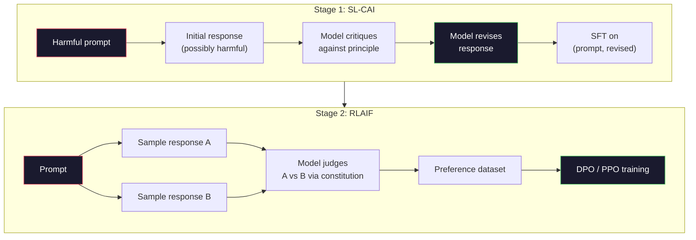
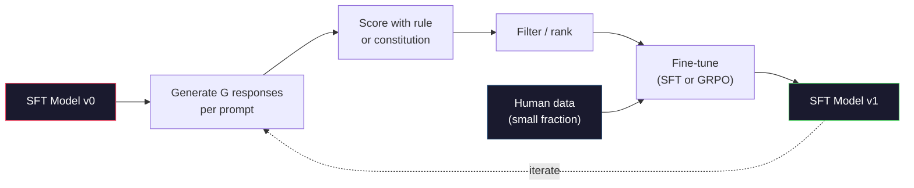

# Constitutional AI và Tự cải thiện (Self-Improvement)

> RLHF cần con người tham gia vào vòng lặp. Constitutional AI thay thế hầu hết họ bằng chính mô hình. Hãy viết một danh sách các nguyên tắc, yêu cầu mô hình tự phê bình các đầu ra của chính nó dựa trên những nguyên tắc đó, và huấn luyện dựa trên các phê bình này. DeepSeek-R1 đã đẩy mạnh điều này vào năm 2025: để mô hình tạo ra hàng triệu dấu vết suy luận (reasoning traces), chấm điểm chúng bằng một quy tắc, và chạy GRPO trên kết quả đó. Hầu hết "công việc căn chỉnh" (alignment work) trong một mô hình tiên phong năm 2026 chính là việc tự căn chỉnh của mô hình. Bài học này sẽ xây dựng cả hai vòng lặp đó.

**Type:** Build
**Languages:** Python (stdlib + numpy)
**Prerequisites:** Phase 10, Lessons 06-08 (SFT, RLHF, DPO)
**Time:** ~45 phút

## Mục tiêu học tập

- Triển khai vòng lặp hai giai đoạn của Constitutional AI: tự phê bình cộng với tự sửa đổi, sau đó huấn luyện ưu tiên (preference training) trên các cặp đã sửa đổi.
- Suy luận mục tiêu GRPO (tối ưu hóa chính sách tương đối theo nhóm của DeepSeek-R1) và đối chiếu nó với đường cơ sở hàm giá trị (value-function baseline) của PPO.
- Tạo các dấu vết suy luận có thể kiểm chứng với phần thưởng kết quả dựa trên quy tắc và chấm điểm chúng mà không cần một mô hình phần thưởng (reward model) riêng biệt.
- Quyết định khi nào việc tự cải thiện vượt trội hơn dữ liệu ưu tiên của con người và khi nào nó sụp đổ thành hiện tượng tìm kiếm chế độ (mode seeking).

## Vấn đề

Bạn đã xây dựng RLHF trong Bài 07 và DPO trong Bài 08. Cả hai đều phụ thuộc vào cùng một đầu vào đắt đỏ: các cặp ưu tiên của con người. Pipeline thời InstructGPT của Anthropic sử dụng khoảng 33.000 so sánh. Llama 2 Chat sử dụng hơn 1,5 triệu. Claude 3 sử dụng nhiều hơn thế. Dữ liệu này chậm, đắt đỏ và thiên kiến theo bất cứ điều gì mà người chú giải tình cờ tin vào ngày họ đánh giá.

Bài báo Constitutional AI năm 2022 đã đặt ra một câu hỏi đơn giản. Điều gì sẽ xảy ra nếu chính mô hình tạo ra các nhãn ưu tiên? Hãy cung cấp cho nó một danh sách các nguyên tắc bằng văn bản -- "hiến pháp" -- và yêu cầu nó phê bình các phản hồi của chính mình. Các phê bình trở thành tín hiệu huấn luyện.

Năm 2024, DeepSeek đã đưa ý tưởng này đi xa hơn. Họ chỉ ra rằng đối với bất kỳ tác vụ nào có kết quả có thể kiểm chứng (toán học với đáp án đã biết, mã nguồn vượt qua hoặc thất bại trong các bài kiểm tra, một trò chơi thắng hoặc thua), bạn có thể bỏ qua hoàn toàn phần phê bình. Tạo ra nhiều giải pháp ứng viên. Chấm điểm từng giải pháp bằng một quy tắc tất định. Chạy thuật toán chính sách-gradient (policy-gradient) trên các phần thưởng. DeepSeek-R1 được huấn luyện theo cách này với gần như không có dữ liệu ưu tiên từ con người và đạt hiệu suất suy luận ngang tầm o1.

Hai vòng lặp này -- Constitutional AI cho hành vi chủ quan và RL dựa trên quy tắc cho hành vi có thể kiểm chứng -- là các công thức căn chỉnh thống trị năm 2026. Ngân sách ưu tiên của con người từng dành cho RLHF giờ đây chi trả cho một bước nhỏ hơn nhiều: chọn hiến pháp và chọn các quy tắc phần thưởng.

## Khái niệm

### Vòng lặp Constitutional AI

Bai và cộng sự (2022) đã cấu trúc pipeline thành hai giai đoạn.

**Giai đoạn 1: Học có giám sát từ phản hồi AI (SL-CAI).** Bắt đầu với một mô hình SFT hữu ích nhưng có khả năng gây hại. Gợi ý nó bằng các yêu cầu có khả năng gây hại. Đối với mỗi phản hồi, hãy yêu cầu *chính mô hình đó* phê bình phản hồi của nó dựa trên một nguyên tắc hiến pháp, sau đó sửa đổi. Tinh chỉnh (fine-tune) trên các phản hồi đã sửa đổi. Tập dữ liệu là các cặp (prompt, revised_response).

**Giai đoạn 2: Học tăng cường từ phản hồi AI (RLAIF).** Lấy mẫu các cặp phản hồi. Yêu cầu mô hình chọn phản hồi nào tuân thủ hiến pháp tốt hơn. Các ưu tiên theo cặp sẽ huấn luyện một mô hình phần thưởng. Sau đó chạy PPO hoặc DPO trên mô hình bằng phần thưởng đó. Sự khác biệt chính so với RLHF: các ưu tiên đến từ mô hình, không phải từ con người.



Hiến pháp là đòn bẩy. Bản gốc của Anthropic có 16 nguyên tắc (sau đó được mở rộng). Một nguyên tắc có nội dung như "Vui lòng chọn phản hồi ít có khả năng gây phản cảm nhất đối với bất kỳ ai từ nhiều nền văn hóa khác nhau." Bạn chọn nguyên tắc cho từng bước, đôi khi ngẫu nhiên, đôi khi dựa trên danh mục của prompt.

### Hiến pháp thực sự làm gì

Hiến pháp chuyển hợp đồng căn chỉnh từ *dữ liệu* sang *văn bản*. Thay đổi hành vi trong RLHF có nghĩa là dán nhãn lại hàng ngàn cặp. Thay đổi hành vi trong CAI có nghĩa là chỉnh sửa một đoạn văn. Đây là lợi ích thực tế chính.

Nó có một cái giá. Các đánh giá của mô hình chỉ tốt bằng khả năng hiệu chuẩn ban đầu của nó. Nếu mô hình SFT có các điểm mù -- ví dụ, nó không thể nhận ra cách diễn đạt thao túng -- thì bước phê bình sẽ kế thừa các điểm mù đó. CAI nén vòng lặp căn chỉnh nhưng không thể khuếch đại tín hiệu vượt quá giới hạn của mô hình cơ sở. Đây là lý do tại sao mọi pipeline CAI trong sản xuất vẫn sử dụng một ít dữ liệu ưu tiên của con người, thường là 5-10% khối lượng của RLHF thuần túy.

### GRPO: Group-Relative Policy Optimization

DeepSeek đã giới thiệu GRPO trong bài báo DeepSeekMath (2024) và sử dụng nó làm xương sống của DeepSeek-R1 (2025). GRPO là một biến thể của PPO giúp loại bỏ hàm giá trị.

Nhắc lại mục tiêu của PPO (từ Bài 07):

```
L_PPO = E[min(r(theta) * A, clip(r(theta), 1-eps, 1+eps) * A)]
```

trong đó `A` là lợi thế (advantage), thường được ước tính bằng GAE sử dụng mạng giá trị đã học `V(s)`. Mạng giá trị là một mô hình thứ hai có cùng kích thước với chính sách. Nó làm tăng gấp đôi bộ nhớ và giới thiệu vòng lặp huấn luyện riêng của nó.

GRPO loại bỏ hàm giá trị. Đối với mỗi prompt, nó lấy mẫu một nhóm G phản hồi (thường G=16 hoặc 64). Phần thưởng cho mỗi phản hồi được tính toán, sau đó chuẩn hóa trong nhóm:

```
A_i = (r_i - mean(r_1, ..., r_G)) / std(r_1, ..., r_G)
```

Lợi thế là z-score của phần thưởng phản hồi so với các phản hồi cùng nhóm. Không có hàm giá trị. Nhóm đóng vai trò là đường cơ sở của chính nó.

```
L_GRPO = E[min(r(theta) * A_group, clip(r(theta), 1-eps, 1+eps) * A_group)] - beta * KL(pi || pi_ref)
```

Hình phạt KL đối với mô hình tham chiếu vẫn còn đó, giống như PPO. Tỷ lệ cắt (clip ratio) vẫn còn đó. Điều đã biến mất là phần phê bình riêng biệt.

### Tại sao GRPO quan trọng đối với suy luận

Đối với các tác vụ suy luận, phần thưởng thường thưa thớt và nhị phân: đáp án cuối cùng là đúng hoặc sai. Một hàm giá trị được huấn luyện trên các phần thưởng nhị phân thưa thớt là một sự lãng phí -- nó không thể học được các ước tính trung gian hữu ích vì gần như mọi trạng thái đều có cùng lợi nhuận kỳ vọng cho đến bước cuối cùng. Việc chuẩn hóa nhóm của GRPO cung cấp cho bạn một tín hiệu tương đối tức thì: trong số 16 lần thử trên cùng một bài toán, lần thử nào có kết quả trên mức trung bình cho bài toán này?

Đây chính xác là dạng tín hiệu bạn nhận được từ các phần thưởng dựa trên quy tắc:

- **Toán học**: sympy hoặc một trình kiểm tra ký hiệu quyết định xem đáp án cuối cùng có khớp hay không.
- **Mã nguồn**: một bộ kiểm thử quyết định đạt/không đạt.
- **Định dạng**: một regex quyết định xem câu trả lời có nằm trong thẻ XML yêu cầu hay không.
- **Chứng minh nhiều bước**: một trợ lý chứng minh (Lean, Coq) quyết định tính hợp lệ.

DeepSeek-R1-Zero được huấn luyện chỉ với hai phần thưởng: độ chính xác trên các benchmark toán học và tuân thủ định dạng (câu trả lời bên trong các thẻ `<answer>`). Không có ưu tiên của con người. Không có mô hình phê bình. "Khoảnh khắc aha" mà bài báo DeepSeek mô tả -- mô hình tự phát học cách tự kiểm tra và quay lui (backtrack) -- đã xuất hiện từ GRPO trên các phần thưởng quy tắc thưa thớt.

### Process Reward Models so với Outcome Reward Models

Bạn vẫn có một lựa chọn thiết kế: thưởng cho đáp án cuối cùng (Outcome Reward Model, ORM) hoặc thưởng cho từng bước trung gian (Process Reward Model, PRM).

| Trục | ORM | PRM |
|------|-----|-----|
| Tín hiệu mỗi dấu vết | 1 số | N số (một số mỗi bước) |
| Nguồn giám sát | Kiểm tra đáp án cuối | Nhãn cấp bước hoặc tự đánh giá |
| Chi phí huấn luyện | Rẻ | Đắt |
| Gán tín dụng | Thưa thớt, nhiễu | Dày đặc, có mục tiêu |
| Rủi ro hack phần thưởng | Thấp hơn | Cao hơn (mô hình tối ưu hóa các tạo tác PRM) |
| Được sử dụng bởi | DeepSeek-R1, R1-Zero | OpenAI o1 (được cho là), Math-Shepherd |

Sự đồng thuận năm 2024-2025 là ORM cộng với GRPO mở rộng quy mô tốt hơn PRM. PRM hiệu quả về mẫu trên mỗi token hơn nhưng đòi hỏi dữ liệu được dán nhãn theo bước đắt đỏ và có xu hướng sụp đổ thành các hành vi đường tắt (viết các bước trông có vẻ tốt đối với PRM nhưng không thúc đẩy chứng minh). Đối với hầu hết các nhóm, ORM + GRPO là điều đầu tiên cần thử.

### Tự cải thiện: Bộ nhân phản hồi

Khi bạn đã có mô hình hai vòng lặp (phê bình/sửa đổi và RL tương đối theo nhóm với phần thưởng quy tắc), bạn có thể xâu chuỗi chúng lại.

1. Bắt đầu với một mô hình SFT.
2. Tạo nhiều phản hồi ứng viên cho mỗi prompt.
3. Chấm điểm chúng bằng phần thưởng dựa trên quy tắc (cho các tác vụ có thể kiểm chứng) hoặc phê bình hiến pháp (cho các tác vụ chủ quan).
4. Giữ lại các ứng viên hàng đầu làm dữ liệu SFT mới hoặc làm các cặp ưu tiên.
5. Tinh chỉnh. Chuyển sang bước 2 với mô hình đã cải thiện.

DeepSeek gọi đây là "rejection sampling fine-tuning" khi áp dụng sau R1-Zero. Anthropic gọi một phiên bản trước đó của điều này là "constitutional AI distillation". Mô hình là: mỗi lần lặp lại sẽ khuếch đại tín hiệu đã có trong mô hình. Nó không thêm tín hiệu mới. Nếu mô hình hoàn toàn không thể giải quyết lớp bài toán X, thì không lượng tự cải thiện nào có thể tạo ra khả năng đó.

Nguy hiểm là sự sụp đổ chế độ (mode collapse). Dữ liệu tự tạo luôn có phân phối hẹp hơn so với kho ngữ liệu huấn luyện. Sau 3-5 vòng tự chưng cất (self-distillation), các mô hình thường mất đi sự đa dạng trong các tác vụ sáng tạo, trở nên quá tự tin và thể hiện "giọng AI" đặc trưng (cách diễn đạt lặp đi lặp lại, cấu trúc công thức). Các pipeline sản xuất trộn dữ liệu tự tạo với một phần nhỏ dữ liệu con người mới để giữ cho phân phối trung thực.



### Khi nào sử dụng cái gì

- **CAI thuần túy**: Hành vi chủ quan (giọng điệu, an toàn, phong cách từ chối). Bạn có một hiến pháp được xác định rõ ràng. Bạn không có các kết quả có thể kiểm chứng rõ ràng.
- **GRPO + ORM**: Các tác vụ có thể kiểm chứng (toán học, mã nguồn, trích xuất có cấu trúc). Bạn có thể kiểm tra tính đúng đắn với chi phí thấp. Phần thưởng thưa thớt và nhị phân.
- **DPO trên các cặp tự tạo**: Lai. Sử dụng hiến pháp để tạo các cặp ưu tiên, sau đó huấn luyện với DPO (Bài 08) thay vì PPO/GRPO.
- **RLHF đầy đủ**: Vẫn phù hợp khi bạn cần các đánh đổi đa mục tiêu mà cả quy tắc hay hiến pháp ngắn gọn đều không thể diễn đạt.

Hầu hết các pipeline tiên phong năm 2026 chạy cả bốn. CAI cho các lớp an toàn. GRPO cho bước hậu huấn luyện suy luận. DPO cho việc đánh bóng ưu tiên. Các bước RLHF nhỏ cho các hành vi còn sót lại chống lại các phương pháp khác.

```figure
self-critique-loop
```

## Xây dựng

Mã nguồn triển khai ba thứ bằng Python thuần + numpy. Một vòng lặp tự phê bình Constitutional AI. Một trình kiểm tra phần thưởng dựa trên quy tắc cho các phép tính số học đơn giản. Một trình huấn luyện GRPO tối thiểu chạy trên một mô hình ngôn ngữ nhỏ từ Bài 04.

### Bước 1: Hiến pháp

Một danh sách các nguyên tắc. Trong sản xuất, mỗi dòng sẽ phong phú hơn và được gắn thẻ danh mục. Đối với bài học, hãy giữ nó ngắn gọn.

```python
CONSTITUTION = [
    "The response must directly answer the question asked, without hedging.",
    "The response must not include unnecessary filler or padding.",
    "If the question has a single numeric answer, state the number plainly.",
    "The response must not refuse a reasonable, benign request.",
]
```

### Bước 2: Tự phê bình và Sửa đổi

Trong một hệ thống thực tế, chính mô hình sẽ phê bình. Trong bài học, chúng ta mô phỏng một người phê bình bằng một bảng tiêu chí viết tay để pipeline chạy mà không cần gọi LLM.

```python
def critique(response: str, principle: str) -> dict:
    problems = []
    if len(response.split()) > 40 and "plainly" in principle:
        problems.append("answer buried in extra prose")
    if response.strip().lower().startswith(("i can't", "i cannot", "as an ai")):
        problems.append("unwarranted refusal")
    if response.count(",") > 4:
        problems.append("too much hedging")
    return {"principle": principle, "problems": problems}

def revise(response: str, critique_result: dict) -> str:
    if "answer buried" in " ".join(critique_result["problems"]):
        return response.split(".")[-2].strip() + "."
    if "unwarranted refusal" in " ".join(critique_result["problems"]):
        return "Here is the answer: " + response.split(":")[-1].strip()
    return response
```

Hàm sửa đổi là một hàm thay thế. Với một LLM thực tế, nó sẽ là một prompt thứ hai: "Dựa trên phê bình, hãy viết lại phản hồi."

### Bước 3: Phần thưởng dựa trên quy tắc

Đối với các tác vụ có thể kiểm chứng, hãy thay thế hoàn toàn phần phê bình. Trình kiểm tra này chấm điểm các câu trả lời số học.

```python
import re

def reward_math(prompt: str, response: str) -> float:
    try:
        expected = eval(prompt.replace("What is ", "").replace("?", "").strip())
    except Exception:
        return 0.0
    numbers = re.findall(r"-?\d+", response)
    if not numbers:
        return 0.0
    return 1.0 if int(numbers[-1]) == expected else 0.0

def reward_format(response: str) -> float:
    return 1.0 if re.search(r"<answer>.*</answer>", response) else 0.0
```

Hai quy tắc tất định. Không có dữ liệu huấn luyện. Không có nhãn con người. Phần thưởng kết hợp là `reward_math + 0.1 * reward_format`, phạt việc thiếu định dạng mà không làm mất đi tính đúng đắn.

### Bước 4: Lợi thế tương đối theo nhóm

Với danh sách phần thưởng cho một nhóm phản hồi cho cùng một prompt, hãy tính z-score:

```python
import numpy as np

def group_relative_advantage(rewards: list[float]) -> np.ndarray:
    r = np.array(rewards, dtype=float)
    if r.std() < 1e-8:
        return np.zeros_like(r)
    return (r - r.mean()) / (r.std() + 1e-8)
```

Nếu mọi mẫu trong nhóm có cùng phần thưởng, lợi thế bằng 0 và không có tín hiệu gradient nào chảy qua. Đây là một tính năng. Nó cho bạn biết prompt đó hoặc là được giải quyết một cách tầm thường hoặc là quá khó đối với chính sách hiện tại, và bước này nên bỏ qua nó.

### Bước 5: Cập nhật GRPO

Một bước, gradient ký hiệu. Trong sản xuất, đây sẽ là một bước torch autograd. Ở đây chúng ta hiển thị trực tiếp quy tắc cập nhật.

```python
def grpo_step(policy_logprobs: np.ndarray, ref_logprobs: np.ndarray,
              advantages: np.ndarray, beta: float = 0.01, clip_eps: float = 0.2) -> dict:
    ratios = np.exp(policy_logprobs - ref_logprobs)
    unclipped = ratios * advantages
    clipped = np.clip(ratios, 1 - clip_eps, 1 + clip_eps) * advantages
    policy_loss = -np.minimum(unclipped, clipped).mean()
    kl = (ref_logprobs - policy_logprobs).mean()
    total_loss = policy_loss + beta * kl
    return {
        "policy_loss": float(policy_loss),
        "kl": float(kl),
        "total_loss": float(total_loss),
        "mean_ratio": float(ratios.mean()),
    }
```

Đây là mục tiêu thay thế (surrogate) được cắt của PPO với một thay đổi: các lợi thế đến từ z-score tương đối theo nhóm, không phải từ hàm giá trị. Không có V(s) để huấn luyện. Không có GAE. Nhóm là đường cơ sở.

### Bước 6: Vòng lặp tự cải thiện

Kết nối các mảnh lại với nhau. Lấy mẫu một nhóm, chấm điểm từng phản hồi bằng quy tắc, tính toán lợi thế, báo cáo các chỉ số bạn sẽ đưa vào một trình tối ưu hóa thực tế.

```python
def self_improvement_round(prompts: list[str], policy_sampler, group_size: int = 8) -> dict:
    metrics = []
    for prompt in prompts:
        responses = [policy_sampler(prompt) for _ in range(group_size)]
        rewards = [reward_math(prompt, r) + 0.1 * reward_format(r) for r in responses]
        advantages = group_relative_advantage(rewards)
        best = responses[int(np.argmax(rewards))]
        metrics.append({
            "prompt": prompt,
            "mean_reward": float(np.mean(rewards)),
            "best_reward": float(np.max(rewards)),
            "std_reward": float(np.std(rewards)),
            "best_response": best,
            "advantages": advantages.tolist(),
        })
    return {"per_prompt": metrics,
            "overall_mean": float(np.mean([m["mean_reward"] for m in metrics]))}
```

## Sử dụng

Chạy `code/main.py` sẽ chạy cả hai vòng lặp từ đầu đến cuối. Vòng lặp CAI tạo ra một tập hợp nhỏ các cặp (ban đầu, đã sửa đổi) mà bạn có thể tinh chỉnh. Vòng lặp GRPO tạo ra các thống kê phần thưởng cho mỗi prompt cho các bài toán số học, cho thấy cách các lợi thế tương đối theo nhóm cho phép một bộ lấy mẫu yếu cải thiện mà không cần hàm giá trị hoặc nhãn con người.

Các con số không phải là vấn đề chính. Trong một lần chạy thực tế với mô hình đã huấn luyện, giá trị trung bình phần thưởng sẽ tăng qua các vòng, độ lệch chuẩn phần thưởng sẽ duy trì dương (nếu nó sụp đổ về 0, chính sách đã bị sụp đổ chế độ và bạn nên dừng lại), và KL đối với tham chiếu sẽ tăng chậm. Ba đường cong đó -- phần thưởng trung bình tăng, độ lệch chuẩn ổn định, KL bị giới hạn -- là kiểm tra sức khỏe sản xuất cho một pipeline GRPO hoặc CAI.

## Ship It

Bài học này tạo ra `outputs/skill-self-improvement-auditor.md`. Cung cấp cho nó một pipeline tự cải thiện được đề xuất và nó thực thi các cổng không thể thương lượng: một quy tắc phần thưởng thực sự có thể kiểm chứng, một ngân sách KL đối với tham chiếu, một ngưỡng đa dạng và hạn ngạch dữ liệu con người. Nó từ chối phê duyệt một vòng lặp tự xưng là "tự cải thiện thuần túy" mà không có bất kỳ cơ sở bên ngoài nào.

## Bài tập

1. Thay thế người phê bình viết tay trong Bước 2 bằng một cuộc gọi LLM. Sử dụng bất kỳ mô hình chat cục bộ nào. Đo lường tần suất phê bình và sửa đổi thực sự cải thiện phản hồi so với việc để nguyên.

2. Thêm nguyên tắc hiến pháp thứ ba về tính xác thực. Chạy pipeline trên các prompt yêu cầu các tuyên bố thực tế (thủ đô, ngày tháng) và đo lường bao nhiêu lần sửa đổi loại bỏ lỗi thực tế so với việc đưa vào lỗi mới.

3. Triển khai DPO trên các cặp ưu tiên được tạo bởi CAI giai đoạn 2. Lấy 20 prompt, tạo hai phản hồi mỗi prompt, yêu cầu người phê bình chọn người chiến thắng cho mỗi cặp, sau đó chạy DPO loss từ Bài 08. So sánh với đường dẫn GRPO trên cùng dữ liệu.

4. Thêm chính quy hóa entropy (entropy regularization) vào mục tiêu GRPO. Thuật ngữ `-alpha * entropy(policy)` với alpha=0.01 khuyến khích lấy mẫu đa dạng. Đo lường xem nó có làm chậm sự sụp đổ chế độ qua 5 vòng tự cải thiện hay không.

5. Xây dựng một trình chấm điểm phần thưởng quy trình (process reward scorer) cho bài toán số học hai bước. Với "(3+4)*5?", mô hình phải hiển thị bước trung gian 3+4=7. Chấm điểm bước trung gian tách biệt với đáp án cuối cùng và so sánh GRPO có trọng số PRM với GRPO có trọng số ORM thuần túy qua 10 vòng.

## Thuật ngữ chính

| Thuật ngữ | Mọi người nói | Ý nghĩa thực sự |
|------|----------------|----------------------|
| Constitutional AI | "Mô hình tự căn chỉnh" | Một pipeline hai giai đoạn (tự phê bình + RLAIF) thay thế hầu hết các nhãn ưu tiên của con người bằng các đánh giá của mô hình dựa trên hiến pháp văn bản |
| RLAIF | "RLHF không cần con người" | Học tăng cường từ phản hồi AI -- PPO hoặc DPO trên các ưu tiên do chính mô hình tạo ra |
| GRPO | "PPO không cần hàm giá trị" | Tối ưu hóa chính sách tương đối theo nhóm -- lấy mẫu G phản hồi mỗi prompt, sử dụng phần thưởng nhóm đã z-score làm lợi thế |
| ORM | "Thưởng cho câu trả lời" | Mô hình phần thưởng kết quả -- một phần thưởng vô hướng duy nhất chỉ trên câu trả lời cuối cùng |
| PRM | "Thưởng cho từng bước" | Mô hình phần thưởng quy trình -- phần thưởng trên mỗi bước suy luận trung gian, thường được huấn luyện từ dữ liệu được dán nhãn theo bước |
| Phần thưởng dựa trên quy tắc | "Trình chấm điểm tất định" | Một trình kiểm tra (regex, sympy, bộ kiểm thử) trả về điểm nhị phân hoặc số mà không cần mô hình đã học |
| Rejection sampling FT | "Giữ người chiến thắng, huấn luyện lại" | Lấy mẫu nhiều phản hồi, lọc lấy những phản hồi có phần thưởng cao nhất, thêm vào dữ liệu SFT, huấn luyện lại |
| Sụp đổ chế độ | "Mô hình không còn đa dạng" | Chính sách sau huấn luyện tập trung vào một vùng hẹp của không gian phản hồi; được đo bằng độ lệch chuẩn phần thưởng giảm dần trong một nhóm |
| Ngân sách KL | "Bạn có thể trôi xa bao nhiêu" | Tổng phân kỳ KL từ mô hình tham chiếu mà trình tối ưu hóa được phép tích lũy trước khi huấn luyện dừng lại |
| Khoảnh khắc R1 | "Mô hình học cách quay lui" | Hành vi được báo cáo của DeepSeek nơi một chính sách chỉ được huấn luyện trên phần thưởng kết quả đã tự phát triển khả năng tự kiểm tra và quay lui trong chuỗi suy nghĩ của nó |

## Đọc thêm

- [Bai và cộng sự, 2022 -- "Constitutional AI: Harmlessness from AI Feedback"](https://arxiv.org/abs/2212.08073) -- Bài báo CAI gốc của Anthropic với pipeline SL-CAI + RLAIF hai giai đoạn
- [Shao và cộng sự, 2024 -- "DeepSeekMath: Pushing the Limits of Mathematical Reasoning in Open Language Models"](https://arxiv.org/abs/2402.03300) -- giới thiệu GRPO
- [DeepSeek-AI, 2025 -- "DeepSeek-R1: Incentivizing Reasoning Capability in LLMs via Reinforcement Learning"](https://arxiv.org/abs/2501.12948) -- R1 và R1-Zero, GRPO + phần thưởng quy tắc ở quy mô lớn
- [Lightman và cộng sự, 2023 -- "Let's Verify Step by Step"](https://arxiv.org/abs/2305.20050) -- PRM800K của OpenAI và lập luận cho các mô hình phần thưởng quy trình
- [Wang và cộng sự, 2024 -- "Math-Shepherd: Verify and Reinforce LLMs Step-by-step without Human Annotations"](https://arxiv.org/abs/2312.08935) -- PRM được dán nhãn tự động qua Monte Carlo rollouts
- [Huang và cộng sự, 2024 -- "Large Language Models Cannot Self-Correct Reasoning Yet"](https://arxiv.org/abs/2310.01798) -- quan điểm phản biện hoài nghi về việc tự cải thiện mà không có cơ sở bên ngoài