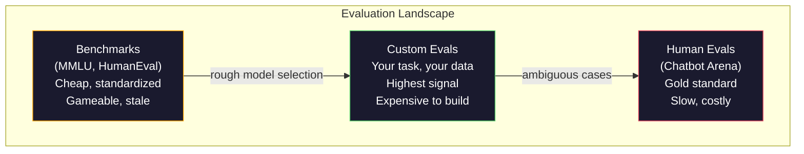
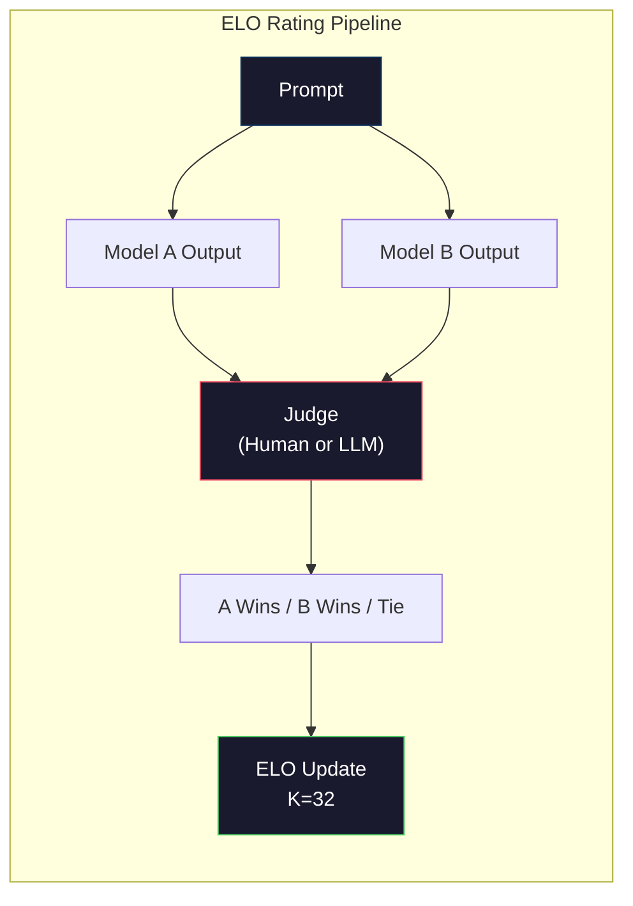

# Đánh giá: Benchmarks, Evals, LM Harness

> Định luật Goodhart: khi một thước đo trở thành mục tiêu, nó không còn là một thước đo tốt nữa. Mọi phòng thí nghiệm tiên phong đều đang "chơi chiêu" với các benchmark. Điểm số MMLU tăng lên trong khi các mô hình vẫn không thể đếm chính xác số chữ R trong từ "strawberry". Đánh giá duy nhất quan trọng là đánh giá CỦA BẠN -- trên tác vụ CỦA BẠN, với dữ liệu CỦA BẠN.

**Type:** Build
**Languages:** Python
**Prerequisites:** Phase 10, Lessons 01-05 (LLMs from Scratch)
**Time:** ~90 phút

## Mục tiêu học tập

- Xây dựng một bộ công cụ đánh giá (evaluation harness) tùy chỉnh để chạy các benchmark trắc nghiệm và câu hỏi mở đối với mô hình ngôn ngữ.
- Giải thích lý do tại sao các benchmark tiêu chuẩn (MMLU, HumanEval) bị bão hòa và không thể phân biệt được các mô hình tiên phong.
- Triển khai các đánh giá đặc thù cho tác vụ với các chỉ số phù hợp: exact match, F1, BLEU và chấm điểm theo phương pháp LLM-as-judge.
- Thiết kế một bộ đánh giá tùy chỉnh nhắm vào trường hợp sử dụng cụ thể của bạn thay vì chỉ dựa vào các bảng xếp hạng công khai.

## Vấn đề

MMLU được công bố vào năm 2020 với 15.908 câu hỏi thuộc 57 chủ đề. Trong vòng ba năm, các mô hình tiên phong đã làm bão hòa nó. GPT-4 đạt 86,4%. Claude 3 Opus đạt 86,8%. Llama 3 405B đạt 88,6%. Bảng xếp hạng bị nén lại trong phạm vi 3 điểm, nơi sự khác biệt chỉ là nhiễu thống kê chứ không phải khoảng cách năng lực thực sự.

Trong khi đó, chính những mô hình này lại thất bại ở những tác vụ mà một đứa trẻ 10 tuổi có thể xử lý mà không cần suy nghĩ. Claude 3.5 Sonnet, đạt 88,7% trên MMLU, ban đầu không thể đếm các chữ cái trong từ "strawberry" -- một tác vụ không đòi hỏi kiến thức thế giới hay suy luận, chỉ cần lặp qua từng ký tự. HumanEval kiểm tra khả năng tạo mã với 164 bài toán. Các mô hình đạt điểm 90%+ nhưng vẫn tạo ra mã bị lỗi ở các trường hợp biên (edge cases) mà bất kỳ lập trình viên cấp dưới nào cũng có thể nhận ra.

Khoảng cách giữa hiệu suất benchmark và độ tin cậy trong thực tế là vấn đề cốt lõi của việc đánh giá LLM. Các benchmark cho bạn biết mô hình hoạt động như thế nào trên chính benchmark đó. Chúng hầu như không cho biết gì về cách mô hình đó sẽ hoạt động trên tác vụ cụ thể của bạn, với dữ liệu cụ thể của bạn và trong các chế độ lỗi cụ thể của bạn. Nếu bạn đang xây dựng một bot hỗ trợ khách hàng, MMLU là không liên quan. Nếu bạn đang xây dựng một trợ lý lập trình, HumanEval chỉ bao phủ việc tạo mã ở cấp độ hàm -- nó không nói gì về việc gỡ lỗi, tái cấu trúc hoặc giải thích mã trên nhiều tệp.

Bạn cần các đánh giá tùy chỉnh. Không phải vì benchmark vô dụng -- chúng hữu ích cho việc lựa chọn mô hình sơ bộ -- mà vì đánh giá cuối cùng phải khớp chính xác với điều kiện triển khai của bạn.

## Khái niệm

### Bối cảnh đánh giá

Có ba loại đánh giá, mỗi loại có chi phí và chất lượng tín hiệu khác nhau.

**Benchmarks** là các bộ kiểm tra tiêu chuẩn hóa. MMLU, HumanEval, SWE-bench, MATH, ARC, HellaSwag. Bạn chạy mô hình trên benchmark và nhận được điểm số. Ưu điểm: mọi người đều sử dụng cùng một bài kiểm tra, vì vậy bạn có thể so sánh các mô hình. Nhược điểm: các mô hình và dữ liệu huấn luyện ngày càng làm ô nhiễm các benchmark này. Các phòng thí nghiệm huấn luyện trên dữ liệu bao gồm cả các câu hỏi benchmark. Điểm số tăng lên. Năng lực có thể không.

**Custom evals** là các bộ kiểm tra bạn tự xây dựng cho trường hợp sử dụng cụ thể của mình. Bạn xác định đầu vào, đầu ra mong đợi và hàm chấm điểm. Một công cụ tóm tắt tài liệu pháp lý được đánh giá trên các tài liệu pháp lý. Một trình tạo SQL được đánh giá trên lược đồ cơ sở dữ liệu của bạn. Những thứ này tốn kém để tạo ra nhưng là đánh giá duy nhất dự đoán được hiệu suất thực tế.

**Human evals** sử dụng những người đánh giá được trả phí để nhận xét đầu ra của mô hình dựa trên các tiêu chí như tính hữu ích, tính chính xác, độ trôi chảy và tính an toàn. Đây là tiêu chuẩn vàng cho các tác vụ mở mà việc chấm điểm tự động thất bại. Chatbot Arena đã thu thập hơn 2 triệu lượt bình chọn ưu tiên của con người trên hơn 100 mô hình. Nhược điểm: chi phí ($0.10-$2.00 mỗi lượt đánh giá) và tốc độ (từ vài giờ đến vài ngày).



### Tại sao Benchmarks bị phá vỡ

Ba cơ chế khiến điểm số benchmark ngừng phản ánh năng lực thực tế.

**Ô nhiễm dữ liệu (Data contamination).** Các tập dữ liệu huấn luyện thu thập từ internet. Các câu hỏi benchmark nằm trên internet. Các mô hình nhìn thấy câu trả lời trong quá trình huấn luyện. Đây không phải là gian lận theo nghĩa truyền thống -- các phòng thí nghiệm không cố ý đưa dữ liệu benchmark vào. Nhưng việc thu thập dữ liệu quy mô web khiến việc loại trừ gần như là không thể.

**Dạy để thi (Teaching to the test).** Các phòng thí nghiệm tối ưu hóa hỗn hợp huấn luyện để đạt hiệu suất benchmark. Nếu 5% hỗn hợp huấn luyện là các câu hỏi trắc nghiệm kiểu MMLU, mô hình sẽ học được định dạng và phân phối câu trả lời. MMLU là trắc nghiệm 4 lựa chọn. Các mô hình học được rằng phân phối câu trả lời xấp xỉ đồng nhất giữa A/B/C/D, điều này giúp ích ngay cả khi mô hình không biết câu trả lời.

**Bão hòa (Saturation).** Khi mọi mô hình tiên phong đều đạt 85-90% trên một benchmark, benchmark đó ngừng phân biệt được năng lực. 10-15% câu hỏi còn lại có thể mơ hồ, dán nhãn sai hoặc đòi hỏi kiến thức chuyên môn hiếm gặp. Việc cải thiện từ 87% lên 89% trên MMLU có thể chỉ có nghĩa là mô hình đã ghi nhớ thêm hai câu hỏi khó, chứ không phải nó thông minh hơn.

### Perplexity: Kiểm tra sức khỏe nhanh

Perplexity đo lường mức độ "ngạc nhiên" của mô hình trước một chuỗi token. Về mặt hình thức, đó là lũy thừa của giá trị trung bình log-likelihood âm:

```
PPL = exp(-1/N * sum(log P(token_i | context)))
```

Perplexity bằng 10 có nghĩa là mô hình, trung bình, không chắc chắn như việc chọn ngẫu nhiên giữa 10 tùy chọn tại mỗi vị trí token. Càng thấp càng tốt. GPT-2 có perplexity khoảng 30 trên WikiText-103. GPT-3 đạt khoảng 20. Llama 3 8B đạt khoảng 7.

Perplexity hữu ích để so sánh các mô hình trên cùng một tập kiểm tra, nhưng nó có những điểm mù. Một mô hình có thể có perplexity thấp nhờ giỏi dự đoán các mẫu phổ biến trong khi lại cực kỳ tệ ở các mẫu hiếm nhưng quan trọng. Nó cũng không nói gì về việc tuân thủ hướng dẫn, suy luận hoặc độ chính xác thực tế. Hãy sử dụng nó như một bước kiểm tra sơ bộ, không phải là phán quyết cuối cùng.

### LLM-as-Judge

Sử dụng một mô hình mạnh để đánh giá đầu ra của một mô hình yếu hơn. Ý tưởng rất đơn giản: yêu cầu GPT-4o hoặc Claude Sonnet đánh giá phản hồi trên thang điểm 1-5 về độ chính xác, tính hữu ích và tính an toàn. Việc này tốn khoảng $0,01 mỗi lượt đánh giá với GPT-4o-mini và có sự tương quan đáng ngạc nhiên với đánh giá của con người -- khoảng 80% đồng thuận trên hầu hết các tác vụ.

Prompt chấm điểm quan trọng hơn chính mô hình. Một prompt mơ hồ ("Đánh giá phản hồi này") tạo ra điểm số nhiễu. Một prompt có cấu trúc với thang điểm cụ thể ("Cho 5 điểm nếu câu trả lời chính xác về mặt thực tế và trích dẫn nguồn, 4 điểm nếu chính xác nhưng không có nguồn, 3 điểm nếu đúng một phần...") tạo ra các điểm số nhất quán, có thể tái lập.

Các chế độ lỗi: các mô hình giám khảo thể hiện sự thiên vị vị trí (ưu tiên phản hồi đầu tiên trong so sánh cặp), thiên vị độ dài (ưu tiên phản hồi dài hơn) và thiên vị bản thân (GPT-4 đánh giá đầu ra của GPT-4 cao hơn đầu ra tương đương của Claude). Cách giảm thiểu: xáo trộn thứ tự, chuẩn hóa theo độ dài, sử dụng giám khảo khác với mô hình đang được đánh giá.

### Xếp hạng ELO từ so sánh cặp

Cách tiếp cận của Chatbot Arena. Hiển thị hai phản hồi cho cùng một prompt từ hai mô hình khác nhau. Một con người (hoặc giám khảo LLM) chọn phản hồi tốt hơn. Từ hàng ngàn so sánh này, tính toán xếp hạng ELO cho mỗi mô hình -- hệ thống tương tự được sử dụng trong cờ vua.

Ưu điểm của ELO: xếp hạng tương đối đáng tin cậy hơn so với chấm điểm tuyệt đối, xử lý các trường hợp hòa một cách khéo léo và hội tụ với ít so sánh hơn so với việc chấm điểm độc lập từng đầu ra. Tính đến đầu năm 2026, bảng xếp hạng Chatbot Arena cho thấy GPT-4o, Claude 3.5 Sonnet và Gemini 1.5 Pro nằm trong phạm vi 20 điểm ELO ở vị trí dẫn đầu.



### Các Framework đánh giá

**lm-evaluation-harness** (EleutherAI): framework đánh giá mã nguồn mở tiêu chuẩn. Hỗ trợ hơn 200 benchmark. Chạy bất kỳ mô hình Hugging Face nào trên MMLU, HellaSwag, ARC, v.v. chỉ với một lệnh. Được sử dụng bởi Open LLM Leaderboard.

**RAGAS**: framework đánh giá dành riêng cho các pipeline RAG. Đo lường tính trung thực (câu trả lời có khớp với ngữ cảnh được truy xuất không?), tính liên quan (ngữ cảnh được truy xuất có liên quan đến câu hỏi không?) và độ chính xác của câu trả lời.

**promptfoo**: đánh giá dựa trên cấu hình cho kỹ thuật prompt. Xác định các trường hợp kiểm tra trong YAML, chạy trên nhiều mô hình, nhận báo cáo đạt/không đạt. Hữu ích cho việc kiểm tra hồi quy các prompt -- đảm bảo thay đổi prompt không làm hỏng các trường hợp kiểm tra hiện có.

### Xây dựng các đánh giá tùy chỉnh

Đánh giá duy nhất quan trọng cho sản xuất. Quy trình:

1. **Xác định tác vụ.** Chính xác thì mô hình nên làm gì? Hãy cụ thể. "Trả lời câu hỏi" là quá mơ hồ. "Cho một email khiếu nại của khách hàng, trích xuất tên sản phẩm, danh mục vấn đề và cảm xúc" là một tác vụ bạn có thể đánh giá.

2. **Tạo các trường hợp kiểm tra.** Tối thiểu 50 cho một bản đánh giá thử nghiệm, 200+ cho sản xuất. Mỗi trường hợp kiểm tra là một cặp (đầu vào, đầu ra mong đợi). Bao gồm các trường hợp biên: đầu vào trống, đầu vào đối nghịch, đầu vào mơ hồ, đầu vào bằng ngôn ngữ khác.

3. **Xác định cách chấm điểm.** Exact match cho đầu ra có cấu trúc. BLEU/ROUGE cho sự tương đồng văn bản. LLM-as-judge cho chất lượng câu hỏi mở. F1 cho các tác vụ trích xuất. Kết hợp nhiều chỉ số với trọng số.

4. **Tự động hóa.** Mọi đánh giá chạy bằng một lệnh. Không có bước thủ công. Lưu trữ kết quả ở định dạng cho phép so sánh theo thời gian.

5. **Theo dõi theo thời gian.** Điểm đánh giá là vô nghĩa nếu đứng một mình. Bạn cần đường xu hướng. Điểm số có cải thiện sau lần thay đổi prompt cuối cùng không? Nó có bị thoái lui sau khi chuyển đổi mô hình không? Đánh phiên bản cho đánh giá của bạn cùng với các prompt của bạn.

| Loại đánh giá | Chi phí mỗi lượt | Đồng thuận với con người | Tốt nhất cho |
|-----------|------------------|----------------------|----------|
| Exact match | ~$0 | 100% (khi áp dụng được) | Đầu ra có cấu trúc, phân loại |
| BLEU/ROUGE | ~$0 | ~60% | Dịch thuật, tóm tắt |
| LLM-as-judge | ~$0.01 | ~80% | Tạo văn bản mở |
| Human eval | $0.10-$2.00 | N/A (là sự thật gốc) | Tác vụ mơ hồ, rủi ro cao |

```figure
perplexity-loss
```

## Xây dựng

### Bước 1: Framework đánh giá tối giản

Xác định các trừu tượng cốt lõi. Một trường hợp đánh giá có đầu vào, đầu ra mong đợi và một dict metadata tùy chọn. Một bộ chấm điểm nhận dự đoán và tham chiếu rồi trả về điểm từ 0 đến 1.

```python
import json
from collections import Counter

class EvalCase:
    def __init__(self, input_text, expected, metadata=None):
        self.input_text = input_text
        self.expected = expected
        self.metadata = metadata or {}

class EvalSuite:
    def __init__(self, name, cases, scorers):
        self.name = name
        self.cases = cases
        self.scorers = scorers

    def run(self, model_fn):
        results = []
        for case in self.cases:
            prediction = model_fn(case.input_text)
            scores = {}
            for scorer_name, scorer_fn in self.scorers.items():
                scores[scorer_name] = scorer_fn(prediction, case.expected)
            results.append({
                "input": case.input_text,
                "expected": case.expected,
                "prediction": prediction,
                "scores": scores,
            })
        return results
```

### Bước 2: Các hàm chấm điểm

Xây dựng exact match, token F1 và bộ chấm điểm LLM-as-judge mô phỏng.

```python
def exact_match(prediction, expected):
    return 1.0 if prediction.strip().lower() == expected.strip().lower() else 0.0

def token_f1(prediction, expected):
    pred_tokens = set(prediction.lower().split())
    exp_tokens = set(expected.lower().split())
    if not pred_tokens or not exp_tokens:
        return 0.0
    common = pred_tokens & exp_tokens
    precision = len(common) / len(pred_tokens)
    recall = len(common) / len(exp_tokens)
    if precision + recall == 0:
        return 0.0
    return 2 * (precision * recall) / (precision + recall)

def llm_judge_simulated(prediction, expected):
    pred_words = set(prediction.lower().split())
    exp_words = set(expected.lower().split())
    if not exp_words:
        return 0.0
    overlap = len(pred_words & exp_words) / len(exp_words)
    length_penalty = min(1.0, len(prediction) / max(len(expected), 1))
    return round(overlap * 0.7 + length_penalty * 0.3, 3)
```

### Bước 3: Hệ thống xếp hạng ELO

Triển khai so sánh cặp với cập nhật ELO. Đây chính xác là hệ thống Chatbot Arena sử dụng để xếp hạng các mô hình.

```python
class ELOTracker:
    def __init__(self, k=32, initial_rating=1500):
        self.ratings = {}
        self.k = k
        self.initial_rating = initial_rating
        self.history = []

    def _ensure_player(self, name):
        if name not in self.ratings:
            self.ratings[name] = self.initial_rating

    def expected_score(self, rating_a, rating_b):
        return 1 / (1 + 10 ** ((rating_b - rating_a) / 400))

    def record_match(self, player_a, player_b, outcome):
        self._ensure_player(player_a)
        self._ensure_player(player_b)

        ea = self.expected_score(self.ratings[player_a], self.ratings[player_b])
        eb = 1 - ea

        if outcome == "a":
            sa, sb = 1.0, 0.0
        elif outcome == "b":
            sa, sb = 0.0, 1.0
        else:
            sa, sb = 0.5, 0.5

        self.ratings[player_a] += self.k * (sa - ea)
        self.ratings[player_b] += self.k * (sb - eb)

        self.history.append({
            "a": player_a, "b": player_b,
            "outcome": outcome,
            "rating_a": round(self.ratings[player_a], 1),
            "rating_b": round(self.ratings[player_b], 1),
        })

    def leaderboard(self):
        return sorted(self.ratings.items(), key=lambda x: -x[1])
```

### Bước 4: Tính toán Perplexity

Tính toán perplexity bằng xác suất token. Trong thực tế, bạn sẽ lấy các giá trị này từ logits của mô hình. Ở đây chúng ta mô phỏng với một phân phối xác suất.

```python
import numpy as np

def perplexity(log_probs):
    if not log_probs:
        return float("inf")
    avg_neg_log_prob = -np.mean(log_probs)
    return float(np.exp(avg_neg_log_prob))

def token_log_probs_simulated(text, model_quality=0.8):
    np.random.seed(hash(text) % 2**31)
    tokens = text.split()
    log_probs = []
    for i, token in enumerate(tokens):
        base_prob = model_quality
        if len(token) > 8:
            base_prob *= 0.6
        if i == 0:
            base_prob *= 0.7
        prob = np.clip(base_prob + np.random.normal(0, 0.1), 0.01, 0.99)
        log_probs.append(float(np.log(prob)))
    return log_probs
```

### Bước 5: Tổng hợp kết quả

Tính toán các thống kê tóm tắt qua một lần chạy đánh giá: trung bình, trung vị, tỷ lệ đạt tại một ngưỡng và phân tích chi tiết theo từng chỉ số.

```python
def summarize_results(results, threshold=0.8):
    all_scores = {}
    for r in results:
        for metric, score in r["scores"].items():
            all_scores.setdefault(metric, []).append(score)

    summary = {}
    for metric, scores in all_scores.items():
        arr = np.array(scores)
        summary[metric] = {
            "mean": round(float(np.mean(arr)), 3),
            "median": round(float(np.median(arr)), 3),
            "std": round(float(np.std(arr)), 3),
            "min": round(float(np.min(arr)), 3),
            "max": round(float(np.max(arr)), 3),
            "pass_rate": round(float(np.mean(arr >= threshold)), 3),
            "n": len(scores),
        }
    return summary

def print_summary(summary, suite_name="Eval"):
    print(f"\n{'=' * 60}")
    print(f"  {suite_name} Summary")
    print(f"{'=' * 60}")
    for metric, stats in summary.items():
        print(f"\n  {metric}:")
        print(f"    Mean:      {stats['mean']:.3f}")
        print(f"    Median:    {stats['median']:.3f}")
        print(f"    Std:       {stats['std']:.3f}")
        print(f"    Range:     [{stats['min']:.3f}, {stats['max']:.3f}]")
        print(f"    Pass rate: {stats['pass_rate']:.1%} (threshold >= 0.8)")
        print(f"    N:         {stats['n']}")
```

### Bước 6: Chạy toàn bộ Pipeline

Kết nối mọi thứ lại với nhau. Xác định tác vụ, tạo trường hợp kiểm tra, mô phỏng hai mô hình, chạy đánh giá, tính ELO từ so sánh cặp và in bảng xếp hạng.

```python
def demo_model_good(prompt):
    responses = {
        "What is the capital of France?": "Paris",
        "What is 2 + 2?": "4",
        "Who wrote Hamlet?": "William Shakespeare",
        "What language is PyTorch written in?": "Python and C++",
        "What is the boiling point of water?": "100 degrees Celsius",
    }
    return responses.get(prompt, "I don't know")

def demo_model_bad(prompt):
    responses = {
        "What is the capital of France?": "Paris is the capital city of France",
        "What is 2 + 2?": "The answer is four",
        "Who wrote Hamlet?": "Shakespeare",
        "What language is PyTorch written in?": "Python",
        "What is the boiling point of water?": "212 Fahrenheit",
    }
    return responses.get(prompt, "Unknown")

cases = [
    EvalCase("What is the capital of France?", "Paris"),
    EvalCase("What is 2 + 2?", "4"),
    EvalCase("Who wrote Hamlet?", "William Shakespeare"),
    EvalCase("What language is PyTorch written in?", "Python and C++"),
    EvalCase("What is the boiling point of water?", "100 degrees Celsius"),
]

suite = EvalSuite(
    name="General Knowledge",
    cases=cases,
    scorers={
        "exact_match": exact_match,
        "token_f1": token_f1,
        "llm_judge": llm_judge_simulated,
    },
)

results_good = suite.run(demo_model_good)
results_bad = suite.run(demo_model_bad)

print_summary(summarize_results(results_good), "Model A (concise)")
print_summary(summarize_results(results_bad), "Model B (verbose)")
```

Mô hình "tốt" đưa ra câu trả lời chính xác. Mô hình "tệ" đưa ra các đoạn diễn giải dài dòng. Exact match trừng phạt nặng nề mô hình dài dòng. Token F1 và LLM-as-judge khoan dung hơn. Điều này minh họa tại sao việc chọn chỉ số lại quan trọng: cùng một mô hình trông có vẻ tuyệt vời hoặc tồi tệ tùy thuộc vào cách bạn chấm điểm nó.

### Bước 7: Giải đấu ELO

Chạy so sánh cặp giữa các mô hình qua nhiều vòng.

```python
elo = ELOTracker(k=32)

for case in cases:
    pred_a = demo_model_good(case.input_text)
    pred_b = demo_model_bad(case.input_text)

    score_a = token_f1(pred_a, case.expected)
    score_b = token_f1(pred_b, case.expected)

    if score_a > score_b:
        outcome = "a"
    elif score_b > score_a:
        outcome = "b"
    else:
        outcome = "tie"

    elo.record_match("model_a_concise", "model_b_verbose", outcome)

print("\nELO Leaderboard:")
for name, rating in elo.leaderboard():
    print(f"  {name}: {rating:.0f}")
```

### Bước 8: So sánh Perplexity

So sánh perplexity giữa các "mô hình" ở các cấp độ chất lượng khác nhau.

```python
test_text = "The quick brown fox jumps over the lazy dog in the garden"

for quality, label in [(0.9, "Strong model"), (0.7, "Medium model"), (0.4, "Weak model")]:
    log_probs = token_log_probs_simulated(test_text, model_quality=quality)
    ppl = perplexity(log_probs)
    print(f"  {label} (quality={quality}): perplexity = {ppl:.2f}")
```

## Sử dụng

### lm-evaluation-harness (EleutherAI)

Công cụ tiêu chuẩn để chạy benchmark trên bất kỳ mô hình nào.

```python
# pip install lm-eval
# Command line:
# lm_eval --model hf --model_args pretrained=meta-llama/Llama-3.1-8B --tasks mmlu --batch_size 8

# Python API:
# import lm_eval
# results = lm_eval.simple_evaluate(
#     model="hf",
#     model_args="pretrained=meta-llama/Llama-3.1-8B",
#     tasks=["mmlu", "hellaswag", "arc_easy"],
#     batch_size=8,
# )
# print(results["results"])
```

### promptfoo

Đánh giá dựa trên cấu hình cho kỹ thuật prompt. Xác định các bài kiểm tra trong YAML và chạy trên nhiều nhà cung cấp.

```yaml
# promptfoo.yaml
providers:
  - openai:gpt-4o-mini
  - anthropic:claude-3-haiku

prompts:
  - "Answer in one word: {{question}}"

tests:
  - vars:
      question: "What is the capital of France?"
    assert:
      - type: contains
        value: "Paris"
  - vars:
      question: "What is 2 + 2?"
    assert:
      - type: equals
        value: "4"
```

### RAGAS để đánh giá RAG

```python
# pip install ragas
# from ragas import evaluate
# from ragas.metrics import faithfulness, answer_relevancy, context_precision
#
# result = evaluate(
#     dataset,
#     metrics=[faithfulness, answer_relevancy, context_precision],
# )
# print(result)
```

RAGAS đo lường những gì các đánh giá chung bỏ lỡ: liệu câu trả lời của mô hình có dựa trên ngữ cảnh được truy xuất hay không, chứ không chỉ là liệu câu trả lời có "đúng" một cách trừu tượng hay không.

## Triển khai

Bài học này tạo ra `outputs/prompt-eval-designer.md` -- một prompt có thể tái sử dụng để thiết kế các bộ đánh giá tùy chỉnh cho bất kỳ tác vụ nào. Cung cấp cho nó mô tả tác vụ và nó sẽ tạo ra các trường hợp kiểm tra, hàm chấm điểm và đề xuất ngưỡng đạt/không đạt.

Nó cũng tạo ra `outputs/skill-llm-evaluation.md` -- một khung quyết định để chọn chiến lược đánh giá phù hợp dựa trên loại tác vụ, ngân sách và yêu cầu độ trễ của bạn.

## Bài tập

1. Thêm một bộ chấm điểm "tính nhất quán" chạy cùng một đầu vào qua mô hình 5 lần và đo lường tần suất các đầu ra khớp nhau. Các câu trả lời không nhất quán trên các đầu vào xác định cho thấy các prompt mong manh hoặc cài đặt nhiệt độ (temperature) cao.

2. Mở rộng trình theo dõi ELO để hỗ trợ nhiều hàm giám khảo (exact match, F1, LLM-as-judge) và gán trọng số cho chúng. So sánh cách bảng xếp hạng thay đổi khi bạn gán trọng số cao cho exact match so với F1.

3. Xây dựng một bộ đánh giá cho một tác vụ cụ thể: phân loại email thành 5 danh mục. Tạo 100 trường hợp kiểm tra với các ví dụ đa dạng bao gồm các trường hợp biên (email có thể thuộc nhiều danh mục, email trống, email bằng ngôn ngữ khác). Đo lường cách các "mô hình" khác nhau (dựa trên quy tắc, khớp từ khóa, LLM mô phỏng) hoạt động.

4. Triển khai phát hiện ô nhiễm: với một tập hợp các câu hỏi đánh giá và một tập dữ liệu huấn luyện, hãy kiểm tra xem bao nhiêu phần trăm câu hỏi đánh giá (hoặc các đoạn diễn giải gần giống) xuất hiện trong dữ liệu huấn luyện. Đây là cách các nhà nghiên cứu kiểm tra tính hợp lệ của benchmark.

5. Xây dựng một công cụ "so sánh mô hình" (model diff). Với kết quả đánh giá từ hai phiên bản mô hình, hãy làm nổi bật các trường hợp kiểm tra cụ thể nào đã cải thiện, trường hợp nào thoái lui và trường hợp nào giữ nguyên. Đây là phiên bản đánh giá tương đương với code diff -- rất cần thiết để hiểu liệu một thay đổi có giúp ích hay gây hại.

## Thuật ngữ chính

| Thuật ngữ | Mọi người nói | Ý nghĩa thực sự |
|------|----------------|----------------------|
| MMLU | "Benchmark chuẩn" | Massive Multitask Language Understanding -- 15.908 câu hỏi trắc nghiệm thuộc 57 chủ đề, bị bão hòa trên 88% vào năm 2025 |
| HumanEval | "Đánh giá code" | 164 bài toán hoàn thành hàm Python từ OpenAI, chỉ kiểm tra việc tạo hàm cô lập |
| SWE-bench | "Đánh giá code thực tế" | 2.294 vấn đề GitHub từ 10 repo Python, đo lường việc sửa lỗi end-to-end bao gồm tạo bài kiểm tra |
| Perplexity | "Mô hình bối rối thế nào" | exp(-avg(log P(token_i với ngữ cảnh))) -- thấp hơn nghĩa là mô hình gán xác suất cao hơn cho các token thực tế |
| Xếp hạng ELO | "Xếp hạng cờ vua cho mô hình" | Xếp hạng kỹ năng tương đối được tính từ hồ sơ thắng/thua cặp, được Chatbot Arena sử dụng để xếp hạng 100+ mô hình |
| LLM-as-judge | "Dùng AI chấm điểm AI" | Một mô hình mạnh chấm điểm đầu ra của mô hình yếu hơn dựa trên thang điểm, ~80% đồng thuận với giám khảo con người ở mức ~$0,01/lượt |
| Ô nhiễm dữ liệu | "Mô hình đã thấy bài thi" | Dữ liệu huấn luyện bao gồm các câu hỏi benchmark, làm tăng điểm số mà không cải thiện năng lực thực tế |
| Eval suite | "Một đống bài kiểm tra" | Một bộ sưu tập có phiên bản gồm các bộ ba (đầu vào, đầu ra mong đợi, bộ chấm điểm) đo lường một năng lực cụ thể |
| Tỷ lệ đạt | "Bao nhiêu phần trăm đúng" | Tỷ lệ các trường hợp đánh giá đạt trên một ngưỡng -- hữu ích hơn điểm trung bình vì nó đo lường độ tin cậy |
| Chatbot Arena | "Trang web xếp hạng mô hình" | Nền tảng LMSYS với hơn 2 triệu lượt bình chọn ưu tiên của con người, tạo ra bảng xếp hạng LLM đáng tin cậy nhất thông qua xếp hạng ELO |

## Đọc thêm

- [Hendrycks et al., 2021 -- "Measuring Massive Multitask Language Understanding"](https://arxiv.org/abs/2009.03300) -- bài báo MMLU, vẫn là benchmark LLM được trích dẫn nhiều nhất mặc dù đã bão hòa
- [Chen et al., 2021 -- "Evaluating Large Language Models Trained on Code"](https://arxiv.org/abs/2107.03374) -- bài báo HumanEval từ OpenAI, thiết lập phương pháp đánh giá tạo mã
- [Zheng et al., 2023 -- "Judging LLM-as-a-Judge"](https://arxiv.org/abs/2306.05685) -- phân tích hệ thống về việc sử dụng LLM để đánh giá LLM, bao gồm các phát hiện về thiên vị vị trí và thiên vị độ dài
- [LMSYS Chatbot Arena](https://chat.lmsys.org/) -- nền tảng so sánh mô hình dựa trên cộng đồng với hơn 2 triệu lượt bình chọn, bảng xếp hạng LLM thực tế đáng tin cậy nhất