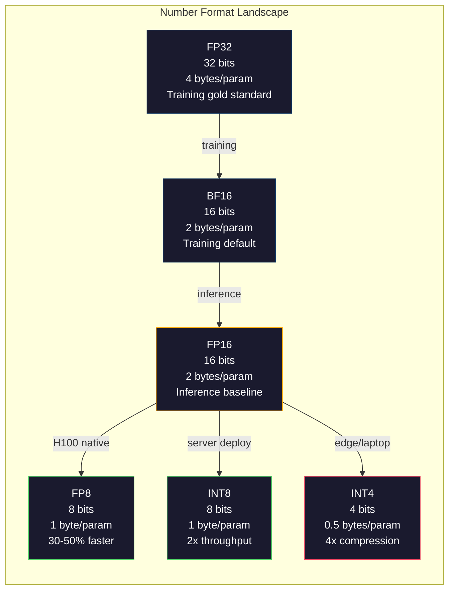
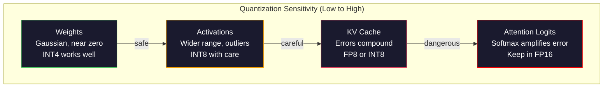
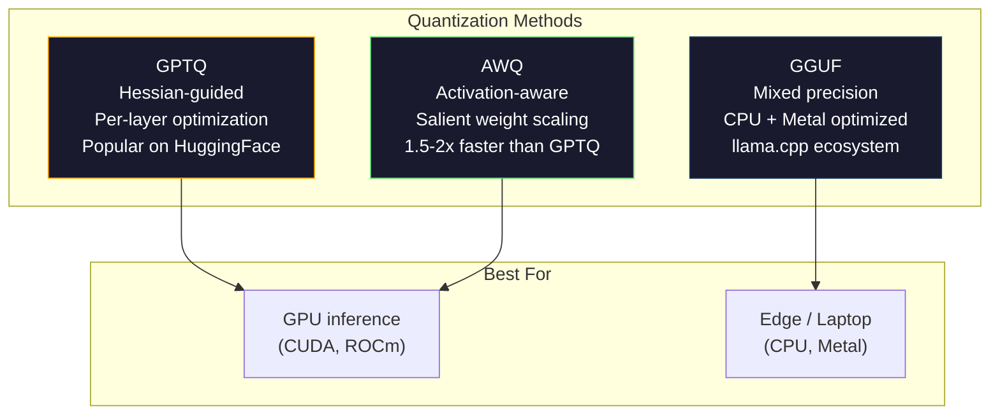

# Quantization: Tối ưu hóa kích thước mô hình

> Một mô hình 70B ở định dạng FP16 cần 140GB VRAM. Chỉ riêng trọng số đã chiếm hai GPU A100. Nếu lượng tử hóa về FP8: chỉ cần một GPU 80GB. Nếu là INT4: có thể chạy trên MacBook.

**Type:** Build
**Languages:** Python (với numpy)
**Prerequisites:** Giai đoạn 10, Bài học 01-10 (LLMs from Scratch)
**Time:** ~120 phút

## Mục tiêu học tập

- Triển khai lượng tử hóa đối xứng (symmetric) và bất đối xứng (asymmetric) từ FP16 sang INT8 và INT4, bao gồm kỹ thuật scaling theo tensor và theo kênh (per-channel).
- Tính toán khả năng tiết kiệm bộ nhớ từ lượng tử hóa và xác định độ chính xác nào phù hợp với VRAM của GPU hiện có.
- Giải thích sự khác biệt giữa lượng tử hóa sau huấn luyện (PTQ) và lượng tử hóa có nhận thức trong huấn luyện (QAT).
- Áp dụng GPTQ hoặc AWQ để lượng tử hóa một mô hình thực tế và đo lường sự đánh đổi giữa độ chính xác và bộ nhớ trên một benchmark.

## Vấn đề

Llama 3 70B có 70 tỷ tham số. Mỗi tham số là một số dấu phẩy động 16-bit. Tổng cộng là 140 tỷ byte, tương đương 140GB. Một GPU A100 đơn lẻ chỉ có 80GB VRAM. Bạn thậm chí không thể tải trọng số, chứ đừng nói đến việc chạy inference trên một GPU duy nhất. Bạn cần hai chiếc A100 với chi phí $2/giờ mỗi chiếc chỉ để phục vụ một mô hình.

Nhưng 16 bit cho mỗi tham số là lãng phí. Hầu hết các trọng số trong mạng thần kinh tập trung gần bằng 0. Toàn bộ dải động của FP16 (từ 0.000000059 đến 65,504) hầu như không được sử dụng hết. Nếu bạn đo phân phối thực tế của các trọng số trong Llama 3 70B, 95% trong số đó nằm trong khoảng từ -0.1 đến +0.1. Bạn đang lãng phí 16 bit để biểu diễn các giá trị vốn có thể nằm gọn trong 4 bit.

Lượng tử hóa thay thế các số có độ chính xác cao bằng các số có độ chính xác thấp hơn. Chuyển từ FP16 sang FP8 giúp giảm một nửa bộ nhớ. Từ FP16 sang INT4 giúp giảm xuống còn một phần tư. Mô hình 140GB đó trở thành 35GB. Nó vừa vặn trên một GPU tiêu dùng. Nếu đẩy xuống lượng tử hóa 2-bit (mạnh tay, mất mát dữ liệu, nhưng dùng được cho một số tác vụ), cùng mô hình đó có thể chạy trên một chiếc laptop 16GB.

Cái giá phải trả là độ chính xác. Mỗi bit bạn loại bỏ sẽ làm mất thông tin. Câu hỏi là bạn mất bao nhiêu độ chính xác và ở đâu. Một mô hình INT4 được lượng tử hóa tốt vẫn giữ lại 95-99% chất lượng gốc trên hầu hết các benchmark. Một cách lượng tử hóa INT4 ngây thơ có thể phá hủy hoàn toàn mô hình. Sự khác biệt nằm ở kỹ thuật.

Các bản lượng tử hóa cộng đồng của Llama 3 sang INT4 bằng GPTQ cho thấy mất khoảng 1-2 điểm perplexity trên WikiText. Mistral đã phát hành các checkpoint FP8 của Mixtral 8x22B với chất lượng không giảm đáng kể trên MMLU. Định dạng GGUF hỗ trợ llama.cpp, cho phép chạy các mô hình 70B trên MacBook với chip dòng M. Lượng tử hóa không phải là một thủ thuật "hack". Đó là lộ trình triển khai tiêu chuẩn cho mọi mô hình lớn hơn 7B.

## Khái niệm

### Định dạng số: Mỗi bit làm gì

Mỗi số dấu phẩy động có ba phần: dấu (sign), số mũ (exponent) và phần định trị (mantissa - còn gọi là significand). Dấu chiếm một bit. Số mũ xác định dải giá trị (số đó có thể lớn hoặc nhỏ đến mức nào). Phần định trị xác định độ chính xác (bạn có bao nhiêu chữ số thập phân).

```
FP32:  [1 sign] [8 exponent] [23 mantissa]  = 32 bits
FP16:  [1 sign] [5 exponent] [10 mantissa]  = 16 bits
BF16:  [1 sign] [8 exponent] [7  mantissa]  = 16 bits
FP8:   [1 sign] [4 exponent] [3  mantissa]  = 8  bits (E4M3)
FP8:   [1 sign] [5 exponent] [2  mantissa]  = 8  bits (E5M2)
INT8:  [1 sign] [7 value]                   = 8  bits (uniform steps)
INT4:  [1 sign] [3 value]                   = 4  bits (16 levels total)
```

**FP32** là độ chính xác đầy đủ. 23 bit định trị cho bạn khoảng 7 chữ số thập phân chính xác. Dải giá trị: khoảng 1.2 x 10^-38 đến 3.4 x 10^38. Việc huấn luyện trước đây diễn ra hoàn toàn bằng FP32. Nó vẫn được dùng cho việc tích lũy (tổng dồn trong quá trình nhân ma trận).

**FP16** giảm một nửa số bit. 10 bit định trị cho khoảng 3.3 chữ số thập phân. Số mũ giảm xuống còn 5 bit, làm giảm đáng kể dải giá trị (giá trị tối đa ~65,504). Điều này ổn với trọng số (vốn tập trung gần 0) nhưng nguy hiểm với các activation và gradient có thể tăng vọt trong quá trình huấn luyện. Huấn luyện FP16 đòi hỏi kỹ thuật loss scaling để ngăn chặn hiện tượng underflow.

**BF16** (Brain Float 16) giữ lại số mũ 8-bit từ FP32 nhưng giảm phần định trị xuống còn 7 bit. Cùng dải giá trị với FP32, độ chính xác thấp hơn FP16. Google thiết kế nó dành riêng cho deep learning. Trực giác là: dải giá trị quan trọng hơn độ chính xác đối với mạng thần kinh. Một gradient 10^-20 bị underflow về 0 trong FP16 vẫn tồn tại trong BF16. Một trọng số 0.07342 làm tròn thành 0.0734 trong BF16 là đủ gần. Mọi quá trình huấn luyện hiện đại đều sử dụng BF16 hoặc hỗn hợp BF16/FP32.

**FP8** có hai loại. E4M3 (4 bit mũ, 3 bit định trị) được dùng cho trọng số và activation trong quá trình inference. E5M2 (5 bit mũ, 2 bit định trị) được dùng cho gradient trong quá trình huấn luyện nơi dải giá trị quan trọng hơn độ chính xác. Inference FP8 trên GPU H100 đạt tốc độ nhanh hơn 30-50% so với FP16 mà chất lượng hầu như không đổi.

**INT8** là định dạng số nguyên. Không có số mũ, không có định trị. Chỉ có 256 giá trị cách đều nhau từ -128 đến 127. Bạn cần một hệ số tỷ lệ (scale factor) để ánh xạ các trọng số dấu phẩy động vào dải này. Ưu điểm: số học số nguyên nhanh hơn và tiết kiệm năng lượng hơn so với dấu phẩy động. Nhân ma trận INT8 trên A100 đạt 624 TOPS so với 312 TFLOPS của FP16.

**INT4** tiến xa hơn nữa. Chỉ có 16 giá trị khả dĩ. Hệ số tỷ lệ đóng vai trò quan trọng. Chất lượng phụ thuộc hoàn toàn vào cách bạn chọn tỷ lệ và trọng số nào bạn lượng tử hóa. Các phương pháp INT4 hiện đại (GPTQ, AWQ) giữ lại hơn 95% chất lượng mô hình gốc.



### Lượng tử hóa hoạt động như thế nào

Thao tác cốt lõi rất đơn giản. Lấy một tensor các giá trị dấu phẩy động, tìm một hệ số tỷ lệ, nhân, làm tròn đến số nguyên gần nhất và lưu trữ các số nguyên cùng với hệ số tỷ lệ đó.

**Lượng tử hóa (Quantize):**
```
scale = max(abs(tensor)) / max_int_value
quantized = round(tensor / scale)
```

**Giải lượng tử hóa (Dequantize):**
```
reconstructed = quantized * scale
```

Đối với INT8 với dải đối xứng (-127 đến 127):
```
scale = max(abs(tensor)) / 127
quantized = clamp(round(tensor / scale), -128, 127)
```

Sai số chính là sai số làm tròn. Mỗi giá trị có thể lệch tối đa `scale / 2`. Tổng sai số trên một lớp phụ thuộc vào số lượng trọng số bạn có và mức độ nhạy cảm của mô hình đối với các nhiễu loạn trong các trọng số đó.

**Lượng tử hóa theo tensor so với theo kênh (per-tensor vs per-channel).** Lượng tử hóa theo tensor sử dụng một hệ số tỷ lệ cho toàn bộ ma trận trọng số. Đơn giản nhưng gây mất mát dữ liệu: nếu một cột có giá trị lớn và cột khác có giá trị nhỏ, các giá trị nhỏ sẽ mất hầu hết độ chính xác. Lượng tử hóa theo kênh sử dụng một hệ số tỷ lệ cho mỗi kênh đầu ra (mỗi hàng hoặc cột của ma trận trọng số). Tốn kém hơn (bạn lưu trữ N hệ số tỷ lệ thay vì 1) nhưng chất lượng tốt hơn đáng kể. Mọi phương pháp lượng tử hóa trong sản xuất đều sử dụng theo kênh hoặc độ chi tiết cao hơn.

**Lượng tử hóa bất đối xứng (Asymmetric quantization)** thêm một độ lệch zero-point: `quantized = round(tensor / scale) + zero_point`. Điều này xử lý các phân phối không tập trung tại 0. Ví dụ, các activation ReLU luôn không âm. Lượng tử hóa đối xứng lãng phí một nửa dải số nguyên cho các giá trị âm không bao giờ xuất hiện. Lượng tử hóa bất đối xứng ánh xạ dải thực tế [min, max] vào toàn bộ dải số nguyên.

### Phân cấp độ nhạy cảm

Không phải mọi thứ trong mô hình đều chịu đựng lượng tử hóa như nhau. Có một phân cấp rõ ràng.

**Trọng số (bền vững nhất).** Trọng số mô hình thay đổi chậm trong quá trình huấn luyện và tuân theo phân phối gần giống Gaussian tập trung gần 0. Chúng lượng tử hóa rất tốt. Trọng số INT8 với tỷ lệ theo kênh tạo ra kết quả gần như không mất mát. INT4 đòi hỏi các phương pháp tinh vi hơn nhưng vẫn hoạt động tốt.

**Activation (độ nhạy trung bình).** Activation là các giá trị trung gian chảy qua mạng trong quá trình inference. Chúng có dải động rộng hơn trọng số và chứa các giá trị ngoại lai (outliers). Một attention head đơn lẻ có thể tạo ra các giá trị activation lớn gấp 100 lần giá trị trung bình. Những giá trị ngoại lai này rất quan trọng đối với chất lượng mô hình. Lượng tử hóa chúng một cách ngây thơ sẽ phá hủy thông tin. Giải pháp: giữ các kênh ngoại lai ở độ chính xác cao hơn (LLM.int8()), sử dụng tỷ lệ activation theo token hoặc theo kênh.

**KV cache (độ nhạy cao).** Bộ nhớ đệm key-value lưu trữ các trạng thái attention cho tất cả các token trước đó. Ở độ dài ngữ cảnh lớn, KV cache chiếm ưu thế về bộ nhớ. Đối với mô hình 70B ở ngữ cảnh 32K, riêng KV cache đã là 40GB ở định dạng FP16. Lượng tử hóa KV cache sang FP8 hoặc INT8 giúp tiết kiệm bộ nhớ đáng kể nhưng bất kỳ sai số nào cũng sẽ tích lũy qua tất cả các tính toán attention trong tương lai. Tác động chất lượng tỷ lệ thuận với độ dài chuỗi.

**Attention logits (nhạy cảm nhất).** Hàm softmax trong attention rất nhạy cảm với những thay đổi nhỏ trong đầu vào của nó. Một sai số lượng tử hóa 0.01 trong logit trước softmax có thể làm thay đổi đáng kể phân phối attention. Hầu hết các lược đồ lượng tử hóa đều giữ tính toán attention ở độ chính xác cao hơn (FP16 hoặc BF16) ngay cả khi mọi thứ khác đã được lượng tử hóa.



### PTQ so với QAT

**Lượng tử hóa sau huấn luyện (PTQ)** lượng tử hóa một mô hình đã được huấn luyện. Không cần huấn luyện lại. Bạn lấy các trọng số FP16, tính toán hệ số tỷ lệ, làm tròn và triển khai. Nhanh (vài phút đến vài giờ) và rẻ. Hoạt động tốt cho INT8 và FP8. Đối với INT4, PTQ ngây thơ thường thất bại nặng nề vì sai số làm tròn tích lũy. Các phương pháp PTQ nâng cao (GPTQ, AWQ) sử dụng dữ liệu hiệu chuẩn (calibration data) để giảm thiểu sai số lượng tử hóa.

**Lượng tử hóa có nhận thức trong huấn luyện (QAT)** chèn các thao tác lượng tử hóa giả vào quá trình lan truyền xuôi (forward pass) trong khi huấn luyện. Mô hình học cách đặt trọng số của nó ở nơi sai số làm tròn nhỏ. Gradient chảy qua lượng tử hóa giả bằng cách sử dụng straight-through estimator (STE): giả định thao tác làm tròn có gradient bằng 1. QAT tạo ra các mô hình INT4 và INT2 tốt hơn PTQ nhưng đòi hỏi một quá trình huấn luyện đầy đủ. Google đã sử dụng QAT cho việc phục vụ mô hình Gemini hiệu quả. Meta đã sử dụng QAT cho một số mục tiêu triển khai Llama.

| Khía cạnh | PTQ | QAT |
|--------|-----|-----|
| Chi phí | Vài phút đến vài giờ | Toàn bộ quá trình huấn luyện |
| Chất lượng ở INT8 | Xuất sắc (< 0.1% mất mát) | Xuất sắc |
| Chất lượng ở INT4 | Tốt với GPTQ/AWQ (1-3% mất mát) | Tốt hơn (< 1% mất mát) |
| Chất lượng ở INT2 | Kém | Dùng được cho một số tác vụ |
| Dữ liệu hiệu chuẩn | 128-1024 ví dụ | Toàn bộ tập dữ liệu huấn luyện |
| Khi nào sử dụng | Triển khai, lặp lại | Chất lượng tối đa ở độ rộng bit thấp |

### GPTQ, AWQ, GGUF

**GPTQ (GPT Quantization)** là một phương pháp PTQ một lần. Nó lượng tử hóa trọng số từng lớp một, sử dụng một tập dữ liệu hiệu chuẩn nhỏ (thường là 128 ví dụ) để đo Hessian (thông tin bậc hai về mức độ nhạy cảm của đầu ra đối với từng trọng số). Các trọng số mà Hessian cho là quan trọng sẽ được lượng tử hóa cẩn thận hơn. GPTQ là phương pháp đầu tiên làm cho lượng tử hóa INT4 trở nên thực tế đối với LLM. TheBloke trên Hugging Face đã phổ biến GPTQ bằng cách phát hành các phiên bản lượng tử hóa của hàng trăm mô hình.

**AWQ (Activation-aware Weight Quantization)** quan sát thấy rằng một phần nhỏ trọng số (khoảng 1%) có tầm quan trọng không cân xứng vì chúng nhân với các giá trị activation lớn. AWQ xác định các trọng số nổi bật này bằng dữ liệu hiệu chuẩn và tăng tỷ lệ của chúng trước khi lượng tử hóa (sau đó giảm tỷ lệ các activation tương ứng). Điều này giữ cho các trọng số quan trọng nằm trong dải mà lượng tử hóa INT4 chính xác. AWQ thường đạt hoặc vượt nhẹ chất lượng của GPTQ trong khi áp dụng nhanh hơn 1.5-2 lần.

**GGUF (GPT-Generated Unified Format)** là định dạng tệp được sử dụng bởi llama.cpp và hệ sinh thái của nó. Nó hỗ trợ lượng tử hóa hỗn hợp: các lớp khác nhau có độ rộng bit khác nhau. Các lớp đầu và cuối (embedding và output head) thường được giữ ở độ chính xác cao hơn. Các lớp giữa nhận INT4 hoặc INT3. Các tệp GGUF là độc lập: trọng số, tokenizer, metadata tất cả trong một tệp. Định dạng này được thiết kế cho CPU inference và Apple Silicon, nơi việc tải toàn bộ mô hình vào bộ nhớ và chạy nhân ma trận trên CPU hoặc Metal GPU là lộ trình tiêu chuẩn. Q4_K_M là biến thể lượng tử hóa GGUF phổ biến nhất, cân bằng giữa chất lượng và kích thước.



### Đo lường chất lượng

Làm thế nào để bạn biết mô hình đã lượng tử hóa của mình vẫn tốt?

**Perplexity.** Chỉ số phổ biến nhất. Càng thấp càng tốt. Tính perplexity trên một tập dữ liệu giữ lại (WikiText-2 là tiêu chuẩn) cho cả mô hình gốc và mô hình đã lượng tử hóa. Delta cho biết lượng tử hóa đã phá hủy bao nhiêu thông tin. Quy tắc ngón tay cái: delta < 0.5 là xuất sắc, 0.5-1.0 là tốt, 1.0-2.0 là chấp nhận được cho hầu hết các tác vụ, > 2.0 nghĩa là có gì đó không ổn.

**Benchmark theo tác vụ.** Chạy mô hình đã lượng tử hóa trên MMLU, HumanEval, GSM8K hoặc bộ đánh giá tùy chỉnh của bạn. So sánh với bản gốc. Lượng tử hóa ảnh hưởng đến các khả năng khác nhau không đồng đều. Các tác vụ toán học và lập trình nhạy cảm với mất mát độ chính xác hơn kiến thức chung.

**So sánh đầu ra.** Tạo phản hồi từ cả hai mô hình trên cùng một prompt và so sánh. LLM-as-judge (Bài học 10) hoạt động tốt ở đây. Tính tỷ lệ thắng: mô hình đã lượng tử hóa khớp hoặc vượt qua bản gốc trên bao nhiêu phần trăm prompt?

**Độ trễ và thông lượng.** Lượng tử hóa tồn tại để làm cho các mô hình nhanh hơn và rẻ hơn. Đo số token mỗi giây, thời gian đến token đầu tiên và mức sử dụng bộ nhớ. Một mô hình đã lượng tử hóa mà chậm hơn bản gốc thì còn tệ hơn là vô dụng.

| Mô hình | Định dạng | Kích thước | Perplexity (WikiText-2) | MMLU | Token/giây (A100) |
|-------|--------|------|------------------------|------|-------------------|
| Llama 3 70B | FP16 | 140GB | 3.12 | 79.5% | 38 |
| Llama 3 70B | FP8 | 70GB | 3.14 | 79.3% | 55 |
| Llama 3 70B | GPTQ INT4 | 35GB | 4.32 | 77.8% | 72 |
| Llama 3 70B | AWQ INT4 | 35GB | 4.18 | 78.1% | 75 |
| Llama 3 70B | GGUF Q4_K_M | 40GB | 4.25 | 77.9% | 28 (CPU) |

Quy luật: FP8 gần như miễn phí. INT4 tốn 1-2 điểm MMLU nhưng tăng gấp đôi thông lượng và giảm bộ nhớ xuống còn một phần tư. Sự đánh đổi này xứng đáng cho hầu hết mọi triển khai.

### Số liệu thực tế

FP16 sang FP8 trên H100: tăng tốc inference 30-50%, mất mát chất lượng < 0.1%. Đây là kiểu lượng tử hóa "không cần suy nghĩ". Mọi triển khai H100 nên sử dụng nó.

FP16 sang INT8 (LLM.int8()): giảm bộ nhớ 2 lần, mất mát chất lượng < 0.5%. Cách tiếp cận hỗn hợp độ chính xác giữ các tính năng ngoại lai ở FP16 trong khi lượng tử hóa mọi thứ khác sang INT8.

FP16 sang INT4 (GPTQ/AWQ): giảm bộ nhớ 4 lần, mất mát chất lượng 1-3% tùy thuộc vào mô hình và phương pháp. Cho phép chạy các mô hình 70B trên một GPU 48GB duy nhất.

FP16 sang INT4 (GGUF Q4_K_M): giảm bộ nhớ 3.5 lần, mất mát chất lượng 1-2%. Tối ưu hóa cho CPU inference. Một mô hình 70B ở Q4_K_M khoảng 40GB và chạy ở tốc độ 10-15 token/giây trên M3 Max với 64GB.

FP16 sang INT2: giảm bộ nhớ 8 lần, mất mát chất lượng 5-15%. Chỉ khả thi cho các tác vụ hẹp cụ thể nơi bạn có thể chấp nhận sự suy giảm. Biên giới nghiên cứu, chưa sẵn sàng cho sản xuất để sử dụng chung.

```figure
quantization
```

## Xây dựng

### Bước 1: Biểu diễn định dạng số

Xây dựng biểu diễn cấp bit của từng định dạng để thấy chính xác dấu, số mũ và phần định trị làm gì.

```python
import numpy as np


def float_to_fp32_bits(value):
    bits = np.float32(value).view(np.uint32)
    sign = (bits >> 31) & 1
    exponent = (bits >> 23) & 0xFF
    mantissa = bits & 0x7FFFFF
    return {"sign": int(sign), "exponent": int(exponent), "mantissa": int(mantissa),
            "exponent_bits": format(int(exponent), '08b'),
            "mantissa_bits": format(int(mantissa), '023b'),
            "value": float(value),
            "actual_exponent": int(exponent) - 127}


def float_to_fp16_bits(value):
    fp16 = np.float16(value)
    bits = fp16.view(np.uint16)
    sign = (bits >> 15) & 1
    exponent = (bits >> 10) & 0x1F
    mantissa = bits & 0x3FF
    return {"sign": int(sign), "exponent": int(exponent), "mantissa": int(mantissa),
            "exponent_bits": format(int(exponent), '05b'),
            "mantissa_bits": format(int(mantissa), '010b'),
            "value": float(fp16),
            "actual_exponent": int(exponent) - 15}


def float_to_bf16_bits(value):
    fp32_bits = np.float32(value).view(np.uint32)
    bf16_bits = (fp32_bits >> 16).astype(np.uint16)
    sign = (bf16_bits >> 15) & 1
    exponent = (bf16_bits >> 7) & 0xFF
    mantissa = bf16_bits & 0x7F
    reconstructed = np.uint32(bf16_bits.astype(np.uint32) << 16).view(np.float32)
    return {"sign": int(sign), "exponent": int(exponent), "mantissa": int(mantissa),
            "exponent_bits": format(int(exponent), '08b'),
            "mantissa_bits": format(int(mantissa), '07b'),
            "value": float(reconstructed),
            "actual_exponent": int(exponent) - 127}


def simulate_fp8_e4m3(value):
    sign = 1 if value < 0 else 0
    abs_val = abs(value)
    max_val = 448.0
    abs_val = min(abs_val, max_val)
    if abs_val == 0:
        return {"sign": sign, "exponent": 0, "mantissa": 0, "value": 0.0,
                "exponent_bits": "0000", "mantissa_bits": "000"}
    exp = int(np.floor(np.log2(abs_val)))
    exp = max(-6, min(8, exp))
    mantissa_val = abs_val / (2.0 ** exp) - 1.0
    mantissa_quant = round(mantissa_val * 8) / 8
    mantissa_quant = max(0, min(0.875, mantissa_quant))
    reconstructed = (1.0 + mantissa_quant) * (2.0 ** exp)
    if sign:
        reconstructed = -reconstructed
    mantissa_int = int(round(mantissa_quant * 8))
    return {"sign": sign, "exponent": exp + 7, "mantissa": mantissa_int,
            "exponent_bits": format(exp + 7, '04b'),
            "mantissa_bits": format(mantissa_int, '03b'),
            "value": float(reconstructed),
            "actual_exponent": exp}


def display_format_comparison(value):
    fp32 = float_to_fp32_bits(value)
    fp16 = float_to_fp16_bits(value)
    bf16 = float_to_bf16_bits(value)
    fp8 = simulate_fp8_e4m3(value)

    print(f"\n  Value: {value}")
    print(f"  {'Format':<8} {'Stored Value':>14} {'Error':>12} {'Sign':>5} {'Exp Bits':>10} {'Man Bits':>25}")
    print(f"  {'-'*76}")
    print(f"  {'FP32':<8} {fp32['value']:>14.6f} {abs(fp32['value'] - value):>12.8f} {fp32['sign']:>5} {fp32['exponent_bits']:>10} {fp32['mantissa_bits']:>25}")
    print(f"  {'FP16':<8} {fp16['value']:>14.6f} {abs(fp16['value'] - value):>12.8f} {fp16['sign']:>5} {fp16['exponent_bits']:>10} {fp16['mantissa_bits']:>25}")
    print(f"  {'BF16':<8} {bf16['value']:>14.6f} {abs(bf16['value'] - value):>12.8f} {bf16['sign']:>5} {bf16['exponent_bits']:>10} {bf16['mantissa_bits']:>25}")
    print(f"  {'FP8e4m3':<8} {fp8['value']:>14.6f} {abs(fp8['value'] - value):>12.8f} {fp8['sign']:>5} {fp8['exponent_bits']:>10} {fp8['mantissa_bits']:>25}")
```

### Bước 2: Lượng tử hóa đối xứng (Theo Tensor và Theo Kênh)

Các thao tác lượng tử hóa cơ bản. Theo tensor sử dụng một tỷ lệ cho toàn bộ ma trận. Theo kênh sử dụng một tỷ lệ cho mỗi hàng hoặc cột.

```python
def quantize_symmetric(tensor, num_bits=8):
    qmin = -(2 ** (num_bits - 1))
    qmax = 2 ** (num_bits - 1) - 1
    abs_max = np.max(np.abs(tensor))
    if abs_max == 0:
        return np.zeros_like(tensor, dtype=np.int32), 1.0
    scale = abs_max / qmax
    quantized = np.clip(np.round(tensor / scale), qmin, qmax).astype(np.int32)
    return quantized, float(scale)


def dequantize_symmetric(quantized, scale):
    return quantized.astype(np.float64) * scale


def quantize_per_channel(tensor, num_bits=8, axis=0):
    qmin = -(2 ** (num_bits - 1))
    qmax = 2 ** (num_bits - 1) - 1

    if axis == 0:
        abs_max = np.max(np.abs(tensor), axis=1, keepdims=True)
    else:
        abs_max = np.max(np.abs(tensor), axis=0, keepdims=True)

    abs_max = np.where(abs_max == 0, 1.0, abs_max)
    scales = abs_max / qmax
    quantized = np.clip(np.round(tensor / scales), qmin, qmax).astype(np.int32)
    return quantized, scales.squeeze()


def dequantize_per_channel(quantized, scales, axis=0):
    if axis == 0:
        return quantized.astype(np.float64) * scales.reshape(-1, 1)
    else:
        return quantized.astype(np.float64) * scales.reshape(1, -1)


def quantize_asymmetric(tensor, num_bits=8):
    qmin = 0
    qmax = 2 ** num_bits - 1
    t_min = np.min(tensor)
    t_max = np.max(tensor)
    if t_max == t_min:
        return np.zeros_like(tensor, dtype=np.int32), 1.0, 0
    scale = (t_max - t_min) / (qmax - qmin)
    zero_point = int(np.round(qmin - t_min / scale))
    zero_point = max(qmin, min(qmax, zero_point))
    quantized = np.clip(np.round(tensor / scale + zero_point), qmin, qmax).astype(np.int32)
    return quantized, float(scale), int(zero_point)


def dequantize_asymmetric(quantized, scale, zero_point):
    return (quantized.astype(np.float64) - zero_point) * scale
```

### Bước 3: Đo lường chất lượng

Đo lường lượng thông tin mà lượng tử hóa phá hủy. Sai số bình phương trung bình, tỷ lệ tín hiệu trên nhiễu và độ tương đồng cosine giữa tensor gốc và tensor được tái tạo.

```python
def quantization_error(original, reconstructed):
    diff = original - reconstructed
    mse = float(np.mean(diff ** 2))
    rmse = float(np.sqrt(mse))
    max_error = float(np.max(np.abs(diff)))
    signal_power = float(np.mean(original ** 2))
    snr_db = 10 * np.log10(signal_power / max(mse, 1e-20))

    orig_flat = original.flatten()
    recon_flat = reconstructed.flatten()
    norm_orig = np.linalg.norm(orig_flat)
    norm_recon = np.linalg.norm(recon_flat)
    if norm_orig == 0 or norm_recon == 0:
        cosine_sim = 0.0
    else:
        cosine_sim = float(np.dot(orig_flat, recon_flat) / (norm_orig * norm_recon))

    return {"mse": mse, "rmse": rmse, "max_error": max_error,
            "snr_db": float(snr_db), "cosine_similarity": cosine_sim}


def compare_quantization_methods(tensor, num_bits=8):
    q_pt, s_pt = quantize_symmetric(tensor, num_bits)
    recon_pt = dequantize_symmetric(q_pt, s_pt)
    err_pt = quantization_error(tensor, recon_pt)

    q_pc, s_pc = quantize_per_channel(tensor, num_bits, axis=0)
    recon_pc = dequantize_per_channel(q_pc, s_pc, axis=0)
    err_pc = quantization_error(tensor, recon_pc)

    q_asym, s_asym, zp = quantize_asymmetric(tensor, num_bits)
    recon_asym = dequantize_asymmetric(q_asym, s_asym, zp)
    err_asym = quantization_error(tensor, recon_asym)

    print(f"\n  Quantization Comparison ({num_bits}-bit, tensor shape {tensor.shape}):")
    print(f"  {'Method':<20} {'MSE':>12} {'SNR (dB)':>10} {'Cosine Sim':>12} {'Max Error':>12}")
    print(f"  {'-'*68}")
    print(f"  {'Per-tensor sym':<20} {err_pt['mse']:>12.8f} {err_pt['snr_db']:>10.2f} {err_pt['cosine_similarity']:>12.8f} {err_pt['max_error']:>12.8f}")
    print(f"  {'Per-channel sym':<20} {err_pc['mse']:>12.8f} {err_pc['snr_db']:>10.2f} {err_pc['cosine_similarity']:>12.8f} {err_pc['max_error']:>12.8f}")
    print(f"  {'Asymmetric':<20} {err_asym['mse']:>12.8f} {err_asym['snr_db']:>10.2f} {err_asym['cosine_similarity']:>12.8f} {err_asym['max_error']:>12.8f}")

    return {"per_tensor": err_pt, "per_channel": err_pc, "asymmetric": err_asym}
```

### Bước 4: Quét độ rộng bit

Lượng tử hóa cùng một tensor ở các độ rộng bit khác nhau (2, 3, 4, 8, 16) và đo chất lượng ở mỗi cấp độ. Điều này cho thấy chính xác nơi "vách đá chất lượng" nằm ở đâu.

```python
def bit_width_sweep(tensor):
    print(f"\n  Bit-Width Sweep (tensor shape {tensor.shape}):")
    print(f"  {'Bits':>6} {'Levels':>8} {'MSE':>14} {'SNR (dB)':>10} {'Cosine Sim':>12} {'Compression':>12}")
    print(f"  {'-'*64}")

    results = []
    for bits in [2, 3, 4, 8, 16]:
        q, s = quantize_per_channel(tensor, bits, axis=0)
        recon = dequantize_per_channel(q, s, axis=0)
        err = quantization_error(tensor, recon)
        levels = 2 ** bits
        compression = 32.0 / bits

        print(f"  {bits:>6} {levels:>8} {err['mse']:>14.8f} {err['snr_db']:>10.2f} {err['cosine_similarity']:>12.8f} {compression:>11.1f}x")
        results.append({"bits": bits, "levels": levels, "error": err, "compression": compression})

    return results
```

### Bước 5: Thí nghiệm độ nhạy cảm

Mô phỏng việc lượng tử hóa các phần khác nhau của một transformer và đo lường thành phần nào nhạy cảm nhất. Điều này chứng minh phân cấp độ nhạy cảm: trọng số < activation < KV cache < attention.

```python
def simulate_transformer_layer(input_data, weights, kv_scale=1.0):
    hidden = input_data @ weights["qkv"]
    seq_len = hidden.shape[1]
    d_model = weights["qkv"].shape[1] // 3
    q, k, v = hidden[:, :, :d_model], hidden[:, :, d_model:2*d_model], hidden[:, :, 2*d_model:]

    attn_scores = (q @ k.transpose(0, 2, 1)) / np.sqrt(d_model) * kv_scale
    attn_max = np.max(attn_scores, axis=-1, keepdims=True)
    attn_exp = np.exp(attn_scores - attn_max)
    attn_weights = attn_exp / np.sum(attn_exp, axis=-1, keepdims=True)

    attn_output = attn_weights @ v
    output = attn_output @ weights["out"]
    return output, {"q": q, "k": k, "v": v, "attn_scores": attn_scores,
                    "attn_weights": attn_weights, "attn_output": attn_output}


def sensitivity_experiment(batch_size=2, seq_len=16, d_model=64, num_bits=8):
    np.random.seed(42)
    input_data = np.random.randn(batch_size, seq_len, d_model) * 0.1

    weights = {
        "qkv": np.random.randn(d_model, 3 * d_model) * (2.0 / d_model) ** 0.5,
        "out": np.random.randn(d_model, d_model) * (2.0 / d_model) ** 0.5,
    }

    baseline_output, baseline_internals = simulate_transformer_layer(input_data, weights)

    experiments = {}

    q_qkv, s_qkv = quantize_per_channel(weights["qkv"], num_bits, axis=0)
    q_out, s_out = quantize_per_channel(weights["out"], num_bits, axis=0)
    quantized_weights = {
        "qkv": dequantize_per_channel(q_qkv, s_qkv, axis=0),
        "out": dequantize_per_channel(q_out, s_out, axis=0),
    }
    weight_quant_output, _ = simulate_transformer_layer(input_data, quantized_weights)
    experiments["Weights only"] = quantization_error(baseline_output, weight_quant_output)

    _, fresh_internals = simulate_transformer_layer(input_data, weights)
    q_act, s_act = quantize_per_channel(
        fresh_internals["attn_output"].reshape(-1, d_model), num_bits, axis=0
    )
    quant_attn_out = dequantize_per_channel(q_act, s_act, axis=0).reshape(batch_size, seq_len, d_model)
    act_quant_output = quant_attn_out @ weights["out"]
    experiments["Activations only"] = quantization_error(baseline_output, act_quant_output)

    q_k, s_k = quantize_per_channel(fresh_internals["k"].reshape(-1, d_model), num_bits, axis=0)
    q_v, s_v = quantize_per_channel(fresh_internals["v"].reshape(-1, d_model), num_bits, axis=0)
    quant_k = dequantize_per_channel(q_k, s_k, axis=0).reshape(batch_size, seq_len, d_model)
    quant_v = dequantize_per_channel(q_v, s_v, axis=0).reshape(batch_size, seq_len, d_model)
    attn_scores_kv = (fresh_internals["q"] @ quant_k.transpose(0, 2, 1)) / np.sqrt(d_model)
    attn_max_kv = np.max(attn_scores_kv, axis=-1, keepdims=True)
    attn_exp_kv = np.exp(attn_scores_kv - attn_max_kv)
    attn_weights_kv = attn_exp_kv / np.sum(attn_exp_kv, axis=-1, keepdims=True)
    kv_quant_output = (attn_weights_kv @ quant_v) @ weights["out"]
    experiments["KV cache only"] = quantization_error(baseline_output, kv_quant_output)

    noise_scale = np.std(fresh_internals["attn_scores"]) * 0.05
    noisy_scores = fresh_internals["attn_scores"] + np.random.randn(*fresh_internals["attn_scores"].shape) * noise_scale
    noisy_max = np.max(noisy_scores, axis=-1, keepdims=True)
    noisy_exp = np.exp(noisy_scores - noisy_max)
    noisy_weights = noisy_exp / np.sum(noisy_exp, axis=-1, keepdims=True)
    attn_quant_output = (noisy_weights @ fresh_internals["v"]) @ weights["out"]
    experiments["Attention logits (5% noise)"] = quantization_error(baseline_output, attn_quant_output)

    print(f"\n  Sensitivity Experiment ({num_bits}-bit quantization):")
    print(f"  {'Component':<30} {'MSE':>14} {'SNR (dB)':>10} {'Cosine Sim':>12}")
    print(f"  {'-'*68}")
    for name, err in sorted(experiments.items(), key=lambda x: x[1]["mse"]):
        print(f"  {name:<30} {err['mse']:>14.8f} {err['snr_db']:>10.2f} {err['cosine_similarity']:>12.8f}")

    return experiments
```

### Bước 6: Mô phỏng GPTQ

GPTQ lượng tử hóa từng cột một, sử dụng Hessian để quyết định cách phân phối sai số làm tròn. Đây là phiên bản đơn giản hóa nắm bắt ý tưởng cốt lõi: sử dụng dữ liệu hiệu chuẩn để đo tầm quan trọng của trọng số, sau đó lượng tử hóa các trọng số ít quan trọng hơn một cách mạnh tay hơn.

```python
def simulated_gptq(weight_matrix, calibration_inputs, num_bits=4):
    n_in, n_out = weight_matrix.shape
    qmin = -(2 ** (num_bits - 1))
    qmax = 2 ** (num_bits - 1) - 1

    H = np.zeros((n_in, n_in))
    for x in calibration_inputs:
        x = x.reshape(-1, 1) if x.ndim == 1 else x
        for row in range(x.shape[0]):
            xi = x[row].reshape(-1, 1)
            H += xi @ xi.T
    H /= len(calibration_inputs)
    H += np.eye(n_in) * 1e-4

    weight_importance = np.diag(H)

    quantized = np.zeros_like(weight_matrix, dtype=np.int32)
    scales = np.zeros(n_out)
    errors = np.zeros(n_out)

    W = weight_matrix.copy()

    for col in range(n_out):
        w_col = W[:, col]
        abs_max = np.max(np.abs(w_col))
        if abs_max == 0:
            scales[col] = 1.0
            continue
        scale = abs_max / qmax
        scales[col] = scale

        q_col = np.clip(np.round(w_col / scale), qmin, qmax).astype(np.int32)
        quantized[:, col] = q_col

        quant_error = w_col - q_col * scale
        errors[col] = np.sqrt(np.mean(quant_error ** 2))

        if col < n_out - 1:
            importance_weights = weight_importance / (np.max(weight_importance) + 1e-10)
            for next_col in range(col + 1, min(col + 4, n_out)):
                compensation = quant_error * importance_weights * 0.1
                W[:, next_col] += compensation

    return quantized, scales, {"column_errors": errors,
                               "mean_error": float(np.mean(errors)),
                               "max_error": float(np.max(errors))}


def dequantize_gptq(quantized, scales):
    result = np.zeros_like(quantized, dtype=np.float64)
    for col in range(quantized.shape[1]):
        result[:, col] = quantized[:, col] * scales[col]
    return result
```

### Bước 7: Mô phỏng AWQ

AWQ xác định các trọng số nổi bật (những trọng số nhân với activation lớn) và bảo vệ chúng bằng cách thay đổi tỷ lệ trước khi lượng tử hóa.

```python
def simulated_awq(weight_matrix, calibration_inputs, num_bits=4, salient_fraction=0.01):
    n_in, n_out = weight_matrix.shape
    qmin = -(2 ** (num_bits - 1))
    qmax = 2 ** (num_bits - 1) - 1

    activation_magnitudes = np.zeros(n_in)
    for x in calibration_inputs:
        if x.ndim == 1:
            activation_magnitudes += np.abs(x)
        else:
            activation_magnitudes += np.mean(np.abs(x), axis=0)
    activation_magnitudes /= len(calibration_inputs)

    n_salient = max(1, int(n_in * salient_fraction))
    salient_indices = np.argsort(activation_magnitudes)[-n_salient:]

    scale_factors = np.ones(n_in)
    for idx in salient_indices:
        col_max = np.max(np.abs(weight_matrix[idx, :]))
        if col_max > 0:
            scale_factors[idx] = min(4.0, 1.0 / (col_max + 1e-8) * np.mean(np.abs(weight_matrix)))

    scaled_weights = weight_matrix * scale_factors.reshape(-1, 1)

    quantized, scales = quantize_per_channel(scaled_weights, num_bits, axis=0)
    dequantized = dequantize_per_channel(quantized, scales, axis=0)

    result = dequantized / scale_factors.reshape(-1, 1)

    err = quantization_error(weight_matrix, result)

    return result, {"salient_indices": salient_indices,
                    "scale_factors": scale_factors[salient_indices],
                    "error": err,
                    "n_salient": n_salient}
```

### Bước 8: Quy trình đầy đủ

Kết nối mọi thứ lại với nhau. So sánh lượng tử hóa ngây thơ, theo kênh, GPTQ và AWQ trên cùng một ma trận trọng số.

```python
def full_quantization_comparison(d_in=256, d_out=512, num_bits=4, n_calibration=32):
    np.random.seed(42)

    weight = np.random.randn(d_in, d_out) * 0.02
    outlier_rows = np.random.choice(d_in, size=5, replace=False)
    weight[outlier_rows] *= 10

    calibration = [np.random.randn(8, d_in) * 0.1 for _ in range(n_calibration)]

    q_naive, s_naive = quantize_symmetric(weight, num_bits)
    recon_naive = dequantize_symmetric(q_naive, s_naive)
    err_naive = quantization_error(weight, recon_naive)

    q_pc, s_pc = quantize_per_channel(weight, num_bits, axis=0)
    recon_pc = dequantize_per_channel(q_pc, s_pc, axis=0)
    err_pc = quantization_error(weight, recon_pc)

    q_gptq, s_gptq, gptq_info = simulated_gptq(weight, calibration, num_bits)
    recon_gptq = dequantize_gptq(q_gptq, s_gptq)
    err_gptq = quantization_error(weight, recon_gptq)

    recon_awq, awq_info = simulated_awq(weight, calibration, num_bits)
    err_awq = awq_info["error"]

    print(f"\n  Full Quantization Comparison ({num_bits}-bit, {d_in}x{d_out} matrix)")
    print(f"  Matrix has {len(outlier_rows)} outlier rows (10x scale)")
    print()
    print(f"  {'Method':<20} {'MSE':>14} {'SNR (dB)':>10} {'Cosine Sim':>12}")
    print(f"  {'-'*58}")
    print(f"  {'Naive per-tensor':<20} {err_naive['mse']:>14.8f} {err_naive['snr_db']:>10.2f} {err_naive['cosine_similarity']:>12.8f}")
    print(f"  {'Per-channel':<20} {err_pc['mse']:>14.8f} {err_pc['snr_db']:>10.2f} {err_pc['cosine_similarity']:>12.8f}")
    print(f"  {'Simulated GPTQ':<20} {err_gptq['mse']:>14.8f} {err_gptq['snr_db']:>10.2f} {err_gptq['cosine_similarity']:>12.8f}")
    print(f"  {'Simulated AWQ':<20} {err_awq['mse']:>14.8f} {err_awq['snr_db']:>10.2f} {err_awq['cosine_similarity']:>12.8f}")

    test_input = np.random.randn(4, d_in) * 0.1
    baseline = test_input @ weight
    output_naive = test_input @ recon_naive
    output_pc = test_input @ recon_pc
    output_gptq = test_input @ recon_gptq
    output_awq = test_input @ recon_awq

    print(f"\n  End-to-End Output Error (matmul with test input):")
    print(f"  {'Method':<20} {'Output MSE':>14} {'Output Cosine':>14}")
    print(f"  {'-'*50}")
    for name, output in [("Naive", output_naive), ("Per-channel", output_pc),
                          ("GPTQ", output_gptq), ("AWQ", output_awq)]:
        out_err = quantization_error(baseline, output)
        print(f"  {name:<20} {out_err['mse']:>14.8f} {out_err['cosine_similarity']:>14.8f}")

    return {"naive": err_naive, "per_channel": err_pc, "gptq": err_gptq, "awq": err_awq}


def memory_calculator(num_params_billions, bits_per_param):
    bytes_per_param = bits_per_param / 8
    total_bytes = num_params_billions * 1e9 * bytes_per_param
    total_gb = total_bytes / (1024 ** 3)
    return total_gb


def print_memory_table():
    print("\n  Memory Requirements by Model and Precision:")
    print(f"  {'Model':<15} {'FP32':>8} {'FP16':>8} {'FP8':>8} {'INT8':>8} {'INT4':>8} {'INT2':>8}")
    print(f"  {'-'*64}")
    for name, params in [("7B", 7), ("13B", 13), ("34B", 34), ("70B", 70), ("405B", 405)]:
        fp32 = memory_calculator(params, 32)
        fp16 = memory_calculator(params, 16)
        fp8 = memory_calculator(params, 8)
        int8 = memory_calculator(params, 8)
        int4 = memory_calculator(params, 4)
        int2 = memory_calculator(params, 2)
        print(f"  {name:<15} {fp32:>7.1f}G {fp16:>7.1f}G {fp8:>7.1f}G {int8:>7.1f}G {int4:>7.1f}G {int2:>7.1f}G")


if __name__ == "__main__":
    np.random.seed(42)

    print("=" * 70)
    print("QUANTIZATION: MAKING MODELS FIT")
    print("=" * 70)

    print("\nSTEP 1: Number Format Comparison")
    print("-" * 50)
    for val in [0.1, 3.14159, -0.00073, 42.5, 0.0000012]:
        display_format_comparison(val)

    print("\n\nSTEP 2: Memory Requirements")
    print("-" * 50)
    print_memory_table()

    print("\n\nSTEP 3: Quantization Methods Comparison")
    print("-" * 50)
    weight_matrix = np.random.randn(128, 256) * 0.02
    weight_matrix[0] *= 15
    weight_matrix[42] *= 8
    compare_quantization_methods(weight_matrix, num_bits=8)
    compare_quantization_methods(weight_matrix, num_bits=4)

    print("\n\nSTEP 4: Bit-Width Sweep")
    print("-" * 50)
    sweep_tensor = np.random.randn(64, 128) * 0.05
    bit_width_sweep(sweep_tensor)

    print("\n\nSTEP 5: Sensitivity Experiment")
    print("-" * 50)
    print("\n  INT8:")
    sensitivity_experiment(num_bits=8)
    print("\n  INT4:")
    sensitivity_experiment(num_bits=4)

    print("\n\nSTEP 6: GPTQ vs AWQ vs Naive (INT4)")
    print("-" * 50)
    full_quantization_comparison(d_in=256, d_out=512, num_bits=4)

    print("\n\nSTEP 7: Distribution Analysis")
    print("-" * 50)
    np.random.seed(0)
    simulated_weights = np.random.randn(1000) * 0.02
    abs_vals = np.abs(simulated_weights)
    pct_in_range = np.mean(abs_vals < 0.1) * 100
    print(f"\n  Simulated weight distribution (1000 params, std=0.02):")
    print(f"  Weights in [-0.1, 0.1]: {pct_in_range:.1f}%")
    print(f"  Weights in [-0.05, 0.05]: {np.mean(abs_vals < 0.05) * 100:.1f}%")
    print(f"  Weights in [-0.01, 0.01]: {np.mean(abs_vals < 0.01) * 100:.1f}%")
    print(f"  Max absolute value: {np.max(abs_vals):.6f}")
    print(f"  Mean absolute value: {np.mean(abs_vals):.6f}")

    histogram = np.histogram(simulated_weights, bins=20)
    print(f"\n  Weight histogram:")
    max_count = max(histogram[0])
    for i in range(len(histogram[0])):
        bar_len = int(histogram[0][i] / max_count * 40)
        lo = histogram[1][i]
        hi = histogram[1][i + 1]
        print(f"  [{lo:>7.4f}, {hi:>7.4f}] {'#' * bar_len} ({histogram[0][i]})")

    print("\n\n" + "=" * 70)
    print("DONE")
    print("=" * 70)
```

## Sử dụng

### Lượng tử hóa với AutoGPTQ

```python
# pip install auto-gptq transformers
# from auto_gptq import AutoGPTQForCausalLM, BaseQuantizeConfig
# from transformers import AutoTokenizer
#
# model_id = "meta-llama/Llama-3.1-8B"
# quantize_config = BaseQuantizeConfig(
#     bits=4,
#     group_size=128,
#     desc_act=False,
# )
#
# tokenizer = AutoTokenizer.from_pretrained(model_id)
# model = AutoGPTQForCausalLM.from_pretrained(model_id, quantize_config)
#
# calibration = [tokenizer(t, return_tensors="pt") for t in calibration_texts[:128]]
# model.quantize(calibration)
# model.save_quantized("llama-8b-gptq-int4")
```

### Lượng tử hóa với AutoAWQ

```python
# pip install autoawq
# from awq import AutoAWQForCausalLM
# from transformers import AutoTokenizer
#
# model_id = "meta-llama/Llama-3.1-8B"
# model = AutoAWQForCausalLM.from_pretrained(model_id)
# tokenizer = AutoTokenizer.from_pretrained(model_id)
#
# model.quantize(tokenizer, quant_config={"zero_point": True, "q_group_size": 128, "w_bit": 4})
# model.save_quantized("llama-8b-awq-int4")
```

### Chuyển đổi sang GGUF

```bash
# pip install llama-cpp-python
# python convert_hf_to_gguf.py meta-llama/Llama-3.1-8B --outtype q4_k_m --outfile llama-8b-q4km.gguf
# llama-server -m llama-8b-q4km.gguf -c 4096 -ngl 99
```

### Phục vụ các mô hình đã lượng tử hóa

```python
# pip install vllm
# vllm serve model-awq --quantization awq --dtype half --max-model-len 8192
```

vLLM hỗ trợ nguyên bản các mô hình AWQ và GPTQ. Nó xử lý việc giải lượng tử hóa trong quá trình nhân ma trận và sử dụng paged attention cho KV cache. Đối với FP8 trên H100, thêm `--dtype float8_e4m3fn`.

## Triển khai

Bài học này tạo ra `outputs/skill-quantization.md`, một khung quyết định để chọn chiến lược lượng tử hóa phù hợp. Dựa trên kích thước mô hình, phần cứng mục tiêu và yêu cầu chất lượng của bạn, nó cho bạn biết nên sử dụng định dạng, phương pháp và các bước xác thực nào. Nó bao gồm các tính toán ngân sách bộ nhớ, khuyến nghị độ chính xác cho từng thành phần và các công thức triển khai cho vLLM, llama.cpp và TensorRT-LLM.

## Bài tập

1. Triển khai lượng tử hóa theo nhóm (group quantization). Thay vì một tỷ lệ mỗi kênh, hãy sử dụng một tỷ lệ cho mỗi nhóm 128 trọng số trong một kênh. Đây là những gì GPTQ và AWQ thực sự sử dụng. So sánh các kích thước nhóm 32, 64, 128 và 256 trên cùng một ma trận trọng số. Các nhóm nhỏ hơn cho chất lượng tốt hơn nhưng tốn thêm chi phí lưu trữ cho các hệ số tỷ lệ.

2. Xây dựng bộ lượng tử hóa hỗn hợp độ chính xác. Lượng tử hóa các lớp đầu và cuối của một mạng nhiều lớp ở INT8 trong khi lượng tử hóa các lớp giữa ở INT4. So sánh chất lượng đầu ra end-to-end với INT4 đồng nhất và INT8 đồng nhất. Đo lường khả năng tiết kiệm bộ nhớ so với tất cả là INT8.

3. Triển khai straight-through estimator (STE) cho lượng tử hóa có nhận thức trong huấn luyện (QAT). Chèn các thao tác lượng tử hóa/giải lượng tử hóa giả vào forward pass của một mạng hai lớp đơn giản được huấn luyện trên tác vụ hồi quy. So sánh loss cuối cùng giữa một mô hình được huấn luyện bình thường (sau đó PTQ sang INT4) so với một mô hình được huấn luyện với QAT ngay từ đầu.

4. Xây dựng bộ lượng tử hóa nhận thức ngoại lai lấy cảm hứng từ LLM.int8(). Phát hiện các kênh nơi độ lớn activation vượt quá 6 lần giá trị trung bình. Giữ các kênh đó ở FP16 và lượng tử hóa mọi thứ khác sang INT8. Đo lường chất lượng end-to-end trên lớp transformer từ Bước 5 với các ngưỡng ngoại lai khác nhau (3x, 6x, 10x).

5. Triển khai bảng điều khiển chất lượng lượng tử hóa. Với một ma trận trọng số, tính toán và hiển thị: biểu đồ phân phối trọng số, phân phối sai số lượng tử hóa, hệ số tỷ lệ theo kênh, các kênh bị lượng tử hóa tệ nhất (sai số tái tạo cao nhất) và độ tương đồng cosine giữa đầu ra gốc và đầu ra đã lượng tử hóa trên 100 đầu vào ngẫu nhiên. Xác định kênh nào nên được giữ ở độ chính xác cao hơn.

## Thuật ngữ chính

| Thuật ngữ | Cách gọi thông thường | Ý nghĩa thực tế |
|------|----------------|----------------------|
| FP16 | "Half precision" | Float 16-bit với 5 bit mũ và 10 bit định trị, giá trị tối đa 65,504, định dạng inference tiêu chuẩn |
| BF16 | "Brain float" | Float 16-bit với 8 bit mũ (cùng dải với FP32) và 7 bit định trị, do Google thiết kế để huấn luyện |
| FP8 | "Eight-bit float" | Hai biến thể: E4M3 (inference, độ chính xác cao hơn) và E5M2 (huấn luyện, dải rộng hơn), nguyên bản trên H100 |
| INT8 | "Eight-bit integer" | 256 giá trị cách đều từ -128 đến 127, cần hệ số tỷ lệ để ánh xạ từ float |
| INT4 | "Four-bit integer" | Tổng cộng 16 mức, đòi hỏi các phương pháp tinh vi (GPTQ, AWQ) để duy trì chất lượng |
| Per-channel quantization | "One scale per row" | Sử dụng hệ số tỷ lệ riêng cho mỗi kênh đầu ra thay vì một cho toàn bộ tensor, giảm sai số đáng kể |
| GPTQ | "The Hessian method" | Lượng tử hóa sau huấn luyện sử dụng thông tin bậc hai để giảm thiểu sai số đầu ra, từng lớp một |
| AWQ | "Activation-aware" | Thay đổi tỷ lệ các trọng số nổi bật (nhân với activation lớn) trước khi lượng tử hóa để bảo vệ chúng |
| GGUF | "The llama.cpp format" | Tệp mô hình độc lập với các lớp hỗn hợp độ chính xác, tối ưu hóa cho CPU và Apple Silicon inference |
| PTQ | "Quantize after training" | Chuyển đổi trọng số của mô hình đã huấn luyện sang độ chính xác thấp hơn mà không cần huấn luyện lại, nhanh nhưng hạn chế ở mức nén cực đoan |
| QAT | "Quantize during training" | Chèn lượng tử hóa giả vào forward pass để mô hình học cách chịu đựng việc làm tròn, tốt hơn ở INT4/INT2 |
| Calibration data | "The 128 examples" | Một tập dữ liệu nhỏ chạy qua mô hình để tính toán thống kê activation nhằm thiết lập hệ số tỷ lệ |
| Scale factor | "The multiplier" | Chuyển đổi giữa dải dấu phẩy động và dải số nguyên: `float_val = int_val * scale` |
| Perplexity delta | "How much worse" | Sự khác biệt về perplexity giữa mô hình gốc và mô hình đã lượng tử hóa, < 0.5 là xuất sắc, > 2.0 là vấn đề |

## Đọc thêm

- [Frantar et al., 2022 -- "GPTQ: Accurate Post-Training Quantization for Generative Pre-trained Transformers"](https://arxiv.org/abs/2210.17323) -- bài báo làm cho lượng tử hóa INT4 trở nên thực tế cho LLM bằng cách làm tròn trọng số có hướng dẫn bởi Hessian
- [Lin et al., 2023 -- "AWQ: Activation-aware Weight Quantization for LLM Compression and Acceleration"](https://arxiv.org/abs/2306.00978) -- bảo vệ các trọng số nổi bật bằng cách thay đổi tỷ lệ trước khi lượng tử hóa, đạt hoặc vượt GPTQ
- [Dettmers et al., 2022 -- "LLM.int8(): 8-bit Matrix Multiplication for Transformers at Scale"](https://arxiv.org/abs/2208.07339) -- INT8 hỗn hợp độ chính xác giữ các tính năng ngoại lai ở FP16, cho phép inference INT8 mà không mất chất lượng
- [Xiao et al., 2023 -- "SmoothQuant: Accurate and Efficient Post-Training Quantization for Large Language Models"](https://arxiv.org/abs/2211.10438) -- di chuyển độ khó lượng tử hóa từ activation sang trọng số cho triển khai W8A8
- [Micikevicius et al., 2022 -- "FP8 Formats for Deep Learning"](https://arxiv.org/abs/2209.05433) -- bài báo của NVIDIA/ARM/Intel định nghĩa các định dạng E4M3 và E5M2 hiện là nguyên bản trên H100