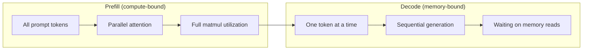
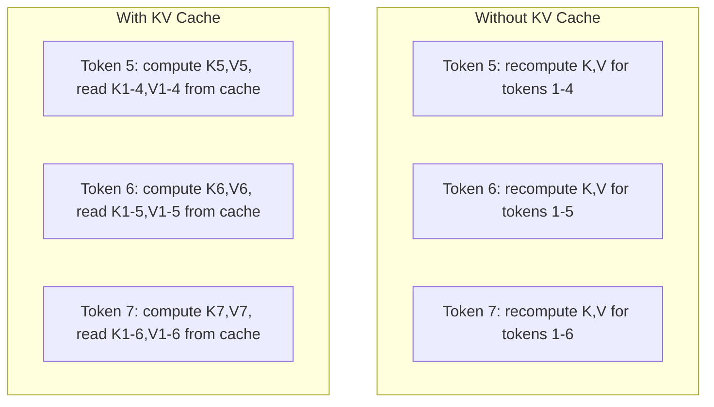
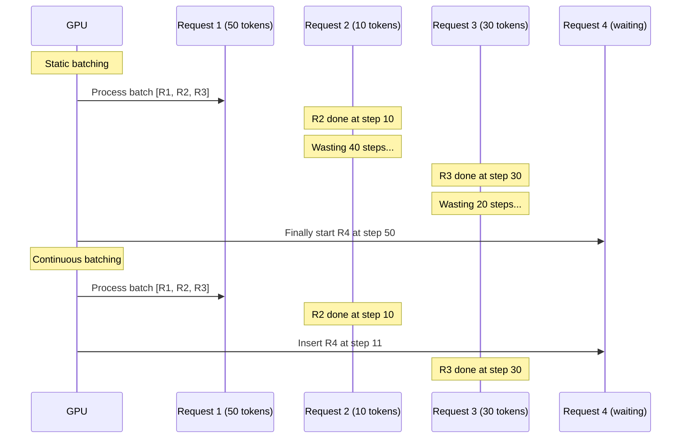
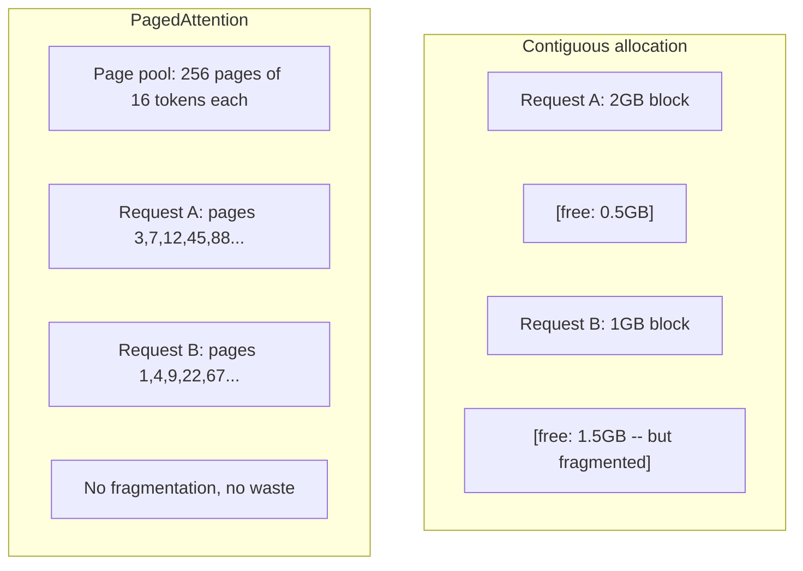
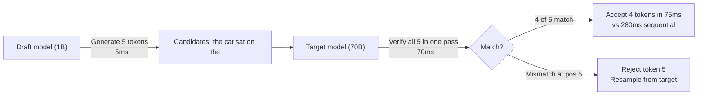

# Tối ưu hóa Inference

> Hai giai đoạn định nghĩa quá trình inference của LLM. Prefill xử lý prompt của bạn song song -- bị giới hạn bởi tính toán (compute-bound). Decode tạo ra từng token một -- bị giới hạn bởi bộ nhớ (memory-bound). Mọi kỹ thuật tối ưu hóa đều nhắm vào một hoặc cả hai giai đoạn này.

**Type:** Build
**Languages:** Python
**Prerequisites:** Phase 10, Lessons 01-08 (Kiến trúc Transformer, attention)
**Time:** ~120 phút

## Mục tiêu học tập

- Triển khai KV-cache để loại bỏ các tính toán dư thừa trong quá trình tạo token tự hồi quy (autoregressive).
- Giải thích các giai đoạn prefill và decode của LLM inference và lý do tại sao mỗi giai đoạn có các nút thắt cổ chai khác nhau (compute-bound vs memory-bound).
- Triển khai các khái niệm continuous batching và PagedAttention để tối đa hóa hiệu suất GPU dưới các yêu cầu đồng thời.
- So sánh các kỹ thuật tối ưu hóa inference (KV-cache, speculative decoding, flash attention) và sự đánh đổi giữa thông lượng (throughput) và độ trễ (latency).

## Vấn đề

Bạn triển khai Llama 3 70B trên 4x GPU A100. Một người dùng đơn lẻ nhận được khoảng 50 token mỗi giây. Cảm giác rất nhanh. Sau đó, 100 người dùng truy cập endpoint cùng lúc. Thông lượng giảm xuống còn 3 token/giây/người dùng. Hóa đơn GPU 25.000 USD/tháng của bạn đang phục vụ các phản hồi chậm hơn tốc độ gõ phím của con người.

Bản thân mô hình không thay đổi giữa 1 người dùng và 100 người dùng. Cùng trọng số, cùng kiến trúc, cùng toán học. Điều thay đổi là cách bạn lập lịch công việc. Inference theo cách thông thường (naive) lãng phí hơn 90% khả năng tính toán của GPU. Một người dùng đang chờ token thứ 47 sẽ giữ một slot batch trong khi bus bộ nhớ GPU nhàn rỗi giữa các phép nhân ma trận. Trong khi đó, prompt 2.000 token của một người dùng mới có thể lấp đầy thời gian chết đó bằng các tính toán hữu ích.

Đây không phải là vấn đề về mở rộng quy mô (scaling). Đây là vấn đề về lập lịch (scheduling). Các kỹ thuật trong bài học này -- KV caching, continuous batching, PagedAttention, speculative decoding, prefix caching -- là những thứ tạo nên sự khác biệt giữa một hệ thống tốn $25k/month inference bill from a $5k/tháng so với một hệ thống phục vụ cùng lưu lượng truy cập.

vLLM khi phục vụ Llama 3 70B trên 4x A100-80GB đạt khoảng 50 token/giây/người dùng ở mức độ đồng thời thấp, và duy trì 15-25 TPS/người dùng ở mức 100 yêu cầu đồng thời thông qua continuous batching và PagedAttention. Nếu không có các tối ưu hóa này, cùng phần cứng đó chỉ phục vụ được 5 TPS/người dùng ở mức độ đồng thời đó. Cùng GPU, cùng mô hình, thông lượng gấp 4 lần.

## Khái niệm

### Prefill vs Decode

Mỗi yêu cầu inference LLM có hai giai đoạn riêng biệt.

**Prefill** xử lý toàn bộ input prompt. Tất cả các token đều đã biết, vì vậy attention có thể được tính toán song song trên toàn bộ chuỗi. Đây là một phép nhân ma trận lớn -- các nhân GPU luôn bận rộn. Nút thắt cổ chai là tính toán: phần cứng của bạn có thể cung cấp bao nhiêu FLOPS mỗi giây. Một chiếc A100 đạt 312 TFLOPS (BF16). Prefill cho một prompt 4.096 token trên mô hình 70B mất khoảng 400ms trên một chiếc A100 đơn lẻ.

**Decode** tạo ra các token đầu ra từng cái một. Mỗi token mới chú ý (attend) đến tất cả các token trước đó, nhưng chỉ một token được tạo ra mỗi lần forward pass. Các ma trận trọng số có cùng kích thước như trong quá trình prefill, nhưng bạn đang nhân chúng với một vector thay vì một ma trận. Các nhân GPU hoàn thành trong vài micro giây, sau đó chờ đợi lô trọng số tiếp theo đến từ bộ nhớ. Nút thắt cổ chai là băng thông bộ nhớ: tốc độ bạn có thể truyền tải trọng số mô hình từ HBM đến các đơn vị tính toán. Một chiếc A100 có băng thông 2 TB/s. Một mô hình 70B ở định dạng FP16 nặng 140 GB. Đọc toàn bộ mô hình một lần mất 70ms -- đó là giới hạn tối thiểu cho một bước decode.



Tỷ lệ **ops:byte** (còn gọi là cường độ số học - arithmetic intensity) nắm bắt sự đánh đổi này. Nó đo lường số lượng phép tính bạn thực hiện trên mỗi byte được tải từ bộ nhớ.

```
ops:byte ratio = FLOPs per token / bytes read from memory
```

Trong quá trình prefill với batch 4.096 token, bạn thực hiện khoảng 4.096 phép nhân-cộng trên mỗi trọng số được tải. Tỷ lệ này cao -- bạn bị giới hạn bởi tính toán (compute-bound). Trong quá trình decode với batch size 1, bạn thực hiện khoảng 1 phép tính trên mỗi trọng số được tải. Tỷ lệ này thấp -- bạn bị giới hạn bởi bộ nhớ (memory-bound).

Thông tin cốt lõi: *decode bị giới hạn bởi bộ nhớ vì bạn đọc toàn bộ mô hình để tạo ra một token duy nhất*. Mọi tối ưu hóa dưới đây đều nhằm giảm lượng dữ liệu bạn đọc, tăng batch token được xử lý trên mỗi lần đọc, hoặc tránh việc đọc hoàn toàn.

### KV Cache

Trong quá trình attention, query của mỗi token chú ý đến tất cả các vector key và value của các token trước đó. Nếu không có bộ nhớ đệm (caching), việc tạo token N đòi hỏi phải tính toán lại các phép chiếu key và value cho tất cả N-1 token trước đó. Token 1 được chiếu khi tạo token 2, sau đó lại được chiếu cho token 3, rồi lại cho token 4. Đến token 1.000, bạn đã chiếu token 1 tổng cộng 999 lần.

KV cache lưu trữ các phép chiếu key và value từ tất cả các token trước đó. Khi tạo token N, bạn chỉ tính toán key và value cho token N, sau đó nối chúng với K/V đã lưu trong cache từ token 1 đến N-1.



**Công thức bộ nhớ cho KV cache:**

```
KV cache size = 2 * num_layers * num_kv_heads * head_dim * seq_len * bytes_per_param
```

Đối với Llama 3 70B (80 lớp, 8 KV head với GQA, head_dim=128, BF16):

```
per token: 2 * 80 * 8 * 128 * 2 bytes = 327,680 bytes = 320 KB
at 4,096 tokens: 320 KB * 4,096 = 1.28 GB
at 128K tokens: 320 KB * 131,072 = 40 GB
```

Một cuộc hội thoại 128K-context cho Llama 3 70B tiêu tốn 40 GB KV cache -- một nửa bộ nhớ của A100. Với 100 người dùng đồng thời, mỗi người 4K token, chỉ riêng KV cache đã yêu cầu 128 GB. Đây là lý do tại sao quản lý KV cache là thách thức trung tâm của tối ưu hóa inference.

### Continuous Batching

Static batching chờ đợi cho đến khi một batch gồm N yêu cầu đến, xử lý chúng cùng nhau, và chờ cho đến khi *tất cả* hoàn thành trước khi chấp nhận yêu cầu mới. Nếu một yêu cầu cần 500 token và yêu cầu khác cần 10, yêu cầu ngắn sẽ ngồi chờ nhàn rỗi trong 490 bước decode sau khi nó kết thúc.

Continuous batching (còn gọi là iteration-level batching) chèn các yêu cầu mới vào batch ngay khi bất kỳ yêu cầu nào hoàn thành. Batch được đánh giá lại ở mỗi bước decode. Một yêu cầu kết thúc sau 10 token sẽ ngay lập tức được thay thế bằng một yêu cầu đang chờ.



Sự cải thiện thông lượng phụ thuộc vào mức độ thay đổi của độ dài đầu ra. Với độ dài đồng nhất, continuous batching tương đương với static batching. Với độ dài thay đổi (trường hợp phổ biến), continuous batching có thể mang lại thông lượng cao hơn 2-5 lần vì các slot GPU không bao giờ bị bỏ trống.

### PagedAttention

KV cache cho mỗi yêu cầu là một khối bộ nhớ liên tục. Khi các yêu cầu đến và đi, bộ nhớ bị phân mảnh -- giống hệt như phân mảnh RAM trong hệ điều hành. Một yêu cầu 4K-token cần 1,28 GB liên tục. Ngay cả khi bạn có tổng cộng 2 GB trống, bạn có thể không có 1,28 GB *liên tục*. Bạn sẽ lãng phí bộ nhớ hoặc từ chối yêu cầu.

PagedAttention (từ vLLM) áp dụng bộ nhớ ảo kiểu hệ điều hành cho KV cache. Thay vì cấp phát một khối liên tục cho mỗi yêu cầu, nó cấp phát các "trang" (page) có kích thước cố định (thường là 16 token mỗi trang). Các trang có thể nằm ở bất kỳ đâu trong bộ nhớ vật lý của GPU. Một bảng trang (page table) ánh xạ các vị trí chuỗi logic của mỗi yêu cầu tới các vị trí trang vật lý.



PagedAttention cũng cho phép **copy-on-write** cho các tiền tố (prefix) được chia sẻ. Nếu 50 yêu cầu chia sẻ cùng một system prompt, các trang KV cache cho system prompt đó được lưu trữ một lần và được tham chiếu bởi tất cả 50 yêu cầu. Chỉ khi một yêu cầu khác biệt (tin nhắn người dùng khác nhau), nó mới nhận các trang riêng của mình. Điều này cắt giảm đáng kể việc sử dụng bộ nhớ cho các ứng dụng có system prompt dùng chung.

vLLM báo cáo mức lãng phí bộ nhớ gần bằng 0 (~4% so với ~60-80% trong cấp phát thông thường) thông qua PagedAttention.

### Speculative Decoding

Decode chậm vì nó mang tính tuần tự -- bạn tạo một token, đưa nó trở lại, tạo token tiếp theo. Nhưng nếu bạn có thể đoán trước 5 token tiếp theo với chi phí thấp, sau đó xác minh tất cả chúng cùng một lúc thì sao?

Speculative decoding sử dụng một **draft model** nhỏ, nhanh để tạo ra K token ứng viên. Sau đó, **target model** lớn sẽ xử lý tất cả K ứng viên trong một forward pass duy nhất (trông giống như một bước prefill -- song song, compute-bound, hiệu quả). Nếu target model đồng ý với các dự đoán của draft model, bạn chấp nhận tất cả K token trong thời gian của một lần forward pass của target model. Nếu nó không đồng ý tại vị trí j, bạn chấp nhận các token từ 1 đến j-1 và loại bỏ phần còn lại.



Tốc độ tăng lên phụ thuộc vào **tỷ lệ chấp nhận (acceptance rate)** -- tần suất dự đoán của draft model khớp với target model. Đối với Llama 3 8B làm draft cho Llama 3 70B, tỷ lệ chấp nhận 70-85% là điển hình trong ngôn ngữ tự nhiên. Điều này chuyển thành tốc độ decode nhanh gấp 2-3 lần.

Ba phương pháp tiếp cận speculative decoding:

| Phương pháp | Nguồn Draft | Tỷ lệ chấp nhận | Chi phí phụ |
|--------|-------------|-----------------|----------|
| Draft-target (Leviathan et al.) | Mô hình nhỏ riêng biệt | 70-85% | Bộ nhớ cho draft model |
| EAGLE (Li et al.) | Head nhẹ trên target | 75-90% | ~1% tham số bổ sung |
| N-gram lookup | Bảng token n-gram | 40-60% | Không đáng kể |

**EAGLE** huấn luyện một head tự hồi quy nhỏ trên các hidden state của target model. Nó dự đoán embedding của token tiếp theo bằng cách sử dụng các đặc trưng từ lớp áp chót của target model. Vì nó hoạt động trên chính các biểu diễn của target model (không phải một mô hình riêng biệt), nó đạt được tỷ lệ chấp nhận cao hơn với bộ nhớ bổ sung tối thiểu. EAGLE-2 thêm một cây dự đoán động (dynamic draft tree) điều chỉnh số lượng ứng viên dựa trên ngữ cảnh.

**N-gram speculative decoding** duy trì một bảng các chuỗi n-gram từ ngữ cảnh hiện tại hoặc một tập dữ liệu được xây dựng trước. Nếu draft khớp với những gì đã xuất hiện trước đó trong cùng cuộc hội thoại (các mẫu lặp lại, mã nguồn, đầu ra có cấu trúc), nó sẽ kích hoạt mà không tốn chi phí mạng thần kinh. Tỷ lệ chấp nhận trung bình thấp hơn nhưng chi phí cho mỗi lần dự đoán về cơ bản là bằng 0.

Speculative decoding là *chính xác về mặt toán học* -- phân phối đầu ra giống hệt với phân phối của target model. Nó không phải là một phép xấp xỉ. Bước xác minh đảm bảo rằng mọi token được chấp nhận đều có chính xác xác suất mà target model sẽ gán cho nó.

### Prefix Caching

Nhiều yêu cầu chia sẻ cùng một tiền tố (prefix). Một system prompt của chatbot. Một khối ngữ cảnh RAG. Một tập ví dụ few-shot. Nếu không có prefix caching, mỗi yêu cầu sẽ tính toán lại KV cache cho các token dùng chung này từ đầu.

Prefix caching lưu trữ KV cache cho các tiền tố phổ biến và tái sử dụng chúng giữa các yêu cầu. Khi một yêu cầu mới đến với một tiền tố đã biết, hệ thống sao chép (hoặc tham chiếu) các mục KV đã lưu trong cache và chỉ tính toán KV cho phần hậu tố (suffix) duy nhất.

Đối với một system prompt 2.000 token được chia sẻ giữa tất cả các yêu cầu, prefix caching loại bỏ khoảng 400ms prefill cho mỗi yêu cầu. Ở mức 100 yêu cầu/giây, điều đó tiết kiệm 40 giây tính toán GPU mỗi giây -- nhiều hơn công suất của một GPU.

RadixAttention của SGLang triển khai prefix caching với một cây radix (trie) lập chỉ mục các tiền tố theo nội dung token của chúng. Bất kỳ yêu cầu nào khớp với một tiền tố đã lưu đều nhận được KV cache của nó miễn phí. Cây này cho phép khớp tiền tố một phần -- nếu bạn chia sẻ 1.500 trong số 2.000 token tiền tố với một mục đã lưu trong cache, bạn tái sử dụng 1.500 đó và chỉ tính toán lại 500.

### Các Inference Engine

Ba engine thống trị việc phục vụ LLM trong sản xuất:

| Engine | Đổi mới chính | Tốt nhất cho |
|--------|---------------|----------|
| vLLM | PagedAttention, continuous batching | Phục vụ mục đích chung, khả năng tương thích cao nhất |
| SGLang | RadixAttention (prefix caching), tạo cấu trúc | Chatbot đa lượt, constrained decoding |
| TensorRT-LLM | NVIDIA kernel fusion, FP8 quantization | Thông lượng GPU đơn lẻ tối đa trên phần cứng NVIDIA |

**vLLM** là điểm khởi đầu mặc định. Nó hỗ trợ phạm vi mô hình rộng nhất, chạy trên mọi nhà cung cấp GPU (NVIDIA, AMD, Intel), và đạt được thông lượng mạnh mẽ thông qua PagedAttention + continuous batching. API tương thích với OpenAI có nghĩa là bạn có thể thay thế nó cho bất kỳ lệnh gọi API OpenAI nào.

**SGLang** xây dựng trên cùng nền tảng với vLLM nhưng thêm RadixAttention cho prefix caching và một ngôn ngữ chuyên biệt cho các chương trình LLM có cấu trúc. Nếu workload của bạn liên quan đến hội thoại đa lượt, sử dụng công cụ, hoặc constrained decoding (đầu ra JSON, tạo theo regex), SGLang thường vượt trội hơn vLLM 2-5 lần thông qua việc tái sử dụng tiền tố.

**TensorRT-LLM** biên dịch các mô hình thành các kernel GPU NVIDIA được tối ưu hóa. Nó hợp nhất các phép toán (attention + linear + activation trong một kernel), sử dụng FP8 trên GPU H100, và tích hợp với NVIDIA Triton Inference Server để triển khai sản xuất. Nó đạt được thông lượng GPU đơn lẻ cao nhất trên phần cứng NVIDIA nhưng đòi hỏi nhiều thiết lập hơn và chỉ hoạt động trên GPU NVIDIA.

Số liệu thực tế cho Llama 3 70B (4xA100-80GB, BF16):

| Chỉ số | vLLM | SGLang | TensorRT-LLM |
|--------|------|--------|---------------|
| Thông lượng (1 người dùng) | ~50 TPS | ~55 TPS | ~65 TPS |
| Thông lượng (100 người dùng) | ~2.500 tổng TPS | ~3.200 tổng TPS | ~3.000 tổng TPS |
| Thời gian đến token đầu tiên | ~400ms | ~300ms (prefix hit) | ~350ms |
| Context tối đa | 128K | 128K | 128K |

### Khung Ops:Byte

Bạn không thể tối ưu hóa những gì bạn không đo lường. Tỷ lệ ops:byte cho bạn biết liệu bạn đang bị giới hạn bởi tính toán hay bộ nhớ, điều này quyết định những tối ưu hóa nào là quan trọng.

```
Compute roof: peak FLOPS of the GPU
Memory roof:  peak bandwidth * ops:byte ratio
```

Khi ops:byte thấp (decode, batch nhỏ), bạn chạm ngưỡng băng thông bộ nhớ. Thêm nhiều tính toán (xung nhịp cao hơn, nhiều nhân hơn) không giúp ích gì. Bạn cần giảm số lần đọc bộ nhớ (quantization, nén KV cache) hoặc tăng batch size để phân bổ việc đọc trên nhiều công việc hữu ích hơn.

Khi ops:byte cao (prefill, batch lớn), bạn chạm ngưỡng tính toán. Tối ưu hóa băng thông bộ nhớ không giúp ích gì. Bạn cần GPU nhanh hơn, kernel fusion, hoặc giảm độ chính xác để ép thêm nhiều FLOPS.

| Kịch bản | ops:byte | Giới hạn | Tối ưu hóa với |
|----------|----------|-------|---------------|
| Prefill, batch=1 | ~4.096 | Tính toán | Kernel fusion, FP8 |
| Decode, batch=1 | ~1 | Bộ nhớ | Quantization, nén KV |
| Decode, batch=32 | ~32 | Bộ nhớ | Batch lớn hơn, continuous batching |
| Decode, batch=256 | ~256 | Chuyển tiếp | Cả hai đều quan trọng |
| Decode, batch=1024 | ~1.024 | Tính toán | Kernel fusion, tensor parallelism |

Điểm giao thoa trên A100 là khoảng ops:byte = 156 (312 TFLOPS / 2 TB/s). Dưới 156, bạn bị giới hạn bởi bộ nhớ. Trên 156, bạn bị giới hạn bởi tính toán. Continuous batching đẩy quá trình decode về phía điểm giao thoa này bằng cách đóng gói nhiều token hơn mỗi lần lặp.

```figure
context-window-slide
```

## Xây dựng

### Bước 1: KV Cache từ đầu

Chúng ta xây dựng một KV cache đa đầu (multi-head) lưu trữ các phép chiếu key và value theo từng lớp, từng head, và minh họa mô hình tăng trưởng bộ nhớ.

```python
import numpy as np

class KVCache:
    def __init__(self, num_layers, num_heads, head_dim, max_seq_len, dtype=np.float16):
        self.num_layers = num_layers
        self.num_heads = num_heads
        self.head_dim = head_dim
        self.max_seq_len = max_seq_len
        self.dtype = dtype

        self.k_cache = np.zeros(
            (num_layers, num_heads, max_seq_len, head_dim), dtype=dtype
        )
        self.v_cache = np.zeros(
            (num_layers, num_heads, max_seq_len, head_dim), dtype=dtype
        )
        self.seq_len = 0

    def update(self, layer_idx, new_keys, new_values):
        num_new = new_keys.shape[1]
        end = self.seq_len + num_new
        self.k_cache[layer_idx, :, self.seq_len:end, :] = new_keys
        self.v_cache[layer_idx, :, self.seq_len:end, :] = new_values
        return (
            self.k_cache[layer_idx, :, :end, :],
            self.v_cache[layer_idx, :, :end, :]
        )

    def advance(self, num_tokens):
        self.seq_len += num_tokens

    def memory_bytes(self):
        return self.k_cache.nbytes + self.v_cache.nbytes

    def used_bytes(self):
        per_token = 2 * self.num_layers * self.num_heads * self.head_dim * np.dtype(self.dtype).itemsize
        return per_token * self.seq_len
```

### Bước 2: Attention với KV Cache

Một attention đa đầu đơn giản hóa sử dụng KV cache cho các bước decode.

```python
def scaled_dot_product_attention(query, keys, values):
    head_dim = query.shape[-1]
    scores = np.matmul(query, keys.transpose(0, 1, 3, 2)) / np.sqrt(head_dim)
    seq_len_q = scores.shape[-2]
    seq_len_k = scores.shape[-1]
    if seq_len_q > 1:
        mask = np.triu(np.ones((seq_len_q, seq_len_k), dtype=np.float32), k=seq_len_k - seq_len_q + 1)
        scores = scores + mask * (-1e9)
    max_scores = np.max(scores, axis=-1, keepdims=True)
    exp_scores = np.exp(scores - max_scores)
    attn_weights = exp_scores / np.sum(exp_scores, axis=-1, keepdims=True)
    return np.matmul(attn_weights, values)


class MultiHeadAttention:
    def __init__(self, d_model, num_heads):
        self.num_heads = num_heads
        self.head_dim = d_model // num_heads
        scale = np.sqrt(2.0 / d_model)
        self.W_q = np.random.randn(d_model, d_model).astype(np.float32) * scale
        self.W_k = np.random.randn(d_model, d_model).astype(np.float32) * scale
        self.W_v = np.random.randn(d_model, d_model).astype(np.float32) * scale
        self.W_o = np.random.randn(d_model, d_model).astype(np.float32) * scale

    def forward(self, x, kv_cache=None, layer_idx=0):
        batch, seq_len, d_model = x.shape
        Q = np.matmul(x, self.W_q).reshape(batch, seq_len, self.num_heads, self.head_dim).transpose(0, 2, 1, 3)
        K = np.matmul(x, self.W_k).reshape(batch, seq_len, self.num_heads, self.head_dim).transpose(0, 2, 1, 3)
        V = np.matmul(x, self.W_v).reshape(batch, seq_len, self.num_heads, self.head_dim).transpose(0, 2, 1, 3)

        if kv_cache is not None:
            K_full, V_full = kv_cache.update(layer_idx, K[0], V[0])
            K = K_full[np.newaxis, :, :, :]
            V = V_full[np.newaxis, :, :, :]
            if seq_len == 1:
                kv_cache.advance(1)

        attn_out = scaled_dot_product_attention(Q, K, V)
        attn_out = attn_out.transpose(0, 2, 1, 3).reshape(batch, -1, d_model)
        return np.matmul(attn_out, self.W_o)
```

### Bước 3: Mô phỏng Continuous Batching

Mô phỏng sự khác biệt trong lập lịch giữa static batching và continuous batching.

```python
import heapq

class Request:
    def __init__(self, request_id, prompt_tokens, output_tokens, arrival_step):
        self.request_id = request_id
        self.prompt_tokens = prompt_tokens
        self.output_tokens = output_tokens
        self.arrival_step = arrival_step
        self.tokens_generated = 0
        self.start_step = None
        self.end_step = None

    def is_done(self):
        return self.tokens_generated >= self.output_tokens


def simulate_static_batching(requests, batch_size):
    step = 0
    completed = []
    queue = list(requests)
    queue.sort(key=lambda r: r.arrival_step)

    while queue:
        batch = []
        while queue and len(batch) < batch_size:
            r = queue.pop(0)
            r.start_step = max(step, r.arrival_step)
            batch.append(r)

        if batch:
            step = max(step, max(r.start_step for r in batch))
            max_output = max(r.output_tokens for r in batch)
            for r in batch:
                r.tokens_generated = r.output_tokens
                r.end_step = step + max_output
            step += max_output
            completed.extend(batch)

    return completed


def simulate_continuous_batching(requests, batch_size):
    step = 0
    completed = []
    queue = sorted(requests, key=lambda r: r.arrival_step)
    queue_idx = 0
    active = []
    waiting = []

    while queue_idx < len(queue) or active or waiting:
        while queue_idx < len(queue) and queue[queue_idx].arrival_step <= step:
            waiting.append(queue[queue_idx])
            queue_idx += 1

        while waiting and len(active) < batch_size:
            r = waiting.pop(0)
            r.start_step = step
            active.append(r)

        if not active:
            if waiting:
                step += 1
                continue
            elif queue_idx < len(queue):
                step = queue[queue_idx].arrival_step
                continue
            else:
                break

        for r in active:
            r.tokens_generated += 1

        done = [r for r in active if r.is_done()]
        for r in done:
            r.end_step = step + 1
            completed.append(r)
        active = [r for r in active if not r.is_done()]

        step += 1

    return completed


def batching_stats(completed):
    latencies = [r.end_step - r.arrival_step for r in completed]
    total_time = max(r.end_step for r in completed) - min(r.arrival_step for r in completed)
    total_tokens = sum(r.output_tokens for r in completed)
    return {
        "avg_latency": np.mean(latencies),
        "p50_latency": np.median(latencies),
        "p99_latency": np.percentile(latencies, 99),
        "total_time": total_time,
        "throughput": total_tokens / total_time if total_time > 0 else 0,
    }
```

### Bước 4: Prefix Cache

Một prefix cache dựa trên trie lưu trữ các mục KV cho các tiền tố được chia sẻ.

```python
class TrieNode:
    def __init__(self):
        self.children = {}
        self.kv_data = None
        self.hit_count = 0


class PrefixCache:
    def __init__(self, max_entries=1000):
        self.root = TrieNode()
        self.max_entries = max_entries
        self.total_entries = 0
        self.hits = 0
        self.misses = 0

    def _walk(self, token_ids):
        node = self.root
        depth = 0
        for tid in token_ids:
            if tid not in node.children:
                break
            node = node.children[tid]
            depth += 1
        return node, depth

    def lookup(self, token_ids):
        node, depth = self._walk(token_ids)
        if depth > 0:
            self.hits += 1
            current = self.root
            for tid in token_ids[:depth]:
                current = current.children[tid]
                current.hit_count += 1
            kv_entries = []
            current = self.root
            for tid in token_ids[:depth]:
                current = current.children[tid]
                if current.kv_data is not None:
                    kv_entries.append(current.kv_data)
            return depth, kv_entries
        self.misses += 1
        return 0, []

    def insert(self, token_ids, kv_per_token):
        node = self.root
        for i, tid in enumerate(token_ids):
            if tid not in node.children:
                if self.total_entries >= self.max_entries:
                    return i
                node.children[tid] = TrieNode()
                self.total_entries += 1
            node = node.children[tid]
            if i < len(kv_per_token):
                node.kv_data = kv_per_token[i]
        return len(token_ids)

    def hit_rate(self):
        total = self.hits + self.misses
        return self.hits / total if total > 0 else 0.0
```

### Bước 5: Mô phỏng Speculative Decoding

Chúng ta mô phỏng speculative decoding draft-target với các tỷ lệ chấp nhận có thể cấu hình.

```python
class DraftModel:
    def __init__(self, vocab_size, acceptance_rate=0.8):
        self.vocab_size = vocab_size
        self.acceptance_rate = acceptance_rate

    def generate(self, context, num_tokens):
        tokens = np.random.randint(0, self.vocab_size, size=num_tokens)
        return tokens

    def get_probs(self, context, token):
        probs = np.random.dirichlet(np.ones(self.vocab_size))
        return probs


class TargetModel:
    def __init__(self, vocab_size):
        self.vocab_size = vocab_size

    def get_probs(self, context, tokens=None):
        if tokens is not None:
            return [np.random.dirichlet(np.ones(self.vocab_size)) for _ in tokens]
        return np.random.dirichlet(np.ones(self.vocab_size))


def speculative_decode(draft_model, target_model, context, num_speculative=5,
                       draft_cost=1.0, target_cost=10.0, verify_cost=12.0):
    total_tokens = 0
    total_cost = 0.0
    accepted_counts = []
    context = list(context)

    max_tokens = 100

    while total_tokens < max_tokens:
        draft_tokens = draft_model.generate(context, num_speculative)
        total_cost += draft_cost * num_speculative

        target_probs = target_model.get_probs(context, draft_tokens)
        total_cost += verify_cost

        accepted = 0
        for i, token in enumerate(draft_tokens):
            draft_p = draft_model.get_probs(context + list(draft_tokens[:i]), token)
            target_p = target_probs[i]

            r = np.random.random()
            acceptance_prob = min(1.0, target_p[token] / (draft_p[token] + 1e-10))

            if r < draft_model.acceptance_rate:
                accepted += 1
                context.append(token)
                total_tokens += 1
            else:
                new_token = np.random.choice(draft_model.vocab_size, p=target_p)
                context.append(new_token)
                total_tokens += 1
                break

        accepted_counts.append(accepted)

        if accepted == num_speculative:
            bonus_probs = target_model.get_probs(context)
            bonus_token = np.random.choice(draft_model.vocab_size, p=bonus_probs)
            context.append(bonus_token)
            total_tokens += 1

    sequential_cost = total_tokens * target_cost
    return {
        "total_tokens": total_tokens,
        "speculative_cost": total_cost,
        "sequential_cost": sequential_cost,
        "speedup": sequential_cost / total_cost if total_cost > 0 else 1.0,
        "avg_accepted": np.mean(accepted_counts),
        "acceptance_rate": np.mean(accepted_counts) / num_speculative,
    }


def compare_speculation_strategies(vocab_size=1000, num_trials=20):
    results = {}

    for name, acceptance_rate, spec_tokens in [
        ("Draft-target (8B->70B)", 0.78, 5),
        ("EAGLE", 0.85, 6),
        ("N-gram", 0.50, 4),
        ("No speculation", 0.0, 0),
    ]:
        if spec_tokens == 0:
            results[name] = {
                "speedup": 1.0,
                "acceptance_rate": 0.0,
                "avg_accepted": 0.0,
            }
            continue

        trial_results = []
        for _ in range(num_trials):
            draft = DraftModel(vocab_size, acceptance_rate=acceptance_rate)
            target = TargetModel(vocab_size)
            context = list(np.random.randint(0, vocab_size, size=10))
            result = speculative_decode(draft, target, context, num_speculative=spec_tokens)
            trial_results.append(result)

        results[name] = {
            "speedup": np.mean([r["speedup"] for r in trial_results]),
            "acceptance_rate": np.mean([r["acceptance_rate"] for r in trial_results]),
            "avg_accepted": np.mean([r["avg_accepted"] for r in trial_results]),
        }

    return results
```

### Bước 6: Trình phân tích bộ nhớ KV Cache

Tính toán các yêu cầu bộ nhớ KV cache cho các cấu hình mô hình thực tế.

```python
MODEL_CONFIGS = {
    "Llama-3-8B": {
        "num_layers": 32, "num_kv_heads": 8, "head_dim": 128,
        "model_params_b": 8, "gqa": True,
    },
    "Llama-3-70B": {
        "num_layers": 80, "num_kv_heads": 8, "head_dim": 128,
        "model_params_b": 70, "gqa": True,
    },
    "Llama-3-405B": {
        "num_layers": 126, "num_kv_heads": 8, "head_dim": 128,
        "model_params_b": 405, "gqa": True,
    },
    "Mistral-7B": {
        "num_layers": 32, "num_kv_heads": 8, "head_dim": 128,
        "model_params_b": 7, "gqa": True,
    },
    "GPT-4-est": {
        "num_layers": 120, "num_kv_heads": 96, "head_dim": 128,
        "model_params_b": 1800, "gqa": False,
    },
}


def kv_cache_memory(config, seq_len, dtype_bytes=2):
    per_token = 2 * config["num_layers"] * config["num_kv_heads"] * config["head_dim"] * dtype_bytes
    total = per_token * seq_len
    return {
        "per_token_bytes": per_token,
        "per_token_kb": per_token / 1024,
        "total_bytes": total,
        "total_mb": total / (1024 ** 2),
        "total_gb": total / (1024 ** 3),
    }


def memory_budget(config, gpu_memory_gb, model_dtype_bytes=2, kv_dtype_bytes=2):
    model_memory_gb = config["model_params_b"] * 1e9 * model_dtype_bytes / (1024 ** 3)
    overhead_gb = gpu_memory_gb * 0.1
    available_for_kv = gpu_memory_gb - model_memory_gb - overhead_gb

    if available_for_kv <= 0:
        return {"error": "Model does not fit in GPU memory", "model_memory_gb": model_memory_gb}

    per_token = 2 * config["num_layers"] * config["num_kv_heads"] * config["head_dim"] * kv_dtype_bytes
    max_tokens = int(available_for_kv * (1024 ** 3) / per_token)

    return {
        "gpu_memory_gb": gpu_memory_gb,
        "model_memory_gb": round(model_memory_gb, 1),
        "overhead_gb": round(overhead_gb, 1),
        "available_for_kv_gb": round(available_for_kv, 1),
        "max_total_tokens": max_tokens,
        "max_users_at_2k": max_tokens // 2048,
        "max_users_at_4k": max_tokens // 4096,
        "max_users_at_32k": max_tokens // 32768,
    }
```

## Sử dụng

Với vLLM:

```python
from vllm import LLM, SamplingParams

llm = LLM(
    model="meta-llama/Llama-3-70B-Instruct",
    tensor_parallel_size=4,
    enable_prefix_caching=True,
    max_model_len=8192,
    gpu_memory_utilization=0.9,
)

params = SamplingParams(temperature=0.7, max_tokens=256)
outputs = llm.generate(["Explain inference optimization in one paragraph."], params)
```

Với SGLang cho prefix caching + đầu ra có cấu trúc:

```python
import sglang as sgl

@sgl.function
def classify(s, text):
    s += sgl.system("You are a classifier. Output JSON only.")
    s += sgl.user(f"Classify this text: {text}")
    s += sgl.assistant(sgl.gen("result", regex=r'\{"label": "(positive|negative|neutral)"\}'))

runtime = sgl.Runtime(model_path="meta-llama/Llama-3-70B-Instruct", tp_size=4)
sgl.set_default_backend(runtime)

results = classify.run_batch([
    {"text": "This product is amazing!"},
    {"text": "Terrible experience."},
    {"text": "It was okay I guess."},
])
```

Với TensorRT-LLM:

```python
import tensorrt_llm
from tensorrt_llm.runtime import ModelRunner

runner = ModelRunner.from_dir("./llama-70b-trt-engine/", rank=0)

outputs = runner.generate(
    batch_input_ids=[tokenizer.encode("Explain KV caching.")],
    max_new_tokens=256,
    temperature=0.7,
)
```

## Triển khai

Bài học này tạo ra:
- `outputs/skill-inference-optimization.md` -- một kỹ năng để chẩn đoán và tối ưu hóa việc phục vụ inference LLM

## Bài tập

1. Sửa đổi trình phân tích KV cache để so sánh quantization KV cache FP16 vs FP8 vs INT4. Đối với Llama 3 70B ở context 4K, tính toán số người dùng đồng thời tối đa cho mỗi loại trên 4xA100-80GB. Quantization KV sang INT4 sẽ tăng gấp khoảng 4 lần dung lượng người dùng.

2. Mở rộng trình mô phỏng continuous batching để theo dõi hiệu suất GPU (tỷ lệ các slot batch được lấp đầy mỗi bước). Vẽ biểu đồ hiệu suất theo thời gian cho cả static và continuous batching với 50 yêu cầu có độ dài đầu ra tuân theo phân phối Pareto (shape=1.5, scale=20). Continuous batching sẽ duy trì hiệu suất >80%.

3. Triển khai phiên bản grouped-query attention (GQA) của KV cache nơi `num_kv_heads < num_query_heads`. Llama 3 70B sử dụng 64 query head nhưng chỉ có 8 KV head. Tính toán mức tiết kiệm bộ nhớ so với multi-head attention đầy đủ (giảm 8 lần kích thước KV cache).

4. Xây dựng một prefix cache sử dụng LRU eviction. Đặt max_entries là 500 và tạo 1.000 yêu cầu trong đó 60% chia sẻ một trong 5 tiền tố phổ biến. Đo lường tỷ lệ hit và so sánh với cache không giới hạn. Với eviction tốt, tỷ lệ hit sẽ duy trì trên 55%.

5. Mở rộng trình mô phỏng speculative decoding để triển khai suy đoán dựa trên cây (kiểu EAGLE-2). Thay vì một chuỗi đơn lẻ gồm K token draft, hãy tạo một cây các ứng viên (ví dụ: 2 nhánh tại mỗi cấp trong 3 cấp = 8 ứng viên lá). So sánh tổng số token được chấp nhận mỗi vòng xác minh so với suy đoán tuyến tính.

## Thuật ngữ chính

| Thuật ngữ | Cách gọi thông thường | Ý nghĩa thực tế |
|------|----------------|----------------------|
| Prefill | "Xử lý prompt" | Tính toán attention trên tất cả các token đầu vào song song -- compute-bound vì phép nhân ma trận đầy đủ giữ cho các nhân GPU bận rộn |
| Decode | "Tạo token" | Tạo một token mỗi forward pass, đọc toàn bộ trọng số mô hình mỗi lần -- memory-bound vì tính toán kết thúc trước khi các trọng số tiếp theo đến |
| KV cache | "Caching trạng thái attention" | Lưu trữ các phép chiếu key và value cho tất cả các token trước đó để chúng không bị tính toán lại ở mỗi bước decode -- đánh đổi bộ nhớ lấy tính toán |
| Continuous batching | "Dynamic batching" | Chèn các yêu cầu mới vào batch đang chạy ngay khi bất kỳ yêu cầu nào kết thúc, được đánh giá ở mỗi lần lặp decode thay vì chờ cả batch |
| PagedAttention | "Bộ nhớ ảo cho KV cache" | Cấp phát KV cache theo các trang kích thước cố định thay vì các khối liên tục, loại bỏ phân mảnh bộ nhớ và cho phép copy-on-write cho các tiền tố dùng chung |
| Speculative decoding | "Dự đoán và xác minh" | Sử dụng một draft model nhanh để đề xuất nhiều token, sau đó xác minh tất cả chúng trong một forward pass của target model -- chính xác về mặt toán học, tăng tốc 2-3 lần |
| EAGLE | "Self-speculative decoding" | Một biến thể speculative decoding huấn luyện một head nhẹ trên chính các hidden state của target model, đạt tỷ lệ chấp nhận cao hơn so với một draft model riêng biệt |
| Prefix caching | "Tái sử dụng KV system prompt" | Lưu trữ các mục KV cache đã tính toán cho các tiền tố phổ biến (system prompt, ví dụ few-shot) và tái sử dụng chúng giữa các yêu cầu để bỏ qua prefill dư thừa |
| Ops:byte ratio | "Cường độ số học" | Tỷ lệ giữa các phép tính toán và byte bộ nhớ được đọc -- xác định liệu một workload là compute-bound (tỷ lệ cao) hay memory-bound (tỷ lệ thấp) |
| Time to first token | "TTFT" | Độ trễ từ khi nhận yêu cầu đến khi tạo ra token đầu ra đầu tiên -- bị chi phối bởi thời gian prefill cho các prompt dài |

## Đọc thêm

- Kwon et al., "Efficient Memory Management for Large Language Model Serving with PagedAttention" (2023) -- bài báo vLLM giới thiệu quản lý KV cache theo trang, hiện là tiêu chuẩn công nghiệp cho phục vụ inference
- Leviathan et al., "Fast Inference from Transformers via Speculative Decoding" (2023) -- bài báo nền tảng chứng minh rằng suy đoán draft-verify tạo ra các phân phối target model chính xác trong khi đạt tốc độ nhanh gấp 2-3 lần
- Li et al., "EAGLE: Speculative Sampling Requires Rethinking Feature Uncertainty" (2024) -- đạt tỷ lệ chấp nhận cao hơn bằng cách huấn luyện một head trên các đặc trưng của chính target model thay vì sử dụng một draft model riêng biệt
- Zheng et al., "SGLang: Efficient Execution of Structured Language Model Programs" (2024) -- giới thiệu RadixAttention cho prefix caching và một mô hình lập trình cho các chương trình LLM đa lệnh gọi
- Williams et al., "Roofline: An Insightful Visual Performance Model for Multicore Architectures" (2009) -- bài báo roofline gốc đã chính thức hóa khung ops:byte để lập luận về các nút thắt cổ chai tính toán vs bộ nhớ