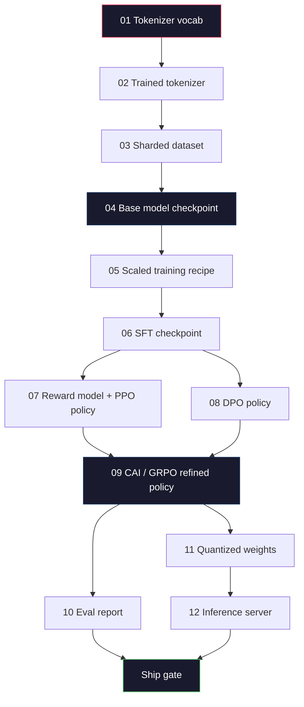
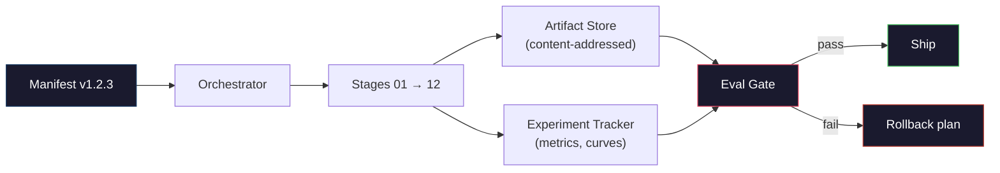

# Xây dựng một Pipeline LLM hoàn chỉnh

> Mọi thứ từ Bài 01 đến Bài 12 là một giai đoạn của một pipeline. Bài học này là khung sườn biến các giai đoạn đó thành một quy trình end-to-end duy nhất: tokenize, pre-train, scale, SFT, align, evaluate, quantize, serve. Bạn sẽ không huấn luyện một mô hình 70B trên laptop. Bạn sẽ tạo ra lớp điều phối (orchestration layer), manifest, cổng đánh giá (eval gate) và kế hoạch rollback mà một đội ngũ tiên phong năm 2026 sử dụng để quyết định những gì được xuất xưởng. Đây là dự án cuối khóa.

**Type:** Build
**Languages:** Python (stdlib)
**Prerequisites:** Tất cả các bài 01-12 của Giai đoạn 10
**Time:** ~120 phút

## Mục tiêu học tập

- Kết hợp mười một bài học trước (tokenizer, data, pre-training, scaling, SFT, RLHF, DPO, CAI, eval, quantization, inference) thành một đặc tả pipeline có thể tái lập.
- Xác định hợp đồng artifact giữa các giai đoạn: mỗi giai đoạn tiêu thụ cái gì, tạo ra cái gì và giai đoạn tiếp theo xác thực đầu vào như thế nào.
- Xây dựng một bộ điều phối (orchestrator) theo dõi các thử nghiệm, băm (hash) các artifact và kiểm soát các quyết định xuất xưởng dựa trên ngưỡng đánh giá.
- Thiết kế kế hoạch rollback: artifact nào rẻ để chạy lại, artifact nào đắt đỏ và chi phí của một checkpoint bị hỏng là bao nhiêu.

## Vấn đề

Các bài học trước đều hoạt động độc lập. Tokenizer đã được huấn luyện. Tiny GPT đã được pre-train. Tập dữ liệu SFT đã được tập hợp. Reward model đã được huấn luyện. DPO đã chạy. Các đánh giá đã được đo lường. Trọng số lượng tử hóa đã được xuất. Máy chủ inference đã được khởi chạy. Mỗi cái là một notebook. Mỗi cái có quy ước riêng, đường dẫn đầu ra riêng, seed riêng.

Một quá trình huấn luyện tiên phong không phải là một notebook. Llama 3 405B mất 30 triệu giờ H100 trong khoảng 54 ngày. DeepSeek-V3 sử dụng khoảng 2,8 triệu giờ H800. Trong thời gian đó, một checkpoint bị hỏng, một sự cố nhiễm dữ liệu (data contamination), một sự suy giảm đánh giá (eval regression) có thể khiến cả đội mất một tuần thời gian thực và một tháng ngân sách GPU. Cách các đội ngũ vượt qua điều này là thông qua vệ sinh pipeline: mọi giai đoạn đều có đầu vào xác định, đầu ra xác định, manifest, hash và cổng kiểm soát.

Đây là dự án cuối khóa. Bạn sẽ không chạy pipeline end-to-end trên laptop. Bạn sẽ viết bộ điều phối để phối hợp các giai đoạn, manifest mô tả quá trình chạy, bộ xác thực để kiểm soát quyết định xuất xưởng và kế hoạch phát lại cho phép bên thứ ba chạy lại công việc của bạn từ một tệp duy nhất. Mã nguồn thì nhỏ; kỷ luật thì lớn.

Mô hình này mở rộng từ 100M đến 1T tham số mà không thay đổi. Bốn thành phần giống nhau -- manifest, orchestrator, eval gate, artifact store -- chạy Llama 3 và cũng chạy cả hobby GPT của bạn. Sự khác biệt nằm ở kích thước các con số bên trong cấu hình của mỗi giai đoạn, không phải hình dạng của pipeline.

## Khái niệm

### Mười hai giai đoạn

Mỗi bài học của Giai đoạn 10 là một giai đoạn. Dưới đây là biểu đồ phụ thuộc đầy đủ.



Giai đoạn 07 và 08 có thể chạy song song. Mọi thứ khác là phụ thuộc cứng. Một thay đổi ở giai đoạn 02 (tokenizer) sẽ làm mất hiệu lực của mọi artifact hạ nguồn. Một thay đổi ở giai đoạn 10 (eval) chỉ làm mất hiệu lực của quyết định xuất xưởng.

### Manifest

Manifest là một tệp duy nhất mô tả quá trình chạy đủ chi tiết để phát lại nó. Không có gì mà pipeline tạo ra nên phụ thuộc vào trạng thái không nằm trong manifest. Các trường dữ liệu rất nhàm chán nhưng bắt buộc.

```
pipeline_version: 1.2.3
seed: 42
git_commit: a1b2c3d4
stages:
  01_tokenizer:
    recipe: bpe_32k
    input_hash: sha256:...
    output_hash: sha256:...
    wall_clock_sec: 3600
    cost_usd: 12
```

Hash đầu ra của giai đoạn N là hash đầu vào của giai đoạn N+1. Bất kỳ sai lệch nào cũng khiến pipeline dừng lại. Đây là cách bạn phát hiện sớm sự hỏng hóc dữ liệu. Đây cũng là cách một đồng nghiệp ở lục địa khác xác minh rằng quá trình phát lại của họ tạo ra cùng một artifact như của bạn.

Trong thực tế, các đội ngũ sử dụng một lược đồ YAML nhỏ cộng với trình kiểm tra manifest để so sánh với lần chạy thành công trước đó. Bất kỳ sự khác biệt nào nằm ngoài các trường dự kiến (chi phí, thời gian thực) đều là một dấu hiệu đỏ.

### Định kiểu Artifact

Đầu ra của mỗi giai đoạn là một artifact được định kiểu. Không phải là một blob thư mục, không phải là một tệp pickle, mà là một kiểu được đặt tên với lược đồ đã biết.

| Giai đoạn | Kiểu Artifact | Các trường chính |
|-----------|--------------|------------------|
| 01-02 | Tokenizer | vocab.json, merges.txt, config.json, hash |
| 03 | Dataset | shards[], row count, token count, dedup stats |
| 04-05 | Checkpoint | weights.safetensors, config.json, optimizer state, step count |
| 06 | SFT Model | checkpoint + SFT recipe + data mix |
| 07 | Reward Model | RM checkpoint + preference data hash |
| 08-09 | Policy | checkpoint + reference hash + beta + KL budget consumed |
| 10 | Eval Report | benchmark scores + regression diffs + eval data hash |
| 11 | Quantized Model | quantized weights + calibration data + accuracy delta vs FP16 |
| 12 | Server Spec | endpoint + model hash + config + observability hooks |

Việc định kiểu ngăn chặn chế độ lỗi phổ biến nhất: sử dụng đầu ra của giai đoạn 08 làm đầu vào của giai đoạn 06, xuất xưởng một mô hình đã huấn luyện DPO qua đường dẫn SFT. Các artifact được định kiểu và chữ ký giai đoạn được định kiểu biến những lỗi này thành lỗi biên dịch, thay vì lỗi vào ngày thứ năm.

### Eval Gate

Xuất xưởng không có nghĩa là "huấn luyện đã xong". Xuất xưởng có nghĩa là "huấn luyện đã xong và đã vượt qua eval gate". Cổng kiểm soát được xác định trước khi quá trình chạy bắt đầu.

```
gates:
  mmlu:      >= baseline + 0.5   # no regression
  humaneval: >= baseline + 1.0
  truthfulqa: >= baseline         # no drop
  safety_refusal_rate: <= 0.05
  kl_from_reference: <= 25.0
  cost_total_usd: <= 50000
```

Mỗi cổng là một ngưỡng số. Không có cổng "trông có vẻ ổn". Không có sự phê duyệt chủ quan. Nếu mọi cổng đều vượt qua, artifact được đánh dấu là có thể xuất xưởng. Nếu bất kỳ cổng nào thất bại, quá trình chạy sẽ bị giữ lại chờ sự ghi đè rõ ràng từ một người đánh giá được chỉ định, điều này tự nó cũng được ghi lại trong manifest.

Hai cổng bắt được hầu hết các thảm họa. Cổng *hồi quy* (mô hình mới phải tốt ít nhất bằng mô hình trước đó trên các benchmark cốt lõi) giúp bắt lỗi huấn luyện. Cổng *ngân sách KL* (chính sách đã căn chỉnh không được lệch quá X so với tham chiếu) giúp bắt lỗi quá đà trong căn chỉnh. Mọi pipeline sản xuất đều có cả hai.

### Orchestrator

Một đoạn mã nhỏ đọc manifest, điều phối các giai đoạn, theo dõi các artifact và dừng lại khi có bất kỳ vi phạm hợp đồng nào. Đây không phải là Airflow. Đây không phải là Kubeflow. Để vệ sinh pipeline, bạn muốn một thứ gì đó nhàm chán mà chính bạn viết ra.

Công việc của orchestrator rất hẹp:

1. Giải quyết DAG từ manifest.
2. Với mỗi giai đoạn, kiểm tra xem đầu ra dự kiến đã tồn tại ở hash chính xác chưa (nếu có thì bỏ qua).
3. Chạy giai đoạn, ghi lại stdout/stderr, đo thời gian thực và chi phí.
4. Xác minh hash đầu ra so với hash đầu vào dự kiến của giai đoạn hạ nguồn.
5. Khi thất bại, ghi một manifest một phần với giai đoạn thất bại chính xác và thoát với mã khác 0.

Đó là 200 dòng Python. Nó sẽ trông giống như tệp `code/main.py` trong bài học này. Bên dưới, pipeline thực tế sử dụng `torchrun` hoặc `ray` để thực thi các giai đoạn riêng lẻ trên các cụm máy chủ, nhưng bản thân orchestrator chạy trên một máy duy nhất.

### Theo dõi thử nghiệm và Lưu trữ Artifact

Hai hệ thống bên ngoài neo giữ pipeline.

**Trình theo dõi thử nghiệm (wandb, neptune, mlflow).** Ghi lại các đường cong mất mát (loss curves), các chỉ số đánh giá, đo lường hệ thống theo từng giai đoạn. Trình theo dõi là nơi bạn đến khi cần so sánh lần chạy A với lần chạy B sau ba tuần. Các đội ngũ hầu như luôn sử dụng trình theo dõi được lưu trữ cho việc này -- tự viết trình theo dõi riêng sẽ lãng phí thời gian đáng lẽ nên dành cho việc huấn luyện.

**Kho lưu trữ Artifact (S3, R2, GCS).** Kho lưu trữ đối tượng bất biến cho các checkpoint, tập dữ liệu, tokenizer, báo cáo đánh giá. Các artifact được truy cập bằng hash, không phải bằng tên tệp. Một tên tệp như `latest.pt` là một cái bẫy; `ckpt-7b-step-20000-sha256:abc123.safetensors` là một hợp đồng.

Orchestrator ghi vào cả hai. Trình theo dõi dành cho con người xem biểu đồ. Kho lưu trữ artifact dành cho giai đoạn tiếp theo tra cứu đầu vào.

### Chi phí

Một quá trình chạy tiên phong luôn đi kèm với một con số đô la. Kỷ luật ngân sách xảy ra ở hai nơi.

**Ước tính trước khi chạy.** Từ manifest, tính toán FLOPs dự kiến (đối với pre-training: 6 x params x tokens), giờ GPU dự kiến (FLOPs / thông lượng đỉnh / hiệu suất sử dụng) và chi phí đô la theo giá thuê hiện tại. Nếu ước tính vượt quá cổng ngân sách, pipeline từ chối khởi chạy.

**Theo dõi trong khi chạy.** Thời gian thực và chi phí theo từng giai đoạn được ghi vào manifest. Sau mỗi giai đoạn, ngân sách còn lại được kiểm tra. Nếu một giai đoạn vượt quá, cổng của giai đoạn tiếp theo được đánh giá với ngân sách còn lại mới. Bạn sẽ không rơi vào tình trạng hết tiền khi nhà đầu tư gọi điện.

Chi phí được báo cáo của Llama 3 là $61M. DeepSeek-V3 reported $5,6 triệu đô la cho quá trình pre-training chính. Tỷ lệ này chủ yếu là hiệu suất phần cứng cộng với mixture-of-experts -- nhưng chi phí cụ thể có thể nhìn thấy được vì cả hai đội đều theo dõi nó theo từng giai đoạn, không phải theo từng lần chạy.

### Khả năng tái lập vs Tính tất định

Đây không phải là những thứ giống nhau. *Khả năng tái lập* (Reproducible) có nghĩa là cùng một manifest cộng với cùng một mã nguồn cộng với cùng một cơ sở hạ tầng tạo ra một checkpoint với các chỉ số hạ nguồn tương đương. *Tính tất định* (Deterministic) có nghĩa là đầu ra giống hệt nhau từng bit.

Huấn luyện LLM hiện đại có khả năng tái lập nhưng không có tính tất định. Thứ tự giảm (reduce-order) của huấn luyện phân tán, tính không tất định của nhân GPU (cuBLAS, flash-attn) và làm tròn độ chính xác hỗn hợp kết hợp lại tạo ra các số thực khác nhau ở mức 1e-5 giữa các lần chạy. Điều này ổn đối với các chỉ số cuối cùng, vốn không thay đổi. Nó sẽ là thảm họa nếu bạn đang cố gắng gỡ lỗi bằng cách so sánh từng bit. Cách chữa trị là ghi lại hash đầu vào, hash đầu ra và các chỉ số tiêu đề của mỗi giai đoạn -- nếu chúng khớp nhau, lần chạy đó được coi là "đã tái lập" ngay cả khi các trọng số không giống hệt nhau từng bit.



### Kế hoạch Rollback

Trước khi quá trình chạy bắt đầu, hãy viết ra những gì sẽ xảy ra khi mỗi giai đoạn thất bại. Ba loại:

- **Rẻ để chạy lại** (giờ): tokenizer, eval, quantization, inference server. Chỉ cần chạy lại.
- **Trung bình** (ngày): SFT, DPO, CAI. Giữ lại mô hình cơ sở; chỉ chạy lại các giai đoạn căn chỉnh.
- **Đắt đỏ** (tuần và hàng triệu đô la): pre-training. Kế hoạch rollback ở đây không phải là "chạy lại". Đó là "sử dụng checkpoint tốt cuối cùng và chạy lại các giai đoạn hạ nguồn rẻ hơn với dữ liệu đã sửa đổi".

Vì các phụ thuộc giai đoạn được định kiểu và băm, orchestrator có thể tự động tính toán tập hợp rollback: làm mất hiệu lực giai đoạn thất bại cộng với mọi hậu duệ của nó. Một thất bại ở giai đoạn 06 (SFT) làm mất hiệu lực 06, 07, 08, 09, 10, 11, 12. Một thất bại ở giai đoạn 11 (quantization) chỉ làm mất hiệu lực 11 và 12. Việc đặt tên cho điều này trước giúp tránh phải ứng biến khi cả đội đã kiệt sức lúc 4 giờ sáng.

### Các công thức sản xuất được quan sát năm 2026

Hầu hết các đội ngũ tiên phong đều hội tụ về cùng một khung sườn.

- Tokenizer: 128k BPE với byte fallback. Được huấn luyện trên một lát cắt đa ngôn ngữ nhỏ, cân bằng.
- Pre-training: 10-20T tokens, chủ yếu là web cộng với code cộng với dữ liệu tổng hợp. Bộ tối ưu hóa Muon hoặc AdamW. FSDP2 hoặc DeepSpeed ZeRO-3. Gradient checkpointing. Trọng số BF16, master FP32.
- SFT: 500k-2M cặp hướng dẫn, hỗn hợp giữa con người và tổng hợp, với việc khử trùng lặp nghiêm ngặt so với tập eval.
- Alignment: DPO hoặc CAI + GRPO. RLHF chỉ được sử dụng khi tín hiệu ưu tiên quá đa chiều đối với DPO.
- Eval: MMLU-Pro, MATH, HumanEval+, GPQA, SWE-Bench Verified, LiveBench, cộng với một tập dữ liệu giữ lại riêng tư mà công chúng không bao giờ thấy.
- Quantization: 4-bit GPTQ hoặc AWQ để phục vụ, 8-bit cho các đánh giá an toàn nơi độ chính xác quan trọng.
- Serving: vLLM, TensorRT-LLM hoặc tự xây dựng. Continuous batching. Speculative decoding. KV cache eviction.

Các con số thay đổi sáu tháng một lần. Khung sườn thì không.

```figure
beam-search
```

## Xây dựng nó

Mã nguồn của bài học này là một orchestrator và một trình kiểm tra manifest, không phải mười hai tập lệnh huấn luyện. Mỗi giai đoạn được mô phỏng bằng một trình giữ chỗ (placeholder) tạo ra một artifact đầu ra với hình dạng và hash chính xác. Chạy orchestrator end-to-end chứng minh hệ thống đường ống của pipeline hoạt động trước khi bạn đốt tiền GPU vào các giai đoạn thực.

Xem `code/main.py` để biết cách triển khai đầy đủ. Các phần chính:

- `Manifest` dataclass: phiên bản pipeline, seed, git commit, các giai đoạn, các cổng.
- `Stage` dataclass: tên, kiểu, đầu vào (hashes), đầu ra (hash), thời gian thực, chi phí.
- `Orchestrator.run()`: giải quyết DAG, điều phối các giai đoạn, xác minh hash, cập nhật manifest.
- `EvalGate.check()`: đọc các ngưỡng, so sánh với báo cáo đánh giá mới nhất, trả về pass/fail.
- `ArtifactStore` (in-memory stub): put/get theo hash, mô phỏng S3.
- `CostTracker`: theo từng giai đoạn và tích lũy, dừng lại khi vượt quá giới hạn.

Pipeline trong `main.py` chạy mười hai giai đoạn giữ chỗ, tạo ra một manifest và thực hiện một cổng đánh giá thất bại để cho thấy một lần chạy bị giữ lại trông như thế nào. Thay thế mỗi trình giữ chỗ bằng tập lệnh huấn luyện thực từ bài học tương ứng và bạn có khung sườn mà một pipeline tiên phong thực sự sử dụng.

## Sử dụng nó

Quy trình làm việc chuẩn có ba lệnh.

```
python code/main.py plan    # validate manifest, compute cost estimate, print DAG
python code/main.py run     # execute stages, writing to manifest.out.yaml
python code/main.py gate    # read manifest.out.yaml, apply eval gates, ship-or-hold
```

Luôn chạy `plan` trước tiên. Hầu hết các lỗi pipeline xuất hiện ở thời điểm lập kế hoạch -- thiếu ngưỡng cổng, hash cũ, vượt quá ngân sách. Chạy `plan` là miễn phí. Chạy `run` rất đắt đỏ. Tiết kiệm tiền bằng cách bắt lỗi ở phía rẻ.

Đầu ra của `gate` là `SHIP` hoặc `HOLD: <reason>`. Một lần chạy bị giữ lại không phải là một thất bại; đó là một điểm quyết định. Một người đánh giá được chỉ định sẽ ghi đè (và việc ghi đè được ghi lại) hoặc họ phê duyệt rollback.

## Xuất xưởng

Bài học này tạo ra `outputs/skill-llm-pipeline-reviewer.md`. Cung cấp cho nó một manifest pipeline đề xuất và nó kiểm tra tất cả các hợp đồng: định kiểu giai đoạn, chuỗi hash, cổng, kế hoạch rollback, ước tính chi phí. Nó từ chối phê duyệt một manifest thiếu cổng đánh giá, ngân sách KL không giới hạn hoặc một lần chạy trộn lẫn dữ liệu đánh giá và dữ liệu huấn luyện.

## Bài tập

1. Mở rộng orchestrator để hỗ trợ thực thi song song các giai đoạn 07 và 08. Sử dụng mô-đun `concurrent.futures` của stdlib. Xác nhận manifest cuối cùng ghi lại đầu ra của cả hai giai đoạn và hash đầu vào của giai đoạn 09 là sự kết hợp tất định của cả hai.

2. Thêm một cổng "kiểm tra nhiễm dữ liệu". Với hash của tập dữ liệu đánh giá và các shard của tập dữ liệu huấn luyện, hãy tính toán sự chồng lấp (khớp chuỗi chính xác hoặc khớp 13-gram). Cổng sẽ thất bại nếu sự chồng lấp vượt quá 0,1%. Cung cấp cho nó một tập dữ liệu huấn luyện bị nhiễm và xác nhận cổng giữ lại lần chạy.

3. Triển khai một bộ ước tính chi phí từ các nguyên tắc cơ bản. Đối với giai đoạn 04 (pre-training), ước tính FLOPs là 6 x params x tokens, giả định 40% MFU (model FLOPs utilization) trên H100 ở mức 989 TFLOPs BF16, với giá $2,50/giờ-GPU. Báo cáo ước tính cho một mô hình 7B được huấn luyện trên 2T tokens. So sánh với các con số Llama 2 đã công bố.

4. Xây dựng một rollback một phần. Mô phỏng một thất bại ở giai đoạn 09 (CAI), sau đó chạy lại các giai đoạn 09 đến 12 trong khi vẫn giữ 01-08 được cache. Orchestrator sẽ phát hiện các artifact đã cache theo hash và bỏ qua chúng. Đo lường thời gian thực tiết kiệm được so với chạy lại toàn bộ.

5. Thêm khả năng quan sát. Phát ra các OpenTelemetry span cho mỗi giai đoạn, với các thuộc tính cho params, tokens đã thấy, loss và chi phí. Chuyển các span đến một bộ thu cục bộ. Mục đích không phải là bảng điều khiển; mục đích là sức khỏe của mỗi giai đoạn có thể truy xuất được từ một ID trace duy nhất.

## Thuật ngữ chính

| Thuật ngữ | Cách mọi người nói | Ý nghĩa thực sự |
|-----------|-------------------|------------------|
| Manifest | "Tệp công thức" | YAML hoặc JSON mô tả phiên bản pipeline, seed, cấu hình theo giai đoạn và ngưỡng cổng — đủ để phát lại một lần chạy |
| Content-addressed | "Theo hash không theo tên" | Các artifact được lưu trữ theo SHA-256 của nội dung, vì vậy bạn không bao giờ nhầm lẫn phiên bản A với phiên bản B |
| Eval gate | "Tiêu chí xuất xưởng" | Các ngưỡng số trên các chỉ số benchmark và điểm an toàn phải vượt qua trước khi một artifact được đánh dấu là có thể xuất xưởng |
| KL budget | "Độ lệch căn chỉnh" | Giới hạn trên của KL(policy || reference) tích lũy qua các giai đoạn căn chỉnh, được thực thi như một cổng |
| MFU | "Bạn đã dùng bao nhiêu GPU" | Model FLOPs Utilization — FLOPs đạt được chia cho đỉnh lý thuyết. 40% là điển hình ở quy mô 70B, 55% ở 7B |
| Rollback plan | "Phải làm gì khi nó hỏng" | Tập hợp các hành động được viết trước cho mỗi giai đoạn khi thất bại: chạy lại, quay lại, huấn luyện lại với đầu vào đã sửa đổi |
| Orchestrator | "Người chỉ huy" | Quy trình đọc manifest, điều phối các giai đoạn, xác minh hash, dừng lại khi có bất kỳ vi phạm hợp đồng nào |
| Artifact store | "S3 có phiên bản cho trọng số" | Kho lưu trữ đối tượng bất biến được định địa chỉ theo nội dung — nguồn sự thật duy nhất cho các checkpoint, tập dữ liệu, báo cáo đánh giá |
| Reproducible | "Cùng chỉ số khi phát lại" | Trọng số khác nhau ở mức bit nhưng chỉ số hạ nguồn tương đương — mục tiêu thực tế cho huấn luyện LLM phân tán |
| Cost gate | "Bạn không thể vượt quá X" | Ước tính chi phí trước khi chạy cộng với trình theo dõi trong khi chạy — pipeline từ chối khởi chạy nếu ước tính vượt quá ngân sách |

## Đọc thêm

- [Dubey et al., 2024 -- "The Llama 3 Herd of Models"](https://arxiv.org/abs/2407.21783) -- mô tả công khai chi tiết nhất về một pipeline tiên phong bao gồm dữ liệu, huấn luyện, căn chỉnh, đánh giá
- [DeepSeek-AI, 2024 -- "DeepSeek-V3 Technical Report"](https://arxiv.org/abs/2412.19437) -- pipeline ưu tiên hiệu suất với chi phí khoảng 1/10 so với huấn luyện lớp Llama 3
- [Kaplan et al., 2020 -- "Scaling Laws for Neural Language Models"](https://arxiv.org/abs/2001.08361) -- mối quan hệ mở rộng compute-data-params gốc
- [Hoffmann et al., 2022 -- "Training Compute-Optimal Large Language Models (Chinchilla)"](https://arxiv.org/abs/2203.15556) -- sự điều chỉnh đối với Kaplan đã hiệu chỉnh lại ngân sách dữ liệu hiện đại
- [Tài liệu PyTorch FSDP2](https://pytorch.org/docs/stable/fsdp.html) -- nguyên thủy huấn luyện phân tán thay thế FSDP1 trong PyTorch 2.4+
- [Báo cáo LLM của Weights & Biases](https://wandb.ai/site/llms) -- các manifest thực và đầu ra của trình theo dõi thử nghiệm cho các lần chạy LLM mã nguồn mở, hữu ích như các mẫu để tham khảo