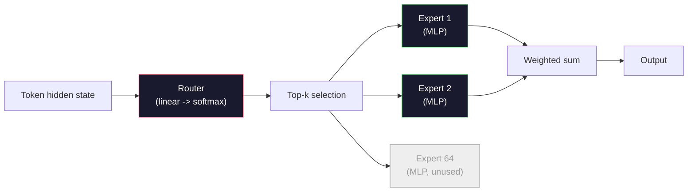

# Open Models: Architecture Walkthroughs

> Bạn đã xây dựng một mô hình GPT-2 Small từ đầu trong Bài 04. Các mô hình mở tiên phong vào năm 2026 cũng thuộc cùng một họ đó với năm hoặc sáu thay đổi cụ thể. RMSNorm thay vì LayerNorm. SwiGLU thay vì GELU. RoPE thay vì vị trí học được (learned positions). GQA hoặc MLA thay vì MHA đầy đủ. Mixture-of-Experts ở quy mô lớn. Những kiến thức toán học bạn đã biết bao phủ 95% các mô hình này. Bài học này sẽ đọc Llama 3, DeepSeek-V3, Mixtral, Qwen và Gemma song song với nhau và chỉ ra chính xác dòng mã nơi mỗi kiến trúc khác biệt.

**Type:** Learn
**Languages:** Python (stdlib)
**Prerequisites:** Phase 10, Lessons 04, 05, 12 (Pre-training, Scaling, Inference)
**Time:** ~45 phút

## Mục tiêu học tập

- Đọc tệp config.json của Llama 3, Mistral, Mixtral, Gemma 2, Qwen 2.5 và DeepSeek-V3 và giải thích mọi trường dữ liệu.
- Nêu tên thay đổi kiến trúc cụ thể mà mỗi mô hình thực hiện so với GPT-2 Small và giải thích lý do từ các nguyên lý cơ bản.
- Tính toán số lượng tham số, kích thước KV cache và bộ nhớ kích hoạt (activation memory) cho bất kỳ mô hình mở nào chỉ từ tệp cấu hình.
- Chọn đúng mô hình mở cho mục tiêu triển khai dựa trên các ràng buộc về độ trễ, bộ nhớ và khả năng.

## Vấn đề

Trong Bài 04, bạn đã viết 350 dòng mã numpy và có một mô hình mang hình dáng GPT-2. Llama 3 405B có một báo cáo kỹ thuật dài 200 trang. Bản năng của bạn cho rằng đây là những thực thể khác biệt. Thực tế không phải vậy. 200 trang đó mô tả cùng một đối tượng với năm hoặc sáu sửa đổi có mục đích rõ ràng, cộng với hàng nghìn chi tiết triển khai về việc mở rộng quy mô. Bộ khung -- embedding, transformer blocks, attention, MLP, norm, head -- vẫn không thay đổi.

Bài học này là một bản diff (so sánh sự khác biệt). Đối với mỗi họ mô hình mở lớn, chúng tôi liệt kê chính xác những gì đã thay đổi so với GPT-2, tại sao và cái giá phải trả là gì. Khi hoàn thành, bạn có thể đọc một model card mới và dịch ngược nó về nền tảng GPT-2 trong tâm trí.

Lợi ích thực tế là khi Meta phát hành Llama 5 hoặc DeepSeek phát hành V4, bạn sẽ không cần một mô hình tư duy mới. Bạn sẽ nhìn vào cấu hình, thấy các nút điều chỉnh quen thuộc đã thay đổi như thế nào và biết được các hệ quả kéo theo. Các kiến trúc năm 2026 là một bộ công cụ hữu hạn. Mỗi mô hình mới chọn một tập hợp con khác nhau.

## Khái niệm

### Lõi bất biến (The Invariant Core)

Tất cả các mô hình mở tự hồi quy (autoregressive) đều chia sẻ:

- Ma trận nhúng từ vựng (vocab_size x hidden_dim).
- Chồng N khối decoder: norm, self-attention, residual, norm, MLP, residual.
- Norm cuối cùng và linear head chiếu ra vocab_size (thường dùng chung trọng số với embeddings).
- Causal mask, hàm mất mát cross-entropy cho token tiếp theo.

Đó là hình dáng cơ bản. Phần còn lại là các nút điều chỉnh.

### Sáu nút điều chỉnh thực sự thay đổi

Trên khắp các mô hình mở tiên phong giai đoạn 2024-2026, sáu lựa chọn thiết kế giống nhau được chọn đi chọn lại:

1. **Chuẩn hóa (Normalization).** LayerNorm -> RMSNorm.
2. **Mã hóa vị trí (Positional encoding).** Learned absolute -> RoPE (cộng với các biến thể: YaRN, NTK).
3. **Kích hoạt (Activation).** GELU -> SwiGLU (hoặc GeGLU).
4. **Chia sẻ đầu attention (Attention head sharing).** MHA -> GQA -> MQA -> MLA.
5. **MLP dày đặc vs thưa (Dense vs sparse MLP).** Dense -> Mixture-of-Experts.
6. **Vị trí Pre-norm.** Pre-norm được giữ lại. Post-norm đã bị loại bỏ.

Mọi thứ khác (lịch trình tốc độ học, hỗn hợp dữ liệu, kích thước batch, độ dài ngữ cảnh) nằm trong cấu hình huấn luyện, không phải kiến trúc. Sáu nút điều chỉnh.

### Nút 1: RMSNorm

LayerNorm trừ đi giá trị trung bình, chia cho độ lệch chuẩn, sau đó scale và shift. RMSNorm chỉ giữ lại phần scale:

```
RMSNorm(x) = x / sqrt(mean(x^2) + eps) * gamma
```

Không trừ trung bình. Không có bias. Ít hơn một phép nhân ma trận trên mỗi token. Zhang và Sennrich (2019) lập luận rằng nó tương đương với LayerNorm trong dịch máy trong khi nhanh hơn 10%. Mọi mô hình mở hiện đại đều sử dụng nó.

Chi phí: không có. Lợi ích: tăng nhẹ thông lượng, mã nguồn đơn giản hơn.

### Nút 2: RoPE

Các nhúng vị trí học được (learned position embeddings) là một bảng tra cứu 1024 vị trí trong GPT-2. Ngữ cảnh 1025 nằm ngoài bảng. Các mô hình không thể ngoại suy vượt quá độ dài huấn luyện của chúng.

Rotary Position Embedding (RoPE, Su et al. 2021) đưa vị trí vào bằng cách xoay mỗi vector Q và K theo từng cặp trước khi thực hiện tích vô hướng attention. Góc xoay là một hàm xác định của vị trí, vì vậy không có gì cần học và không bao giờ bị "hết" vị trí. Với các thủ thuật scale (NTK-aware interpolation, YaRN), một mô hình được huấn luyện trên ngữ cảnh 8k có thể mở rộng lên 128k khi suy luận với mức giảm độ chính xác khiêm tốn.

```
q_rotated = rotate(q, angle(pos))
k_rotated = rotate(k, angle(pos))
score = q_rotated . k_rotated
```

Mọi Llama, Mistral, Qwen, DeepSeek và Gemma đều sử dụng RoPE. Gemma 2 sử dụng một biến thể lai (RoPE trên hầu hết các lớp, attention cửa sổ trượt cục bộ trên các lớp khác).

### Nút 3: SwiGLU

MLP của GPT-2 là `x -> gelu(xW1 + b1) -> (...)W2 + b2`. SwiGLU (Shazeer 2020) thay thế hàm kích hoạt bằng một tích cổng (gated product):

```
SwiGLU(x) = (xW1) * sigmoid(xW1) * xV
```

Hai phép chiếu song song thay vì một, được điều khiển bởi hàm kích hoạt Swish. Thực nghiệm cho thấy hiệu quả hơn về độ phức tạp (perplexity) trên mỗi tham số. Llama 2 đã áp dụng nó và mọi người đều làm theo. Kích thước ẩn của MLP thường được đặt sao cho tổng số tham số khớp với MLP dày đặc ban đầu: nếu GPT-2 sử dụng `ff_dim = 4 * hidden`, SwiGLU sử dụng `ff_dim = (2/3) * 4 * hidden = 8/3 * hidden`.

### Nút 4: Chia sẻ đầu Attention

GPT-2 sử dụng **Multi-Head Attention (MHA)**: mỗi đầu có phép chiếu Q, K, V riêng.

**Multi-Query Attention (MQA, Shazeer 2019)** chia sẻ một K và một V cho tất cả các đầu. Cắt giảm KV cache theo số lượng đầu (num_heads), giảm từ 12x đến 32x trên một mô hình điển hình. Độ chính xác giảm nhẹ trên các bài kiểm tra khó.

**Grouped-Query Attention (GQA, Ainslie et al. 2023)** là điểm trung gian: G nhóm đầu Q chia sẻ một K và một V. Llama 3 8B sử dụng GQA với 32 đầu Q và 8 đầu KV (G=8), vì vậy KV cache giảm 4x so với MHA đầy đủ.

**Multi-Head Latent Attention (MLA, DeepSeek 2024)** nén K và V thành một latent hạng thấp (low-rank) dùng chung, sau đó chiếu ngược lại cho mỗi đầu. Giảm thêm KV cache trong khi vẫn bảo toàn khả năng biểu đạt của từng đầu. DeepSeek-V2 và V3 dựa vào điều này để đạt hiệu suất ngữ cảnh dài.

| Scheme | KV Heads | KV Cache | Accuracy |
|--------|----------|----------|----------|
| MHA    | num_heads | full | best |
| GQA    | num_groups (G < num_heads) | num_heads / G reduction | near-MHA |
| MQA    | 1 | num_heads reduction | small hit |
| MLA    | latent, per-head decompression | smaller than MQA | near-MHA |

Đối với bất kỳ mô hình nào trên ~13B tham số, GQA hoặc MLA là bắt buộc. MHA đầy đủ ở quy mô lớn là một thảm họa về KV cache.

### Nút 5: Mixture of Experts

Một MLP dày đặc kích hoạt tất cả các tham số của nó cho mỗi token. Một MoE MLP có K chuyên gia (experts) mỗi khối và một bộ định tuyến (router) chọn top-k chuyên gia cho mỗi token (thường là top-2). Chỉ trọng số của các chuyên gia đó mới thực hiện forward pass cho token đó.

```
router_logits = xW_r
indices, weights = top_k(router_logits, k=2)
output = sum_i weights[i] * expert[indices[i]](x)
```

Sức hấp dẫn: bạn có thể có 64 chuyên gia, mỗi chuyên gia 7B (tổng số tham số rất lớn) trong khi chỉ chạy 2 chuyên gia mỗi token (tính toán mỗi token tương đương với mô hình 7B dày đặc). Mixtral 8x7B có tổng cộng 47B tham số nhưng chỉ kích hoạt 13B mỗi token. DeepSeek-V3 có tổng cộng 671B tham số nhưng chỉ kích hoạt 37B mỗi token.



Ưu điểm: cùng mức tính toán, nhiều tham số hơn, dung lượng tốt hơn. Nhược điểm: bộ nhớ chuyên gia vẫn phải nằm ở đâu đó (vì vậy việc phục vụ cần nhiều VRAM hơn so với mô hình dày đặc tương đương), việc cân bằng tải cho bộ định tuyến rất khó và tinh chỉnh bộ định tuyến trong quá trình căn chỉnh (alignment) là một lĩnh vực nghiên cứu riêng.

### Nút 6: Pre-norm được giữ lại

Transformer gốc áp dụng layer norm sau mỗi lớp con. Mọi mô hình mở kể từ GPT-2 đều đặt nó *trước* mỗi lớp con. Pre-norm thực sự dễ huấn luyện hơn ở độ sâu lớn. Không có gì để tranh cãi.

### So sánh từng mô hình (Model-by-Model Diff)

Đây là bảng làm cho tất cả những điều trên trở nên cụ thể.

| Model | Year | Total Params | Active Params | Norm | Activation | Position | Attention | MoE | Context |
|-------|------|-------------|---------------|------|-----------|----------|-----------|-----|---------|
| GPT-2 Small | 2019 | 124M | 124M | LayerNorm | GELU | Learned | MHA (12 heads) | no | 1k |
| Llama 3 8B | 2024 | 8B | 8B | RMSNorm | SwiGLU | RoPE | GQA (32/8) | no | 128k |
| Llama 3 70B | 2024 | 70B | 70B | RMSNorm | SwiGLU | RoPE | GQA (64/8) | no | 128k |
| Llama 3 405B | 2024 | 405B | 405B | RMSNorm | SwiGLU | RoPE | GQA (128/16) | no | 128k |
| Mistral 7B | 2023 | 7.2B | 7.2B | RMSNorm | SwiGLU | RoPE | GQA | no | 32k |
| Mixtral 8x7B | 2023 | 47B | 13B | RMSNorm | SwiGLU | RoPE | GQA | yes (8 experts, top-2) | 32k |
| Gemma 2 9B | 2024 | 9B | 9B | RMSNorm (pre+post) | GeGLU | RoPE + sliding | GQA | no | 8k |
| Qwen 2.5 72B | 2024 | 72B | 72B | RMSNorm | SwiGLU | RoPE (YaRN) | GQA (64/8) | no | 128k |
| DeepSeek V2 236B | 2024 | 236B | 21B | RMSNorm | SwiGLU | RoPE | MLA | yes (160 experts, top-6) | 128k |
| DeepSeek V3 | 2024 | 671B | 37B | RMSNorm | SwiGLU | RoPE | MLA | yes (256 experts, top-8) | 128k |

Hãy quét qua các cột. RMSNorm là phổ quát. SwiGLU hoặc biến thể GeGLU là phổ quát. RoPE là phổ quát. GQA là phổ quát trên 7B trừ khi được thay thế bằng MLA. MoE là yếu tố khác biệt ở phân khúc cao cấp.

### Đọc tệp config.json

Cấu hình Llama 3 8B:

```
{
  "hidden_size": 4096,
  "intermediate_size": 14336,
  "num_hidden_layers": 32,
  "num_attention_heads": 32,
  "num_key_value_heads": 8,
  "max_position_embeddings": 131072,
  "rope_theta": 500000.0,
  "rms_norm_eps": 1e-5,
  "vocab_size": 128256
}
```

Mỗi trường tương ứng với thứ gì đó bạn đã triển khai.

- `hidden_size`: kích thước nhúng.
- `intermediate_size`: kích thước ẩn MLP (3.5x hidden -- toán học SwiGLU).
- `num_hidden_layers`: độ sâu chồng lớp.
- `num_attention_heads`: số đầu Q.
- `num_key_value_heads`: số đầu KV (GQA).
- `max_position_embeddings`: độ dài ngữ cảnh huấn luyện.
- `rope_theta`: tần số cơ sở RoPE. Meta đã scale nó từ mặc định 10k lên 500k để ngoại suy ngữ cảnh dài.
- `rms_norm_eps`: độ ổn định số học.
- `vocab_size`: số lượng token.

Chỉ từ những thông tin này, bạn có thể tính toán tổng số tham số, KV cache và bộ nhớ kích hoạt đỉnh. Xem `code/main.py` để biết các công thức chính xác.

### Ngân sách bộ nhớ kích hoạt (Activation memory budget)

Các kích hoạt chiếm ưu thế trong bộ nhớ huấn luyện trên vài tỷ tham số. Quy tắc ngón tay cái cho tiền huấn luyện (với gradient checkpointing):

```
activation_mem ~ batch_size * seq_len * hidden_size * num_layers * bytes_per_element
```

Đối với Llama 3 8B tại batch 1, seq 8192, BF16, 32 lớp, hidden 4096: khoảng 8 GB chỉ cho các kích hoạt với checkpointing, 40 GB nếu không có. Đây là lý do tại sao flash-attention và ring-attention quan trọng -- chúng viết lại phép tính attention để các kích hoạt vừa với bộ nhớ.

### Ngân sách KV Cache

Đối với suy luận ở ngữ cảnh tối đa:

```
kv_cache = 2 * num_layers * num_kv_heads * head_dim * max_seq_len * bytes_per_element
```

Llama 3 8B tại ngữ cảnh 128k, BF16, head_dim = hidden / num_heads = 128:
`2 * 32 * 8 * 128 * 131072 * 2 = 17.2 GB` trên mỗi chuỗi.

Trọng số 8B là 16 GB ở BF16. KV cache cho một chuỗi 128k lớn hơn cả trọng số. Đây là áp lực bộ nhớ thúc đẩy nghiên cứu về GQA, MLA và lượng tử hóa KV cache.

### Khi nào mỗi mô hình chiến thắng

- **GPU 80GB đơn lẻ, không MoE**: Llama 3 8B, Mistral 7B, Gemma 2 9B. Dễ phục vụ, công cụ hỗ trợ rộng rãi.
- **Một node (8x80GB), dung lượng lớn**: Llama 3 70B, Qwen 2.5 72B. Khả năng dày đặc mở cao nhất.
- **Khả năng mở lớn nhất, chấp nhận độ phức tạp MoE**: DeepSeek V3, Mixtral 8x22B. Khả năng tốt nhất trên mỗi FLOP hoạt động.
- **Nhu cầu ngữ cảnh dài**: Llama 3 (128k với RoPE scaling), DeepSeek (lợi thế MLA).
- **Phục vụ độ trễ thấp**: Gemma 2 9B (cửa sổ trượt cắt giảm tính toán ngữ cảnh dài).

```figure
rmsnorm-vs-layernorm
```

## Xây dựng

Mã của bài học này là một máy tính. Với bất kỳ config.json nào, nó in ra số lượng tham số theo thành phần, KV cache ở ngữ cảnh tối đa, tỷ lệ MLP SwiGLU và một bản đánh giá ngắn về kiến trúc (dense / GQA / MLA / MoE).

```python
config = {
    "hidden_size": 4096, "intermediate_size": 14336,
    "num_hidden_layers": 32, "num_attention_heads": 32,
    "num_key_value_heads": 8, "vocab_size": 128256,
    "max_position_embeddings": 131072,
}
```

Tập lệnh đi qua kiến trúc theo từng trường, tính toán số lượng tham số cho embedding, attention (với giảm GQA), MLP (với mở rộng SwiGLU), layernorms và head. Sau đó, nó tính toán KV cache ở độ dài ngữ cảnh đã nêu và in ra bản tóm tắt.

Xem `code/main.py` để biết cách triển khai.

## Sử dụng

Chạy máy tính trên các cấu hình Llama 3 8B, Mistral 7B, Mixtral 8x7B và DeepSeek V3 được đóng gói trong tập lệnh. So sánh các phân tích tham số. Lưu ý rằng các mô hình MoE có tổng số tham số làm lu mờ các mô hình dày đặc nhưng số lượng tham số hoạt động thường nhỏ hơn. Lưu ý rằng KV cache của DeepSeek V3 nhỏ hơn của Llama 3 405B mặc dù có nhiều tham số tổng thể hơn -- đó là MLA đang hoạt động.

Sau đó, cắm cấu hình cho bất kỳ mô hình nào bạn có cục bộ, đọc bản tóm tắt và quyết định xem nó có vừa với GPU của bạn không.

## Triển khai (Ship It)

Bài học này tạo ra `outputs/skill-open-model-picker.md`. Với mục tiêu triển khai (loại GPU, VRAM, độ dài ngữ cảnh, ngân sách độ trễ) và hồ sơ tác vụ (chat, code, suy luận, ngữ cảnh dài), nó đề xuất một mô hình mở, một lược đồ lượng tử hóa từ Bài 11 và một ngăn xếp suy luận từ Bài 12, với lập luận rõ ràng về sáu nút kiến trúc.

## Bài tập

1. Đọc cấu hình Qwen 2.5 72B từ HuggingFace. Tính tổng số tham số từ đầu. So sánh với giá trị do HF báo cáo và xác định xem sự khác biệt đến từ đâu (làm tròn head dim, hệ số chia sẻ KV, v.v.).

2. DeepSeek V3 sử dụng 256 chuyên gia với định tuyến top-8. Tính tỷ lệ chuyên gia được kích hoạt trên tổng số chuyên gia và so sánh với top-2 của 8 của Mixtral 8x7B. Sự chuyển dịch từ thưa (25%) sang thưa dày hơn (3%) ngụ ý gì về khả năng trên mỗi FLOP?

3. Tính KV cache cho Llama 3 405B ở ngữ cảnh 128k trong FP8 và BF16. Ở FP8, nó bằng một nửa con số BF16. Bạn có thể phục vụ bao nhiêu chuỗi song song trên một node 8xH100 (mỗi node 80GB = tổng 640GB, trừ đi bộ nhớ trọng số)?

4. Gemma 2 xen kẽ các lớp full-attention và sliding-window-attention. Viết công thức toán học cho KV cache khi một nửa số lớp sử dụng cửa sổ trượt 4096 token thay vì ngữ cảnh đầy đủ. Nó tiết kiệm bao nhiêu bộ nhớ ở ngữ cảnh tổng 8k?

5. Tìm một mô hình mở tiên phong gần đây được phát hành sau khi bài học này được viết. Xác định xem nó đã chọn nút nào trong sáu nút và liệu nó có giới thiệu nút thứ bảy hay không. Chương trình giảng dạy sẽ cảm thấy lỗi thời ngay khi một kiến trúc mới ra đời -- mục tiêu là cập nhật bảng của bạn mà không cần xây dựng lại mô hình tư duy của bạn.

## Thuật ngữ chính

| Thuật ngữ | Cách mọi người nói | Ý nghĩa thực tế |
|------|----------------|----------------------|
| RMSNorm | "LayerNorm không có trung bình" | Chuẩn hóa chỉ bằng căn bậc hai trung bình, với một tỷ lệ học được — rẻ hơn và tương đương với LayerNorm |
| RoPE | "Vị trí xoay" | Xoay mỗi vector Q và K theo cặp 2D bằng một góc phụ thuộc vào vị trí — ngoại suy vượt quá độ dài huấn luyện với các thủ thuật scale |
| SwiGLU | "Kích hoạt MLP mới" | Gated linear unit với Swish: `(xW1) * sigmoid(xW1) * xV` — tiêu chuẩn trong mọi mô hình mở từ 2024+ |
| GQA | "Attention trung gian" | Grouped-Query Attention: G nhóm đầu Q chia sẻ một đầu K và một đầu V — thu nhỏ KV cache mà không bị giảm độ chính xác như MQA |
| MLA | "Attention của DeepSeek" | Multi-Head Latent Attention: nén K/V thành một latent hạng thấp dùng chung, giải nén theo từng đầu — KV cache nhỏ nhất cho các mô hình lớn |
| MoE | "Chuyên gia thưa" | Mixture of Experts: N MLP mỗi khối, bộ định tuyến chọn top-k mỗi token — tổng tham số khổng lồ, tham số hoạt động nhỏ |
| Top-k routing | "Chọn k chuyên gia mỗi token" | Bộ định tuyến tính điểm cho mỗi chuyên gia và kích hoạt k chuyên gia cao nhất — k điển hình là 2 (Mixtral) đến 8 (DeepSeek) |
| YaRN | "Kéo dài RoPE" | Yet another RoPE extension — nội suy các góc xoay để mở rộng ngữ cảnh từ 8k lên 128k+ tại thời điểm suy luận |
| Sliding-window attention | "Đừng chú ý đến mọi thứ" | Mỗi token chỉ chú ý đến W token cuối cùng — giới hạn chi phí attention ở O(W) mỗi token, được sử dụng trong Gemma 2 và Mistral đời đầu |
| Active params | "Cái gì chạy mỗi token" | Đối với mô hình MoE, số lượng tham số thực hiện forward pass mỗi token (nhỏ hơn nhiều so với tổng tham số) — quyết định FLOPs mỗi token |

## Đọc thêm

- [Dubey et al., 2024 -- "The Llama 3 Herd of Models"](https://arxiv.org/abs/2407.21783) -- tài liệu tham khảo về kiến trúc và huấn luyện cho họ Llama 3 dày đặc
- [DeepSeek-AI, 2024 -- "DeepSeek-V3 Technical Report"](https://arxiv.org/abs/2412.19437) -- MLA cộng với cân bằng tải không cần auxiliary-loss cộng với 671B MoE
- [Jiang et al., 2024 -- "Mixtral of Experts"](https://arxiv.org/abs/2401.04088) -- bài báo về mô hình mở MoE kinh điển
- [Su et al., 2021 -- "RoFormer: Enhanced Transformer with Rotary Position Embedding"](https://arxiv.org/abs/2104.09864) -- bài báo về RoPE
- [Shazeer, 2020 -- "GLU Variants Improve Transformer"](https://arxiv.org/abs/2002.05202) -- SwiGLU, GeGLU và các biến thể
- [Ainslie et al., 2023 -- "GQA: Training Generalized Multi-Query Transformer Models"](https://arxiv.org/abs/2305.13245) -- bài báo về GQA
- [Gemma 2 Team, 2024 -- "Gemma 2: Improving Open Language Models at a Practical Size"](https://arxiv.org/abs/2408.00118) -- attention lai full+sliding, pre+post-norm
- [Qwen Team, 2024 -- "Qwen 2.5 Technical Report"](https://arxiv.org/abs/2412.15115) -- mở rộng ngữ cảnh YaRN và các công thức huấn luyện ngữ cảnh dài