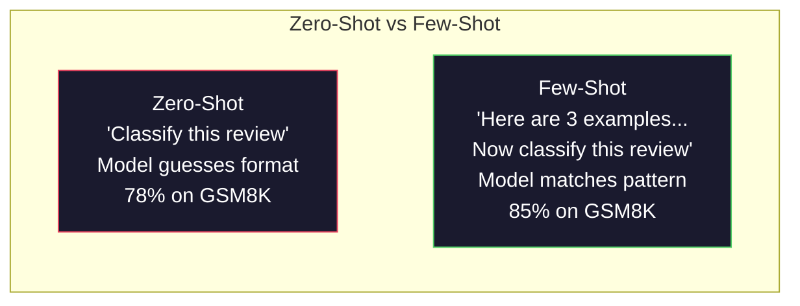
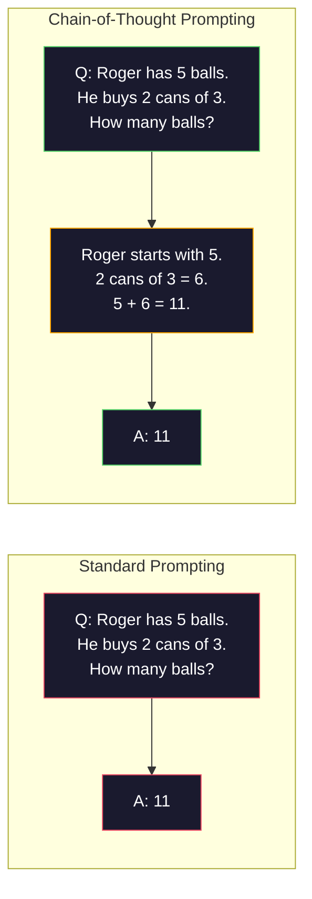
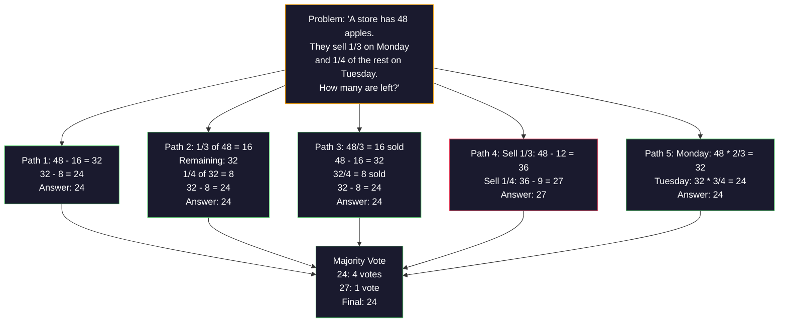
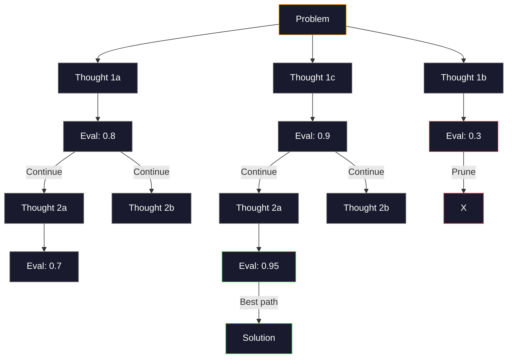

# Few-Shot, Chain-of-Thought, Tree-of-Thought

> Nói cho model biết phải làm gì là prompting. Chỉ cho nó cách suy nghĩ là engineering. Khoảng cách giữa độ chính xác 78% và 91% trên cùng một model, cùng một tác vụ, cùng một dữ liệu không đến từ một model tốt hơn. Nó đến từ một chiến lược suy luận tốt hơn.

**Type:** Build
**Languages:** Python
**Prerequisites:** Bài 11.01 (Prompt Engineering)
**Time:** ~45 phút

## Mục tiêu học tập

- Triển khai few-shot prompting bằng cách chọn lọc và định dạng các ví dụ minh họa để tối đa hóa độ chính xác của tác vụ
- Áp dụng suy luận chain-of-thought (CoT) để cải thiện độ chính xác cho các bài toán nhiều bước như bài toán đố toán học
- Xây dựng prompt tree-of-thought để khám phá nhiều luồng suy luận và chọn ra luồng tốt nhất
- Đo lường sự cải thiện độ chính xác giữa zero-shot, few-shot và CoT trên một benchmark tiêu chuẩn

## Vấn đề

Bạn xây dựng một ứng dụng gia sư toán. Prompt của bạn là: "Giải bài toán đố này." GPT-5 giải đúng 94% trên GSM8K, benchmark toán tiểu học tiêu chuẩn. Bạn nghĩ mình đã đạt đỉnh. Bạn chưa đâu — chain-of-thought vẫn giúp tăng thêm 3-4 điểm phần trăm.

Thêm năm từ -- "Let's think step by step" (Hãy suy nghĩ từng bước một) -- và độ chính xác nhảy vọt lên 91%. Thêm một vài ví dụ đã giải và nó đạt 95%. Cùng một model. Cùng một temperature. Cùng chi phí API. Sự khác biệt duy nhất là bạn đã cung cấp cho model một tờ giấy nháp.

Đây không phải là một thủ thuật. Đây là cách suy luận hoạt động. Con người không giải các bài toán nhiều bước trong một cú nhảy tư duy. Các Transformer cũng vậy. Khi bạn ép model tạo ra các token trung gian, những token đó trở thành một phần của ngữ cảnh cho token tiếp theo. Mỗi bước suy luận nuôi dưỡng bước tiếp theo. Model thực sự tính toán từng bước để đi đến kết quả.

Nhưng "think step by step" chỉ là sự khởi đầu, không phải kết thúc. Điều gì sẽ xảy ra nếu bạn lấy mẫu năm luồng suy luận và thực hiện bỏ phiếu đa số? Điều gì sẽ xảy ra nếu bạn để model khám phá một cây khả năng, đánh giá và cắt tỉa các nhánh? Điều gì sẽ xảy ra nếu bạn đan xen suy luận với việc sử dụng công cụ? Đây không phải là giả thuyết. Đây là những kỹ thuật đã được công bố với những cải tiến đã được đo lường, và bạn sẽ xây dựng tất cả chúng trong bài học này.

## Khái niệm

### Zero-Shot vs Few-Shot: Khi ví dụ đánh bại hướng dẫn

Zero-shot prompting cung cấp cho model một tác vụ và không gì khác. Few-shot prompting cung cấp cho nó các ví dụ trước.

Wei và cộng sự (2022) đã đo lường điều này trên 8 benchmark. Đối với các tác vụ đơn giản như phân loại cảm xúc, zero-shot và few-shot có hiệu suất chênh lệch trong khoảng 2%. Đối với các tác vụ phức tạp như tính toán nhiều bước và suy luận biểu tượng, few-shot cải thiện độ chính xác từ 10-25%.

Trực giác: các ví dụ là những hướng dẫn được nén lại. Thay vì mô tả định dạng đầu ra, bạn chỉ cho nó thấy. Thay vì giải thích quy trình suy luận, bạn minh họa nó. Model khớp mẫu trên các ví dụ đáng tin cậy hơn là diễn giải các hướng dẫn trừu tượng.



**Khi nào few-shot thắng:** các tác vụ nhạy cảm về định dạng, phân loại, trích xuất có cấu trúc, thuật ngữ chuyên ngành, bất kỳ tác vụ nào mà model cần khớp với một mẫu cụ thể.

**Khi nào zero-shot thắng:** các câu hỏi thực tế đơn giản, các tác vụ sáng tạo nơi ví dụ làm hạn chế sự sáng tạo, các tác vụ mà việc tìm ví dụ tốt khó hơn việc viết hướng dẫn tốt.

### Chọn ví dụ: Tương tự tốt hơn ngẫu nhiên

Không phải tất cả các ví dụ đều như nhau. Việc chọn các ví dụ tương tự với đầu vào mục tiêu mang lại hiệu quả cao hơn 5-15% so với chọn ngẫu nhiên trên các tác vụ phân loại (Liu và cộng sự, 2022). Ba nguyên tắc:

1. **Tương đồng ngữ nghĩa**: chọn các ví dụ gần nhất với đầu vào trong không gian embedding
2. **Đa dạng nhãn**: bao phủ tất cả các danh mục đầu ra trong các ví dụ của bạn
3. **Khớp độ khó**: khớp với mức độ phức tạp của bài toán mục tiêu

Số lượng ví dụ tối ưu cho hầu hết các tác vụ là 3-5. Dưới 3, model không có đủ tín hiệu để trích xuất mẫu. Trên 5, bạn đạt đến lợi nhuận giảm dần và lãng phí token cửa sổ ngữ cảnh. Đối với phân loại với nhiều nhãn, hãy sử dụng một ví dụ cho mỗi nhãn.

### Chain-of-Thought: Cung cấp giấy nháp cho model

Chain-of-Thought (CoT) prompting được giới thiệu bởi Wei và cộng sự (2022) tại Google Brain. Ý tưởng rất đơn giản: thay vì chỉ yêu cầu model đưa ra câu trả lời, hãy yêu cầu nó hiển thị các bước suy luận trước.



Tại sao điều này hoạt động về mặt cơ học? Mỗi token mà một transformer tạo ra trở thành ngữ cảnh cho token tiếp theo. Nếu không có CoT, model phải nén tất cả suy luận vào trạng thái ẩn của một lần forward pass duy nhất. Với CoT, model ngoại hóa các tính toán trung gian thành các token. Mỗi token suy luận mở rộng độ sâu tính toán hiệu quả.

**Benchmark GSM8K (toán tiểu học, 8.5K bài toán):**

| Model | Zero-Shot | Zero-Shot CoT | Few-Shot CoT |
|-------|-----------|---------------|--------------|
| GPT-4o | 78% | 91% | 95% |
| GPT-5 | 94% | 97% | 98% |
| o4-mini (reasoning) | 97% | — | — |
| Claude Opus 4.7 | 93% | 97% | 98% |
| Gemini 3 Pro | 92% | 96% | 98% |
| Llama 4 70B | 80% | 89% | 94% |
| DeepSeek-V3.1 | 89% | 94% | 96% |

**Lưu ý về các model suy luận.** Các model như dòng o của OpenAI (o3, o4-mini) và DeepSeek-R1 chạy chain-of-thought nội bộ trước khi đưa ra câu trả lời. Việc thêm "Let's think step by step" vào một model suy luận là dư thừa và đôi khi phản tác dụng — chúng đã thực hiện điều đó rồi.

Hai biến thể của CoT:

**Zero-shot CoT**: thêm "Let's think step by step" vào prompt. Không cần ví dụ. Kojima và cộng sự (2022) đã chỉ ra rằng câu đơn này cải thiện độ chính xác trên các tác vụ số học, thông thường và suy luận biểu tượng.

**Few-shot CoT**: cung cấp các ví dụ bao gồm các bước suy luận. Hiệu quả hơn zero-shot CoT vì model thấy chính xác định dạng suy luận mà bạn mong đợi.

**Khi nào CoT gây hại**: các câu hỏi thực tế đơn giản ("Thủ đô của Pháp là gì?"), phân loại một bước, các tác vụ mà tốc độ quan trọng hơn độ chính xác. CoT thêm 50-200 token chi phí suy luận cho mỗi truy vấn. Đối với các tác vụ thông lượng cao, độ phức tạp thấp, đó là chi phí lãng phí.

### Self-Consistency: Lấy mẫu nhiều lần, bỏ phiếu một lần

Wang và cộng sự (2023) đã giới thiệu self-consistency. Cái nhìn sâu sắc: một luồng CoT đơn lẻ có thể chứa các lỗi suy luận. Nhưng nếu bạn lấy mẫu N luồng suy luận độc lập (sử dụng temperature > 0) và thực hiện bỏ phiếu đa số cho câu trả lời cuối cùng, các lỗi sẽ triệt tiêu lẫn nhau.



Self-consistency đã cải thiện độ chính xác GSM8K từ 56.5% (CoT đơn lẻ) lên 74.4% với N=40 trong các thí nghiệm PaLM 540B ban đầu. Trên GPT-5, sự cải thiện nhỏ (97% lên 98%) vì độ chính xác cơ bản đã bão hòa. Kỹ thuật này tỏa sáng nhất trên các model có độ chính xác CoT cơ bản từ 60-85% -- điểm ngọt nơi các lỗi luồng đơn lẻ thường xuyên xảy ra nhưng không có tính hệ thống. Đối với các model suy luận (dòng o, R1), self-consistency đã được tích hợp sẵn thông qua lấy mẫu nội bộ.

Sự đánh đổi: N mẫu có nghĩa là chi phí API và độ trễ gấp N lần. Trong thực tế, N=5 nắm bắt hầu hết lợi ích. N=3 là mức tối thiểu để có một cuộc bỏ phiếu có ý nghĩa. N > 10 có lợi nhuận giảm dần đối với hầu hết các tác vụ.

### Tree-of-Thought: Khám phá phân nhánh

Yao và cộng sự (2023) đã giới thiệu Tree-of-Thought (ToT). Trong khi CoT đi theo một luồng suy luận tuyến tính, ToT khám phá nhiều nhánh và đánh giá nhánh nào hứa hẹn nhất trước khi tiếp tục.



ToT có ba thành phần:

1. **Tạo suy nghĩ**: tạo ra nhiều bước tiếp theo ứng viên
2. **Đánh giá trạng thái**: chấm điểm từng ứng viên (có thể sử dụng chính LLM làm người đánh giá)
3. **Thuật toán tìm kiếm**: BFS hoặc DFS qua cây, cắt tỉa các nhánh có điểm số thấp

Trong tác vụ Game of 24 (kết hợp 4 số bằng số học để tạo ra 24), GPT-4 với prompting tiêu chuẩn giải được 7.3% bài toán. Với CoT, 4.0% (CoT thực sự gây hại ở đây vì không gian tìm kiếm rộng). Với ToT, 74%.

ToT rất đắt đỏ. Mỗi nút trong cây yêu cầu một lần gọi LLM. Một cây với hệ số phân nhánh 3 và độ sâu 3 yêu cầu tới 39 lần gọi LLM. Chỉ sử dụng nó cho các bài toán mà không gian tìm kiếm lớn nhưng có thể đánh giá được -- lập kế hoạch, giải đố, giải quyết vấn đề sáng tạo với các ràng buộc.

### ReAct: Suy nghĩ + Hành động

Yao và cộng sự (2022) đã kết hợp các dấu vết suy luận với các hành động. Model luân phiên giữa suy nghĩ (tạo suy luận) và hành động (gọi công cụ, tìm kiếm, tính toán).

```mermaid
graph LR
    Q["Question:\nWhat is the\npopulation of the\ncountry where\nthe Eiffel Tower\nis located?"]
    T1["Thought: I need to\nfind which country\nhas the Eiffel Tower"]
    A1["Action: search\n'Eiffel Tower location'"]
    O1["Observation:\nParis, France"]
    T2["Thought: Now I need\nFrance's population"]
    A2["Action: search\n'France population 2024'"]
    O2["Observation:\n68.4 million"]
    T3["Thought: I have\nthe answer"]
    F["Answer:\n68.4 million"]

    Q --> T1 --> A1 --> O1 --> T2 --> A2 --> O2 --> T3 --> F

    style Q fill:#1a1a2e,stroke:#ffa500,color:#fff
    style T1 fill:#1a1a2e,stroke:#51cf66,color:#fff
    style A1 fill:#1a1a2e,stroke:#e94560,color:#fff
    style O1 fill:#1a1a2e,stroke:#808080,color:#fff
    style T2 fill:#1a1a2e,stroke:#51cf66,color:#fff
    style A2 fill:#1a1a2e,stroke:#e94560,color:#fff
    style O2 fill:#1a1a2e,stroke:#808080,color:#fff
    style T3 fill:#1a1a2e,stroke:#51cf66,color:#fff
    style F fill:#1a1a2e,stroke:#51cf66,color:#fff
```



ReAct vượt trội hơn CoT thuần túy trên các tác vụ đòi hỏi kiến thức vì nó có thể dựa trên dữ liệu thực tế. Trên HotpotQA (trả lời câu hỏi nhiều bước), ReAct với GPT-4 đạt 35.1% khớp chính xác so với 29.4% chỉ với CoT. Sức mạnh thực sự là các lỗi suy luận được sửa chữa bởi các quan sát — model có thể cập nhật kế hoạch của mình giữa chừng khi thực thi.

ReAct là nền tảng của các AI agent hiện đại. Mọi framework agent (LangChain, CrewAI, AutoGen) đều triển khai một biến thể nào đó của vòng lặp Thought-Action-Observation. Bạn sẽ xây dựng các agent đầy đủ trong Giai đoạn 14. Bài học này bao gồm mẫu prompting.

### Prompting có cấu trúc: Thẻ XML, Dấu phân cách, Tiêu đề

Khi các prompt trở nên phức tạp, cấu trúc ngăn model nhầm lẫn các phần. Ba cách tiếp cận:

**Thẻ XML** (hoạt động tốt nhất với Claude, ổn định ở mọi nơi):
```
<context>
You are reviewing a pull request.
The codebase uses TypeScript and React.
</context>

<task>
Review the following diff for bugs, security issues, and style violations.
</task>

<diff>
{diff_content}
</diff>

<output_format>
List each issue with: file, line, severity (critical/warning/info), description.
</output_format>
```

**Tiêu đề Markdown** (phổ quát):
```
## Role
Senior security engineer at a fintech company.

## Task
Analyze this API endpoint for vulnerabilities.

## Input
{api_code}

## Rules
- Focus on OWASP Top 10
- Rate each finding: critical, high, medium, low
- Include remediation steps
```

**Dấu phân cách** (tối giản nhưng hiệu quả):
```
---INPUT---
{user_text}
---END INPUT---

---INSTRUCTIONS---
Summarize the above in 3 bullet points.
---END INSTRUCTIONS---
```

### Prompt Chaining: Phân rã tuần tự

Một số tác vụ quá phức tạp cho một prompt duy nhất. Prompt chaining chia chúng thành các bước, trong đó đầu ra của một prompt trở thành đầu vào của prompt tiếp theo.


Chaining đánh bại single-prompt vì ba lý do:

1. **Mỗi bước đơn giản hơn**: model xử lý một tác vụ tập trung thay vì phải xoay xở với mọi thứ
2. **Các đầu ra trung gian có thể kiểm tra được**: bạn có thể xác thực và sửa lỗi giữa các bước
3. **Các bước khác nhau có thể sử dụng các model khác nhau**: sử dụng model rẻ cho trích xuất, model đắt cho suy luận

### So sánh hiệu suất

| Kỹ thuật | Tốt nhất cho | Độ chính xác GSM8K (GPT-5) | Gọi API | Token Overhead | Độ phức tạp |
|-----------|----------|------------------------|-----------|----------------|------------|
| Zero-Shot | Tác vụ đơn giản | 94% | 1 | Không | Trivial |
| Few-Shot | Khớp định dạng | 96% | 1 | 200-500 tokens | Thấp |
| Zero-Shot CoT | Tăng tốc suy luận | 97% | 1 | 50-200 tokens | Trivial |
| Few-Shot CoT | Độ chính xác tối đa | 98% | 1 | 300-600 tokens | Thấp |
| Self-Consistency (N=5) | Suy luận quan trọng | 98.5% | 5 | 5x chi phí token | Trung bình |
| Reasoning model (o4-mini) | Thay thế CoT | 97% | 1 | ẩn (2-10x nội bộ) | Trivial |
| Tree-of-Thought | Tìm kiếm/lập kế hoạch | N/A (74% trên Game of 24) | 10-40+ | 10-40x chi phí token | Cao |
| ReAct | Suy luận dựa trên kiến thức | N/A (35.1% trên HotpotQA) | 3-10+ | Biến đổi | Cao |
| Prompt Chaining | Tác vụ nhiều bước | 96% (pipeline) | 2-5 | 2-5x chi phí token | Trung bình |

Kỹ thuật phù hợp phụ thuộc vào ba yếu tố: yêu cầu độ chính xác, ngân sách độ trễ và khả năng chịu chi phí. Đối với hầu hết các hệ thống sản xuất, few-shot CoT với dự phòng self-consistency 3 mẫu bao phủ 90% các trường hợp sử dụng.

```figure
few-shot-curve
```

## Xây dựng

Chúng ta sẽ xây dựng một trình giải bài toán toán học kết hợp few-shot prompting, suy luận chain-of-thought và bỏ phiếu self-consistency thành một pipeline duy nhất. Sau đó, chúng ta sẽ thêm tree-of-thought cho các bài toán khó.

Triển khai đầy đủ nằm trong `code/advanced_prompting.py`. Dưới đây là các thành phần chính.

### Bước 1: Kho lưu trữ ví dụ Few-Shot

Thành phần đầu tiên quản lý các ví dụ few-shot và chọn những ví dụ phù hợp nhất cho một bài toán nhất định.

```python
GSM8K_EXAMPLES = [
    {
        "question": "Janet's ducks lay 16 eggs per day. She eats three for breakfast every morning and bakes muffins for her friends every day with four. She sells every egg at the farmers' market for $2. How much does she make every day at the farmers' market?",
        "reasoning": "Janet's ducks lay 16 eggs per day. She eats 3 and bakes 4, using 3 + 4 = 7 eggs. So she has 16 - 7 = 9 eggs left. She sells each for $2, so she makes 9 * 2 = $18 per day.",
        "answer": "18"
    },
    ...
]
```

Mỗi ví dụ có ba phần: câu hỏi, chuỗi suy luận và câu trả lời cuối cùng. Chuỗi suy luận là thứ biến một ví dụ few-shot thông thường thành một ví dụ CoT few-shot.

### Bước 2: Trình xây dựng Prompt Chain-of-Thought

Trình xây dựng prompt tập hợp một thông báo hệ thống, các ví dụ few-shot với chuỗi suy luận và câu hỏi mục tiêu thành một prompt duy nhất.

```python
def build_cot_prompt(question, examples, num_examples=3):
    system = (
        "You are a math problem solver. "
        "For each problem, show your step-by-step reasoning, "
        "then give the final numerical answer on the last line "
        "in the format: 'The answer is [number]'."
    )

    example_text = ""
    for ex in examples[:num_examples]:
        example_text += f"Q: {ex['question']}\n"
        example_text += f"A: {ex['reasoning']} The answer is {ex['answer']}.\n\n"

    user = f"{example_text}Q: {question}\nA:"
    return system, user
```

Ràng buộc định dạng ("The answer is [number]") là rất quan trọng. Nếu không có nó, self-consistency không thể trích xuất và so sánh các câu trả lời giữa các mẫu.

### Bước 3: Bỏ phiếu Self-Consistency

Lấy mẫu N luồng suy luận và chọn câu trả lời đa số.

```python
def self_consistency_solve(question, examples, client, model, n_samples=5):
    system, user = build_cot_prompt(question, examples)

    answers = []
    reasonings = []
    for _ in range(n_samples):
        response = client.chat.completions.create(
            model=model,
            messages=[
                {"role": "system", "content": system},
                {"role": "user", "content": user}
            ],
            temperature=0.7
        )
        text = response.choices[0].message.content
        reasonings.append(text)
        answer = extract_answer(text)
        if answer is not None:
            answers.append(answer)

    vote_counts = Counter(answers)
    best_answer = vote_counts.most_common(1)[0][0] if vote_counts else None
    confidence = vote_counts[best_answer] / len(answers) if best_answer else 0

    return best_answer, confidence, reasonings, vote_counts
```

Temperature 0.7 là quan trọng. Ở temperature 0.0, tất cả N mẫu sẽ giống hệt nhau, làm mất đi mục đích. Bạn cần đủ tính ngẫu nhiên cho các luồng suy luận đa dạng nhưng không quá nhiều để model tạo ra những thứ vô nghĩa.

### Bước 4: Trình giải Tree-of-Thought

Đối với các bài toán mà suy luận tuyến tính thất bại, ToT khám phá nhiều cách tiếp cận và đánh giá hướng nào hứa hẹn nhất.

```python
def tree_of_thought_solve(question, client, model, breadth=3, depth=3):
    thoughts = generate_initial_thoughts(question, client, model, breadth)
    scored = [(t, evaluate_thought(t, question, client, model)) for t in thoughts]
    scored.sort(key=lambda x: x[1], reverse=True)

    for current_depth in range(1, depth):
        next_thoughts = []
        for thought, score in scored[:2]:
            extensions = extend_thought(thought, question, client, model, breadth)
            for ext in extensions:
                ext_score = evaluate_thought(ext, question, client, model)
                next_thoughts.append((ext, ext_score))
        scored = sorted(next_thoughts, key=lambda x: x[1], reverse=True)

    best_thought = scored[0][0] if scored else ""
    return extract_answer(best_thought), best_thought
```

Bản thân trình đánh giá là một lần gọi LLM. Bạn hỏi model: "Trên thang điểm từ 0.0 đến 1.0, luồng suy luận này hứa hẹn như thế nào để giải quyết bài toán?" Đây là cái nhìn sâu sắc chính của ToT -- model đánh giá các giải pháp một phần của chính nó.

### Bước 5: Pipeline đầy đủ

Pipeline kết hợp tất cả các kỹ thuật với một chiến lược leo thang.

```python
def solve_with_escalation(question, examples, client, model):
    system, user = build_cot_prompt(question, examples)
    single_response = call_llm(client, model, system, user, temperature=0.0)
    single_answer = extract_answer(single_response)

    sc_answer, confidence, _, _ = self_consistency_solve(
        question, examples, client, model, n_samples=5
    )

    if confidence >= 0.8:
        return sc_answer, "self_consistency", confidence

    tot_answer, _ = tree_of_thought_solve(question, client, model)
    return tot_answer, "tree_of_thought", None
```

Logic leo thang: thử cách rẻ (CoT đơn lẻ) trước. Nếu độ tin cậy của self-consistency dưới 0.8 (ít hơn 4 trong 5 mẫu đồng ý), hãy leo thang lên ToT. Điều này cân bằng chi phí và độ chính xác -- hầu hết các bài toán được giải quyết với chi phí thấp, các bài toán khó nhận được nhiều tài nguyên tính toán hơn.

## Sử dụng

### Few-Shot Prompts dựa trên Template

LangChain cung cấp hỗ trợ tích hợp cho các template prompt và phân tích cú pháp đầu ra giúp đơn giản hóa các mẫu few-shot và CoT:

```python
from langchain_core.prompts import FewShotPromptTemplate, PromptTemplate
from langchain_openai import ChatOpenAI

example_prompt = PromptTemplate(
    input_variables=["question", "reasoning", "answer"],
    template="Q: {question}\nA: {reasoning} The answer is {answer}."
)

few_shot_prompt = FewShotPromptTemplate(
    examples=examples,
    example_prompt=example_prompt,
    suffix="Q: {input}\nA: Let's think step by step.",
    input_variables=["input"]
)

llm = ChatOpenAI(model="gpt-4o", temperature=0.7)
chain = few_shot_prompt | llm
result = chain.invoke({"input": "If a train travels 120 km in 2 hours..."})
```

LangChain cũng có các lớp `ExampleSelector` để chọn lọc sự tương đồng ngữ nghĩa:

```python
from langchain_core.example_selectors import SemanticSimilarityExampleSelector
from langchain_openai import OpenAIEmbeddings

selector = SemanticSimilarityExampleSelector.from_examples(
    examples,
    OpenAIEmbeddings(),
    k=3
)
```

### Compiled Prompts

DSPy coi các chiến lược prompting là các module có thể tối ưu hóa. Thay vì tạo thủ công các prompt CoT, bạn xác định một signature và để DSPy tối ưu hóa prompt:

```python
import dspy

dspy.configure(lm=dspy.LM("openai/gpt-4o", temperature=0.7))

class MathSolver(dspy.Module):
    def __init__(self):
        self.solve = dspy.ChainOfThought("question -> answer")

    def forward(self, question):
        return self.solve(question=question)

solver = MathSolver()
result = solver(question="Janet's ducks lay 16 eggs per day...")
```

`ChainOfThought` của DSPy tự động thêm các dấu vết suy luận. `dspy.majority` triển khai self-consistency:

```python
result = dspy.majority(
    [solver(question=q) for _ in range(5)],
    field="answer"
)
```

### So sánh: Từ đầu vs Frameworks

| Tính năng | Từ đầu (bài học này) | LangChain | DSPy |
|---------|--------------------------|-----------|------|
| Kiểm soát định dạng prompt | Toàn quyền | Dựa trên template | Tự động |
| Self-consistency | Bỏ phiếu thủ công | Thủ công | Tích hợp (`dspy.majority`) |
| Chọn ví dụ | Logic tùy chỉnh | `ExampleSelector` | `dspy.BootstrapFewShot` |
| Tree-of-Thought | Tìm kiếm cây tùy chỉnh | Các chain cộng đồng | Không tích hợp |
| Tối ưu hóa prompt | Lặp lại thủ công | Thủ công | Biên dịch tự động |
| Tốt nhất cho | Học tập, pipeline tùy chỉnh | Workflow tiêu chuẩn | Nghiên cứu, tối ưu hóa |

## Ship It

Bài học này tạo ra hai sản phẩm.

**1. Reasoning Chain Prompt** (`outputs/prompt-reasoning-chain.md`): một template prompt sẵn sàng cho sản xuất cho few-shot CoT với self-consistency. Cắm các ví dụ và lĩnh vực bài toán của bạn vào.

**2. CoT Pattern Selection Skill** (`outputs/skill-cot-patterns.md`): một khung quyết định để chọn kỹ thuật suy luận phù hợp dựa trên loại tác vụ, yêu cầu độ chính xác và ràng buộc chi phí.

## Bài tập

1. **Đo lường khoảng cách**: Lấy 10 bài toán GSM8K. Giải từng bài với zero-shot, few-shot, zero-shot CoT và few-shot CoT. Ghi lại độ chính xác cho từng loại. Kỹ thuật nào mang lại sự cải thiện lớn nhất trên model của bạn?

2. **Thí nghiệm chọn ví dụ**: Với cùng 10 bài toán, so sánh việc chọn ví dụ ngẫu nhiên với các ví dụ tương tự được chọn thủ công. Đo lường sự khác biệt về độ chính xác. Tại thời điểm nào chất lượng ví dụ quan trọng hơn số lượng ví dụ?

3. **Đường cong chi phí Self-consistency**: Chạy self-consistency với N=1, 3, 5, 7, 10 trên 20 bài toán GSM8K. Vẽ biểu đồ độ chính xác so với chi phí (tổng số token). Đâu là điểm uốn của đường cong đối với model của bạn?

4. **Xây dựng vòng lặp ReAct**: Mở rộng pipeline với một công cụ máy tính. Khi model tạo ra một biểu thức toán học, hãy thực thi nó bằng `eval()` của Python (trong sandbox) và đưa kết quả trở lại. Đo lường xem suy luận dựa trên công cụ có vượt trội hơn CoT thuần túy hay không.

5. **ToT cho các tác vụ sáng tạo**: Điều chỉnh trình giải Tree-of-Thought cho một tác vụ viết sáng tạo: "Viết một câu chuyện 6 từ vừa hài hước vừa buồn." Sử dụng LLM làm người đánh giá. Liệu khám phá phân nhánh có tạo ra kết quả sáng tạo tốt hơn so với tạo single-shot không?

## Thuật ngữ chính

| Thuật ngữ | Mọi người nói | Ý nghĩa thực sự |
|------|----------------|----------------------|
| Few-shot prompting | "Cho nó vài ví dụ" | Bao gồm các minh họa đầu vào-đầu ra trong prompt để neo định dạng đầu ra và hành vi của model |
| Chain-of-Thought | "Bắt nó suy nghĩ từng bước" | Khơi gợi các token suy luận trung gian giúp mở rộng khả năng tính toán hiệu quả của model trước khi đưa ra câu trả lời cuối cùng |
| Self-Consistency | "Chạy nó nhiều lần" | Lấy mẫu N luồng suy luận đa dạng ở temperature > 0 và chọn câu trả lời cuối cùng phổ biến nhất bằng bỏ phiếu đa số |
| Tree-of-Thought | "Để nó khám phá các lựa chọn" | Tìm kiếm có cấu trúc trên các nhánh suy luận, nơi mỗi giải pháp một phần được đánh giá và chỉ các nhánh hứa hẹn mới được mở rộng |
| ReAct | "Suy nghĩ + sử dụng công cụ" | Đan xen các dấu vết suy luận với các hành động bên ngoài (tìm kiếm, tính toán, gọi API) trong vòng lặp Thought-Action-Observation |
| Prompt chaining | "Chia nó thành các bước" | Phân rã một tác vụ phức tạp thành các prompt tuần tự, trong đó mỗi đầu ra nuôi dưỡng đầu vào tiếp theo |
| Zero-shot CoT | "Chỉ cần thêm 'think step by step'" | Thêm cụm từ kích hoạt suy luận vào prompt mà không cần ví dụ, dựa vào khả năng suy luận tiềm ẩn của model |

## Đọc thêm

- [Chain-of-Thought Prompting Elicits Reasoning in Large Language Models](https://arxiv.org/abs/2201.11903) -- Wei và cộng sự 2022. Bài báo CoT gốc từ Google Brain. Đọc phần 2-3 để biết các kết quả cốt lõi.
- [Self-Consistency Improves Chain of Thought Reasoning in Language Models](https://arxiv.org/abs/2203.11171) -- Wang và cộng sự 2023. Bài báo về self-consistency. Bảng 1 có tất cả các con số bạn cần.
- [Tree of Thoughts: Deliberate Problem Solving with Large Language Models](https://arxiv.org/abs/2305.10601) -- Yao và cộng sự 2023. Bài báo ToT. Kết quả Game of 24 trong phần 4 là điểm nhấn.
- [ReAct: Synergizing Reasoning and Acting in Language Models](https://arxiv.org/abs/2210.03629) -- Yao và cộng sự 2022. Nền tảng của các AI agent hiện đại. Phần 3 giải thích vòng lặp Thought-Action-Observation.
- [Large Language Models are Zero-Shot Reasoners](https://arxiv.org/abs/2205.11916) -- Kojima và cộng sự 2022. Bài báo "Let's think step by step". Hiệu quả đáng ngạc nhiên so với sự đơn giản của nó.
- [DSPy: Compiling Declarative Language Model Calls into Self-Improving Pipelines](https://arxiv.org/abs/2310.03714) -- Khattab và cộng sự 2023. Coi prompting là một bài toán biên dịch. Đọc nếu bạn muốn vượt ra ngoài prompt engineering thủ công.
- [OpenAI — Reasoning models guide](https://platform.openai.com/docs/guides/reasoning) -- hướng dẫn của nhà cung cấp về thời điểm chain-of-thought trở thành chế độ "suy luận" nội bộ, tính phí theo token thay vì một thủ thuật cấp prompt.
- [Lightman và cộng sự, "Let's Verify Step by Step" (2023)](https://arxiv.org/abs/2305.20050) -- các model phần thưởng quy trình (PRM) chấm điểm từng bước của một chuỗi; tín hiệu giám sát suy luận thành công hơn các phần thưởng chỉ dựa trên kết quả.
- [Snell và cộng sự, "Scaling LLM Test-Time Compute Optimally" (2024)](https://arxiv.org/abs/2408.03314) -- nghiên cứu hệ thống về độ dài CoT, lấy mẫu self-consistency và MCTS; nơi "think step by step" đi đến khi độ chính xác quan trọng hơn độ trễ.