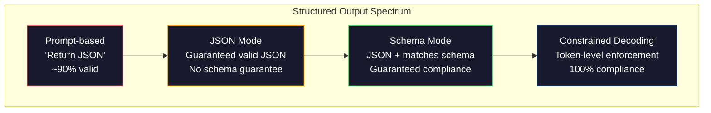
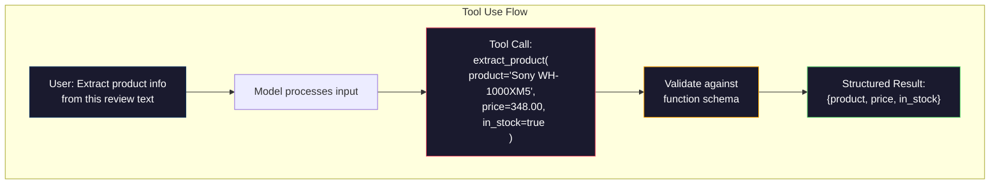

# Structured Outputs: JSON, Schema Validation, Constrained Decoding

> LLM của bạn trả về một chuỗi văn bản. Ứng dụng của bạn cần JSON. Khoảng cách đó đã làm sập nhiều hệ thống production hơn bất kỳ lỗi hallucination nào của mô hình. Structured output là cầu nối giữa ngôn ngữ tự nhiên và dữ liệu có kiểu (typed data). Làm đúng, LLM của bạn sẽ trở thành một API đáng tin cậy. Làm sai, bạn sẽ phải parse văn bản tự do bằng regex vào lúc 3 giờ sáng.

**Type:** Build
**Languages:** Python
**Prerequisites:** Phase 10, Lessons 01-05 (LLMs from Scratch)
**Time:** ~90 phút
**Related:** Phase 5 · 20 (Structured Outputs & Constrained Decoding) bao gồm lý thuyết ở cấp độ decoder (FSM/CFG logit processors, Outlines, XGrammar). Bài học này tập trung vào giao diện SDK production (OpenAI `response_format`, Anthropic tool use, Instructor) — hãy đọc Phase 5 · 20 trước nếu bạn muốn hiểu những gì đang diễn ra bên dưới API.

## Mục tiêu học tập

- Triển khai JSON-mode và các output bị ràng buộc bởi schema bằng cách sử dụng các tham số API của OpenAI và Anthropic.
- Xây dựng lớp validation bằng Pydantic để từ chối các output LLM sai định dạng và thử lại với phản hồi lỗi.
- Giải thích cách constrained decoding ép buộc JSON hợp lệ ở cấp độ token mà không cần hậu xử lý (post-processing).
- Thiết kế các prompt trích xuất dữ liệu mạnh mẽ để chuyển đổi văn bản phi cấu trúc thành các cấu trúc dữ liệu có kiểu một cách đáng tin cậy.

## Vấn đề

Bạn yêu cầu LLM: "Trích xuất tên sản phẩm, giá và tình trạng còn hàng từ văn bản này." Nó phản hồi:

```
The product is the Sony WH-1000XM5 headphones, which cost $348.00 and are currently in stock.
```

Đó là một câu trả lời hoàn toàn chính xác. Nhưng nó cũng hoàn toàn vô dụng đối với ứng dụng của bạn. Hệ thống kho hàng của bạn cần `{"product": "Sony WH-1000XM5", "price": 348.00, "in_stock": true}`. Bạn cần một đối tượng JSON với các khóa cụ thể, kiểu dữ liệu cụ thể và các ràng buộc giá trị cụ thể. Bạn không cần một câu văn.

Giải pháp ngây thơ: thêm "Hãy phản hồi bằng JSON" vào prompt của bạn. Cách này hiệu quả 90% thời gian. 10% còn lại, mô hình sẽ bọc JSON trong các dấu code block markdown, hoặc thêm phần mở đầu như "Đây là JSON:", hoặc tạo ra JSON sai cú pháp vì đóng ngoặc sớm. Trình phân tích cú pháp JSON của bạn bị crash. Pipeline của bạn bị hỏng. Bạn thêm try/except và vòng lặp thử lại. Việc thử lại đôi khi tạo ra dữ liệu khác. Bây giờ bạn có thêm vấn đề về tính nhất quán bên cạnh vấn đề phân tích cú pháp.

Đây không phải là vấn đề prompt engineering. Đây là vấn đề giải mã (decoding). Mô hình tạo ra các token từ trái sang phải. Tại mỗi vị trí, nó chọn token tiếp theo có xác suất cao nhất từ bộ từ vựng hơn 100.000 tùy chọn. Hầu hết các tùy chọn đó sẽ tạo ra JSON không hợp lệ tại bất kỳ vị trí nào. Nếu mô hình vừa phát ra `{"price":`, token tiếp theo phải là một chữ số, dấu ngoặc kép (cho chuỗi), `null`, `true`, `false`, hoặc dấu trừ. Bất kỳ thứ gì khác đều tạo ra JSON không hợp lệ. Nếu không có ràng buộc, mô hình có thể chọn một từ tiếng Anh hoàn toàn hợp lý nhưng lại sai lệch nghiêm trọng về mặt cú pháp.

## Khái niệm

### Phổ Structured Output

Có bốn cấp độ kiểm soát structured output, mỗi cấp độ đều đáng tin cậy hơn cấp độ trước.



**Prompt-based** ("Phản hồi bằng JSON hợp lệ"): không có sự cưỡng ép. Mô hình thường tuân thủ nhưng đôi khi không. Độ tin cậy: ~90%. Chế độ thất bại: dấu code block markdown, văn bản mở đầu, output bị cắt ngắn, sai cấu trúc.

**JSON mode**: API đảm bảo output là JSON hợp lệ. `response_format: { type: "json_object" }` của OpenAI kích hoạt điều này. Output sẽ được parse mà không có lỗi. Nhưng nó có thể không khớp với schema mong đợi của bạn -- các khóa thừa, sai kiểu dữ liệu, thiếu trường.

**Schema mode**: API nhận một JSON Schema và đảm bảo output khớp với nó. Đến năm 2026, mọi nhà cung cấp lớn đều hỗ trợ điều này một cách tự nhiên: `response_format: { type: "json_schema", json_schema: {...} }` của OpenAI (cũng là `tool_choice="required"`), tool use của Anthropic với `input_schema`, và `response_schema` + `response_mime_type: "application/json"` của Gemini. Output có chính xác các khóa, kiểu dữ liệu và ràng buộc bạn đã chỉ định.

**Constrained decoding**: tại mỗi vị trí token trong quá trình tạo, bộ giải mã sẽ loại bỏ (mask) tất cả các token có thể tạo ra output không hợp lệ. Nếu schema yêu cầu một số và mô hình sắp phát ra một chữ cái, token đó được đặt xác suất bằng 0. Mô hình chỉ có thể tạo ra các token dẫn đến output hợp lệ. Đây là những gì chế độ structured output của OpenAI và các thư viện như Outlines và Guidance thực hiện bên dưới.

### JSON Schema: Ngôn ngữ hợp đồng

JSON Schema là cách bạn cho mô hình (hoặc lớp validation) biết hình dạng mà output phải có. Mọi hệ thống structured output lớn đều sử dụng nó.

```json
{
  "type": "object",
  "properties": {
    "product": { "type": "string" },
    "price": { "type": "number", "minimum": 0 },
    "in_stock": { "type": "boolean" },
    "categories": {
      "type": "array",
      "items": { "type": "string" }
    }
  },
  "required": ["product", "price", "in_stock"]
}
```

Schema này nói rằng: output phải là một đối tượng với chuỗi `product`, một số không âm `price`, một boolean `in_stock`, và một mảng tùy chọn các chuỗi `categories`. Bất kỳ output nào không khớp đều bị từ chối.

Các schema xử lý các trường hợp khó: đối tượng lồng nhau, mảng với các mục có kiểu dữ liệu, enum (ràng buộc chuỗi vào các giá trị cụ thể), khớp mẫu (regex trên chuỗi), và các bộ kết hợp (oneOf, anyOf, allOf cho các output đa hình).

### Mô hình Pydantic

Trong Python, bạn không viết JSON Schema bằng tay. Bạn định nghĩa một mô hình Pydantic và nó sẽ tự tạo schema cho bạn.

```python
from pydantic import BaseModel

class Product(BaseModel):
    product: str
    price: float
    in_stock: bool
    categories: list[str] = []
```

Điều này tạo ra cùng một JSON Schema như trên. Thư viện Instructor (và SDK của OpenAI) chấp nhận trực tiếp các mô hình Pydantic: truyền lớp mô hình vào, nhận lại một instance đã được validate. Nếu output của LLM không khớp, Instructor sẽ tự động thử lại.

### Function Calling / Tool Use

Một giao diện thay thế cho cùng một vấn đề. Thay vì yêu cầu mô hình tạo JSON trực tiếp, bạn định nghĩa các "công cụ" (hàm) với các tham số có kiểu dữ liệu. Mô hình xuất ra một lời gọi hàm với các đối số có cấu trúc. OpenAI gọi đây là "function calling". Anthropic gọi đây là "tool use". Kết quả là như nhau: dữ liệu có cấu trúc.



Tool use được ưu tiên khi mô hình cần chọn hàm nào để gọi, không chỉ là điền tham số. Nếu bạn có 10 schema trích xuất khác nhau và mô hình phải chọn đúng schema dựa trên đầu vào, tool use cung cấp cho bạn cả việc chọn schema và structured output.

### Các chế độ thất bại phổ biến

Ngay cả khi có thực thi schema, structured output vẫn có thể thất bại theo những cách tinh vi.

**Giá trị bị hallucination**: output khớp với schema nhưng chứa dữ liệu tự bịa ra. Mô hình tạo ra `{"price": 299.99}` trong khi văn bản nói $348. Schema validation không thể bắt được lỗi này -- kiểu dữ liệu đúng, nhưng giá trị sai.

**Nhầm lẫn Enum**: bạn ràng buộc một trường vào `["in_stock", "out_of_stock", "preorder"]`. Mô hình xuất ra `"available"` -- đúng về mặt ngữ nghĩa, nhưng không nằm trong tập hợp cho phép. Constrained decoding tốt sẽ ngăn chặn điều này. Các phương pháp dựa trên prompt thì không.

**Độ sâu đối tượng lồng nhau**: các schema lồng sâu (4+ cấp) tạo ra nhiều lỗi hơn. Mỗi cấp độ lồng nhau là một nơi mà mô hình có thể mất dấu cấu trúc.

**Độ dài mảng**: mô hình có thể tạo ra quá nhiều hoặc quá ít mục trong một mảng. Các schema hỗ trợ `minItems` và `maxItems` nhưng không phải nhà cung cấp nào cũng thực thi chúng ở cấp độ giải mã.

**Bỏ qua trường tùy chọn**: mô hình bỏ qua các trường về mặt kỹ thuật là tùy chọn nhưng về mặt ngữ nghĩa lại quan trọng cho trường hợp sử dụng của bạn. Hãy đặt chúng là bắt buộc trong schema ngay cả khi dữ liệu đôi khi bị thiếu -- buộc mô hình phải tạo ra `null` một cách rõ ràng.

```figure
mx-schema-funnel
```

## Xây dựng

### Bước 1: Trình xác thực JSON Schema

Xây dựng một trình xác thực từ đầu để kiểm tra xem một đối tượng Python có khớp với JSON Schema hay không. Đây là thứ chạy ở phía output để xác minh sự tuân thủ.

```python
import json

def validate_schema(data, schema):
    errors = []
    _validate(data, schema, "", errors)
    return errors

def _validate(data, schema, path, errors):
    schema_type = schema.get("type")

    if schema_type == "object":
        if not isinstance(data, dict):
            errors.append(f"{path}: expected object, got {type(data).__name__}")
            return
        for key in schema.get("required", []):
            if key not in data:
                errors.append(f"{path}.{key}: required field missing")
        properties = schema.get("properties", {})
        for key, value in data.items():
            if key in properties:
                _validate(value, properties[key], f"{path}.{key}", errors)

    elif schema_type == "array":
        if not isinstance(data, list):
            errors.append(f"{path}: expected array, got {type(data).__name__}")
            return
        min_items = schema.get("minItems", 0)
        max_items = schema.get("maxItems", float("inf"))
        if len(data) < min_items:
            errors.append(f"{path}: array has {len(data)} items, minimum is {min_items}")
        if len(data) > max_items:
            errors.append(f"{path}: array has {len(data)} items, maximum is {max_items}")
        items_schema = schema.get("items", {})
        for i, item in enumerate(data):
            _validate(item, items_schema, f"{path}[{i}]", errors)

    elif schema_type == "string":
        if not isinstance(data, str):
            errors.append(f"{path}: expected string, got {type(data).__name__}")
            return
        enum_values = schema.get("enum")
        if enum_values and data not in enum_values:
            errors.append(f"{path}: '{data}' not in allowed values {enum_values}")

    elif schema_type == "number":
        if not isinstance(data, (int, float)):
            errors.append(f"{path}: expected number, got {type(data).__name__}")
            return
        minimum = schema.get("minimum")
        maximum = schema.get("maximum")
        if minimum is not None and data < minimum:
            errors.append(f"{path}: {data} is less than minimum {minimum}")
        if maximum is not None and data > maximum:
            errors.append(f"{path}: {data} is greater than maximum {maximum}")

    elif schema_type == "boolean":
        if not isinstance(data, bool):
            errors.append(f"{path}: expected boolean, got {type(data).__name__}")

    elif schema_type == "integer":
        if not isinstance(data, int) or isinstance(data, bool):
            errors.append(f"{path}: expected integer, got {type(data).__name__}")
```

### Bước 2: Chuyển đổi mô hình kiểu Pydantic sang Schema

Xây dựng một bộ chuyển đổi class-to-schema tối giản. Định nghĩa một lớp Python và tự động tạo JSON Schema của nó.

```python
class SchemaField:
    def __init__(self, field_type, required=True, default=None, enum=None, minimum=None, maximum=None):
        self.field_type = field_type
        self.required = required
        self.default = default
        self.enum = enum
        self.minimum = minimum
        self.maximum = maximum

def python_type_to_schema(field):
    type_map = {
        str: "string",
        int: "integer",
        float: "number",
        bool: "boolean",
    }

    schema = {}

    if field.field_type in type_map:
        schema["type"] = type_map[field.field_type]
    elif field.field_type == list:
        schema["type"] = "array"
        schema["items"] = {"type": "string"}
    elif isinstance(field.field_type, dict):
        schema = field.field_type

    if field.enum:
        schema["enum"] = field.enum
    if field.minimum is not None:
        schema["minimum"] = field.minimum
    if field.maximum is not None:
        schema["maximum"] = field.maximum

    return schema

def model_to_schema(name, fields):
    properties = {}
    required = []

    for field_name, field in fields.items():
        properties[field_name] = python_type_to_schema(field)
        if field.required:
            required.append(field_name)

    return {
        "type": "object",
        "properties": properties,
        "required": required,
    }
```

### Bước 3: Bộ lọc Token bị ràng buộc

Mô phỏng constrained decoding. Với một chuỗi JSON một phần và một schema, xác định danh mục token nào là hợp lệ tại vị trí hiện tại.

```python
def next_valid_tokens(partial_json, schema):
    stripped = partial_json.strip()

    if not stripped:
        return ["{"]

    try:
        json.loads(stripped)
        return ["<EOS>"]
    except json.JSONDecodeError:
        pass

    last_char = stripped[-1] if stripped else ""

    if last_char == "{":
        return ['"', "}"]
    elif last_char == '"':
        if stripped.endswith('":'):
            return ['"', "0-9", "true", "false", "null", "[", "{"]
        return ["a-z", '"']
    elif last_char == ":":
        return [" ", '"', "0-9", "true", "false", "null", "[", "{"]
    elif last_char == ",":
        return [" ", '"', "{", "["]
    elif last_char in "0123456789":
        return ["0-9", ".", ",", "}", "]"]
    elif last_char == "}":
        return [",", "}", "]", "<EOS>"]
    elif last_char == "]":
        return [",", "}", "<EOS>"]
    elif last_char == "[":
        return ['"', "0-9", "true", "false", "null", "{", "[", "]"]
    else:
        return ["any"]

def demonstrate_constrained_decoding():
    partial_states = [
        '',
        '{',
        '{"product"',
        '{"product":',
        '{"product": "Sony"',
        '{"product": "Sony",',
        '{"product": "Sony", "price":',
        '{"product": "Sony", "price": 348',
        '{"product": "Sony", "price": 348}',
    ]

    print(f"{'Partial JSON':<45} {'Valid Next Tokens'}")
    print("-" * 80)
    for state in partial_states:
        valid = next_valid_tokens(state, {})
        display = state if state else "(empty)"
        print(f"{display:<45} {valid}")
```

### Bước 4: Pipeline trích xuất

Kết hợp mọi thứ thành một pipeline trích xuất: định nghĩa schema, mô phỏng LLM tạo structured output, validate output và xử lý thử lại.

```python
def simulate_llm_extraction(text, schema, attempt=0):
    if "headphones" in text.lower() or "sony" in text.lower():
        if attempt == 0:
            return '{"product": "Sony WH-1000XM5", "price": 348.00, "in_stock": true, "categories": ["audio", "headphones"]}'
        return '{"product": "Sony WH-1000XM5", "price": 348.00, "in_stock": true}'

    if "laptop" in text.lower():
        return '{"product": "MacBook Pro 16", "price": 2499.00, "in_stock": false, "categories": ["computers"]}'

    return '{"product": "Unknown", "price": 0, "in_stock": false}'

def extract_with_retry(text, schema, max_retries=3):
    for attempt in range(max_retries):
        raw = simulate_llm_extraction(text, schema, attempt)

        try:
            data = json.loads(raw)
        except json.JSONDecodeError as e:
            print(f"  Attempt {attempt + 1}: JSON parse error -- {e}")
            continue

        errors = validate_schema(data, schema)
        if not errors:
            return data

        print(f"  Attempt {attempt + 1}: Schema validation errors -- {errors}")

    return None

product_schema = {
    "type": "object",
    "properties": {
        "product": {"type": "string"},
        "price": {"type": "number", "minimum": 0},
        "in_stock": {"type": "boolean"},
        "categories": {"type": "array", "items": {"type": "string"}},
    },
    "required": ["product", "price", "in_stock"],
}
```

### Bước 5: Chạy toàn bộ Pipeline

```python
def run_demo():
    print("=" * 60)
    print("  Structured Output Pipeline Demo")
    print("=" * 60)

    print("\n--- Schema Definition ---")
    product_fields = {
        "product": SchemaField(str),
        "price": SchemaField(float, minimum=0),
        "in_stock": SchemaField(bool),
        "categories": SchemaField(list, required=False),
    }
    generated_schema = model_to_schema("Product", product_fields)
    print(json.dumps(generated_schema, indent=2))

    print("\n--- Schema Validation ---")
    test_cases = [
        ({"product": "Test", "price": 10.0, "in_stock": True}, "Valid object"),
        ({"product": "Test", "price": -5.0, "in_stock": True}, "Negative price"),
        ({"product": "Test", "in_stock": True}, "Missing price"),
        ({"product": "Test", "price": "ten", "in_stock": True}, "String as price"),
        ("not an object", "String instead of object"),
    ]

    for data, label in test_cases:
        errors = validate_schema(data, product_schema)
        status = "PASS" if not errors else f"FAIL: {errors}"
        print(f"  {label}: {status}")

    print("\n--- Constrained Decoding Simulation ---")
    demonstrate_constrained_decoding()

    print("\n--- Extraction Pipeline ---")
    texts = [
        "The Sony WH-1000XM5 headphones are priced at $348 and currently available.",
        "The new MacBook Pro 16-inch laptop costs $2499 but is sold out.",
        "This is a random sentence with no product info.",
    ]

    for text in texts:
        print(f"\n  Input: {text[:60]}...")
        result = extract_with_retry(text, product_schema)
        if result:
            print(f"  Output: {json.dumps(result)}")
        else:
            print(f"  Output: FAILED after retries")
```

## Sử dụng

### OpenAI Structured Outputs

```python
# from openai import OpenAI
# from pydantic import BaseModel
#
# client = OpenAI()
#
# class Product(BaseModel):
#     product: str
#     price: float
#     in_stock: bool
#
# response = client.beta.chat.completions.parse(
#     model="gpt-5-mini",
#     messages=[
#         {"role": "system", "content": "Extract product information."},
#         {"role": "user", "content": "Sony WH-1000XM5, $348, in stock"},
#     ],
#     response_format=Product,
# )
#
# product = response.choices[0].message.parsed
# print(product.product, product.price, product.in_stock)
```

Chế độ structured output của OpenAI sử dụng constrained decoding bên trong. Mọi token mà mô hình tạo ra đều được đảm bảo tạo ra output khớp với schema Pydantic. Không cần thử lại. Không cần validate. Ràng buộc được tích hợp vào quá trình giải mã.

### Anthropic Tool Use

```python
# import anthropic
#
# client = anthropic.Anthropic()
#
# response = client.messages.create(
#     model="claude-opus-4-7",
#     max_tokens=1024,
#     tools=[{
#         "name": "extract_product",
#         "description": "Extract product information from text",
#         "input_schema": {
#             "type": "object",
#             "properties": {
#                 "product": {"type": "string"},
#                 "price": {"type": "number"},
#                 "in_stock": {"type": "boolean"},
#             },
#             "required": ["product", "price", "in_stock"],
#         },
#     }],
#     messages=[{"role": "user", "content": "Extract: Sony WH-1000XM5, $348, in stock"}],
# )
```

Anthropic đạt được structured output thông qua tool use. Mô hình phát ra một lời gọi công cụ với các đối số có cấu trúc khớp với input_schema. Kết quả tương tự, giao diện API khác.

### Thư viện Instructor

```python
# pip install instructor
# import instructor
# from openai import OpenAI
# from pydantic import BaseModel
#
# client = instructor.from_openai(OpenAI())
#
# class Product(BaseModel):
#     product: str
#     price: float
#     in_stock: bool
#
# product = client.chat.completions.create(
#     model="gpt-5-mini",
#     response_model=Product,
#     messages=[{"role": "user", "content": "Sony WH-1000XM5, $348, in stock"}],
# )
```

Instructor bao bọc bất kỳ LLM client nào và thêm tính năng tự động thử lại với validation. Nếu lần thử đầu tiên không vượt qua validation, nó sẽ gửi lỗi ngược lại cho mô hình dưới dạng ngữ cảnh và yêu cầu nó sửa output. Cách này hoạt động với bất kỳ nhà cung cấp nào, không chỉ OpenAI.

## Ship It

Bài học này tạo ra `outputs/prompt-structured-extractor.md` -- một template prompt có thể tái sử dụng để trích xuất dữ liệu có cấu trúc từ bất kỳ văn bản nào dựa trên định nghĩa schema. Cung cấp cho nó một JSON Schema và văn bản phi cấu trúc, nó sẽ trả về JSON đã được validate.

Nó cũng tạo ra `outputs/skill-structured-outputs.md` -- một khung quyết định để chọn chiến lược structured output phù hợp dựa trên nhà cung cấp, yêu cầu độ tin cậy và độ phức tạp của schema.

## Bài tập

1. Mở rộng trình xác thực schema để hỗ trợ `oneOf` (dữ liệu phải khớp chính xác với một trong nhiều schema). Điều này xử lý các output đa hình -- ví dụ, một trường có thể là đối tượng `Product` hoặc `Service` với các hình dạng khác nhau.

2. Xây dựng một công cụ "schema diff" so sánh hai schema và xác định các thay đổi gây lỗi (xóa các trường bắt buộc, thay đổi kiểu dữ liệu) so với các thay đổi không gây lỗi (thêm trường tùy chọn, nới lỏng ràng buộc). Điều này rất cần thiết để quản lý phiên bản các schema trích xuất của bạn trong production.

3. Triển khai một trình mô phỏng constrained decoding thực tế hơn. Với một JSON Schema và bộ từ vựng gồm 100 token (chữ cái, chữ số, dấu câu, từ khóa), hãy thực hiện quá trình tạo từng bước một, mask các token không hợp lệ tại mỗi vị trí. Đo lường tỷ lệ phần trăm bộ từ vựng hợp lệ tại mỗi bước.

4. Xây dựng một bộ đánh giá (eval suite) trích xuất. Tạo 50 mô tả sản phẩm với các output JSON được dán nhãn thủ công. Chạy pipeline trích xuất của bạn trên cả 50 mẫu và đo lường độ khớp chính xác, độ chính xác cấp trường và sự tuân thủ kiểu dữ liệu. Xác định trường nào khó trích xuất chính xác nhất.

5. Thêm "điểm tin cậy" (confidence scores) vào pipeline trích xuất của bạn. Đối với mỗi trường được trích xuất, hãy ước tính mức độ tin cậy của mô hình (dựa trên xác suất token, hoặc bằng cách chạy trích xuất 3 lần và đo lường tính nhất quán). Đánh dấu các trường có độ tin cậy thấp để con người xem xét lại.

## Thuật ngữ chính

| Thuật ngữ | Cách gọi thông thường | Ý nghĩa thực tế |
|------|----------------|----------------------|
| JSON mode | "Trả về JSON" | Cờ API đảm bảo output JSON hợp lệ về mặt cú pháp, nhưng không thực thi bất kỳ schema cụ thể nào |
| Structured output | "JSON có kiểu" | Output khớp với một JSON Schema cụ thể với các khóa, kiểu dữ liệu và ràng buộc chính xác |
| Constrained decoding | "Tạo có hướng dẫn" | Tại mỗi vị trí token, loại bỏ các token tạo ra output không hợp lệ -- đảm bảo tuân thủ 100% schema |
| JSON Schema | "Template JSON" | Ngôn ngữ khai báo để mô tả cấu trúc, kiểu dữ liệu và ràng buộc của dữ liệu JSON (được sử dụng bởi OpenAPI, JSON Forms, v.v.) |
| Pydantic | "Python dataclasses+" | Thư viện Python định nghĩa các mô hình dữ liệu với validation kiểu, được FastAPI và Instructor sử dụng để tạo JSON Schema |
| Function calling | "Sử dụng công cụ" | LLM xuất ra một lời gọi hàm có cấu trúc (tên + đối số có kiểu) thay vì văn bản tự do -- OpenAI và Anthropic đều hỗ trợ điều này |
| Instructor | "Pydantic cho LLMs" | Thư viện Python bao bọc các LLM client để trả về các instance Pydantic đã được validate, với tính năng tự động thử lại khi validation thất bại |
| Token masking | "Lọc bộ từ vựng" | Đặt xác suất của các token cụ thể bằng 0 trong quá trình tạo để mô hình không thể tạo ra chúng |
| Schema compliance | "Khớp hình dạng" | Output có đầy đủ các trường bắt buộc, kiểu dữ liệu đúng, giá trị nằm trong ràng buộc và không có các trường thừa không được phép |
| Retry loop | "Thử lại cho đến khi được" | Gửi lỗi validation ngược lại cho mô hình và yêu cầu nó sửa output -- Instructor thực hiện việc này tự động, lên đến số lần tối đa có thể cấu hình |

## Đọc thêm

- [OpenAI Structured Outputs Guide](https://platform.openai.com/docs/guides/structured-outputs) -- tài liệu chính thức cho constrained decoding dựa trên JSON Schema trong OpenAI API
- [Willard & Louf, 2023 -- "Efficient Guided Generation for Large Language Models"](https://arxiv.org/abs/2307.09702) -- bài báo về Outlines, mô tả cách biên dịch JSON Schema thành các máy trạng thái hữu hạn cho các ràng buộc cấp token
- [Instructor documentation](https://python.useinstructor.com/) -- thư viện tiêu chuẩn để nhận structured output từ bất kỳ LLM nào với Pydantic validation và thử lại
- [Anthropic Tool Use Guide](https://docs.anthropic.com/en/docs/tool-use) -- cách Claude triển khai structured output thông qua tool use với input_schema JSON Schema
- [JSON Schema specification](https://json-schema.org/) -- đặc tả đầy đủ cho ngôn ngữ schema được sử dụng bởi mọi hệ thống structured output lớn
- [Outlines library](https://github.com/outlines-dev/outlines) -- tạo có ràng buộc mã nguồn mở sử dụng regex và JSON Schema được biên dịch thành máy trạng thái hữu hạn
- [Dong et al., "XGrammar: Flexible and Efficient Structured Generation Engine for Large Language Models" (MLSys 2025)](https://arxiv.org/abs/2411.15100) -- công cụ ngữ pháp hiện đại nhất hiện nay; biên dịch pushdown-automaton giúp mask token ở tốc độ ~100 ns / token.
- [Beurer-Kellner et al., "Prompting Is Programming: A Query Language for Large Language Models" (LMQL)](https://arxiv.org/abs/2212.06094) -- bài báo về LMQL định khung constrained decoding như một ngôn ngữ truy vấn với các ràng buộc kiểu và giá trị.
- [Microsoft Guidance (framework docs)](https://github.com/guidance-ai/guidance) -- tạo có ràng buộc dựa trên template; bổ sung cho Outlines và XGrammar mà không phụ thuộc vào nhà cung cấp.