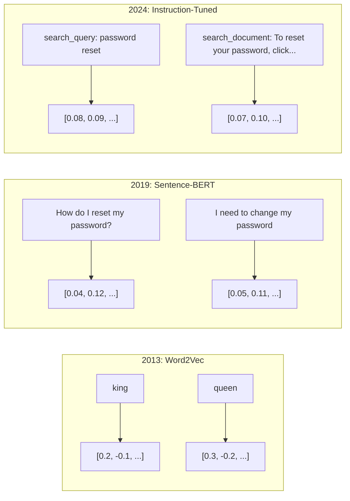
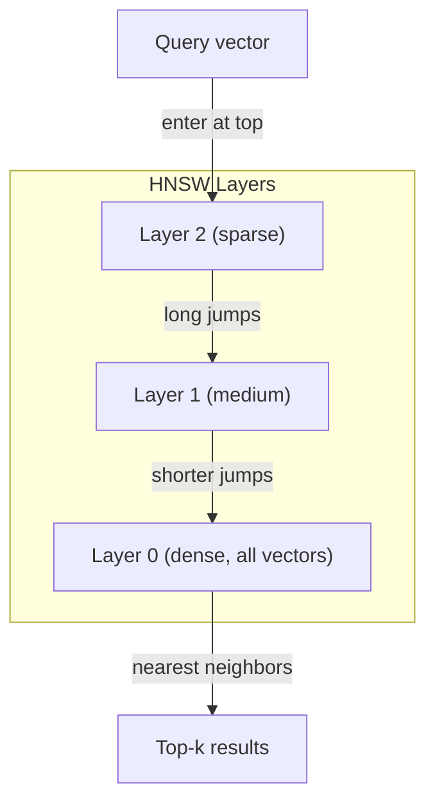
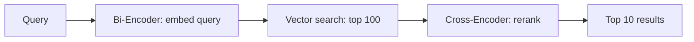

# Embeddings & Vector Representations

> Văn bản là rời rạc. Toán học là liên tục. Mỗi khi bạn yêu cầu một LLM tìm các tài liệu "tương tự", so sánh ý nghĩa hoặc tìm kiếm vượt ra ngoài các từ khóa, bạn đang dựa vào một cây cầu nối giữa hai thế giới này. Cây cầu đó chính là embedding. Nếu bạn không hiểu về embedding, bạn không thực sự hiểu AI hiện đại. Bạn chỉ đang sử dụng nó mà thôi.

**Type:** Build
**Languages:** Python
**Prerequisites:** Phase 11, Lesson 01 (Prompt Engineering)
**Time:** ~75 phút
**Related:** Phase 5 · 22 (Embedding Models Deep Dive) bao gồm các nội dung về dense vs sparse vs multi-vector, Matryoshka truncation và cách chọn mô hình theo từng trục. Bài học này tập trung vào pipeline sản xuất (vector DB, HNSW, toán học về độ tương đồng). Hãy đọc Phase 5 · 22 trước khi chọn mô hình.

## Mục tiêu học tập

- Tạo text embedding bằng các nhà cung cấp API và các mô hình mã nguồn mở, đồng thời tính toán cosine similarity giữa chúng.
- Giải thích lý do tại sao embedding giải quyết được vấn đề lệch từ vựng (vocabulary mismatch) mà tìm kiếm theo từ khóa không thể xử lý.
- Xây dựng một chỉ mục tìm kiếm ngữ nghĩa (semantic search index) giúp truy xuất tài liệu theo ý nghĩa thay vì khớp từ khóa chính xác.
- Đánh giá chất lượng embedding bằng các benchmark truy xuất (precision@k, recall) và chọn mô hình embedding phù hợp cho tác vụ của bạn.

## Vấn đề

Bạn có 10.000 phiếu hỗ trợ khách hàng. Một khách hàng viết "thanh toán của tôi không thực hiện được". Bạn cần tìm các phiếu cũ tương tự. Tìm kiếm theo từ khóa sẽ tìm các phiếu chứa "thanh toán" và "không thực hiện được". Nó sẽ bỏ lỡ các phiếu như "giao dịch thất bại", "thẻ bị từ chối" và "lỗi thanh toán". Những phiếu này mô tả cùng một vấn đề nhưng bằng các từ ngữ hoàn toàn khác nhau.

Đây là vấn đề lệch từ vựng. Ngôn ngữ con người có hàng chục cách để diễn đạt cùng một ý. Tìm kiếm theo từ khóa coi mỗi từ là một ký hiệu độc lập không có ý nghĩa. Nó không thể biết rằng "bị từ chối" và "không thực hiện được" cùng chỉ về một khái niệm.

Bạn cần một cách biểu diễn văn bản mà ở đó ý nghĩa, chứ không phải cách viết, quyết định sự tương đồng. Bạn cần một cách để đặt "thanh toán của tôi không thực hiện được" và "giao dịch đã bị từ chối" gần nhau trong một không gian toán học, đồng thời đẩy "thanh toán của tôi đã đến đúng hạn" ra xa dù chúng có chung từ "thanh toán".

Cách biểu diễn đó chính là embedding.

## Khái niệm

### Embedding là gì?

Embedding là một vector dày đặc (dense vector) gồm các số dấu phẩy động đại diện cho ý nghĩa của văn bản. Từ "dày đặc" rất quan trọng -- mỗi chiều đều mang thông tin, khác với các biểu diễn thưa (sparse representations) như bag-of-words hay TF-IDF, nơi mà hầu hết các chiều đều bằng không.

"The cat sat on the mat" trở thành một thứ gì đó như `[0.023, -0.041, 0.087, ..., 0.012]` -- một danh sách từ 768 đến 3072 con số tùy thuộc vào mô hình. Những con số này mã hóa ý nghĩa. Bạn không bao giờ kiểm tra chúng trực tiếp. Bạn so sánh chúng.

### Bước đột phá Word2Vec

Năm 2013, Tomas Mikolov và các đồng nghiệp tại Google đã công bố Word2Vec. Ý tưởng cốt lõi: huấn luyện một mạng thần kinh để dự đoán một từ từ các từ lân cận (hoặc ngược lại), và trọng số của lớp ẩn trở thành các biểu diễn vector có ý nghĩa.

Kết quả nổi tiếng:

```
king - man + woman = queen
```

Phép toán vector trên word embedding nắm bắt được các mối quan hệ ngữ nghĩa. Hướng từ "đàn ông" đến "phụ nữ" gần như tương đương với hướng từ "vua" đến "hoàng hậu". Đây là thời điểm lĩnh vực này nhận ra rằng hình học có thể mã hóa ý nghĩa.

Word2Vec tạo ra các vector 300 chiều. Mỗi từ nhận được một vector bất kể ngữ cảnh. "Bank" trong "river bank" (bờ sông) và "bank account" (tài khoản ngân hàng) có cùng một embedding. Hạn chế này đã thúc đẩy nghiên cứu trong thập kỷ tiếp theo.

### Từ từ ngữ đến câu văn

Word embedding đại diện cho các token đơn lẻ. Các hệ thống sản xuất cần nhúng cả câu, đoạn văn hoặc tài liệu. Bốn phương pháp đã xuất hiện:

**Averaging (Lấy trung bình)**: lấy trung bình của tất cả các vector từ trong câu. Rẻ, mất mát thông tin, nhưng khá ổn cho văn bản ngắn. Mất hoàn toàn thứ tự từ -- "chó cắn người" và "người cắn chó" sẽ có embedding giống hệt nhau.

**CLS token**: các mô hình transformer (BERT, 2018) xuất ra một embedding đặc biệt cho token [CLS] đại diện cho toàn bộ đầu vào. Tốt hơn so với lấy trung bình, nhưng token [CLS] được huấn luyện để dự đoán câu tiếp theo, không phải để đo độ tương đồng.

**Contrastive learning (Học tương phản)**: huấn luyện mô hình một cách rõ ràng để kéo các cặp tương tự lại gần nhau và đẩy các cặp không tương tự ra xa. Sentence-BERT (Reimers & Gurevych, 2019) đã sử dụng phương pháp này và trở thành nền tảng cho các mô hình embedding hiện đại. Với "Làm thế nào để đặt lại mật khẩu?" và "Tôi cần thay đổi mật khẩu", mô hình học được rằng chúng nên có các vector gần như giống hệt nhau.

**Instruction-tuned embeddings (Embedding được tinh chỉnh theo hướng dẫn)**: phương pháp mới nhất. Các mô hình như E5 và GTE chấp nhận một tiền tố tác vụ ("search_query:", "search_document:") để cho mô hình biết loại embedding nào cần tạo ra. Điều này cho phép một mô hình phục vụ nhiều tác vụ.



### Các mô hình Embedding hiện đại

Thị trường đã ổn định với một số lựa chọn cấp sản xuất (điểm MTEB tính đến đầu năm 2026, MTEB v2):

| Mô hình | Nhà cung cấp | Số chiều | MTEB | Context | Chi phí / 1M tokens |
|-------|----------|-----------|------|---------|------------------|
| Gemini Embedding 2 | Google | 3072 (Matryoshka) | 67.7 (retrieval) | 8192 | $0.15 |
| embed-v4 | Cohere | 1024 (Matryoshka) | 65.2 | 128K | $0.12 |
| voyage-4 | Voyage AI | 1024/2048 (Matryoshka) | 66.8 | 32K | $0.12 |
| text-embedding-3-large | OpenAI | 3072 (Matryoshka) | 64.6 | 8192 | $0.13 |
| text-embedding-3-small | OpenAI | 1536 (Matryoshka) | 62.3 | 8192 | $0.02 |
| BGE-M3 | BAAI | 1024 (dense+sparse+ColBERT) | 63.0 đa ngôn ngữ | 8192 | Open-weight |
| Qwen3-Embedding | Alibaba | 4096 (Matryoshka) | 66.9 | 32K | Open-weight |
| Nomic-embed-v2 | Nomic | 768 (Matryoshka) | 63.1 | 8192 | Open-weight |

MTEB (Massive Text Embedding Benchmark) v2 bao gồm hơn 100 tác vụ trên các lĩnh vực truy xuất, phân loại, phân cụm, xếp hạng lại và tóm tắt. Điểm càng cao càng tốt. Đến năm 2026, các mô hình open-weight (Qwen3-Embedding, BGE-M3) đã ngang bằng hoặc vượt qua các mô hình đóng trên hầu hết các trục. Gemini Embedding 2 dẫn đầu về truy xuất thuần túy; Voyage/Cohere dẫn đầu trong các lĩnh vực chuyên biệt (tài chính, luật, mã nguồn). Luôn luôn benchmark trên các truy vấn của riêng bạn trước khi quyết định.

### Các thước đo độ tương đồng

Với hai vector embedding, có ba cách để đo độ tương đồng:

**Cosine similarity**: cosin của góc giữa hai vector. Dao động từ -1 (đối nghịch) đến 1 (cùng hướng). Bỏ qua độ lớn -- một câu 10 từ và một tài liệu 500 từ có thể đạt điểm 1.0 nếu chúng cùng hướng. Đây là mặc định cho 90% các trường hợp sử dụng.

```
cosine_sim(a, b) = dot(a, b) / (||a|| * ||b||)
```

**Dot product**: tích vô hướng của hai vector. Giống hệt cosine similarity khi các vector đã được chuẩn hóa (độ dài đơn vị). Tính toán nhanh hơn. Embedding của OpenAI đã được chuẩn hóa, vì vậy dot product và cosine cho kết quả xếp hạng như nhau.

```
dot(a, b) = sum(a_i * b_i)
```

**Euclidean (L2) distance**: khoảng cách đường thẳng trong không gian vector. Nhỏ hơn = tương đồng hơn. Nhạy cảm với sự khác biệt về độ lớn. Sử dụng khi vị trí tuyệt đối trong không gian quan trọng, không chỉ là hướng.

```
L2(a, b) = sqrt(sum((a_i - b_i)^2))
```

Khi nào sử dụng thước đo nào:

| Thước đo | Sử dụng khi | Tránh khi |
|--------|----------|------------|
| Cosine similarity | So sánh văn bản có độ dài khác nhau; hầu hết các tác vụ truy xuất | Độ lớn mang thông tin quan trọng |
| Dot product | Embedding đã được chuẩn hóa; cần tốc độ tối đa | Vector có độ lớn thay đổi |
| Euclidean distance | Phân cụm; các bài toán tìm kiếm láng giềng gần nhất trong không gian | So sánh tài liệu có độ dài chênh lệch lớn |

### Vector Databases và HNSW

Tìm kiếm tương đồng vét cạn (brute-force) so sánh truy vấn với mọi vector được lưu trữ. Với 1 triệu vector 1536 chiều, đó là 1,5 tỷ phép tính nhân-cộng mỗi truy vấn. Quá chậm.

Vector database giải quyết vấn đề này bằng các thuật toán Approximate Nearest Neighbor (ANN). Thuật toán thống trị là HNSW (Hierarchical Navigable Small World):

1. Xây dựng một đồ thị đa tầng của các vector.
2. Các tầng trên thưa thớt -- các kết nối tầm xa giữa các cụm xa nhau.
3. Các tầng dưới dày đặc -- các kết nối chi tiết giữa các vector gần nhau.
4. Tìm kiếm bắt đầu từ tầng trên cùng, đi xuống một cách tham lam để tinh chỉnh.
5. Trả về kết quả top-k xấp xỉ trong thời gian O(log n) thay vì O(n).

HNSW đánh đổi một chút độ chính xác (thường là 95-99% recall) để đạt được tốc độ cực nhanh. Với 10 triệu vector, brute force mất vài giây. HNSW chỉ mất vài mili giây.



Các lựa chọn sản xuất:

| Database | Loại | Tốt nhất cho | Quy mô tối đa |
|----------|------|----------|-----------|
| Pinecone | Managed SaaS | Sản xuất không cần vận hành | Hàng tỷ |
| Weaviate | Open source | Tự lưu trữ, tìm kiếm lai | 100M+ |
| Qdrant | Open source | Hiệu năng cao, lọc dữ liệu | 100M+ |
| ChromaDB | Embedded | Tạo mẫu, phát triển cục bộ | 1M |
| pgvector | Postgres extension | Đã sử dụng Postgres | 10M |
| FAISS | Library | In-process, nghiên cứu | 1B+ |

### Chiến lược chia nhỏ (Chunking)

Tài liệu quá dài để nhúng thành một vector duy nhất. Một tệp PDF 50 trang bao gồm hàng chục chủ đề -- embedding của nó sẽ trở thành trung bình của mọi thứ, không giống với bất kỳ chủ đề cụ thể nào. Bạn cần chia tài liệu thành các đoạn (chunks) và nhúng từng đoạn.

**Fixed-size chunking**: chia mỗi N token với M token chồng lấp (overlap). Đơn giản và dễ dự đoán. Hoạt động tốt khi tài liệu không có cấu trúc rõ ràng. Một chunk 512 token với 50 token chồng lấp: chunk 1 là token 0-511, chunk 2 là token 462-973.

**Sentence-based chunking**: chia tại ranh giới câu, nhóm các câu cho đến khi đạt giới hạn token. Mỗi chunk ít nhất là một câu hoàn chỉnh. Tốt hơn fixed-size vì bạn không bao giờ cắt ngang một ý tưởng.

**Recursive chunking**: thử chia tại ranh giới lớn nhất trước (tiêu đề mục). Nếu vẫn quá lớn, thử ranh giới đoạn văn. Sau đó là ranh giới câu. Cuối cùng là giới hạn ký tự. Đây là `RecursiveCharacterTextSplitter` của LangChain và nó hoạt động tốt cho các tập dữ liệu hỗn hợp.

**Semantic chunking**: nhúng từng câu, sau đó nhóm các câu liên tiếp có embedding tương tự nhau. Khi độ tương đồng embedding giảm xuống dưới một ngưỡng, bắt đầu một chunk mới. Tốn kém (yêu cầu nhúng từng câu riêng lẻ) nhưng tạo ra các chunk mạch lạc nhất.

| Chiến lược | Độ phức tạp | Chất lượng | Tốt nhất cho |
|----------|-----------|---------|----------|
| Fixed-size | Thấp | Khá | Văn bản phi cấu trúc, log |
| Sentence-based | Thấp | Tốt | Bài báo, email |
| Recursive | Trung bình | Tốt | Markdown, HTML, tài liệu hỗn hợp |
| Semantic | Cao | Tốt nhất | Chất lượng truy xuất quan trọng |

Điểm tối ưu cho hầu hết các hệ thống: chunk 256-512 token với 50 token chồng lấp.

### Bi-Encoders vs Cross-Encoders

Bi-encoder nhúng truy vấn và tài liệu một cách độc lập, sau đó so sánh các vector. Nhanh -- bạn nhúng truy vấn một lần và so sánh với các vector tài liệu đã tính toán trước. Đây là thứ bạn dùng cho truy xuất.

Cross-encoder lấy truy vấn và tài liệu làm đầu vào duy nhất và xuất ra điểm liên quan. Chậm -- nó xử lý từng cặp truy vấn-tài liệu thông qua toàn bộ mô hình. Nhưng chính xác hơn nhiều vì nó có thể chú ý (attend) đồng thời qua các token của truy vấn và tài liệu.

Mô hình sản xuất: bi-encoder truy xuất 100 ứng viên hàng đầu, cross-encoder xếp hạng lại chúng thành top-10. Đây là pipeline retrieve-then-rerank.



Các mô hình reranking: Cohere Rerank 3.5 ($2 cho 1000 truy vấn), BGE-reranker-v2 (miễn phí, open source), Jina Reranker v2 (miễn phí, open source).

### Matryoshka Embeddings

Embedding truyền thống là tất cả hoặc không có gì. Một vector 1536 chiều sử dụng 1536 số thực. Bạn không thể cắt giảm xuống 256 chiều mà không cần huấn luyện lại.

Matryoshka Representation Learning (Kusupati et al., 2022) khắc phục điều này. Mô hình được huấn luyện sao cho N chiều đầu tiên nắm bắt thông tin quan trọng nhất, giống như búp bê Nga. Việc cắt giảm một embedding Matryoshka 1536 chiều xuống 256 chiều sẽ mất một chút độ chính xác nhưng vẫn hoạt động tốt.

Các mô hình text-embedding-3-small và text-embedding-3-large của OpenAI hỗ trợ cắt giảm Matryoshka thông qua tham số `dimensions`. Yêu cầu 256 chiều thay vì 1536 giúp giảm dung lượng lưu trữ gấp 6 lần với độ chính xác giảm khoảng 3-5% trên các benchmark MTEB.

### Binary Quantization

Một embedding 1536 chiều được lưu dưới dạng float32 sử dụng 6.144 byte. Nhân với 10 triệu tài liệu: 61 GB chỉ dành cho các vector.

Binary quantization chuyển đổi mỗi số thực thành một bit duy nhất: giá trị dương thành 1, giá trị âm thành 0. Dung lượng lưu trữ giảm từ 6.144 byte xuống 192 byte -- giảm 32 lần. Độ tương đồng được tính bằng Hamming distance (đếm các bit khác nhau), thứ mà CPU có thể thực hiện trong một lệnh duy nhất.

Mức độ giảm độ chính xác là khoảng 5-10% trên recall truy xuất. Mô hình phổ biến: binary quantization cho lần tìm kiếm đầu tiên trên hàng triệu vector, sau đó tính điểm lại top-1000 với các vector độ chính xác đầy đủ. Điều này giúp bạn đạt được 95%+ độ chính xác của full-precision với bộ nhớ ít hơn 32 lần.

```figure
cosine-similarity
```

## Xây dựng

Chúng ta sẽ xây dựng một công cụ tìm kiếm ngữ nghĩa từ đầu. Không vector database. Không API embedding bên ngoài. Python thuần với numpy cho toán học.

### Bước 1: Chia nhỏ văn bản (Text Chunking)

```python
def chunk_text(text, chunk_size=200, overlap=50):
    words = text.split()
    chunks = []
    start = 0
    while start < len(words):
        end = start + chunk_size
        chunk = " ".join(words[start:end])
        chunks.append(chunk)
        start += chunk_size - overlap
    return chunks


def chunk_by_sentences(text, max_chunk_tokens=200):
    sentences = text.replace("\n", " ").split(".")
    sentences = [s.strip() + "." for s in sentences if s.strip()]
    chunks = []
    current_chunk = []
    current_length = 0
    for sentence in sentences:
        sentence_length = len(sentence.split())
        if current_length + sentence_length > max_chunk_tokens and current_chunk:
            chunks.append(" ".join(current_chunk))
            current_chunk = []
            current_length = 0
        current_chunk.append(sentence)
        current_length += sentence_length
    if current_chunk:
        chunks.append(" ".join(current_chunk))
    return chunks
```

### Bước 2: Xây dựng Embeddings từ đầu

Chúng ta triển khai một dense embedding đơn giản bằng TF-IDF với chuẩn hóa L2. Đây không phải là neural embedding, nhưng nó tuân theo cùng một hợp đồng: đầu vào là văn bản, đầu ra là vector cố định, các văn bản tương tự tạo ra các vector tương tự.

```python
import math
import numpy as np
from collections import Counter

class SimpleEmbedder:
    def __init__(self):
        self.vocab = []
        self.idf = []
        self.word_to_idx = {}

    def fit(self, documents):
        vocab_set = set()
        for doc in documents:
            vocab_set.update(doc.lower().split())
        self.vocab = sorted(vocab_set)
        self.word_to_idx = {w: i for i, w in enumerate(self.vocab)}
        n = len(documents)
        self.idf = np.zeros(len(self.vocab))
        for i, word in enumerate(self.vocab):
            doc_count = sum(1 for doc in documents if word in doc.lower().split())
            self.idf[i] = math.log((n + 1) / (doc_count + 1)) + 1

    def embed(self, text):
        words = text.lower().split()
        count = Counter(words)
        total = len(words) if words else 1
        vec = np.zeros(len(self.vocab))
        for word, freq in count.items():
            if word in self.word_to_idx:
                tf = freq / total
                vec[self.word_to_idx[word]] = tf * self.idf[self.word_to_idx[word]]
        norm = np.linalg.norm(vec)
        if norm > 0:
            vec = vec / norm
        return vec
```

### Bước 3: Các hàm tương đồng

```python
def cosine_similarity(a, b):
    dot = np.dot(a, b)
    norm_a = np.linalg.norm(a)
    norm_b = np.linalg.norm(b)
    if norm_a == 0 or norm_b == 0:
        return 0.0
    return float(dot / (norm_a * norm_b))


def dot_product(a, b):
    return float(np.dot(a, b))


def euclidean_distance(a, b):
    return float(np.linalg.norm(a - b))
```

### Bước 4: Vector Index với tìm kiếm Brute-Force

```python
class VectorIndex:
    def __init__(self):
        self.vectors = []
        self.texts = []
        self.metadata = []

    def add(self, vector, text, meta=None):
        self.vectors.append(vector)
        self.texts.append(text)
        self.metadata.append(meta or {})

    def search(self, query_vector, top_k=5, metric="cosine"):
        scores = []
        for i, vec in enumerate(self.vectors):
            if metric == "cosine":
                score = cosine_similarity(query_vector, vec)
            elif metric == "dot":
                score = dot_product(query_vector, vec)
            elif metric == "euclidean":
                score = -euclidean_distance(query_vector, vec)
            else:
                raise ValueError(f"Unknown metric: {metric}")
            scores.append((i, score))
        scores.sort(key=lambda x: x[1], reverse=True)
        results = []
        for idx, score in scores[:top_k]:
            results.append({
                "text": self.texts[idx],
                "score": score,
                "metadata": self.metadata[idx],
                "index": idx
            })
        return results

    def size(self):
        return len(self.vectors)
```

### Bước 5: Công cụ tìm kiếm ngữ nghĩa

```python
class SemanticSearchEngine:
    def __init__(self, chunk_size=200, overlap=50):
        self.embedder = SimpleEmbedder()
        self.index = VectorIndex()
        self.chunk_size = chunk_size
        self.overlap = overlap

    def index_documents(self, documents, source_names=None):
        all_chunks = []
        all_sources = []
        for i, doc in enumerate(documents):
            chunks = chunk_text(doc, self.chunk_size, self.overlap)
            all_chunks.extend(chunks)
            name = source_names[i] if source_names else f"doc_{i}"
            all_sources.extend([name] * len(chunks))
        self.embedder.fit(all_chunks)
        for chunk, source in zip(all_chunks, all_sources):
            vec = self.embedder.embed(chunk)
            self.index.add(vec, chunk, {"source": source})
        return len(all_chunks)

    def search(self, query, top_k=5, metric="cosine"):
        query_vec = self.embedder.embed(query)
        return self.index.search(query_vec, top_k, metric)

    def search_with_scores(self, query, top_k=5):
        results = self.search(query, top_k)
        return [
            {
                "text": r["text"][:200],
                "source": r["metadata"].get("source", "unknown"),
                "score": round(r["score"], 4)
            }
            for r in results
        ]
```

### Bước 6: So sánh các thước đo tương đồng

```python
def compare_metrics(engine, query, top_k=3):
    results = {}
    for metric in ["cosine", "dot", "euclidean"]:
        hits = engine.search(query, top_k=top_k, metric=metric)
        results[metric] = [
            {"score": round(h["score"], 4), "preview": h["text"][:80]}
            for h in hits
        ]
    return results
```

## Sử dụng

Với một API embedding sản xuất, kiến trúc vẫn giữ nguyên. Chỉ có bộ nhúng (embedder) thay đổi:

```python
from openai import OpenAI

client = OpenAI()

def openai_embed(texts, model="text-embedding-3-small", dimensions=None):
    kwargs = {"model": model, "input": texts}
    if dimensions:
        kwargs["dimensions"] = dimensions
    response = client.embeddings.create(**kwargs)
    return [item.embedding for item in response.data]
```

Cắt giảm Matryoshka với OpenAI -- cùng một mô hình, ít chiều hơn, lưu trữ thấp hơn:

```python
full = openai_embed(["semantic search query"], dimensions=1536)
compact = openai_embed(["semantic search query"], dimensions=256)
```

Vector 256 chiều sử dụng ít lưu trữ hơn 6 lần. Với 10 triệu tài liệu, đó là 10 GB so với 61 GB. Độ chính xác giảm khoảng 3-5% trên các benchmark tiêu chuẩn.

Để xếp hạng lại với Cohere:

```python
import cohere

co = cohere.ClientV2()

results = co.rerank(
    model="rerank-v3.5",
    query="What is the refund policy?",
    documents=["Full refund within 30 days...", "No refunds after 90 days..."],
    top_n=3
)
```

Đối với embedding cục bộ không phụ thuộc API:

```python
from sentence_transformers import SentenceTransformer

model = SentenceTransformer("BAAI/bge-small-en-v1.5")
embeddings = model.encode(["semantic search query", "another document"])
```

Lớp VectorIndex từ phần xây dựng của chúng ta hoạt động với bất kỳ lựa chọn nào trong số này. Thay đổi hàm embedding, giữ nguyên logic tìm kiếm.

## Triển khai

Bài học này tạo ra:
- `outputs/prompt-embedding-advisor.md` -- một prompt để chọn các mô hình embedding và chiến lược cho các trường hợp sử dụng cụ thể.
- `outputs/skill-embedding-patterns.md` -- một kỹ năng dạy các agent cách sử dụng embedding hiệu quả trong sản xuất.

## Bài tập

1. **So sánh thước đo**: chạy 5 truy vấn giống nhau trên các tài liệu mẫu bằng cosine similarity, dot product và euclidean distance. Ghi lại 3 kết quả hàng đầu cho mỗi loại. Với truy vấn nào các thước đo không đồng nhất? Tại sao?

2. **Thí nghiệm kích thước chunk**: index các tài liệu mẫu với kích thước chunk là 50, 100, 200 và 500 từ. Với mỗi loại, chạy 5 truy vấn và ghi lại điểm tương đồng top-1. Vẽ biểu đồ mối quan hệ giữa kích thước chunk và chất lượng truy xuất. Tìm điểm mà tại đó các chunk lớn hơn bắt đầu gây hại.

3. **Mô phỏng Matryoshka**: xây dựng một SimpleEmbedder tạo ra các vector 500 chiều. Cắt giảm xuống 50, 100, 200 và 500 chiều. Đo lường mức độ suy giảm recall truy xuất tại mỗi lần cắt. Điều này mô phỏng hành vi Matryoshka mà không cần thủ thuật huấn luyện thực tế.

4. **Binary quantization**: lấy các embedding từ công cụ tìm kiếm, chuyển đổi chúng sang nhị phân (1 nếu dương, 0 nếu âm) và triển khai tìm kiếm Hamming distance. So sánh 10 kết quả hàng đầu với cosine similarity full-precision. Đo lường tỷ lệ phần trăm trùng lặp.

5. **Sentence-based chunking**: thay thế fixed-size chunking bằng `chunk_by_sentences`. Chạy các truy vấn tương tự và so sánh điểm truy xuất. Việc tôn trọng ranh giới câu có cải thiện kết quả không?

## Thuật ngữ chính

| Thuật ngữ | Mọi người nói | Ý nghĩa thực tế |
|------|----------------|----------------------|
| Embedding | "Văn bản thành số" | Một vector dày đặc nơi sự gần gũi về hình học mã hóa sự tương đồng ngữ nghĩa |
| Word2Vec | "Embedding đời đầu" | Mô hình 2013 học vector từ bằng cách dự đoán từ ngữ cảnh; chứng minh phép toán vector mã hóa ý nghĩa |
| Cosine similarity | "Hai vector giống nhau thế nào" | Cosin của góc giữa các vector; 1 = hướng giống hệt, 0 = vuông góc, -1 = đối nghịch |
| HNSW | "Tìm kiếm vector nhanh" | Đồ thị Hierarchical Navigable Small World -- cấu trúc đa tầng cho phép tìm kiếm láng giềng gần nhất xấp xỉ O(log n) |
| Bi-encoder | "Nhúng riêng, so sánh nhanh" | Nhúng truy vấn và tài liệu độc lập thành vector; cho phép tính toán trước và truy xuất nhanh |
| Cross-encoder | "Xếp hạng lại chậm nhưng chính xác" | Xử lý cặp truy vấn-tài liệu cùng nhau qua toàn bộ mô hình; độ chính xác cao hơn, không tính toán trước |
| Matryoshka embeddings | "Vector có thể cắt giảm" | Embedding được huấn luyện để N chiều đầu tiên nắm bắt thông tin quan trọng nhất, cho phép lưu trữ kích thước biến đổi |
| Binary quantization | "Embedding 1-bit" | Chuyển đổi vector số thực sang nhị phân (chỉ bit dấu) để giảm 32 lần lưu trữ với tìm kiếm Hamming distance |
| Chunking | "Chia tài liệu để nhúng" | Chia tài liệu thành các đoạn 256-512 token để mỗi đoạn có thể được nhúng và truy xuất độc lập |
| Vector database | "Công cụ tìm kiếm cho embedding" | Kho dữ liệu tối ưu hóa để lưu trữ vector và thực hiện tìm kiếm láng giềng gần nhất xấp xỉ ở quy mô lớn |
| Contrastive learning | "Huấn luyện bằng so sánh" | Phương pháp huấn luyện đẩy các embedding cặp tương tự lại gần nhau và cặp không tương tự ra xa |
| MTEB | "Benchmark embedding" | Massive Text Embedding Benchmark -- 56 tập dữ liệu trên 8 tác vụ; tiêu chuẩn để so sánh các mô hình embedding |

## Đọc thêm

- Mikolov et al., "Efficient Estimation of Word Representations in Vector Space" (2013) -- bài báo Word2Vec khởi đầu cuộc cách mạng embedding với phép ẩn dụ vua-hoàng hậu.
- Reimers & Gurevych, "Sentence-BERT: Sentence Embeddings using Siamese BERT-Networks" (2019) -- cách huấn luyện bi-encoder cho sự tương đồng cấp câu, nền tảng của các mô hình embedding hiện đại.
- Kusupati et al., "Matryoshka Representation Learning" (2022) -- kỹ thuật đằng sau các embedding biến đổi số chiều mà OpenAI đã áp dụng cho text-embedding-3.
- Malkov & Yashunin, "Efficient and Robust Approximate Nearest Neighbor using Hierarchical Navigable Small World Graphs" (2018) -- bài báo HNSW, thuật toán đằng sau hầu hết các tìm kiếm vector sản xuất.
- OpenAI Embeddings Guide (platform.openai.com/docs/guides/embeddings) -- tài liệu tham khảo thực tế cho các mô hình text-embedding-3 bao gồm giảm chiều Matryoshka.
- MTEB Leaderboard (huggingface.co/spaces/mteb/leaderboard) -- bảng xếp hạng trực tiếp so sánh tất cả các mô hình embedding trên các tác vụ và ngôn ngữ.
- [Muennighoff et al., "MTEB: Massive Text Embedding Benchmark" (EACL 2023)](https://arxiv.org/abs/2210.07316) -- benchmark định nghĩa 8 danh mục tác vụ (phân loại, phân cụm, phân loại cặp, xếp hạng lại, truy xuất, STS, tóm tắt, khai thác song ngữ) mà bảng xếp hạng báo cáo; hãy đọc trước khi tin tưởng bất kỳ điểm số MTEB đơn lẻ nào.
- [Sentence Transformers documentation](https://www.sbert.net/) -- tài liệu tham khảo chính thống cho bi-encoder vs cross-encoder, các chiến lược pooling và pipeline RAG ingest-split-embed-store mà bài học này triển khai.